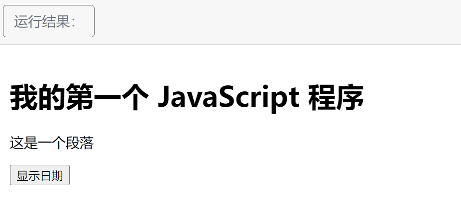
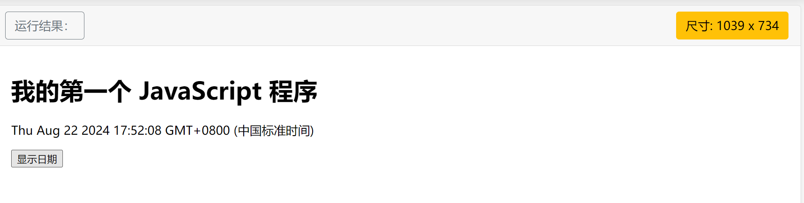

# 介绍

> 来自 https://www.runoob.com/js/js-tutorial.html


## JavaScript 在线实例

本教程包含了大量的 JavaScript 实例， 您可以点击 "尝试一下" 来在线查看实例。

```html
<!DOCTYPE html>
<html>
<head>
<meta charset="utf-8">
<title>菜鸟教程(runoob.com)</title>
<script>
function displayDate(){
	document.getElementById("demo").innerHTML=Date();
}
</script>
</head>
<body>

<h1>我的第一个 JavaScript 程序</h1>
<p id="demo">这是一个段落</p>

<button type="button" onclick="displayDate()">显示日期</button>

</body>
</html>
```

==》





## 为什么学习 JavaScript?

JavaScript 是 web 开发人员必须学习的 3 门语言中的一门：

1. **HTML** 定义了网页的内容
2. **CSS** 描述了网页的布局
3. **JavaScript** 控制了网页的行为

本教程是关于 JavaScript 及介绍 JavaScript 如何与 HTML 和 CSS 一起工作。


## 谁适合阅读本教程?

1. 如果您想学习 JavaScript，您可以学习本教程：

了解 JavaScript 是如何与 HTML 和 CSS 一起工作的。

2. 如果在此之前您已经使用过 JavaScript，您也可以阅读本教程：

JavaScript 一直在升级，所以我们需要时刻了解 JavaScript 的新技术。


## 阅读本教程前，您需要了解的知识：

阅读本教程，您需要有以下基础：

- [HTML 教程](https://www.runoob.com/html/html-tutorial.html)
- [CSS 教程](https://www.runoob.com/css/css-tutorial.html)

## JavaScript 实例

学习 100 多个 JavaScript 实例！

在实例页面中，您可以点击 "尝试一下" 来查看 JavaScript 在线实例。

- [JavaScript 实例](https://www.runoob.com/js/js-examples.html)
- [JavaScript 对象实例](https://www.runoob.com/js/js-ex-objects.html)
- [JavaScript 浏览器支持实例](https://www.runoob.com/js/js-ex-browser.html)
- [JavaScript HTML DOM 实例](https://www.runoob.com/js/js-ex-dom.html)


## JavaScript 测验

在菜鸟教程中测试您的 JavaScript 技能！

[JavaScript 测验](https://www.runoob.com/quiz/javascript-quiz.html)


## JavaScript 参考手册

在菜鸟教程中，我们为您提供完整的 JavaScript 对象、浏览器对象、HTML DOM 对象参考手册。

以下手册包含了每个对象、属性、方法的实例。

- [JavaScript 内置对象](https://www.runoob.com/jsref/jsref-tutorial.html)
- [Browser 对象](https://www.runoob.com/jsref/jsref-tutorial.html)
- [HTML DOM 对象](https://www.runoob.com/jsref/jsref-tutorial.html)

## HTML/CSS/JS 在线工具

HTML/CSS/JS 在线工具可以在线编辑 HTML、CSS、JS 代码，并实时查看效果，你也可以将优质代码保存分享：https://c.runoob.com/front-end/61


# JavaScript 简介

JavaScript 是互联网上最流行的脚本语言，这门语言可用于 HTML 和 web，更可广泛用于服务器、PC、笔记本电脑、平板电脑和智能手机等设备。


## JavaScript 是脚本语言

JavaScript 是一种轻量级的编程语言。

**JavaScript 是可插入 HTML 页面的编程代码**。

JavaScript 插入 HTML 页面后，可由所有的现代浏览器执行。

JavaScript 很容易学习。


## 您将学到什么

下面是您将在本教程中学到的主要内容。