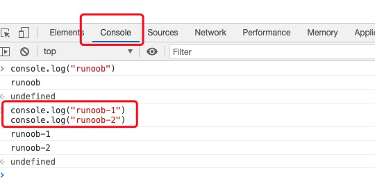
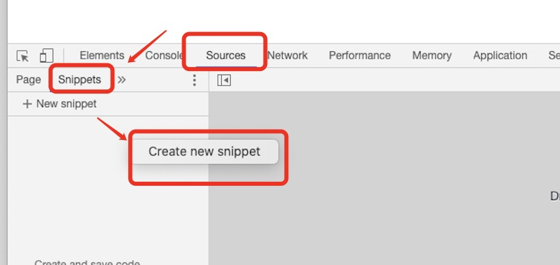

# 介绍

> 来自 https://www.runoob.com/js/js-tutorial.html


## JavaScript 在线实例

本教程包含了大量的 JavaScript 实例， 您可以点击 "尝试一下" 来在线查看实例。

```html
<!DOCTYPE html>
<html>
<head>
<meta charset="utf-8">
<title>菜鸟教程(runoob.com)</title>
<script>
function displayDate(){
	document.getElementById("demo").innerHTML=Date();
}
</script>
</head>
<body>

<h1>我的第一个 JavaScript 程序</h1>
<p id="demo">这是一个段落</p>

<button type="button" onclick="displayDate()">显示日期</button>

</body>
</html>
```

==》


## 为什么学习 JavaScript?

JavaScript 是 web 开发人员必须学习的 3 门语言中的一门：

1. **HTML** 定义了网页的内容
2. **CSS** 描述了网页的布局
3. **JavaScript** 控制了网页的行为

本教程是关于 JavaScript 及介绍 JavaScript 如何与 HTML 和 CSS 一起工作。


## 谁适合阅读本教程?

1. 如果您想学习 JavaScript，您可以学习本教程：

了解 JavaScript 是如何与 HTML 和 CSS 一起工作的。

2. 如果在此之前您已经使用过 JavaScript，您也可以阅读本教程：

JavaScript 一直在升级，所以我们需要时刻了解 JavaScript 的新技术。


## 阅读本教程前，您需要了解的知识：

阅读本教程，您需要有以下基础：

- [HTML 教程](https://www.runoob.com/html/html-tutorial.html)
- [CSS 教程](https://www.runoob.com/css/css-tutorial.html)

## JavaScript 实例

学习 100 多个 JavaScript 实例！

在实例页面中，您可以点击 "尝试一下" 来查看 JavaScript 在线实例。

- [JavaScript 实例](https://www.runoob.com/js/js-examples.html)
- [JavaScript 对象实例](https://www.runoob.com/js/js-ex-objects.html)
- [JavaScript 浏览器支持实例](https://www.runoob.com/js/js-ex-browser.html)
- [JavaScript HTML DOM 实例](https://www.runoob.com/js/js-ex-dom.html)


## JavaScript 测验

在菜鸟教程中测试您的 JavaScript 技能！

[JavaScript 测验](https://www.runoob.com/quiz/javascript-quiz.html)


## JavaScript 参考手册

在菜鸟教程中，我们为您提供完整的 JavaScript 对象、浏览器对象、HTML DOM 对象参考手册。

以下手册包含了每个对象、属性、方法的实例。

- [JavaScript 内置对象](https://www.runoob.com/jsref/jsref-tutorial.html)
- [Browser 对象](https://www.runoob.com/jsref/jsref-tutorial.html)
- [HTML DOM 对象](https://www.runoob.com/jsref/jsref-tutorial.html)

## HTML/CSS/JS 在线工具

HTML/CSS/JS 在线工具可以在线编辑 HTML、CSS、JS 代码，并实时查看效果，你也可以将优质代码保存分享：https://c.runoob.com/front-end/61


# JavaScript 简介

JavaScript 是互联网上最流行的脚本语言，这门语言可用于 HTML 和 web，更可广泛用于服务器、PC、笔记本电脑、平板电脑和智能手机等设备。


## JavaScript 是脚本语言

JavaScript 是一种轻量级的编程语言。

**JavaScript 是可插入 HTML 页面的编程代码**。

JavaScript 插入 HTML 页面后，可由所有的现代浏览器执行。

JavaScript 很容易学习。

> JavaScript 与 Java 是两种完全不同的语言，无论在概念上还是设计上。 Java（由 Sun 发明）是更复杂的编程语言。  ECMA-262 是 JavaScript 标准的官方名称。  JavaScript 由 Brendan Eich 发明。它于 1995 年出现在 Netscape 中（该浏览器已停止更新），并于 1997 年被 ECMA（一个标准协会）采纳。


## 您将学到什么

下面是您将在本教程中学到的主要内容。

- JavaScript：直接写入 HTML 输出流

```
	<script>
		document.write("<h1>这是一个标题</h1>");
		document.write("<p>这是一个段落。</p>");
	</script>
```


 您只能在 HTML 输出中使用 document.write。如果您在文档加载后使用该方法，会覆盖整个文档。

```js
	<script>
		function myfunction(){
			document.write("使用函数来执行document.write，即在文档加载后再执行这个操作，会实现文档覆盖");
		}
		document.write("<h1>这是一个标题</h1>");
		document.write("<p>这是一个段落。</p>");
	</script>
    <p>
            您只能在 HTML 输出流中使用 <strong>document.write</strong>。
    如果您在文档已加载后使用它（比如在函数中），会覆盖整个文档。
        </p>
    <button type="button" onclick="myfunction()">点击这里</button>
```


- JavaScript：对事件的反应

```
<button type="button" onclick="alert('欢迎!')">点我!</button>
```

alert() 函数在 JavaScript 中并不常用，但它对于代码测试非常方便。

onclick 事件只是您即将在本教程中学到的众多事件之一。


- JavaScript：改变 HTML 内容

```html
<p id="demo">
JavaScript 能改变 HTML 元素的内容。
</p>
<script>
function myFunction()
{
	x=document.getElementById("demo");  // 找到元素
	x.innerHTML="Hello JavaScript!";    // 改变内容
}
</script>
```

您会经常看到 **document.getElementById("*****some id*****")**。这个方法是 HTML DOM 中定义的。

DOM (**D**ocument **O**bject **M**odel)（文档对象模型）是用于访问 HTML 元素的正式 W3C 标准。


- JavaScript：改变 HTML 图像

```html
<script>
function changeImage()
{
    element=document.getElementById('myimage')
    if (element.src.match("bulbon"))
    {
        element.src="/images/pic_bulboff.gif";
    }
    else
    {
        element.src="/images/pic_bulbon.gif";
    }
}
</script>

<p>点击灯泡就可以打开或关闭这盏灯</p>
```


- JavaScript：改变 HTML 样式

```html
<p id="demo">
JavaScript 能改变 HTML 元素的样式。
</p>
<script>
function myFunction()
{
	x=document.getElementById("demo") // 找到元素
	x.style.color="#ff0000";          // 改变样式
}
```


- JavaScript：验证输入

```html
<h1>我的第一段 JavaScript</h1>
<p>请输入数字。如果输入值不是数字，浏览器会弹出提示框。</p>
<input id="demo" type="text">
<script>
function myFunction()
{
	var x=document.getElementById("demo").value;
	if(x==""||isNaN(x))
	{
		alert("不是数字");
	}
}
</script>
<button type="button" onclick="myFunction()">点击这里</button>
```

以上实例只是普通的验证，如果要在生产环境中使用，需要严格判断，如果输入的空格，或者连续空格 isNaN 是判别不出来的。可以添加正则来判断（后续章节会说明）：

```js
<script>
function myFunction()
{
	var x=document.getElementById("demo").value;
	if(isNaN(x)||x.replace(/(^\s*)|(\s*$)/g,"")==""){
		alert("不是数字");
	}
}
</script>
```


## ECMAScript 版本

avaScript 已经由 ECMA（欧洲电脑制造商协会）通过 ECMAScript 实现语言的标准化。

| 年份 | 名称           | 描述                                              |
| :--- | :------------- | :------------------------------------------------ |
| 1997 | ECMAScript 1   | 第一个版本                                        |
| 1998 | ECMAScript 2   | 版本变更                                          |
| 1999 | ECMAScript 3   | 添加正则表达式 添加 try/catch                     |
|      | ECMAScript 4   | 没有发布                                          |
| 2009 | ECMAScript 5   | 添加 "strict mode"，严格模式 添加 JSON 支持       |
| 2011 | ECMAScript 5.1 | 版本变更                                          |
| 2015 | ECMAScript 6   | 添加类和模块                                      |
| 2016 | ECMAScript 7   | 增加指数运算符 (**) 增加 Array.prototype.includes |

> ECMAScript 6 也称为 ECMAScript 2015。
>
> ECMAScript 7 也称为 ECMAScript 2016。


# 基本用法

HTML 中的 **Javascript 脚本**代码必须位于 **<script>** 与 **</script>** 标签之间。

Javascript 脚本代码可被放置在 HTML 页面的 **<body>** 和 **<head>** 部分中。


## script 标签

如需在 HTML 页面中插入 JavaScript，请使用 <script> 标签。

<script> 和 </script> 会告诉 JavaScript 在何处开始和结束。

<script> 和 </script> 之间的代码行包含了 JavaScript:

```
<script>
alert("我的第一个 JavaScript");
</script>
```

您无需理解上面的代码。只需明白，浏览器会解释并执行位于 <script> 和 </script>之间的 JavaScript 代码 

> 那些老旧的实例可能会在 <script> 标签中使用 type="text/javascript"。现在已经不必这样做了。JavaScript 是所有现代浏览器以及 HTML5 中的默认脚本语言。


## body 中的 JavaScript

在本例中，JavaScript 会在页面加载时向 HTML 的 <body> 写文本：

```
<!DOCTYPE html>
<html>
<body>
.
.
<script>
document.write("<h1>这是一个标题</h1>");
document.write("<p>这是一个段落</p>");
</script>
.
.
</body>
</html>
```


## JavaScript 函数和事件

上面例子中的 JavaScript 语句，会在页面加载时执行。

通常，我们需要在某个事件发生时执行代码，比如当用户点击按钮时。

如果我们把 JavaScript 代码放入函数中，就可以在事件发生时调用该函数。

您将在稍后的章节学到更多有关 JavaScript 函数和事件的知识。


## 在 < head> 或者 < body> 的JavaScript

您可以在 HTML 文档中放入不限数量的脚本。

脚本可位于 HTML 的 <body> 或 <head> 部分中，或者同时存在于两个部分中。

通常的做法是把函数放入 <head> 部分中，或者放在页面底部。这样就可以把它们安置到同一处位置，不会干扰页面的内容。


- < head> 中的 JavaScript 函数

在本例中，我们把一个 JavaScript 函数放置到 HTML 页面的 <head> 部分。

该函数会在点击按钮时被调用：

```js
<!DOCTYPE html>
<html>
<head>
<script>
function myFunction()
{
    document.getElementById("demo").innerHTML="我的第一个 JavaScript 函数";
}
</script>
</head>
<body>
<h1>我的 Web 页面</h1>
<p id="demo">一个段落</p>
<button type="button" onclick="myFunction()">尝试一下</button>
</body>
</html>
```


- < body> 中的 JavaScript 函数

在本例中，我们把一个 JavaScript 函数放置到 HTML 页面的 <body> 部分。

该函数会在点击按钮时被调用：

```js
<!DOCTYPE html>
<html>
<head> 
<meta charset="utf-8"> 
<title>菜鸟教程(runoob.com)</title> 
</head>
<body>
	
<h1>我的第一个 Web 页面</h1>
<p id="demo">一个段落。</p>
<button type="button" onclick="myFunction()">点击这里</button>
<script>
function myFunction(){
	document.getElementById("demo").innerHTML="我的第一个 JavaScript 函数";
}
</script>
	
</body>
</html>
```


## 外部的 JavaScript

也可以把脚本保存到外部文件中。外部文件通常包含被多个网页使用的代码。

外部 JavaScript 文件的文件扩展名是 .js。

如需使用外部文件，请在 <script> 标签的 "src" 属性中设置该 .js 文件：

```js
<!DOCTYPE html>
<html>
<head> 
<meta charset="utf-8"> 
<title>菜鸟教程(runoob.com)</title> 
</head>
<body>
	
<h1>我的 Web 页面</h1>
<p id="demo">一个段落。</p>
<button type="button" onclick="myFunction()">点击这里</button>
<p><b>注释：</b>myFunction 保存在名为 "myScript.js" 的外部文件中。</p>
<script src="myScript.js"></script>
	
</body>
</html>
```

> myScript.js

```js
function myFunction()
{
    document.getElementById("demo").innerHTML="我的第一个 JavaScript 函数";
}
```

外部脚本不能包含 <script> 标签。


## js脚本的运行

**node** 是可以运行在 JavaScript 的命令，基于 Chrome V8 引擎的 JavaScript 运行时环境。

更多 Node.js 内容可以参考：[Node.js 教程](https://www.runoob.com/nodejs/nodejs-tutorial.html)

输入代码：

```js
console.log("Hello, World!");
```

保存 test.js 文件代码，右击文件名，在集成终端执行以下命令：

```bash
# node test.js
Hello, World!        # 输出结果
```


# AI 编程助手

这两年 AI 发展迅猛，作为开发人员，我们总是追求更快、更高效的工作方式，AI 的出现可以说改变了很多人的编程方式。

AI 对我们来说就是一个可靠的编程助手，给我们提供了实时的建议和解决方案，无论是快速修复错误、提升代码质量，或者查找关键文档和资源，AI 作为编程助手都能让你事半功倍。

今天为大家推荐一款适配了 Viusal Studio，VS Code(本文使用)，JetBrains 系列以及 Vim 等多种编译器环境的插件 Fitten Code，Fitten Code 是由非十大模型驱动的 AI 编程助手，它可以自动生成代码，提升开发效率，帮您调试 Bug，节省您的时间，另外还可以对话聊天，解决您编程碰到的问题。

Fitten Code 免费且支持 80 多种语言：Python、C++、Javascript、Typescript、Java等。

目前对于 JavaScript，Fitten Code 支持在多种文本编辑器或 IDE 上使用，接下来我们来详细看看在 VS Code 上的安装与使用。

具体见：[JavaScript AI 编程助手](https://www.runoob.com/js/fitten-code-js.html)

网页体验：https://code.fittentech.com/playground_zh

文档：https://code.fittentech.com/tutor_vscode_zh

功能：

- 智能补全
- AI 问答
- 通过描述生成代码
- 生成测试


# Chrome 浏览器中执行 JavaScript

我们在 Chrome 浏览器中可以通过按下 **F12** 按钮或者右击页面，选择**"检查"**来开启开发者工具。


也可以在右上角菜单栏选择 **"更多工具"=》"开发者工具"** 来开启：


## 1、Console 窗口调试 JavaScript 代码

打开开发者工具后，我们可以在 Console 窗口调试 JavaScript代码，如下图：


上图中我们在 **>** 符号后输入我们要执行的代码 **console.log("runoob")**，按回车后执行。

我们也可以在其他地方复制一段代码过来执行，比如复制以下代码到 Console 窗口，按回车执行：

```
console.log("runoob-1")
console.log("runoob-2")
```



清空 Console 窗口到内容可以按以下按钮：


## 2、Chrome snippets 小脚本

我们也可以在 Chrome 浏览器中创建一个脚本来执行，在开发者工具中点击 Sources 面板，选择 Snippets 选项卡，在导航器中右击鼠标，然后选择 Create new snippet 来新建一个脚本文件：



如果你没看到 Snippets ，可以点下面板上到 **>>** 就能看到了。


点击 Create new snippet 后，会自动创建一个文件，你只需在右侧窗口输入以下代码，然后按 Command+S（Mac）或 Ctrl+S（Windows 和 Linux）保存更改即可。

```
console.log("runoob-1")
console.log("runoob-2")
```

保存后，右击文件名，选择 "Run" 执行代码：

