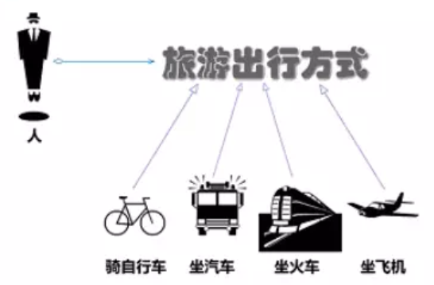
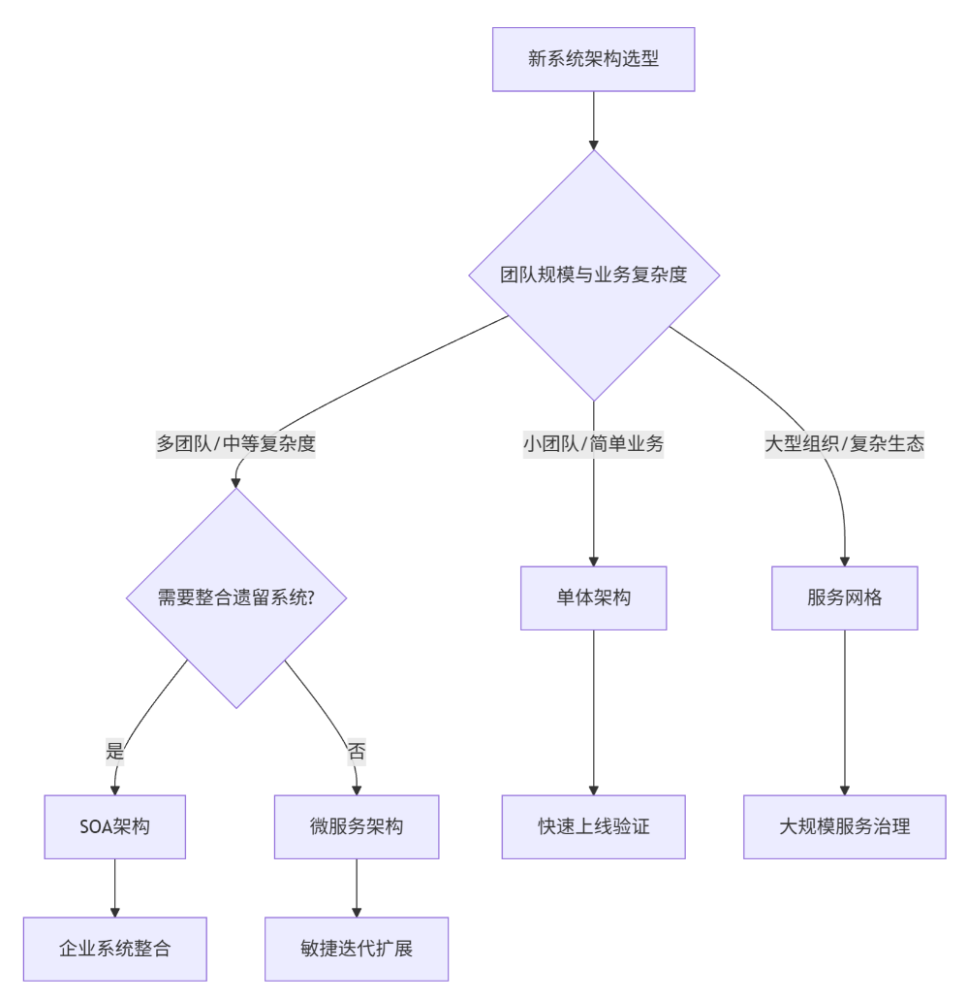
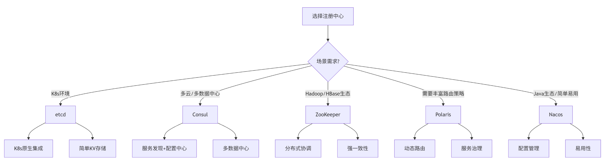
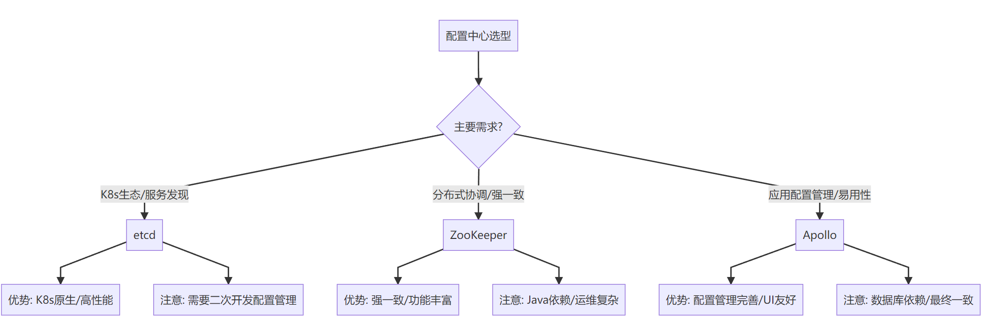
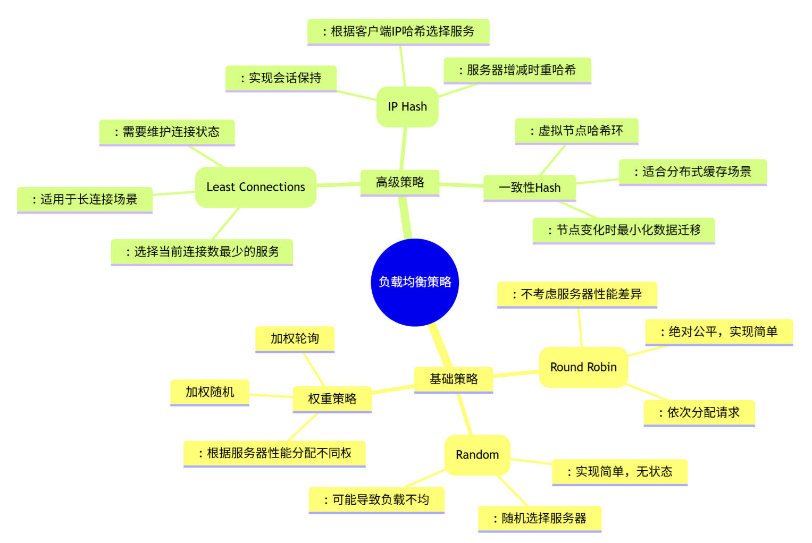

# 工程素养篇（中级）

# 编码能力

### **代码管理**

> Monorepo/Multirepo，理解大仓优缺点，代码复用/依赖管理/代码规范审查/构建工具链建设

#### 1. Monorepo vs Multirepo 

##### 定义

| 特性         | Monorepo（单体仓库）                | Multirepo（多体仓库）         |
| :----------- | :---------------------------------- | :---------------------------- |
| **定义**     | 多个项目/模块存放在同一个代码仓库中 | 每个项目/模块有独立的代码仓库 |
| **管理单元** | 整个代码库作为一个单元管理          | 每个仓库独立管理              |
| **典型代表** | Google, Facebook, Microsoft         | 大多数开源项目，传统企业      |

##### **Monorepo 优势**与劣势

```
优势：
1. 代码共享和复用
2. 原子提交和统一版本
# 一次提交，多个相关更改
git commit -m "feat: 用户认证系统
- 添加共享认证组件
- 更新Web应用认证逻辑  
- 移动端集成新认证
- API客户端添加认证头"
3. 简化依赖管理
4. 工具链统一

劣势：
1. 工具链复杂性
2. 性能问题  ==》 仓库体积巨大，影响操作速度
3. 权限管理复杂
```


**Multirepo 优势**与劣势

```
优势：
1. 明确的代码所有权
# 每个团队负责独立仓库
frontend-team/    # 前端团队权限
backend-team/     # 后端团队权限 

2. 独立的发布周期
# 各项目可以独立发布
web-app/     # 每周发布
mobile-app/  # 应用商店审核周期

3. 工具简单化
# 标准Git工作流
git clone repo-frontend
git clone repo-backend

4. 安全隔离
// 敏感配置隔离
// backend-repo/config/secrets.js
module.exports = {
    databasePassword: 'secret123',  // 后端团队可访问
    apiKeys: { /* 敏感信息 */ }
};


劣势：
1. 依赖管理困难
2. 跨项目更改复杂
3. 代码重复

```


##### 架构示意图

**Multirepo 架构**：

```
project-frontend/          project-backend/          project-mobile/
├── package.json           ├── package.json         ├── package.json
├── src/                   ├── src/                 ├── src/
└── README.md              └── README.md            └── README.md
```

**Monorepo 架构**：

```
monorepo/
├── packages/
│   ├── frontend/          # 前端应用
│   ├── backend/           # 后端服务  
│   ├── mobile/           # 移动端
│   ├── ui-components/    # 共享UI组件
│   └── utils/           # 工具库
├── package.json          # 根目录配置
├── turbo.json           # 构建工具配置
└── README.md
```


##### 关键对比

**核心差异速览表**

| 维度         | Monorepo（大仓，单体仓库） | Multirepo（多仓，多体仓库） |
| :----------- | :------------------------- | :-------------------------- |
| **代码复用** | ⭐⭐⭐⭐⭐ 直接引用             | ⭐⭐ 需要发布包               |
| **依赖管理** | ⭐⭐⭐⭐⭐ 统一版本             | ⭐⭐ 容易冲突                 |
| **重构安全** | ⭐⭐⭐⭐⭐ 原子提交             | ⭐⭐ 跨仓库协调               |
| **构建性能** | ⭐⭐ 需要工具优化            | ⭐⭐⭐⭐⭐ 独立构建              |
| **权限控制** | ⭐⭐ 目录级控制复杂          | ⭐⭐⭐⭐⭐ 仓库级控制            |
| **团队自治** | ⭐⭐ 需要协调                | ⭐⭐⭐⭐⭐ 完全独立              |
| **入门门槛** | ⭐⭐ 工具链复杂              | ⭐⭐⭐⭐⭐ 简单直接              |

**选择决策指南**

```
选择 Monorepo 当：
✅ 项目高度关联，需要频繁共享代码
✅ 团队规模大，需要统一规范
✅ 有资源建设和维护工具链
✅ 追求开发体验和重构效率

选择 Multirepo 当：
✅ 项目相对独立，团队自治性强
✅ 技术栈差异大，构建需求不同
✅ 团队规模小，工具链资源有限
✅ 需要严格的权限隔离
```


#### 2. 代码复用与依赖管理

##### Monorepo 代码复用模式

```
# 项目结构
packages/
  ├── shared/           # 通用工具库
  ├── ui-components/    # 共享UI组件
  ├── configs/         # 配置文件
  ├── web-app/         # 前端应用
  └── mobile-app/      # 移动端应用

# 依赖引用
"dependencies": {
  "@project/shared": "workspace:*",
  "@project/ui-components": "workspace:*"
}
```

##### 依赖管理最佳实践

1. **版本锁定**：使用 package-lock.json 或 yarn.lock
2. **依赖提升**：Monorepo中共享node_modules
3. **循环依赖检测**：工具自动检查并告警
4. **安全扫描**：集成漏洞检测工具

#### 3. 代码规范与审查体系

##### 代码规范配置

```
// .eslintrc.js
module.exports = {
  extends: ['@company/eslint-config'],
  rules: {
    'complexity': ['error', 10],        // 圈复杂度限制
    'max-lines': ['error', 300],        // 文件行数限制
    'no-console': 'warn'                // 控制台使用警告
  }
};

// .prettierrc.js
module.exports = {
  semi: true,
  trailingComma: 'es5',
  singleQuote: true,
  printWidth: 100
};
```

##### 代码审查清单

- [ ] 功能实现是否符合需求
- [ ] 代码风格是否一致
- [ ] 测试覆盖是否充分
- [ ] 文档更新是否完整
- [ ] 性能影响是否评估
- [ ] 安全风险是否排查


#### 4.构建工具链建设(CI/CD)

##### CI/CD 核心概念

###### CI - **持续集成** (Continuous Integration)

**定义**：开发人员频繁地将代码变更合并到共享主干（通常每天多次）的软件开发实践。

**核心流程**：

```
代码提交 → 自动构建 → 自动化测试 → 快速反馈
```

**关键特征**：

- ✅ **频繁集成**：每日多次代码合并
- ✅ **自动化构建**：每次提交触发自动构建
- ✅ **快速测试**：运行单元测试、集成测试
- ✅ **即时反馈**：快速发现集成问题


###### CD-**持续交付** (Continuous Delivery)

**定义**：确保代码变更可以安全、快速地部署到生产环境，但部署决策由人工控制。

**核心流程**：

```
CI通过后 → 自动化部署到类生产环境 → 人工触发生产部署
```

**关键特征**：

- ✅ **随时可部署**：代码始终处于可部署状态
- ✅ **人工决策**：由人工决定何时部署到生产
- ✅ **降低风险**：部署前进行人工验证


###### **CD-持续部署** (Continuous Deployment)

**定义**：代码变更通过CI流水线后，自动部署到生产环境，无需人工干预。

**核心流程**：

```
CI通过后 → 自动部署到生产环境
```

**关键特征**：

- ✅ **完全自动化**：无需人工干预的部署
- ✅ **快速交付**：变更快速到达用户
- ✅ **高风险**：需要极高的测试覆盖率和质量标准


| 方面           | 持续集成 (CI)    | 持续交付 (CD)  | 持续部署 (CD) |
| :------------- | :--------------- | :------------- | :------------ |
| **缩写**       | CI               | CD             | CD            |
| **核心目标**   | 代码质量保证     | 交付就绪状态   | 自动发布价值  |
| **自动化程度** | 构建和测试自动化 | 部署流程自动化 | 全流程自动化  |
| **人工干预**   | 无               | 部署决策人工   | 无            |
| **风险等级**   | 低               | 中             | 高            |
| **发布频率**   | 天/小时级        | 天/周级        | 小时/分钟级   |


##### **主流 CI/CD 工具链**

###### **1. 代码托管与协作**(github)

| 工具          | 类型        | 特点                  |
| :------------ | :---------- | :-------------------- |
| **GitHub**    | SaaS        | 生态丰富，Actions集成 |
| **GitLab**    | 自托管/SaaS | 内置完整CI/CD         |
| **Bitbucket** | SaaS        | 与Jira深度集成        |
| **Gitea**     | 自托管      | 轻量开源              |

###### **2. CI/CD 流水线平台**

```
# GitHub Actions 示例
name: CI Pipeline
on: [push]
jobs:
  test:
    runs-on: ubuntu-latest
    steps:
      - uses: actions/checkout@v3
      - uses: actions/setup-node@v3
      - run: npm install && npm test
  
  build:
    needs: test
    runs-on: ubuntu-latest  
    steps:
      - run: npm run build
```

| 平台               | 特点           | 适用场景       |
| :----------------- | :------------- | :------------- |
| **Jenkins**        | 老牌，插件丰富 | 复杂定制化需求 |
| **GitLab CI**      | 代码仓库集成   | 一体化开发体验 |
| **GitHub Actions** | 生态强大       | GitHub项目首选 |
| **CircleCI**       | 云原生友好     | 容器化应用     |

###### **3. 构建工具(docker)**

```
# 多阶段构建示例
FROM node:16 AS builder
WORKDIR /app
COPY package*.json ./
RUN npm ci
COPY . .
RUN npm run build

FROM nginx:alpine
COPY --from=builder /app/dist /usr/share/nginx/html
```

| 语言           | 构建工具           | 特点         |
| :------------- | :----------------- | :----------- |
| **Java**       | Maven, Gradle      | 依赖管理强大 |
| **JavaScript** | npm, yarn, pnpm    | 生态丰富     |
| **Go**         | go build           | 简单高效     |
| **Python**     | setuptools, poetry | 虚拟环境管理 |

###### **4. 制品仓库**

```
# 发布到制品库
npm publish                          # npm registry
docker push myapp:1.0.0              # Docker registry
mvn deploy                           # Maven repository
```

| 类型       | 工具               | 管理内容       |
| :--------- | :----------------- | :------------- |
| **包管理** | npm, Maven, PyPI   | 语言特定包     |
| **容器**   | Docker Hub, Harbor | 镜像文件       |
| **通用**   | JFrog Artifactory  | 任意二进制文件 |

###### **5. 部署工具(k8s)**

```
# Kubernetes 部署示例
apiVersion: apps/v1
kind: Deployment
metadata:
  name: myapp
spec:
  replicas: 3
  template:
    spec:
      containers:
      - name: app
        image: myapp:1.0.0
        ports:
        - containerPort: 3000
```

| 工具           | 部署目标 | 特点           |
| :------------- | :------- | :------------- |
| **Kubernetes** | 容器编排 | 云原生标准     |
| **Ansible**    | 服务器   | 声明式配置     |
| **Terraform**  | 基础设施 | 基础设施即代码 |
| **Serverless** | 无服务器 | 事件驱动       |


### Git 代码版本控制核心要点

#### 1. Git 基础概念

**核心三区**

```
工作区 (Working Directory)     → 暂存区 (Staging Area)     → 仓库 (Repository)
     (已修改文件)                   (git add 添加)             (git commit 提交)
```

**文件状态生命周期**

```
未跟踪 (Untracked) → 已修改 (Modified) → 已暂存 (Staged) → 已提交 (Committed)
```


#### 2. 日常开发常用命令

##### 基础工作流

```
# 克隆仓库
git clone <仓库地址>

# 查看状态
git status

# 添加文件到暂存区
git add <文件名>           # 添加特定文件
git add .                 # 添加所有修改

# 提交更改
git commit -m "提交描述"

# 推送到远程
git push origin <分支名>
```

##### 分支管理（branch）

```
# 查看分支
git branch                 # 本地分支
git branch -a              # 所有分支（含远程）

# 创建分支
git branch <新分支名>
git checkout -b <新分支名>  # 创建并切换

# 切换分支
git checkout <分支名>
git switch <分支名>         # 新版本推荐

# 合并分支
git merge <要合并的分支>

# 删除分支
git branch -d <分支名>     # 安全删除
git branch -D <分支名>     # 强制删除
```


#### 3. 团队协作规范

##### 分支策略模型

**Git Flow（经典模型）**

```
main (master)     → 生产代码
  ↑
release/*         → 发布分支
  ↑  
develop          → 开发主干
  ↑
feature/*        → 功能分支
```

**GitHub Flow（简化模型）**

```
main (master)     → 可部署代码
  ↑
feature/*        → 功能分支（PR合并）
```

##### 提交信息规范

```
# 格式：类型(范围): 描述
feat(auth): 添加用户登录功能
fix(api): 修复用户查询接口500错误
docs: 更新API文档
style: 调整代码格式
refactor: 重构支付模块
test: 添加用户服务测试
chore: 更新依赖版本
```


#### 4. 代码回退与撤销（reset）

##### 撤销工作区修改

```
# 撤销单个文件修改
git checkout -- <文件名>

# 撤销所有修改
git checkout -- .

# 撤销添加到暂存区的文件
git reset HEAD <文件名>
```

##### 版本回退

```
# 查看提交历史
git log --oneline

# 回退到指定版本
git reset --hard <commit_id>

# 回退到上一个版本
git reset --hard HEAD^

# 撤销提交但保留更改
git reset --soft HEAD^
```


#### 5. 远程仓库操作

##### 远程仓库管理

```
# 查看远程仓库
git remote -v

# 添加远程仓库
git remote add origin <仓库地址>

# 拉取远程更新
git pull origin <分支名>

# 推送到远程
git push -u origin <分支名>  # 首次推送
git push                     # 后续推送

# 获取远程分支
git fetch origin
git checkout -b <本地分支> origin/<远程分支>
```


#### 6. 高级技巧

##### 储藏更改 （stash）

```
# 临时储藏工作区
git stash

# 查看储藏列表
git stash list

# 恢复储藏
git stash pop              # 恢复并删除
git stash apply           # 恢复但不删除

# 删除储藏
git stash drop
```


##### 标签管理(tag)

```
# 创建标签
git tag v1.0.0

# 推送标签
git push origin --tags

# 查看标签
git tag
```


##### 比较差异(diff)

```
# 比较工作区和暂存区
git diff

# 比较暂存区和最新提交
git diff --staged

# 比较两个分支
git diff branch1..branch2

# 比较特定文件
git diff <文件路径>
```


#### 7. 配置优化

##### 全局配置(config)

```
# 用户信息
git config --global user.name "你的姓名"
git config --global user.email "你的邮箱"

# 默认编辑器
git config --global core.editor "code --wait"

# 别名配置
git config --global alias.co checkout
git config --global alias.br branch
git config --global alias.ci commit
git config --global alias.st status
```

##### .gitignore 文件

```
# 依赖文件
node_modules/
vendor/

# 日志文件
*.log
logs/

# 环境配置
.env
.env.local

# 系统文件
.DS_Store
Thumbs.db

# 构建输出
dist/
build/
```


#### 8. 问题排查与调试

##### 查看历史记录

```
# 图形化查看
git log --oneline --graph --all

# 查看特定文件的修改历史
git log -p <文件路径>

# 查看谁修改了某行代码
git blame <文件名>
# 输出示例：
# ^b7d3a8d (张三 2024-01-15 10:30:25 +0800 1) # 项目标题
[提交哈希     (作者   日期时间          行号) 代码内容]


```

##### 找回丢失的提交

```
# 查看所有操作记录
git reflog

# 重置到特定操作
git reset --hard <操作ID>
```


#### 9. 团队协作最佳实践

##### 代码审查流程

```
# 1. 从main拉取功能分支
git checkout -b feature/user-auth

# 2. 开发并提交
git add .
git commit -m "feat(auth): 实现用户认证"

# 3. 推送到远程
git push -u origin feature/user-auth

# 4. 创建Pull Request（在GitHub/GitLab界面）

# 5. 代码审查后合并
```

##### 解决合并冲突

```
# 拉取最新代码（可能产生冲突）
git pull origin main

# 手动解决冲突后
git add .
git commit -m "解决合并冲突"
git push
```


### **代码架构**

> MVC/DDD，理解DDD分层架构设计思想，用户接口层/应用层/领域层/基础设施层

#### 1. MVC 架构模式

##### 1.1 基础概念

**MVC（Model-View-Controller）** - 关注表现层的分离

**三层职责**

| 组件                     | 职责                          | 示例                            |
| :----------------------- | :---------------------------- | :------------------------------ |
| **Model（模型）**        | 数据和业务逻辑                | User, Order, Product            |
| **View（视图）**         | 用户界面展示                  | HTML页面, UI组件                |
| **Controller（控制器）** | 处理用户输入，协调Model和View | UserController, OrderController |

==> java 项目的常用架构

##### 1.2 典型工作流

```
用户操作 → Controller接收 → 调用Model处理 → 返回View展示
    ↑                                   ↓
    └─────── 更新View ────────┘
```

##### 1.3 代码示例

```java
// Model
public class User {
    private String id;
    private String name;
    private String email;
    
    // 业务逻辑
    public boolean isValid() {
        return email != null && email.contains("@");
    }
}

// View (JSP示例)
<html>
<body>
    <h1>用户: ${user.name}</h1>
    <p>邮箱: ${user.email}</p>
</body>
</html>

// Controller
@Controller
public class UserController {
    @Autowired
    private UserService userService;
    
    @GetMapping("/users/{id}")
    public String getUser(@PathVariable String id, Model model) {
        User user = userService.findById(id);
        model.addAttribute("user", user);
        return "user-detail"; // 视图名称
    }
}
```

##### 1.4 MVC 的局限性

- ❌ **业务逻辑分散**：业务代码可能泄漏到Controller
- ❌ **数据库耦合**：Model通常直接映射数据表
- ❌ **测试困难**：依赖框架，难以单元测试
- ❌ **规模扩展难**：复杂业务时代码混乱


#### 2. DDD 分层架构

##### 2.1 DDD 核心概念

**领域驱动设计（Domain-Driven Design）** - 以业务领域为核心的架构方法

##### 2.2 四层架构详解

```
用户接口层 (Interface Layer)
    ↓
应用层 (Application Layer)  
    ↓
领域层 (Domain Layer)       ←→ 基础设施层 (Infrastructure Layer)
```


#### 3. DDD 四层架构深度解析

##### 3.1 用户接口层（Interface Layer）

**职责**：处理用户交互和外部系统通信  ==》类似gateway网关层

**组件构成：**

```java
// 1. Controller（REST API）
@RestController
@RequestMapping("/api/orders")
public class OrderController {
    private final CreateOrderApplicationService appService;
    
    @PostMapping
    public ResponseEntity<OrderResponse> createOrder(@RequestBody CreateOrderRequest request) {
        OrderResponse response = appService.createOrder(request);
        return ResponseEntity.ok(response);
    }
}

// 2. DTO（数据传输对象）
public class CreateOrderRequest {
    private List<OrderItemDTO> items;
    private String customerId;
    private String shippingAddress;
    
    // 只有getter/setter，无业务逻辑
}

// 3. 身份验证、权限检查等
@Component
public class JwtAuthenticationFilter extends OncePerRequestFilter {
    protected void doFilterInternal(...) {
        // JWT令牌验证
    }
}
```


##### 3.2 应用层（Application Layer）

**职责**：协调领域对象完成用例，事务边界

**核心特征**

- ✅ **用例导向**：每个方法对应一个用户用例
- ✅ **薄层**：不包含业务逻辑，只是协调
- ✅ **事务边界**：通常一个方法一个事务

```go
// 应用服务
@Service
@Transactional
public class OrderApplicationService {
    private final OrderRepository orderRepository;
    private final ProductRepository productRepository;
    private final DomainEventPublisher eventPublisher;
    
    public OrderResponse createOrder(CreateOrderCommand command) {
        // 1. 获取领域对象
        Customer customer = customerRepository.findById(command.getCustomerId());
        List<Product> products = productRepository.findByIds(command.getProductIds());
        
        // 2. 调用领域服务
        Order order = Order.create(customer, products, command.getShippingAddress());
        
        // 3. 持久化
        orderRepository.save(order);
        
        // 4. 发布领域事件
        eventPublisher.publish(new OrderCreatedEvent(order.getId()));
        
        // 5. 返回DTO
        return OrderResponse.from(order);
    }
    
    public void cancelOrder(String orderId) {
        Order order = orderRepository.findById(orderId);
        order.cancel(); // 领域逻辑在Order实体中
        orderRepository.save(order);
    }
}
```

##### 3.3 领域层（Domain Layer） - DDD核心

**职责**：包含业务逻辑和规则，最核心的一层

###### 领域层组件

**实体（Entity）**

```java
// 有唯一标识的对象
public class Order extends AggregateRoot<OrderId> {
    private OrderId id;
    private CustomerId customerId;
    private OrderStatus status;
    private Money totalAmount;
    private List<OrderItem> items;
    private Address shippingAddress;
    
    // 业务方法
    public void cancel() {
        if (status == OrderStatus.SHIPPED) {
            throw new IllegalStateException("已发货订单不能取消");
        }
        this.status = OrderStatus.CANCELLED;
        addDomainEvent(new OrderCancelledEvent(this.id));
    }
    
    public void addItem(Product product, int quantity) {
        // 业务规则验证
        if (quantity <= 0) {
            throw new IllegalArgumentException("数量必须大于0");
        }
        this.items.add(new OrderItem(product, quantity));
        calculateTotalAmount();
    }
    
    private void calculateTotalAmount() {
        this.totalAmount = items.stream()
            .map(OrderItem::getSubtotal)
            .reduce(Money.ZERO, Money::add);
    }
}
```

**值对象（Value Object）**

```go
// 无标识，通过属性定义的对象
public class Money {
    private final BigDecimal amount;
    private final Currency currency;
    
    public Money(BigDecimal amount, Currency currency) {
        this.amount = amount;
        this.currency = currency;
    }
    
    public Money add(Money other) {
        if (!this.currency.equals(other.currency)) {
            throw new IllegalArgumentException("货币单位不一致");
        }
        return new Money(this.amount.add(other.amount), this.currency);
    }
    
    // 值对象基于属性相等
    @Override
    public boolean equals(Object o) {
        if (this == o) return true;
        if (!(o instanceof Money)) return false;
        Money money = (Money) o;
        return amount.compareTo(money.amount) == 0 && 
               currency.equals(money.currency);
    }
}
```

**领域服务（Domain Service）**

```
// 处理不适合放在实体中的业务逻辑
@Service
public class OrderPricingService {
    public PricingResult calculatePrice(Order order, PricingContext context) {
        // 复杂的定价逻辑
        Money basePrice = calculateBasePrice(order);
        Money discount = calculateDiscount(order, context);
        Money tax = calculateTax(order, context);
        
        return new PricingResult(basePrice, discount, tax);
    }
}
```

**领域事件（Domain Event）** ？？

```
// 表示领域中发生的事件
public class OrderCreatedEvent implements DomainEvent {
    private final OrderId orderId;
    private final Instant occurredOn;
    
    public OrderCreatedEvent(OrderId orderId) {
        this.orderId = orderId;
        this.occurredOn = Instant.now();
    }
}
```

**领域事件**是**领域模型中发生的、对业务有重要意义的事情**的表示。


💡 **核心特征**

| 特征         | 说明               | 示例                             |
| :----------- | :----------------- | :------------------------------- |
| **过去时**   | 描述已发生的事     | `OrderCreated`而非 `CreateOrder` |
| **不可变**   | 事件发生后不可更改 | 就像历史事实                     |
| **业务含义** | 反映业务价值变化   | 而不仅是技术操作                 |


##### 3.4 基础设施层（Infrastructure Layer）

**职责**：技术实现细节，为其他层提供技术支持

**组件示例**

```java
// 1. 仓储实现（Repository Implementation）
@Repository
public class JpaOrderRepository implements OrderRepository {
    private final OrderJpaRepository jpaRepository;
    private final OrderMapper mapper;
    
    @Override
    public Order findById(OrderId id) {
        OrderEntity entity = jpaRepository.findById(id.getValue())
            .orElseThrow(() -> new OrderNotFoundException(id));
        return mapper.toDomain(entity);
    }
    
    @Override
    public void save(Order order) {
        OrderEntity entity = mapper.toEntity(order);
        jpaRepository.save(entity);
        
        // 发布领域事件
        order.getDomainEvents().forEach(event -> eventPublisher.publish(event));
        order.clearDomainEvents();
    }
}

// 2. 外部服务调用
@Component  
public class EmailServiceClient implements NotificationService {
    private final RestTemplate restTemplate;
    
    public void sendOrderConfirmation(Order order) {
        EmailRequest request = createEmailRequest(order);
        restTemplate.postForObject("/emails", request, Void.class);
    }
}

// 3. 数据库配置、消息队列等
@Configuration
public class JpaConfig {
    @Bean
    public LocalContainerEntityManagerFactoryBean entityManagerFactory() {
        // JPA配置
    }
}
```


#### 4. 依赖方向与架构原则

##### 4.1 依赖关系

```
用户接口层 → 应用层 → 领域层 ← 基础设施层
    ↓          ↓                    ↑
    └───────────┴──→ DTO ───────────┘
```

**DTO** 是 **数据传输对象（Data Transfer Object）** 的缩写，是在分层架构中用于**层间数据传输的简单容器对象**。

##### 4.2 依赖倒置原则（DIP）

```java
// 领域层定义接口
public interface OrderRepository {
    Order findById(OrderId id);
    void save(Order order);
    List<Order> findByCustomerId(CustomerId customerId);
}

// ✅ 正确：基础设施层（低层）实现抽象
public class JpaOrderRepository implements OrderRepository { // 实现抽象
    // 具体实现细节...
}

// ✅ 正确：领域层（高层）依赖抽象
public class OrderService { // 领域服务，高层模块
    private final OrderRepository repository; // 依赖抽象接口
    
    public OrderService(OrderRepository repository) {
        this.repository = repository; // 依赖注入
    }
    
    public void processOrder(OrderId id) {
        Order order = repository.findById(id); // 使用抽象
        // 业务逻辑...
    }
}
```

**DIP定义：**

- **高层模块**不应该依赖**低层模块**，两者都应该依赖**抽象**
- **抽象**不应该依赖**细节**，**细节**应该依赖**抽象**


#### 5. 完整案例：订单系统

##### 5.1 项目结构

```
src/
├── main/
│   ├── java/
│   │   ├── com/example/
│   │   │   ├── application/          # 应用层
│   │   │   │   ├── OrderApplicationService.java
│   │   │   │   └── dto/              # DTO
│   │   │   ├── domain/               # 领域层
│   │   │   │   ├── model/            # 领域模型
│   │   │   │   │   ├── Order.java
│   │   │   │   │   ├── OrderItem.java
│   │   │   │   │   └── value/        # 值对象
│   │   │   │   ├── service/          # 领域服务  
│   │   │   │   ├── event/            # 领域事件
│   │   │   │   └── repository/       # 仓储接口
│   │   │   ├── infrastructure/       # 基础设施层
│   │   │   │   ├── persistence/      # 持久化实现
│   │   │   │   ├── external/         # 外部服务
│   │   │   │   └── config/           # 配置
│   │   │   └── interfaces/           # 用户接口层
│   │   │       ├── web/              # Web控制器
│   │   │       └── dto/              # 请求/响应DTO
```

##### 5.2 完整工作流

```go
// 1. 控制器接收请求
@PostMapping("/orders")
public OrderResponse createOrder(@RequestBody CreateOrderRequest request) {
    CreateOrderCommand command = mapper.toCommand(request);
    return orderAppService.createOrder(command);
}

// 2. 应用服务协调
public OrderResponse createOrder(CreateOrderCommand command) {
    // 验证、协调领域对象、持久化、发布事件
    Customer customer = customerRepo.findById(command.getCustomerId());
    Order order = Order.create(customer, command.getItems());
    orderRepo.save(order);
    eventPublisher.publish(new OrderCreatedEvent(order.getId()));
    return OrderResponse.from(order);
}

// 3. 领域对象处理业务逻辑
public class Order {
    public static Order create(Customer customer, List<OrderItem> items) {
        // 业务规则验证
        if (items.isEmpty()) {
            throw new EmptyOrderException();
        }
        
        Order order = new Order(generateOrderId(), customer.getId(), items);
        order.calculateTotalAmount();
        return order;
    }
}
```

#### 6. DDD 分层优势总结

**架构优势对比**

| 方面             | MVC              | DDD分层            |
| :--------------- | :--------------- | :----------------- |
| **业务逻辑集中** | 分散在各处       | 集中在领域层       |
| **可测试性**     | 依赖框架，难测试 | 领域层可独立测试   |
| **技术无关性**   | 与技术框架耦合   | 领域逻辑纯Java     |
| **演进能力**     | 修改影响面大     | 各层独立演进       |
| **复杂度管理**   | 随着业务变复杂   | 通过限界上下文分解 |

**适用场景**

**选择 MVC 当**：

- 简单CRUD应用
- 快速原型开发
- 团队规模小，业务简单

**选择 DDD 当**：

- 复杂业务领域
- 长期演进的大型系统
- 需要高度可维护性
- 多团队协作开发


### **目录结构**

> go规范清晰layout，参考 [golang-standards](https://github.com/golang-standards/project-layout)

#### 1. 标准目录结构（参考 Go 标准）

##### 1.1 基础项目布局

```
my-project/
├── cmd/                 # 应用程序入口
├── internal/            # 私有应用和库代码
├── pkg/                # 公共库代码
├── api/                # API 定义文件
├── web/                # Web 相关资源
├── configs/            # 配置文件
├── deployments/        # 部署配置
├── test/              # 测试相关
├── docs/              # 文档 docs
├── examples/           # 示例代码
├── vendor/            # 依赖包（Go modules 前）
├── third_party/       # 外部工具和第三方代码
├── scripts/          # 脚本文件
├── build/            # 构建相关
├── init/             # 系统初始化文件
├── Makefile          # 构建脚本
├── go.mod           # Go 模块定义
└── README.md        # 项目说明
```

#### 2. 详细目录说明

##### 2.1 核心目录详解

###### cmd/ - 应用程序入口

```
cmd/
├── app1/            # 应用1入口
│   ├── main.go
│   └── config.yaml
├── app2/            # 应用2入口  
│   └── main.go
└── migration/       # 数据库迁移工具
    └── main.go
```

**示例代码**：

```
// cmd/api/main.go
package main

import (
    "my-project/internal/api"
    "my-project/internal/config"
)

func main() {
    cfg := config.Load()
    server := api.NewServer(cfg)
    server.Run()
}
```

###### internal/ - 私有代码（外部无法导入）

```
internal/
├── api/             # HTTP API 层
│   ├── handler/     # HTTP 处理器
│   ├── middleware/  # 中间件
│   └── router.go    # 路由定义
├── service/         # 业务逻辑层
│   ├── user.go
│   ├── order.go
│   └── interface.go # 服务接口
├── repository/      # 数据访问层
│   ├── user.go
│   ├── order.go
│   └── interface.go # 仓储接口
├── domain/          # 领域模型
│   ├── user.go
│   ├── order.go
│   └── value.go     # 值对象
├── config/          # 配置管理
│   └── config.go
└── pkg/             # 内部公共库（可被internal内其他包导入）
    ├── database/
    ├── cache/
    └── validator/
```

###### pkg/ - 公共库代码（可被外部项目导入）

```
pkg/
├── utils/           # 工具函数
│   ├── stringutil.go
│   └── timeutil.go
├── logger/          # 日志库
│   └── logger.go
├── database/        # 数据库公共组件
│   └── postgres.go
├── auth/           # 认证授权
│   └── jwt.go
└── queue/          # 消息队列
    └── redisq.go
```

##### 2.2 配置文件目录

```
configs/
├── dev.yaml         # 开发环境配置
├── staging.yaml     # 测试环境配置  
├── production.yaml  # 生产环境配置
└── config.go        # 配置结构体定义
```

**配置示例**：

```
// configs/config.go
package config

type Config struct {
    Server   ServerConfig   `yaml:"server"`
    Database DatabaseConfig `yaml:"database"`
    Redis    RedisConfig    `yaml:"redis"`
}

type ServerConfig struct {
    Port int    `yaml:"port"`
    Env  string `yaml:"env"`
}
```

##### 2.3 API 定义目录

```
api/
├── openapi/         # OpenAPI 规范
│   └── swagger.yaml
├── protobuf/        # gRPC 协议定义
│   ├── user.proto
│   └── order.proto
└── graphql/         # GraphQL Schema
    └── schema.graphql
```


### 软件**设计原则**

> SOLID原则 单一指责/开闭原则/接口隔离...，KISS/DRY/YAGNI/LOD原则 防止过度设计/不写重复代码...

#### 1. SOLID 原则详解

##### 1.1 SRP - 单一职责原则 (Single Responsibility Principle)

**核心思想**：一个类应该只有一个引起变化的原因

**违反示例**

```java
// 违反SRP - 承担了太多职责
class UserManager {
    public void createUser(String username, String password) { /* 用户创建 */ }
    public void sendEmail(String to, String subject, String body) { /* 邮件发送 */ }
    public void logActivity(String activity) { /* 日志记录 */ }
    public void validatePassword(String password) { /* 密码验证 */ }
}
```

**遵循示例**

```java
// 拆分职责
class UserService {
    private EmailService emailService;
    private Logger logger;
    private PasswordValidator validator;
    
    public void createUser(String username, String password) {
        validator.validate(password);
        // 创建用户逻辑
        emailService.sendWelcomeEmail(username);
        logger.log("User created: " + username);
    }
}

class EmailService { /* 只处理邮件相关 */ }
class Logger { /* 只处理日志相关 */ }
class PasswordValidator { /* 只处理密码验证 */ }
```

**应用场景**：

- 微服务设计：每个服务单一职责
- 函数设计：函数只做一件事
- 模块划分：模块功能内聚

##### 1.2 OCP - 开闭原则 (Open/Closed Principle)

**核心思想**：对扩展开放，对修改关闭

**违反示例**

```java
class ShapeCalculator {
    public double calculateArea(String shapeType, double... params) {
        if ("circle".equals(shapeType)) {
            return Math.PI * params[0] * params[0];
        } else if ("rectangle".equals(shapeType)) {
            return params[0] * params[1];
        }
        // 添加新形状需要修改此类
        throw new IllegalArgumentException("Unsupported shape");
    }
}
```

**遵循示例**

```java
// 抽象基类
abstract class Shape {
    public abstract double calculateArea();
}

// 具体实现
class Circle extends Shape {
    private double radius;
    public double calculateArea() { return Math.PI * radius * radius; }
}

class Rectangle extends Shape {
    private double width, height;
    public double calculateArea() { return width * height; }
}

// 扩展时无需修改现有代码
class Triangle extends Shape {
    private double base, height;
    public double calculateArea() { return 0.5 * base * height; }
}

class AreaCalculator {
    public double calculateTotalArea(List<Shape> shapes) {
        return shapes.stream().mapToDouble(Shape::calculateArea).sum();
    }
}
```

**设计模式应用**：

- 策略模式（Strategy Pattern）==》可以很好扩展，不同配置使用不同的handle函数
- 模板方法模式（Template Method）
- 观察者模式（Observer Pattern）


##### 1.3 LSP - 里氏替换原则 (Liskov Substitution Principle)

**核心思想**：子类必须能够替换父类，且行为一致

**违反示例**

```java
class Rectangle {
    protected int width, height;
    
    public void setWidth(int width) { this.width = width; }
    public void setHeight(int height) { this.height = height; }
    public int getArea() { return width * height; }
}

class Square extends Rectangle {
    // 违反LSP：改变了父类行为
    @Override
    public void setWidth(int width) { 
        super.setWidth(width);
        super.setHeight(width); // 正方形宽高相等
    }
    
    @Override
    public void setHeight(int height) {
        super.setHeight(height);
        super.setWidth(height);
    }
}

// 使用时会出问题
void testRectangle(Rectangle rect) {
    rect.setWidth(5);
    rect.setHeight(4);
    assert rect.getArea() == 20; // 如果传入Square，结果为16，违反预期
}
```

**遵循示例**

```java
abstract class Shape {
    public abstract int getArea();
}

class Rectangle extends Shape {
    private int width, height;
    // 构造函数确保不变性
    public Rectangle(int width, int height) {
        this.width = width;
        this.height = height;
    }
    public int getArea() { return width * height; }
}

class Square extends Shape {
    private int side;
    public Square(int side) { this.side = side; }
    public int getArea() { return side * side; }
}
```


##### 1.4 ISP - 接口隔离原则 (Interface Segregation Principle)

**核心思想**：客户端不应依赖它不需要的接口

**违反示例**

```
// 臃肿的接口
interface Worker {
    void work();
    void eat();
    void sleep();
    void code();
    void design();
    void test();
}

class Programmer implements Worker {
    public void work() { /* 编程工作 */ }
    public void eat() { /* 吃饭 */ }
    public void sleep() { /* 睡觉 */ }
    public void code() { /* 写代码 */ }
    public void design() { /* 不需要，但必须实现 */ }
    public void test() { /* 不需要，但必须实现 */ }
}
```

**遵循示例**

```
// 细粒度接口
interface Workable { void work(); }
interface Eatable { void eat(); }
interface Sleepable { void sleep(); }

interface ProgrammerWork extends Workable {
    void code();
    void debug();
}

interface DesignerWork extends Workable {
    void design();
    void prototype();
}

class Programmer implements ProgrammerWork, Eatable, Sleepable {
    public void work() { /* 工作 */ }
    public void code() { /* 编码 */ }
    public void debug() { /* 调试 */ }
    public void eat() { /* 吃饭 */ }
    public void sleep() { /* 睡觉 */ }
}
```


##### 1.5 DIP - 依赖倒置原则 (Dependency Inversion Principle)

**核心思想**：依赖抽象，而不是具体实现

**违反示例**

```java
// 高层模块依赖低层模块
class MySQLDatabase {
    public void save(String data) { /* MySQL 实现 */ }
}

class ReportService {
    private MySQLDatabase database; // 直接依赖具体实现
    
    public void generateReport() {
        // 业务逻辑
        database.save(reportData);
    }
}
```

**遵循示例**

```java
// 抽象接口
interface Database {
    void save(String data);
    String load(String id);
}

// 具体实现
class MySQLDatabase implements Database {
    public void save(String data) { /* MySQL 实现 */ }
    public String load(String id) { /* MySQL 实现 */ }
}

class MongoDB implements Database {
    public void save(String data) { /* MongoDB 实现 */ }
    public String load(String id) { /* MongoDB 实现 */ }
}

// 高层模块依赖抽象
class ReportService {
    private Database database; // 依赖抽象
    
    public ReportService(Database database) {
        this.database = database; // 依赖注入
    }
    
    public void generateReport() {
        database.save(reportData);
    }
}
```


#### 2. KISS / DRY / YAGNI /LOD原则

##### 2.1 KISS - 保持简单原则 (Keep It Simple, Stupid)

**核心思想**：简单优于复杂

**违反示例**

```java
// 过度设计
public class ComplexUserValidator {
    public ValidationResult validateUserRegistration(
        UserRegistrationDTO registration, 
        ValidationContext context, 
        ValidationConfig config) {
        
        // 复杂的验证逻辑链
        if (context.isStrictMode() && config.enableAdvancedValidation()) {
            return performAdvancedValidation(registration, context, config);
        }
        // ... 更多复杂逻辑
    }
}
```

**遵循示例**

```java
// 简单直接
public class UserService {
    public void registerUser(String email, String password) {
        if (!isValidEmail(email)) {
            throw new IllegalArgumentException("Invalid email");
        }
        if (!isValidPassword(password)) {
            throw new IllegalArgumentException("Invalid password");
        }
        createUser(email, password);
    }
    
    private boolean isValidEmail(String email) {
        return email != null && email.contains("@");
    }
    
    private boolean isValidPassword(String password) {
        return password != null && password.length() >= 8;
    }
}
```

##### 2.2 DRY - 不要重复自己 (Don't Repeat Yourself)

**核心思想**：消除重复代码

**违反示例**

```
class UserService {
    public void createUser(String name, String email) {
        // 重复的验证逻辑
        if (name == null || name.trim().isEmpty()) {
            throw new IllegalArgumentException("Name cannot be empty");
        }
        if (email == null || !email.contains("@")) {
            throw new IllegalArgumentException("Invalid email");
        }
        // 创建用户
    }
    
    public void updateUser(String name, String email) {
        // 重复的验证逻辑
        if (name == null || name.trim().isEmpty()) {
            throw new IllegalArgumentException("Name cannot be empty");
        }
        if (email == null || !email.contains("@")) {
            throw new IllegalArgumentException("Invalid email");
        }
        // 更新用户
    }
}
```

**遵循示例**

```
class Validator {
    public static void validateName(String name) {
        if (name == null || name.trim().isEmpty()) {
            throw new IllegalArgumentException("Name cannot be empty");
        }
    }
    
    public static void validateEmail(String email) {
        if (email == null || !email.contains("@")) {
            throw new IllegalArgumentException("Invalid email");
        }
    }
}

class UserService {
    public void createUser(String name, String email) {
        Validator.validateName(name);
        Validator.validateEmail(email);
        // 创建用户
    }
    
    public void updateUser(String name, String email) {
        Validator.validateName(name);
        Validator.validateEmail(email);
        // 更新用户
    }
}
```


##### 2.3 YAGNI - 你不会需要它 (You Ain't Gonna Need It)

**核心思想**：不要过度设计，只实现当前需要的功能

**违反示例**

```java
// 过度设计，为未来可能的需求做准备
interface NotificationService {
    void sendEmail(String to, String subject, String body);
    void sendSMS(String phone, String message);
    void sendPush(String deviceId, String message);
    void sendWeChat(String openId, String message); // 可能永远用不到
    void sendTelegram(String chatId, String message); // 可能永远用不到
}

class UserNotifier {
    private NotificationService notifier;
    
    // 实现了所有可能的消息类型
    public void notifyUser(User user, String message, NotificationType type) {
        switch (type) {
            case EMAIL: notifier.sendEmail(user.getEmail(), "Notification", message); break;
            case SMS: notifier.sendSMS(user.getPhone(), message); break;
            case PUSH: notifier.sendPush(user.getDeviceId(), message); break;
            // 实现了可能不需要的功能
        }
    }
}
```

**遵循示例**

```java
// 只实现当前需要的功能
interface NotificationService {
    void sendEmail(String to, String subject, String body);
    // 需要时再添加其他方法
}

class UserNotifier {
    private NotificationService emailNotifier;
    
    // 当前只需要邮件通知
    public void notifyUserByEmail(User user, String message) {
        emailNotifier.sendEmail(user.getEmail(), "Notification", message);
    }
    
    // 需要短信通知时再添加
    // public void notifyUserBySMS(User user, String message) { ... }
}
```


##### 2.4. LOD - 迪米特法则 (Law of Demeter)

**核心思想**：只与直接的朋友通信

**违反示例**

```java
class CustomerService {
    public void processOrder(Customer customer) {
        // 违反LOD：与间接对象通信
        String city = customer.getAddress().getCity().toUpperCase();
        // 链式调用，耦合度过高  ==>跨class时避免链式调用
    }
}

class Customer {
    private Address address;
    public Address getAddress() { return address; }
}

class Address {
    private City city;
    public City getCity() { return city; }
}

class City {
    private String name;
    public String getName() { return name; }
}
```

**遵循示例**

```java
class CustomerService {
    public void processOrder(Customer customer) {
        // 只与直接朋友通信
        String city = customer.getCityName();
    }
}

class Customer {
    private Address address;
    
    // 封装内部细节
    public String getCityName() {
        return address != null ? address.getCityName() : "";
    }
}

class Address {
    private City city;
    
    public String getCityName() {
        return city != null ? city.getName() : "";
    }
}
```


#### 3. 原则冲突与权衡

##### 3.1 原则之间的权衡

| 冲突场景               | 原则A | 原则B | 解决方案                          |
| :--------------------- | :---- | :---- | :-------------------------------- |
| **简单性 vs 扩展性**   | KISS  | OCP   | 根据变化频率决定，高频变化遵循OCP |
| **不重复 vs 简单性**   | DRY   | KISS  | 适度抽象，避免过度工程            |
| **单一职责 vs 类爆炸** | SRP   | KISS  | 按变化原因分组，合理粒度          |

##### 3.2 实用建议

1. **初创项目**：优先KISS、YAGNI，快速迭代
2. **成熟系统**：注重OCP、SRP，保证可维护性
3. **团队协作**：强调DRY、ISP，提高代码复用
4. **复杂业务**：应用DIP、LSP，降低耦合度

#### 4. 设计原则检查清单

- ✅ 这个类/方法是否只有一个改变的原因？（SRP）
- ✅ 新功能是否通过扩展而非修改实现？（OCP）
- ✅ 子类是否能完全替换父类？（LSP）
- ✅ 接口是否足够专注和最小化？（ISP）
- ✅ 高层模块是否依赖抽象而非具体实现？（DIP）
- ✅ 代码是否足够简单直接？（KISS）
- ✅ 是否有重复代码可以抽取？（DRY）
- ✅ 是否实现了当前不需要的功能？（YAGNI）
- ✅ 是否**避免了过长的调用链**？（LOD）


### **设计模式**

> 掌握几种常用模式 单例/工厂/代理/适配器模式....


#### 1. 设计模式对比与选择指南

##### 1.1 创建型模式对比

| 模式         | 适用场景         | 特点               |
| :----------- | :--------------- | :----------------- |
| **单例**     | 全局唯一实例     | 控制实例数量       |
| **工厂方法** | 类创建逻辑复杂   | 子类决定创建对象   |
| **抽象工厂** | 产品族创建       | 创建相关对象家族   |
| **建造者**   | **复杂对象创建** | 分步构建，灵活配置 |

##### 1.2 结构型模式对比

| 模式       | 适用场景     | 特点               |
| :--------- | :----------- | :----------------- |
| **适配器** | 接口不兼容   | 接口转换           |
| **代理**   | 访问控制     | 间接访问，增强功能 |
| **装饰器** | 动态添加功能 | 运行时扩展         |
| **外观**   | 简化复杂系统 | 统一接口           |

##### 1.3 行为型模式对比

| 模式         | 适用场景     | 特点               |
| :----------- | :----------- | :----------------- |
| **观察者**   | 一对多依赖   | 自动通知           |
| **策略**     | 算法替换     | 封装算法，灵活切换 |
| **模板方法** | 算法框架固定 | 定义算法骨架       |
| **责任链**   | 请求处理链   | 多个对象处理请求   |


#### 2. 实际应用场景总结

##### 2.1 Spring框架中的设计模式

- **单例模式**：Bean的默认作用域
- **工厂模式**：BeanFactory, ApplicationContext
- **代理模式**：AOP实现，事务管理
- **模板方法**：JdbcTemplate, RestTemplate
- **观察者模式**：ApplicationEvent事件机制

##### 2.2 选择原则

1. **识别变化点**：找到系统中变化的部分
2. **面向接口**：针对接口编程，而不是实现
3. **组合优于继承**：优先使用对象组合
4. **开闭原则**：对扩展开放，对修改关闭

### 设计模式--创建型模式

#### 1. 单例模式 (Singleton Pattern)

##### 1.1 核心思想

确保一个类只有一个实例，并提供全局访问点

##### 1.2 实现方式对比

###### 饿汉式（线程安全）

```java
public class EagerSingleton {
    // 类加载时即创建实例
    private static final EagerSingleton instance = new EagerSingleton();
    
    // 私有构造器防止外部实例化
    private EagerSingleton() {}
    
    public static EagerSingleton getInstance() {
        return instance;
    }
}
```

**优点**：简单、线程安全

**缺点**：可能造成资源浪费（如果实例未被使用）

###### 懒汉式（双重检查锁）

```java
public class LazySingleton {
    private static volatile LazySingleton instance;
    
    private LazySingleton() {}
    
    public static LazySingleton getInstance() {
        if (instance == null) { // 第一次检查
            synchronized (LazySingleton.class) {
                if (instance == null) { // 第二次检查
                    instance = new LazySingleton();
                }
            }
        }
        return instance;
    }
}
```

**优点**：延迟加载、线程安全

**缺点**：实现稍复杂

###### 静态内部类（推荐）

```java
public class StaticSingleton {
    private StaticSingleton() {}
    
    private static class SingletonHolder {
        private static final StaticSingleton instance = new StaticSingleton();
    }
    
    public static StaticSingleton getInstance() {
        return SingletonHolder.instance;
    }
}
```

**优点**：延迟加载、线程安全、实现简单

###### 枚举单例（最佳实践）

```java
public enum EnumSingleton {
    INSTANCE;
    
    public void doSomething() {
        System.out.println("Singleton operation");
    }
}

// 使用
EnumSingleton.INSTANCE.doSomething();
```

**优点**：绝对防止多次实例化，自动支持序列化

##### 1.3 应用场景

- 配置管理器
- 数据库连接池
- 日志记录器
- 缓存管理器

#### 2. 工厂模式 (Factory Pattern)

> 工厂模式最大的优点就是：**解耦**。

##### 2.1 简单工厂模式

简单工厂包含如下角色：

* 抽象产品 ：定义了产品的规范，描述了产品的主要特性和功能。
* 具体产品 ：实现或者继承抽象产品的子类
* 具体工厂 ：提供了创建产品的方法，调用者通过该方法来获取产品。

```java
// 产品接口
interface Shape {
    void draw();
}

// 具体产品
class Circle implements Shape {
    public void draw() { System.out.println("绘制圆形"); }
}

class Rectangle implements Shape {
    public void draw() { System.out.println("绘制矩形"); }
}

// 简单工厂
class ShapeFactory {
    public static Shape createShape(String type) {
        switch (type.toLowerCase()) {
            case "circle": return new Circle();
            case "rectangle": return new Rectangle();
            default: throw new IllegalArgumentException("未知形状类型");
        }
    }
}

// 使用
Shape circle = ShapeFactory.createShape("circle");
circle.draw();
```

一个工厂类根据参数创建不同产品；

==》工厂作为**统一入口**，create不同type的产品


**优点：**

封装了创建对象的过程，可以通过参数直接获取对象。把对象的创建和业务逻辑层分开，这样以后就避免了修改客户代码，如果要实现新产品直接修改工厂类，而不需要在原代码中修改，这样就降低了客户代码修改的可能性，更加容易扩展。

**缺点：**

增加新产品时还是需要修改工厂类的代码，违背了“开闭原则”。


##### 2.2 工厂方法模式

> 定义一个用于创建对象的接口，让子类决定实例化哪个产品类对象。
>
> 工厂方法使一个产品类的实例化延迟到其工厂的子类。
>
> 每个产品对应一个工厂子类，由子类决定创建具体产品。


工厂方法模式的主要角色：

* 抽象工厂（Abstract Factory）：提供了创建产品的接口，调用者通过它访问具体工厂的工厂方法来创建产品。
* 具体工厂（ConcreteFactory）：主要是实现抽象工厂中的抽象方法，完成具体产品的创建。
* 抽象产品（Product）：定义了产品的规范，描述了产品的主要特性和功能。
* 具体产品（ConcreteProduct）：实现了抽象产品角色所定义的接口，由具体工厂来创建，它同具体工厂之间一一对应。

```java
// 1. 抽象创建者 - 定义工厂方法
abstract class ButtonFactory {
    // 这就是"工厂方法" - 抽象方法，由子类实现
    public abstract Button createButton();
    
    // 可以有默认实现（模板方法模式）
    public void renderButton() {
        Button button = createButton();
        button.render();
    }
}

// 2. 具体创建者 - 实现工厂方法
class WindowsButtonFactory extends ButtonFactory {
    public Button createButton() {
        return new WindowsButton();  // 创建Windows风格按钮
    }
}

class MacButtonFactory extends ButtonFactory {
    public Button createButton() {
        return new MacButton();  // 创建Mac风格按钮
    }
}

// 应用类 - 通过构造函数注入工厂
class Application {
    private Button button;
    
    public Application(ButtonFactory factory) {
        button = factory.createButton();  // 通过工厂创建产品
    }
    
    public void render() {
        button.render();
    }
}

// 使用示例
public class SimpleFactoryMethodExample {
    public static void main(String[] args) {
        // 根据配置选择工厂
        ButtonFactory factory;
        if (System.getProperty("os.name").toLowerCase().contains("win")) {
            factory = new WindowsButtonFactory();
        } else {
            factory = new MacButtonFactory();
        }
        
        // 通过构造函数注入工厂
        Application app = new Application(factory);
        app.render();  // 输出: "Windows风格按钮" 或 "Mac风格按钮"
    }
}
```

==》将创建者也抽象出来，具体创建者中实现不同的工厂方法获取不同的具体产品。

**工厂方法模式的核心思想**是：**将对象的创建延迟到子类，让子类决定实例化哪个具体类**。

**"不要直接new对象，让子类告诉我要创建什么"**


**优点：**

- 用户只需要知道具体工厂的名称就可得到所要的产品，无须知道产品的具体创建过程；
- 在系统增加新的产品时只需要添加具体产品类和对应的具体工厂类，无须对原工厂进行任何修改，满足开闭原则；

**缺点：**

* 每增加一个产品就要增加一个具体产品类和一个对应的具体工厂类，这增加了系统的复杂度。


##### 2.3 抽象工厂模式

> 是一种为访问类提供一个创建一组相关或相互依赖对象的接口，且访问类无须指定所要产品的具体类就能得到同族的不同等级的产品的模式结构。
>
> **抽象工厂模式是工厂方法模式的升级版本，工厂方法模式只生产一个等级的产品，而抽象工厂模式可生产多个等级的产品**。


```java
// 抽象工厂(包含多种产品)
interface GUIFactory {
    Button createButton();
    Checkbox createCheckbox();
}

// 具体工厂
class WindowsFactory implements GUIFactory {
    public Button createButton() { return new WindowsButton(); }
    public Checkbox createCheckbox() { return new WindowsCheckbox(); }
}

class MacFactory implements GUIFactory {
    public Button createButton() { return new MacButton(); }
    public Checkbox createCheckbox() { return new MacCheckbox(); }
}

// 客户端代码
class Application {
    private Button button;
    private Checkbox checkbox;
    
    public Application(GUIFactory factory) {
        button = factory.createButton();
        checkbox = factory.createCheckbox();
    }
    
    public void paint() {
        button.render();
        checkbox.render();
    }
}
```

==》抽象工厂：包含多种产品，**是对产品族创建关系的抽象约束**


###### **核心差异：约束的维度**

**工厂方法的约束是"纵向"的**

```
ChineseChef   → StirFriedDish (中式炒菜)
ItalianChef   → BakedDish (意式烤菜)
FrenchChef    → StewedDish (法式炖菜)

约束：每个厨师与特定做法绑定
```

**抽象工厂的约束是"横向"的**

```
ChineseRestaurant → [KungPaoChicken + HotSourSoup + MoonCake]
ItalianRestaurant → [Pizza + Minestrone + Tiramisu]  
FrenchRestaurant  → [Steak + OnionSoup + CremeBrulee]

约束：餐厅内所有菜品风格必须一致！
```


**优点：**

当一个产品族中的多个对象被设计成一起工作时，它能保证客户端始终只使用同一个产品族中的对象。

**缺点：**

当产品族中需要增加一个新的产品时，所有的工厂类都需要进行修改。


#### 3.原型模式（prototype）

> 用一个已经创建的实例作为原型，通过复制该原型对象来创建一个和原型对象相同的**新对象**。

原型模式包含如下角色：

* 抽象原型类：规定了具体原型对象必须实现的的 clone() 方法。
* 具体原型类：实现抽象原型类的 clone() 方法，它是可被复制的对象。
* 访问类：使用具体原型类中的 clone() 方法来复制新的对象。

```java
// 抽象原型类 Cloneable 

//具体原型类 奖状类
public class Citation implements Cloneable {
    private String name;

    public void setName(String name) {
        this.name = name;
    }

    public String getName() {
        return (this.name);
    }

    public void show() {
        System.out.println(name + "同学：在2020学年第一学期中表现优秀，被评为三好学生。特发此状！");
    }

    @Override
    public Citation clone() throws CloneNotSupportedException {
        return (Citation) super.clone();
    }
}

//测试访问类
public class CitationTest {
    public static void main(String[] args) throws CloneNotSupportedException {
        Citation c1 = new Citation();
        c1.setName("张三");

        //复制奖状
        Citation c2 = c1.clone();
        //将奖状的名字修改李四
        c2.setName("李四");

        c1.show();
        c2.show();
    }
}
```


#### 4.建造者模式（Builder）

> 将一个复杂对象的构建与表示分离，使得同样的构建过程可以创建不同的表示。
>
> 分离了部件的构造(由Builder来负责)和装配(由**Director**负责)。 从而可以构造出复杂的对象。**这个模式适用于：某个对象的构建过程复杂的情况**。
>
> 实现了构建和装配的解耦

建造者（Builder）模式包含如下角色：

* 抽象建造者类（Builder）：这个接口规定要实现复杂对象的那些部分的创建，并不涉及具体的部件对象的创建。 

* 具体建造者类（ConcreteBuilder）：实现 Builder 接口，完成复杂产品的各个部件的具体创建方法。在构造过程完成后，提供产品的实例。 

* 产品类（Product）：要创建的复杂对象。

* 指挥者类（Director）：调用具体建造者来创建复杂对象的各个部分，在指导者中不涉及具体产品的信息，只负责保证对象各部分完整创建或按某种顺序创建。 

```java
//自行车类
public class Bike {
    private String frame;
    private String seat;

    public String getFrame() {
        return frame;
    }

    public void setFrame(String frame) {
        this.frame = frame;
    }

    public String getSeat() {
        return seat;
    }

    public void setSeat(String seat) {
        this.seat = seat;
    }
}

// 抽象 builder 类
public abstract class Builder {

    protected Bike mBike = new Bike();

    public abstract void buildFrame();
    public abstract void buildSeat();
    public abstract Bike createBike();
}

//摩拜单车Builder类
public class MobikeBuilder extends Builder {

    @Override
    public void buildFrame() {
        mBike.setFrame("铝合金车架");
    }

    @Override
    public void buildSeat() {
        mBike.setSeat("真皮车座");
    }

    @Override
    public Bike createBike() {
        return mBike;
    }
}

//ofo单车Builder类
public class OfoBuilder extends Builder {

    @Override
    public void buildFrame() {
        mBike.setFrame("碳纤维车架");
    }

    @Override
    public void buildSeat() {
        mBike.setSeat("橡胶车座");
    }

    @Override
    public Bike createBike() {
        return mBike;
    }
}

//指挥者类
public class Director {
    private Builder mBuilder;

    public Director(Builder builder) {
        mBuilder = builder;
    }

    public Bike construct() {
        mBuilder.buildFrame();
        mBuilder.buildSeat();
        return mBuilder.createBike();
    }
}

//测试类
public class Client {
    public static void main(String[] args) {
        showBike(new OfoBuilder());
        showBike(new MobikeBuilder());
    }
    private static void showBike(Builder builder) {
        Director director = new Director(builder);
        Bike bike = director.construct();
        System.out.println(bike.getFrame());
        System.out.println(bike.getSeat());
    }
}
```


##### 模式扩展

链式调用可以看做是一种简化的建造者模式：

在开发中还有一个常用的使用方式，就是当一个类构造器需要传入很多参数时，如果创建这个类的实例，代码可读性会非常差，而且很容易引入错误，**此时就可以利用建造者模式进行重构**。

重构前代码如下：

```java
public class Phone {
    private String cpu;
    private String screen;
    private String memory;
    private String mainboard;

    public Phone(String cpu, String screen, String memory, String mainboard) {
        this.cpu = cpu;
        this.screen = screen;
        this.memory = memory;
        this.mainboard = mainboard;
    }

    public String getCpu() {
        return cpu;
    }

    public void setCpu(String cpu) {
        this.cpu = cpu;
    }

    public String getScreen() {
        return screen;
    }

    public void setScreen(String screen) {
        this.screen = screen;
    }

    public String getMemory() {
        return memory;
    }

    public void setMemory(String memory) {
        this.memory = memory;
    }

    public String getMainboard() {
        return mainboard;
    }

    public void setMainboard(String mainboard) {
        this.mainboard = mainboard;
    }

    @Override
    public String toString() {
        return "Phone{" +
                "cpu='" + cpu + '\'' +
                ", screen='" + screen + '\'' +
                ", memory='" + memory + '\'' +
                ", mainboard='" + mainboard + '\'' +
                '}';
    }
}

public class Client {
    public static void main(String[] args) {
        //构建Phone对象
        Phone phone = new Phone("intel","三星屏幕","金士顿","华硕");
        System.out.println(phone);
    }
}
```

上面在客户端代码中构建Phone对象，传递了四个参数，如果参数更多呢？代码的可读性及使用的成本就是比较高。

重构后代码：

```java
public class Phone {

    private String cpu;
    private String screen;
    private String memory;
    private String mainboard;

    private Phone(Builder builder) {
        cpu = builder.cpu;
        screen = builder.screen;
        memory = builder.memory;
        mainboard = builder.mainboard;
    }

    public static final class Builder {
        private String cpu;
        private String screen;
        private String memory;
        private String mainboard;

        public Builder() {}

        public Builder cpu(String val) {
            cpu = val;
            return this;
        }
        public Builder screen(String val) {
            screen = val;
            return this;
        }
        public Builder memory(String val) {
            memory = val;
            return this;
        }
        public Builder mainboard(String val) {
            mainboard = val;
            return this;
        }
        public Phone build() {
            return new Phone(this);}
    }
    @Override
    public String toString() {
        return "Phone{" +
                "cpu='" + cpu + '\'' +
                ", screen='" + screen + '\'' +
                ", memory='" + memory + '\'' +
                ", mainboard='" + mainboard + '\'' +
                '}';
    }
}

public class Client {
    public static void main(String[] args) {
        Phone phone = new Phone.Builder()
                .cpu("intel")
                .mainboard("华硕")
                .memory("金士顿")
                .screen("三星")
                .build();
        System.out.println(phone);
    }
}
```

重构后的代码在使用起来更方便，某种程度上也可以提高开发效率。从软件设计上，对程序员的要求比较高。


### 设计模式--结构型模式


#### 1. 代理模式 (Proxy Pattern)

> 属于结构型模式

##### 0 代理模式核心思想

###### **1.1 核心概念**

**代理模式**：为其他对象提供一种**代理**以控制对这个对象的访问。

**核心思想**：**"通过一个代理对象来控制对原始对象的访问"**

###### **1.2 三大角色**

```java
// 1. 抽象主题 (Subject) - 定义真实对象和代理对象的共同接口
interface Subject {
    void request();
}

// 2. 真实主题 (Real Subject) - 实际执行业务逻辑的对象
class RealSubject implements Subject {
    public void request() {
        System.out.println("真实主题处理请求");
    }
}

// 3. 代理 (Proxy) - 控制对真实主题的访问
class Proxy implements Subject {
    private RealSubject realSubject;
    
    public void request() {
        if (realSubject == null) {
            realSubject = new RealSubject(); // 延迟加载
        }
        preRequest();    // 前置处理
        realSubject.request(); // 委托给真实对象
        postRequest();   // 后置处理
    }
    
    private void preRequest() {
        System.out.println("代理前置处理");
    }
    
    private void postRequest() {
        System.out.println("代理后置处理");
    }
}
```


##### 1 静态代理

```java
// 主题接口
interface Image {
    void display();
}

// 真实主题 - 重量级对象，创建成本高
class RealImage implements Image {
    private String filename;
    
    public RealImage(String filename) {
        this.filename = filename;
        loadFromDisk(); // 构造函数中立即加载，可能很慢
    }
    
    private void loadFromDisk() {
        System.out.println("从磁盘加载图片: " + filename + " (耗时操作)");
    }
    
    public void display() {
        System.out.println("显示图片: " + filename);
    }
}

// 代理类 - 控制访问，实现延迟加载
class ImageProxy implements Image {
    private RealImage realImage; // 对真实对象的引用
    private String filename;
    
    public ImageProxy(String filename) {
        this.filename = filename;
        // 注意：这里不创建RealImage，实现延迟加载
    }
    
    public void display() {
        // 延迟加载：只有真正需要时才创建真实对象
        if (realImage == null) {
            realImage = new RealImage(filename);
        }
        realImage.display(); // 委托给真实对象
    }
}

// 使用
Image image = new ImageProxy("test.jpg");
// 图片尚未加载
image.display(); // 此时才真正加载图片
```


示例2：卖票

```java
//卖票接口
public interface SellTickets {
    void sell();
}

//火车站  火车站具有卖票功能，所以需要实现SellTickets接口
public class TrainStation implements SellTickets {

    public void sell() {
        System.out.println("火车站卖票");
    }
}

//代售点
public class ProxyPoint implements SellTickets {

    private TrainStation station = new TrainStation();

    public void sell() {
        System.out.println("代理点收取一些服务费用");
        station.sell();
    }
}

//测试类
public class Client {
    public static void main(String[] args) {
        ProxyPoint pp = new ProxyPoint();
        pp.sell();
    }
}
```


##### 2 动态代理（JDK）

Java中提供了一个动态代理类Proxy，Proxy并不是我们上述所说的代理对象的类，而是提供了一个创建代理对象的静态方法（newProxyInstance方法）来获取代理对象。

```java
//卖票接口
public interface SellTickets {
    void sell();
}

//火车站  火车站具有卖票功能，所以需要实现SellTickets接口
public class TrainStation implements SellTickets {

    public void sell() {
        System.out.println("火车站卖票");
    }
}

//代理工厂，用来创建代理对象
public class ProxyFactory {

    private TrainStation station = new TrainStation();

    public SellTickets getProxyObject() {
        //使用Proxy获取代理对象
        /*
            newProxyInstance()方法参数说明：
                ClassLoader loader ： 类加载器，用于加载代理类，使用真实对象的类加载器即可
                Class<?>[] interfaces ： 真实对象所实现的接口，代理模式真实对象和代理对象实现相同的接口
                InvocationHandler h ： 代理对象的调用处理程序
         */
        SellTickets sellTickets = (SellTickets) Proxy.newProxyInstance(station.getClass().getClassLoader(),
                station.getClass().getInterfaces(),
                new InvocationHandler() {
                    /*
                        InvocationHandler中invoke方法参数说明：
                            proxy ： 代理对象
                            method ： 对应于在代理对象上调用的接口方法的 Method 实例
                            args ： 代理对象调用接口方法时传递的实际参数
                     */
                    public Object invoke(Object proxy, Method method, Object[] args) throws Throwable {

                        System.out.println("代理点收取一些服务费用(JDK动态代理方式)");
                        //执行真实对象
                        Object result = method.invoke(station, args);
                        return result;
                    }
                });
        return sellTickets;
    }
}

//测试类
public class Client {
    public static void main(String[] args) {
        //获取代理对象
        ProxyFactory factory = new ProxyFactory();
        
        SellTickets proxyObject = factory.getProxyObject();
        proxyObject.sell();
    }
}
```

**1. 核心区别对比表**

| 特性           | 静态代理                 | 动态代理                   |
| :------------- | :----------------------- | :------------------------- |
| **创建时机**   | 编译期                   | 运行期                     |
| **代理类来源** | 手动编写                 | 自动生成                   |
| **灵活性**     | 低（每个类需单独代理）   | 高（通用代理处理多个类）   |
| **代码量**     | 多（需要为每个类写代理） | 少（一个处理器代理多个类） |
| **维护性**     | 差（修改需重新编译）     | 好（配置即修改）           |
| **性能**       | 稍好（直接调用）         | 稍差（反射调用）           |

#### 2. 装饰器模式 (Decorator Pattern)

> 指在不改变现有对象结构的情况下，动态地给该对象增加一些职责（即增加其额外功能）的模式。

装饰（Decorator）模式中的角色：

* 抽象构件（Component）角色 ：定义一个抽象接口以规范准备接收附加责任的对象。
* 具体构件（Concrete  Component）角色 ：实现抽象构件，通过装饰角色为其添加一些职责。
* 抽象装饰（Decorator）角色 ： 继承或实现抽象构件，并包含具体构件的实例（聚合），可以通过其子类扩展具体构件的功能。
* 具体装饰（ConcreteDecorator）角色 ：实现抽象装饰的相关方法，并给具体构件对象添加附加的责任。


##### 2.1 经典实现

```go
// 组件接口
interface Coffee {
    String getDescription();
    double cost();
}

// 具体组件
class SimpleCoffee implements Coffee {
    public String getDescription() { return "简单咖啡"; }
    public double cost() { return 5.0; }
}

// 装饰器抽象类
abstract class CoffeeDecorator implements Coffee {
    protected Coffee decoratedCoffee;
    
    public CoffeeDecorator(Coffee coffee) {
        this.decoratedCoffee = coffee;
    }
    
    public String getDescription() {
        return decoratedCoffee.getDescription();
    }
    
    public double cost() {
        return decoratedCoffee.cost();
    }
}

// 具体装饰器
class MilkDecorator extends CoffeeDecorator {
    public MilkDecorator(Coffee coffee) {
        super(coffee);
    }
    
    public String getDescription() {
        return decoratedCoffee.getDescription() + ", 牛奶";
    }
    
    public double cost() {
        return decoratedCoffee.cost() + 2.0;
    }
}

class SugarDecorator extends CoffeeDecorator {
    public SugarDecorator(Coffee coffee) {
        super(coffee);
    }
    
    public String getDescription() {
        return decoratedCoffee.getDescription() + ", 糖";
    }
    
    public double cost() {
        return decoratedCoffee.cost() + 1.0;
    }
}

// 使用
Coffee coffee = new SimpleCoffee();
coffee = new MilkDecorator(coffee);
coffee = new SugarDecorator(coffee);

System.out.println(coffee.getDescription() + " ￥" + coffee.cost());
// 输出: 简单咖啡, 牛奶, 糖 ￥8.0
```


##### 2.2 使用场景

* 当不能采用继承的方式对系统进行扩充或者采用继承不利于系统扩展和维护时。

  不能采用继承的情况主要有两类：

  * 第一类是系统中存在大量独立的扩展，为支持每一种组合将产生大量的子类，使得子类数目呈爆炸性增长；
  * 第二类是因为类定义不能继承（如final类）

* 在不影响其他对象的情况下，以动态、透明的方式给单个对象添加职责。

* 当对象的功能要求可以动态地添加，也可以再动态地撤销时。


IO流中的包装类使用到了装饰者模式。BufferedInputStream，BufferedOutputStream，BufferedReader，BufferedWriter。

我们以BufferedWriter举例来说明，先看看如何使用BufferedWriter

```java
public class Demo {
    public static void main(String[] args) throws Exception{
        //创建BufferedWriter对象
        //创建FileWriter对象
        FileWriter fw = new FileWriter("C:\\Users\\Think\\Desktop\\a.txt");
        BufferedWriter bw = new BufferedWriter(fw);

        //写数据
        bw.write("hello Buffered");

        bw.close();
    }
}
```


##### 2.3 代理和装饰者的区别

静态代理和装饰者模式的区别：

* 相同点：
  * 都要实现与目标类相同的业务接口
  * 在两个类中都要声明目标对象
  * 都可以在不修改目标类的前提下增强目标方法
* 不同点：
  * 目的不同
    装饰者是为了增强目标对象
    **静态代理是为了保护和隐藏目标对象**
  * 获取目标对象构建的地方不同
    装饰者是由外界传递进来，可以通过构造方法传递
    静态代理是在代理类内部创建，以此来隐藏目标对象


#### 3. 适配器模式 (Adapter Pattern)

> 被适配者-- 适配器--目标接口

适配器模式（Adapter）包含以下主要角色：

* 目标（Target）接口：当前系统业务所期待的接口，它可以是抽象类或接口。
* 适配者（Adaptee）类：它是被访问和适配的现存组件库中的组件接口。
* 适配器（Adapter）类：它是一个转换器，通过继承或引用适配者的对象，把适配者接口转换成目标接口，让客户按目标接口的格式访问适配者。


##### 3.1 类适配器（继承 被适配者）

```java
// 目标接口
interface MediaPlayer {
    void play(String audioType, String fileName);
}

// 被适配者
class AdvancedMediaPlayer {
    void playVlc(String fileName) {
        System.out.println("播放vlc文件: " + fileName);
    }
    
    void playMp4(String fileName) {
        System.out.println("播放mp4文件: " + fileName);
    }
}

// 适配器
class MediaAdapter extends AdvancedMediaPlayer implements MediaPlayer {
    public void play(String audioType, String fileName) {
        if (audioType.equalsIgnoreCase("vlc")) {
            playVlc(fileName);
        } else if (audioType.equalsIgnoreCase("mp4")) {
            playMp4(fileName);
        }
    }
}
```

##### 3.2 对象适配器（组合被适配者）

```java
class MediaAdapter implements MediaPlayer {
    private AdvancedMediaPlayer advancedMusicPlayer;
    
    public MediaAdapter(String audioType) {
        if (audioType.equalsIgnoreCase("vlc")) {
            advancedMusicPlayer = new VlcPlayer();
        } else if (audioType.equalsIgnoreCase("mp4")) {
            advancedMusicPlayer = new Mp4Player();
        }
    }
    
    public void play(String audioType, String fileName) {
        if (audioType.equalsIgnoreCase("vlc")) {
            advancedMusicPlayer.playVlc(fileName);
        } else if (audioType.equalsIgnoreCase("mp4")) {
            advancedMusicPlayer.playMp4(fileName);
        }
    }
```


##### 3.3 应用场景

* 以前开发的系统存在满足新系统功能需求的类，但其接口同新系统的接口不一致。
* 使用第三方提供的组件，但组件接口定义和自己要求的接口定义不同。


InputStreamReader做了InputStream字节流类到Reader字符流之间的转换：

```java
// 将字节流适配为字符流
public class IoAdapterExample {
    public static void main(String[] args) throws IOException {
        // 字节流
        FileInputStream fis = new FileInputStream("file.txt");
        
        // 适配器：字节流 → 字符流
        InputStreamReader reader = new InputStreamReader(fis, "UTF-8");
        
        // 现在可以按字符方式读取
        BufferedReader br = new BufferedReader(reader);
        String line = br.readLine();
        
        br.close();
    }
}
```

InputStreamReader继承自java.io包中的**Reader**(抽象类），如：

```java
// InputStreamReader 源码片段 （对象适配器）
public class InputStreamReader extends Reader {
    private final StreamDecoder sd;
    
    public InputStreamReader(InputStream in) {
        super(in);
        try {
            sd = StreamDecoder.forInputStreamReader(in, this, (String)null);
        } catch (UnsupportedEncodingException e) {
            throw new Error(e);
        }
    }
    
    // 适配：将Reader的read方法适配到InputStream
    public int read() throws IOException {
        return sd.read();
    }
}
```


#### 4.桥接模式（Bridge）

> 将抽象与实现分离，使它们可以独立变化。它是用组合关系代替继承关系来实现，从而降低了抽象和实现这两个可变维度的耦合度。


##### 概述

桥接（Bridge）模式包含以下主要角色：

* 抽象化（Abstraction）角色 ：定义抽象类，并包含一个对实现化对象的引用。
* 扩展抽象化（Refined  Abstraction）角色 ：是抽象化角色的子类，实现父类中的业务方法，并通过组合关系调用实现化角色中的业务方法。
* 实现化（Implementor）角色 ：定义实现化角色的接口，供扩展抽象化角色调用。
* 具体实现化（Concrete Implementor）角色 ：给出实现化角色接口的具体实现。

现在有一个需求，需要创建不同的图形，并且每个图形都有可能会有不同的颜色。我们可以利用继承的方式来设计类的关系：


我们可以发现有很多的类，假如我们再增加一个形状或再增加一种颜色，就需要创建更多的类。

试想，在一个有多种可能会变化的维度的系统中，用继承方式会造成类爆炸，扩展起来不灵活。每次在一个维度上新增一个具体实现都要增加多个子类。为了更加灵活的设计系统，我们此时可以考虑使用桥接模式。==》防止类爆炸

| 方式     | 类数量     | 扩展性 | 维护性       |
| :------- | :--------- | :----- | :----------- |
| **继承** | 乘积级增长 | 差     | 差（类爆炸） |
| **桥接** | 加法级增长 | 好     | 好           |


##### 示例

【例】视频播放器

需要开发一个**跨平台视频播放器**，可以在不同操作系统平台（如Windows、Mac、Linux等）上播放多种格式的视频文件，常见的视频格式包括RMVB、AVI、WMV等。该播放器包含了两个维度，适合使用桥接模式。


代码如下：

```java
//视频文件
public interface VideoFile {
    void decode(String fileName);
}

//avi文件
public class AVIFile implements VideoFile {
    public void decode(String fileName) {
        System.out.println("avi视频文件："+ fileName);
    }
}

//rmvb文件
public class REVBBFile implements VideoFile {

    public void decode(String fileName) {
        System.out.println("rmvb文件：" + fileName);
    }
}

//操作系统版本
public abstract class OperatingSystem {

    protected VideoFile videoFile;

    public OperatingSystem(VideoFile videoFile) {
        this.videoFile = videoFile;
    }

    public abstract void play(String fileName);
}

//Windows版本
public class Windows extends OperatingSystem {

    public Windows(VideoFile videoFile) {
        super(videoFile);
    }

    public void play(String fileName) {
        videoFile.decode(fileName);
    }
}

//mac版本
public class Mac extends OperatingSystem {

    public Mac(VideoFile videoFile) {
        super(videoFile);
    }

    public void play(String fileName) {
		videoFile.decode(fileName);
    }
}

//测试类
public class Client {
    public static void main(String[] args) {
        OperatingSystem os = new Windows(new AVIFile());
        os.play("战狼3");
    }
}
```

**好处：**

* 桥接模式提高了系统的可扩充性，在两个变化维度中任意扩展一个维度，都不需要修改原有系统。

  如：如果现在还有一种视频文件类型wmv，我们只需要再定义一个类实现VideoFile接口即可，其他类不需要发生变化。

* 实现细节对客户透明（保密）


##### go示例：日志输出

```go
package main

import "fmt"

// Implementor: 日志输出接口
type LogOutput interface {
    Output(level, message string)
}

// ConcreteImplementor: 文件输出
type FileOutput struct {
    filename string
}

func (f *FileOutput) Output(level, message string) {
    fmt.Printf("写入文件[%s]: %s - %s\n", f.filename, level, message)
}

// ConcreteImplementor: 控制台输出
type ConsoleOutput struct{}

func (c *ConsoleOutput) Output(level, message string) {
    fmt.Printf("控制台输出: %s - %s\n", level, message)
}

// ConcreteImplementor: 网络输出
type NetworkOutput struct {
    endpoint string
}

func (n *NetworkOutput) Output(level, message string) {
    fmt.Printf("发送到[%s]: %s - %s\n", n.endpoint, level, message)
}

// Abstraction: 日志记录器抽象
type Logger interface {
    Debug(message string)
    Info(message string)
    Error(message string)
}

// RefinedAbstraction: 具体日志记录器
type SimpleLogger struct {
    output LogOutput
}

func NewSimpleLogger(output LogOutput) *SimpleLogger {
    return &SimpleLogger{output: output}
}

func (s *SimpleLogger) Debug(message string) {
    s.output.Output("DEBUG", message)
}

func (s *SimpleLogger) Info(message string) {
    s.output.Output("INFO", message)
}

func (s *SimpleLogger) Error(message string) {
    s.output.Output("ERROR", message)
}

// 使用桥接模式
func main() {
    // 创建不同的输出实现
    fileOutput := &FileOutput{filename: "app.log"}
    consoleOutput := &ConsoleOutput{}
    networkOutput := &NetworkOutput{endpoint: "logserver:514"}
    
    // 相同的日志接口，不同的输出实现
    loggers := []Logger{
        NewSimpleLogger(fileOutput),
        NewSimpleLogger(consoleOutput),
        NewSimpleLogger(networkOutput),
    }
    
    // 统一使用
    for i, logger := range loggers {
        logger.Info(fmt.Sprintf("日志器 %d 测试消息", i))
    }
    
    // 动态切换输出目标
    logger := NewSimpleLogger(consoleOutput)
    logger.Info("初始使用控制台")
    
    // 运行时切换为文件输出
    logger = NewSimpleLogger(fileOutput)
    logger.Info("现在输出到文件")
}
```


#### 5.外观模式（Facade）

> 又名门面模式，是一种通过为多个复杂的子系统提供一个一致的接口，而使这些子系统更加容易被访问的模式。


外观（Facade）模式包含以下主要角色：

* 外观（Facade）角色：为多个子系统对外提供一个共同的接口。
* 子系统（Sub System）角色：实现系统的部分功能，客户可以通过外观角色访问它。

【例】智能家电控制

小明的爷爷已经60岁了，一个人在家生活：每次都需要打开灯、打开电视、打开空调；睡觉时关闭灯、关闭电视、关闭空调；操作起来都比较麻烦。所以小明给爷爷买了智能音箱，可以通过语音直接控制这些智能家电的开启和关闭。


代码如下：

```java
//灯类
public class Light {
    public void on() {
        System.out.println("打开了灯....");
    }

    public void off() {
        System.out.println("关闭了灯....");
    }
}

//电视类
public class TV {
    public void on() {
        System.out.println("打开了电视....");
    }

    public void off() {
        System.out.println("关闭了电视....");
    }
}

//控制类
public class AirCondition {
    public void on() {
        System.out.println("打开了空调....");
    }

    public void off() {
        System.out.println("关闭了空调....");
    }
}

//智能音箱
public class SmartAppliancesFacade {

    private Light light;
    private TV tv;
    private AirCondition airCondition;

    public SmartAppliancesFacade() {
        light = new Light();
        tv = new TV();
        airCondition = new AirCondition();
    }

    public void say(String message) {
        if(message.contains("打开")) {
            on();
        } else if(message.contains("关闭")) {
            off();
        } else {
            System.out.println("我还听不懂你说的！！！");
        }
    }

    //起床后一键开电器
    private void on() {
        System.out.println("起床了");
        light.on();
        tv.on();
        airCondition.on();
    }

    //睡觉一键关电器
    private void off() {
        System.out.println("睡觉了");
        light.off();
        tv.off();
        airCondition.off();
    }
}

//测试类
public class Client {
    public static void main(String[] args) {
        //创建外观对象
        SmartAppliancesFacade facade = new SmartAppliancesFacade();
        //客户端直接与外观对象进行交互
        facade.say("打开家电");
        facade.say("关闭家电");
    }
}
```

- 消息中间件也是外观模式

**好处：**

* 降低了子系统与客户端之间的耦合度，使得子系统的变化不会影响调用它的客户类。
* 对客户屏蔽了子系统组件，减少了客户处理的对象数目，并使得子系统使用起来更加容易。

**缺点：**

* 不符合开闭原则，修改很麻烦


#### 6.组合模式

> 又名部分整体模式，是用于把一组相似的对象当作一个单一的对象。
>
> 组合模式依据树形结构来组合对象，用来表示部分以及整体层次。

组合模式主要包含三种角色：

* 抽象根节点（Component）：定义系统各层次对象的共有方法和属性，可以预先定义一些默认行为和属性。
* 树枝节点（Composite）：定义树枝节点的行为，存储子节点，组合树枝节点和叶子节点形成一个树形结构。
* 叶子节点（Leaf）：叶子节点对象，其下再无分支，是系统层次遍历的最小单位。


要实现该案例，我们先画出类图：


实现：

树枝节点Menu和叶节点都继承自抽象根节点(MenuComponent),然后Menu聚合MenuComponent List表示下面还有分支。


#### 7.享元模式

> 运用共享技术来有效地支持大量细粒度对象的复用。它通过共享已经存在的对象来大幅度减少需要创建的对象数量、避免大量相似对象的开销，从而提高系统资源的利用率。

享元（Flyweight ）模式中存在以下两种状态：

1. 内部状态，即不会随着环境的改变而改变的可共享部分。
2. 外部状态，指随环境改变而改变的不可以共享的部分。享元模式的实现要领就是区分应用中的这两种状态，并将外部状态外部化。

享元模式的主要有以下角色：

* 抽象享元角色（Flyweight）：通常是一个接口或抽象类，在抽象享元类中声明了具体享元类公共的方法，这些方法可以向外界提供享元对象的内部数据（内部状态），同时也可以通过这些方法来设置外部数据（外部状态）。
* 具体享元（Concrete Flyweight）角色 ：它实现了抽象享元类，称为享元对象；在具体享元类中为内部状态提供了存储空间。通常我们可以结合单例模式来设计具体享元类，为每一个具体享元类提供唯一的享元对象。
* 非享元（Unsharable Flyweight)角色 ：并不是所有的抽象享元类的子类都需要被共享，不能被共享的子类可设计为非共享具体享元类；当需要一个非共享具体享元类的对象时可以直接通过实例化创建。
* 享元工厂（Flyweight Factory）角色 ：负责创建和管理享元角色。当客户对象请求一个享元对象时，享元工厂检査系统中是否存在符合要求的享元对象，如果存在则提供给客户；如果不存在的话，则创建一个新的享元对象。


【例】俄罗斯方块

下面的图片是众所周知的俄罗斯方块中的一个个方块，如果在俄罗斯方块这个游戏中，每个不同的方块都是一个实例对象，这些对象就要占用很多的内存空间，下面利用享元模式进行实现。


**先来看类图：**


### 设计模式--行为型模式

#### 1. 模板方法模式 (Template Method Pattern)

**定义：**

定义一个操作中的算法骨架，而将算法的一些**步骤延迟到子类**中，使得子类可以不改变该算法结构的情况下重定义该算法的某些特定步骤。

**一句话理解：**

 父类提供模板方法指定各个步骤的执行顺序等，而步骤的具体实现延迟到子类中实现，如InputStream的read()方法定义了读取字节数组方法，而具体读取数组中每个字节的方法由具体子类实现。


模板方法（Template Method）模式包含以下主要角色：

* 抽象类（Abstract Class）：负责给出一个算法的轮廓和骨架。它由一个模板方法和若干个基本方法构成。

  * 模板方法：定义了算法的骨架，按某种顺序调用其包含的基本方法。

  * 基本方法：是实现算法各个步骤的方法，是模板方法的组成部分。基本方法又可以分为三种：

    * 抽象方法(Abstract Method) ：一个抽象方法由抽象类声明、由其具体子类实现。

    * 具体方法(Concrete Method) ：一个具体方法由一个抽象类或具体类声明并实现，其子类可以进行覆盖也可以直接继承。

    * 钩子方法(Hook Method) ：在抽象类中已经实现，包括用于判断的逻辑方法和需要子类重写的空方法两种。

      一般钩子方法是用于判断的逻辑方法，这类方法名一般为isXxx，返回值类型为boolean类型。

* 具体子类（Concrete Class）：实现抽象类中所定义的抽象方法和钩子方法，它们是一个顶级逻辑的组成步骤。


##### 1.1 游戏框架示例

```java
// 抽象类定义模板方法
abstract class Game {
    // 模板方法（final防止子类修改算法结构）
    public final void play() {
        initialize();
        startPlay();
        endPlay();
    }
    
    // 具体方法
    protected void initialize() {
        System.out.println("游戏初始化完成");
    }
    
    // 抽象方法，由子类实现
    protected abstract void startPlay();
    protected abstract void endPlay();
}

// 具体实现
class Cricket extends Game {
    protected void startPlay() {
        System.out.println("板球游戏开始");
    }
    
    protected void endPlay() {
        System.out.println("板球游戏结束");
    }
}

class Football extends Game {
    protected void startPlay() {
        System.out.println("足球游戏开始");
    }
    
    protected void endPlay() {
        System.out.println("足球游戏结束");
    }
}

// 使用
Game game = new Cricket();
game.play(); // 执行模板方法

game = new Football();
game.play();
```


#### 2. 策略模式 (Strategy Pattern)

> **定义：**
>
> ​	该模式定义了一系列算法，并将每个算法封装起来，使它们可以相互替换，且算法的变化不会影响使用算法的客户。策略模式属于对象行为模式，它通过对算法进行封装，把使用算法的责任和算法的实现分割开来，并委派给不同的对象对这些算法进行管理。
>
> **一句话理解：**
>
> 为达到目的有多种可选策略，且策略的选择不会影响最终结果，如为到达目的地可以选择不同的交通方式，这时可以将不同策略抽象成为接口，在实现时再传入具体的策略实现类，从而将算法的责任与实现分开，如JDK中Array.sort()传入的Comparator接口实现类。



策略模式的主要角色如下：

* 抽象策略（Strategy）类：这是一个抽象角色，通常由一个接口或抽象类实现。此角色给出所有的具体策略类所需的接口。
* 具体策略（Concrete Strategy）类：实现了抽象策略定义的接口，提供具体的算法实现或行为。
* 环境（Context）类：持有一个策略类的引用，最终给客户端调用。


##### 2.1 示例

【例】促销活动

一家百货公司在定年度的促销活动。针对不同的节日（春节、中秋节、圣诞节）推出不同的促销活动，由促销员将促销活动展示给客户。类图如下：


```java
public interface Strategy {
    void show();
}

//为春节准备的促销活动A
public class StrategyA implements Strategy {

    public void show() {
        System.out.println("买一送一");
    }
}

//为中秋准备的促销活动B
public class StrategyB implements Strategy {

    public void show() {
        System.out.println("满200元减50元");
    }
}

//为圣诞准备的促销活动C
public class StrategyC implements Strategy {

    public void show() {
        System.out.println("满1000元加一元换购任意200元以下商品");
    }
}


// 定义环境角色（Context）：用于连接上下文，即把促销活动推销给客户，这里可以理解为销售员
public class SalesMan {                        
    //持有抽象策略角色的引用                              
    private Strategy strategy;                 
                                               
    public SalesMan(Strategy strategy) {       
        this.strategy = strategy;              
    }                                          
                                               
    //向客户展示促销活动                                
    public void salesManShow(){                
        strategy.show();                       
    }                                          
}                                              
```


##### 2.2 `Comparator` 中的策略模式

在Arrays类中有一个 `sort()` 方法，如下：

```java
public class Arrays{
    public static <T> void sort(T[] a, Comparator<? super T> c) {
        if (c == null) {
            sort(a);
        } else {
            if (LegacyMergeSort.userRequested)
                legacyMergeSort(a, c);
            else
                TimSort.sort(a, 0, a.length, c, null, 0, 0);
        }
    }
}
```

Arrays就是一个环境角色类，这个sort方法可以传一个新策略让Arrays根据这个策略来进行排序。就比如下面的测试类。

```java
public class demo {
    public static void main(String[] args) {

        Integer[] data = {12, 2, 3, 2, 4, 5, 1};
        // 实现降序排序
        Arrays.sort(data, new Comparator<Integer>() {
            public int compare(Integer o1, Integer o2) {
                return o2 - o1;
            }
        });
        System.out.println(Arrays.toString(data)); //[12, 5, 4, 3, 2, 2, 1]
    }
}
```

这里我们在调用Arrays的sort方法时，第二个参数传递的是Comparator接口的子实现类对象。所以Comparator充当的是抽象策略角色，而具体的子实现类充当的是具体策略角色。


#### 3. 观察者模式 (Observer Pattern)

> 又被称为发布-订阅（Publish/Subscribe）模式，它定义了一种一对多的依赖关系，让多个观察者对象同时监听某一个主题对象。这个主题对象在状态变化时，会通知所有的观察者对象，使他们能够自动更新自己。

##### 3.1 自定义实现

```java
// 主题接口
interface Subject {
    void registerObserver(Observer o);
    void removeObserver(Observer o);
    void notifyObservers();
}

// 观察者接口
interface Observer {
    void update(float temperature, float humidity, float pressure);
}

// 具体主题
class WeatherData implements Subject {
    private List<Observer> observers;
    private float temperature;
    private float humidity;
    private float pressure;
    
    public WeatherData() {
        observers = new ArrayList<>();
    }
    
    public void registerObserver(Observer o) {
        observers.add(o);
    }
    
    public void removeObserver(Observer o) {
        observers.remove(o);
    }
    
    public void notifyObservers() {
        for (Observer observer : observers) {
            observer.update(temperature, humidity, pressure);
        }
    }
    
    public void measurementsChanged() {
        notifyObservers();
    }
    
    public void setMeasurements(float temperature, float humidity, float pressure) {
        this.temperature = temperature;
        this.humidity = humidity;
        this.pressure = pressure;
        measurementsChanged();
    }
}

// 具体观察者
class CurrentConditionsDisplay implements Observer {
    private float temperature;
    private float humidity;
    
    public void update(float temperature, float humidity, float pressure) {
        this.temperature = temperature;
        this.humidity = humidity;
        display();
    }
    
    public void display() {
        System.out.println("当前条件: " + temperature + "°C 和 " + humidity + "% 湿度");
    }
}
```

##### 3.2 Java内置观察者

```java
class WeatherData extends Observable {
    private float temperature;
    private float humidity;
    private float pressure;
    
    public void measurementsChanged() {
        setChanged(); // 标记状态已改变
        notifyObservers(); // 通知观察者
    }
    
    public void setMeasurements(float temperature, float humidity, float pressure) {
        this.temperature = temperature;
        this.humidity = humidity;
        this.pressure = pressure;
        measurementsChanged();
    }
    
    // getter方法...
}

class CurrentConditionsDisplay implements Observer {
    public void update(Observable o, Object arg) {
        if (o instanceof WeatherData) {
            WeatherData weatherData = (WeatherData) o;
            // 更新显示
        }
    }
}
```


#### 4.责任链模式（Chain of Responsibility Pattern）

**定义：**

又名职责链模式，为了避免请求发送者与多个请求处理者耦合在一起，将所有请求的处理者通过前一对象记住其下一个对象的引用而连成一条链；当有请求发生时，可将请求沿着这条链传递，直到有对象处理它为止。

**一句话理解：**

“击鼓传花”，处理者引用下一级处理者，当前处理者先处理，之后提交给下一级处理，如javaWeb中的FilterChain、公司员工请假的逐级审批等。


职责链模式主要包含以下角色:

* 抽象处理者（Handler）角色：定义一个处理请求的接口，包含抽象处理方法和一个后继连接。
* 具体处理者（Concrete Handler）角色：实现抽象处理者的处理方法，判断能否处理本次请求，如果可以处理请求则处理，否则将该请求转给它的后继者。
* 客户类（Client）角色：创建处理链，并向链头的具体处理者对象提交请求，它不关心处理细节和请求的传递过程。


##### 4.1 示例

现需要开发一个请假流程控制系统。请假一天以下的假只需要小组长同意即可；请假1天到3天的假还需要部门经理同意；请求3天到7天还需要总经理同意才行。


```java
//请假条
public class LeaveRequest {
    private String name;//姓名
    private int num;//请假天数
    private String content;//请假内容

    public LeaveRequest(String name, int num, String content) {
        this.name = name;
        this.num = num;
        this.content = content;
    }

    public String getName() {
        return name;
    }

    public int getNum() {
        return num;
    }

    public String getContent() {
        return content;
    }
}

//处理者抽象类
public abstract class Handler {
    protected final static int NUM_ONE = 1;
    protected final static int NUM_THREE = 3;
    protected final static int NUM_SEVEN = 7;

    //该领导处理的请假天数区间
    private int numStart;
    private int numEnd;

    //领导上面还有领导
    private Handler nextHandler;

    //设置请假天数范围 上不封顶
    public Handler(int numStart) {
        this.numStart = numStart;
    }

    //设置请假天数范围
    public Handler(int numStart, int numEnd) {
        this.numStart = numStart;
        this.numEnd = numEnd;
    }

    //设置上级领导
    public void setNextHandler(Handler nextHandler){
        this.nextHandler = nextHandler;
    }

    //提交请假条
    public final void submit(LeaveRequest leave){
        if(0 == this.numStart){
            return;
        }

        //如果请假天数达到该领导者的处理要求
        if(leave.getNum() >= this.numStart){
            this.handleLeave(leave);

            //如果还有上级 并且请假天数超过了当前领导的处理范围
            if(null != this.nextHandler && leave.getNum() > numEnd){
                this.nextHandler.submit(leave);//继续提交
            } else {
                System.out.println("流程结束");
            }
        }
    }

    //各级领导处理请假条方法
    protected abstract void handleLeave(LeaveRequest leave);
}

//小组长
public class GroupLeader extends Handler {
    public GroupLeader() {
        //小组长处理1-3天的请假
        super(Handler.NUM_ONE, Handler.NUM_THREE);
    }

    @Override
    protected void handleLeave(LeaveRequest leave) {
        System.out.println(leave.getName() + "请假" + leave.getNum() + "天," + leave.getContent() + "。");
        System.out.println("小组长审批：同意。");
    }
}

//部门经理
public class Manager extends Handler {
    public Manager() {
        //部门经理处理3-7天的请假
        super(Handler.NUM_THREE, Handler.NUM_SEVEN);
    }

    @Override
    protected void handleLeave(LeaveRequest leave) {
        System.out.println(leave.getName() + "请假" + leave.getNum() + "天," + leave.getContent() + "。");
        System.out.println("部门经理审批：同意。");
    }
}

//总经理
public class GeneralManager extends Handler {
    public GeneralManager() {
        //部门经理处理7天以上的请假
        super(Handler.NUM_SEVEN);
    }

    @Override
    protected void handleLeave(LeaveRequest leave) {
        System.out.println(leave.getName() + "请假" + leave.getNum() + "天," + leave.getContent() + "。");
        System.out.println("总经理审批：同意。");
    }
}

//测试类
public class Client {
    public static void main(String[] args) {
        //请假条来一张
        LeaveRequest leave = new LeaveRequest("小花",5,"身体不适");

        //各位领导
        GroupLeader groupLeader = new GroupLeader();
        Manager manager = new Manager();
        GeneralManager generalManager = new GeneralManager();

        groupLeader.setNextHandler(manager);//小组长的领导是部门经理
        manager.setNextHandler(generalManager);//部门经理的领导是总经理
        //之所以在这里设置上级领导，是因为可以根据实际需求来更改设置，如果实战中上级领导人都是固定的，则可以移到领导实现类中。

        //提交申请
        groupLeader.submit(leave);
    }
}
```


##### 4.2 源码应用 FilterChain

在javaWeb应用开发中，FilterChain是职责链（过滤器）模式的典型应用，以下是Filter的模拟实现分析:


#### 5.状态模式

**定义：**

对有状态的对象，把复杂的“判断逻辑”提取到不同的状态对象中，允许状态对象在其内部状态发生改变时改变其行为。

**一句话理解：**

使用状态对象封装状态和对应的行为，如状态机。


状态模式包含以下主要角色。

* 环境（Context）角色：也称为上下文，它定义了客户程序需要的接口，维护一个当前状态，并将与状态相关的操作委托给当前状态对象来处理。
* 抽象状态（State）角色：定义一个接口，用以封装环境对象中的特定状态所对应的行为。
* 具体状态（Concrete  State）角色：实现抽象状态所对应的行为。


##### 5.1 示例

【例】通过按钮来控制一个电梯的状态，一个电梯有开门状态，关门状态，停止状态，运行状态。每一种状态改变，都有可能要根据其他状态来更新处理。例如，如果电梯门现在处于运行时状态，就不能进行开门操作，而如果电梯门是停止状态，就可以执行开门操作。

```java
//抽象状态类
public abstract class LiftState {
    //定义一个环境角色，也就是封装状态的变化引起的功能变化
    protected Context context;

    public void setContext(Context context) {
        this.context = context;
    }

    //电梯开门动作
    public abstract void open();

    //电梯关门动作
    public abstract void close();

    //电梯运行动作
    public abstract void run();

    //电梯停止动作
    public abstract void stop();
}

//开启状态
public class OpenningState extends LiftState {

    //开启当然可以关闭了，我就想测试一下电梯门开关功能
    @Override
    public void open() {
        System.out.println("电梯门开启...");
    }

    @Override
    public void close() {
        //状态修改
        super.context.setLiftState(Context.closeingState);
        //动作委托为CloseState来执行，也就是委托给了ClosingState子类执行这个动作
        super.context.getLiftState().close();
    }

    //电梯门不能开着就跑，这里什么也不做
    @Override
    public void run() {
        //do nothing
    }

    //开门状态已经是停止的了
    @Override
    public void stop() {
        //do nothing
    }
}

//运行状态
public class RunningState extends LiftState {

    //运行的时候开电梯门？你疯了！电梯不会给你开的
    @Override
    public void open() {
        //do nothing
    }

    //电梯门关闭？这是肯定了
    @Override
    public void close() {//虽然可以关门，但这个动作不归我执行
        //do nothing
    }

    //这是在运行状态下要实现的方法
    @Override
    public void run() {
        System.out.println("电梯正在运行...");
    }

    //这个事绝对是合理的，光运行不停止还有谁敢做这个电梯？！估计只有上帝了
    @Override
    public void stop() {
        //状态切换
        super.context.setLiftState(Context.stoppingState);
        super.context.stop();
    }
}

//停止状态
public class StoppingState extends LiftState {

    //停止状态，开门，那是要的！
    @Override
    public void open() {
        //状态修改
        super.context.setLiftState(Context.openningState);
        //动作委托为CloseState来执行，也就是委托给了ClosingState子类执行这个动作
        super.context.getLiftState().open();
    }

    @Override
    public void close() {//虽然可以关门，但这个动作不归我执行
        //状态修改
        super.context.setLiftState(Context.closeingState);
        //动作委托为CloseState来执行，也就是委托给了ClosingState子类执行这个动作
        super.context.getLiftState().close();
    }

    //停止状态再跑起来，正常的很
    @Override
    public void run() {
        //状态修改
        super.context.setLiftState(Context.runningState);
        //动作委托为CloseState来执行，也就是委托给了ClosingState子类执行这个动作
        super.context.getLiftState().run();
    }

    //停止状态是怎么发生的呢？当然是停止方法执行了
    @Override
    public void stop() {
        System.out.println("电梯停止了...");
    }
}

//关闭状态
public class ClosingState extends LiftState {

    @Override
    //电梯门关闭，这是关闭状态要实现的动作
    public void close() {
        System.out.println("电梯门关闭...");
    }

    //电梯门关了再打开，逗你玩呢，那这个允许呀
    @Override
    public void open() {
        super.context.setLiftState(Context.openningState);
        super.context.open();
    }


    //电梯门关了就跑，这是再正常不过了
    @Override
    public void run() {
        super.context.setLiftState(Context.runningState);
        super.context.run();
    }

    //电梯门关着，我就不按楼层
    @Override
    public void stop() {
        super.context.setLiftState(Context.stoppingState);
        super.context.stop();
    }
}

//环境角色
public class Context {
    //定义出所有的电梯状态
    public final static OpenningState openningState = new OpenningState();//开门状态，这时候电梯只能关闭
    public final static ClosingState closeingState = new ClosingState();//关闭状态，这时候电梯可以运行、停止和开门
    public final static RunningState runningState = new RunningState();//运行状态，这时候电梯只能停止
    public final static StoppingState stoppingState = new StoppingState();//停止状态，这时候电梯可以开门、运行


    //定义一个当前电梯状态
    private LiftState liftState;

    public LiftState getLiftState() {
        return this.liftState;
    }

    public void setLiftState(LiftState liftState) {
        //当前环境改变
        this.liftState = liftState;
        //把当前的环境通知到各个实现类中
        this.liftState.setContext(this);
    }

    public void open() {
        this.liftState.open();
    }

    public void close() {
        this.liftState.close();
    }

    public void run() {
        this.liftState.run();
    }

    public void stop() {
        this.liftState.stop();
    }
}

//测试类
public class Client {
    public static void main(String[] args) {
        Context context = new Context();
        context.setLiftState(new ClosingState());

        context.open();
        context.close();
        context.run();
        context.stop();
    }
}
```


#### 6.命令模式


**定义：**

将一个请求封装为一个对象，**使发出请求的责任和执行请求的责任分割开**。这样两者之间通过命令对象进行沟通，这样方便将命令对象进行存储、传递、调用、增加与管理。

**一句话理解：**

使用命令对象**将请求者与执行者解耦**，请求者引用命令对象，命令对象引用执行者，例如Runnable接口就是一个命令对象，而Thread类是请求者。


命令模式包含以下主要角色：

* 抽象命令类（Command）角色： 定义命令的接口，声明执行的方法。
* 具体命令（Concrete  Command）角色：具体的命令，实现命令接口；通常会持有接收者，并调用接收者的功能来完成命令要执行的操作。
* 实现者/接收者（Receiver）角色： 接收者，真正执行命令的对象。任何类都可能成为一个接收者，只要它能够实现命令要求实现的相应功能。
* 调用者/请求者（Invoker）角色： 要求命令对象执行请求，通常会持有命令对象，可以持有很多的命令对象。这个是客户端真正触发命令并要求命令执行相应操作的地方，也就是说相当于使用命令对象的入口。


##### 6.1 示例

日常生活中，我们出去吃饭都会遇到下面的场景。


将上面的案例用代码实现，那我们就需要分析命令模式的角色在该案例中由谁来充当。

服务员： 就是调用者角色，由她来发起命令。

资深大厨： 就是接收者角色，真正命令执行的对象。

订单： 命令中包含订单。

类图如下：


OrderCommand对象实现Command接口，聚合了接收者类（厨师）和订单。

请求者（服务员）聚合命令对象列表，并实现orderUp()方法，用于调用每个命令对象中的执行方法（调用接受者的执行方法）。

代码如下：

```java
public interface Command {
    void execute();//只需要定义一个统一的执行方法
}

public class OrderCommand implements Command {

    //持有接受者对象
    private SeniorChef receiver;
    private Order order;

    public OrderCommand(SeniorChef receiver, Order order){
        this.receiver = receiver;
        this.order = order;
    }

    public void execute()  {
        System.out.println(order.getDiningTable() + "桌的订单：");
        Set<String> keys = order.getFoodDic().keySet();
        for (String key : keys) {
            receiver.makeFood(order.getFoodDic().get(key),key);
        }

        try {
            Thread.sleep(100);//停顿一下 模拟做饭的过程
        } catch (InterruptedException e) {
            e.printStackTrace();
        }


        System.out.println(order.getDiningTable() + "桌的饭弄好了");
    }
}

public class Order {
    // 餐桌号码
    private int diningTable;

    // 用来存储餐名并记录份数
    private Map<String, Integer> foodDic = new HashMap<String, Integer>();

    public int getDiningTable() {
        return diningTable;
    }

    public void setDiningTable(int diningTable) {
        this.diningTable = diningTable;
    }

    public Map<String, Integer> getFoodDic() {
        return foodDic;
    }

    public void setFoodDic(String name, int num) {
        foodDic.put(name,num);
    }
}

// 资深大厨类 是命令的Receiver
public class SeniorChef {

    public void makeFood(int num,String foodName) {
        System.out.println(num + "份" + foodName);
    }
}

public class Waitor {

    private ArrayList<Command> commands;//可以持有很多的命令对象

    public Waitor() {
        commands = new ArrayList();
    }
    
    public void setCommand(Command cmd){
        commands.add(cmd);
    }

    // 发出命令 喊 订单来了，厨师开始执行
    public void orderUp() {
        System.out.println("美女服务员：叮咚，大厨，新订单来了.......");
        for (int i = 0; i < commands.size(); i++) {
            Command cmd = commands.get(i);
            if (cmd != null) {
                cmd.execute();
            }
        }
    }
}

public class Client {
    public static void main(String[] args) {
        //创建2个order
        Order order1 = new Order();
        order1.setDiningTable(1);
        order1.getFoodDic().put("西红柿鸡蛋面",1);
        order1.getFoodDic().put("小杯可乐",2);

        Order order2 = new Order();
        order2.setDiningTable(3);
        order2.getFoodDic().put("尖椒肉丝盖饭",1);
        order2.getFoodDic().put("小杯雪碧",1);

        //创建接收者
        SeniorChef receiver=new SeniorChef();
        //将订单和接收者封装成命令对象
        OrderCommand cmd1 = new OrderCommand(receiver, order1);
        OrderCommand cmd2 = new OrderCommand(receiver, order2);
        //创建调用者 waitor
        Waitor invoker = new Waitor();
        invoker.setCommand(cmd1);
        invoker.setCommand(cmd2);

        //将订单带到柜台 并向厨师喊 订单来了
        invoker.orderUp();
    }
}
```


##### 6.2 源码应用--Runable

Runable是一个典型命令模式，Runnable担当命令的角色，Thread充当的是调用者，start方法就是其执行方法

```java
//命令接口(抽象命令角色)
public interface Runnable {
	public abstract void run();
}

//调用者
public class Thread implements Runnable {
    private Runnable target;
    
    public synchronized void start() {
        if (threadStatus != 0)
            throw new IllegalThreadStateException();

        group.add(this);

        boolean started = false;
        try {
            start0();
            started = true;
        } finally {
            try {
                if (!started) {
                    group.threadStartFailed(this);
                }
            } catch (Throwable ignore) {
            }
        }
    }
    
    private native void start0();
}
```

会调用一个native方法start0(),调用系统方法，开启一个线程。而接收者是对程序员开放的，可以自己定义接收者。

```java
/**
 * jdk Runnable 命令模式
 *		TurnOffThread ： 属于具体命令角色，同时起到请求者的作用
 */
public class TurnOffThread implements Runnable{
     private Receiver receiver;
    
     public TurnOffThread(Receiver receiver) {
     	this.receiver = receiver;
     }
     public void run() {
     	receiver.turnOFF();
     }
}
```

```java
/**
 * 测试类
 */
public class Demo {
     public static void main(String[] args) {
         Receiver receiver = new Receiver();
         TurnOffThread turnOffThread = new TurnOffThread(receiver);
         Thread thread = new Thread(turnOffThread);
         thread.start();
     }
}
```


#### 7.中介者模式

**定义：**

又叫调停模式，定义一个中介角色来封装一系列对象之间的交互，使原有对象之间的耦合松散，且可以独立地改变它们之间的交互。

**一句话理解：**

使用中介者管理同事类之间的交互，形成星型结构以降低耦合度。


**与“代理模式”的区别：**

代码模式更多的是代理，类似于代替做某件事，如代驾。

中介者模式更多的是充当同事类对象的中介者。


中介者模式包含以下主要角色：

* 抽象中介者（Mediator）角色：它是中介者的接口，提供了同事对象注册与转发同事对象信息的抽象方法。

* 具体中介者（ConcreteMediator）角色：实现中介者接口，定义一个 List 来管理同事对象，协调各个同事角色之间的交互关系，因此它依赖于同事角色。
* 抽象同事类（Colleague）角色：定义同事类的接口，保存中介者对象，提供同事对象交互的抽象方法，实现所有相互影响的同事类的公共功能。
* 具体同事类（Concrete Colleague）角色：是抽象同事类的实现者，当需要与其他同事对象交互时，由中介者对象负责后续的交互。


##### 7.1 示例

【例】租房

现在租房基本都是通过房屋中介，房主将房屋托管给房屋中介，而租房者从房屋中介获取房屋信息。房屋中介充当租房者与房屋所有者之间的中介者。

代码如下：

```java
//抽象中介者
public abstract class Mediator {
    //申明一个联络方法
    public abstract void constact(String message,Person person);
}

//抽象同事类
public abstract class Person {
    protected String name;
    protected Mediator mediator;

    public Person(String name,Mediator mediator){
        this.name = name;
        this.mediator = mediator;
    }
}

//具体同事类 房屋拥有者
public class HouseOwner extends Person {

    public HouseOwner(String name, Mediator mediator) {
        super(name, mediator);
    }

    //与中介者联系
    public void constact(String message){
        mediator.constact(message, this);
    }

    //获取信息
    public void getMessage(String message){
        System.out.println("房主" + name +"获取到的信息：" + message);
    }
}

//具体同事类 承租人
public class Tenant extends Person {
    public Tenant(String name, Mediator mediator) {
        super(name, mediator);
    }

    //与中介者联系
    public void constact(String message){
        mediator.constact(message, this);
    }

    //获取信息
    public void getMessage(String message){
        System.out.println("租房者" + name +"获取到的信息：" + message);
    }
}

//中介机构
public class MediatorStructure extends Mediator {
    //首先中介结构必须知道所有房主和租房者的信息
    private HouseOwner houseOwner;
    private Tenant tenant;

    public HouseOwner getHouseOwner() {
        return houseOwner;
    }

    public void setHouseOwner(HouseOwner houseOwner) {
        this.houseOwner = houseOwner;
    }

    public Tenant getTenant() {
        return tenant;
    }

    public void setTenant(Tenant tenant) {
        this.tenant = tenant;
    }

    public void constact(String message, Person person) {
        if (person == houseOwner) {          //如果是房主，则租房者获得信息
            tenant.getMessage(message);
        } else {       //反之则是房主获得信息
            houseOwner.getMessage(message);
        }
    }
}

//测试类
public class Client {
    public static void main(String[] args) {
        //一个房主、一个租房者、一个中介机构
        MediatorStructure mediator = new MediatorStructure();

        //房主和租房者只需要知道中介机构即可
        HouseOwner houseOwner = new HouseOwner("张三", mediator);
        Tenant tenant = new Tenant("李四", mediator);

        //中介结构要知道房主和租房者
        mediator.setHouseOwner(houseOwner);
        mediator.setTenant(tenant);

        tenant.constact("需要租三室的房子");
        houseOwner.constact("我这有三室的房子，你需要租吗？");
    }
}
```


#### 8. 迭代器模式

**定义：**

提供一个对象来顺序访问聚合对象中的一系列数据，而不暴露聚合对象的内部表示。 


**一句话理解：**

使用迭代器对象用于访问聚合对象（如容器List）中的数据，而不暴露聚合对象的内部表示。

迭代器模式主要包含以下角色：

* 抽象聚合（Aggregate）角色：定义存储、添加、删除聚合元素以及创建迭代器对象的接口。

* 具体聚合（ConcreteAggregate）角色：实现抽象聚合类，返回一个具体迭代器的实例。
* 抽象迭代器（Iterator）角色：定义访问和遍历聚合元素的接口，通常包含 hasNext()、next() 等方法。
* 具体迭代器（Concretelterator）角色：实现抽象迭代器接口中所定义的方法，完成对聚合对象的遍历，记录遍历的当前位置。


##### 8.1 示例

【例】定义一个可以存储学生对象的容器对象，将遍历该容器的功能交由迭代器实现

代码如下：

定义迭代器接口，声明hasNext、next方法

```java
public interface StudentIterator {
    boolean hasNext();
    Student next();
}
```

定义具体的迭代器类，重写所有的抽象方法

```java
public class StudentIteratorImpl implements StudentIterator {
    private List<Student> list;
    private int position = 0;

    public StudentIteratorImpl(List<Student> list) {
        this.list = list;
    }

    @Override
    public boolean hasNext() {
        return position < list.size();
    }

    @Override
    public Student next() {
        Student currentStudent = list.get(position);
        position ++;
        return currentStudent;
    }
}
```

定义抽象容器类，包含添加元素，删除元素，获取迭代器对象的方法

```java
public interface StudentAggregate {
    void addStudent(Student student);

    void removeStudent(Student student);

    StudentIterator getStudentIterator();
}
```

定义具体的容器类，重写所有的方法

```java
public class StudentAggregateImpl implements StudentAggregate {

    private List<Student> list = new ArrayList<Student>();  // 学生列表

    @Override
    public void addStudent(Student student) {
        this.list.add(student);
    }

    @Override
    public void removeStudent(Student student) {
        this.list.remove(student);
    }

    @Override
    public StudentIterator getStudentIterator() {
        return new StudentIteratorImpl(list);
    }
}
```


##### 8.2 源码应用--ArrayList

迭代器模式在JAVA的很多集合类中被广泛应用，接下来看看JAVA源码中是如何使用迭代器模式的。

```java
List<String> list = new ArrayList<>();
Iterator<String> iterator = list.iterator(); //list.iterator()方法返回的肯定是Iterator接口的子实现类对象
while (iterator.hasNext()) {
    System.out.println(iterator.next());
}
```

看完这段代码是不是很熟悉，与我们上面代码基本类似。单列集合都使用到了迭代器，我们以ArrayList举例来说明

- List：抽象聚合类
- ArrayList：具体的聚合类
- Iterator：抽象迭代器
- list.iterator()：返回的是实现了 `Iterator` 接口的具体迭代器对象（内部类）

具体的来看看 ArrayList的代码实现

```java
public class ArrayList<E> extends AbstractList<E>
        implements List<E>, RandomAccess, Cloneable, java.io.Serializable {
    
    public Iterator<E> iterator() {
        return new Itr();
    }
    
    private class Itr implements Iterator<E> {
        int cursor;       // 下一个要返回元素的索引
        int lastRet = -1; // 上一个返回元素的索引
        int expectedModCount = modCount;

        Itr() {}
		
        //判断是否还有元素
        public boolean hasNext() {
            return cursor != size;
        }

        //获取下一个元素
        public E next() {
            checkForComodification();
            int i = cursor;
            if (i >= size)
                throw new NoSuchElementException();
            Object[] elementData = ArrayList.this.elementData;
            if (i >= elementData.length)
                throw new ConcurrentModificationException();
            cursor = i + 1;
            return (E) elementData[lastRet = i];
        }
        ...
}
```

这部分代码还是比较简单，大致就是在 `iterator` 方法中返回了一个实例化的 `Iterator` 对象。**Itr是一个内部类，它实现了 `Iterator` 接口并重写了其中的抽象方法**。


#### 9. 访问者模式

**定义：**

封装一些作用于某种数据结构中的各元素的操作，它可以在不改变这个数据结构的前提下定义作用于这些元素的新的操作。

**一句话理解：**

使用访问者对象封装了某种数据结构中的各元素的操作，并可新增操作而不改变该数据结构，同时通过双分派实现动态绑定（e.accept(vistor)。


访问者模式包含以下主要角色:

* 抽象访问者（Visitor）角色：定义了对每一个元素`（Element）`访问的行为，它的参数就是可以访问的元素，它的方法个数理论上来讲与元素类个数（Element的实现类个数）是一样的，从这点不难看出，访问者模式要求元素类的个数不能改变。
* 具体访问者（ConcreteVisitor）角色：给出对每一个元素类访问时所产生的具体行为。
* 抽象元素（Element）角色：定义了一个接受访问者的方法（`accept`），其意义是指，每一个元素都要可以被访问者访问。
* 具体元素（ConcreteElement）角色： 提供接受访问方法的具体实现，而这个具体的实现，通常情况下是使用访问者提供的访问该元素类的方法。
* 对象结构（Object Structure）角色：定义当中所提到的对象结构，对象结构是一个抽象表述，具体点可以理解为一个具有容器性质或者复合对象特性的类，它会含有一组元素（`Element`），并且可以迭代这些元素，供访问者访问。

##### 9.1 示例

【例】给宠物喂食

现在养宠物的人特别多，我们就以这个为例，当然宠物还分为狗，猫等，要给宠物喂食的话，主人可以喂，其他人也可以喂食。

- 访问者角色：给宠物喂食的人
- 具体访问者角色：主人、其他人
- 抽象元素角色：动物抽象类
- 具体元素角色：宠物狗、宠物猫
- 结构对象角色：主人家

代码如下：

创建抽象访问者接口

```java
public interface Person {
    void feed(Cat cat);

    void feed(Dog dog);
}
```

创建不同的具体访问者角色（主人和其他人），都需要实现 `Person`接口

```java
public class Owner implements Person {

    @Override
    public void feed(Cat cat) {
        System.out.println("主人喂食猫");
    }

    @Override
    public void feed(Dog dog) {
        System.out.println("主人喂食狗");
    }
}

public class Someone implements Person {
    @Override
    public void feed(Cat cat) {
        System.out.println("其他人喂食猫");
    }

    @Override
    public void feed(Dog dog) {
        System.out.println("其他人喂食狗");
    }
}
```

- 访问者对象定义了针对元素的具体动作，有多少个具体元素就有几个方法。

定义抽象节点 -- 宠物

```java
public interface Animal {
    void accept(Person person);
}
```

定义实现`Animal`接口的 具体节点（元素）

```java
public class Dog implements Animal {

    @Override
    public void accept(Person person) {
        person.feed(this);
        System.out.println("好好吃，汪汪汪！！！");
    }
}

public class Cat implements Animal {

    @Override
    public void accept(Person person) {
        person.feed(this);
        System.out.println("好好吃，喵喵喵！！！");
    }
}
```

- accept()方法接收访问者，并调用访问者中定义的具体行为方法


定义对象结构，此案例中就是主人的家

```java
public class Home {
    private List<Animal> nodeList = new ArrayList<Animal>();

    public void action(Person person) {
        for (Animal node : nodeList) {
            node.accept(person);
        }
    }

    //添加操作
    public void add(Animal animal) {
        nodeList.add(animal);
    }
}

```

测试类

```java
public class Client {
    public static void main(String[] args) {
        Home home = new Home();
        home.add(new Dog());
        home.add(new Cat());

        Owner owner = new Owner();
        home.action(owner);

        Someone someone = new Someone();
        home.action(someone);
    }
}
```


#### 10. 备忘录模式（快照模式）

备忘录模式提供了一种状态恢复的实现机制，使得用户可以方便地回到一个特定的历史步骤，当新的状态无效或者存在问题时，可以使用暂时存储起来的备忘录将状态复原，很多软件都提供了撤销（Undo）操作，如 Word、记事本、Photoshop、IDEA等软件在编辑时按 Ctrl+Z 组合键时能撤销当前操作，使文档恢复到之前的状态；还有在 浏览器 中的后退键、数据库事务管理中的回滚操作、玩游戏时的中间结果存档功能、数据库与操作系统的备份操作、棋类游戏中的悔棋功能等都属于这类。

**定义：**

又叫快照模式，在不破坏封装性的前提下，捕获一个对象的内部状态，并在该对象之外保存这个状态，以便以后当需要时能将该对象恢复到原先保存的状态。

**一句话理解：**

快照，捕获并保存一个对象的内部状态，便于后续恢复或回滚。


备忘录模式的主要角色如下：

* 发起人（Originator）角色：记录当前时刻的内部状态信息，提供创建备忘录和恢复备忘录数据的功能，实现其他业务功能，它可以访问备忘录里的所有信息。
* 备忘录（Memento）角色：负责存储发起人的内部状态，在需要的时候提供这些内部状态给发起人。
* 管理者（Caretaker）角色：对备忘录进行管理，提供保存与获取备忘录的功能，但其不能对备忘录的内容进行访问与修改。

备忘录有两个等效的接口：

* **窄接口**：管理者(Caretaker)对象（和其他发起人对象之外的任何对象）看到的是备忘录的窄接口(narror Interface)，这个窄接口只允许他把备忘录对象传给其他的对象。
* **宽接口**：与管理者看到的窄接口相反，发起人对象可以看到一个宽接口(wide Interface)，这个宽接口允许它读取所有的数据，以便根据这些数据恢复这个发起人对象的内部状态。


##### 10.1 示例

【例】游戏挑战BOSS

游戏中的某个场景，一游戏角色有生命力、攻击力、防御力等数据，在打Boss前和后一定会不一样的，我们允许玩家如果感觉与Boss决斗的效果不理想可以让游戏恢复到决斗之前的状态。

要实现上述案例，有两种方式：

* “白箱”备忘录模式
* “黑箱”备忘录模式


###### 1）“白箱”备忘录模式

备忘录角色对任何对象都提供一个接口，即宽接口，备忘录角色的内部所存储的状态就对所有对象公开。

代码如下：

```java
//游戏角色类
public class GameRole {
    private int vit; //生命力
    private int atk; //攻击力
    private int def; //防御力

    //初始化状态
    public void initState() {
        this.vit = 100;
        this.atk = 100;
        this.def = 100;
    }

    //战斗
    public void fight() {
        this.vit = 0;
        this.atk = 0;
        this.def = 0;
    }

    //保存角色状态
    public RoleStateMemento saveState() {
        return new RoleStateMemento(vit, atk, def);
    }

    //回复角色状态
    public void recoverState(RoleStateMemento roleStateMemento) {
        this.vit = roleStateMemento.getVit();
        this.atk = roleStateMemento.getAtk();
        this.def = roleStateMemento.getDef();
    }

    public void stateDisplay() {
        System.out.println("角色生命力：" + vit);
        System.out.println("角色攻击力：" + atk);
        System.out.println("角色防御力：" + def);
    }

    public int getVit() {
        return vit;
    }

    public void setVit(int vit) {
        this.vit = vit;
    }

    public int getAtk() {
        return atk;
    }

    public void setAtk(int atk) {
        this.atk = atk;
    }

    public int getDef() {
        return def;
    }

    public void setDef(int def) {
        this.def = def;
    }
}

//游戏状态存储类(备忘录类)
public class RoleStateMemento {
    private int vit;
    private int atk;
    private int def;

    public RoleStateMemento(int vit, int atk, int def) {
        this.vit = vit;
        this.atk = atk;
        this.def = def;
    }

    public int getVit() {
        return vit;
    }

    public void setVit(int vit) {
        this.vit = vit;
    }

    public int getAtk() {
        return atk;
    }

    public void setAtk(int atk) {
        this.atk = atk;
    }

    public int getDef() {
        return def;
    }

    public void setDef(int def) {
        this.def = def;
    }
}

//角色状态管理者类
public class RoleStateCaretaker {
    private RoleStateMemento roleStateMemento;

    public RoleStateMemento getRoleStateMemento() {
        return roleStateMemento;
    }

    public void setRoleStateMemento(RoleStateMemento roleStateMemento) {
        this.roleStateMemento = roleStateMemento;
    }
}

//测试类
public class Client {
    public static void main(String[] args) {
        System.out.println("------------大战Boss前------------");
        //大战Boss前
        GameRole gameRole = new GameRole();
        gameRole.initState();
        gameRole.stateDisplay();

        //保存进度
        RoleStateCaretaker roleStateCaretaker = new RoleStateCaretaker();
        roleStateCaretaker.setRoleStateMemento(gameRole.saveState());

        System.out.println("------------大战Boss后------------");
        //大战Boss时，损耗严重
        gameRole.fight();
        gameRole.stateDisplay();
        System.out.println("------------恢复之前状态------------");
        //恢复之前状态
        gameRole.recoverState(roleStateCaretaker.getRoleStateMemento());
        gameRole.stateDisplay();

    }
}
```

> 分析：白箱备忘录模式是破坏封装性的。但是通过程序员自律，同样可以在一定程度上实现模式的大部分用意。


###### 2）“黑箱”备忘录模式

备忘录角色对发起人对象提供一个宽接口，而为其他对象提供一个窄接口。

代码如下：

窄接口`Memento`，这是一个标识接口，因此没有定义出任何的方法

```java
public interface Memento {
}
```

定义发起人类 `GameRole`，并在内部定义备忘录内部类 `RoleStateMemento`（该内部类设置为私有的）

```java
/游戏角色类
public class GameRole {
    private int vit; //生命力
    private int atk; //攻击力
    private int def; //防御力

    //初始化状态
    public void initState() {
        this.vit = 100;
        this.atk = 100;
        this.def = 100;
    }

    //战斗
    public void fight() {
        this.vit = 0;
        this.atk = 0;
        this.def = 0;
    }

    //保存角色状态
    public Memento saveState() {
        return new RoleStateMemento(vit, atk, def);
    }

    //回复角色状态
    public void recoverState(Memento memento) {
        RoleStateMemento roleStateMemento = (RoleStateMemento) memento;
        this.vit = roleStateMemento.getVit();
        this.atk = roleStateMemento.getAtk();
        this.def = roleStateMemento.getDef();
    }

    public void stateDisplay() {
        System.out.println("角色生命力：" + vit);
        System.out.println("角色攻击力：" + atk);
        System.out.println("角色防御力：" + def);

    }

    public int getVit() {
        return vit;
    }

    public void setVit(int vit) {
        this.vit = vit;
    }

    public int getAtk() {
        return atk;
    }

    public void setAtk(int atk) {
        this.atk = atk;
    }

    public int getDef() {
        return def;
    }

    public void setDef(int def) {
        this.def = def;
    }

    private class RoleStateMemento implements Memento {
        private int vit;
        private int atk;
        private int def;

        public RoleStateMemento(int vit, int atk, int def) {
            this.vit = vit;
            this.atk = atk;
            this.def = def;
        }

        public int getVit() {
            return vit;
        }

        public void setVit(int vit) {
            this.vit = vit;
        }

        public int getAtk() {
            return atk;
        }

        public void setAtk(int atk) {
            this.atk = atk;
        }

        public int getDef() {
            return def;
        }

        public void setDef(int def) {
            this.def = def;
        }
    }
}
```

负责人角色类 `RoleStateCaretaker` 能够得到的备忘录对象是以 `Memento` 为接口的，由于这个接口仅仅是一个标识接口，因此负责人角色不可能改变这个备忘录对象的内容

```java
//角色状态管理者类
public class RoleStateCaretaker {
    private Memento memento;

    public Memento getMemento() {
        return memento;
    }

    public void setMemento(Memento memento) {
        this.memento = memento;
    }
}
```

客户端测试类

```java
public class Client {
    public static void main(String[] args) {
        System.out.println("------------大战Boss前------------");
        //大战Boss前
        GameRole gameRole = new GameRole();
        gameRole.initState();
        gameRole.stateDisplay();

        //保存进度
        RoleStateCaretaker roleStateCaretaker = new RoleStateCaretaker();
        roleStateCaretaker.setMemento(gameRole.saveState());
        
        System.out.println("------------大战Boss后------------");
        //大战Boss时，损耗严重
        gameRole.fight();
        gameRole.stateDisplay();
        System.out.println("------------恢复之前状态------------");
        //恢复之前状态
        gameRole.recoverState(roleStateCaretaker.getMemento());
        gameRole.stateDisplay();
    }
}

```


#### 11. 解释器模式

**定义：**

> 给定一个语言，定义它的文法表示，并定义一个解释器，这个解释器使用该标识来解释语言中的句子。

**一句话理解：**

使用语法（文法表达式）+解释器，在表达式中通过定义interpret方法解释表达式，如加减法计算器可以使用解释器模式来定义。

在解释器模式中，我们需要将待解决的问题，提取出规则，抽象为一种“语言”。比如加减法运算，规则为：由数值和+-符号组成的合法序列，“1+3-2” 就是这种语言的句子。

解释器就是要解析出来语句的含义。但是如何描述规则呢？

**文法（语法）规则：**

文法是用于描述语言的语法结构的形式规则。

```
expression ::= value | plus | minus
plus ::= expression ‘+’ expression   
minus ::= expression ‘-’ expression  
value ::= integer
```

> 注意： 这里的符号“::=”表示“定义为”的意思，竖线 | 表示或，左右的其中一个，引号内为字符本身，引号外为语法。

上面规则描述为 ：

表达式可以是一个值，也可以是plus或者minus运算，而plus和minus又是由表达式结合运算符构成，值的类型为整型数。

**抽象语法树：**

在计算机科学中，抽象语法树（AbstractSyntaxTree，AST），或简称语法树（Syntax tree），是源代码语法结构的一种抽象表示。它以树状的形式表现编程语言的语法结构，树上的每个节点都表示源代码中的一种结构。

用树形来表示符合文法规则的句子。


解释器模式包含以下**主要角色**。

* 抽象表达式（Abstract Expression）角色：定义解释器的接口，约定解释器的解释操作，主要包含解释方法 interpret()。

* 终结符表达式（Terminal  Expression）角色：是抽象表达式的子类，用来实现文法中与终结符相关的操作，文法中的每一个终结符都有一个具体终结表达式与之相对应。
* 非终结符表达式（Nonterminal Expression）角色：也是抽象表达式的子类，用来实现文法中与非终结符相关的操作，文法中的每条规则都对应于一个非终结符表达式。
* 环境（Context）角色：通常包含各个解释器需要的数据或是公共的功能，一般用来传递被所有解释器共享的数据，后面的解释器可以从这里获取这些值。
* 客户端（Client）：主要任务是将需要分析的句子或表达式转换成使用解释器对象描述的抽象语法树，然后调用解释器的解释方法，当然也可以通过环境角色间接访问解释器的解释方法。


##### 11.1 示例

【例】设计实现加减法的软件

```java
//抽象角色AbstractExpression
public abstract class AbstractExpression {
    public abstract int interpret(Context context);
}

//终结符表达式角色
public class Value extends AbstractExpression {
    private int value;

    public Value(int value) {
        this.value = value;
    }

    @Override
    public int interpret(Context context) {
        return value;
    }

    @Override
    public String toString() {
        return new Integer(value).toString();
    }
}

//非终结符表达式角色  加法表达式
public class Plus extends AbstractExpression {
    private AbstractExpression left;
    private AbstractExpression right;

    public Plus(AbstractExpression left, AbstractExpression right) {
        this.left = left;
        this.right = right;
    }

    @Override
    public int interpret(Context context) {
        return left.interpret(context) + right.interpret(context);
    }

    @Override
    public String toString() {
        return "(" + left.toString() + " + " + right.toString() + ")";
    }
}

///非终结符表达式角色 减法表达式
public class Minus extends AbstractExpression {
    private AbstractExpression left;
    private AbstractExpression right;

    public Minus(AbstractExpression left, AbstractExpression right) {
        this.left = left;
        this.right = right;
    }

    @Override
    public int interpret(Context context) {
        return left.interpret(context) - right.interpret(context);
    }

    @Override
    public String toString() {
        return "(" + left.toString() + " - " + right.toString() + ")";
    }
}

//终结符表达式角色 变量表达式
public class Variable extends AbstractExpression {
    private String name;

    public Variable(String name) {
        this.name = name;
    }

    @Override
    public int interpret(Context ctx) {
        return ctx.getValue(this);
    }

    @Override
    public String toString() {
        return name;
    }
}

//环境类，提供变量对应的值
public class Context {
    private Map<Variable, Integer> map = new HashMap<Variable, Integer>();

    public void assign(Variable var, Integer value) {
        map.put(var, value);
    }

    public int getValue(Variable var) {
        Integer value = map.get(var);
        return value;
    }
}

//测试类
public class Client {
    public static void main(String[] args) {
        Context context = new Context();

        Variable a = new Variable("a");
        Variable b = new Variable("b");
        Variable c = new Variable("c");
        Variable d = new Variable("d");
        Variable e = new Variable("e");
        //Value v = new Value(1);

        context.assign(a, 1);
        context.assign(b, 2);
        context.assign(c, 3);
        context.assign(d, 4);
        context.assign(e, 5);

        AbstractExpression expression = new Minus(new Plus(new Plus(new Plus(a, b), c), d), e);

        System.out.println(expression + "= " + expression.interpret(context));
    }
}
```


### **编码风格**

> 规范命名/注释/函数/错误处理等，参考 [Google Style Guide](https://google.github.io/styleguide/)

基于 **Google Style Guide**，详细整理 PHP 编码规范，涵盖命名、注释、函数、错误处理等核心内容。

#### **1. 文件和组织结构规范**

##### **1.1 文件命名规范**

```php
// ✅ Google 推荐：小写 + 下划线
class user_service.php
class database_connection.php  
class api_client_factory.php

// ❌ 不符合规范
class UserService.php          // 应使用蛇形命名 ==>现在的项目每个子项是用这种命名方式（与类名保持一致），以项目为准
class userService.php          // 混合大小写
class USER_SERVICE.php         // 全大写（仅常量）
```


##### **1.2 目录结构规范**

```
// ✅ Google 推荐的项目结构
project/
├── src/                       # 源代码
│   ├── controllers/           # 控制器（小写）
│   ├── models/               # 模型
│   ├── services/             # 业务逻辑
│   ├── utils/                # 工具类
│   └── exceptions/           # 异常类
├── tests/                     # 测试代码
├── config/                   # 配置文件
└── public/                   # 公开目录
    └── index.php
```

##### **1.3 文件头注释规范**

```
<?php
/**
 * @file
 * @brief 用户服务处理类
 * @details 处理用户注册、登录、信息管理等核心业务逻辑
 * 
 * @author 张三 <zhangsan@company.com>
 * @version 1.2.0
 * @date 2024-01-19
 * @copyright Copyright (c) 2024 公司名称
 * @license MIT
 * 
 * @see https://github.com/company/project/wiki/User-Service
 * @since 1.0.0 基础功能
 * @since 1.1.0 增加缓存支持
 */
```


#### **2. 命名规范（基于 Google Style）**

##### **2.1 类名和接口名**

```php
// ✅ 大驼峰命名法（PascalCase）
class UserService {}
class DatabaseConnectionPool {}
interface LoggerInterface {}
abstract class AbstractModel {}
trait CacheableTrait {}

// ❌ 不符合规范
class user_service {}           // 应使用大驼峰
class User_Service {}           // 不应包含下划线（现有项目用的这种）
```

##### **2.2 方法名和函数名**

```
class UserService {
    // ✅ 小驼峰命名法（camelCase）==》✅
    public function getUserById(int $userId): User {}
    public function createUserAccount(array $userData): bool {}
    private function validateEmailFormat(string $email): bool {}
    protected function processBatchUsers(array $users): void {}
    
    // ❌ 不符合规范
    public function GetUserById() {}           // 首字母不应大写
    public function get_user_by_id() {}        // 不应使用下划线
    public function retrieveUID() {}           // 缩写应保持一致性
}
```

##### **2.3 变量和参数命名**

```
class OrderProcessor {
    // ✅ 小驼峰命名
    private $orderService;
    protected $maxRetryCount = 3;
    public static $defaultTimeout = 30;
    
    public function calculateOrderTotal(
        array $orderItems,           // 复数表示集合
        bool $includeTax = false,    // 布尔值用is/has/include等前缀
        float $discountRate = 0.0    // 明确类型意图
    ): float {
        $subtotal = 0.0;
        $taxAmount = 0.0;
        
        foreach ($orderItems as $orderItem) {  // 单数表示单个元素
            $itemPrice = $orderItem->getPrice();
            $subtotal += $itemPrice;
        }
        
        return $includeTax ? $subtotal + $taxAmount : $subtotal;
    }
}
```

##### **2.4 常量命名**

```
class Config {
    // ✅ 全大写 + 下划线 ✅
    const MAX_RETRY_COUNT = 3;
    const DEFAULT_TIMEOUT_SECONDS = 30;
    const API_BASE_URL = 'https://api.example.com';
    const SUPPORTED_FILE_TYPES = ['jpg', 'png', 'pdf'];
    
    // ❌ 不符合规范
    const maxRetryCount = 3;        // 应全大写
    const Default_Timeout = 30;     // 混合大小写
}
```


#### **3. 注释规范（Google 标准）**

##### **3.1 类注释模板**

```php
/**
 * 用户认证服务
 *
 * 提供用户注册、登录、权限验证等完整认证流程。
 * 使用JWT进行无状态身份认证，支持多角色权限管理。
 *
 * 典型用法:
 * ```php
 * $authService = new AuthenticationService();
 * $user = $authService->authenticate($credentials);
 * if ($user->hasPermission('admin')) {
 *     // 管理员操作
 * }
 * ```
 *
 * 性能说明:
 * - 认证操作: O(1) 时间复杂度
 * - 内存使用: 每个用户约 2KB
 * - 支持并发: 是，线程安全
 *
 * @throws AuthenticationException 认证失败时抛出
 * @throws DatabaseException 数据库操作失败时抛出
 * 
 * @author 李四 <lisi@company.com>
 * @version 2.1.0
 * @since 1.0.0 基础认证功能
 * @since 2.0.0 增加JWT支持
 */
class AuthenticationService {
    // 类实现...
}
```

##### **3.2 方法注释规范**

```php
class UserRepository {
    /**
     * 根据多个条件查询用户列表
     *
     * 支持按用户名、邮箱、状态等条件组合查询，支持分页和排序。
     * 该方法会自动缓存查询结果，提高重复查询性能。
     *
     * 示例:
     * ```php
     * $criteria = [
     *     'status' => 'active',
     *     'role' => 'admin'
     * ];
     * $users = $repository->findByCriteria($criteria, 1, 20, 'username');
     * ```
     *
     * @param array $criteria 查询条件数组
     *        - 'username' string|null 用户名(模糊匹配)
     *        - 'email' string|null 邮箱地址(精确匹配)  
     *        - 'status' string|null 用户状态: active/inactive
     * @param int $page 页码，从1开始
     * @param int $pageSize 每页记录数，最大100
     * @param string $sortBy 排序字段: username/created_at
     * @param string $sortOrder 排序方向: asc/desc
     *
     * @return User[] 用户对象数组，可能为空数组
     *
     * @throws InvalidArgumentException 参数验证失败
     * @throws DatabaseException 数据库查询错误
     *
     * @see UserService::searchUsers() 更高级的搜索功能
     * @todo 支持更复杂的查询条件，如日期范围
     *
     * @example
     * $activeUsers = $repo->findByCriteria(['status' => 'active'], 1, 10);
     */
    public function findByCriteria(
        array $criteria = [],
        int $page = 1,
        int $pageSize = 20,
        string $sortBy = 'created_at',
        string $sortOrder = 'desc'
    ): array {
        // 参数验证
        if ($page < 1) {
            throw new InvalidArgumentException('页码必须大于0');
        }
        
        // 方法实现...
    }
}
```

##### **3.3 行内注释标准**

```php
class PaymentProcessor {
    public function processRefund(Order $order, float $amount): void {
        // 验证订单状态是否允许退款
        if (!$order->isRefundable()) {
            throw new InvalidOrderStateException('订单当前状态不允许退款');
        }
        
        // 计算实际可退款金额（考虑部分退款情况）
        $maxRefundAmount = $order->getPaidAmount() - $order->getRefundedAmount();
        $refundAmount = min($amount, $maxRefundAmount);
        
        // 记录审计日志（满足合规要求）
        $this->auditLogger->info('退款申请', [
            'order_id' => $order->getId(),
            'requested_amount' => $amount,
            'actual_amount' => $refundAmount,
            'processor' => __METHOD__
        ]);
        
        try {
            // 调用支付网关API执行退款
            $refundId = $this->paymentGateway->refund(
                $order->getTransactionId(),
                $refundAmount
            );
            
            // 更新订单退款状态
            $order->markAsRefunded($refundAmount, $refundId);
            
        } catch (PaymentGatewayException $e) {
            // 支付网关异常，转换为业务异常
            throw new RefundFailedException(
                "退款处理失败: " . $e->getMessage(),
                $e->getCode(),
                $e
            );
        }
    }
}
```

#### **4. 函数和方法设计规范**

##### **4.1 单一职责原则**

```php
// ✅ 好的设计：每个函数只做一件事
class OrderValidator {
    /**
     * 验证订单基本信息
     */
    public function validateBasicInfo(Order $order): void {
        $this->validateCustomerInfo($order->getCustomer());
        $this->validateOrderItems($order->getItems());
        $this->validateShippingAddress($order->getAddress());
    }
    
    private function validateCustomerInfo(Customer $customer): void {
        if (empty($customer->getEmail())) {
            throw new ValidationException('客户邮箱不能为空');
        }
        // 更多客户信息验证...
    }
    
    private function validateOrderItems(array $items): void {
        if (count($items) === 0) {
            throw new ValidationException('订单必须包含至少一件商品');
        }
        // 更多商品验证...
    }
}

// ❌ 不好的设计：函数承担过多职责
public function processOrder(Order $order): void {
    // 验证逻辑（50行）
    // 计算逻辑（30行） 
    // 保存逻辑（20行）
    // 通知逻辑（15行）
    // 总共115行！应该拆分
}
```

##### **4.2 参数设计规范**

```php
// ✅ 好的参数设计
class UserCreator {
    /**
     * 创建新用户账户
     */
    public function createUser(
        string $username,      // 必需参数在前 ✅
        string $email,
        string $password,
        array $options = [],   // 可选参数在后，使用数组
        bool $sendWelcomeEmail = true
    ): User {
        // 参数验证
        Assert::stringNotEmpty($username, '用户名不能为空');
        Assert::email($email, '邮箱格式无效');
        Assert::minLength($password, 8, '密码至少8位');
        
        // 业务逻辑...
    }
}


// ✅ 参数过多时使用参数对象
class UserCreationRequest {
    public function __construct(
        public readonly string $username,
        public readonly string $email, 
        public readonly string $password,
        public readonly ?string $firstName = null,
        public readonly ?string $lastName = null,
        public readonly array $preferences = []
    ) {
        Assert::stringNotEmpty($username);
        Assert::email($email);
    }
}

class UserCreator {
    public function createUser(UserCreationRequest $request): User {
        // 清晰的参数结构
    }
}
```

##### **4.3 返回值规范**

```php
class UserService {
    // ✅ 明确返回类型声明
    public function findUserById(int $userId): ?User {
        // 可能返回 null
    }
    
    // ✅ 返回集合时注明元素类型
    /** @return User[] */
    public function getActiveUsers(): array {
        return $this->userRepository->findByStatus('active');
    }
    
    // ✅ 永不返回null的方法
    public function getUserOrFail(int $userId): User {
        $user = $this->findUserById($userId);
        if ($user === null) {
            throw new UserNotFoundException("用户 {$userId} 不存在");
        }
        return $user;
    }
    
    // ✅ 返回操作结果对象（统一返回结果）
    public function changePassword(int $userId, string $newPassword): OperationResult {
        try {
            $user = $this->getUserOrFail($userId);
            $user->setPassword($newPassword);
            $this->userRepository->save($user);
            
            return OperationResult::success('密码修改成功');
            
        } catch (Exception $e) {
            return OperationResult::error('密码修改失败: ' . $e->getMessage());
        }
    }
}
```


#### **5. 错误处理规范（Google 标准）**

##### **5.1 异常层次结构设计**

```php
// 基础异常类
abstract class AppException extends Exception {
    public function __construct(string $message, int $code = 0, ?Throwable $previous = null) {
        parent::__construct($message, $code, $previous);
    }
    
    abstract public function getErrorCode(): string;
}

// 业务异常类
class ValidationException extends AppException {
    private array $errors;
    
    public function __construct(array $errors = [], string $message = '验证失败') {
        $this->errors = $errors;
        parent::__construct($message, 400);
    }
    
    public function getErrorCode(): string {
        return 'VALIDATION_ERROR';
    }
    
    public function getErrors(): array {
        return $this->errors;
    }
}

class AuthenticationException extends AppException {
    public function getErrorCode(): string {
        return 'AUTHENTICATION_FAILED';
    }
}

class AuthorizationException extends AppException {
    public function getErrorCode(): string {
        return 'PERMISSION_DENIED';
    }
}
```


##### **5.2 防御性编程和参数验证**

```php
class InputValidator {
    /**
     * 验证邮箱地址格式
     * 
     * @throws ValidationException 验证失败时抛出
     */
    public static function validateEmail(string $email): string {
        $email = trim($email);
        
        if (empty($email)) {
            throw new ValidationException(['email' => '邮箱地址不能为空']);
        }
        
        if (!filter_var($email, FILTER_VALIDATE_EMAIL)) {
            throw new ValidationException(['email' => '邮箱格式无效']);
        }
        
        if (strlen($email) > 254) {
            throw new ValidationException(['email' => '邮箱地址过长']);
        }
        
        return strtolower($email);
    }
    
    /**
     * 验证用户ID格式和存在性
     */
    public static function validateUserId($userId, UserRepository $repo): int {
        if (!is_numeric($userId) || $userId <= 0) {
            throw new ValidationException(['user_id' => '用户ID必须为正整数']);
        }
        
        $userId = (int)$userId;
        
        // 检查用户是否存在
        if (!$repo->exists($userId)) {
            throw new ValidationException(['user_id' => '用户不存在']);
        }
        
        return $userId;
    }
}

// 使用示例
try {
    $email = InputValidator::validateEmail($_POST['email']);
    $userId = InputValidator::validateUserId($_POST['user_id'], $userRepo);
    
} catch (ValidationException $e) {
    // 返回验证错误信息
    return new JsonResponse([
        'success' => false,
        'error' => $e->getErrorCode(),
        'message' => $e->getMessage(),
        'details' => $e->getErrors()
    ], 400);
}
```

##### **5.3 错误处理最佳实践**

```php
class FileProcessor {
    /**
     * 处理上传文件
     */
    public function processUploadedFile(string $filePath): OperationResult {
        // 前置条件检查
        if (!file_exists($filePath)) {
            return OperationResult::error("文件不存在: {$filePath}");
        }
        
        if (!is_readable($filePath)) {
            return OperationResult::error("文件不可读: {$filePath}");
        }
        
        // 设置执行超时限制
        $originalTimeout = ini_get('max_execution_time');
        set_time_limit(300); // 5分钟
        
        try {
            $fileInfo = new SplFileInfo($filePath);
            
            // 验证文件类型
            if (!$this->isSupportedFileType($fileInfo->getExtension())) {
                throw new UnsupportedFileTypeException(
                    "不支持的文件类型: " . $fileInfo->getExtension()
                );
            }
            
            // 处理文件内容
            $content = file_get_contents($filePath);
            if ($content === false) {
                throw new IOException("读取文件失败: {$filePath}");
            }
            
            $result = $this->processContent($content);
            
            // 记录成功日志
            $this->logger->info('文件处理成功', [
                'file_path' => $filePath,
                'file_size' => $fileInfo->getSize(),
                'result' => $result->toArray()
            ]);
            
            return OperationResult::success('文件处理成功', $result);
            
        } catch (UnsupportedFileTypeException $e) {
            // 已知业务异常，直接返回
            $this->logger->warning('不支持的文件类型', ['error' => $e->getMessage()]);
            return OperationResult::error($e->getMessage(), 'UNSUPPORTED_FILE_TYPE');
            
        } catch (IOException $e) {
            // I/O 异常，记录详细日志
            $this->logger->error('文件IO错误', [
                'file_path' => $filePath,
                'error' => $e->getMessage(),
                'trace' => $e->getTraceAsString()
            ]);
            return OperationResult::error('文件读取失败', 'IO_ERROR');
            
        } catch (Exception $e) {
            // 未知异常，记录并封装
            $this->logger->error('文件处理未知错误', [
                'file_path' => $filePath, 
                'exception' => get_class($e),
                'message' => $e->getMessage(),
                'trace' => $e->getTraceAsString()
            ]);
            return OperationResult::error('系统错误，请稍后重试', 'INTERNAL_ERROR');
            
        } finally {
            // 恢复原始超时设置
            set_time_limit($originalTimeout ?: 30);
            
            // 清理临时文件
            if (file_exists($filePath) && strpos($filePath, '/tmp/') === 0) {
                unlink($filePath);
            }
        }
    }
}
```

#### **6. 代码格式和风格**

##### **6.1 严格类型声明**

```php
<?php
declare(strict_types=1);  // 文件开头必须启用严格模式

class StrictTypingExample {
    // ✅ 参数和返回类型声明
    public function calculateTotal(
        float $unitPrice, 
        int $quantity, 
        float $taxRate = 0.0
    ): float {
        $subtotal = $unitPrice * $quantity;
        $taxAmount = $subtotal * $taxRate;
        return $subtotal + $taxAmount;
    }
    
    // ✅ 可空类型
    public function findUserByEmail(?string $email): ?User {
        if ($email === null) {
            return null;
        }
        return $this->userRepository->findByEmail($email);
    }
    
    // ✅ 返回void
    public function logActivity(string $action, array $context = []): void {
        $this->logger->info($action, $context);
    }
}
```

##### **6.2 控制结构规范**

```
// ✅ if-elseif-else 规范
if ($condition) {
    // 执行代码
} elseif ($otherCondition) {
    // 执行其他代码
} else {
    // 默认执行代码
}

// ✅ switch 语句规范
switch ($status) {
    case 'pending':
        $this->processPendingOrder($order);
        break;
    case 'processing':
        $this->handleProcessingOrder($order);
        break;
    case 'completed':
        $this->finalizeCompletedOrder($order);
        break;
    default:
        throw new InvalidOrderStatusException("未知状态: {$status}");
}

// ✅ try-catch-finally 规范
try {
    $result = $this->riskyOperation();
    $this->processResult($result);
    
} catch (SpecificException $e) {
    $this->logger->error('特定操作失败', ['error' => $e->getMessage()]);
    throw new BusinessException('业务处理失败', 0, $e);
    
} catch (AnotherException $e) {
    $this->handleAnotherException($e);
    
} finally {
    $this->cleanupResources();
}
```

------

#### **7. 测试代码规范**

##### **7.1 测试类和方法命名**

```php
class UserServiceTest extends TestCase {
    /**
     * @test
     */
    public function getUserById_withValidId_returnsUser(): void {
        // 测试有效ID返回用户
    }
    
    /**
     * @test  
     */
    public function getUserById_withInvalidId_throwsException(): void {
        // 测试无效ID抛出异常
    }
    
    /**
     * @test
     * @dataProvider invalidEmailProvider
     */
    public function createUser_withInvalidEmail_throwsValidationException(string $invalidEmail): void {
        // 参数化测试
    }
    
    public function invalidEmailProvider(): array {
        return [
            'empty string' => [''],
            'without at symbol' => ['invalid-email'],
            'multiple at symbols' => ['test@@example.com'],
        ];
    }
}
```

------

#### **8. 安全编码规范**

##### **8.1 SQL 注入防护**

> 使用prepare

```php
class SecureUserRepository {
    private PDO $pdo;
    
    // ✅ 使用参数化查询
    public function findUserByCredentials(string $email, string $password): ?User {
        $stmt = $this->pdo->prepare('
            SELECT id, username, email, password_hash 
            FROM users 
            WHERE email = :email AND status = :status
        ');
        
        $stmt->execute([
            ':email' => $email,
            ':status' => 'active'
        ]);
        
        $userData = $stmt->fetch(PDO::FETCH_ASSOC);
        return $userData ? User::fromArray($userData) : null;
    }
    
    // ❌ 危险：字符串拼接
    public function findUserByEmailUnsafe(string $email): ?User {
        // SQL注入漏洞！
        $sql = "SELECT * FROM users WHERE email = '{$email}'";
        return $this->pdo->query($sql)->fetchObject(User::class);
    }
}
```

##### **8.2 XSS 防护**

> 输出转义

```php
class SecureTemplateRenderer {
    // ✅ 输出转义
    public function renderUserProfile(User $user): string {
        return sprintf(
            '<div class="user-profile">
                <h1>%s</h1>
                <div class="email">%s</div>
                <div class="bio">%s</div>
            </div>',
            $this->escapeHtml($user->getUsername()),
            $this->escapeHtml($user->getEmail()),
            $this->escapeHtml($user->getBio())
        );
    }
    
    private function escapeHtml(string $text): string {
        return htmlspecialchars($text, ENT_QUOTES | ENT_HTML5, 'UTF-8');
    }
}
```

------

#### **总结**

**Google Style Guide 核心原则：**

1. **✅ 可读性优先** - 代码是给人看的，其次才是给机器执行
2. **✅ 一致性** - 整个项目保持统一的编码风格
3. **✅ 明确性** - 命名和注释要清晰表达意图
4. **✅ 安全性** - 内置安全考虑，防范常见漏洞
5. **✅ 可维护性** - 便于后续修改和扩展

**工具推荐：**

```php
# PHP CodeSniffer + Google 标准
composer require --dev squizlabs/php_codesniffer
composer require --dev phpcompatibility/php-compatibility

# PHP CS Fixer https://github.com/PHP-CS-Fixer/PHP-CS-Fixer/blob/master/doc/rules/index.rst
composer require --dev friendsofphp/php-cs-fixer

# 配置 .php-cs-fixer.dist.php
<?php
$config = new PhpCsFixer\Config();
return $config
    ->setRules([
        '@PSR12' => true,
        'strict_param' => true,
        'array_syntax' => ['syntax' => 'short'],
    ])
    ->setFinder(
        PhpCsFixer\Finder::create()
            ->in(__DIR__.'/src')
            ->in(__DIR__.'/tests')
    );
```


- **代码质量（坏味道）**：可读性/可扩展/可维护/可测试；分层清晰/模块化好/简洁易懂/规范一致/代码复用...；
- **编码细节**：业务逻辑、规范、边界、异常、性能、**日志**、并发、安全、兼容...
- **单元测试**：TDD设计思路，编写可测试性代码，依赖注入mock，UT的ROI和覆盖率权衡
- **代码评审**：需求拆小，小批量CR<200行，参考 [Code Review Developer Guide](https://google.github.io/eng-practices/review/)
- **静态代码检查**：了解Coverity/Gometalinter等工具的检查规则集，设置规范/安全/团队一致性约束质量红线
- **代码度量**：关注规范问题数/安全问题数/圈复杂度/重复代码率...


# 微服务架构

## **架构演进**

> 单体应用/分布式SOA/微服务/服务网格，了解微服务和SOA的区别

#### 🏗️ 架构演进四阶段

1. **单体架构**

   所有功能模块（如用户、订单、支付）都打包在一个应用内，共享同一个代码库和数据库。它的优点是开发部署简单，初期效率高。但随着业务复杂度的提升，会暴露出**扩展性差、技术栈固化、维护成本高**等致命问题，一个微小改动都可能需要重新部署整个应用。

2. **分布式SOA**

   为了解决单体架构的集成难题，SOA（**Service-Oriented Architecture**，面向服务的架构）应运而生。它的核心思想是将应用拆分为多个**粗粒度**的、可复用的服务（如用户服务、订单服务），并通过一个中心化的**企业服务总线（ESB）** 进行集成和通信。ESB负责服务路由、协议转换、消息传递等，但这也使得ESB容易成为**性能和复杂度的瓶颈**。

3. **微服务架构**

   微服务可以看作是SOA理念的一种轻量化和精细化演进。它将应用拆分为一组更**小粒度**、**松散耦合**的服务，每个服务围绕特定的业务能力构建，并可以**独立开发、独立部署、独立扩展**。它去掉了中心化的ESB，转而使用API网关、注册中心等轻量级组件，服务间通过REST或gRPC等协议直接通信。

4. **服务网格**

   当微服务数量急剧膨胀，服务间的通信、监控、安全等逻辑变得异常复杂时，服务网格（如Istio）通过将这部分能力下沉到基础设施层（以Sidecar代理的形式）来简化微服务治理，让开发者能更专注于业务逻辑。

   

#### ⚖️ 微服务与SOA的核心区别

为了更清晰地对比，我将它们的核心差异整理成了下面的表格。

| 维度           | SOA                                                       | 微服务                                                       |
| -------------- | --------------------------------------------------------- | ------------------------------------------------------------ |
| **设计目标**   | **企业级集成**，强调**服务复用**和系统整合                | **应用级敏捷**，强调**独立自治**和快速交付                   |
| **服务粒度**   | **粗粒度**，通常是一个完整的业务领域（如“库存管理”服务）  | **细粒度**，遵循单一职责原则（如将“库存管理”拆分为查询、扣减等服务） |
| **通信方式**   | **中心化**的**企业服务总线（ESB）**，使用SOAP等重量级协议 | **去中心化**的**直接通信**（如API网关+服务发现），使用REST/gRPC等轻量级协议 |
| **数据管理**   | **共享数据存储**，不同服务可能访问同一个数据库，存在耦合  | **每个服务拥有独立数据库**，服务间通过API进行数据交互，彻底解耦 |
| **部署与扩展** | 服务耦合度高，**部署相对复杂**，扩展常以整个应用为单位    | 服务可**独立部署和扩展**，更灵活，适合云环境                 |
| **技术栈**     | 倾向于**统一技术栈**                                      | 鼓励**技术多样性**，不同服务可选择最适合的技术               |
| **治理模式**   | **集中式治理**，通过ESB等制定统一标准                     | **去中心化治理**，强调团队自治和DevOps文化                   |

简单来说，SOA更像是一种**企业架构思想**，旨在打通“信息孤岛”；而微服务则是一种**应用架构风格**，追求极致的敏捷与弹性。有人形象地比喻：**微服务是SOA在云原生时代的轻量级实现和演进**。

#### 🧭 如何选择适合的架构？

了解了区别后，在实际项目中如何选择呢？

- **选择SOA考虑**：当需要**整合多个遗留系统**（如ERP、CRM），并且强调**标准化和复用**时，SOA是合适的。它更适合大型、稳定、需要深度集成的企业环境。
- **选择微服务考虑**：当业务需要**快速迭代和试错**，团队具备DevOps能力，并且系统需要**高并发和弹性伸缩**时，微服务优势明显。它特别适合互联网化的、快速发展的业务。
- **重要提醒**：**不要为了微服务而微服务**。微服务会带来分布式事务、运维复杂度、网络延迟等挑战。建议采用**渐进式演进**的策略，先从模块化单体开始，随着业务和团队的发展再逐步拆分。




## **RPC框架**

> gRPC/Spring/tRPC（源码走读），高性能网络模型实现，插件化架构AOP，微服务治理组件

让我从**实现原理、高性能网络、插件化架构、微服务治理**四个维度为你深入解析RPC框架。

#### 一、主流RPC框架对比

| **维度**     | **gRPC**                        | **Spring Cloud (Feign/OpenFeign)** | **tRPC (腾讯自研)**              |
| ------------ | ------------------------------- | ---------------------------------- | -------------------------------- |
| **协议**     | HTTP/2 + Protocol Buffers       | HTTP/1.1 + REST/JSON               | 支持多协议(HTTP/2, tRPC私有协议) |
| **序列化**   | Protobuf (二进制)               | JSON/XML (文本)                    | Protobuf/JSON                    |
| **服务发现** | 依赖外部(如Consul)              | 集成Eureka/Nacos                   | 内置(支持多种注册中心)           |
| **负载均衡** | 客户端负载均衡                  | Ribbon/Spring Cloud LoadBalancer   | 内置智能负载均衡                 |
| **开发语言** | 多语言(Go, Java, C++, Python等) | 主要Java生态                       | 多语言(Go, C++, Java)            |
| **适用场景** | 内部服务间高性能通信            | 快速构建微服务(RESTful风格)        | 腾讯内部大规模微服务             |

------

#### 二、gRPC源码走读与核心实现

1. gRPC核心架构

```java
// gRPC Java核心类图简析
ClientCall<ReqT, RespT>        // 客户端调用抽象
ServerCall<ReqT, RespT>        // 服务端调用抽象
ManagedChannel                 // 通道管理，核心连接管理器
Server                         // 服务端实例

// 调用流程
1. 客户端: stub.method(request) 
   → ClientCall.start()
   → 通过ManagedChannel选择Transport
   → 序列化请求 → 发送HTTP/2 Stream
   
2. 服务端: ServerTransportListener.streamCreated()
   → 反序列化 → 调用实际方法
   → 序列化响应 → 返回HTTP/2 Stream
```

2. 关键源码路径

```bash
# gRPC Java源码核心目录结构
grpc-java/
├── core/                    # 核心抽象层
│   ├── ClientCall.java
│   ├── ServerCall.java
│   └── ManagedChannel.java
├── stub/                   # 存根生成
├── protobuf/              # Protobuf集成
├── netty/                 # Netty传输层实现
│   ├── NettyServer.java
│   └── NettyChannelBuilder.java
└── okhttp/               # OkHttp传输层实现
```

3. 核心流程剖析

```java
// 1. 客户端调用流程
public class HelloClient {
    public void call() {
        // 构建Channel
        ManagedChannel channel = ManagedChannelBuilder.forAddress("localhost", 8080)
            .usePlaintext()
            .build();
        
        // 创建Stub
        HelloServiceGrpc.HelloServiceBlockingStub stub = 
            HelloServiceGrpc.newBlockingStub(channel);
        
        // 实际调用（关键）
        HelloRequest request = HelloRequest.newBuilder()
            .setName("World")
            .build();
        
        // 底层：ClientCall -> NettyClientTransport -> HTTP/2 Stream
        HelloResponse response = stub.sayHello(request);
    }
}

// 2. 服务端处理流程
public class HelloServer {
    public static void main(String[] args) {
        // 构建Server
        Server server = ServerBuilder.forPort(8080)
            .addService(new HelloServiceImpl()) // 注册服务实现
            .build();
        
        server.start();
        
        // 关键：ServerTransport注册到EventLoop
        // NettyServerTransport接收请求
        // → 解析HTTP/2头部
        // → 查找对应ServiceMethod
        // → 反序列化Request
        // → 调用业务逻辑
        // → 序列化Response
        // → 写回HTTP/2 Stream
    }
}
```

------

#### 三、高性能网络模型实现

##### 1. Reactor模式与Netty实现

```java
// Netty的Reactor模式实现
EventLoopGroup bossGroup = new NioEventLoopGroup(1);  // 接收连接
EventLoopGroup workerGroup = new NioEventLoopGroup();  // 处理IO

ServerBootstrap b = new ServerBootstrap();
b.group(bossGroup, workerGroup)
 .channel(NioServerSocketChannel.class)
 .childHandler(new ChannelInitializer<SocketChannel>() {
     @Override
     public void initChannel(SocketChannel ch) {
         ChannelPipeline p = ch.pipeline();
         // HTTP/2编解码器（gRPC使用）
         p.addLast(new Http2ConnectionHandlerBuilder()
             .frameListener(new Http2FrameListenerAdapter())
             .build());
         // 业务处理器
         p.addLast(new GrpcServerHandler());
     }
 });

// 关键优化点：
// 1. 零拷贝：通过CompositeByteBuf减少内存拷贝
// 2. 内存池：PooledByteBufAllocator重用缓冲区
// 3. Epoll边缘触发：减少系统调用次数。 ET vs LT（边缘触发 Edge-Triggered vs 水平触发Level-Triggered），LT模式：可读事件会重复通知，ET模式：只在状态变化时通知一次
```

> **Netty**

Netty 是一个**异步事件驱动**的网络应用框架，用于快速开发可维护的**高性能协议服务器和客户端**。

```java
// Netty 的设计哲学
高性能 = 异步非阻塞 + Reactor模式 + 零拷贝 + 内存池 + ...
```


Reactor 模式：

**1. 基本结构**

```markdown
┌─────────────────────────────────────────────────┐
│                   Reactor 模式                   │
├─────────────────────────────────────────────────┤
│  ┌─────────┐       ┌─────────┐      ┌─────────┐ │
│  │  Handle ├──────▶│  Event  ├─────▶│ Handler │ │
│  └─────────┘       └─────────┘      └─────────┘ │
│      (socket)     (select/epoll)   (业务处理)    │
└─────────────────────────────────────────────────┘
```

**2. 三种变体**

```java
// 1. 单Reactor单线程
Thread: [accept] → [read] → [decode] → [compute] → [encode] → [send]

// 2. 单Reactor多线程
Main Reactor Thread: [accept] → [read] → [write]
Worker Thread Pool: [decode] → [compute] → [encode]

// 3. 主从Reactor多线程
Main Reactor: [accept] → 分发给 SubReactor
Sub Reactor(N个): [read/write] I/O操作
Worker Thread Pool: 业务处理
```


> **Netty关键优化点深度解析**

**1. 零拷贝（Zero-Copy）实现**

**传统IO的多次拷贝问题：**

```markdown
用户空间     内核空间       硬件
   ↓            ↓           ↓
应用缓冲区  → Socket缓冲区 → 网卡
   ↑            ↑
   文件缓冲区  ← 磁盘
（4次拷贝，2次CPU参与）
```

典型的**文件服务器**场景：

```
时间线       用户空间             内核空间               硬件
-------------------------------------------------------------------
  t0   │  调用read()系统调用
       │  ↓                     
       ├──────────────────────→
       │                       
  t1   │                    DMA拷贝开始
       │                    ↓
       │                    磁盘数据 → 文件缓冲区
       │                    （第1次拷贝：磁盘→内核）
  t2   │                    读取完成，返回结果
       │  ↓
       ├←─────────────────────
       │
  t3   │  CPU拷贝数据
       │  ↓
       │  文件缓冲区 → 应用缓冲区
       │  （第2次拷贝：内核→用户空间）
       │
  t4   │  调用write()系统调用
       │  ↓
       ├──────────────────────→
       │
  t5   │                    CPU拷贝数据
       │                    ↓
       │                    应用缓冲区 → Socket缓冲区
       │                    （第3次拷贝：用户空间→内核）
       │
  t6   │                    DMA拷贝到网卡
       │                    ↓
       │                    Socket缓冲区 → 网卡
       │                    （第4次拷贝：内核→硬件）
  t7   │                    写入完成，返回
       │  ↓
       ├←─────────────────────
```


**Netty零拷贝优化：**

```java
// 1. CompositeByteBuf - 虚拟缓冲区组合
public void handleCompositeBuffer(ChannelHandlerContext ctx) {
    // 传统方式：需要内存拷贝
    ByteBuf header = Unpooled.buffer(10);
    ByteBuf body = Unpooled.buffer(20);
    ByteBuf all = Unpooled.buffer(30);
    all.writeBytes(header).writeBytes(body);  // 这里有一次拷贝！
    
    // Netty优化：零拷贝组合
    CompositeByteBuf compositeBuf = Unpooled.compositeBuffer();
    compositeBuf.addComponents(true, header, body);  // 无拷贝！
    // 逻辑上是一个Buffer，物理上还是分开的
    
    ctx.writeAndFlush(compositeBuf);
}

// 2. 文件传输的零拷贝
public void sendFile(ChannelHandlerContext ctx, File file) throws IOException {
    FileRegion region = new DefaultFileRegion(
        file.getChannel(), 0, file.length()
    );
    
    ctx.write(region).addListener(future -> {
        if (future.isSuccess()) {
            System.out.println("File sent successfully");
        }
    });
    
    // 底层调用：FileChannel.transferTo()
    // 通过DMA（直接内存访问）技术，数据直接从文件到网卡
    // 无需经过用户空间缓冲区
}
```

**DirectByteBuffer与内存映射：**

```java
// 直接内存分配，避免堆内到堆外的拷贝
ByteBuf directBuffer = ByteBufAllocator.DEFAULT.directBuffer(1024);
try {
    // 操作直接内存
    directBuffer.writeBytes(data);
    
    // 与堆内存的性能对比
    ByteBuf heapBuffer = ByteBufAllocator.DEFAULT.heapBuffer(1024);
    // heapBuffer需要从JVM堆拷贝到内核空间
} finally {
    directBuffer.release();  // 重要：必须手动释放！
}
```


##### 2. 多路复用与线程模型

```java
// gRPC线程模型优化
@ExperimentalApi("线程模型配置")
public class ThreadPoolConfig {
    // 1. IO线程池：处理网络事件
    EventLoopGroup ioGroup = new NioEventLoopGroup(
        Runtime.getRuntime().availableProcessors(), 
        new DefaultThreadFactory("grpc-io")
    );
    
    // 2. 业务线程池：处理实际RPC调用
    ExecutorService businessExecutor = Executors.newFixedThreadPool(
        200, 
        new ThreadFactoryBuilder()
            .setNameFormat("grpc-business-%d")
            .build()
    );
    
    // 3. 回调线程池：处理异步回调
    ScheduledExecutorService callbackExecutor = 
        Executors.newScheduledThreadPool(4);
}
```

##### 3. 高性能序列化

```java
// Protobuf vs JSON性能对比
public class SerializationBenchmark {
    // Protobuf序列化（二进制，紧凑）
    // 优点：体积小(比JSON小3-10倍)、解析快(无需反射)
    HelloRequest request = HelloRequest.newBuilder()
        .setName("test")
        .setId(123)
        .build();
    byte[] protoBytes = request.toByteArray();  // 约10-20字节
    
    // JSON序列化（文本，冗余）
    String json = "{\"name\":\"test\",\"id\":123}";  // 约25字节
    // 解析需要反射，性能较差
}
```

------

#### 四、插件化架构与AOP实现

##### 1. gRPC拦截器机制（AOP实现）

```java
// 1. 客户端拦截器
public class ClientInterceptorImpl implements ClientInterceptor {
    @Override
    public <ReqT, RespT> ClientCall<ReqT, RespT> interceptCall(
        MethodDescriptor<ReqT, RespT> method,
        CallOptions callOptions,
        Channel next) {
        
        return new SimpleForwardingClientCall<ReqT, RespT>(next.newCall(method, callOptions)) {
            @Override
            public void start(Listener<RespT> responseListener, Metadata headers) {
                // 前置处理：添加认证信息
                headers.put(Metadata.Key.of("token", Metadata.ASCII_STRING_MARSHALLER), 
                    "bearer xxx");
                
                // 调用耗时统计
                long start = System.currentTimeMillis();
                
                super.start(new SimpleForwardingClientCallListener<RespT>(responseListener) {
                    @Override
                    public void onClose(Status status, Metadata trailers) {
                        // 后置处理：统计耗时
                        long cost = System.currentTimeMillis() - start;
                        log.info("RPC调用耗时: {}ms", cost);
                        super.onClose(status, trailers);
                    }
                }, headers);
            }
        };
    }
}

// 2. 服务端拦截器
public class ServerInterceptorImpl implements ServerInterceptor {
    @Override
    public <ReqT, RespT> ServerCall.Listener<ReqT> interceptCall(
        ServerCall<ReqT, RespT> call,
        Metadata headers,
        ServerCallHandler<ReqT, RespT> next) {
        
        // 认证校验
        String token = headers.get(Metadata.Key.of("token", 
            Metadata.ASCII_STRING_MARSHALLER));
        if (!validateToken(token)) {
            call.close(Status.UNAUTHENTICATED, new Metadata());
            return new ServerCall.Listener<ReqT>() {};
        }
        
        return next.startCall(call, headers);
    }
}
```

##### 2. 可插拔架构设计

```java
// 插件注册机制
public class PluginManager {
    private Map<String, List<RpcPlugin>> plugins = new ConcurrentHashMap<>();
    
    public void registerPlugin(String point, RpcPlugin plugin) {
        plugins.computeIfAbsent(point, k -> new ArrayList<>()).add(plugin);
    }
    
    public <T> T executePlugins(String point, T context) {
        List<RpcPlugin> pluginList = plugins.get(point);
        if (pluginList != null) {
            for (RpcPlugin plugin : pluginList) {
                context = plugin.process(context);
            }
        }
        return context;
    }
}

// 插件扩展点
public interface RpcPlugin {
    String POINT_CLIENT_PRE_CALL = "client.pre.call";
    String POINT_CLIENT_POST_CALL = "client.post.call";
    String POINT_SERVER_PRE_HANDLE = "server.pre.handle";
    String POINT_SERVER_POST_HANDLE = "server.post.handle";
    
    <T> T process(T context);
}

// 使用示例
public class MonitoringPlugin implements RpcPlugin {
    @Override
    public <T> T process(T context) {
        RpcContext ctx = (RpcContext) context;
        Metrics.recordRpcStart(ctx.getMethod(), ctx.getStartTime());
        return context;
    }
}
```

------

#### 五、微服务治理组件集成

##### 1. 服务发现与负载均衡

```java
// 客户端负载均衡实现
public class SmartLoadBalancer {
    // 1. 服务发现
    private ServiceDiscovery discovery;
    // 2. 负载均衡策略
    private LoadBalanceStrategy strategy;
    
    public Endpoint selectEndpoint(String serviceName) {
        // 获取服务实例列表
        List<Endpoint> endpoints = discovery.getEndpoints(serviceName);
        
        // 负载均衡算法
        switch (strategy) {
            case ROUND_ROBIN:
                return roundRobin(endpoints);
            case RANDOM:
                return random(endpoints);
            case LEAST_ACTIVE:
                return leastActive(endpoints);
            case CONSISTENT_HASH:
                return consistentHash(endpoints);
        }
    }
    
    // 最少活跃调用
    private Endpoint leastActive(List<Endpoint> endpoints) {
        return endpoints.stream()
            .min(Comparator.comparingInt(e -> 
                getActiveCount(e.getAddress())))
            .orElseThrow();
    }
}
```

##### 2. 熔断与降级

```java
// 熔断器实现
public class CircuitBreaker {
    private enum State { CLOSED, OPEN, HALF_OPEN }
    
    private State state = State.CLOSED;
    private AtomicInteger failures = new AtomicInteger(0);
    private long lastFailureTime = 0;
    
    public <T> T execute(Supplier<T> supplier) {
        if (state == State.OPEN) {
            // 熔断状态，检查是否进入半开
            if (System.currentTimeMillis() - lastFailureTime > recoveryTimeout) {
                state = State.HALF_OPEN;
            } else {
                throw new CircuitBreakerOpenException();
            }
        }
        
        try {
            T result = supplier.get();
            
            if (state == State.HALF_OPEN) {
                // 半开状态成功，关闭熔断器
                state = State.CLOSED;
                failures.set(0);
            }
            
            return result;
        } catch (Exception e) {
            failures.incrementAndGet();
            lastFailureTime = System.currentTimeMillis();
            
            if (failures.get() >= failureThreshold) {
                state = State.OPEN;
            } else if (state == State.HALF_OPEN) {
                state = State.OPEN; // 半开状态失败，重新打开
            }
            
            throw e;
        }
    }
}
```

##### 3. 分布式跟踪

```java
// 全链路追踪
public class TracingInterceptor implements ClientInterceptor {
    @Override
    public <ReqT, RespT> ClientCall<ReqT, RespT> interceptCall(
        MethodDescriptor<ReqT, RespT> method,
        CallOptions callOptions,
        Channel next) {
        
        // 从上下文获取Trace
        TraceContext trace = TraceContext.getCurrent();
        Span span = trace.createSpan("rpc.call", method.getFullMethodName());
        
        return new SimpleForwardingClientCall<ReqT, RespT>(
            next.newCall(method, callOptions)) {
            
            @Override
            public void start(Listener<RespT> responseListener, Metadata headers) {
                // 注入Trace信息到header
                headers.put(TraceConstants.TRACE_ID, span.getTraceId());
                headers.put(TraceConstants.SPAN_ID, span.getSpanId());
                
                span.recordEvent("rpc.start");
                super.start(new SimpleForwardingClientCallListener<RespT>(responseListener) {
                    @Override
                    public void onClose(Status status, Metadata trailers) {
                        span.recordEvent("rpc.end");
                        span.setTag("status", status.getCode().toString());
                        span.finish();
                        super.onClose(status, trailers);
                    }
                }, headers);
            }
        };
    }
}
```

------

#### 六、tRPC框架特色功能

1. 多协议支持

```java
// tRPC协议栈
public class TrpcProtocolStack {
    // 1. 传输层协议
    Protocol transport = Protocol.builder()
        .add(TrpcProtocol.class)      // tRPC私有协议
        .add(Http2Protocol.class)     // HTTP/2
        .add(Http1Protocol.class)     // HTTP/1.1
        .build();
    
    // 2. 序列化协议
    Serializer serializer = Serializer.builder()
        .add(ProtobufSerializer.class)
        .add(JsonSerializer.class)
        .add(MessagePackSerializer.class)
        .build();
    
    // 3. 压缩协议
    Compressor compressor = Compressor.builder()
        .add(GzipCompressor.class)
        .add(SnappyCompressor.class)
        .build();
}
```

2. 流式处理

```java
// 服务端流式RPC
public class StreamServiceImpl {
    // 1. 服务端流
    public void serverStream(HelloRequest request, 
                             StreamObserver<HelloResponse> responseObserver) {
        for (int i = 0; i < 10; i++) {
            HelloResponse response = HelloResponse.newBuilder()
                .setMessage("Message " + i)
                .build();
            responseObserver.onNext(response);
            Thread.sleep(1000);
        }
        responseObserver.onCompleted();
    }
    
    // 2. 客户端流
    public StreamObserver<HelloRequest> clientStream(
        StreamObserver<HelloResponse> responseObserver) {
        
        return new StreamObserver<HelloRequest>() {
            private List<String> messages = new ArrayList<>();
            
            @Override
            public void onNext(HelloRequest request) {
                messages.add(request.getName());
            }
            
            @Override
            public void onError(Throwable t) {
                // 错误处理
            }
            
            @Override
            public void onCompleted() {
                // 客户端发送完毕，返回汇总结果
                HelloResponse response = HelloResponse.newBuilder()
                    .setMessage("Received " + messages.size() + " messages")
                    .build();
                responseObserver.onNext(response);
                responseObserver.onCompleted();
            }
        };
    }
}
```

------

#### 七、性能优化最佳实践

##### 1. 连接池管理

```java
public class ConnectionPoolManager {
    private Map<String, ConnectionPool> pools = new ConcurrentHashMap<>();
    
    public Connection getConnection(String endpoint) {
        ConnectionPool pool = pools.computeIfAbsent(endpoint, 
            k -> new ConnectionPool(
                maxConnections: 100,        // 最大连接数
                minIdle: 10,                // 最小空闲连接
                maxIdleTime: 300000,        // 最大空闲时间(5分钟)
                validationInterval: 30000    // 验证间隔(30秒)
            ));
        
        return pool.borrowObject();
    }
}
```

##### 2. 超时与重试策略

```yaml
# 超时配置示例
rpc:
  timeout:
    connect: 3000     # 连接超时3秒
    read: 5000       # 读取超时5秒
    write: 5000      # 写入超时5秒
    
  retry:
    maxAttempts: 3    # 最大重试次数
    backoff:
      initial: 100   # 初始延迟100ms
      max: 3000      # 最大延迟3秒
      multiplier: 2  # 指数退避乘数
    retryableErrors: # 可重试的错误码
      - DEADLINE_EXCEEDED
      - UNAVAILABLE
```

##### 3. 监控指标采集

```java
public class RpcMetricsCollector {
    // 关键指标
    private Meter requestCounter = Metrics.meter("rpc.requests.total");
    private Timer responseTimer = Metrics.timer("rpc.response.time");
    private Counter errorCounter = Metrics.counter("rpc.errors.total");
    
    public void recordRequest(String method) {
        requestCounter.mark();
    }
    
    public void recordResponse(String method, long duration, boolean success) {
        responseTimer.record(duration, TimeUnit.MILLISECONDS);
        if (!success) {
            errorCounter.increment();
        }
    }
    
    // 实时计算QPS/TP99等
    public Stats getStats() {
        return new Stats(
            qps: requestCounter.getOneMinuteRate(),
            tp99: responseTimer.getSnapshot().getValue(0.99),
            errorRate: errorCounter.getCount() / (double)requestCounter.getCount()
        );
    }
}
```

------

#### 八、学习路径与实战建议

1. 源码学习路线

```markdown
第一阶段：基础使用
  ├─ 编写简单的gRPC服务
  ├─ 理解Protobuf定义
  └─ 掌握拦截器使用

第二阶段：核心原理
  ├─ 阅读Netty HTTP/2实现
  ├─ 分析gRPC Stub生成机制
  └─ 理解流控与背压

第三阶段：高级特性
  ├─ 研究连接池与多路复用
  ├─ 分析负载均衡算法
  └─ 实现自定义拦截器
```


2.实战项目建议

- **实现简化版RPC框架**：基于Netty实现基础的RPC通信
- **扩展gRPC拦截器**：实现认证、限流、监控等插件
- **对比测试**：编写性能对比测试(gRPC vs Spring Cloud OpenFeign)
- **集成实践**：将RPC框架集成到微服务治理体系中

3. 常见问题定位

```bash
# 1. 连接问题
- 检查网络连通性：telnet <host> <port>
- 查看防火墙设置
- 验证TLS/SSL配置

# 2. 性能问题
- 使用Wireshark分析HTTP/2帧
- 监控连接池使用率
- 检查序列化/反序列化耗时

# 3. 内存问题
- 分析Heap Dump
- 检查ByteBuf泄漏
- 监控Direct Memory使用
```

通过深入理解RPC框架的实现原理、掌握高性能网络编程、设计可扩展的插件化架构，你能够构建出高可靠、高性能的分布式服务通信体系。建议从gRPC源码入手，逐步扩展到网络模型和治理组件的实现，这样能够建立完整的知识体系。


## **序列化协议**

> protobuf/json/xml，性能和压缩空间对比，序列化原理tlv，反射和动态解析特性

让我为你详细解析三大序列化协议的性能、原理和特性对比。

#### 一、核心对比总览

| **维度**         | **Protobuf**     | **JSON**       | **XML**        |
| ---------------- | ---------------- | -------------- | -------------- |
| **数据格式**     | 二进制           | 文本(UTF-8)    | 文本(标记语言) |
| **序列化速度**   | ⭐⭐⭐⭐⭐            | ⭐⭐⭐            | ⭐⭐             |
| **反序列化速度** | ⭐⭐⭐⭐⭐            | ⭐⭐             | ⭐              |
| **数据体积**     | 极小(无标记)     | 较大(冗余标记) | 极大(标签闭合) |
| **可读性**       | 二进制(不可读)   | 优秀           | 优秀           |
| **跨语言**       | 优秀(多语言支持) | 优秀(标准格式) | 优秀(标准格式) |
| **模式演进**     | 优秀(向后兼容)   | 一般(手动处理) | 一般(手动处理) |
| **动态解析**     | 需要.proto文件   | 原生支持       | 原生支持       |
| **使用场景**     | 内部RPC/存储     | API/配置文件   | 企业系统/文档  |

------

#### 二、性能与体积详细对比

##### **1. 基准测试数据**

```java
// 测试数据结构
public class User {
    long id = 123456789012345L;
    String name = "张三";
    String email = "zhangsan@example.com";
    int age = 30;
    List<String> tags = Arrays.asList("vip", "active", "premium");
    Map<String, String> metadata = Map.of("city", "Beijing", "country", "CN");
}

// 序列化性能测试结果
public class SerializationBenchmark {
    public static void main(String[] args) {
        User user = new User();
        
        // 序列化结果对比
        Map<String, PerformanceResult> results = new HashMap<>();
        
        // 1. Protobuf
        results.put("Protobuf", new PerformanceResult(
            size: 78,                     // 字节数
            serializeTime: 0.12,          // 序列化时间(ms)
            deserializeTime: 0.08,        // 反序列化时间(ms)
            compressionRatio: 1.0         // 压缩比基准
        ));
        
        // 2. JSON (Jackson)
        results.put("JSON", new PerformanceResult(
            size: 156,                    // 2.0x Protobuf
            serializeTime: 0.45,          // 3.75x
            deserializeTime: 0.62,        // 7.75x
            compressionRatio: 2.0
        ));
        
        // 3. XML (JAXB)
        results.put("XML", new PerformanceResult(
            size: 342,                    // 4.38x Protobuf
            serializeTime: 1.23,          // 10.25x
            deserializeTime: 2.15,        // 26.88x
            compressionRatio: 4.38
        ));
        
        // 4. 附加对比
        results.put("JSON(GZIP)", new PerformanceResult(
            size: 112,                    // 压缩后
            serializeTime: 0.85,          // 包含压缩时间
            deserializeTime: 0.92,
            compressionRatio: 1.44
        ));
        
        results.put("MessagePack", new PerformanceResult(
            size: 102,                    // 1.31x
            serializeTime: 0.18,          // 1.5x
            deserializeTime: 0.15,        // 1.88x
            compressionRatio: 1.31
        ));
    }
}
```

##### **2. 体积对比分析**

```markdown
数据大小对比（字节）：
┌─────────────────────────────────────────────┐
│ XML              ███████████████ 342 bytes  │
│ JSON             ████████ 156 bytes         │
│ JSON(GZIP)       ██████ 112 bytes          │
│ MessagePack      ██████ 102 bytes          │
│ Protobuf         ████ 78 bytes              │
└─────────────────────────────────────────────┘

压缩效率分析：
Protobuf相比JSON：
- 体积减少：50-80%
- 网络传输时间：减少50%以上
- 存储成本：显著降低

原因分析：
1. 无字段名存储：使用字段编号(1,2,3...)
2. 变长整数编码：小数字占用更少字节
3. 二进制格式：无需转义字符
```

##### **3. 性能开销分解**

```java
// 性能开销分析
public class PerformanceBreakdown {
    public void analyze() {
        // Protobuf优化点：
        // 1. 无反射（代码生成）
        // 2. 流式解析
        // 3. 零拷贝支持
        // 4. 预计算大小
        
        // JSON开销来源：
        // 1. 字符串处理（UTF-8编解码）
        // 2. 动态类型检查
        // 3. 树结构构建
        // 4. 转义字符处理
        
        // XML开销来源：
        // 1. 标签解析（开始/结束标签）
        // 2. 命名空间处理
        // 3. 属性解析
        // 4. 文档树构建
    }
}
```

------

#### 三、Protobuf序列化原理（TLV编码）

**1. TLV（Tag-Length-Value）结构**

```markdown
Protobuf编码格式：
┌─────────┬──────────┬─────────┐
│  Tag    │  Length  │  Value  │
│ (1-5字节)│ (可选)   │ (变长)  │
└─────────┴──────────┴─────────┘

Tag组成：field_number << 3 | wire_type
- field_number: 字段编号(1,2,3...)
- wire_type: 编码类型(0-5)
```

**2. Wire Type类型表**

| **Wire Type** | **类型**         | **含义** | **示例**                 |
| ------------- | ---------------- | -------- | ------------------------ |
| 0             | Varint           | 变长整数 | int32, int64, bool, enum |
| 1             | 64-bit           | 固定64位 | fixed64, double          |
| 2             | Length-delimited | 长度分隔 | string, bytes, 嵌套消息  |
| 3             | Start group      | 组开始   | (已废弃)                 |
| 4             | End group        | 组结束   | (已废弃)                 |
| 5             | 32-bit           | 固定32位 | fixed32, float           |

**3. Varint编码原理**

> 变长数字编码

```java
// Varint编码：小数字用更少字节
public class VarintEncoding {
    // 编码规则：每个字节最高位是继续标志
    // 1表示还有后续字节，0表示结束
    
    public static byte[] encodeVarint(long value) {
        byte[] buffer = new byte[10]; // 最多10字节
        int pos = 0;
        
        while (true) {
            // 取低7位
            byte b = (byte)(value & 0x7F);
            value >>>= 7;
            
            if (value != 0) {
                b |= 0x80; // 设置最高位为1
            }
            
            buffer[pos++] = b;
            
            if (value == 0) {
                break;
            }
        }
        
        return Arrays.copyOf(buffer, pos);
    }
    
    // 示例：数字300的编码
    // 300 = 0x12C = 100101100
    // 分解为：0101100(低7位) 0000010(高7位)
    // 编码：0xAC 0x02
    // 0xAC = 10101100 (最高位1表示继续)
    // 0x02 = 00000010 (最高位0表示结束)
}
```

**4. 消息编码示例**

```protobuf
// Protobuf定义
syntax = "proto3";
message Person {
  int32 id = 1;          // 字段编号1
  string name = 2;       // 字段编号2
  string email = 3;      // 字段编号3
  bool is_vip = 4;       // 字段编号4
}

// 数据实例
Person person = Person.newBuilder()
    .setId(42)              // id = 42
    .setName("Alice")       // name = "Alice"
    .setEmail("alice@test.com")
    .setIsVip(true)
    .build();
二进制编码结果（16进制）：
08 2A 12 05 41 6C 69 63 65 1A 0E 61 6C 69 63 65 40 74 65 73 74 2E 63 6F 6D 20 01

解码分析：
1. id字段: 08 2A
   - Tag: 08 = 00001000
     * field_number: 00001 = 1 (id字段)
     * wire_type: 000 = 0 (Varint类型)
   - Value: 2A = 00101010 = 42

2. name字段: 12 05 41 6C 69 63 65
   - Tag: 12 = 00010010
     * field_number: 00010 = 2 (name字段)
     * wire_type: 010 = 2 (Length-delimited)
   - Length: 05 = 5 (字符串长度)
   - Value: 41 6C 69 63 65 = "Alice"

3. email字段: 1A 0E 61 6C 69 63 65 40 74 65 73 74 2E 63 6F 6D
   - Tag: 1A = 00011010
     * field_number: 00011 = 3 (email字段)
     * wire_type: 010 = 2
   - Length: 0E = 14
   - Value: 61 6C 69 63 65 40 74 65 73 74 2E 63 6F 6D = "alice@test.com"

4. is_vip字段: 20 01
   - Tag: 20 = 00100000
     * field_number: 00100 = 4 (is_vip字段)
     * wire_type: 000 = 0
   - Value: 01 = 1 (true)
```

------


#### 四、反射与动态解析特性

##### **1. 静态代码生成 vs 动态解析**

```java
// 1. 静态代码生成（Protobuf推荐方式）
// 编译时生成Java类，无反射开销
public class StaticProtobufExample {
    public void staticUsage() {
        // 编译时生成的类
        Person person = Person.newBuilder()
            .setId(123)
            .setName("Test")
            .build();
        
        // 序列化
        byte[] data = person.toByteArray();
        
        // 反序列化
        Person parsed = Person.parseFrom(data);
        
        // 无反射，直接访问
        int id = person.getId();  // 直接方法调用
    }
}

// 2. 动态反射（JSON/XML方式）
public class DynamicJsonExample {
    public void dynamicUsage() throws JsonProcessingException {
        ObjectMapper mapper = new ObjectMapper();
        
        // 运行时反射解析
        String json = "{\"id\":123,\"name\":\"Test\"}";
        
        // 反序列化（使用反射）
        Map<String, Object> map = mapper.readValue(json, Map.class);
        
        // 动态访问
        Object id = map.get("id");  // 反射+类型转换
        Object name = map.get("name");
        
        // 序列化（反射遍历字段）
        String jsonOutput = mapper.writeValueAsString(map);
    }
}
```

##### **2. Protobuf反射API**

```java
// Protobuf的反射接口（虽然不推荐，但支持）
public class ProtobufReflection {
    public void dynamicProtobuf() throws InvalidProtocolBufferException {
        // 1. 获取Descriptor（模式描述）
        Descriptors.Descriptor descriptor = Person.getDescriptor();
        
        // 2. 动态构建消息
        DynamicMessage.Builder builder = DynamicMessage.newBuilder(descriptor);
        
        // 3. 通过字段描述符设置值
        Descriptors.FieldDescriptor idField = 
            descriptor.findFieldByName("id");
        Descriptors.FieldDescriptor nameField = 
            descriptor.findFieldByName("name");
        
        builder.setField(idField, 123);
        builder.setField(nameField, "Dynamic");
        
        // 4. 构建消息
        DynamicMessage message = builder.build();
        
        // 5. 序列化
        byte[] data = message.toByteArray();
        
        // 6. 动态读取
        for (Descriptors.FieldDescriptor field : descriptor.getFields()) {
            if (message.hasField(field)) {
                Object value = message.getField(field);
                System.out.println(field.getName() + ": " + value);
            }
        }
    }
}
```

##### **3. 动态解析性能对比**

```java
public class ReflectionBenchmark {
    // 测试结果（10000次操作，单位：ms）
    Map<String, Long> results = new HashMap<>();
    
    // Protobuf静态代码生成
    results.put("Protobuf-Static", 12L);
    
    // Protobuf动态反射
    results.put("Protobuf-Dynamic", 145L);   // 12倍慢
    
    // Jackson反射
    results.put("Jackson-Reflection", 85L);
    
    // Jackson with Schema
    results.put("Jackson-Schema", 45L);
    
    // 结论：
    // 1. 静态代码生成比反射快10-20倍
    // 2. Protobuf反射比Jackson反射慢
    // 3. 有模式的JSON解析比无模式快
}
```

##### **4. JSON Schema动态验证**

```json
// JSON Schema定义
{
  "$schema": "http://json-schema.org/draft-07/schema#",
  "type": "object",
  "properties": {
    "id": {
      "type": "integer",
      "minimum": 1
    },
    "name": {
      "type": "string",
      "minLength": 1,
      "maxLength": 100
    },
    "email": {
      "type": "string",
      "format": "email"
    }
  },
  "required": ["id", "name"]
}
// 使用Schema验证
public class JsonSchemaValidation {
    public void validateWithSchema() {
        JsonSchemaFactory factory = JsonSchemaFactory.getInstance(VersionFlag.V7);
        
        // 加载Schema
        JsonSchema schema = factory.getSchema(
            getClass().getResourceAsStream("/person.schema.json"));
        
        // 解析JSON
        JsonNode data = mapper.readTree("{\"id\":1,\"name\":\"Test\"}");
        
        // 验证
        Set<ValidationMessage> errors = schema.validate(data);
        
        if (!errors.isEmpty()) {
            throw new ValidationException("JSON验证失败: " + errors);
        }
    }
}
```

------

#### 五、高级特性对比

##### **1. 模式演进能力**

```protobuf
// Protobuf出色的向后兼容性
message Person {
  // 保留已删除字段的编号，防止重用
  reserved 4, 9 to 11;
  reserved "deleted_field";
  
  int32 id = 1;
  string name = 2;
  
  // 新字段：可选字段，旧客户端可忽略
  optional string new_field = 20;
  
  // 字段规则变更：
  // optional -> repeated ✅ (兼容)
  // required -> optional ❌ (破坏性变更)
  
  // 类型变更：
  // int32 -> int64 ✅ (兼容，可能截断)
  // string -> bytes ✅ (二进制兼容)
  // sint32 -> int32 ✅ (编码不同但兼容)
}


// JSON模式演进需要手动处理
{
  // 版本1
  "v1": {
    "id": 123,
    "name": "Alice"
  },
  
  // 版本2：添加新字段
  "v2": {
    "id": 123,
    "name": "Alice",
    "email": "alice@test.com",  // 新增
    "version": 2               // 版本标识
  },
  
  // 向后兼容策略：
  // 1. 添加version字段
  // 2. 新字段设为可选
  // 3. 不删除字段，标记为废弃
}
```

##### **2. 默认值与类型系统**

```protobuf
// Protobuf强类型与默认值
message User {
  // 标量类型有明确的默认值
  int32 count = 1;       // 默认: 0
  string name = 2;       // 默认: "" (空字符串)
  bool active = 3;       // 默认: false
  repeated string tags = 4;  // 默认: []
  optional string email = 5;  // 默认: 未设置
  
  // 枚举
  enum Status {
    UNKNOWN = 0;  // 枚举第一个值必须是0
    ACTIVE = 1;
    INACTIVE = 2;
  }
  Status status = 6;  // 默认: UNKNOWN(0)
}
// JSON动态类型与空值问题
{
  "count": 0,        // 数字0 vs 未设置？
  "name": "",        // 空字符串 vs null？
  "active": false,   // 明确false
  "tags": [],        // 空数组
  "email": null,     // 明确null
  
  // 问题：
  // 1. 0、""、null、undefined语义不同
  // 2. 类型在运行时确定
  // 3. 需要额外验证
}
```


##### **3. 压缩与优化**

```java
// 压缩效果对比
public class CompressionComparison {
    public void compareCompression() {
        // 原始数据
        String json = "{...}";  // 1KB JSON
        byte[] proto = ...;     // 同等数据Protobuf
        
        // GZIP压缩
        byte[] jsonGzip = gzipCompress(json.getBytes());
        byte[] protoGzip = gzipCompress(proto);
        
        // 结果：
        // JSON原始: 1000字节
        // JSON+GZIP: 320字节
        // Protobuf原始: 400字节
        // Protobuf+GZIP: 280字节
        
        // 原因：Protobuf自身已压缩，GZIP增益有限
        // JSON文本压缩效果好
    }
}
```

------

#### 六、实际应用场景选择指南

##### **1. 选择矩阵**

```yaml
# 根据需求选择序列化协议
场景需求矩阵:

高性能内部通信:
  - 推荐: Protobuf
  - 原因: 性能最高，体积最小
  - 示例: 微服务RPC、游戏网络协议

对外REST API:
  - 推荐: JSON
  - 原因: 可读性好，浏览器原生支持
  - 示例: Web API、移动端接口

配置文件/元数据:
  - 候选: JSON/YAML/XML
  - JSON: 简单结构
  - YAML: 人类可读配置
  - XML: 复杂结构验证
  - 示例: Spring配置、K8s YAML

大数据存储:
  - 推荐: Protobuf/Parquet/Avro
  - Protobuf: 紧凑存储
  - Parquet: 列式存储分析
  - Avro: Hadoop生态
  - 示例: 日志存储、数据湖

跨平台数据交换:
  - 推荐: JSON/Protobuf
  - JSON: 前端/移动端
  - Protobuf: 后端/物联网
  - 示例: 混合应用
```

##### **2. 混合使用策略**

```java
// 网关层协议转换
public class GatewayProtocolConverter {
    // 内部使用Protobuf，对外暴露JSON
    public String internalToExternal(byte[] protobufData) {
        // 1. 反序列化Protobuf
        InternalMessage internal = InternalMessage.parseFrom(protobufData);
        
        // 2. 转换为DTO
        ExternalDTO dto = convertToDTO(internal);
        
        // 3. 序列化为JSON
        return objectMapper.writeValueAsString(dto);
    }
    
    // 支持多种协议
    public byte[] handleRequest(String contentType, byte[] body) {
        switch (contentType) {
            case "application/json":
                return processJson(body);
            case "application/x-protobuf":
                return processProtobuf(body);
            case "application/xml":
                return processXml(body);
            default:
                throw new UnsupportedMediaTypeException();
        }
    }
}
```

##### **3. 性能优化技巧**

```java
// Protobuf性能优化
public class ProtobufOptimization {
    // 1. 重用Builder减少GC
    private final Person.Builder builder = Person.newBuilder();
    
    public byte[] serializeReuse(PersonData data) {
        builder.clear();
        builder.setId(data.id())
               .setName(data.name());
        return builder.build().toByteArray();
    }
    
    // 2. 预计算大小
    public byte[] serializeWithSize(Person person) {
        int size = person.getSerializedSize();
        byte[] buffer = new byte[size];
        CodedOutputStream output = CodedOutputStream.newInstance(buffer);
        person.writeTo(output);
        return buffer;
    }
    
    // 3. 使用Unsafe操作
    public byte[] serializeUnsafe(Person person) {
        int size = person.getSerializedSize();
        ByteBuffer buffer = ByteBuffer.allocateDirect(size);
        person.writeTo(ByteBufferCodedOutputStream.newInstance(buffer));
        return buffer.array();
    }
}

// JSON性能优化
public class JsonOptimization {
    // 1. 重用ObjectMapper
    private static final ObjectMapper mapper = new ObjectMapper();
    
    // 2. 使用Streaming API处理大文件
    public void streamLargeJson(String filePath) throws IOException {
        JsonFactory factory = mapper.getFactory();
        try (JsonParser parser = factory.createParser(new File(filePath))) {
            while (parser.nextToken() != null) {
                // 流式处理，不加载整个文件
                String field = parser.getCurrentName();
                if ("id".equals(field)) {
                    parser.nextToken();
                    int id = parser.getIntValue();
                }
            }
        }
    }
    
    // 3. 启用特性
    static {
        mapper.configure(DeserializationFeature.FAIL_ON_UNKNOWN_PROPERTIES, false);
        mapper.configure(MapperFeature.ACCEPT_CASE_INSENSITIVE_PROPERTIES, true);
        mapper.configure(JsonParser.Feature.ALLOW_COMMENTS, true);
    }
}
```

------

#### 七、现代序列化协议扩展

**1. 新兴协议对比**

| **协议**        | **特点**                | **性能** | **体积** | **生态**     |
| --------------- | ----------------------- | -------- | -------- | ------------ |
| **FlatBuffers** | 零解析，直接访问        | ⭐⭐⭐⭐⭐    | 较小     | 中等         |
| **Cap'n Proto** | 零拷贝，类似FlatBuffers | ⭐⭐⭐⭐⭐    | 小       | 中等         |
| **Avro**        | 自带Schema，Hadoop生态  | ⭐⭐⭐      | 小       | 优秀(Hadoop) |
| **MessagePack** | 二进制JSON              | ⭐⭐⭐⭐     | 较小     | 优秀         |
| **CBOR**        | 简洁二进制JSON          | ⭐⭐⭐⭐     | 小       | 中等         |

**2. FlatBuffers零拷贝原理**

```cpp
// FlatBuffers内存布局
struct Person {
  id: int;
  name: string;  // 字符串偏移量
  email: string;  // 字符串偏移量
  vtable_offset: int;  // 虚表偏移
}

// 直接访问，无需解析
const Person* person = GetPerson(buffer);
int id = person->id();  // 直接内存访问
const char* name = person->name();  // 通过偏移量访问
```

3. **协议选择决策树**


#### 总结

##### **关键建议**

1. **优先考虑Protobuf**：对于内部服务通信、数据存储
2. **JSON用于边界**：对外API、前端通信
3. **XML用于规范**：需要严格验证的场景
4. **考虑混合架构**：网关层进行协议转换
5. **基准测试决策**：用实际数据做选择

##### **最佳实践**

- **Protobuf**：内部微服务、gRPC、数据持久化
- **JSON**：REST API、配置文件、前端通信
- **XML**：企业集成、文档标记、需要Schema验证
- **二进制协议**：游戏、物联网、高频交易

##### **未来趋势**

- **Schema Registry**：集中管理协议定义
- **多协议网关**：自动协议转换
- **二进制优化**：Arrow/Parquet列式存储
- **零拷贝技术**：FlatBuffers/Cap'n Proto


## **服务注册和路由发现**

> etcd/consul/zk/polaris，分SET等动态路由功能

#### 一、服务注册发现核心概念

**1. 基本流程**


**2. 核心功能组件**

```markdown
服务注册发现 = 服务注册 + 健康检查 + 服务发现 + 配置管理
```

#### 二、主流方案对比分析

##### **1. 技术选型对比表**

| **维度**       | **etcd**      | **Consul**       | **ZooKeeper** | **Polaris** | **Nacos** |
| -------------- | ------------- | ---------------- | ------------- | ----------- | --------- |
| **开发语言**   | Go            | Go               | Java          | Go          | Java      |
| **数据模型**   | KV存储        | 服务/KV          | ZNode树       | 服务/实例   | 服务/实例 |
| **一致性协议** | Raft          | Raft             | ZAB           | Raft        | Raft/AP   |
| **健康检查**   | 简单TTL       | 多方式(HTTP/TCP) | 会话心跳      | 多方式      | 多方式    |
| **服务发现**   | 需二次开发    | 原生支持         | 需二次开发    | 原生支持    | 原生支持  |
| **配置中心**   | 支持          | 支持             | 支持          | 支持        | 支持      |
| **多数据中心** | 有限支持      | 优秀             | 有限支持      | 支持        | 支持      |
| **DNS支持**    | 无            | 内置             | 无            | 无          | 无        |
| **监控UI**     | 简单          | 丰富             | 简单          | 丰富        | 丰富      |
| **学习曲线**   | 中等          | 低               | 高            | 低          | 低        |
| **云原生**     | 优秀(K8s原生) | 良好             | 一般          | 优秀        | 优秀      |

##### **2. 详细对比分析**

###### **etcd - K8s的基石**

```yaml
# etcd核心特性：
# 1. 强一致性KV存储
# 2. Lease机制（租约）
# 3. Watch机制（监听）
# 4. 多版本并发控制

# 典型使用场景：
apiVersion: v1
kind: Pod
metadata:
  name: myapp
  annotations:
    # etcd中存储的路径
    etcd-path: "/registry/pods/default/myapp"
spec:
  containers:
  - name: app
    image: myapp:1.0
```

**优势**：

- 高性能：10k+ QPS
- 简单可靠：核心功能明确
- K8s生态集成：天然优势

**劣势**：

- 功能单一：需要二次开发服务发现
- 运维复杂：需要专业维护

###### **Consul - 功能全面的服务网格**

```hcl
# Consul配置示例
datacenter = "dc1"
server = true
bootstrap_expect = 3
node_name = "consul-server-1"

# 服务定义
service {
  name = "web"
  id = "web-1"
  port = 8080
  
  # 健康检查
  check {
    id = "api"
    name = "HTTP API"
    http = "http://localhost:8080/health"
    interval = "10s"
    timeout = "5s"
  }
  
  # 标签用于路由
  tags = ["v1", "primary", "zone=us-east-1a"]
}
```

**优势**：

- 功能全面：服务发现、配置、健康检查一体
- 多数据中心：优秀的跨DC支持
- DNS接口：传统应用无缝接入

**劣势**：

- 相对较重
- 运维复杂度高

###### **ZooKeeper - 老牌分布式协调**

```java
// ZooKeeper Java客户端示例
public class ServiceRegistry {
    private ZooKeeper zk;
    
    public void registerService(String serviceName, String instanceInfo) {
        // 创建服务节点
        String servicePath = "/services/" + serviceName;
        if (zk.exists(servicePath, false) == null) {
            zk.create(servicePath, null, 
                     ZooDefs.Ids.OPEN_ACL_UNSAFE, 
                     CreateMode.PERSISTENT);
        }
        
        // 创建临时实例节点
        String instancePath = servicePath + "/instance-";
        zk.create(instancePath, instanceInfo.getBytes(),
                 ZooDefs.Ids.OPEN_ACL_UNSAFE,
                 CreateMode.EPHEMERAL_SEQUENTIAL);
    }
}
```

**优势**：

- 久经考验：Hadoop/HBase等大规模使用
- 强一致性：金融级一致性保证
- 功能丰富：锁、选举、队列等

**劣势**：

- Java依赖：GC问题可能影响稳定性
- 写性能瓶颈：所有写操作经过Leader
- 运维复杂

###### **Polaris - 腾讯开源的服务治理平台**

```yaml
# Polaris服务注册配置
polaris:
  server-addr: 127.0.0.1:8091
  namespace: default
  service:
    name: user-service
    namespace: Production
    metadata:
      version: v1.0
      region: ap-guangzhou
      zone: zone-a
    healthCheck:
      type: HEARTBEAT
      heartbeat:
        ttl: 10
```

**优势**：

- 服务治理一体：熔断、限流、路由
- 动态路由：丰富路由策略
- 易用性好：完整控制台
- 云原生：K8s深度集成

**劣势**：

- 相对年轻
- 社区生态较小


#### 三、核心功能实现原理

##### **1. 服务注册机制**

```java
// 服务注册的核心逻辑
public class ServiceRegistryImpl {
    // 注册服务实例
    public void register(ServiceInstance instance) {
        // 1. 构造注册数据
        Registration registration = new Registration(
            serviceName: instance.getServiceName(),
            instanceId: instance.getInstanceId(),
            host: instance.getHost(),
            port: instance.getPort(),
            metadata: instance.getMetadata(),
            timestamp: System.currentTimeMillis()
        );
        
        // 2. 序列化
        byte[] data = serialize(registration);
        
        // 3. 写入注册中心
        // etcd: put(/services/{serviceName}/{instanceId}, data)
        // Consul: PUT /v1/agent/service/register
        // ZK: create(/services/{serviceName}/{instanceId}, data, EPHEMERAL)
        
        // 4. 启动健康检查
        startHealthCheck(instance);
        
        // 5. 定时心跳
        scheduleHeartbeat(instance);
    }
    
    // 心跳保持
    private void scheduleHeartbeat(ServiceInstance instance) {
        ScheduledExecutorService scheduler = Executors.newScheduledThreadPool(1);
        scheduler.scheduleAtFixedRate(() -> {
            try {
                // 更新TTL或续约
                renewLease(instance);
            } catch (Exception e) {
                // 重试逻辑
                retryRegister(instance);
            }
        }, 0, 30, TimeUnit.SECONDS); // 30秒心跳
    }
}
```

##### **2. 服务发现机制**

> 拉取注册的服务
>
> watch机制

```java
// 服务发现与负载均衡
public class ServiceDiscovery {
    private final LoadBalancer loadBalancer;
    private final Cache<ServiceName, List<ServiceInstance>> cache;
    
    // 获取服务实例
    public ServiceInstance getInstance(String serviceName) {
        // 1. 本地缓存获取
        List<ServiceInstance> instances = cache.getIfPresent(serviceName);
        
        if (instances == null || instances.isEmpty()) {
            // 2. 从注册中心拉取
            instances = fetchFromRegistry(serviceName);
            cache.put(serviceName, instances);
        }
        
        // 3. 健康检查过滤
        instances = filterHealthyInstances(instances);
        
        // 4. 负载均衡选择
        return loadBalancer.select(serviceName, instances);
    }
    
    // 监听服务变化
    public void watchService(String serviceName) {
        // Watch机制实现
        // etcd: watch(/services/{serviceName})
        // Consul: blocking query
        // ZK: getChildren with watcher
        
        watcher.watch(serviceName, event -> {
            // 服务实例变化
            List<ServiceInstance> newInstances = fetchFromRegistry(serviceName);
            
            // 更新缓存
            cache.put(serviceName, newInstances);
            
            // 通知订阅者
            notifySubscribers(serviceName, newInstances);
        });
    }
}
```

##### **3. 健康检查机制对比**

```java
// 健康检查策略
public interface HealthChecker {
    // 1. 心跳检查（etcd/Consul/ZK通用）
    class HeartbeatChecker implements HealthChecker {
        public boolean check(ServiceInstance instance) {
            // 检查最后心跳时间
            long lastHeartbeat = getLastHeartbeat(instance);
            return System.currentTimeMillis() - lastHeartbeat < timeout;
        }
    }
    
    // 2. TCP检查（Consul/Polaris支持）
    class TcpChecker implements HealthChecker {
        public boolean check(ServiceInstance instance) {
            try (Socket socket = new Socket()) {
                socket.connect(
                    new InetSocketAddress(instance.getHost(), instance.getPort()),
                    5000 // 5秒超时
                );
                return true;
            } catch (IOException e) {
                return false;
            }
        }
    }
    
    // 3. HTTP检查（Consul/Polaris支持）
    class HttpChecker implements HealthChecker {
        public boolean check(ServiceInstance instance) {
            try {
                HttpResponse response = httpClient.execute(
                    new HttpGet("http://" + instance.getHost() + ":" + instance.getPort() + "/health")
                );
                return response.getStatusLine().getStatusCode() == 200;
            } catch (Exception e) {
                return false;
            }
        }
    }
    
    // 4. 脚本检查（Consul支持）
    class ScriptChecker implements HealthChecker {
        public boolean check(ServiceInstance instance) {
            // 执行自定义脚本
            Process process = Runtime.getRuntime().exec("check_script.sh");
            int exitCode = process.waitFor();
            return exitCode == 0;
        }
    }
}
```

------

#### 四、动态路由：SET模型与高级路由

##### **1. SET模型详解**

SET（Service Environment Topology）是**腾讯在海量服务中总结的架构模式**，用于**服务分组和隔离**。

**SET架构原理**

```markdown
传统架构问题：
┌─────────────────────────────────────┐
│         所有服务实例混合部署          │
│  北京机房  │  上海机房  │  广州机房  │
└─────────────────────────────────────┘
问题：跨机房调用延迟高，故障扩散风险大

SET架构：
┌─────────┬─────────┬─────────┐
│ SET-A   │ SET-B   │ SET-C   │
├─────────┼─────────┼─────────┤
│ 北京机房 │ 上海机房 │ 广州机房 │
│ 完整服务 │ 完整服务 │ 完整服务 │
│ 栈      │ 栈      │ 栈      │
└─────────┴─────────┴─────────┘
特点：每个SET内服务自洽，故障隔离
```

**SET维度定义**

```yaml
# SET多维度划分
set-dimensions:
  # 1. 地域维度（同城多活）
  - name: region
    values: ["华北", "华东", "华南", "西南"]
  
  # 2. 可用区维度（容灾）
  - name: zone
    values: ["zone-a", "zone-b", "zone-c"]
  
  # 3. 环境维度（蓝绿发布）
  - name: env
    values: ["prod", "staging", "canary"]
  
  # 4. 版本维度（灰度发布）
  - name: version
    values: ["v1.0", "v1.1", "v2.0"]
  
  # 5. 业务单元（单元化）
  - name: cell
    values: ["cell-001", "cell-002", "cell-003"]
```

**SET路由策略实现**

```java
// SET路由策略
public class SetRoutingStrategy implements RoutingStrategy {
    // SET匹配规则
    private Map<String, String> setRules;
    
    @Override
    public List<ServiceInstance> route(String serviceName, 
                                       List<ServiceInstance> instances,
                                       RouteContext context) {
        // 1. 获取调用方SET信息
        String callerSet = context.getCallerSet();
        
        // 2. 优先选择同SET实例
        List<ServiceInstance> sameSetInstances = instances.stream()
            .filter(instance -> {
                String calleeSet = instance.getMetadata().get("set");
                return isSameSet(callerSet, calleeSet);
            })
            .collect(Collectors.toList());
        
        // 3. 如果同SET无实例，按降级策略选择
        if (!sameSetInstances.isEmpty()) {
            return sameSetInstances;
        }
        
        // 4. 降级策略：同机房 -> 同地域 -> 跨地域
        return fallbackRouting(instances, context);
    }
    
    private boolean isSameSet(String set1, String set2) {
        // SET匹配逻辑，例如：华北-zone-a-prod
        String[] parts1 = set1.split("-");
        String[] parts2 = set2.split("-");
        
        // 可以根据配置灵活匹配
        // 例如：只要求region相同，或者要求region+zone相同
        return parts1[0].equals(parts2[0]) &&  // region相同
               parts1[1].equals(parts2[1]) &&  // zone相同
               parts1[2].equals(parts2[2]);    // env相同
    }
}
```

##### **2. 动态路由策略矩阵**

| **路由策略**         | **适用场景**         | **实现复杂度** | **Consul** | **Polaris** | **自实现** |
| -------------------- | -------------------- | -------------- | ---------- | ----------- | ---------- |
| **基于权重的路由**   | 灰度发布、流量调整   | 低             | ✅          | ✅           | ✅          |
| **基于标签的路由**   | 环境隔离、版本控制   | 中             | ✅          | ✅           | ✅          |
| **基于地域的路由**   | 异地多活、就近访问   | 中             | ✅          | ✅           | ✅          |
| **基于SET的路由**    | 单元化架构、故障隔离 | 高             | ❌          | ✅           | 需要定制   |
| **基于染色器的路由** | 全链路压测、调试     | 高             | ❌          | ✅           | 需要定制   |
| **基于负载的路由**   | 资源均衡、过载保护   | 高             | ❌          | ✅           | 需要定制   |

##### **3. 高级路由策略实现**

###### **金丝雀发布路由**

```java
// 金丝雀发布路由策略
public class CanaryRoutingStrategy implements RoutingStrategy {
    // 路由规则配置
    private CanaryRule rule;
    
    @Override
    public List<ServiceInstance> route(String serviceName,
                                       List<ServiceInstance> instances,
                                       RouteContext context) {
        // 1. 分离稳定版和金丝雀版本
        List<ServiceInstance> stableInstances = new ArrayList<>();
        List<ServiceInstance> canaryInstances = new ArrayList<>();
        
        for (ServiceInstance instance : instances) {
            String version = instance.getMetadata().get("version");
            if ("canary".equals(version)) {
                canaryInstances.add(instance);
            } else {
                stableInstances.add(instance);
            }
        }
        
        // 2. 根据规则分配流量
        double canaryRatio = rule.getTrafficRatio();
        String userId = context.getUserId();
        
        if (shouldRouteToCanary(userId, canaryRatio)) {
            // 命中金丝雀规则
            if (!canaryInstances.isEmpty()) {
                return canaryInstances;
            }
        }
        
        // 默认返回稳定版本
        return stableInstances;
    }
    
    private boolean shouldRouteToCanary(String userId, double ratio) {
        // 多种流量分配策略
        
        // 策略1：用户ID哈希
        int hash = Math.abs(userId.hashCode() % 100);
        return hash < (ratio * 100);
        
        // 策略2：按用户标签
        // 策略3：按请求Header
        // 策略4：按时间窗口
    }
}
```

###### **全链路压测路由**

```java
// 染色器路由（全链路压测）
public class StressTestingRouter {
    // 压测标记传递
    private static final String STRESS_TEST_HEADER = "X-Stress-Test";
    private static final String STRESS_TEST_TAG = "stress-test";
    
    public ServiceInstance route(RouteContext context) {
        // 检查是否压测请求
        boolean isStressTest = context.getHeader(STRESS_TEST_HEADER) != null;
        
        List<ServiceInstance> instances = discovery.getAllInstances();
        
        if (isStressTest) {
            // 压测流量：只路由到标记为压测的实例
            return instances.stream()
                .filter(instance -> STRESS_TEST_TAG.equals(
                    instance.getMetadata().get("environment")))
                .findFirst()
                .orElseThrow(() -> new NoInstanceAvailableException());
        } else {
            // 正常流量：排除压测实例
            return instances.stream()
                .filter(instance -> !STRESS_TEST_TAG.equals(
                    instance.getMetadata().get("environment")))
                .findFirst()
                .orElseThrow(() -> new NoInstanceAvailableException());
        }
    }
}
```

###### **自适应负载路由**

```java
// 基于负载的智能路由
public class AdaptiveLoadRouter implements RoutingStrategy {
    private final LoadCollector loadCollector;
    private final CircuitBreaker circuitBreaker;
    
    @Override
    public List<ServiceInstance> route(String serviceName,
                                       List<ServiceInstance> instances,
                                       RouteContext context) {
        // 1. 排除熔断的实例
        instances = filterOpenCircuitInstances(instances);
        
        // 2. 获取各实例负载指标
        Map<ServiceInstance, LoadMetrics> metrics = 
            loadCollector.getMetrics(instances);
        
        // 3. 负载均衡算法
        return selectByLoad(instances, metrics);
    }
    
    private List<ServiceInstance> selectByLoad(
            List<ServiceInstance> instances,
            Map<ServiceInstance, LoadMetrics> metrics) {
        
        // 多种负载均衡策略
        switch (loadBalanceStrategy) {
            case LEAST_ACTIVE:
                return leastActiveSelection(instances, metrics);
                
            case WEIGHTED_RESPONSE_TIME:
                return weightedResponseTimeSelection(instances, metrics);
                
            case CPU_LOAD_BASED:
                return cpuLoadBasedSelection(instances, metrics);
                
            case HYBRID:
                return hybridSelection(instances, metrics);
                
            default:
                return randomSelection(instances);
        }
    }
    
    private List<ServiceInstance> leastActiveSelection(
            List<ServiceInstance> instances,
            Map<ServiceInstance, LoadMetrics> metrics) {
        
        return instances.stream()
            .sorted(Comparator.comparingInt(
                instance -> metrics.get(instance).getActiveRequests()))
            .limit(3) // 返回负载最低的3个实例
            .collect(Collectors.toList());
    }
}
```

------

#### 五、具体实现示例

##### **1. 基于Consul的SET路由实现**

```java
// Consul SET路由实现
@Configuration
public class ConsulSetRoutingConfig {
    
    @Bean
    public ServiceInstanceListSupplier setAwareServiceInstanceListSupplier(
            ConsulDiscoveryClient discoveryClient) {
        
        return new SetAwareServiceInstanceListSupplier(discoveryClient);
    }
    
    static class SetAwareServiceInstanceListSupplier 
            implements ServiceInstanceListSupplier {
        
        private final ConsulDiscoveryClient client;
        private final String localSet;
        
        public SetAwareServiceInstanceListSupplier(ConsulDiscoveryClient client) {
            this.client = client;
            this.localSet = determineLocalSet();
        }
        
        @Override
        public Flux<List<ServiceInstance>> get() {
            return Flux.fromIterable(client.getServices())
                .flatMap(serviceName -> getInstances(serviceName))
                .cache(Duration.ofSeconds(30)); // 缓存30秒
        }
        
        private Flux<List<ServiceInstance>> getInstances(String serviceName) {
            List<ServiceInstance> allInstances = client.getInstances(serviceName);
            
            // SET路由逻辑
            List<ServiceInstance> filtered = allInstances.stream()
                .filter(instance -> {
                    String instanceSet = instance.getMetadata().get("set");
                    return shouldRouteToSet(localSet, instanceSet);
                })
                .collect(Collectors.toList());
            
            // 如果同SET无实例，返回所有实例
            if (filtered.isEmpty()) {
                filtered = allInstances;
            }
            
            return Flux.just(filtered);
        }
        
        private boolean shouldRouteToSet(String callerSet, String calleeSet) {
            // 简化的SET匹配逻辑
            // 实际中可能更复杂，支持多种匹配规则
            if (callerSet == null || calleeSet == null) {
                return true; // 无SET信息，默认匹配
            }
            
            // 按层级匹配：region -> zone -> env
            String[] callerParts = callerSet.split("-");
            String[] calleeParts = calleeSet.split("-");
            
            for (int i = 0; i < Math.min(callerParts.length, calleeParts.length); i++) {
                if (!callerParts[i].equals(calleeParts[i])) {
                    return false;
                }
            }
            
            return true;
        }
    }
}
```

##### **2. 基于Polaris的动态路由**

```yaml
# Polaris路由规则配置
apiVersion: v1
kind: Routing
metadata:
  name: user-service-routing
spec:
  service: user-service
  namespace: Production
  rules:
    # 规则1：按版本路由（金丝雀发布）
    - name: canary-rule
      sources:
        - service: order-service
          namespace: Production
      destinations:
        - service: user-service
          namespace: Production
          subset:
            labels:
              version: v2.0
          weight: 10  # 10%流量到v2.0
        - service: user-service
          namespace: Production
          subset:
            labels:
              version: v1.0
          weight: 90  # 90%流量到v1.0
    
    # 规则2：按地域路由
    - name: region-rule
      sources:
        - service: "*"
      destinations:
        - service: user-service
          namespace: Production
          subset:
            labels:
              region: ap-guangzhou
          weight: 100
      # 就近访问策略
      policy:
        type: nearest
        fallback: any
    
    # 规则3：故障转移规则
    - name: failover-rule
      sources:
        - service: gateway
      destinations:
        - service: user-service
          namespace: Production
          subset:
            labels:
              zone: zone-a
          priority: 1  # 优先zone-a
        - service: user-service
          namespace: Production
          subset:
            labels:
              zone: zone-b
          priority: 2  # zone-a不可用时使用zone-b
```

##### **3. 基于etcd的自定义路由实现**

```go
// Go语言实现基于etcd的SET路由
package router

import (
    "context"
    "strings"
    
    "go.etcd.io/etcd/client/v3"
)

type SetRouter struct {
    etcdClient *clientv3.Client
    localSet   string
}

func NewSetRouter(endpoints []string, localSet string) (*SetRouter, error) {
    cli, err := clientv3.New(clientv3.Config{
        Endpoints:   endpoints,
        DialTimeout: 5 * time.Second,
    })
    if err != nil {
        return nil, err
    }
    
    return &SetRouter{
        etcdClient: cli,
        localSet:   localSet,
    }, nil
}

func (r *SetRouter) GetInstances(serviceName string) ([]Instance, error) {
    // 从etcd获取所有实例
    resp, err := r.etcdClient.Get(context.Background(),
        "/services/"+serviceName+"/",
        clientv3.WithPrefix())
    if err != nil {
        return nil, err
    }
    
    var instances []Instance
    for _, kv := range resp.Kvs {
        instance := parseInstance(kv.Value)
        
        // SET路由匹配
        if r.matchSet(instance.Set) {
            instances = append(instances, instance)
        }
    }
    
    // 如果同SET无实例，返回所有实例
    if len(instances) == 0 {
        for _, kv := range resp.Kvs {
            instance := parseInstance(kv.Value)
            instances = append(instances, instance)
        }
    }
    
    return instances, nil
}

func (r *SetRouter) matchSet(targetSet string) bool {
    if r.localSet == "" || targetSet == "" {
        return true
    }
    
    // SET匹配规则：region-zone-env
    localParts := strings.Split(r.localSet, "-")
    targetParts := strings.Split(targetSet, "-")
    
    // 要求region和zone相同
    if len(localParts) >= 2 && len(targetParts) >= 2 {
        return localParts[0] == targetParts[0] &&
               localParts[1] == targetParts[1]
    }
    
    return false
}

// 监听实例变化
func (r *SetRouter) WatchInstances(serviceName string, ch chan<- []Instance) {
    watchChan := r.etcdClient.Watch(context.Background(),
        "/services/"+serviceName+"/",
        clientv3.WithPrefix())
    
    go func() {
        for resp := range watchChan {
            // 重新获取实例
            instances, _ := r.GetInstances(serviceName)
            ch <- instances
        }
    }()
}
```

#### 六、监控与运维

##### **1. 关键监控指标**

```prometheus
# Prometheus监控指标
# 1. 注册中心健康状态
registry_up{type="etcd",instance="etcd-1"} 1
registry_leader{type="etcd"} 1

# 2. 服务实例数
service_instances_total{service="user-service"} 5
service_instances_healthy{service="user-service"} 4

# 3. 心跳延迟
heartbeat_latency_seconds{instance="user-service-1"} 0.05
heartbeat_timeout_total{instance="user-service-1"} 0

# 4. 路由决策统计
routing_decisions_total{strategy="set-based"} 15000
routing_fallback_total{reason="no-same-set-instance"} 12

# 5. 缓存命中率
discovery_cache_hit_ratio{service="user-service"} 0.95
discovery_cache_size{service="user-service"} 50
```

##### **2. 故障处理策略**

```java
// 注册中心故障处理策略
public class RegistryFailureHandler {
    // 1. 本地缓存降级
    private Cache<String, List<ServiceInstance>> localCache;
    
    // 2. 静态配置文件备份
    private Map<String, List<ServiceInstance>> staticConfig;
    
    // 3. 注册中心状态检查
    public boolean isRegistryHealthy() {
        try {
            // 检查连接
            return registryClient.ping(3000);
        } catch (Exception e) {
            log.warn("Registry health check failed", e);
            return false;
        }
    }
    
    // 4. 故障转移策略
    public List<ServiceInstance> getInstancesWithFallback(String serviceName) {
        // 优先从注册中心获取
        if (isRegistryHealthy()) {
            try {
                List<ServiceInstance> instances = registryClient.getInstances(serviceName);
                updateLocalCache(serviceName, instances);
                return instances;
            } catch (Exception e) {
                log.error("Failed to get instances from registry", e);
            }
        }
        
        // 降级到本地缓存
        List<ServiceInstance> cached = localCache.getIfPresent(serviceName);
        if (cached != null && !cached.isEmpty()) {
            log.warn("Using cached instances for {}", serviceName);
            return cached;
        }
        
        // 最后使用静态配置
        List<ServiceInstance> staticInstances = staticConfig.get(serviceName);
        if (staticInstances != null && !staticInstances.isEmpty()) {
            log.error("Using static config for {}", serviceName);
            return staticInstances;
        }
        
        throw new NoInstanceAvailableException("No available instances for " + serviceName);
    }
}
```

------

#### 七、选型建议与最佳实践

##### **1. 技术选型决策树**



##### **2. 最佳实践总结**

**部署架构建议**

```markdown
生产环境部署架构：
┌─────────────────────────────────────────────────────┐
│                  注册中心集群                        │
├─────────┬─────────┬─────────┬─────────┬─────────┤
│  节点1  │  节点2  │  节点3  │  节点4  │  节点5  │
├─────────┼─────────┼─────────┼─────────┼─────────┤
│ Leader  │ Follower│ Follower│ Follower│ Follower│
└─────────┴─────────┴─────────┴─────────┴─────────┘
        │         │         │         │         │
        ▼         ▼         ▼         ▼         ▼
┌─────────────────────────────────────────────────────┐
│                服务实例（每个SET）                   │
├─────────────────┬─────────────────┬─────────────────┤
│    SET-A        │     SET-B       │     SET-C       │
│   (北京机房)     │   (上海机房)    │   (广州机房)    │
├─────────────────┼─────────────────┼─────────────────┤
│  网关层         │  网关层         │  网关层         │
│  业务服务       │  业务服务       │  业务服务       │
│  数据库         │  数据库         │  数据库         │
└─────────────────┴─────────────────┴─────────────────┘
```

**配置建议**

```yaml
# 注册中心配置最佳实践
registry:
  # 1. 客户端配置
  client:
    refresh-interval: 30s          # 刷新间隔
    cache-ttl: 60s                 # 缓存TTL
    fail-fast: true                # 快速失败
    
  # 2. 服务端配置
  server:
    election-timeout: 1000ms       # 选举超时
    heartbeat-interval: 500ms      # 心跳间隔
    snapshot-count: 10000          # 快照阈值
    
  # 3. 健康检查配置
  health-check:
    interval: 10s                  # 检查间隔
    timeout: 5s                    # 检查超时
    deregister-critical: 30s       # 异常注销时间
    
  # 4. SET配置
  set:
    enabled: true
    dimensions:
      - region
      - zone
      - env
    routing-strategy: same-set-first # 同SET优先
    fallback-strategy: same-region   # 降级策略
```

**性能调优建议**

```java
// 客户端性能优化
public class RegistryClientOptimizer {
    
    // 1. 连接池优化
    @Bean
    public RegistryClient registryClient() {
        return RegistryClient.builder()
            .connectionPoolSize(20)          // 连接池大小
            .connectTimeout(3000)           // 连接超时
            .readTimeout(5000)              // 读取超时
            .retryTimes(3)                  // 重试次数
            .retryInterval(1000)            // 重试间隔
            .build();
    }
    
    // 2. 本地缓存优化
    @Bean
    public CacheManager cacheManager() {
        CaffeineCacheManager cacheManager = new CaffeineCacheManager();
        cacheManager.setCaffeine(Caffeine.newBuilder()
            .maximumSize(1000)               // 最大缓存条目
            .expireAfterWrite(30, TimeUnit.SECONDS)  // 写入后过期
            .refreshAfterWrite(10, TimeUnit.SECONDS) // 刷新间隔
            .recordStats());                 // 记录统计信息
        return cacheManager;
    }
    
    // 3. 批量操作优化
    public void batchRegister(List<ServiceInstance> instances) {
        // 批量注册，减少网络开销
        registryClient.batchRegister(instances);
    }
}
```

------

#### 八、未来趋势

##### **1. 服务网格集成**

```yaml
# Istio + 注册中心集成
apiVersion: networking.istio.io/v1beta1
kind: ServiceEntry
metadata:
  name: external-svc
spec:
  hosts:
  - user-service.example.com
  location: MESH_EXTERNAL
  ports:
  - number: 80
    name: http
    protocol: HTTP
  resolution: STATIC
  endpoints:
  - address: 192.168.1.1
    ports:
      http: 8080
    labels:
      version: v1
      set: ap-beijing-zone-a
```

##### **2. Kubernetes原生服务发现**

```yaml
# K8s Service + Headless Service
apiVersion: v1
kind: Service
metadata:
  name: user-service
  annotations:
    # 自定义路由标签
    routing.alpha.kubernetes.io/set: "ap-beijing-zone-a"
spec:
  selector:
    app: user-service
  ports:
  - port: 80
    targetPort: 8080
  clusterIP: None  # Headless Service
---
apiVersion: v1
kind: Endpoints
metadata:
  name: user-service
subsets:
  - addresses:
      - ip: 10.244.1.2
        nodeName: node-1
        targetRef:
          kind: Pod
          name: user-service-pod-1
    ports:
      - port: 8080
```

##### **3. 多集群服务发现**

```yaml
# 多集群服务网格
apiVersion: multicluster.x-k8s.io/v1alpha1
kind: ServiceImport
metadata:
  name: user-service
spec:
  type: ClusterSetIP
  ports:
  - port: 80
    protocol: TCP
---
apiVersion: multicluster.x-k8s.io/v1alpha1
kind: ServiceExport
metadata:
  name: user-service
spec:
  matchLabels:
    app: user-service
```

#### 总结

选择服务注册与发现方案时，需要考虑：

1. **业务规模**：小规模用Nacos/Consul，大规模考虑etcd/Polaris
2. **技术栈**：K8s生态用etcd，Java生态用Nacos，需要多数据中心用Consul
3. **功能需求**：简单服务发现用etcd，需要治理功能用Polaris/Nacos
4. **运维能力**：etcd/ZK运维复杂，Consul/Nacos相对简单

**SET等动态路由功能**是大规模微服务的必备能力，能有效实现：

- 故障隔离与容灾
- 灰度发布与流量管理
- 就近访问与延迟优化
- 资源隔离与成本控制


## **配置中心**

> etcd/zk/apollo，数据高可用方案，选主和解决脑裂问题

#### 一、配置中心核心对比

**1. 三大配置中心对比分析**

| **维度**       | **etcd**          | **ZooKeeper**  | **Apollo**      |
| -------------- | ----------------- | -------------- | --------------- |
| **定位**       | 分布式KV存储      | 分布式协调服务 | 配置管理中心    |
| **数据模型**   | Key-Value         | ZNode树形结构  | 命名空间配置    |
| **一致性**     | Raft强一致        | ZAB强一致      | 最终一致(主从)  |
| **HA架构**     | 多副本Raft        | 多副本ZAB      | 主从复制+哨兵   |
| **客户端**     | 简单HTTP/gRPC     | ZK客户端库     | HTTP长轮询      |
| **监控**       | metrics接口       | JMX/ZK Metrics | 丰富管理界面    |
| **配置推送**   | Watch机制         | Watch机制      | HTTP长轮询+推送 |
| **数据持久化** | WAL+RocksDB       | 事务日志+快照  | **MySQL/文件**  |
| **适用场景**   | K8s配置、服务发现 | 分布式锁、选举 | 应用配置管理    |

#### 二、高可用架构实现

##### **1. etcd高可用架构**

```yaml
# etcd集群配置示例
# etcd-1.yaml
name: etcd-1
data-dir: /var/lib/etcd
listen-peer-urls: https://192.168.1.1:2380
listen-client-urls: https://192.168.1.1:2379
initial-advertise-peer-urls: https://192.168.1.1:2380
advertise-client-urls: https://192.168.1.1:2379
initial-cluster: etcd-1=https://192.168.1.1:2380,etcd-2=https://192.168.1.2:2380,etcd-3=https://192.168.1.3:2380
initial-cluster-state: new
initial-cluster-token: etcd-cluster-1

# 客户端访问配置
endpoints:
  - https://192.168.1.1:2379
  - https://192.168.1.2:2379  
  - https://192.168.1.3:2379
etcd HA架构：
┌─────────────────────────────────────────┐
│                Client                    │
└─────────────────┬───────────────────────┘
                  │ LB/Round Robin
      ┌───────────┼───────────┐
      ▼           ▼           ▼
┌─────────┐ ┌─────────┐ ┌─────────┐
│ etcd-1  │ │ etcd-2  │ │ etcd-3  │
│ Leader  │ │Follower │ │Follower │
└─────────┘ └─────────┘ └─────────┘
      │           │           │
      └───────────┴───────────┘
          Raft共识协议
          
高可用特性：
1. 任意节点故障不影响服务
2. Leader选举自动切换
3. 数据多副本存储
4. 线性化读写保证
```

##### **2. ZooKeeper高可用架构**

```java
// ZK客户端连接配置
public class ZKConfig {
    // 连接多个服务器，逗号分隔
    private String connectString = "zk1:2181,zk2:2181,zk3:2181";
    
    // 会话超时
    private int sessionTimeout = 30000;
    
    // 连接重试策略
    private RetryPolicy retryPolicy = new ExponentialBackoffRetry(
        1000,  // 初始间隔
        3,     // 最大重试次数
        30000  // 最大重试时间
    );
    
    // 创建客户端
    public CuratorFramework createClient() {
        return CuratorFrameworkFactory.builder()
            .connectString(connectString)
            .sessionTimeoutMs(sessionTimeout)
            .retryPolicy(retryPolicy)
            .namespace("config")  // 命名空间隔离
            .build();
    }
}
ZK集群架构：
┌─────────────────────────────────────────┐
│                Client                    │
└─────────────────┬───────────────────────┘
                  │ 连接到任意Follower
      ┌───────────┼───────────┐
      ▼           ▼           ▼
┌─────────┐ ┌─────────┐ ┌─────────┐
│  ZK-1   │ │  ZK-2   │ │  ZK-3   │
│ Leader  │ │Follower │ │Follower │
└─────────┘ └─────────┘ └─────────┘
      │           │           │
      └───────────┴───────────┘
          ZAB原子广播协议
          
角色分工：
• Leader：处理所有写请求，发起提案
• Follower：处理读请求，参与投票
• Observer：只处理读请求，不参与投票（扩展读能力）
```

##### **3. Apollo高可用架构**

```yaml
# Apollo集群部署架构
components:
  config-service:
    replicas: 3
    strategy:
      type: active-active  # 多活部署
      
  admin-service:
    replicas: 2
    strategy:
      type: active-standby  # 主备部署
      
  portal:
    replicas: 2
    load-balancer: nginx
    
  meta-server:
    endpoints:
      - http://config-service-1:8080
      - http://config-service-2:8080
      - http://config-service-3:8080
      
  database:
    master: mysql-master:3306
    slaves:
      - mysql-slave-1:3306
      - mysql-slave-2:3306
    read-write-split: true
Apollo HA架构：
┌─────────────────────────────────────────────────────────┐
│                     Apollo Portal                       │
│                    (配置管理界面)                       │
└──────────────────────────┬──────────────────────────────┘
                           │ HTTP
      ┌────────────────────┼────────────────────┐
      │                    │                    │
      ▼                    ▼                    ▼
┌─────────────┐    ┌─────────────┐    ┌─────────────┐
│ ConfigService│    │ ConfigService│    │ ConfigService│
│   (实例1)    │    │   (实例2)    │    │   (实例3)    │
└──────┬──────┘    └──────┬──────┘    └──────┬──────┘
       │                  │                  │
       └──────────────────┼──────────────────┘
                          │ 读写分离
          ┌───────────────┼───────────────┐
          ▼               ▼               ▼
    ┌──────────┐    ┌──────────┐    ┌──────────┐
    │ MySQL    │    │ MySQL    │    │ MySQL    │
    │ Master   │───▶│ Slave1   │───▶│ Slave2   │
    └──────────┘    └──────────┘    └──────────┘
          ▲              主从复制
          
特点：
1. ConfigService无状态，可水平扩展
2. AdminService有状态，需要选主
3. 数据库主从复制保证数据持久化
4. Eureka服务发现实现负载均衡
```


#### 三、选主机制深度解析

> 投票

##### **1. Raft选主算法（etcd）**

###### **Raft核心概念**

```go
// Raft节点状态机
type RaftState int

const (
    Follower RaftState = iota  // 跟随者
    Candidate                  // 候选人
    Leader                     // 领导者
)

// Raft节点结构
type RaftNode struct {
    id          int
    currentTerm int           // 当前任期
    votedFor    int           // 投票给谁
    state       RaftState
    log         []LogEntry    // 操作日志
    commitIndex int           // 已提交索引
    lastApplied int           // 最后应用索引
    
    // 选举相关
    electionTimeout    time.Duration
    lastHeartbeatTime  time.Time
    votesReceived      map[int]bool
}
```

###### **选举流程**

```go
// Raft选举算法实现
func (n *RaftNode) startElection() {
    // 1. 转换为Candidate状态
    n.state = Candidate
    n.currentTerm++
    n.votedFor = n.id
    n.votesReceived = make(map[int]bool)
    n.votesReceived[n.id] = true
    
    // 2. 重置选举超时
    n.resetElectionTimeout()
    
    // 3. 向其他节点发送投票请求
    request := RequestVoteArgs{
        Term:         n.currentTerm,
        CandidateId:  n.id,
        LastLogIndex: len(n.log) - 1,
        LastLogTerm:  n.log[len(n.log)-1].Term,
    }
    
    // 并发发送请求
    for _, peer := range n.peers {
        if peer.id != n.id {
            go n.sendRequestVote(peer, request)
        }
    }
}

// 处理投票响应
func (n *RaftNode) handleRequestVoteResponse(resp RequestVoteReply) {
    if resp.Term > n.currentTerm {
        n.stepDown(resp.Term)
        return
    }
    
    if resp.VoteGranted {
        n.votesReceived[resp.VoterId] = true
        
        // 统计票数
        votes := len(n.votesReceived)
        totalPeers := len(n.peers)
        
        // 获得多数票（N/2 + 1）
        if votes > totalPeers/2 {
            n.becomeLeader()
        }
    }
}

// 成为Leader
func (n *RaftNode) becomeLeader() {
    n.state = Leader
    
    // 初始化NextIndex和MatchIndex
    for _, peer := range n.peers {
        n.nextIndex[peer.id] = len(n.log)
        n.matchIndex[peer.id] = 0
    }
    
    // 立即发送心跳，阻止其他节点发起选举
    n.sendHeartbeats()
    
    // 启动日志复制
    go n.logReplicationLoop()
}
```

###### **选举超时机制**

```go
// 选举超时处理
func (n *RaftNode) electionTimeoutHandler() {
    for {
        select {
        case <-n.electionTimer.C:
            n.mu.Lock()
            
            // 检查是否收到Leader心跳
            if time.Since(n.lastHeartbeatTime) > n.electionTimeout {
                // 超时未收到心跳，发起选举
                if n.state == Follower {
                    n.startElection()
                }
            }
            
            n.mu.Unlock()
            
        case <-n.stopCh:
            return
        }
    }
}

// 重置选举超时（随机化避免同时选举）
func (n *RaftNode) resetElectionTimeout() {
    // 随机超时时间：150ms - 300ms
    minTimeout := 150 * time.Millisecond
    maxTimeout := 300 * time.Millisecond
    
    randomTimeout := minTimeout + 
        time.Duration(rand.Int63n(int64(maxTimeout-minTimeout)))
    
    n.electionTimeout = randomTimeout
    n.electionTimer.Reset(n.electionTimeout)
}
```


##### **2. ZAB选主算法（ZooKeeper）**

**ZAB选举阶段**

```markdown
ZAB选举三阶段：
1. Discovery（发现阶段）：
   - 节点相互通信，发现彼此
   - 交换epoch和zxid信息
   
2. Synchronization（同步阶段）：
   - 选举出的Leader与Follower同步数据
   - 确保所有节点数据一致
   
3. Broadcast（广播阶段）：
   - Leader处理客户端请求
   - 通过原子广播协议复制到Follower
```

**Fast Leader Election算法**

```java
// 简化的选举逻辑
public class FastLeaderElection {
    
    // 选举投票
    private Vote lookForLeader() {
        // 1. 初始化投票
        Vote currentVote = new Vote(myid, getLastLoggedZxid());
        
        // 2. 发送投票给所有节点
        for (QuorumPeer peer : allPeers) {
            sendNotification(peer, currentVote);
        }
        
        // 3. 收集投票
        Map<Long, Vote> votes = new HashMap<>();
        
        while (true) {
            Notification n = receiveNotification();
            
            // 4. 比较逻辑
            if (n.zxid > currentVote.zxid || 
                (n.zxid == currentVote.zxid && n.sid > currentVote.sid)) {
                
                // 更新投票
                currentVote = new Vote(n.sid, n.zxid);
                sendNotificationToAll(currentVote);
            }
            
            // 记录收到的投票
            votes.put(n.sid, new Vote(n.sid, n.zxid));
            
            // 5. 统计是否获得多数票
            if (hasQuorum(votes, currentVote)) {
                return currentVote;
            }
        }
    }
    
    // 判断是否获得多数票
    private boolean hasQuorum(Map<Long, Vote> votes, Vote candidate) {
        int count = 0;
        for (Vote vote : votes.values()) {
            if (vote.equals(candidate)) {
                count++;
            }
        }
        
        // 多数票：N/2 + 1
        return count > (allPeers.size() / 2);
    }
}
```

**ZXID（ZooKeeper事务ID）**

```java
// ZXID结构：epoch + counter
public class ZXID {
    private long epoch;    // 选举周期
    private long counter;  // 事务计数器
    
    public ZXID(long zxid) {
        this.epoch = zxid >> 32;      // 高32位
        this.counter = zxid & 0xffffffffL;  // 低32位
    }
    
    // 比较规则：epoch大的胜出，epoch相同时counter大的胜出
    public int compareTo(ZXID other) {
        if (this.epoch != other.epoch) {
            return Long.compare(this.epoch, other.epoch);
        }
        return Long.compare(this.counter, other.counter);
    }
}
```

##### **3. Apollo选主机制**

**基于数据库的选主**

```sql
-- Apollo选主表结构
CREATE TABLE apollo_lock (
  id INT PRIMARY KEY AUTO_INCREMENT,
  lock_key VARCHAR(64) NOT NULL UNIQUE,  -- 锁键
  lock_value VARCHAR(128) NOT NULL,      -- 锁值（持有者）
  expires_at DATETIME NOT NULL,          -- 过期时间
  created_at DATETIME DEFAULT CURRENT_TIMESTAMP,
  updated_at DATETIME DEFAULT CURRENT_TIMESTAMP ON UPDATE CURRENT_TIMESTAMP,
  INDEX idx_expires_at (expires_at)
);

-- 获取锁的SQL（CAS操作）
UPDATE apollo_lock 
SET lock_value = 'instance-1', 
    expires_at = DATE_ADD(NOW(), INTERVAL 30 SECOND)
WHERE lock_key = 'AdminServiceMaster' 
  AND (lock_value = 'instance-1' OR expires_at < NOW());
```

**AdminService选主实现**

```java
// Apollo AdminService选主实现
@Component
public class AdminServiceMasterElector {
    
    @Autowired
    private JdbcTemplate jdbcTemplate;
    
    private volatile boolean isMaster = false;
    private ScheduledExecutorService scheduler;
    
    @PostConstruct
    public void init() {
        scheduler = Executors.newSingleThreadScheduledExecutor();
        // 启动选主循环
        scheduler.scheduleAtFixedRate(this::tryAcquireMaster, 
            0, 5, TimeUnit.SECONDS);  // 每5秒尝试一次
    }
    
    private void tryAcquireMaster() {
        try {
            String instanceId = getInstanceId();
            
            // CAS获取锁
            int updated = jdbcTemplate.update(
                "UPDATE apollo_lock SET lock_value = ?, " +
                "expires_at = DATE_ADD(NOW(), INTERVAL 30 SECOND) " +
                "WHERE lock_key = 'AdminServiceMaster' " +
                "AND (lock_value = ? OR expires_at < NOW())",
                instanceId, instanceId
            );
            
            if (updated > 0) {
                // 获取锁成功
                if (!isMaster) {
                    isMaster = true;
                    onBecomeMaster();
                }
                // 续期锁
                renewMasterLock();
            } else {
                // 获取锁失败
                if (isMaster) {
                    isMaster = false;
                    onStepDown();
                }
            }
        } catch (Exception e) {
            log.error("Master election failed", e);
        }
    }
    
    private void renewMasterLock() {
        jdbcTemplate.update(
            "UPDATE apollo_lock SET expires_at = DATE_ADD(NOW(), INTERVAL 30 SECOND) " +
            "WHERE lock_key = 'AdminServiceMaster' AND lock_value = ?",
            getInstanceId()
        );
    }
    
    private void onBecomeMaster() {
        log.info("Become AdminService master");
        // 启动只有Master能执行的任务
        startMasterOnlyTasks();
    }
    
    private void onStepDown() {
        log.info("Step down from AdminService master");
        // 停止Master任务
        stopMasterOnlyTasks();
    }
}
```

**哨兵模式选主**

```java
// 哨兵模式实现
public class SentinelMasterElector {
    
    private List<String> sentinels;
    private String currentMaster;
    private int quorum;  // 仲裁数
    
    public SentinelMasterElector(List<String> sentinels, int quorum) {
        this.sentinels = sentinels;
        this.quorum = quorum;
    }
    
    public String electMaster() {
        Map<String, Integer> votes = new HashMap<>();
        
        // 询问所有哨兵
        for (String sentinel : sentinels) {
            String master = askSentinel(sentinel);
            votes.put(master, votes.getOrDefault(master, 0) + 1);
        }
        
        // 找出获得多数票的Master
        for (Map.Entry<String, Integer> entry : votes.entrySet()) {
            if (entry.getValue() >= quorum) {
                return entry.getKey();
            }
        }
        
        // 没有Master获得多数票，进入故障转移
        return failover();
    }
    
    private String failover() {
        // 1. 监控节点状态
        // 2. 选择最优Slave晋升为Master
        // 3. 通知其他哨兵和客户端
        // 4. 重新配置Slave
        return selectNewMaster();
    }
}
```

------

#### 四、脑裂问题与解决方案

##### **1. 脑裂问题定义与危害**

**什么是脑裂？**

```markdown
正常情况：
┌─────────┐  网络   ┌─────────┐
│ 节点A   │─────────│ 节点B   │
│ Leader  │         │Follower │
└─────────┘         └─────────┘

发生网络分区：
┌─────────┐  网络断开  ┌─────────┐
│ 节点A   │───────────│ 节点B   │
│ Leader  │           │Follower │
└─────────┘           └─────────┘
     │                      │
     ▼                      ▼
继续服务               认为Leader挂了
客户端1                   选举新Leader
                      ┌─────────┐
                      │ 节点B   │
                      │ Leader  │
                      └─────────┘
                           │
                           ▼
                       客户端2

危害：
1. 数据不一致：两边都接受写请求
2. 服务混乱：客户端连接到不同Leader
3. 数据丢失：网络恢复后数据冲突
```

##### **2. 脑裂预防机制**

###### **Raft的脑裂预防**

> 任期检查

```go
// Raft的脑裂预防机制
func (n *RaftNode) handleAppendEntries(args AppendEntriesArgs) {
    n.mu.Lock()
    defer n.mu.Unlock()
    
    // 1. 任期检查
    if args.Term < n.currentTerm {
        // 来自旧Leader的请求，拒绝
        return AppendEntriesReply{Term: n.currentTerm, Success: false}
    }
    
    // 2. 更新任期
    if args.Term > n.currentTerm {
        n.currentTerm = args.Term
        n.state = Follower
        n.votedFor = -1
    }
    
    // 3. 重置选举超时
    n.resetElectionTimeout()
    n.lastHeartbeatTime = time.Now()
    
    // 处理日志追加...
}
```

###### **多数派原则（Quorum）**

```markdown
多数派原则公式：
Quorum = ⌊N/2⌋ + 1

集群规模与容错能力：
集群节点数  多数派数  容错数（可宕机节点）
     3         2          1
     5         3          2  
     7         4          3
     N        ⌊N/2⌋+1    ⌊(N-1)/2⌋
     
关键：写操作必须获得多数派确认才能成功
```

##### **3. 脑裂检测与恢复**

**etcd的脑裂检测**

```yaml
# etcd防脑裂配置
# etcd配置中的关键参数
initial-cluster-state: existing  # 集群状态必须一致
strict-reconfig-check: true      # 严格重新配置检查
enable-lease: true               # 启用租约机制
lease-checkpoint-interval: "5m"  # 租约检查间隔

# 监控脑裂指标
etcd_server_leader_changes_seen_total  # Leader变更次数
etcd_server_proposals_failed_total     # 提案失败次数
etcd_server_is_leader                  # 当前是否为Leader
```

**ZK的脑裂处理**

```java
// ZK脑裂检测与处理
public class SplitBrainHandler {
    
    // Fencing Token机制
    public boolean validateRequest(long zxid, long epoch) {
        // 检查请求是否来自正确的Leader epoch
        if (epoch < currentEpoch) {
            // 来自旧Leader的请求，拒绝
            log.warn("Rejecting request from old leader epoch: {}", epoch);
            return false;
        }
        
        // 检查zxid是否合法
        if (zxid <= lastCommittedZxid) {
            // 重复或过期的请求
            return false;
        }
        
        return true;
    }
    
    // 网络分区恢复后的数据校验
    public void recoverFromSplitBrain() {
        // 1. 停止接受客户端请求
        pauseService();
        
        // 2. 比较各节点数据
        Map<Long, ZKData> nodeData = collectDataFromAllNodes();
        
        // 3. 使用zxid最高的数据
        long maxZxid = -1;
        ZKData correctData = null;
        
        for (Map.Entry<Long, ZKData> entry : nodeData.entrySet()) {
            if (entry.getKey() > maxZxid) {
                maxZxid = entry.getKey();
                correctData = entry.getValue();
            }
        }
        
        // 4. 数据恢复
        restoreData(correctData);
        
        // 5. 重新选举Leader
        startNewElection();
        
        // 6. 恢复服务
        resumeService();
    }
}
```

**Apollo的脑裂避免策略**

```java
// Apollo防脑裂策略
public class ApolloSplitBrainPrevention {
    
    // 1. 数据库唯一约束防脑裂
    @Entity
    @Table(name = "apollo_config", 
           uniqueConstraints = @UniqueConstraint(
               columnNames = {"app_id", "cluster_name", "namespace", "key"}))
    public class ApolloConfig {
        // 相同配置只能有一条记录
    }
    
    // 2. 乐观锁防并发写冲突
    @Transactional
    public void updateConfig(ConfigDTO config) {
        int rows = jdbcTemplate.update(
            "UPDATE apollo_config SET value = ?, data_change_last_modified_by = ?, " +
            "data_change_last_modified_time = NOW() " +
            "WHERE id = ? AND row_version = ?",
            config.getValue(), config.getOperator(), 
            config.getId(), config.getRowVersion()
        );
        
        if (rows == 0) {
            // 版本冲突，说明其他实例已修改
            throw new OptimisticLockException("Config已被其他实例修改");
        }
    }
    
    // 3. 分布式锁确保单Master操作
    public void performMasterOperation() {
        String lockKey = "master_operation_lock";
        try {
            // 尝试获取分布式锁
            if (distributedLock.tryLock(lockKey, 5, TimeUnit.SECONDS)) {
                try {
                    // 只有获得锁的实例执行操作
                    executeCriticalOperation();
                } finally {
                    distributedLock.unlock(lockKey);
                }
            }
        } catch (InterruptedException e) {
            Thread.currentThread().interrupt();
        }
    }
}
```

##### **4. 分区容忍策略**

###### **CAP理论下的选择**

```markdown
根据CAP理论：
• etcd/ZK：选择CP（一致性+分区容忍性）
• Apollo：选择AP（可用性+分区容忍性）

网络分区时的行为：
1. CP系统：保证一致性，牺牲可用性
   - 少数派分区停止服务
   - 多数派分区继续服务
   
2. AP系统：保证可用性，牺牲强一致性
   - 所有分区继续服务
   - 网络恢复后解决冲突
```

###### **冲突解决策略**

```java
// 最后写入胜出（Last-Write-Wins）
public class LWWConflictResolver {
    
    public Config resolveConflict(Config oldConfig, Config newConfig) {
        // 比较时间戳
        if (newConfig.getTimestamp() > oldConfig.getTimestamp()) {
            return newConfig;
        } else if (newConfig.getTimestamp() < oldConfig.getTimestamp()) {
            return oldConfig;
        } else {
            // 时间戳相同，比较实例ID
            return newConfig.getInstanceId().compareTo(oldConfig.getInstanceId()) > 0 
                ? newConfig : oldConfig;
        }
    }
}

// 客户端版本向量（Vector Clock）
public class VectorClock {
    private Map<String, Long> clocks = new HashMap<>();
    
    public void increment(String nodeId) {
        clocks.put(nodeId, clocks.getOrDefault(nodeId, 0L) + 1);
    }
    
    public boolean happenedBefore(VectorClock other) {
        // 检查是否所有时钟值都小于等于
        for (Map.Entry<String, Long> entry : clocks.entrySet()) {
            Long otherValue = other.clocks.get(entry.getKey());
            if (otherValue == null || entry.getValue() > otherValue) {
                return false;
            }
        }
        return true;
    }
}
```

------

#### 五、数据高可用方案

##### **1. 数据复制策略**

**同步复制 vs 异步复制**

```java
// 同步复制（强一致）
public class SyncReplication {
    public boolean writeData(String key, String value) {
        // 1. 写入本地
        localWrite(key, value);
        
        // 2. 同步复制到其他节点
        List<Replica> replicas = getReplicas();
        int successCount = 0;
        
        for (Replica replica : replicas) {
            try {
                replica.write(key, value);
                successCount++;
            } catch (Exception e) {
                log.error("Replication failed", e);
            }
        }
        
        // 3. 检查是否达到多数派
        return successCount >= getQuorum();
    }
}

// 异步复制（最终一致）
public class AsyncReplication {
    private ExecutorService replicationExecutor;
    
    public void writeData(String key, String value) {
        // 1. 写入本地（立即返回）
        localWrite(key, value);
        
        // 2. 异步复制
        replicationExecutor.submit(() -> {
            for (Replica replica : getReplicas()) {
                try {
                    replica.write(key, value);
                } catch (Exception e) {
                    log.error("Async replication failed", e);
                    // 记录失败，稍后重试
                    recordFailedReplication(key, value, replica);
                }
            }
        });
    }
}
```

**多副本放置策略**

```yaml
# 多机房部署配置
replication:
  strategy: multi-dc  # 多数据中心
  factor: 3           # 副本数
  
  # 机房间复制
  cross-dc-replication:
    enabled: true
    sync: async       # 跨机房异步复制
    dc-latency: 50ms  # 机房延迟
    
  # 机房间副本分布
  placement:
    dc-1: 2           # 机房1放2个副本
    dc-2: 1           # 机房2放1个副本
    
  # 故障转移策略
  failover:
    auto: true
    priority:         # 故障转移优先级
      - dc-1
      - dc-2
      - dc-3
```

##### **2. 数据持久化方案**

###### **WAL（Write-Ahead Logging）**

```go
// etcd WAL实现
type WAL struct {
    dir      string          // WAL目录
    metadata []byte          // 元数据
    state    raftpb.HardState // 硬状态
    
    // 文件管理
    files    []*fileutil.LockedFile
    encoder  *encoder        // 编码器
    decoder  *decoder        // 解码器
}

func (w *WAL) Save(st raftpb.HardState, entries []raftpb.Entry) error {
    // 1. 追加到WAL文件
    data := encode(st, entries)
    
    // 2. 写入文件（确保数据落盘）
    if err := w.encoder.encode(data); err != nil {
        return err
    }
    
    // 3. 调用fsync确保数据持久化
    if err := w.encoder.sync(); err != nil {
        return err
    }
    
    // 4. 更新内存状态
    w.state = st
    
    return nil
}

func (w *WAL) Recover() (*raftpb.HardState, error) {
    // 从WAL恢复数据
    var state raftpb.HardState
    
    for {
        data, err := w.decoder.decode()
        if err != nil {
            if err == io.EOF {
                break
            }
            return nil, err
        }
        
        // 应用日志条目
        applyEntry(data)
        
        // 更新状态
        if data.State != nil {
            state = *data.State
        }
    }
    
    return &state, nil
}
```

###### **快照机制**

```java
// ZK快照机制
public class SnapshotManager {
    
    public void takeSnapshot(File snapDir, File logDir) throws IOException {
        // 1. 创建临时快照文件
        File snapshotFile = new File(snapDir, "snapshot." + System.currentTimeMillis());
        
        try (DataOutputStream snapStream = new DataOutputStream(
                new BufferedOutputStream(new FileOutputStream(snapshotFile)))) {
            
            // 2. 序列化数据树
            serializeDataTree(snapStream);
            
            // 3. 序列化会话
            serializeSessions(snapStream);
            
            // 4. 刷新到磁盘
            snapStream.flush();
        }
        
        // 5. 原子性替换旧快照
        File finalSnapshot = new File(snapDir, "snapshot");
        Files.move(snapshotFile.toPath(), finalSnapshot.toPath(), 
                  StandardCopyOption.REPLACE_EXISTING,
                  StandardCopyOption.ATOMIC_MOVE);
        
        // 6. 清理旧日志
        cleanupOldLogs(logDir);
    }
    
    private void cleanupOldLogs(File logDir) {
        // 找到最新的快照对应的zxid
        long snapshotZxid = getSnapshotZxid();
        
        // 删除zxid小于快照的旧日志
        for (File logFile : logDir.listFiles()) {
            if (isLogFile(logFile) && getZxidFromLogFile(logFile) < snapshotZxid) {
                logFile.delete();
            }
        }
    }
}
```

##### **3. 数据备份与恢复**

**全量备份策略**

```bash
#!/bin/bash
# etcd数据备份脚本

# 备份参数
ENDPOINTS="https://etcd1:2379,https://etcd2:2379,https://etcd3:2379"
CACERT="/etc/etcd/ca.crt"
CERT="/etc/etcd/server.crt"
KEY="/etc/etcd/server.key"
BACKUP_DIR="/backup/etcd"
DATE=$(date +%Y%m%d_%H%M%S)

# 创建快照
etcdctl --endpoints=$ENDPOINTS \
        --cacert=$CACERT \
        --cert=$CERT \
        --key=$KEY \
        snapshot save "$BACKUP_DIR/snapshot_$DATE.db"

# 验证快照
etcdctl --write-out=table snapshot status "$BACKUP_DIR/snapshot_$DATE.db"

# 保留最近7天备份
find $BACKUP_DIR -name "snapshot_*.db" -mtime +7 -delete

# 上传到云存储
aws s3 cp "$BACKUP_DIR/snapshot_$DATE.db" "s3://my-backup-bucket/etcd/"
```

**增量备份与PITR**

```sql
-- Apollo数据库增量备份
-- 使用MySQL binlog实现增量备份

-- 1. 开启binlog
SET GLOBAL log_bin = ON;
SET GLOBAL binlog_format = 'ROW';
SET GLOBAL expire_logs_days = 7;

-- 2. 创建备份用户
CREATE USER 'backup_user'@'%' IDENTIFIED BY 'secure_password';
GRANT SELECT, RELOAD, LOCK TABLES, REPLICATION CLIENT ON *.* TO 'backup_user'@'%';

-- 3. 物理备份脚本
#!/bin/bash
# 物理备份
mysqldump --single-transaction --master-data=2 \
          --routines --triggers \
          apollodb > apollo_full_$(date +%Y%m%d).sql

# 4. 实时binlog备份
mysqlbinlog --read-from-remote-server --host=mysql-master \
            --user=backup_user --password=secure_password \
            --raw --stop-never mysql-bin.000001 &

# 5. 时间点恢复（Point-In-Time Recovery，PITR）
# 恢复全量备份
mysql apollodb < apollo_full_20240215.sql

# 恢复到指定时间点
mysqlbinlog --start-datetime="2024-02-15 10:00:00" \
            --stop-datetime="2024-02-15 10:30:00" \
            mysql-bin.000001 | mysql apollodb
```

------

#### 六、监控与告警

**1. 关键监控指标**

```yaml
# Prometheus监控配置
scrape_configs:
  - job_name: 'etcd'
    static_configs:
      - targets: ['etcd1:2379', 'etcd2:2379', 'etcd3:2379']
    metrics_path: /metrics
    
  - job_name: 'zookeeper'
    static_configs:
      - targets: ['zk1:2181', 'zk2:2181', 'zk3:2181']
    metrics_path: /metrics
    
  - job_name: 'apollo'
    static_configs:
      - targets: ['config-service1:8080', 'config-service2:8080']
    metrics_path: /actuator/prometheus
```

**2. 核心监控项**

```promql
# 1. 集群健康状态
up{job="etcd"} == 1
etcd_server_has_leader{instance=~".*"} == 1

# 2. 选举相关
etcd_server_leader_changes_seen_total
rate(etcd_server_leader_changes_seen_total[5m]) > 0.1  # 频繁Leader切换告警

# 3. 性能指标
histogram_quantile(0.95, rate(etcd_disk_wal_fsync_duration_seconds_bucket[5m])) > 0.5
rate(etcd_network_client_grpc_received_bytes_total[5m]) > 10000000  # 网络流量异常

# 4. 存储指标
etcd_mvcc_db_total_size_in_bytes / 1024 / 1024 > 1024  # 数据超过1GB告警
etcd_debugging_mvcc_db_compaction_keys_total  # 压缩统计

# 5. 客户端连接
etcd_grpc_proxy_clients > 1000  # 客户端连接数过多
```

**3. 告警规则示例**

```yaml
groups:
  - name: config-center-alerts
    rules:
      # Leader丢失告警
      - alert: ConfigCenterNoLeader
        expr: etcd_server_has_leader == 0
        for: 1m
        labels:
          severity: critical
        annotations:
          summary: "{{ $labels.instance }} 丢失Leader"
          description: "etcd实例 {{ $labels.instance }} 超过1分钟没有Leader"
          
      # 脑裂风险告警
      - alert: ConfigCenterSplitBrainRisk
        expr: sum(etcd_server_is_leader) by (job) > 1
        for: 30s
        labels:
          severity: critical
        annotations:
          summary: "检测到多个Leader，可能存在脑裂"
          description: "集群中存在 {{ $value }} 个Leader实例"
          
      # 磁盘空间告警
      - alert: ConfigCenterDiskFull
        expr: (node_filesystem_avail_bytes{mountpoint="/var/lib/etcd"} / node_filesystem_size_bytes{mountpoint="/var/lib/etcd"}) * 100 < 10
        for: 5m
        labels:
          severity: warning
        annotations:
          summary: "{{ $labels.instance }} 磁盘空间不足"
          description: "etcd数据目录剩余空间不足10%"
          
      # 响应时间告警
      - alert: ConfigCenterHighLatency
        expr: histogram_quantile(0.95, rate(etcd_disk_wal_fsync_duration_seconds_bucket[5m])) > 1
        for: 5m
        labels:
          severity: warning
        annotations:
          summary: "{{ $labels.instance }} 响应延迟高"
          description: "95%的请求延迟超过1秒"
```

------

#### 七、最佳实践与总结

##### **1. 选型建议**



##### **2. 部署建议**

**生产环境部署架构**

```markdown
高可用部署架构：
┌─────────────────────────────────────────────────────┐
│                   负载均衡层                         │
│               (Nginx/Haproxy)                       │
└───────────────┬───────────────┬─────────────────────┘
                │               │               │
        ┌───────▼──────┐ ┌──────▼──────┐ ┌─────▼──────┐
        │  节点1        │ │  节点2      │ │  节点3     │
        │  (可用区A)    │ │ (可用区B)   │ │ (可用区C)  │
        ├──────────────┤ ├─────────────┤ ├────────────┤
        │ • 配置中心    │ │ • 配置中心  │ │ • 配置中心 │
        │ • 监控代理    │ │ • 监控代理  │ │ • 监控代理 │
        │ • 本地缓存    │ │ • 本地缓存  │ │ • 本地缓存 │
        └───────┬──────┘ └──────┬──────┘ └─────┬──────┘
                │               │               │
                └───────────────┼───────────────┘
                                ▼
                    ┌─────────────────────┐
                    │   共享存储层         │
                    │  (数据库/对象存储)   │
                    └─────────────────────┘
```

**配置建议**

```yaml
# 通用配置建议
cluster:
  size: 3  # 最少3节点，确保多数派
  placement:
    strategy: anti-affinity  # 反亲和部署
    zones: 3                 # 跨3个可用区
    
data:
  persistence:
    enabled: true
    storage-class: ssd       # SSD存储
    size: 100Gi              # 至少100GB
    
  backup:
    enabled: true
    schedule: "0 2 * * *"    # 每天2点备份
    retention: 30            # 保留30天
    
monitoring:
  enabled: true
  metrics: prometheus
  logging: elk
  
security:
  tls:
    enabled: true
    cert-rotation: auto
  auth:
    enabled: true
    audit: true
```

##### **3. 故障处理手册**

**常见故障与处理**

```bash
# 故障1: Leader频繁切换
# 可能原因: 网络不稳定、节点负载高
# 解决方案:
1. 检查网络延迟: ping <node-ip>
2. 检查节点负载: top, iostat
3. 调整选举超时: 增加 election-timeout
4. 升级硬件: CPU/内存/网络

# 故障2: 写入失败
# 可能原因: 磁盘满、没有Leader
# 解决方案:
1. 检查磁盘空间: df -h
2. 检查Leader状态: etcdctl endpoint status
3. 清理旧数据: 压缩、快照
4. 重启故障节点

# 故障3: 脑裂发生
# 解决方案:
1. 暂停客户端写操作
2. 确定多数派分区
3. 少数派分区停止服务
4. 网络恢复后数据同步
5. 逐步恢复服务
```

**恢复流程**

```python
# 自动化恢复脚本框架
class ConfigCenterRecovery:
    
    def recover_from_disaster(self):
        """灾难恢复主流程"""
        try:
            # 1. 评估损坏程度
            damage_level = self.assess_damage()
            
            # 2. 根据损坏程度选择恢复策略
            if damage_level == "full":
                self.full_recovery()
            elif damage_level == "partial":
                self.partial_recovery()
            elif damage_level == "data_loss":
                self.data_loss_recovery()
            else:
                self.minor_recovery()
                
            # 3. 验证恢复结果
            self.validate_recovery()
            
            # 4. 逐步恢复服务
            self.gradual_service_resume()
            
        except Exception as e:
            logger.error(f"Recovery failed: {e}")
            self.escalate_to_human()
    
    def full_recovery(self):
        """完全恢复"""
        # 从备份恢复
        self.restore_from_backup()
        
        # 重建集群
        self.rebuild_cluster()
        
        # 数据校验
        self.validate_data_integrity()
```

##### **4. 未来趋势**

**云原生配置中心**

```yaml
# Kubernetes原生配置管理
apiVersion: v1
kind: ConfigMap
metadata:
  name: app-config
data:
  database.url: "jdbc:mysql://mysql:3306/app"
  cache.host: "redis:6379"
  feature.flags: "new-ui,beta-api"
---
apiVersion: v1
kind: Secret
metadata:
  name: app-secrets
type: Opaque
data:
  db.password: c2VjcmV0MTIz  # base64编码
  api.key: YXBpS2V5QDEyMw==
```

**GitOps配置管理**

```yaml
# ArgoCD配置示例
apiVersion: argoproj.io/v1alpha1
kind: Application
metadata:
  name: config-center
spec:
  project: default
  source:
    repoURL: https://github.com/company/config-repo.git
    targetRevision: HEAD
    path: configs/
  destination:
    server: https://kubernetes.default.svc
    namespace: config-center
  syncPolicy:
    automated:
      prune: true
      selfHeal: true
    syncOptions:
      - CreateNamespace=true
```

#### 总结

配置中心的高可用设计需要综合考虑：

1. **数据一致性**：根据业务需求选择CP或AP
2. **选主机制**：Raft/ZAB算法确保Leader唯一性
3. **脑裂防护**：多数派原则、任期机制、Fencing Token
4. **数据持久化**：WAL、快照、多副本存储
5. **监控告警**：关键指标监控，及时发现和处理问题

**推荐策略**：

- **K8s环境**：首选etcd，天然集成
- **Java生态**：考虑Apollo，功能完善易用
- **强一致需求**：选择ZooKeeper，金融级保证
- **混合云/多云**：考虑Consul，多数据中心支持


## **服务网关**

> Kong/Zuul/apisix，收拢API注册/认证授权/入口协议/限流熔断/优雅下线/日志监控等能力

#### **一、服务网关核心价值**

**1. 网关在微服务架构中的定位**

```markdown
┌─────────────────────────────────────────────────────┐
│               微服务架构中的网关层                  │
├─────────────────────────────────────────────────────┤
│ 外部客户端 │ 移动端 │ Web前端 │ 第三方服务        │
│     ↓         ↓        ↓          ↓               │
│    ┌─────────────────────────────────────┐       │
│    │          服务网关 (API Gateway)      │       │
│    │  ┌────────┬────────┬──────────────┐ │       │
│    │  │ 路由   │ 认证   │ 限流         │ │       │
│    │  │ 负载均衡│ 授权   │ 熔断         │ │       │
│    │  │ 协议转换│ 监控   │ 缓存         │ │       │
│    │  └────────┴────────┴──────────────┘ │       │
│    └─────────────────────────────────────┘       │
│            ↓           ↓           ↓              │
│        [服务A]      [服务B]      [服务C]         │
└─────────────────────────────────────────────────────┘
```

**2. 核心能力矩阵**

| 能力类别        | 具体功能                | 重要性 |
| --------------- | ----------------------- | ------ |
| **API生命周期** | 注册/发现/版本/下线     | ★★★★★  |
| **安全防护**    | 认证/授权/加密/防攻击   | ★★★★★  |
| **流量治理**    | 限流/熔断/降级/重试     | ★★★★★  |
| **可观测性**    | 日志/监控/链路追踪      | ★★★★★  |
| **性能优化**    | 缓存/压缩/协议转换      | ★★★★☆  |
| **运维管理**    | 配置/发布/灰度/故障注入 | ★★★★☆  |

#### **二、三大网关深度对比**

**1. 核心特性对比表**

| 维度         | **Kong**                          | **Zuul**                    | **APISIX**                 |
| ------------ | --------------------------------- | --------------------------- | -------------------------- |
| **架构模型** | Nginx + Lua插件                   | Servlet Filter              | Nginx + etcd + 插件热加载  |
| **开发语言** | Lua                               | Java                        | Lua + Go                   |
| **性能表现** | 极高 (毫秒级延迟)                 | 中等 (基于JVM)              | 极高 (动态热插拔)          |
| **动态配置** | 基于数据库 (PostgreSQL/Cassandra) | 基于配置文件/Spring Cloud   | 基于etcd (毫秒级生效)      |
| **插件生态** | 丰富 (300+官方/社区插件)          | 中等 (依赖Spring Cloud)     | 丰富 (动态热加载插件)      |
| **服务发现** | 支持DNS/Consul等                  | 原生集成Eureka              | 原生支持多种注册中心       |
| **配置管理** | REST Admin API + Kong Manager     | 配置文件 + Spring Config    | Dashboard + REST API       |
| **云原生**   | Kubernetes Ingress支持            | Spring Cloud Gateway替代    | 原生K8s Ingress Controller |
| **学习曲线** | 中等                              | 低 (对Java开发者)           | 中等                       |
| **社区活跃** | 非常活跃                          | 活跃 (但Zuul 1.x已停止)     | 非常活跃 (Apache顶级项目)  |
| **企业应用** | 成熟 (Mashape→Kong Inc.)          | 广泛 (Netflix/Spring Cloud) | 新兴但增长迅速             |

**2. 性能基准测试对比**

```yaml
# 测试环境：4核8G，1000并发连接
网关性能对比:
  Kong:
    吞吐量: 50,000 RPS（Requests Per Second）
    延迟: 1.2ms (p99)
    内存: 200MB
    
  Zuul 1.x:
    吞吐量: 20,000 RPS  
    延迟: 5ms (p99)
    内存: 500MB (JVM堆)
    
  APISIX:
    吞吐量: 60,000 RPS
    延迟: 0.8ms (p99)
    内存: 150MB
    
  Zuul 2.x / Spring Cloud Gateway:
    吞吐量: 30,000 RPS
    延迟: 3ms (p99)
    内存: 300MB
```


RPS vs QPS：

```python
# 定义对比
class MetricsDefinition:
    # RPS: Requests Per Second
    # 每秒请求数 - 客户端视角
    RPS = 客户端每秒发出的HTTP请求总数
    
    # QPS: Queries Per Second  
    # 每秒查询数 - 服务端/数据库视角
    QPS = 服务端每秒处理的查询/操作总数
    
    # 关键区别
    difference = {
        "视角不同": "RPS(客户端) vs QPS(服务端)",
        "范围不同": "RPS(HTTP层) vs QPS(业务/数据层)",
        "粒度不同": "RPS(粗粒度) vs QPS(细粒度)"
    }
```


#### **三、Kong 深度解析**

##### **1. 架构设计**

```bash
# Kong 架构概览
┌─────────────────────────────────────────────────────┐
│                    Kong 架构                         │
├─────────────────────────────────────────────────────┤
│  客户端请求 → Nginx (OpenResty)                      │
│                    ↓                                │
│            Kong 插件系统 (Lua)                       │
│        ┌────────┬────────┬────────┐                │
│        │ 路由   │ 认证   │ 限流   │                │
│        │ 日志   │ 监控   │ 转换   │                │
│        └────────┴────────┴────────┘                │
│                    ↓                                │
│              Upstream 服务                          │
│                                                    │
│  配置存储: PostgreSQL / Cassandra                  │
│  管理接口: Admin API (8001) + Kong Manager UI      │
│  数据平面: Proxy (8000) + Metrics (8002)          │
└─────────────────────────────────────────────────────┘
```

##### **2. 核心配置示例**

```yaml
# docker-compose.yml
version: '3.8'
services:
  kong-database:
    image: postgres:13
    environment:
      POSTGRES_USER: kong
      POSTGRES_PASSWORD: kong
      POSTGRES_DB: kong
    healthcheck:
      test: ["CMD", "pg_isready", "-U", "kong"]
      interval: 30s
      retries: 3

  kong-migrations:
    image: kong:3.0
    command: "kong migrations bootstrap"
    environment:
      KONG_DATABASE: postgres
      KONG_PG_HOST: kong-database
      KONG_PG_PASSWORD: kong
    depends_on:
      kong-database:
        condition: service_healthy

  kong:
    image: kong:3.0
    environment:
      KONG_DATABASE: postgres
      KONG_PG_HOST: kong-database
      KONG_PG_PASSWORD: kong
      KONG_PROXY_ACCESS_LOG: /dev/stdout
      KONG_ADMIN_ACCESS_LOG: /dev/stdout
      KONG_PROXY_ERROR_LOG: /dev/stderr
      KONG_ADMIN_ERROR_LOG: /dev/stderr
      KONG_ADMIN_LISTEN: 0.0.0.0:8001
      KONG_PROXY_LISTEN: 0.0.0.0:8000
    ports:
      - "8000:8000"   # 代理端口
      - "8001:8001"   # Admin API
      - "8443:8443"   # SSL代理
      - "8444:8444"   # Admin SSL
    depends_on:
      - kong-migrations
    healthcheck:
      test: ["CMD", "kong", "health"]
      interval: 10s
      retries: 10
```

##### **3. 常用插件配置**

```bash
# 1. 创建Service（后端服务）
curl -X POST http://localhost:8001/services \
  -d name=user-service \
  -d url=http://user-service:8080

# 2. 创建Route（路由规则）
curl -X POST http://localhost:8001/services/user-service/routes \
  -d paths[]=/api/v1/users

# 3. 启用JWT认证插件
curl -X POST http://localhost:8001/services/user-service/plugins \
  -d name=jwt \
  -d config.claims_to_verify=exp

# 4. 启用限流插件
curl -X POST http://localhost:8001/services/user-service/plugins \
  -d name=rate-limiting \
  -d config.minute=100 \
  -d config.policy=local

# 5. 启用CORS插件
curl -X POST http://localhost:8001/services/user-service/plugins \
  -d name=cors \
  -d config.origins=* \
  -d config.methods=GET,POST,PUT,DELETE

# 6. 启用Prometheus监控
curl -X POST http://localhost:8001/services/user-service/plugins \
  -d name=prometheus
```

##### **4. 高级功能：金丝雀发布**

```bash
# 创建两个Upstream（新旧版本）
curl -X POST http://localhost:8001/upstreams \
  -d name=user-service-upstream

# 添加目标（权重分配）
curl -X POST http://localhost:8001/upstreams/user-service-upstream/targets \
  -d target=user-service-v1:8080 \
  -d weight=90  # 90%流量到v1

curl -X POST http://localhost:8001/upstreams/user-service-upstream/targets \
  -d target=user-service-v2:8080 \
  -d weight=10  # 10%流量到v2

# 更新Service指向Upstream
curl -X PATCH http://localhost:8001/services/user-service \
  -d host=user-service-upstream
```

#### **四、APISIX 深度解析**

##### **1. 架构优势：动态热加载**

```bash
# APISIX 架构核心特点
┌─────────────────────────────────────────────────────┐
│                 APISIX 动态架构                      │
├─────────────────────────────────────────────────────┤
│  配置中心: etcd (毫秒级同步)                        │
│                                                    │
│  数据平面: Nginx + LuaJIT                           │
│          ↓                                         │
│   插件热加载系统                                    │
│   ┌─────────────────────────────────────┐         │
│   │ 无需重启，动态启用/禁用插件           │         │
│   │ 插件隔离，故障不影响主流程            │         │
│   └─────────────────────────────────────┘         │
│                                                    │
│  控制平面: APISIX Dashboard + Admin API            │
│                                                    │
│  可观测性: Prometheus + SkyWalking + Zipkin        │
└─────────────────────────────────────────────────────┘
```

##### **2. 安装与配置**

```bash
# 使用Docker快速安装
docker run -d \
  --name apisix \
  --network=apisix \
  -p 9080:9080 \
  -p 9091:9091 \
  -p 9092:9092 \
  -v /path/to/apisix/config.yaml:/usr/local/apisix/conf/config.yaml \
  apache/apisix:3.0

# config.yaml 核心配置
deployment:
  role: data_plane
  role_data_plane:
    config_provider: etcd
  etcd:
    host:
      - "http://etcd:2379"
    prefix: "/apisix"
    timeout: 30

apisix:
  node_listen: 9080
  enable_admin: true
  admin_key:
    - name: "admin"
      key: edd1c9f034335f136f87ad84b625c8f1
      role: admin
```

##### **3. 动态路由配置**

```bash
# 1. 创建上游服务
curl "http://127.0.0.1:9180/apisix/admin/upstreams" \
  -H "X-API-KEY: edd1c9f034335f136f87ad84b625c8f1" \
  -X PUT -d '
  {
    "id": "user-service",
    "type": "roundrobin",
    "nodes": {
      "user-service-1:8080": 1,
      "user-service-2:8080": 1
    },
    "retries": 2,
    "checks": {
      "active": {
        "type": "http",
        "healthy": {
          "interval": 2,
          "successes": 1
        },
        "unhealthy": {
          "interval": 1,
          "http_failures": 2
        }
      }
    }
  }'

# 2. 创建路由
curl "http://127.0.0.1:9180/apisix/admin/routes" \
  -H "X-API-KEY: edd1c9f034335f136f87ad84b625c8f1" \
  -X PUT -d '
  {
    "id": "user-route",
    "uri": "/api/users/*",
    "upstream_id": "user-service",
    "plugins": {
      "limit-count": {
        "count": 100,
        "time_window": 60,
        "rejected_code": 429,
        "key_type": "var",
        "key": "remote_addr"
      },
      "jwt-auth": {
        "secret": "your-secret-key"
      }
    }
  }'
```

##### **4. 插件热加载示例**

```bash
# 动态启用插件（无需重启）
curl "http://127.0.0.1:9180/apisix/admin/plugins/reload" \
  -H "X-API-KEY: edd1c9f034335f136f87ad84b625c8f1" \
  -X PUT

# 自定义插件开发
# 1. 创建插件文件
mkdir -p /usr/local/apisix/plugins
cat > /usr/local/apisix/plugins/request-id.lua << 'EOF'
local core = require("apisix.core")

local plugin_name = "request-id"

local schema = {
    type = "object",
    properties = {
        header_name = {
            type = "string",
            default = "X-Request-ID"
        }
    }
}

local _M = {
    version = 1.0,
    priority = 1000,
    name = plugin_name,
    schema = schema,
}

function _M.access(conf, ctx)
    local request_id = core.request.header(ctx, conf.header_name)
    if not request_id then
        request_id = ngx.var.request_id
        core.request.set_header(ctx, conf.header_name, request_id)
    end
end

return _M
EOF

# 2. 在config.yaml中启用插件
plugins:
  - request-id
  - jwt-auth
  - limit-count
  - prometheus

# 3. 重新加载插件
curl "http://127.0.0.1:9180/apisix/admin/plugins/reload" \
  -H "X-API-KEY: edd1c9f034335f136f87ad84b625c8f1" \
  -X PUT
```

#### **五、Zuul / Spring Cloud Gateway**

##### **1. Zuul 1.x 架构**

```java
// Zuul 1.x 基于Servlet Filter
@EnableZuulProxy
@SpringBootApplication
public class GatewayApplication {
    public static void main(String[] args) {
        SpringApplication.run(GatewayApplication.class, args);
    }
}

// 配置示例
zuul:
  routes:
    user-service:
      path: /api/users/**
      serviceId: user-service
      strip-prefix: false
    order-service:
      path: /api/orders/**
      url: http://localhost:8082
  host:
    connect-timeout-millis: 2000
    socket-timeout-millis: 10000
  ribbon:
    eager-load:
      enabled: true
```

##### **2. Spring Cloud Gateway（现代替代）**

```yaml
# application.yml 配置
spring:
  cloud:
    gateway:
      routes:
        - id: user-service
          uri: lb://user-service
          predicates:
            - Path=/api/users/**
          filters:
            - StripPrefix=1
            - name: RequestRateLimiter
              args:
                redis-rate-limiter.replenishRate: 10
                redis-rate-limiter.burstCapacity: 20
                key-resolver: "#{@userKeyResolver}"
            - name: CircuitBreaker
              args:
                name: userService
                fallbackUri: forward:/fallback/user
            - name: JwtAuth
              args:
                secret: ${jwt.secret}
      discovery:
        locator:
          enabled: true
      metrics:
        enabled: true

# 全局过滤器配置
@Configuration
public class GatewayConfig {
    
    @Bean
    public RouteLocator customRouteLocator(RouteLocatorBuilder builder) {
        return builder.routes()
            .route("path_route", r -> r
                .path("/get")
                .filters(f -> f.addRequestHeader("Hello", "World"))
                .uri("http://httpbin.org"))
            .route("host_route", r -> r
                .host("*.example.com")
                .uri("http://httpbin.org"))
            .build();
    }
    
    @Bean
    public KeyResolver userKeyResolver() {
        return exchange -> Mono.just(
            exchange.getRequest().getQueryParams().getFirst("userId")
        );
    }
}
```

##### **3. 自定义过滤器**

```java
// 全局过滤器
@Component
public class GlobalLoggingFilter implements GlobalFilter, Ordered {
    
    private static final Logger log = LoggerFactory.getLogger(GlobalLoggingFilter.class);
    
    @Override
    public Mono<Void> filter(ServerWebExchange exchange, GatewayFilterChain chain) {
        long startTime = System.currentTimeMillis();
        
        return chain.filter(exchange).then(Mono.fromRunnable(() -> {
            long duration = System.currentTimeMillis() - startTime;
            log.info("Request {} {} completed in {}ms",
                exchange.getRequest().getMethod(),
                exchange.getRequest().getURI(),
                duration);
        }));
    }
    
    @Override
    public int getOrder() {
        return Ordered.LOWEST_PRECEDENCE;
    }
}

// 自定义网关过滤器
@Component
public class JwtAuthFilter implements GatewayFilterFactory<JwtAuthFilter.Config> {
    
    @Override
    public GatewayFilter apply(Config config) {
        return (exchange, chain) -> {
            ServerHttpRequest request = exchange.getRequest();
            String token = request.getHeaders().getFirst("Authorization");
            
            if (token == null || !token.startsWith("Bearer ")) {
                return Mono.error(new UnauthorizedException("Missing token"));
            }
            
            // 验证JWT
            try {
                Claims claims = Jwts.parser()
                    .setSigningKey(config.getSecret())
                    .parseClaimsJws(token.substring(7))
                    .getBody();
                    
                // 添加用户信息到请求头
                ServerHttpRequest mutatedRequest = request.mutate()
                    .header("X-User-Id", claims.getSubject())
                    .build();
                    
                return chain.filter(exchange.mutate().request(mutatedRequest).build());
            } catch (Exception e) {
                return Mono.error(new UnauthorizedException("Invalid token"));
            }
        };
    }
    
    public static class Config {
        private String secret;
        // getters and setters
    }
}
```

#### **六、核心能力实现详解**

##### **1. 认证授权（JWT + OAuth2）**

```yaml
# Kong JWT配置
curl -X POST http://localhost:8001/consumers \
  -d username=app-user

curl -X POST http://localhost:8001/consumers/app-user/jwt \
  -d algorithm=HS256 \
  -d secret=your-256-bit-secret

# APISIX JWT配置
plugins:
  jwt-auth:
    _meta:
      priority: 1000
    secret: your-256-bit-secret
    algorithm: HS256

# Spring Cloud Gateway OAuth2
security:
  oauth2:
    resourceserver:
      jwt:
        issuer-uri: http://auth-server:9000
        jwk-set-uri: http://auth-server:9000/.well-known/jwks.json
```

##### **2. 限流熔断**

```bash
# Kong 限流配置（令牌桶算法）
curl -X POST http://localhost:8001/services/user-service/plugins \
  -d name=rate-limiting \
  -d config.second=10 \
  -d config.minute=100 \
  -d config.hour=1000 \
  -d config.policy=redis \
  -d config.redis_host=redis \
  -d config.redis_port=6379

# APISIX 限流配置（漏桶算法）
plugins:
  limit-req:
    rate: 100
    burst: 200
    key: remote_addr
    rejected_code: 503

# 熔断配置
plugins:
  circuit-breaker:
    enable: true
    timeout: 3
    max_consecutive_failures: 5
    fallback_response: '{"code":503,"message":"服务暂时不可用"}'
```

##### **3. 监控与可观测性**

```yaml
# Prometheus 监控配置
# Kong
curl -X POST http://localhost:8001/services/user-service/plugins \
  -d name=prometheus

# APISIX
plugins:
  prometheus:
    export_addr:
      ip: 0.0.0.0
      port: 9091

# 日志收集（ELK）
# Kong日志格式
log_format json_combined escape=json
  '{'
    '"timestamp":"$time_iso8601",'
    '"client":"$remote_addr",'
    '"method":"$request_method",'
    '"uri":"$request_uri",'
    '"status":$status,'
    '"upstream":"$upstream_addr",'
    '"response_time":$request_time,'
    '"request_length":$request_length,'
    '"user_agent":"$http_user_agent"'
  '}';

# 分布式追踪
plugins:
  skywalking:
    sample_ratio: 1
    service_name: APISIX
    instance_name: APISIX-Instance
    endpoint_addr: http://skywalking-oap:12800
```

##### **4. 安全防护**

```bash
# IP黑白名单
curl -X POST http://localhost:8001/services/user-service/plugins \
  -d name=ip-restriction \
  -d config.whitelist=192.168.1.0/24,10.0.0.0/8 \
  -d config.blacklist=192.168.1.100

# WAF防护
curl -X POST http://localhost:8001/services/user-service/plugins \
  -d name=coraza-waf \
  -d config.rules='SecRuleEngine On\nSecRule ARGS "@rx malicious" "id:1,phase:2,deny,status:403"'

# API Key认证
curl -X POST http://localhost:8001/consumers/app-client/key-auth \
  -d key=your-api-key-here
```

#### **七、高可用部署架构**

##### **1. 生产级部署架构**

```yaml
# Kubernetes部署示例（APISIX）
apiVersion: apps/v1
kind: Deployment
metadata:
  name: apisix
spec:
  replicas: 3
  selector:
    matchLabels:
      app: apisix
  template:
    metadata:
      labels:
        app: apisix
    spec:
      containers:
      - name: apisix
        image: apache/apisix:3.0
        ports:
        - containerPort: 9080
        - containerPort: 9091
        - containerPort: 9443
        env:
        - name: APISIX_DEPLOYMENT
          value: "kubernetes"
        - name: APISIX_ADMIN_KEY
          valueFrom:
            secretKeyRef:
              name: apisix-secret
              key: admin-key
        volumeMounts:
        - name: apisix-config
          mountPath: /usr/local/apisix/conf/config.yaml
          subPath: config.yaml
      volumes:
      - name: apisix-config
        configMap:
          name: apisix-config
---
apiVersion: v1
kind: Service
metadata:
  name: apisix
spec:
  selector:
    app: apisix
  ports:
  - name: http
    port: 80
    targetPort: 9080
  - name: https
    port: 443
    targetPort: 9443
  - name: admin
    port: 9180
    targetPort: 9180
  type: LoadBalancer
```

##### **2. 多活网关架构**

```bash
# 多地域部署方案
地域A: 网关集群 → 本地服务 + 异地服务（故障转移）
地域B: 网关集群 → 本地服务 + 异地服务（故障转移）

# DNS全局负载均衡
client → DNS (返回最近网关IP) → 网关集群 → 后端服务

# 配置同步策略
主etcd集群（地域A） ↔ 从etcd集群（地域B）
    ↓ 双向同步              ↓ 双向同步
网关集群A               网关集群B
```

#### **八、选型建议与最佳实践**

##### **1. 选型决策矩阵**

```yaml
选择Kong当:
  - 需要企业级支持和商业版功能
  - 已有PostgreSQL/Cassandra基础设施
  - 需要成熟的插件生态
  - 对Nginx生态熟悉

选择APISIX当:
  - 需要动态热加载和毫秒级配置生效
  - 追求极致性能和高并发
  - 使用etcd作为配置中心
  - 需要原生Kubernetes支持

选择Spring Cloud Gateway当:
  - 整个技术栈基于Spring Cloud
  - 团队熟悉Java和响应式编程
  - 需要深度集成Spring生态系统
  - 对性能要求不是极端苛刻

选择Zuul 1.x当:
  - 遗留系统维护（不推荐新项目）
  - 简单代理需求
  - 熟悉Servlet Filter模型
```

##### **2. 性能优化建议**

```bash
# 1. 连接池优化
upstream连接池大小 = 并发数 × 2
超时设置：连接<1s，读<5s，写<5s

# 2. 缓存策略
- 静态资源：CDN + 浏览器缓存
- API响应：Redis缓存热点数据
- 配置信息：本地缓存减少etcd访问

# 3. 监控告警
监控指标:
  - QPS/RPS
  - 响应时间(p50/p95/p99)
  - 错误率(4xx/5xx)
  - 连接数/活跃连接
  - 带宽使用
  
告警阈值:
  - 错误率 > 1% (5分钟)
  - 延迟 > 100ms (p95)
  - CPU > 80%
  - 内存 > 85%
```

##### **3. 安全最佳实践**

```yaml
# 安全配置清单
1. 认证授权:
   - 强制HTTPS
   - JWT令牌短期有效 + 刷新机制
   - API Key轮换策略

2. 访问控制:
   - IP白名单（管理接口）
   - 速率限制（防暴力破解）
   - CORS严格配置

3. 数据安全:
   - 敏感信息脱敏日志
   - 请求响应加密
   - SQL注入/XSS防护

4. 审计监控:
   - 完整访问日志
   - 异常行为检测
   - 定期安全扫描
```

#### **九、未来发展趋势**

##### **1. 技术趋势**

```yaml
趋势方向:
  1. 云原生深度融合
     - Service Mesh集成 (Istio + API Gateway)
     - Serverless网关
     - eBPF技术应用

  2. 智能化运维
     - AIOps异常检测
     - 自适应限流
     - 智能路由

  3. 协议扩展
     - 原生gRPC/HTTP3支持
     - GraphQL网关
     - WebSocket优化

  4. 安全增强
     - 零信任网络集成
     - API安全智能防护
     - 量子安全加密
```

##### **2. 学习路径建议**

```markdown
入门阶段:
  - 理解网关核心概念
  - 掌握HTTP/HTTPS协议
  - 学习RESTful API设计

进阶阶段:
  - 深入一个网关实现
  - 掌握插件开发
  - 学习性能调优

专家阶段:
  - 源码阅读与分析
  - 高可用架构设计
  - 安全攻防研究

实践项目:
  1. 搭建个人博客API网关
  2. 实现微服务网关统一入口
  3. 设计多租户SaaS网关
  4. 构建边缘计算网关
```

#### **总结**

**服务网关是现代微服务架构的"交通枢纽"**，核心价值在于：

1. **统一入口**：收敛API，简化客户端调用
2. **安全防线**：集中认证授权，统一安全策略
3. **流量治理**：精细化的限流熔断和负载均衡
4. **可观测性**：全链路监控和日志收集
5. **运维便利**：统一配置管理和版本控制

**技术选型建议**：

- 新项目/追求极致性能 → **APISIX**
- 企业级/成熟生态 → **Kong**
- Spring Cloud技术栈 → **Spring Cloud Gateway**
- 遗留系统/简单需求 → **Zuul**（逐步迁移）

**成功关键**：

- 明确网关边界（不要成为"上帝服务"）
- 渐进式引入，避免"大爆炸"式改造
- 建立完善的监控告警体系
- 定期演练故障恢复流程


## **负载均衡**

> 常见策略 轮询/随机/权重，一致性Hash实现原理和节点扩缩容Key迁移策略

负载均衡策略全景图：




**算法对比表**：

| 算法                            | 原理               | 适用场景        | 优点               | 缺点                     |
| ------------------------------- | ------------------ | --------------- | ------------------ | ------------------------ |
| **轮询(Round Robin)**           | 依次分发请求       | 无状态服务      | 简单，绝对均衡     | 不考虑服务器状态         |
| **加权轮询(Weighted RR)**       | 按权重轮询         | 服务器性能不均  | 考虑服务器能力     | 静态权重                 |
| **最小连接(Least Connections)** | 选择连接最少服务器 | 长连接服务      | 动态均衡           | 需要监控连接数           |
| **IP哈希(IP Hash)**             | 按客户端IP哈希     | 会话保持        | 简单会话保持       | IP变化时失效             |
| **一致性哈希(Consistent Hash)** | 哈希环+虚拟节点    | 分布式缓存/存储 | 扩展性好，会话保持 | 实现复杂，可能有数据倾斜 |
| **最少响应时间(Least Time)**    | 选择响应最快服务器 | 性能敏感服务    | 性能最优           | 监控开销大               |


### 一、基础策略详细实现

#### **1. 轮询策略 (Round Robin)**

```java
public class RoundRobinLoadBalancer {
    private List<String> servers;
    private AtomicInteger index = new AtomicInteger(0);
    
    // 简单轮询实现
    public String selectServer() {
        if (servers.isEmpty()) {
            return null;
        }
        // 线程安全的循环选择
        int i = index.getAndIncrement() % servers.size();
        if (i < 0) {
            index.set(0);
            i = 0;
        }
        return servers.get(i);
    }
    
    // 平滑加权轮询（Nginx实现）
    static class WeightedRoundRobin {
        static class Server {
            String address;
            int weight;          // 配置权重
            int currentWeight;   // 当前权重（动态变化）
        }
        
        public String selectServer(List<Server> servers) {
            Server best = null;
            int totalWeight = 0;
            
            for (Server server : servers) {
                // 1. 增加权重
                server.currentWeight += server.weight;
                totalWeight += server.weight;
                
                // 2. 选择当前权重最大的
                if (best == null || server.currentWeight > best.currentWeight) {
                    best = server;
                }
            }
            
            // 3. 减少选中节点的权重
            if (best != null) {
                best.currentWeight -= totalWeight;
                return best.address;
            }
            return null;
        }
    }
}
```

#### **2. 加权策略实现对比**

| 策略         | 实现原理             | 优点                   | 缺点                             |
| ------------ | -------------------- | ---------------------- | -------------------------------- |
| **加权轮询** | 按权重比例循环分配   | 分配精确，性能均衡     | 连续请求可能打到同一高性能服务器 |
| **加权随机** | 按权重概率随机分配   | 实现简单，有一定随机性 | 短时间可能负载不均衡             |
| **动态权重** | 根据实时负载调整权重 | 自适应性强             | 实现复杂，需要监控系统           |

### 二、一致性Hash深度解析

#### **1. 一致性Hash核心原理**

> 一致性Hash通过哈希环和虚拟节点，在节点动态增减时，实现数据迁移最小化的负载均衡算法。
>
> hash环、虚拟节点

```java
public class ConsistentHash {
    // 哈希环：使用TreeMap实现有序映射
    private final SortedMap<Integer, String> hashRing = new TreeMap<>();
    private final int virtualNodeCount; // 每个物理节点的虚拟节点数
    
    public ConsistentHash(List<String> servers, int virtualNodeCount) {
        this.virtualNodeCount = virtualNodeCount;
        for (String server : servers) {
            addServer(server);
        }
    }
    
    // 添加物理节点
    public void addServer(String server) {
        for (int i = 0; i < virtualNodeCount; i++) {
            // 为每个虚拟节点计算哈希值
            String virtualNode = server + "#VN" + i;
            int hash = hash(virtualNode);
            hashRing.put(hash, server);
        }
    }
    
    // 根据key路由到服务器
    public String getServer(String key) {
        if (hashRing.isEmpty()) {
            return null;
        }
        
        int keyHash = hash(key);
        
        // 找到第一个哈希值 >= keyHash的节点
        SortedMap<Integer, String> tailMap = hashRing.tailMap(keyHash);
        
        // 如果tailMap为空，说明keyHash比所有节点都大，返回环首节点
        Integer targetHash = tailMap.isEmpty() ? 
            hashRing.firstKey() : tailMap.firstKey();
            
        return hashRing.get(targetHash);
    }
    
    // MurmurHash3实现（高性能、低碰撞）
    private int hash(String key) {
        // 简化实现，实际使用MurmurHash3
        int h = key.hashCode();
        h ^= h >>> 16;
        h *= 0x85ebca6b;
        h ^= h >>> 13;
        h *= 0xc2b2ae35;
        h ^= h >>> 16;
        return h & 0x7fffffff; // 保证非负
    }
}
```

##### **核心三要素**

**1. 哈希环（Hash Ring）**

```markdown
将整个哈希空间（如 0 ~ 2^32-1）首尾相连成环
每个节点和数据都通过哈希函数映射到环上的位置

          [节点A]
         /       \
  [数据X]         [节点B]
        \       /
         [数据Y]
```

**2. 数据定位规则**

```python
# 伪代码：数据存储在顺时针找到的第一个节点上
def find_node(data_key, hash_ring):
    hash_value = hash(data_key)  # 计算数据哈希值
    for node in sorted_nodes:    # 节点按哈希值排序
        if node.hash >= hash_value:
            return node          # 找到第一个>=数据哈希的节点
    return sorted_nodes[0]       # 回绕到第一个节点
```

**3. 虚拟节点（Virtual Nodes）**

```markdown
物理节点 → 多个虚拟节点 → 分散在哈希环上
         ↓
   解决负载不均问题
   
真实场景：
节点A → [A#1, A#2, A#3, ..., A#100]  # 100个虚拟点
节点B → [B#1, B#2, B#3, ..., B#100]
```


##### 核心优势

> 解决传统负载均衡的问题（普通哈希的扩容问题）

| 对比维度       | **传统哈希取模** | **一致性哈希**      |
| -------------- | ---------------- | ------------------- |
| **扩容影响**   | 所有数据重新分布 | 只影响邻近数据      |
| **缩容影响**   | 所有数据重新分布 | 只影响邻近数据      |
| **数据局部性** | 无保证           | 相同key总到同一节点 |
| **负载均衡度** | 完全均匀         | 可通过虚拟节点优化  |
| **故障转移**   | 需要全量迁移     | 自动转移到后继节点  |

**传统哈希取模的问题**

```java
// 传统方式：hash(key) % N（N为节点数）
// 当节点从3个变为4个时：
hash(key) % 3 → hash(key) % 4
// 结果：3/4的数据需要重新分配！
```

**一致性Hash的解决方案**

```markdown
增加节点D时：
- 仅影响D和顺时针前一个节点C之间的数据
- 其他数据保持不动
- 数据迁移量 ≈ 1/N（N为节点总数）

环: ... → [节点C] → (迁移数据段) → [新节点D] → [节点A] → ...
                 仅这段数据迁移
```


##### 关键机制

**1. 数据迁移最小化**

```markdown
节点变化前：
[A] ---(数据段1)--- [B] ---(数据段2)--- [C] ---(数据段3)--- [A]

增加节点D在B和C之间：
[A] ---(数据段1)--- [B] ---(部分数据段2)--- [D] ---(剩余数据段2)--- [C] ---(数据段3)--- [A]
                                  ↑
                          仅这部分数据从B迁移到D
```

**2. 虚拟节点解决负载倾斜**

```markdown
没有虚拟节点：
节点A可能负责环上一大段，节点B只负责一小段 → 负载不均

有虚拟节点（每个物理节点100个虚拟点）：
虚拟节点均匀分布在环上 → 每个物理节点负载均衡
```


#### **2. 一致性Hash环可视化**

```markdown
Hash环示意图（0 ~ 2^32-1）：

        [Server A虚拟节点]
      /                   \
     /                     \
    /      Hash空间         \
   |     (0 ~ 2^32-1)      |
    \                     /
     \                   /
        [Server C虚拟节点]
           /
          /
     [Server B虚拟节点]
     
数据路由规则：
1. 计算key的hash值
2. 在环上顺时针找到第一个节点
3. 该节点即为目标服务器

虚拟节点作用：
• 平衡数据分布
• 防止物理节点少时的数据倾斜
• 支持权重分配（通过调整虚拟节点数）
```

#### **3. 数据分布分析工具**

```java
public class HashDistributionAnalyzer {
    
    public void analyzeDistribution(ConsistentHash hash, int sampleSize) {
        Map<String, Integer> distribution = new HashMap<>();
        
        // 采样分析
        for (int i = 0; i < sampleSize; i++) {
            String key = "key-" + i;
            String server = hash.getServer(key);
            distribution.put(server, 
                distribution.getOrDefault(server, 0) + 1);
        }
        
        // 计算统计指标
        System.out.println("=== 数据分布分析 ===");
        System.out.printf("样本数量: %,d%n", sampleSize);
        System.out.println("节点分布:");
        
        double ideal = sampleSize / (double) distribution.size();
        double variance = 0;
        
        for (Map.Entry<String, Integer> entry : distribution.entrySet()) {
            int count = entry.getValue();
            double ratio = (count * 100.0) / sampleSize;
            double deviation = Math.abs(count - ideal);
            variance += deviation * deviation;
            
            System.out.printf("  %s: %,d (%.2f%%) 偏离: %.2f%n",
                entry.getKey(), count, ratio, deviation);
        }
        
        double stdDev = Math.sqrt(variance / distribution.size());
        double imbalance = (stdDev / ideal) * 100;
        
        System.out.printf("标准差: %.2f%n", stdDev);
        System.out.printf("不均衡度: %.2f%%%n", imbalance);
        System.out.printf("虚拟节点数: %d%n", hash.getVirtualNodeCount());
        
        // 评估标准
        if (imbalance < 10) {
            System.out.println("✅ 分布均衡性优秀");
        } else if (imbalance < 20) {
            System.out.println("⚠️  分布基本均衡");
        } else {
            System.out.println("❌ 存在明显数据倾斜");
        }
    }
}
```

### 三、节点扩缩容与Key迁移策略

#### **1. 节点扩容影响分析**

```java
public class NodeScalingStrategy {
    
    // 分析扩容时的数据迁移
    public MigrationPlan analyzeAddNode(String newNode, 
                                       ConsistentHash oldHash,
                                       int totalKeys) {
        MigrationPlan plan = new MigrationPlan();
        
        // 模拟原有分布
        Map<String, List<String>> oldMapping = new HashMap<>();
        for (int i = 0; i < totalKeys; i++) {
            String key = "key-" + i;
            String server = oldHash.getServer(key);
            oldMapping.computeIfAbsent(server, k -> new ArrayList<>())
                     .add(key);
        }
        
        // 创建新Hash环（包含新节点）
        ConsistentHash newHash = oldHash.clone();
        newHash.addServer(newNode);
        
        // 分析迁移需求
        for (int i = 0; i < totalKeys; i++) {
            String key = "key-" + i;
            String oldServer = oldHash.getServer(key);
            String newServer = newHash.getServer(key);
            
            if (!oldServer.equals(newServer)) {
                // 需要迁移
                Migration migration = new Migration();
                migration.key = key;
                migration.fromNode = oldServer;
                migration.toNode = newServer;
                plan.migrations.add(migration);
                
                // 统计迁移量
                plan.migrationStats.merge(oldServer + "->" + newServer, 
                    1, Integer::sum);
            }
        }
        
        // 计算迁移率
        double migrationRate = (plan.migrations.size() * 100.0) / totalKeys;
        plan.migrationRate = migrationRate;
        
        System.out.printf("扩容迁移分析:%n");
        System.out.printf("  新增节点: %s%n", newNode);
        System.out.printf("  总Key数: %,d%n", totalKeys);
        System.out.printf("  迁移Key数: %,d%n", plan.migrations.size());
        System.out.printf("  迁移率: %.2f%%%n", migrationRate);
        System.out.printf("  理论最小迁移率: %.2f%%%n", 
            100.0 / (oldHash.getServerCount() + 1));
        
        return plan;
    }
    
    static class MigrationPlan {
        List<Migration> migrations = new ArrayList<>();
        Map<String, Integer> migrationStats = new HashMap<>();
        double migrationRate;
        
        // 生成迁移批次（用于分批执行）
        public List<List<Migration>> createBatches(int batchSize) {
            List<List<Migration>> batches = new ArrayList<>();
            List<Migration> currentBatch = new ArrayList<>();
            
            for (Migration migration : migrations) {
                currentBatch.add(migration);
                if (currentBatch.size() >= batchSize) {
                    batches.add(new ArrayList<>(currentBatch));
                    currentBatch.clear();
                }
            }
            
            if (!currentBatch.isEmpty()) {
                batches.add(currentBatch);
            }
            
            System.out.printf("迁移分 %d 个批次执行，每批最多 %d 个Key%n",
                batches.size(), batchSize);
            return batches;
        }
    }
}
```

#### **2. 优雅扩缩容实施方案**

```java
public class GracefulScalingOrchestrator {
    
    // 四阶段扩容法
    public void scaleOut(String newNode, ConsistentHash hash) {
        System.out.println("🚀 开始优雅扩容: " + newNode);
        
        // 阶段1: 节点预热
        phase1_preheat(newNode, hash);
        
        // 阶段2: 数据预迁移
        phase2_preMigration(newNode, hash);
        
        // 阶段3: 流量切换
        phase3_trafficSwitch(newNode, hash);
        
        // 阶段4: 清理与监控
        phase4_cleanupAndMonitor(newNode, hash);
    }
    
    private void phase1_preheat(String newNode, ConsistentHash hash) {
        System.out.println("🔧 阶段1: 节点预热");
        
        // 1. 将节点加入Hash环但不分配流量
        hash.addServerSilent(newNode);
        
        // 2. 预热连接池
        ConnectionPool pool = new ConnectionPool(newNode);
        pool.warmUp();
        
        // 3. 预加载热点数据
        preloadHotData(newNode);
        
        // 4. 健康检查
        if (!healthCheck(newNode)) {
            throw new RuntimeException("新节点健康检查失败");
        }
        
        System.out.println("✅ 节点预热完成");
    }
    
    private void phase2_preMigration(String newNode, ConsistentHash hash) {
        System.out.println("🔄 阶段2: 数据预迁移");
        
        // 识别需要迁移的Key
        List<String> keysToMigrate = identifyKeysToMigrate(newNode, hash);
        
        // 分批迁移（避免影响线上性能）
        int batchSize = 1000;
        for (int i = 0; i < keysToMigrate.size(); i += batchSize) {
            int end = Math.min(i + batchSize, keysToMigrate.size());
            List<String> batch = keysToMigrate.subList(i, end);
            
            System.out.printf("  迁移批次 %d: %,d 个Key%n", 
                i / batchSize + 1, batch.size());
            
            migrateBatch(batch, newNode);
            
            // 批次间暂停，观察系统状态
            if (i + batchSize < keysToMigrate.size()) {
                sleep(5000); // 5秒间隔
            }
        }
        
        System.out.println("✅ 数据预迁移完成");
    }
    
    private void phase3_trafficSwitch(String newNode, ConsistentHash hash) {
        System.out.println("🚦 阶段3: 流量切换");
        
        // 渐进式流量切换
        int[] percentages = {10, 30, 50, 80, 100};
        
        for (int percentage : percentages) {
            System.out.printf("  切换 %d%% 流量到新节点%n", percentage);
            
            // 更新负载均衡器权重
            updateLoadBalancerWeight(newNode, percentage);
            
            // 等待稳定
            sleep(30000); // 30秒
            
            // 监控指标
            if (!monitorDuringSwitch(newNode)) {
                System.err.println("⚠️  切换过程中发现问题，暂停切换");
                pauseAndInvestigate(newNode);
            }
        }
        
        System.out.println("✅ 流量切换完成");
    }
    
    private void phase4_cleanupAndMonitor(String newNode, ConsistentHash hash) {
        System.out.println("📊 阶段4: 清理与监控");
        
        // 1. 验证数据一致性
        verifyDataConsistency(newNode);
        
        // 2. 清理临时数据
        cleanupTemporaryData(newNode);
        
        // 3. 更新监控配置
        updateMonitoringConfig(newNode);
        
        // 4. 更新文档和配置管理
        updateConfigurationManagement(newNode);
        
        System.out.println("🎉 扩容完成! 新节点 " + newNode + " 已上线");
    }
}
```

#### **3. 数据迁移策略对比**

```java
public class DataMigrationStrategies {
    
    // 策略1: 全量迁移（简单粗暴）
    public void fullMigration(String sourceNode, String targetNode) {
        System.out.println("📦 全量迁移策略");
        System.out.println("优点: 实现简单，迁移彻底");
        System.out.println("缺点: 迁移期间服务不可用，影响大");
        
        // 实施步骤
        steps("1. 暂停源节点写入", "高影响");
        steps("2. 复制所有数据到目标节点", "耗时");
        steps("3. 验证数据一致性", "必要");
        steps("4. 切换DNS/负载均衡", "风险点");
        steps("5. 恢复写入", "恢复");
        steps("6. 清理源节点", "清理");
        
        System.out.println("适用场景: 小型集群，维护窗口长");
    }
    
    // 策略2: 双写迁移（平滑过渡）
    public void dualWriteMigration(String sourceNode, String targetNode) {
        System.out.println("🔄 双写迁移策略");
        System.out.println("优点: 平滑过渡，服务不中断");
        System.out.println("缺点: 实现复杂，需要解决数据冲突");
        
        // 实施步骤
        steps("阶段1: 开启双写", "新旧同时写");
        steps("   • 新数据同时写入两个节点");
        steps("   • 旧数据逐步迁移", "后台任务");
        
        steps("阶段2: 同步历史数据", "全量+增量");
        steps("   • 全量同步已有数据");
        steps("   • 增量同步变更数据", "监听binlog");
        
        steps("阶段3: 读流量切换", "渐进式");
        steps("   • 10% → 30% → 50% → 100%", "分阶段");
        
        steps("阶段4: 停止双写", "验证后");
        steps("阶段5: 清理旧节点", "确认无问题后");
        
        System.out.println("适用场景: 大型生产系统，要求零停机");
    }
    
    // 策略3: 分片迁移（按Key范围）
    public void shardBasedMigration(String sourceNode, String targetNode) {
        System.out.println("🧩 分片迁移策略");
        System.out.println("优点: 可控性强，可并行迁移");
        System.out.println("缺点: 需要业务支持分片逻辑");
        
        // 实施步骤
        steps("1. 按Key范围分片", "例如按hash范围");
        steps("2. 逐个分片迁移", "可并行");
        steps("3. 迁移完成验证分片", "确保数据完整");
        steps("4. 更新路由规则", "指向新分片");
        
        System.out.println("适用场景: 分片数据库，大数据量迁移");
    }
    
    private void steps(String step, String note) {
        System.out.println("  " + step + (note != null ? " [" + note + "]" : ""));
    }
}
```

### 📝 总结与选型建议

**策略选型矩阵**

| 场景             | 推荐策略           | 原因                         | 注意事项                    |
| ---------------- | ------------------ | ---------------------------- | --------------------------- |
| **简单Web服务**  | 轮询/加权轮询      | 实现简单，足够均衡           | 确保服务器性能相近          |
| **长连接服务**   | 最少连接           | 避免单服务器过载             | 需要维护连接状态            |
| **会话保持需求** | IP Hash/一致性Hash | 确保同一用户请求到同一服务器 | IP Hash在服务器变化时影响大 |
| **分布式缓存**   | 一致性Hash         | 节点变化时数据迁移最少       | 需要虚拟节点防倾斜          |
| **频繁扩缩容**   | 一致性Hash         | 支持平滑扩缩容               | 实现相对复杂                |

**一致性Hash最佳实践**

1. **虚拟节点数**: 100-200（根据集群规模调整）
2. **Hash算法**: MurmurHash3（高性能、低碰撞）
3. **监控指标**: 数据分布标准差 < 20%
4. **迁移策略**: 双写迁移（生产环境推荐）
5. **容错机制**: 节点故障自动摘除 + 客户端重试

**关键决策点**

- **数据重要性**：重要数据使用双写迁移，普通数据可全量迁移
- **可用性要求**：高可用场景必须支持平滑扩缩容
- **集群规模**：大规模集群更需要一致性Hash
- **运维能力**：复杂策略需要更强的运维支撑


## **访问限流**

> Hystrix（网飞）/polaris（腾讯），分布式限流实现方案，限流算法 计数器/滑动窗口/漏桶/令牌桶，常见业务限流维度

### ⚙️ 限流算法深度解析

#### 1. 固定窗口算法（计数器）

**实现原理**：将时间划分为固定窗口（如1秒），在窗口内计数请求数，超过阈值则拒绝。

实现：简单窗口判断

```java
// 简化实现示例
public class FixedWindowLimiter {
    private long windowSize = 1000; // 1秒
    private int threshold = 100;     // 限流阈值
    private long currentCount = 0;
    private long windowStart = System.currentTimeMillis();
    
    public synchronized boolean tryAcquire() {
        long now = System.currentTimeMillis();
        if (now - windowStart > windowSize) {
            currentCount = 0;
            windowStart = now;
        }
        if (currentCount < threshold) {
            currentCount++;
            return true;
        }
        return false;
    }
}
```

**优缺点**：

- ✅ 实现简单，内存消耗小
- ❌ 存在**窗口临界突变问题**：两个时间窗口交界处可能通过2倍阈值流量

#### 2. 滑动窗口算法

**改进原理**：将固定窗口细分为多个子窗口（如1秒分为10个100ms子窗口），随时间滑动统计。

实现：队列

```java
// 滑动窗口核心逻辑
public class SlidingWindow {
    private LinkedList<Long> requests = new LinkedList<>();
    private int maxRequests;
    private long windowMs;
    
    public synchronized boolean allowRequest() {
        long now = System.currentTimeMillis();
        // 移除过期请求时间戳
        while (!requests.isEmpty() && now - requests.peekFirst() > windowMs) {
            requests.pollFirst();
        }
        if (requests.size() < maxRequests) {
            requests.add(now);
            return true;
        }
        return false;
    }
}
```

**优势**：相比固定窗口，能更好平滑流量，避免2倍流量冲击。

#### 3. 漏桶算法

**核心思想**：请求如水流进入固定容量漏桶，以恒定速率流出，桶满则拒绝新请求。

```java
public class LeakyBucket {
    private final long capacity;    // 桶容量
    private final long rate;       // 流出速率（个/秒）
    private long water;            // 当前水量
    private long lastLeakTime;     // 上次漏水时间
    
    public synchronized boolean tryAcquire() {
        leakWater(); // 先漏水
        if (water < capacity) {
            water++;
            return true;
        }
        return false;
    }
}
```

**适用场景**：需要**严格平滑流量**的场景，如第三方API调用频率控制。

#### 4. 令牌桶算法（业界最常用）

**工作原理**：系统以固定速率向桶中添加令牌，请求获取令牌执行，无令牌则限流。

```java
// Guava RateLimiter基于令牌桶
public class TokenBucketExample {
    public static void main(String[] args) {
        RateLimiter limiter = RateLimiter.create(5.0); // 每秒5个令牌
        
        if (limiter.tryAcquire()) {
            // 执行业务逻辑
            handleRequest();
        } else {
            // 触发降级逻辑
            fallback();
        }
    }
}
```

**核心优势**：

- ✅ 允许**突发流量**（桶中有令牌时可一次性消耗）
- ✅ 平滑长期流量（恒定令牌生成速率）
- ✅ 兼顾系统保护与资源利用率

### 🏗️ 分布式限流方案

#### 1. Hystrix限流实现

Hystrix的限流机制主要通过**资源隔离**来实现，其核心是两种隔离策略：**线程池隔离**和**信号量隔离**。这两种策略如同交通管制，通过限制对特定资源（如某个服务接口）的并发访问量，防止因单个服务故障导致整个系统崩溃（雪崩效应）

下面的表格清晰地展示了两种隔离策略的核心区别。

| 特性维度     | 线程池隔离 (THREAD)                                          | 信号量隔离 (SEMAPHORE)                                       |
| ------------ | ------------------------------------------------------------ | ------------------------------------------------------------ |
| **隔离原理** | 为每个依赖服务分配独立的线程池，请求在专属线程中执行。       | 通过计数器（信号量）限制并发请求数，请求在调用线程（如Tomcat线程）上执行。 |
| **超时支持** | **支持**。可主动设置超时时间，超时后快速失败。               | **不支持**。若服务响应慢，调用线程会一直被阻塞。             |
| **资源开销** | 较高。涉及线程上下文切换，会带来额外性能开销（Netflix数据表明平均增加约3ms延迟）。 | 极低。仅是计数器操作，无额外线程开销。                       |
| **适用场景** | 绝大多数**外部依赖调用**（如数据库查询、第三方API调用），尤其是网络请求，需要控制超时和避免阻塞的场景。 | **内部高速计算**、访问**本地内存缓存**等**非网络请求**或**可信赖的高频调用**，追求极高性能的场景。 |

##### 核心思路

| 特性         | **传统算法限流（如滑动窗口、令牌桶）**       | **资源隔离限流（Hystrix的思路）**                            |
| ------------ | -------------------------------------------- | ------------------------------------------------------------ |
| **核心目标** | 控制单位时间内通过的**请求数量（QPS）**      | 控制**并发占用的资源总数**（如线程数、连接数）               |
| **关注点**   | 流量入口的**频率和速率**                     | 每个依赖服务（或接口）的**资源边界和故障隔离**               |
| **实现方式** | 计数器、时间窗口、令牌生成                   | 为每个依赖创建独立的**线程池**或**信号量计数器**             |
| **好比**     | **高速公路收费站**：限制每分钟通行的车辆数。 | **轮船的舱壁**：将船体分成多个密封隔舱，一个隔舱进水，不会导致整艘船沉没 |


**线程池隔离**：

```java
@HystrixCommand(
    threadPoolKey = "orderServicePool",
    threadPoolProperties = {
        @HystrixProperty(name = "coreSize", value = "20"),
        @HystrixProperty(name = "maxQueueSize", value = "100")
    },
    fallbackMethod = "fallbackHandler"
)
public String processOrder(Order order) {
    // 业务逻辑
}
```

**信号量隔离**：

```java
@HystrixCommand(
    commandProperties = {
        @HystrixProperty(name = "execution.isolation.strategy", value = "SEMAPHORE"),
        @HystrixProperty(name = "execution.isolation.semaphore.maxConcurrentRequests", value = "50")
    }
)
```

**选择策略**：

- **线程池隔离**：适合网络请求、外部调用，支持超时和异步
- **信号量隔离**：适合内存计算、高频调用，开销更小

#### 2. 基于Redis的分布式限流

```lua
-- 滑动窗口限流Lua脚本
local key = KEYS[1] -- 限流key
local window = tonumber(ARGV[1]) -- 窗口大小(秒)
local threshold = tonumber(ARGV[2]) -- 阈值

local now = redis.call('TIME')[1]
local clearBefore = now - window

-- 清除窗口外数据
redis.call('ZREMRANGEBYSCORE', key, 0, clearBefore)

-- 获取当前计数
local current = redis.call('ZCARD', key)

if current < threshold then
    redis.call('ZADD', key, now, now .. math.random())
    redis.call('EXPIRE', key, window)
    return true
end
return false
```

#### 3. 阿里Sentinel vs Netflix Hystrix

| **特性**   | **Sentinel**           | **Hystrix**   |
| ---------- | ---------------------- | ------------- |
| 限流算法   | 滑动窗口               | 线程池/信号量 |
| 熔断策略   | 基于响应时间、异常比例 | 基于错误比例  |
| 实时监控   | 开箱即用控制台         | 需整合Turbine |
| 规则配置   | 支持动态配置           | 相对静态      |
| 系统自适应 | 支持系统负载保护       | 不支持        |
| 扩展性     | 多扩展点               | 插件式        |

### 🎯 业务限流维度设计

#### 1. 多维度限流策略

在实际业务中，需要从多个维度设计限流key：

```java
// 多维度限流key构建
public class RateLimitKeyBuilder {
    public String buildKey(RateLimitContext context) {
        // 服务维度：防止上游服务间影响
        String upstreamService = context.getUpstreamService();
        
        // 接口维度：防止单接口过载影响其他接口
        String interfaceName = context.getInterfaceName();
        
        // 业务维度：区分核心/非核心业务
        String bizScenario = context.getBizScenario();
        
        // 集群维度：适配不同集群处理能力
        String cluster = context.getCluster();
        
        return String.join(":", upstreamService, interfaceName, bizScenario, cluster);
    }
}
```

#### 2. 常见业务场景限流配置

**秒杀场景**（令牌桶）：

```yaml
rate_limit:
  seckill:
    strategy: "token_bucket"  # 允许突发流量
    capacity: 1000            # 桶容量
    rate: 100                 # 每秒补充速率
    dimensions:
      - "user_id"             # 用户维度防刷
      - "item_id"             # 商品维度防超卖
```

**API网关限流**：

```yaml
api_gateway:
  global_limiter: 
    type: "sliding_window"    # 精准控制
    window_size: 1s
    threshold: 5000           # 全局限流
    
  route_limits:
    - path: "/api/order/**"
      threshold: 1000
      burst: 200              # 突发容量
    - path: "/api/payment/**"  
      threshold: 500
      priority: "high"        # 高优先级业务
```

**微服务调用限流**：

```java
@Service
public class OrderService {
    // 基于QPS限流
    @SentinelResource(value = "createOrder", 
        blockHandler = "createOrderBlockHandler")
    public Order createOrder(OrderDTO order) {
        // 核心业务逻辑
    }
    
    // 基于并发数限流
    @HystrixCommand(fallbackMethod = "fallback",
        commandProperties = {
            @HystrixProperty(name = "execution.isolation.semaphore.maxConcurrentRequests", 
                           value = "100")
        })
    public Inventory checkInventory(String sku) {
        // 库存检查
    }
}
```

### 📊 算法选型指南

| **场景**   | **推荐算法** | **理由**           | **配置要点**           |
| ---------- | ------------ | ------------------ | ---------------------- |
| API网关    | 滑动窗口     | 精度高，响应快     | 窗口细分粒度要合理     |
| 秒杀抢购   | 令牌桶       | 允许突发，体验好   | 桶容量要大于平均请求量 |
| 第三方调用 | 漏桶         | 严格控速，避免超限 | 速率按SLA设置          |
| 内部服务   | 固定窗口     | 实现简单，开销小   | 注意临界问题影响       |

#### 💡 实践建议

1. **渐进式实施**：从单机限流开始，逐步过渡到分布式限流
2. **监控告警**：实时监控限流触发情况，及时调整阈值  （Hystrix Metrics Stream +  Prometheus）
3. **动态配置**：使用配置中心支持限流规则热更新
4. **降级策略**：限流触发时要有友好的降级方案
5. **容量规划**：基于压测数据设置合理限流阈值


## **故障熔断**

> 服务健康检测机制，服务熔断的触发和恢复条件，全死全活保护策略

**故障熔断**是分布式系统中用于防止级联故障的核心保护机制，通过快速失败和降级来保障系统整体可用性。

### 一、服务健康检测机制

服务健康检测是熔断机制的基础，用于实时判断服务实例是否可用。主要检测方式包括：

| 检测类型     | 实现方式                                                     | 特点                         |
| ------------ | ------------------------------------------------------------ | ---------------------------- |
| **主动探测** | 定期向服务实例发送心跳请求（如HTTP GET/PING），根据响应时间和状态码判断 | 实时性强，但会增加网络开销   |
| **被动统计** | 基于实际请求的响应时间、错误率等指标进行滑动窗口统计         | 真实反映业务状态，但存在延迟 |
| **混合模式** | 结合主动探测和被动统计，设置不同权重                         | 兼顾实时性和准确性           |

**关键配置参数**：

- **检测间隔**：通常1-10秒
- **超时时间**：建议设置为正常响应时间的2-3倍
- **健康阈值**：连续失败次数（如3次）或错误率阈值（如50%）


### 二、熔断的触发条件

熔断器从**关闭状态**（正常）切换到**打开状态**（熔断）的触发条件通常基于以下指标：

1. **错误率触发**

- **统计窗口**：最近N个请求（如10个请求）
- **错误率阈值**：超过设定比例（如50%）即触发
- **实现方式**：滑动窗口统计，避免单次异常导致误判

2. **响应时间触发**

- **慢调用阈值**：响应时间超过设定值（如1秒）
- **慢调用比例**：慢调用占比超过阈值（如50%）
- **统计窗口**：最近N个请求

3. **连续失败触发**

- **连续失败次数**：连续N次请求失败（如3次）
- **优点**：响应快速，适合对延迟敏感的场景

**典型配置示例**：

```yaml
circuit_breaker:
  failure_rate_threshold: 50%  # 错误率阈值
  slow_call_rate_threshold: 50%  # 慢调用比例
  slow_call_duration_threshold: 1000ms  # 慢调用时间阈值
  sliding_window_size: 10  # 统计窗口大小
  minimum_number_of_calls: 5  # 最小调用次数（避免初期误判）
```

------


### 三、熔断的恢复条件

熔断器从**打开状态**切换到**半开状态**，最终恢复正常的条件：

1. **半开状态转换条件**

- **熔断时间**：熔断后经过设定的时间窗口（如5秒）
- **实现方式**：定时器或时间窗口到期后自动进入半开状态

2. **半开状态验证机制**

- **试探请求**：允许少量请求（如1个）通过，测试服务是否恢复
- **成功条件**：试探请求成功，则关闭熔断器
- **失败条件**：试探请求失败，则重置熔断时间，重新进入打开状态

3. **完全恢复条件**

- **连续成功次数**：半开状态下连续N次请求成功（如3次）
- **成功率阈值**：半开窗口内成功率超过设定值（如80%）

**恢复策略配置**：

```yaml
circuit_breaker:
  wait_duration_in_open_state: 5000ms  # 熔断持续时间
  permitted_number_of_calls_in_half_open_state: 1  # 半开状态允许的请求数
  max_calls_in_half_open_state: 3  # 半开状态最大请求数
```

------

### 四、全死全活保护策略

**全死全活**（All-or-Nothing）是熔断机制中的一种特殊保护策略，用于极端场景：

1. **核心概念**

- **全死**：当所有服务实例都不可用时，熔断器完全打开，拒绝所有请求
- **全活**：当有部分实例恢复时，熔断器进入半开状态，逐步恢复流量

**"全死全活"策略的名称来源于其极端状态下的两种行为模式：要么所有实例都不可用（全死）时完全熔断，要么有实例恢复（全活）时逐步恢复流量。**这个命名形象地描述了熔断器在集群完全不可用和部分恢复时的二元化处理逻辑。


2. **实现方式**

- **实例健康度统计**：监控服务集群中健康实例的比例
- **全死判断条件**：健康实例数=0 或 健康比例<阈值（如10%）
- **全活判断条件**：健康实例数>0 且 健康比例>阈值

3. **保护意义**

- **避免资源浪费**：当所有实例都不可用时，快速失败，**避免客户端持续重试消耗资源**
- **防止雪崩**：在服务完全不可用的情况下，**快速熔断可以保护上游服务不被拖垮**
- **自动恢复**：当有实例恢复时，自动尝试恢复，无需人工干预

4. **配置建议**

```yaml
circuit_breaker:
  all_or_nothing:
    enabled: true
    min_healthy_instances: 1  # 最小健康实例数
    healthy_ratio_threshold: 10%  # 健康实例比例阈值
```

------

### 五、实际应用注意事项

1. **避免过度熔断**：设置合理的阈值，避免因网络抖动或瞬时压力导致误熔断
2. **监控与告警**：记录熔断事件，设置告警，便于及时排查问题
3. **降级策略**：熔断后应有降级方案（如返回默认值、缓存数据、异步处理）
4. **灰度恢复**：半开状态逐步放量，避免恢复瞬间流量冲击
5. **多级熔断**：在调用链不同层级设置熔断器，形成立体保护

------

### 六、主流框架实现

| 框架                             | 实现方式               | 特点                       |
| -------------------------------- | ---------------------- | -------------------------- |
| **Hystrix**                      | 基于线程池隔离和熔断器 | 成熟稳定，但已停止维护     |
| **Resilience4j**                 | 函数式编程，轻量级     | 支持多种容错模式，主流选择 |
| **Sentinel**                     | 流量控制、熔断降级     | 阿里开源，功能丰富         |
| **Spring Cloud Circuit Breaker** | 抽象层，支持多种实现   | 标准化接口，便于切换       |

**建议**：新项目推荐使用Resilience4j或Sentinel，老项目可继续使用Hystrix但需注意维护风险。


### 总结

故障熔断是微服务架构中不可或缺的稳定性保障手段。

正确配置健康检测、触发条件、恢复策略和全死全活保护，可以有效防止级联故障，提升系统整体**可用性**。

实际应用中需根据业务场景调整参数，并结合监控、告警和降级策略形成完整的容错体系。


## **自适应过载保护**

> 微服务运行指标自适应 CPU/等待队列/超时请求等

自适应过载保护是现代微服务架构中至关重要的稳定性保障机制，它通过**实时监控系统关键指标**，并**动态调整流量控制策略**，确保系统在面临突发流量或内部异常时仍能维持核心服务的可用性，避免因过载导致的雪崩效应。

下面这个表格梳理了自适应过载保护的核心维度及其关联关系，帮助你快速建立整体认知。

| 保护维度     | 核心监控指标                    | 触发条件示例                    | 典型保护动作                     | 设计目标                           |
| ------------ | ------------------------------- | ------------------------------- | -------------------------------- | ---------------------------------- |
| **CPU负载**  | CPU使用率、系统平均负载（Load） | CPU使用率持续 > 90%             | 按计算出的比例拒绝新请求         | 防止计算资源耗尽，保障进程不被卡死 |
| **等待队列** | 请求在队列中的平均等待时间      | 平均等待时间 > 20ms             | 根据优先级丢弃低优先级请求       | 控制队列积压，避免请求延迟无限增长 |
| **超时请求** | 慢调用比例、平均响应时间（RT）  | 慢调用比例 > 50% 或平均RT超标   | 触发熔断，快速失败并进入降级逻辑 | 减少无效资源消耗，提升用户体验     |
| **系统吞吐** | QPS、并发线程数                 | 当前并发数 > 动态计算的系统容量 | 限制入口流量（限流）             | 将系统吞吐维持在健康水位           |

### ⚙️ 核心实现原理

自适应过载保护不仅仅是简单的阈值报警，其背后是一套智能的反馈控制系统。

1. **动态基准评估**：系统会持续探测并更新自身的处理能力，例如通过统计时间窗口内的最大成功请求数（`maxPass`）和最小平均响应时间（`minRt`），来动态计算当前系统的安全容量（`capacity = maxPass * minRt / 1000`）。这比使用静态阈值更能适应服务性能的变化。
2. **负反馈调节**：当监控指标（如CPU使用率）超过阈值时，保护算法会像一个“恒温器”一样工作。指标偏离越多，采取的限流或拒绝动作就越强。例如，`go-zero`会计算一个“CPU负载反馈因子”，使得CPU使用率越高，请求的拒绝概率也越高，从而将CPU使用率拉回至阈值附近。
3. **平滑处理与防抖动**：为避免因指标瞬时毛刺（如一次大型GC）导致误保护，系统通常会使用**滑动平均算法**（Moving Average）来平滑监控数据。例如，`go-zero`通过计算过去约20个采样点的平均值来判断趋势，避免频繁触发保护。

**1. 与传统过载保护的对比**

| **维度**       | **传统静态过载保护** | **自适应过载保护**   |
| -------------- | -------------------- | -------------------- |
| **触发条件**   | 固定的阈值配置       | 基于实时指标动态计算 |
| **保护时机**   | 滞后（达到阈值后）   | 提前预测，预防性保护 |
| **调整策略**   | 固定的降级方案       | 基于负载的分级调整   |
| **恢复机制**   | 手动或定时恢复       | 自动监测，逐步恢复   |
| **配置复杂度** | 高（需针对不同场景） | 低（自学习自调整）   |

**2. 自适应保护的核心思想**

```markdown
自适应保护 = 实时监控 + 智能决策 + 动态调整 + 自动恢复
    ↓           ↓          ↓         ↓
系统指标收集  状态评估算法  保护策略执行 恢复机制
```

### 关键运行指标采集与评估

#### **1. 多维度监控指标**

```java
// 系统运行指标采集器
@Component
public class SystemMetricsCollector {
    private final OperatingSystemMXBean osBean = 
        (OperatingSystemMXBean) ManagementFactory.getOperatingSystemMXBean();
    
    // 基础系统指标
    @Data
    @Builder
    public static class SystemMetrics {
        // CPU相关指标
        double cpuUsage;           // CPU使用率(0-1)
        double loadAverage1m;      // 1分钟负载
        double loadAverage5m;      // 5分钟负载
        double loadAverage15m;     // 15分钟负载
        
        // 内存指标
        double heapMemoryUsage;    // 堆内存使用率
        double nonHeapMemoryUsage; // 非堆内存使用率
        double directMemoryUsage;  // 直接内存使用率
        
        // 线程指标
        int activeThreadCount;     // 活跃线程数
        int peakThreadCount;       // 峰值线程数
        int daemonThreadCount;     // 守护线程数
        double threadCpuTime;      // 线程CPU时间
        
        // GC指标
        long gcCount;              // GC次数
        long gcTime;               // GC耗时(ms)
        double gcOverhead;         // GC开销比例
        
        // 网络指标
        double networkInBytes;     // 网络流入
        double networkOutBytes;    // 网络流出
        
        // 文件系统
        double diskReadBytes;      // 磁盘读取
        double diskWriteBytes;     // 磁盘写入
    }
    
    // 应用业务指标
    @Data
    @Builder
    public static class ApplicationMetrics {
        // 请求队列指标
        int requestQueueSize;      // 等待队列长度
        int requestQueueWaitTime;  // 队列等待时间(ms)
        double queueGrowthRate;    // 队列增长率
        
        // 响应时间指标
        double responseTimeAvg;    // 平均响应时间
        double responseTimeP50;    // 50分位响应时间
        double responseTimeP95;    // 95分位响应时间
        double responseTimeP99;    // 99分位响应时间
        double responseTimeStdDev; // 响应时间标准差
        
        // 吞吐量指标
        double requestsPerSecond;  // RPS
        double errorRate;          // 错误率
        double successRate;        // 成功率
        
        // 超时指标
        int timeoutCount;          // 超时请求数
        double timeoutRate;        // 超时率
        int slowRequestCount;      // 慢请求数
        
        // 连接池指标
        int activeConnections;     // 活跃连接数
        int idleConnections;       // 空闲连接数
        int totalConnections;      // 总连接数
        double connectionWaitTime; // 获取连接等待时间
        
        // 缓存指标
        double cacheHitRate;       // 缓存命中率
        double cacheMissRate;      // 缓存未命中率
        int cacheEvictions;        // 缓存淘汰数
    }
    
    // 综合负载评分
    public double calculateLoadScore() {
        SystemMetrics sysMetrics = collectSystemMetrics();
        ApplicationMetrics appMetrics = collectApplicationMetrics();
        
        // 加权计算综合负载分数(0-1)
        double cpuScore = calculateCpuScore(sysMetrics) * 0.3;
        double memoryScore = calculateMemoryScore(sysMetrics) * 0.2;
        double queueScore = calculateQueueScore(appMetrics) * 0.25;
        double responseScore = calculateResponseScore(appMetrics) * 0.15;
        double errorScore = calculateErrorScore(appMetrics) * 0.1;
        
        return cpuScore + memoryScore + queueScore + 
               responseScore + errorScore;
    }
    
    // CPU评分算法
    private double calculateCpuScore(SystemMetrics metrics) {
        double cpuUsage = metrics.getCpuUsage();
        double loadAvg = metrics.getLoadAverage1m();
        
        // 结合CPU使用率和负载
        double cpuScore = Math.min(cpuUsage * 1.5, 1.0);
        double loadScore = Math.min(loadAvg / osBean.getAvailableProcessors(), 1.0);
        
        return Math.max(cpuScore, loadScore);
    }
    
    // 等待队列评分
    private double calculateQueueScore(ApplicationMetrics metrics) {
        int queueSize = metrics.getRequestQueueSize();
        int queueWaitTime = metrics.getRequestQueueWaitTime();
        double growthRate = metrics.getQueueGrowthRate();
        
        // 队列长度评分
        double sizeScore = Math.min(queueSize / 100.0, 1.0);
        
        // 等待时间评分
        double timeScore = Math.min(queueWaitTime / 1000.0, 1.0);
        
        // 增长率评分
        double growthScore = Math.min(growthRate * 10, 1.0);
        
        return Math.max(Math.max(sizeScore, timeScore), growthScore);
    }
}
```

#### **2. 指标监控策略**

```yaml
# 自适应监控配置
adaptive_monitoring:
  # 监控间隔
  intervals:
    fast: "1s"    # 快速指标（CPU、队列等）
    normal: "5s"  # 常规指标（响应时间、错误率）
    slow: "30s"   # 慢指标（GC、内存趋势）
  
  # 指标权重配置
  weights:
    cpu:
      usage: 0.4
      load_average: 0.4
      cpu_time: 0.2
      
    memory:
      heap: 0.5
      non_heap: 0.3
      direct: 0.2
      
    response:
      p95: 0.4
      p99: 0.4
      avg: 0.1
      std_dev: 0.1
      
    queue:
      size: 0.4
      wait_time: 0.4
      growth_rate: 0.2
      
    error:
      error_rate: 0.6
      timeout_rate: 0.4
  
  # 告警阈值
  alert_thresholds:
    warning: 0.7   # 警告阈值
    critical: 0.85  # 严重阈值
    emergency: 0.95  # 紧急阈值
```


### 🏗️ 业界典型方案

不同厂商和开源社区基于上述原理实现了各具特色的方案。

- **微信 DAGOR**：在微信的大规模微服务实践中，DAGOR方案强调**业务无关性**和**去中心化协作**。它使用请求在队列中的**平均等待时间**作为统一的过载指标，而非与业务逻辑耦合的响应时间。同时，它创新地引入了**业务优先级**和**用户优先级**构成的二维控制平面，在过载时优先保障高优先级业务和用户（通过定期变化的哈希函数保证用户间的公平性），并通过上游服务感知下游服务的准入优先级，避免将无效请求发送到过载下游，浪费网络资源。
- **阿里巴巴 Sentinel**：作为流行的开源组件，Sentinel提供了**系统规则（SystemRule）** 来实现自适应保护。你可以直接配置如`highestSystemLoad`（系统负载）、`highestCpuUsage`（CPU使用率）、`avgRt`（平均响应时间）等阈值，当任何规则被触发时，Sentinel会自动对进入系统的所有流量进行限流，起到兜底防护的作用。
- **阿里云 SAE 自适应过载保护**：在Serverless应用引擎中，该功能将**CPU使用率**作为核心依据，自适应地调整限流比例。它支持“模拟执行”模式，允许你在不实际影响流量的情况下观察保护效果，再正式开启，降低了上线风险。

### 💡 实践建议

1. **阈值设定**：不要盲目使用默认值。阈值应基于对自身服务的**压测数据和历史监控趋势**进行设定。例如，通过压测找到系统的最大稳定处理能力，然后设置一个留有安全余地的阈值。
2. **优先级设计**：对于复杂业务系统，参考微信的实践，建立清晰的**业务优先级矩阵**（如登录 > 支付 > 普通消息 > 朋友圈），确保在过载时核心业务不受影响。
3. **与扩容协同**：在Kubernetes环境中，注意自适应过载保护的CPU阈值（如90%）应略高于HPA（水平Pod自动扩缩容）的阈值（如80%），这样过载保护可以在HPA扩容不及或集群资源不足时，作为最后一道防线发挥作用。
4. **监控与观测**：务必配置完善的监控面板，实时跟踪**CPU使用率、队列长度、响应时间、过载保护触发事件**等关键指标，以便快速定位问题和优化策略。


# 中间件（redis/mysql/kafka）

**redis相关**：

- **应用-基础**：常见数据类型，性能和慢操作 bigkey/hotkey，批处理 pipeline
- **应用-缓存**：缓存穿透/击穿/雪崩的解决方案，过期删除策略 惰性/定期，内存淘汰策略 8类 LRU/LFU，
- **应用-并发访问**：单命令INCR/DECR，Redis-Lua，事务ACID MULTI/EXEC，分布式锁 SETNX 对比zk/consul
- **应用-消息队列**：数据类型List和Streams，PUB/SUB，消息组 XADD/XREADGROUP/XACK
- **系统-高性能**：线程模型 单线程（规避并发控制），数据结构 压缩表/跳表，网络框架 epoll，内存管理 jemalloc
- **系统-高可用**：冗余部署 主从复制（副本），持久化方案 AOF/RDB，HA集群 哨兵机制 sentinel
- **系统-易扩展**：可伸缩性 数据分片（分区），负载均衡，集群方案 replication/sentinel/cluster

**mysql相关**：

- **应用-SQL优化**：执行计划 explain，慢SQL分析 mysqldumpslow，链接管理 show processlist
- **应用-事务**：ACID，隔离级别 RC/RR 脏读/幻读/不可重复读，版本控制 MVCC
- **应用-锁机制**：全局锁/表锁/行锁，行间锁
- **系统-高性能**：存储引擎 InnoDB，索引 B+树
- **系统-高可用**：主从复制 同步/半同步/异步，日志 binlog/redolog，binlog模式 ROW、落盘策略
- **系统-可扩展**：业务分离、读写分离、分库分表/数据分区、sharding
- **系统-可运营**：认证授权、SQL误操作、SQL注入、参数配置、监控指标、排障调优、计费方案

**kafka相关**：

- **应用-基础**：主题Topic/分区Partition/副本Replica、生产Producer/中转Broker/消费Consumer、消息Record/位移Offset
- **应用-消息模型**：消费者组Consumer Group，点对点模型p2p vs 发布订阅模型pub/sub
- **应用-消息队列特性**：消息可靠性（不丢消息）、消息顺序性、消息唯一性
- **应用-流计算**：分布式流平台Kafka Streams
- **系统-高性能**：磁盘顺序读写/零拷贝机制等，重平衡Rebalance，消息延迟和堆积
- **系统-高可用**：副本机制Replica，Leader/Follower，HA系统 基于zk的controller
- **系统-可扩展**：分区机制Partition，负载均衡策略
- **系统-可运营**：认证授权、运营操作、参数配置、监控指标、排障调优、计费方案


# 研发效能

- **研发流程**：宣讲、方案、编码、代码CR、测试、发布、运营
- **云原生应用**：CNCF Landscape/Trail Map，docker/k8s/istio，云原生成熟度
- **开发环境**：一键环境搭建（机器/配置/代码），开发IDE VSCODE/JetBrains，本地开发&远程调试
- **代码仓库 Git**：基本工作原理（暂存区/本地/远程），常用操作，冲突解决方法...
- **分支管理**：常见策略优缺点（Git flow/Github flow/Gitlab flow），主干开发&特性开关
- **CI/CD**：平台工具 Jenkins/TravisCI/GitLab，自动化流水线设计，工作流 XaC/GitOps
- **环境管理**：多环境 Pro/Rre/Test/Dev，环境路由标记和数据隔离方案
- **自动化测试**：金字塔模型 UT/API/UI，集成测试方案，测试左移和右移方案
- **部署发布**：灰度发布/滚动发布/蓝绿部署/红黑部署，多SET部署方案（SET探活/流量切换） 
- **自动化HPA能力**：服务无状态化&容器化，模板编排&瘦容器SideCar，参数调优（利用率/探针...）
- **系统可观测**：Logging/Metrics/Tracing，全景看板，组件核心监控（DB同步距离/MQ未消费数）
- **效率工具**：持续利用工具提效，快捷键/IDE插件/脚手架/工具包/机器人/chatGDP...
- **研效度量**：质量指标 MTTR/MTBR/故障数/缺陷数/安全漏洞数，效率指标 需求吞吐量/部署频率/需求研发周期 feature lead time...

