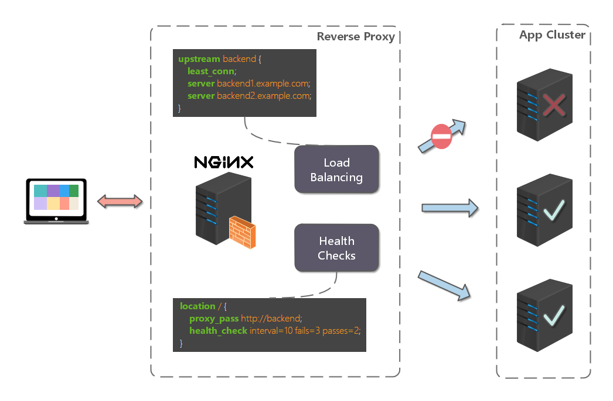

# 资料

> github：https://github.com/dunwu/nginx-tutorial
>
> 博客：https://dunwu.github.io/nginx-tutorial/#/


# Nginx 快速教程

> [Nginx 快速教程](https://dunwu.github.io/nginx-tutorial/#/nginx-quickstart)


## [一、Nginx 简介](https://dunwu.github.io/nginx-tutorial/#/nginx-quickstart?id=一、nginx-简介)

### **什么是 Nginx?**

**Nginx (engine x)** 是一款**轻量级的 Web 服务器** 、反向代理服务器及电子邮件（IMAP/POP3）代理服务器。


### **什么是反向代理？**

反向代理（Reverse Proxy）方式是指以代理服务器来接受 internet 上的连接请求，然后将请求转发给内部网络上的服务器，并将从服务器上得到的结果返回给 internet 上请求连接的客户端，此时代理服务器对外就表现为一个反向代理服务器。


### 正向代理 vs 反向代理

反向代理和正向代理是两种常见的代理服务器工作模式，它们在网络架构中扮演不同角色。以下是它们的核心异同点对比：

------

**一、核心概念对比**

|   **维度**   | **正向代理（Forward Proxy）** |   **反向代理（Reverse Proxy）**    |
| :----------: | :---------------------------: | :--------------------------------: |
| **代理对象** |    代理客户端（用户设备）     |      代理服务端（后端服务器）      |
| **用户感知** |  用户明确知道自己使用了代理   | 用户无感知，以为直接访问目标服务器 |
| **典型场景** |  科学上网、企业内网访问控制   |      负载均衡、CDN、Nginx网关      |
| **配置位置** |  客户端需要手动配置代理地址   |     服务端部署，客户端无需配置     |

------

**二、工作流程差异**

**正向代理流程**（用户→代理→互联网）

```
用户浏览器 → 配置代理 → 正向代理服务器 → 访问Google
```

- 特点：
  - 代理代表客户端向外部服务发起请求
  - 目标服务器看到的是代理服务器的IP，而非真实用户IP

**反向代理流程**（用户→代理→内网服务）

```
用户浏览器 → 访问www.example.com → 反向代理服务器 → 内部服务器群
```

- 特点：
  - 代理接收用户请求并转发到内部服务器
  - 用户认为自己在直接访问目标网站

------

**三、关键技术对比**

|  **技术点**  |           **正向代理**           |              **反向代理**              |
| :----------: | :------------------------------: | :------------------------------------: |
|  **IP隐藏**  | 隐藏客户端IP（服务端看到代理IP） |    隐藏服务端IP（客户端看到代理IP）    |
| **缓存机制** |   缓存常用内容（如网页、视频）   |       缓存静态资源（如CDN加速）        |
| **加密能力** |        常用于VPN加密隧道         | 提供SSL终止（HTTPS解密后转发内网HTTP） |
| **负载均衡** |            一般不涉及            |      核心功能（Nginx、HAProxy等）      |

------

**四、典型应用场景**

#### **正向代理案例**

1. **科学上网工具**（Shadowsocks/V2Ray）
2. **企业内网管控**：员工必须通过代理访问外网
3. **爬虫匿名**：通过代理池隐藏真实IP

#### **反向代理案例**

1. **Web服务器网关**：Nginx接收请求后转发到Tomcat集群
2. **CDN边缘节点**：用户就近访问缓存服务器
3. **API网关**：Kong/Apisix统一管理微服务入口

------

**五、配置示例**

**正向代理配置（Squid）**

```
# squid.conf 片段
http_port 3128
acl allowed_ips src 192.168.1.0/24
http_access allow allowed_ips
```

用户需在浏览器设置代理：`192.168.1.100:3128`

**反向代理配置（Nginx）**

```
server {
    listen 80;
    server_name example.com;
    
    location / {
        proxy_pass http://backend_servers;
        proxy_set_header Host $host;
    }
}

upstream backend_servers {
    server 10.1.1.1:8080 weight=5;
    server 10.1.1.2:8080;
}
```

------

**六、安全性与性能**

|   **特性**   |      **正向代理**      |     **反向代理**      |
| :----------: | :--------------------: | :-------------------: |
| **DDoS防护** |        无法防护        |  可集成WAF、速率限制  |
| **SSL处理**  |      通常全程加密      | 可终止SSL减轻后端压力 |
|  **吞吐量**  | 受限于单代理服务器性能 |  可通过集群横向扩展   |

------

**七、选择建议**

- **用正向代理当**：
  ✅ 需要隐藏客户端身份
  ✅ 突破网络访问限制
- **用反向代理当**：
  ✅ 需要保护后端服务器
  ✅ 实现高可用和负载均衡

------

**附：拓扑图对比**

```
正向代理：
[用户] → [正向代理] → [互联网]

反向代理：
[用户] → [反向代理] → [服务器A/B/C]
```


## [二、Nginx 入门](https://dunwu.github.io/nginx-tutorial/#/nginx-quickstart?id=二、nginx-入门)

> 详细安装方法请参考：[Nginx 运维](https://dunwu.github.io/nginx-tutorial/#/docs/nginx-install)

nginx 的使用比较简单，就是几条命令。

常用到的命令如下：

```batch
nginx -s stop       快速关闭Nginx，可能不保存相关信息，并迅速终止web服务。
nginx -s quit       平稳关闭Nginx，保存相关信息，有安排的结束web服务。
nginx -s reload     因改变了Nginx相关配置，需要重新加载配置而重载。
nginx -s reopen     重新打开日志文件。
nginx -c filename   为 Nginx 指定一个配置文件，来代替缺省的。
nginx -t            不运行，仅仅测试配置文件。nginx 将检查配置文件的语法的正确性，并尝试打开配置文件中所引用到的文件。
nginx -v            显示 nginx 的版本。
nginx -V            显示 nginx 的版本，编译器版本和配置参数。
```

如果不想每次都敲命令，可以在 nginx 安装目录下新添一个启动批处理文件**startup.bat**，双击即可运行。内容如下：

```batch
@echo off
rem 如果启动前已经启动nginx并记录下pid文件，会kill指定进程
nginx.exe -s stop

rem 测试配置文件语法正确性
nginx.exe -t -c conf/nginx.conf

rem 显示版本信息
nginx.exe -v

rem 按照指定配置去启动nginx
nginx.exe -c conf/nginx.conf
```

如果是运行在 Linux 下，写一个 shell 脚本，大同小异。

## [三、Nginx 实战](https://dunwu.github.io/nginx-tutorial/#/nginx-quickstart?id=三、nginx-实战)

我始终认为，各种开发工具的配置还是结合实战来讲述，会让人更易理解。

### openRestry默认配置

```nginx
#user  nobody;
worker_processes  1;

#error_log  logs/error.log;
#error_log  logs/error.log  notice;
#error_log  logs/error.log  info;

#pid        logs/nginx.pid;


events {
    worker_connections  1024;
}


http {
    include       mime.types;
    default_type  application/octet-stream;

    #log_format  main  '$remote_addr - $remote_user [$time_local] "$request" '
    #                  '$status $body_bytes_sent "$http_referer" '
    #                  '"$http_user_agent" "$http_x_forwarded_for"';

    #access_log  logs/access.log  main;

    sendfile        on;
    #tcp_nopush     on;

    #keepalive_timeout  0;
    keepalive_timeout  65;

    #gzip  on;

    server {
        listen       80;
        server_name  localhost;

        #charset koi8-r;

        #access_log  logs/host.access.log  main;

        location / {
            root   html;
            index  index.html index.htm;
        }

        #error_page  404              /404.html;

        # redirect server error pages to the static page /50x.html
        #
        error_page   500 502 503 504  /50x.html;
        location = /50x.html {
            root   html;
        }

        # proxy the PHP scripts to Apache listening on 127.0.0.1:80
        #
        #location ~ \.php$ {
        #    proxy_pass   http://127.0.0.1;
        #}

        # pass the PHP scripts to FastCGI server listening on 127.0.0.1:9000
        #
        #location ~ \.php$ {
        #    root           html;
        #    fastcgi_pass   127.0.0.1:9000;
        #    fastcgi_index  index.php;
        #    fastcgi_param  SCRIPT_FILENAME  /scripts$fastcgi_script_name;
        #    include        fastcgi_params;
        #}

        # deny access to .htaccess files, if Apache's document root
        # concurs with nginx's one
        #
        #location ~ /\.ht {
        #    deny  all;
        #}
    }


    # another virtual host using mix of IP-, name-, and port-based configuration
    #
    #server {
    #    listen       8000;
    #    listen       somename:8080;
    #    server_name  somename  alias  another.alias;

    #    location / {
    #        root   html;
    #        index  index.html index.htm;
    #    }
    #}


    # HTTPS server
    #
    #server {
    #    listen       443 ssl;
    #    server_name  localhost;

    #    ssl_certificate      cert.pem;
    #    ssl_certificate_key  cert.key;

    #    ssl_session_cache    shared:SSL:1m;
    #    ssl_session_timeout  5m;

    #    ssl_ciphers  HIGH:!aNULL:!MD5;
    #    ssl_prefer_server_ciphers  on;

    #    location / {
    #        root   html;
    #        index  index.html index.htm;
    #    }
    #}

}
```

默认文件路径与nginx文件同目录：

```bash
# ll /usr/local/openresty/nginx/
total 36
drwx------. 2 nobody root 4096 Mar 22  2023 client_body_temp
drwxr-xr-x. 2 root   root 4096 Sep  5  2024 conf
drwx------. 2 nobody root 4096 Mar 22  2023 fastcgi_temp
drwxr-xr-x. 2 root   root 4096 Sep  5  2024 html
drwxr-xr-x. 2 root   root 4096 Jul 14 20:04 logs
drwx------. 2 nobody root 4096 Mar 22  2023 proxy_temp
drwxr-xr-x. 2 root   root 4096 Sep  5  2024 sbin
drwx------. 2 nobody root 4096 Mar 22  2023 scgi_temp
drwx------. 2 nobody root 4096 Mar 22  2023 uwsgi_temp

# ll /usr/local/openresty/nginx/conf
total 68
-rw-r--r--. 1 root root 1077 Jul 19  2024 fastcgi.conf
-rw-r--r--. 1 root root 1077 Jul 19  2024 fastcgi.conf.default
-rw-r--r--. 1 root root 1007 Jul 19  2024 fastcgi_params
-rw-r--r--. 1 root root 1007 Jul 19  2024 fastcgi_params.default
-rw-r--r--. 1 root root 2837 Jul 19  2024 koi-utf
-rw-r--r--. 1 root root 2223 Jul 19  2024 koi-win
-rw-r--r--. 1 root root 5349 Jul 19  2024 mime.types
-rw-r--r--. 1 root root 5349 Jul 19  2024 mime.types.default
-rw-r--r--. 1 root root 2656 Jul 19  2024 nginx.conf
-rw-r--r--. 1 root root 2656 Jul 19  2024 nginx.conf.default
-rw-r--r--. 1 root root  636 Jul 19  2024 scgi_params
-rw-r--r--. 1 root root  636 Jul 19  2024 scgi_params.default
-rw-r--r--. 1 root root  664 Jul 19  2024 uwsgi_params
-rw-r--r--. 1 root root  664 Jul 19  2024 uwsgi_params.default
-rw-r--r--. 1 root root 3610 Jul 19  2024 win-utf

# cat /usr/local/openresty/nginx/conf/mime.types
types {
    text/html                                        html htm shtml;
    text/css                                         css;
    text/xml                                         xml;
    image/gif                                        gif;
    image/jpeg                                       jpeg jpg;
    application/javascript                           js;
    application/atom+xml                             atom;
    .....
    
    
```

#### 日志格式

**一、日志格式分解**

```
log_format main '$remote_addr - $remote_user [$time_local] "$request" '
                '$status $body_bytes_sent "$http_referer" '
                '"$http_user_agent" "$http_x_forwarded_for"';
```

**字段说明**

|         变量名          |             示例值             |                 含义                  |
| :---------------------: | :----------------------------: | :-----------------------------------: |
|     `$remote_addr`      |         `203.0.113.1`          |             客户端IP地址              |
|     `$remote_user`      |            `admin`             | HTTP基础认证的用户名（未认证时为`-`） |
|      `$time_local`      | `[02/Jul/2025:15:30:22 +0800]` |          本地时间（带时区）           |
|       `$request`        |   `"GET /api/data HTTP/1.1"`   |           完整的HTTP请求行            |
|        `$status`        |             `200`              |            HTTP响应状态码             |
|   `$body_bytes_sent`    |             `1024`             |       发送给客户端的body字节数        |
|     `$http_referer`     |    `"https://example.com/"`    |   **请求来源页（防盗链关键字段）**    |
|   `$http_user_agent`    |       `"Mozilla/5.0..."`       |           客户端浏览器标识            |
| `$http_x_forwarded_for` | `"203.0.113.1, 198.51.100.2"`  |     代理链IP（需代理服务器传递）      |

------

**二、典型日志输出示例**

```
203.0.113.1 - admin [02/Jul/2025:15:30:22 +0800] "GET /api/data HTTP/1.1" 
200 1024 "https://example.com/" 
"Mozilla/5.0 (Windows NT 10.0; Win64; x64) AppleWebKit/537.36..." 
"203.0.113.1, 198.51.100.2"
```


### [Http 反向代理](https://dunwu.github.io/nginx-tutorial/#/nginx-quickstart?id=http-反向代理)

我们先实现一个小目标：不考虑复杂的配置，仅仅是完成一个 http 反向代理。

`nginx.conf` 配置文件如下：

> ***注：`conf/nginx.conf` 是 nginx 的默认配置文件。你也可以使用 nginx -c 指定你的配置文件\***

```nginx
#运行用户
#user somebody;

#启动进程,通常设置成和cpu的数量相等
worker_processes  1;

#全局错误日志
error_log  D:/Tools/nginx-1.10.1/logs/error.log;
error_log  D:/Tools/nginx-1.10.1/logs/notice.log  notice;
error_log  D:/Tools/nginx-1.10.1/logs/info.log  info;

#PID文件，记录当前启动的nginx的进程ID
pid        D:/Tools/nginx-1.10.1/logs/nginx.pid;

#工作模式及连接数上限
events {
    worker_connections 1024;    #单个后台worker process进程的最大并发链接数
}

#设定http服务器，利用它的反向代理功能提供负载均衡支持
http {
    #设定mime类型(邮件支持类型),类型由mime.types文件定义
    include       D:/Tools/nginx-1.10.1/conf/mime.types;
    default_type  application/octet-stream;

    #设定日志
    log_format  main  '[$remote_addr] - [$remote_user] [$time_local] "$request" '
                      '$status $body_bytes_sent "$http_referer" '
                      '"$http_user_agent" "$http_x_forwarded_for"';

    access_log    D:/Tools/nginx-1.10.1/logs/access.log main;
    rewrite_log     on;

    #sendfile 指令指定 nginx 是否调用 sendfile 函数（zero copy 方式）来输出文件，对于普通应用，
    #必须设为 on,如果用来进行下载等应用磁盘IO重负载应用，可设置为 off，以平衡磁盘与网络I/O处理速度，降低系统的uptime.
    sendfile        on;
    #tcp_nopush     on;

    #连接超时时间
    keepalive_timeout  120;
    tcp_nodelay        on;

    #gzip压缩开关
    #gzip  on;

    #设定实际的服务器列表
    upstream zp_server1{
        server 127.0.0.1:8089;
    }

    #HTTP服务器
    server {
        #监听80端口，80端口是知名端口号，用于HTTP协议
        listen       80;

        #定义使用www.xx.com访问
        server_name  www.helloworld.com;

        #首页
        index index.html

        #指向webapp的目录
        root D:\01_Workspace\Project\github\zp\SpringNotes\spring-security\spring-shiro\src\main\webapp;

        #编码格式
        charset utf-8;

        #代理配置参数
        proxy_connect_timeout 180;
        proxy_send_timeout 180;
        proxy_read_timeout 180;
        proxy_set_header Host $host;
        proxy_set_header X-Forwarder-For $remote_addr;

        #反向代理的路径（和upstream绑定），location 后面设置映射的路径
        location / {
            proxy_pass http://zp_server1;
        }

        #静态文件，nginx自己处理
        location ~ ^/(images|javascript|js|css|flash|media|static)/ {
            root D:\01_Workspace\Project\github\zp\SpringNotes\spring-security\spring-shiro\src\main\webapp\views;
            #过期30天，静态文件不怎么更新，过期可以设大一点，如果频繁更新，则可以设置得小一点。
            expires 30d;
        }

        #设定查看Nginx状态的地址
        location /NginxStatus {
            stub_status           on;
            access_log            on;
            auth_basic            "NginxStatus";
            auth_basic_user_file  conf/htpasswd;
        }

        #禁止访问 .htxxx 文件
        location ~ /\.ht {
            deny all;
        }

        #错误处理页面（可选择性配置）
        #error_page   404              /404.html;
        #error_page   500 502 503 504  /50x.html;
        #location = /50x.html {
        #    root   html;
        #}
    }
}
```


好了，让我们来试试吧：

1. 启动 webapp，注意启动绑定的端口要和 nginx 中的 `upstream` 设置的端口保持一致。
2. 更改 host：在 C:\Windows\System32\drivers\etc 目录下的 host 文件中添加一条 DNS 记录

```
127.0.0.1 www.helloworld.com
```

1. 启动前文中 startup.bat 的命令
2. 在浏览器中访问 [www.helloworld.com，不出意外，已经可以访问了。](http://www.helloworld.xn--com,,-ri1hi2ayve9sgnfr4qtgo7zjr48hrtvb1b8a./)

### [Https 反向代理](https://dunwu.github.io/nginx-tutorial/#/nginx-quickstart?id=https-反向代理)

一些对安全性要求比较高的站点，可能会使用 HTTPS（一种使用 ssl 通信标准的安全 HTTP 协议）。

这里不科普 HTTP 协议和 SSL 标准。但是，使用 nginx 配置 https 需要知道几点：

- HTTPS 的固定端口号是 443，不同于 HTTP 的 80 端口
- **SSL 标准需要引入安全证书**，所以在 nginx.conf 中你需要指定证书和它对应的 key

其他和 http 反向代理基本一样，只是在 `Server` 部分配置有些不同。

```nginx
  #HTTP服务器
  server {
      #监听443端口。443为知名端口号，主要用于HTTPS协议
      listen       443 ssl;

      #定义使用www.xx.com访问
      server_name  www.helloworld.com;

      #ssl证书文件位置(常见证书文件格式为：crt/pem)
      ssl_certificate      cert.pem;
      #ssl证书key位置
      ssl_certificate_key  cert.key;

      #ssl配置参数（选择性配置）
      ssl_session_cache    shared:SSL:1m;
      ssl_session_timeout  5m;
      #数字签名，此处使用MD5
      ssl_ciphers  HIGH:!aNULL:!MD5;
      ssl_prefer_server_ciphers  on;

      location / {
          root   /root;
          index  index.html index.htm;
      }
  }
```

### [负载均衡](https://dunwu.github.io/nginx-tutorial/#/nginx-quickstart?id=负载均衡)

前面的例子中，代理仅仅指向一个服务器。

但是，网站在实际运营过程中，大部分都是以集群的方式运行，这时需要使用负载均衡来分流。

nginx 也可以实现简单的负载均衡功能。



假设这样一个应用场景：将应用部署在 192.168.1.11:80、192.168.1.12:80、192.168.1.13:80 三台 linux 环境的服务器上。

网站域名叫 [www.helloworld.com，公网](http://www.helloworld.xn--com,-tt8fy44v/) IP 为 192.168.1.11。在公网 IP 所在的服务器上部署 nginx，对所有请求做负载均衡处理（下面例子中使用的是加权轮询策略）。

nginx.conf 配置如下：

```nginx
http {
     #设定mime类型,类型由mime.type文件定义
    include       /etc/nginx/mime.types;
    default_type  application/octet-stream;
    #设定日志格式
    access_log    /var/log/nginx/access.log;

    #设定负载均衡的服务器列表
    upstream load_balance_server {
        #weigth参数表示权值，权值越高被分配到的几率越大
        server 192.168.1.11:80   weight=5;
        server 192.168.1.12:80   weight=1;
        server 192.168.1.13:80   weight=6;
    }

   #HTTP服务器
   server {
        #侦听80端口
        listen       80;

        #定义使用www.xx.com访问
        server_name  www.helloworld.com;

        #对所有请求进行负载均衡请求
        location / {
            root        /root;                 #定义服务器的默认网站根目录位置
            index       index.html index.htm;  #定义首页索引文件的名称
            proxy_pass  http://load_balance_server ;#请求转向load_balance_server 定义的服务器列表

            #以下是一些反向代理的配置(可选择性配置)
            #proxy_redirect off;
            proxy_set_header Host $host;
            proxy_set_header X-Real-IP $remote_addr;
            #后端的Web服务器可以通过X-Forwarded-For获取用户真实IP
            proxy_set_header X-Forwarded-For $remote_addr;
            proxy_connect_timeout 90;          #nginx跟后端服务器连接超时时间(代理连接超时)
            proxy_send_timeout 90;             #后端服务器数据回传时间(代理发送超时)
            proxy_read_timeout 90;             #连接成功后，后端服务器响应时间(代理接收超时)
            proxy_buffer_size 4k;              #设置代理服务器（nginx）保存用户头信息的缓冲区大小
            proxy_buffers 4 32k;               #proxy_buffers缓冲区，网页平均在32k以下的话，这样设置
            proxy_busy_buffers_size 64k;       #高负荷下缓冲大小（proxy_buffers*2）
            proxy_temp_file_write_size 64k;    #设定缓存文件夹大小，大于这个值，将从upstream服务器传

            client_max_body_size 10m;          #允许客户端请求的最大单文件字节数
            client_body_buffer_size 128k;      #缓冲区代理缓冲用户端请求的最大字节数
        }
    }
}
```

#### [负载均衡策略](https://dunwu.github.io/nginx-tutorial/#/nginx-quickstart?id=负载均衡策略)

Nginx 提供了多种负载均衡策略，让我们来一一了解一下：

负载均衡策略在各种分布式系统中基本上原理一致，对于原理有兴趣，不妨参考 [负载均衡](https://dunwu.github.io/blog/pages/98a1c1/)

##### [轮询](https://dunwu.github.io/nginx-tutorial/#/nginx-quickstart?id=轮询)

```nginx
upstream bck_testing_01 {
  # 默认所有服务器权重为 1
  server 192.168.250.220:8080
  server 192.168.250.221:8080
  server 192.168.250.222:8080
}
```

##### [加权轮询](https://dunwu.github.io/nginx-tutorial/#/nginx-quickstart?id=加权轮询)

```nginx
upstream bck_testing_01 {
  server 192.168.250.220:8080   weight=3
  server 192.168.250.221:8080              # default weight=1
  server 192.168.250.222:8080              # default weight=1
}
```

##### [最少连接](https://dunwu.github.io/nginx-tutorial/#/nginx-quickstart?id=最少连接)

```nginx
upstream bck_testing_01 {
  least_conn;

  # with default weight for all (weight=1)
  server 192.168.250.220:8080
  server 192.168.250.221:8080
  server 192.168.250.222:8080
}
```

##### [加权最少连接](https://dunwu.github.io/nginx-tutorial/#/nginx-quickstart?id=加权最少连接)

```nginx
upstream bck_testing_01 {
  least_conn;

  server 192.168.250.220:8080   weight=3
  server 192.168.250.221:8080              # default weight=1
  server 192.168.250.222:8080              # default weight=1
}
```

##### [IP Hash](https://dunwu.github.io/nginx-tutorial/#/nginx-quickstart?id=ip-hash)

```nginx
upstream bck_testing_01 {

  ip_hash;

  # with default weight for all (weight=1)
  server 192.168.250.220:8080
  server 192.168.250.221:8080
  server 192.168.250.222:8080

}
```

##### [普通 Hash](https://dunwu.github.io/nginx-tutorial/#/nginx-quickstart?id=普通-hash)

```nginx
upstream bck_testing_01 {

  hash $request_uri;

  # with default weight for all (weight=1)
  server 192.168.250.220:8080
  server 192.168.250.221:8080
  server 192.168.250.222:8080

}
```

### [网站有多个 webapp 的配置](https://dunwu.github.io/nginx-tutorial/#/nginx-quickstart?id=网站有多个-webapp-的配置)

当一个网站功能越来越丰富时，往往需要将一些功能相对独立的模块剥离出来，独立维护。这样的话，通常，会有多个 webapp。

举个例子：假如 [www.helloworld.com](http://www.helloworld.com/) 站点有好几个 webapp，finance（金融）、product（产品）、admin（用户中心）。访问这些应用的方式通过上下文(context)来进行区分:

[www.helloworld.com/finance/](http://www.helloworld.com/finance/)

[www.helloworld.com/product/](http://www.helloworld.com/product/)

[www.helloworld.com/admin/](http://www.helloworld.com/admin/)

我们知道，http 的默认端口号是 80，如果在一台服务器上同时启动这 3 个 webapp 应用，都用 80 端口，肯定是不成的。所以，这三个应用需要分别绑定不同的端口号。

那么，问题来了，用户在实际访问 [www.helloworld.com](http://www.helloworld.com/) 站点时，访问不同 webapp，总不会还带着对应的端口号去访问吧。所以，你再次需要用到反向代理来做处理。

配置也不难，来看看怎么做吧：

```nginx
http {
    #此处省略一些基本配置

    upstream product_server{
        server www.helloworld.com:8081;
    }

    upstream admin_server{
        server www.helloworld.com:8082;
    }

    upstream finance_server{
        server www.helloworld.com:8083;
    }

    server {
        #此处省略一些基本配置
        #默认指向product的server
        location / {
            proxy_pass http://product_server;
        }

        location /product/{
            proxy_pass http://product_server;
        }

        location /admin/ {
            proxy_pass http://admin_server;
        }

        location /finance/ {
            proxy_pass http://finance_server;
        }
    }
}
```

> 不同路径指向不同的上游服务 upstream


### [静态站点](https://dunwu.github.io/nginx-tutorial/#/nginx-quickstart?id=静态站点)

有时候，我们需要配置静态站点(即 html 文件和一堆静态资源)。

举例来说：如果所有的静态资源都放在了 `/app/dist` 目录下，我们只需要在 `nginx.conf` 中指定首页以及这个站点的 host 即可。

配置如下：

```nginx
worker_processes  1;

events {
    worker_connections  1024;
}

http {
    include       mime.types;
    default_type  application/octet-stream;
    sendfile        on;
    keepalive_timeout  65;

    gzip on;
    gzip_types text/plain application/x-javascript text/css application/xml text/javascript application/javascript image/jpeg image/gif image/png;
    gzip_vary on;

    server {
        listen       80;
        server_name  static.zp.cn;

        location / {
            root /app/dist;
            index index.html;
            #转发任何请求到 index.html
        }
    }
}
```

然后，添加 HOST：

127.0.0.1 static.zp.cn

此时，在本地浏览器访问 static.zp.cn ，就可以访问静态站点了。

### [搭建文件服务器](https://dunwu.github.io/nginx-tutorial/#/nginx-quickstart?id=搭建文件服务器)

有时候，团队需要归档一些数据或资料，那么文件服务器必不可少。使用 Nginx 可以非常快速便捷的搭建一个简易的文件服务。

Nginx 中的配置要点：

- 将 autoindex 开启可以显示目录，默认不开启。
- 将 autoindex_exact_size 开启可以显示文件的大小。
- 将 autoindex_localtime 开启可以显示文件的修改时间。
- root 用来设置开放为文件服务的根路径。
- charset 设置为 `charset utf-8,gbk;`，可以避免中文乱码问题（windows 服务器下设置后，依然乱码，本人暂时没有找到解决方法）。

一个最简化的配置如下：

```nginx
autoindex on;# 显示目录
autoindex_exact_size on;# 显示文件大小
autoindex_localtime on;# 显示文件时间

server {
    charset      utf-8,gbk; # windows 服务器下设置后，依然乱码，暂时无解
    listen       9050 default_server;
    listen       [::]:9050 default_server;
    server_name  _;
    root         /share/fs;
}
```

### [解决跨域](https://dunwu.github.io/nginx-tutorial/#/nginx-quickstart?id=解决跨域)

web 领域开发中，经常采用前后端分离模式。这种模式下，前端和后端分别是独立的 web 应用程序，例如：后端是 Java 程序，前端是 React 或 Vue 应用。

各自独立的 web app 在互相访问时，势必存在跨域问题。解决跨域问题一般有两种思路：

1. **CORS**

在后端服务器设置 HTTP 响应头，把你需要允许访问的域名加入 `Access-Control-Allow-Origin` 中。

1. **jsonp**

把后端根据请求，构造 json 数据，并返回，前端用 jsonp 跨域。

这两种思路，本文不展开讨论。

需要说明的是，nginx 根据第一种思路，也提供了一种解决跨域的解决方案。

举例：[www.helloworld.com](http://www.helloworld.com/) 网站是由一个前端 app ，一个后端 app 组成的。前端端口号为 9000， 后端端口号为 8080。

前端和后端如果使用 http 进行交互时，请求会被拒绝，因为存在跨域问题。来看看，nginx 是怎么解决的吧：

首先，在 enable-cors.conf 文件中设置 cors ：

```nginx
# allow origin list
set $ACAO '*';

# set single origin
if ($http_origin ~* (www.helloworld.com)$) {
  set $ACAO $http_origin;
}

if ($cors = "trueget") {
    add_header 'Access-Control-Allow-Origin' "$http_origin";
    add_header 'Access-Control-Allow-Credentials' 'true';
    add_header 'Access-Control-Allow-Methods' 'GET, POST, OPTIONS';
    add_header 'Access-Control-Allow-Headers' 'DNT,X-Mx-ReqToken,Keep-Alive,User-Agent,X-Requested-With,If-Modified-Since,Cache-Control,Content-Type';
}

if ($request_method = 'OPTIONS') {
  set $cors "${cors}options";
}

if ($request_method = 'GET') {
  set $cors "${cors}get";
}

if ($request_method = 'POST') {
  set $cors "${cors}post";
}
```

接下来，在你的服务器中 `include enable-cors.conf` 来引入跨域配置：

```nginx
# ----------------------------------------------------
# 此文件为项目 nginx 配置片段
# 可以直接在 nginx config 中 include（推荐）
# 或者 copy 到现有 nginx 中，自行配置
# www.helloworld.com 域名需配合 dns hosts 进行配置
# 其中，api 开启了 cors，需配合本目录下另一份配置文件
# ----------------------------------------------------
upstream front_server{
  server www.helloworld.com:9000;
}
upstream api_server{
  server www.helloworld.com:8080;
}

server {
  listen       80;
  server_name  www.helloworld.com;

  location ~ ^/api/ {
    include enable-cors.conf;
    proxy_pass http://api_server;
    rewrite "^/api/(.*)$" /$1 break;
  }

  location ~ ^/ {
    proxy_pass http://front_server;
  }
}
```

到此，就完成了。

## [资源](https://dunwu.github.io/nginx-tutorial/#/nginx-quickstart?id=资源)

- [Nginx 的中文维基](http://tool.oschina.net/apidocs/apidoc?api=nginx-zh)
- [Nginx 开发从入门到精通](http://tengine.taobao.org/book/index.html)
- [nginx-admins-handbook](https://github.com/trimstray/nginx-admins-handbook)
- [nginxconfig.io](https://nginxconfig.io/) - 一款 Nginx 配置生成器


# [Nginx 运维](https://dunwu.github.io/nginx-tutorial/#/nginx-ops?id=nginx-运维)