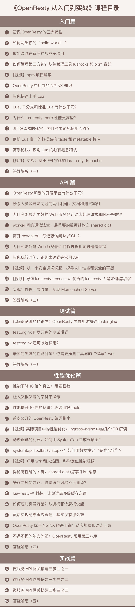
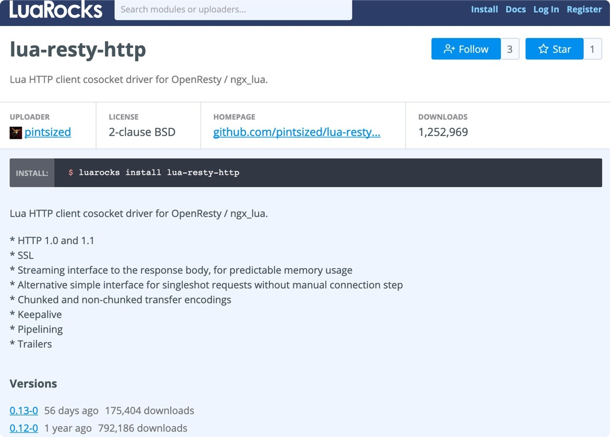
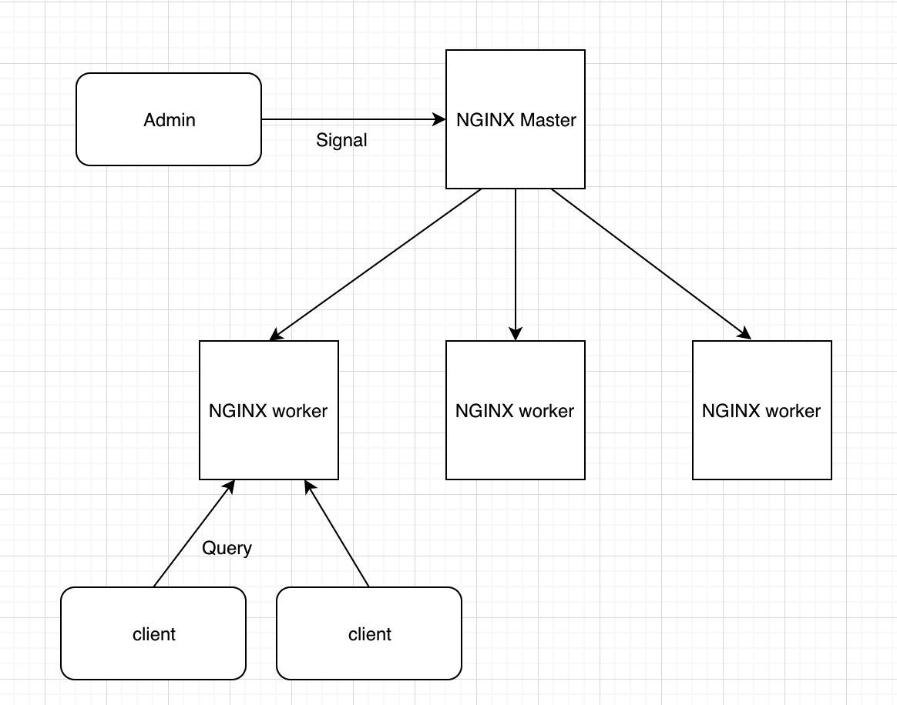
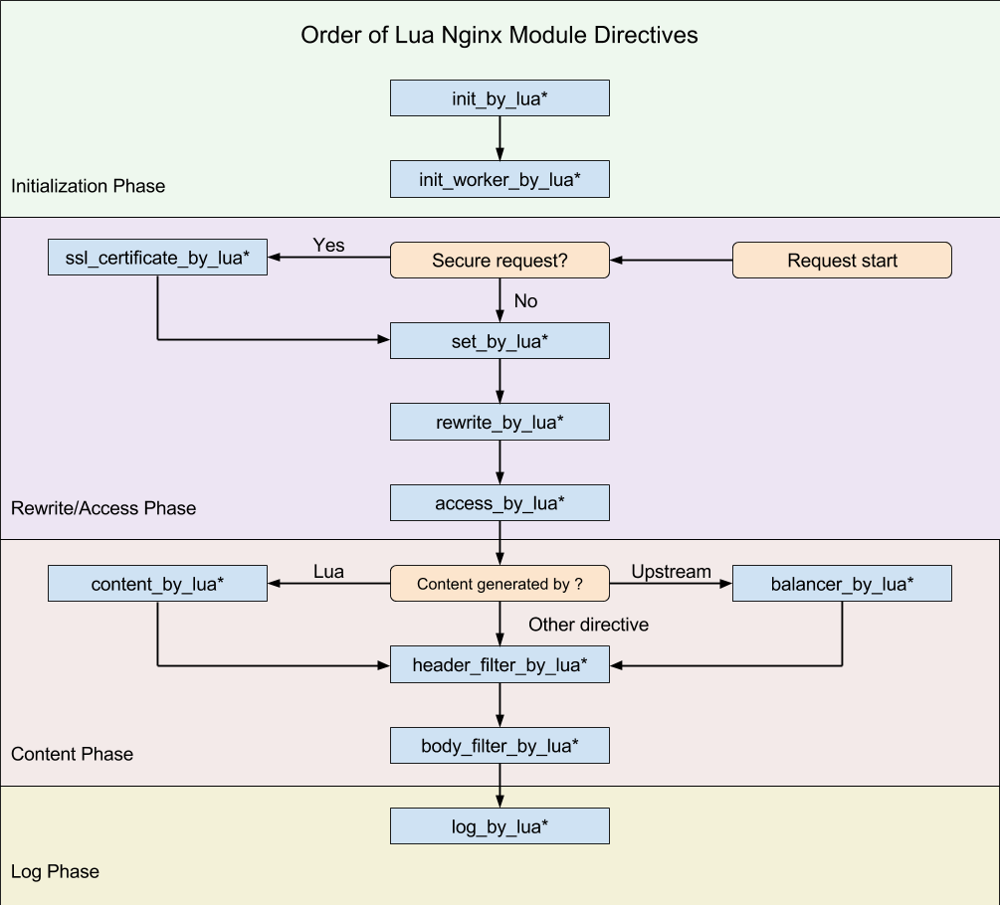
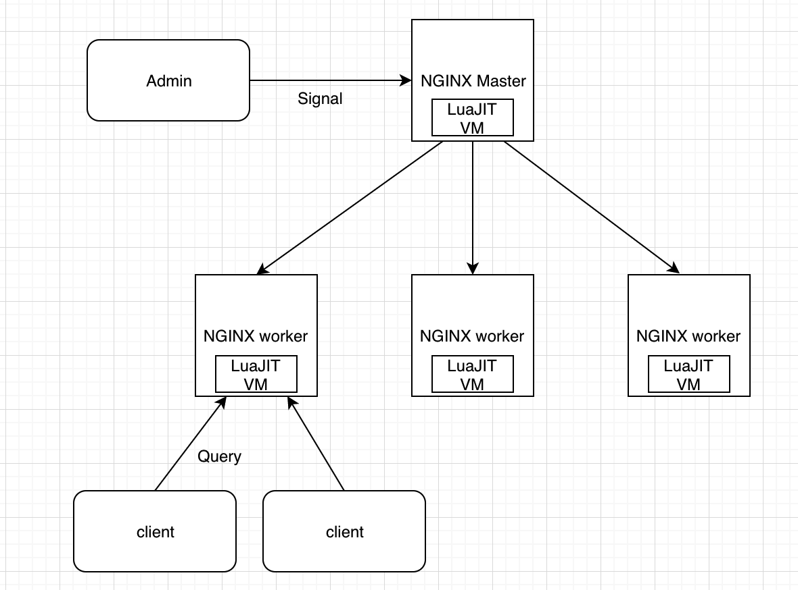

# 课程介绍


> [OpenResty 从入门到实战](https://time.geekbang.org/column/intro/100028301)





## 一些资料

官网： https://openresty.org/cn/installation.html

OpenResty 在 GitHub 的  [项目主页](https://github.com/openresty/)

## 一些基础介绍

### perl 语言

Perl（Practical Extraction and Reporting Language）是一种通用的脚本编程语言，由Larry Wall于1987年创建。Perl的设计目标是通过简洁的语法和强大的文本处理能力来提供一种实用的工具，用于文本处理、系统管理、网络编程、图形界面开发等各种任务。

Perl具有许多特性，使其成为一种灵活且功能强大的编程语言：

1. 文本处理能力：Perl在处理文本和字符串方面非常强大，提供了丰富的正则表达式支持和内置的文本处理函数，使得处理和转换文本数据变得非常方便。
2. 多用途：Perl可以用于各种任务，包括系统管理、日志分析、网络编程、Web开发、数据库操作等。它具有广泛的模块库，可以轻松地扩展其功能。
3. 跨平台：Perl可以在多个操作系统上运行，包括Unix/Linux、Windows、Mac等。
4. 高级特性：Perl支持面向对象编程（OOP），具有异常处理、模块化、动态类型等高级特性。
5. CPAN：CPAN（Comprehensive Perl Archive Network）是Perl社区的官方模块库，提供了大量的可重用模块，可以帮助开发人员快速构建复杂的应用程序。


# 开篇词 | OpenResty，为你打开高性能开发的大门

​		你好，我是温铭，OpenResty 软件基金会主席，曾任某开源商业公司合伙人，前 360 开源技术委员会委员，在互联网安全公司工作了 10 年，**负责开发过云查杀、反钓鱼和企业安全产品**。接下来的几个月，我会带着你系统地学习一下 OpenResty。


## 为什么学习 OpenResty

为什么学习 OpenResty，这是开篇的第一个问题。我们正身处技术日新月异的时代，经常听到周围的工程师开玩笑说，学不动了。

人的精力有限，选择学习某个技术都会有机会成本。最好的选择，是从你工作中涉及到的部分出发，学以致用。


对于服务端工程师来说，如果你的工作中涉及到 NGINX、高性能、高并发、动态控制、性能测试和分析等，那么不管开发语言和平台是什么，这门 OpenResty 课程都会让你有所裨益。如果你之前没有接触过 OpenResty，我确信它会给你打开另外一个服务端世界的大门。


OpenResty 是一个兼具开发效率和性能的服务端开发平台，**虽然它基于 NGINX 实现，但其适用范围，早已远远超出反向代理和负载均衡**。


**它的核心是基于 NGINX 的一个 C 模块（lua-nginx-module）**，该模块将 **LuaJIT** 嵌入到 NGINX 服务器中，并对外提供一套完整的 Lua API，透明地支持非阻塞 I/O，提供了轻量级线程、定时器等高级抽象。同时，围绕这个模块，OpenResty 构建了一套完备的测试框架、调试技术以及由 Lua 实现的周边功能库。


你可以用 Lua 语言来进行字符串和数值运算、查询数据库、发送 HTTP 请求、执行定时任务、调用外部命令等，还可以用 FFI 的方式调用外部 C 函数。这基本上可以满足服务端开发需要的所有功能。

掌握好了 OpenResty，你就可以同时拥有脚本语言的开发效率和迭代速度，以及 NGINX C 模块的高并发和高性能优势。


## 我与 OpenResty 的渊源

说了这么多 OpenResty 的特点，我又是怎样与它结缘的呢？

其实，我是在 2012 年开始接触 OpenResty 的，那会儿我正在为一个新的系统做技术选型，作为一个 Python 的忠实粉丝，我不喜欢 NGINX C 模块的艰涩，却希望得到它的高性能，鱼与熊掌想兼得。该怎么办呢？


经过一番搜寻后，我发现了 Python 社区“大妈” ZQ 的一篇介绍 OpenResty 的文章，可以说是如获至宝。不过，兴奋只持续了很短的时间，因为之后的我，就像是无头苍蝇一样，开始在黑暗中摸索着缓慢前行。踩了数不清的坑后，我才真正拿下了 OpenResty。


和很多工程师不同的是，我喜欢写文章，在大学期间就一直维护着自己的技术博客。有一天晚上加班时，我发现身边一位工程师在用 GitHub 记录 ELK 的使用心得，并发布到了 **GitBook** 上。原来 GitHub 还可以开源书籍，而不只是代码！


我一下子就被点燃了，当晚就列出了**《OpenResty 最佳实践》**的目录，并开始“鼓动”周围的工程师加入。我们从未宣传过这个开源项目，但它慢慢变成了 OpenResty 入门者的最佳伙伴。


不过，在加入 OpenResty Inc. 后，我才逐渐发现，能写出正确的 OpenResty 代码并避免常见的坑，和写出高性能、优质的 OpenResty 代码之间，还相差了十万八千里。**而跨越这个巨大鸿沟的法宝零件，散落在 OpenResty 开源项目的源码、文档、issue、PR、幻灯片、邮件列表中，需要你把它们串联成真正的法宝——一个完整的学习体系和知识图谱**。


那如何才能体系化学习 OpenResty 呢？在 OpenResty 的技术交流群里面，很多工程师都曾经有过这样的困惑。


事实上，OpenResty 的学习资料还比较少，官方只有 API 文档，并没有提供入门和进阶的文档，而网上能找到的资料也不够系统。可以说，绝大部分的 OpenResty 使用者都是在摸着石头过河，过程很痛苦。


因此，我与极客时间合作了这个专栏，目的很明确，就是让你轻松快速地入门，并给你描绘出 OpenResty 的全貌，帮你建立知识体系，带你真正掌握 OpenResty 这款开发利器。


## 学习这个专栏需要什么基础？

OpenResty 是在 **NGINX 和 LuaJIT 的基础**上搭建的，所以我们肯定需要 NGINX 和 LuaJIT 的基础知识。


但你只需要很少的 NGINX 知识，就足够开始 OpenResty 之旅了。少到什么程度呢？涉及到的 NGINX 知识，我只用一节课就介绍完了。即使你完全没有接触过 NGINX，也可以跟着课程的节奏，逐步学习 OpenResty。


要知道，OpenResty 并不等同于 NGINX，OpenResty 这个项目的目的之一，就是让你感知不到 NGINX 的存在。


而从编程语言来看，Lua 是一种很容易理解的语言，你只要能够看懂它的代码，就可以完成本专栏的学习，并不需要能够独立写出复杂的 Lua 代码。同样的，我也会花少数几节课的时间，带你入门 Lua，达到 OpenResty 的使用水准。


## 实战中来，到实战中去

实践出真知，这句话用在互联网技术的学习上很恰当。


和理论偏多的书籍不同，专栏的形式本身更偏重于实战。专栏中出现的不少代码，都源自开源 OpenResty 的测试案例，以及实际的开源项目。引用这些实际案例，就是希望你在入门之初，就能接触到最优秀的代码，了解到最真实的使用场景。


同时，我还会在专栏文章中，穿插多个视频课程。视频课的内容，都取自真实开源项目的功能点和 PR。通过视频，你会亲眼看到，刚刚学到的知识是如何在实际中使用的。


专栏最后的实战部分，则是我们的真实“战场”。我会带你一起，用 OpenResty 从零搭建一个微服务 API 网关。根据我们在社区中的统计，接近一半的 OpenResty 使用者，都把 OpenResty 用在 API 网关的开发上，Kong 和 orange 则是 OpenResty 领域中最流行的两个开源网关项目。你想自己从头搭建一个更简单、更高性能的 API 网关吗？一起来吧。


从实际的开源项目中学习，再到实际的开源项目中去实战，将实战融入完整的知识体系，这便是我的教学理念，希望你喜欢这种方式。


万尺高楼平地起，接下来，我会和你一起来逐步掌握 OpenResty，Enjoy！


# 入门篇

## 01 | 初探OpenResty的三大特性

### OpenResty 的发展

OpenResty 并不像其他的开发语言一样从零开始搭建，而是**基于成熟的开源组件——NGINX 和 LuaJIT**。

OpenResty 诞生于 2007 年，不过，它的**第一个版本并没有选择 Lua，而是用了 Perl**，这跟作者**章亦春**的技术偏好有很大关系。


但 Perl 的性能远远不能达到要求，于是，在第二个版本中，Perl 就被 Lua 给替换了。 不过，**在 OpenResty 官方的项目中，Perl 依然占据着重要的角色，OpenResty 工程化方面都是用 Perl 来构建，比如测试框架、Linter、CLI 等**，后面我们也会逐步介绍。


后来，章亦春离开了淘宝，加入了美国的 CDN 公司 Cloudflare。因为 OpenResty 高性能和动态的优势很适合 CDN 的业务需求，很快， OpenResty 就成为 CDN 的技术标准。 通过丰富的 lua-resty 库，OpenResty 开始逐渐摆脱 NGINX 的影子，形成自己的生态体系，在 API 网关、**软 WAF（软件 Web 应用程序防火墙（Web Application Firewall）** 等领域被广泛使用。


其实，我经常说，OpenResty 是一个被广泛使用的技术，但它并不能算得上是热门技术，这听上去有点矛盾，到底什么意思呢？

说它应用广，是因为 OpenResty 现在是全球排名第五的 Web 服务器。我们经常用到的 **12306 的余票查询功能，或者是京东的商品详情页**，这些高流量的背后，其实都是 OpenResty 在默默地提供服务。


说它并不热门，那是因为使用 OpenResty 来构建业务系统的比例并不高。使用者大都用 OpenResty 来处理入口流量，并没有深入到业务里面去，自然，对于 OpenResty 的使用也是浅尝辄止，满足当前的需求就可以了。这当然也与 OpenResty 没有像 Java、Python 那样有成熟的 Web 框架和生态有关。


说了这么多，接下来，我重点来介绍下，OpenResty 这个开源项目值得称道和学习的几个地方。


### OpenResty 的三大特性

#### 详尽的文档和测试用例

没错，文档和测试是判断开源项目是否靠谱的关键指标，甚至是排在代码质量和性能之前的。

OpenResty 的文档非常详细，作者把每一个需要注意的点都写在了文档中。绝大部分时候，我们只需要仔细查看文档，就能解决遇到的问题，而不用谷歌搜索或者是跟踪到源码中。为了方便起见，OpenResty 还自带了一个命令行工具`restydoc`，专门用来帮助你通过 shell 查看文档，避免编码过程被打断。


不过，文档中只会有一两个通用的代码片段，并没有完整和复杂的示例，到哪里可以找到这样的例子呢？

对于 OpenResty 来说，自然是`/t`目录，它里面就是所有的测试案例。每一个测试案例都包含完整的 NGINX 配置和 Lua 代码，以及测试的输入数据和预期的输出数据。不过，OpenResty 使用的测试框架，与其他断言风格的测试框架完全不同，后面我会用专门章节来做介绍。


#### 同步非阻塞

协程，是很多脚本语言为了提升性能，在近几年新增的特性。但它们实现得并不完美，有些是**语法糖**，有些还需要显式的关键字声明。


OpenResty 则没有历史包袱，在诞生之初就支持了协程，并基于此实现了**同步非阻塞**的编程模式。这一点是很重要的，毕竟，程序员也是人，代码应该更符合人的思维习惯。显式的回调和异步关键字会打断思路，也给调试带来了困难。


这里我解释一下，什么是同步非阻塞。先说同步，这个很简单，就是按照代码来顺序执行。比如下面这段伪码：

```lua
local res, err  = query-mysql(sql)
local value, err = query-redis(key)
```

在同一请求连接中，如果要等 MySQL 的查询结果返回后，才能继续去查询 Redis，那就是同步；如果不用等 MySQL 的返回，就能继续往下走，去查询 Redis，那就是异步。对于 OpenResty 来说，绝大部分都是同步操作，只有 `ngx.timer` 这种后台定时器相关的 API，才是异步操作。


再来说说非阻塞，这是一个很容易和“异步”混淆的概念。**这里我们说的“阻塞”，特指阻塞操作系统线程**。我们继续看上面的例子，假设查询 MySQL 需要 1s 的时间，如果在这 1s 内，操作系统的资源（CPU）是空闲着并傻傻地等待返回，那就是阻塞；如果 CPU 趁机去处理其他连接的请求，那就是非阻塞。非阻塞也是 C10K（"Concurrent 10,000 Connections）、C100K 这些高并发能够实现的关键。


同步非阻塞这个概念很重要，建议你仔细琢磨一下。我认为，这一概念最好不要通过类比来理解，因为不恰当的类比，很可能把你搞得更糊涂。

在 OpenResty 中，上面的伪码就可以直接实现同步非阻塞，而不用任何显式的关键字。这里也再次体现了，让开发者用起来更简单，是 OpenResty 的理念之一。


#### 动态

OpenResty 有一个非常大的优势，并且还没有被充分挖掘，就是它的**动态**。


传统的 Web 服务器，比如 NGINX，如果发生任何的变动，都需要你去修改磁盘上的配置文件，然后重新加载才能生效，这也是因为它们并没有提供 API，来控制运行时的行为。

所以，在需要频繁变动的微服务领域，NGINX 虽然有多次尝试，但毫无建树。而**异军突起的 Envoy， 正是凭着 xDS 这种动态控制的 API**，大有对 NGINX 造成降维攻击的威胁。


和 NGINX 、 Envoy 不同的是，OpenResty 是由脚本语言 Lua 来控制逻辑的，而动态，便是 Lua 天生的优势。通过 OpenResty 中 lua-nginx-module 模块中提供的 Lua API，我们可以动态地控制路由、上游、SSL 证书、请求、响应等。甚至更进一步，你可以在不重启 OpenResty 的前提下，修改业务的处理逻辑，并不局限于 OpenResty 提供的 Lua API。


这里有一个很合适的类比，可以帮你理解上面关于动态的说明。你可以把 Web 服务器当做是一个正在高速公路上飞驰的汽车，NGINX 需要停车才能更换轮胎，更换车漆颜色；Envoy 可以一边跑一边换轮胎和颜色；而 OpenResty 除了具备前者能力外，还可以在不停车的情况下，直接把汽车从 SUV 变成跑车。


显然，掌握这种“逆天”的能力后，OpenResty 的能力圈和想象力就扩展到了其他领域，比如  Serverless 和边缘计算等。


### 你学习的重点在哪里？

讲了这么多 OpenResty 的重点特性，你又该怎么学呢？我认为，学习需要抓重点，围绕主线来展开，而不是眉毛胡子一把抓，这样，你才能构建出脉络清晰的知识体系。

要知道，不管多么全面的课程，都不可能覆盖所有问题，更不能直接帮你解决线上的每个 bug 和异常。

回到 OpenResty 的学习，在我看来，想要学好 OpenResty，你必须理解下面 8 个重点：

- 同步非阻塞的编程模式；
- 不同阶段的作用；
- LuaJIT 和 Lua 的不同之处；
- OpenResty API 和周边库；
- 协程和 cosocket；
- 单元测试框架和性能测试工具；
- 火焰图和周边工具链；
- 性能优化。

这些内容正是我们学习的重点，在专栏的各个模块中我都会分别讲到。在学习的过程中，我希望你能举一反三，并且根据自己的兴趣点和背景，有针对性地深入阅读某些章节。


如果你是 OpenResty 的初学者，那么你可以完全跟着专栏的进度，在自己的环境中安装 OpenResty，运行并修改示例代码。要记住，你的重点在于构建 OpenResty 的全貌，而非死磕某个知识点。当然，如果你有疑问的地方，随时可以在留言区提出，我会解答你的困惑。

如果你正在项目中使用 OpenResty，那就太棒了，相信你在阅读 LuaJIT 和性能优化章节时，一定会有更多的共鸣，更能应用到实际，在你的项目中看到优化前后的性能指标变化。

另外，如果你想要给 OpenResty 以及周边库贡献代码，那么最大的门槛，并不是对 OpenResty 原理的理解，或者是如何编写 NGINX C 模块的问题，而是测试案例和代码规范。我见过太多 OpenResty 的代码贡献者（也包括我自己），在一个 PR 上反复修改测试案例和代码风格，这其中有太多鲜为人知的潜规则。所以，专栏的代码规范和单元测试部分，就是为你准备的。

而如果你是测试工程师，即使你不使用 OpenResty，OpenResty 的测试框架和性能分析工具集，也必能给你非常多的启发。毕竟，OpenResty 在测试上面的投入和积累是相当深厚的。


## 02 | 如何写出你的“hello world”？

每当我们开始学习一个新的开发语言或者平台，都会从最简单的`hello world`开始，OpenResty 也不例外。让我们先跳过安装的步骤，直接看下，最简单的 OpenResty 程序是怎么编写和运行的：

```
$ resty -e "ngx.say('hello world')"
hello world
```

这应该是你见过的最简单的那种 hello world 代码写法，和 Python 类似：

```
$ python -c 'print("hello world")'
hello world
```


这背后其实是 OpenResty 哲学的一种体现，代码要足够简洁，也好让你打消“从入门到放弃“的念头。我们今天的内容，就专门围绕着这行代码来展开聊一聊。


上一节我们讲过，OpenResty 是基于 NGINX 的。那你现在是不是有一个疑问：为什么这里看不到 NGINX 的影子？别着急，我们加一行代码，看看 `resty`背后真正运行的是什么：

```
resty -e "ngx.say('hello world'); ngx.sleep(10)" &
```

我们加了一行 sleep 休眠的代码，让 resty 运行的程序打印出字符串后，并不退出。这样，我们就有机会一探究竟：

```
$ ps -ef | grep nginx
501 25468 25462   0  7:24下午 ttys000    0:00.01 /usr/local/Cellar/openresty/''1.13.6.2/nginx/sbin/nginx -p /tmp/resty_AfNwigQVOB/ -c conf/nginx.conf
```

终于看了熟悉的 NGINX 进程。看来，`resty` 本质上是启动了一个 NGINX 服务，那么`resty` 又是一个什么程序呢？我先卖个关子，咱后面再讲。

你的机器上可能还没有安装 OpenResty，所以，接下来，我们先回到开头跳过的安装步骤，把 OpenResty 安装完成后再继续。


### OpenResty 的安装

> 具体见 https://openresty.org/cn/installation.html 和 https://openresty.org/cn/linux-packages.html#tencentos-linux

```bash
# 新增仓库
wget https://openresty.org/package/tlinux/openresty.repo
sudo mv openresty.repo /etc/yum.repos.d/

# 更新索引
sudo yum check-update

# 然后你就可以像下面这样安装包了，比如说安装 openresty：
yum install -y openresty

# 如果想安装 resty 命令行工具，则像下面这样安装 openresty-resty 软件包：
yum install -y openresty-resty

# resty -v
resty 0.29
nginx version: openresty/1.25.3.2
built by gcc 8.5.0 20210514 (Red Hat 8.5.0-22) (GCC) 
built with OpenSSL 1.1.1w  11 Sep 2023
```


和其他的开源软件一样，OpenResty 的安装有多种方法，比如使用操作系统的包管理器、源码编译或者 docker 镜像。我推荐你优先使用 yum、apt-get、brew 这类**包管理系统**，来安装 OpenResty。这里我们使用 Mac 系统来做示例：

```
brew tap openresty/brew
brew install openresty
```


使用其他操作系统也是类似的，先要在包管理器中添加 OpenResty 的仓库地址，然后用包管理工具来安装。具体步骤，你可以参考[官方文档](https://openresty.org/en/linux-packages.html)。


不过，这看似简单的安装背后，其实有两个问题：


- 为什么我不推荐使用源码来安装呢？
- 为什么不能直接从操作系统的官方仓库安装，而是需要先设置另外一个仓库地址？


对于这两个问题，你不妨先自己想一想。


这里我想补充一句。在这门课程里面，我会在表象背后提出很多的“为什么”，希望你可以一边学新东西一边思考，结果是否正确并不重要。独立思考在技术领域也是稀缺的，由于每个人技术领域和深度的不同，在任何课程中老师都会不可避免地带有个人观点以及知识的错漏。只有在学习过程中多问几个为什么，融会贯通，才能逐渐形成自己的技术体系。


很多工程师都有源码的情节，多年前的我也是一样。在使用一个开源项目的时候，我总是希望能够自己手工从源码开始 configure 和 make，并修改一些编译参数，感觉这样做才能最适合这台机器的环境，才能把性能发挥到极致。


但现实并非如此，每次源码编译，我都会遇到各种诡异的环境问题，磕磕绊绊才能安装好。现在我想明白了，我们的最初目的其实是用开源项目来解决业务需求，不应该浪费时间和环境鏖战，更何况包管理器和容器技术，正是为了帮我们解决这些问题。

言归正传，给你说说我的看法。使用 OpenResty 源码安装，不仅仅步骤繁琐，需要自行解决 PCRE、OpenSSL 等外部依赖，而且还需要手工对 OpenSSL 打上对应版本的补丁。不然就会在处理 SSL session 时，带来功能上的缺失，比如像`ngx.sleep`这类会导致 yield 的 Lua API 就没法使用。这部分内容如果你还想深入了解，可以参考[[官方文档](https://github.com/openresty/lua-nginx-module#ssl_session_fetch_by_lua_block)]来获取更详细的信息。

从 OpenResty 自己维护的 OpenSSL [[打包脚本](https://github.com/openresty/openresty-packaging/blob/master/rpm/SPECS/openresty-openssl.spec)]中，就可以看到这些补丁。而在 OpenResty 升级 OpenSSL 版本时，都需要重新生成对应的补丁，并进行完整的回归测试。

```
Source0: https://www.openssl.org/source/openssl-%{version}.tar.gz

Patch0: https://raw.githubusercontent.com/openresty/openresty/master/patches/openssl-1.1.0d-sess_set_get_cb_yield.patch
Patch1: https://raw.githubusercontent.com/openresty/openresty/master/patches/openssl-1.1.0j-parallel_build_fix.patch

```

同时，我们可以看下 OpenResty 在 CentOS 中的[[打包脚本\]](https://github.com/openresty/openresty-packaging/blob/master/rpm/SPECS/openresty.spec)，看看是否还有其他隐藏的点：

```
BuildRequires: perl-File-Temp
BuildRequires: gcc, make, perl, systemtap-sdt-devel
BuildRequires: openresty-zlib-devel >= 1.2.11-3
BuildRequires: openresty-openssl-devel >= 1.1.0h-1
BuildRequires: openresty-pcre-devel >= 8.42-1
Requires: openresty-zlib >= 1.2.11-3
Requires: openresty-openssl >= 1.1.0h-1
Requires: openresty-pcre >= 8.42-1

```


从这里可以看出，OpenResty 不仅维护了自己的 OpenSSL 版本，还维护了自己的 zlib 和 PCRE 版本。不过后面两个只是调整了编译参数，并没有维护自己的补丁。


所以，综合这些因素，我不推荐你自行源码编译 OpenResty，除非你已经很清楚这些细节。

为什么不推荐源码安装，你现在应该已经很清楚了。

其实我们在回答第一个问题时，也顺带回答了第二个问题：为什么不能直接从操作系统的官方仓库安装，而是需要先设置另外一个仓库地址？

这因为，**官方仓库不愿意接受第三方维护的 OpenSSL、PCRE 和 zlib 包，这会导致其他使用者的困惑，不知道选用哪一个合适。另一方面，OpenResty 又需要指定版本的 OpenSSL、PCRE 库才能正常运行**，而系统默认自带的版本都比较旧。


### OpenResty CLI

安装完 OpenResty 后，默认就已经把 OpenResty 的 CLI：`resty` 安装好了。`resty`是个 1000 多行的 Perl 脚本，之前我们提到过，OpenResty 的周边工具都是 Perl 编写的，这个是由 OpenResty 作者的技术偏好决定的。

```
$ which resty
/usr/local/bin/resty
$ head -n 1 /usr/local/bin/resty
 #!/usr/bin/env perl
```


`resty` 的功能很强大，想了解完整的列表，你可以查看`resty -h`或者[[官方文档](https://github.com/openresty/resty-cli)]。下面，我挑两个有意思的功能介绍一下。

```bash
# resty --shdict='dogs 1m' -e 'local dict = ngx.shared.dogs
> dict:set("Tom", 56)
> print(dict:get("Tom"))'
56
```

先来看第一个例子。这个示例结合了 NGINX 配置和 Lua 代码，一起完成了一个共享内存字典的设置和查询。`dogs 1m` 是 NGINX 的一段配置，声明了一个共享内存空间，名字是 dogs，大小是 1m；在 Lua 代码中用字典的方式使用共享内存。另外还有`--http-include` 和 `--main-include`来设置 NGINX 配置文件。所以，上面的例子也可以写为：

```bash
# resty --http-conf 'lua_shared_dict dogs 1m;' -e 'local dict = ngx.shared.dogs
                               dict:set("Tom", 56)
                               print(dict:get("Tom"))'
56
```


OpenResty 世界中常用的调试工具，比如`gdb`、`valgrind`、`sysetmtap`和`Mozilla rr` ，也可以和 `resty` 一起配合使用，方便你平时的开发和测试。它们分别对应着 `resty` 不同的指令，内部的实现其实很简单，就是多套了一层命令行调用。我们以 valgrind 为例：

```bash
# resty --valgrind  -e "ngx.say('hello world'); "
==4007202== Memcheck, a memory error detector
==4007202== Copyright (C) 2002-2022, and GNU GPL'd, by Julian Seward et al.
==4007202== Using Valgrind-3.19.0 and LibVEX; rerun with -h for copyright info
==4007202== Command: /usr/local/openresty/nginx/sbin/nginx -g #\ -e\ 'ngx.say('hello\ world');\ ' -p /tmp/resty_DIsBMVnSPi/ -c conf/nginx.conf
==4007202== 
hello world
==4007202== 
==4007202== HEAP SUMMARY:
==4007202==     in use at exit: 45,670 bytes in 152 blocks
==4007202==   total heap usage: 4,824 allocs, 4,672 frees, 885,697 bytes allocated
==4007202== 
==4007202== LEAK SUMMARY:
==4007202==    definitely lost: 392 bytes in 1 blocks
==4007202==    indirectly lost: 16 bytes in 1 blocks
==4007202==      possibly lost: 128 bytes in 1 blocks
==4007202==    still reachable: 45,134 bytes in 149 blocks
==4007202==         suppressed: 0 bytes in 0 blocks
==4007202== Rerun with --leak-check=full to see details of leaked memory
==4007202== 
==4007202== For lists of detected and suppressed errors, rerun with: -s
==4007202== ERROR SUMMARY: 0 errors from 0 contexts (suppressed: 0 from 0)


# 原文的输出
ERROR: failed to run command "valgrind /usr/local/Cellar/openresty/1.13.6.2/nginx/sbin/nginx -p /tmp/resty_hTFRsFBhVl/ -c conf/nginx.conf": No such file or directory

```

在后面调试、测试和性能分析的章节，会涉及到这些工具的使用。它们不仅适用于 OpenResty 世界，也是服务端的通用工具，让我们循序渐进地来学习吧。


### 更正式的 hello world

最开始我们使用`resty`写的第一个 OpenResty 程序，没有 master 进程，也不会监听端口。下面，让我们写一个更正式的 hello world。

写出这样的 OpenResty 程序并不简单，你至少需要三步才能完成：

- 创建工作目录；
- 修改 NGINX 的配置文件，把 Lua 代码嵌入其中；
- 启动 OpenResty 服务。

我们先来创建工作目录。

```
mkdir geektime
cd geektime
mkdir logs/ conf/
```

下面是一个最简化的 `nginx.conf`，在根目录下新增 OpenResty 的`content_by_lua`指令，里面嵌入了`ngx.say`的代码：

```
events {
    worker_connections 1024;
}

http {
    server {
        listen 8080;
        location / {
            content_by_lua '
                ngx.say("hello, world")
            ';
        }
    }
}

```


请先确认下，是否已经把`openresty`加入到`PATH`环境中；然后，启动 OpenResty 服务就可以了：

```
openresty -p `pwd` -c conf/nginx.conf

==》对应进程
root     4011431       1  0 20:49 ?        00:00:00 nginx: master process openresty -p /data/geektime -c conf/nginx.conf
```

没有报错的话，OpenResty 的服务就已经成功启动了。你可以打开浏览器，或者使用 curl 命令，来查看结果的返回：

```
$ curl -i 127.0.0.1:8080
HTTP/1.1 200 OK
Server: openresty/1.13.6.2
Content-Type: text/plain
Transfer-Encoding: chunked
Connection: keep-alive

hello, world

```

到这里，恭喜你，一个真正的 OpenResty 程序就完成了。

### 总结

让我们回顾下今天讲的内容。我们通过一行简单的 `hello, world` 代码，延展到 OpenResty 的安装和 CLI，并在最后启动了 OpenResty 进程，运行了一个真正的后端程序。


其中， `resty` 是我们后面会频繁使用到的命令行工具，课程中的演示代码都是用它来运行的，而不是启动后台的 OpenResty 服务。


更为重要的是，OpenResty 的背后隐藏了非常多的文化和技术细节，它就像漂浮在海面上的一座冰山。我希望能够通过这门课程，给你展示更全面、更立体的 OpenResty，而不仅仅是它对外暴露出来的 API。


### 思考

最后，我给你留一个作业题。我们现在的做法，是把 Lua 代码写在 NGINX 配置文件中。不过，如果代码越来越多，那代码的可读性和可维护性就无法保证了。

你有什么方法来解决这个问题吗？

> chatGPT

当 Lua 代码在 NGINX 配置文件中变得越来越多时，确实会影响代码的可读性和可维护性。为了解决这个问题，可以考虑以下方法：

1. 将 Lua 代码分离到独立的 Lua 脚本文件中：将 Lua 代码从 NGINX 配置文件中提取出来，放入独立的 Lua 脚本文件中。然后，通过 `content_by_lua_file` 或 `access_by_lua_file` 指令在 NGINX 配置文件中引用这些脚本文件。这样可以使代码更加清晰和易于维护。
2. 使用 Lua 模块：将常用的功能封装为可重用的 Lua 模块。这样，可以将代码逻辑分解为多个模块，每个模块负责不同的功能。然后，在 NGINX 配置文件中使用 `require` 指令引入这些模块，以便在 Lua 代码中使用。这种方式可以提高代码的可读性和可维护性，并促进代码的重用。
3. 使用 Lua 开发框架：考虑使用一些成熟的 Lua 开发框架，如 OpenResty。这些框架提供了更高级的抽象和功能，可以帮助组织和管理 Lua 代码。它们通常提供了路由、中间件、数据库访问等功能，使代码更加结构化和易于管理。
4. 使用注释和文档：无论代码是写在 NGINX 配置文件中还是独立的 Lua 脚本文件中，都应该使用注释来解释代码的逻辑和功能。此外，编写文档来描述代码的用途、输入输出等信息也是很有帮助的。这样可以提高代码的可读性，并帮助其他开发人员理解和维护代码。

综上所述，将 Lua 代码分离到独立的文件、使用模块化的设计、使用 Lua 开发框架以及添加注释和文档，都是提高代码可读性和可维护性的有效方法。选择适合你项目需求的方法，并根据实际情况进行调整和优化。


## 03 | 揪出隐藏在背后的那些子项目

先来揭晓上一节最后留下的思考题，如何把 Lua 代码从 nginx.conf 里面抽取出来，保持代码的可读性和可维护性呢？

操作其实很简单。

我们先在 geektime 的工作目录下，创建一个名为 lua 的目录，专门用来存放代码：

```bash
$ mkdir lua
$ cat lua/hello.lua
ngx.say("hello,new world")
```

然后修改 nginx.conf 的配置，把 content_by_lua_block 改为 content_by_lua_file：

```
pid logs/nginx.pid;
events {
  worker_connections 1024;
}

http {
  server {
    listen 8080;
    location / {
      content_by_lua_file lua/hello.lua;
      }
    }
  }

```

最后，重启 OpenResty 的服务就可以了：

```
$ sudo kill -HUP `cat logs/nginx.pid`
```

> - `kill`: 这是一个用于发送信号给进程的命令。在这个命令中，我们使用 `kill` 命令来发送信号给 Nginx 进程。
> - `-HUP`: 这是一个指定要发送的信号的选项。在这个命令中，我们使用 `-HUP` 选项来发送 HUP（Hang Up）信号给 Nginx 进程（是一种用于通知进程重新加载配置或重新启动的信号）。
> - `cat logs/nginx.pid`: 这是一个用于获取 Nginx 进程 ID（PID）的命令。在这个命令中，我们使用 `cat` 命令来读取 `logs/nginx.pid` 文件中的内容，该文件通常包含了 Nginx 进程的 PID。

你可以使用 curl ，验证是否返回了预期的结果。至于后面 Lua 代码的变更，你就可以直接修改 hello.lua 这个文件，而不是 nginx.conf 了。

```bash
# curl -i 127.0.0.1:18080
HTTP/1.1 200 OK
Server: openresty/1.25.3.2
Date: Mon, 09 Sep 2024 12:11:51 GMT
Content-Type: text/plain
Transfer-Encoding: chunked
Connection: keep-alive

hello,new world
```


其实，在上面这个小例子里面，也有几个有趣的地方：

1. content_by_lua_file lua/hello.lua; 里面写的是相对路径，那么 OpenResty 是如何找到这个 Lua 文件的？（如何查找路径）
2. Lua 代码内容的变更，需要重启 OpenResty 服务才会生效，这样显然不方便调试，那么有没有什么即时生效的方法呢？（如何热更）
3. 如何把 lua 代码所在的文件夹，加入到 OpenResty 的查找路径中呢？

这几个问题，我鼓励你先自己思考一下，它们都可以在官方文档里面找到[答案](https://github.com/openresty/lua-nginx-module#content_by_lua_file)。这也是为什么，我一直强调文档的重要性。


接下来我们一起来解答。先看第一个问题。如果原本给出的是相对路径，那么 OpenResty 在启动时，会把 OpenResty 启动的命令行参数中的 -p PATH 作为前缀，将相对路径拼接为绝对路径。这样，自然就可以顺利找到 Lua 文件。


再来看第二个问题。Lua 代码在第一个请求时会被加载，并默认缓存起来。所以在你每次修改 Lua 源文件后，都必须重新加载 OpenResty 才会生效。其实，在 nginx.conf 中关闭 lua_code_cache 就能避免重新加载，这一点你可以自己试试看。不过，特别需要注意的是，这种方法**只能临时**用于开发和调试，如果是线上部署，一定要记得打开缓存，否则会非常影响性能。


最后一个问题，OpenResty 提供了 lua_package_path 指令，可以设置 Lua 模块的查找路径。针对上面的例子，我们可以把 lua_package_path 设置为 `$prefix/lua/?.lua;;`，其中，

- `$prefix`就是启动参数中的 -p PATH；
- `/lua/?.lua`表示 lua 目录下所有以 .lua 作为后缀的文件；
- 最后的两个分号，则代表内置的代码搜索路径。（？？）

### OpenResty 安装后的目录结构

了解完第一个 hello world 程序后，我们继续追根究底，来看下 OpenResty 自身安装完成后，它的目录结构是怎样的，以及里面包含哪些文件。


我们先通过 -V 选项，查看 OpenResty 安装到了哪一个目录。下面的这个结果，我省略了很多模块的编译参数，这些我们稍后再来补上：

```
$ openresty -V
nginx version: openresty/1.13.6.2
built by clang 10.0.0 (clang-1000.10.44.4)
built with OpenSSL 1.1.0h  27 Mar 2018
TLS SNI support enabled
configure arguments: --prefix=/usr/local/Cellar/openresty/1.13.6.2/nginx ...

```

我本地是通过 brew 安装的，所以目录是`/usr/local/Cellar/openresty/1.13.6.2/nginx` ，和你的本地环境很可能不同。这其中主要包含了 bin、luajit、lualib、nginx、pod 这几个子目录。理解这几个文件夹的含义很重要，可以帮我们更好地学习 OpenResty。接下来，我们逐个来看一下。

> 自己的安装目录是 /usr/local/openresty/nginx

```bash
# ll /usr/local/openresty
total 296
drwxr-xr-x.  2 root root   4096 Sep  5 20:32 bin
-rw-r--r--.  1 root root  22924 Jul 19 14:58 COPYRIGHT
drwxr-xr-x.  2 root root   4096 Mar 22  2023 lua
drwxr-xr-x.  6 root root   4096 Jul 19 14:58 luajit
drwxr-xr-x.  6 root root   4096 Sep  5 20:31 lualib
drwxr-xr-x. 11 root root   4096 Jul 19 14:58 nginx
drwxr-xr-x.  4 root root   4096 Sep  5 20:31 openssl111
drwxr-xr-x.  3 root root   4096 Sep  5 20:31 pcre
drwxr-xr-x. 47 root root   4096 Mar 22  2023 pod
-rw-r--r--.  1 root root 235463 Mar 22  2023 resty.index
drwxr-xr-x.  5 root root   4096 Mar 22  2023 site
drwxr-xr-x.  3 root root   4096 Sep  5 20:31 zlib
```


首先是最重要的 **bin 目录**（自己无bin目录）：

```
$ ll /usr/local/Cellar/openresty/1.13.6.2/bin
total 320
-r-xr-xr-x  1 ming  admin    19K  3 27 12:54 md2pod.pl
-r-xr-xr-x  1 ming  admin    15K  3 27 12:54 nginx-xml2pod
lrwxr-xr-x  1 ming  admin    19B  3 27 12:54 openresty -> ../nginx/sbin/nginx
-r-xr-xr-x  1 ming  admin    62K  3 27 12:54 opm
-r-xr-xr-x  1 ming  admin    29K  3 27 12:54 resty
-r-xr-xr-x  1 ming  admin    15K  3 27 12:54 restydoc
-r-xr-xr-x  1 ming  admin   8.3K  3 27 12:54 restydoc-index

```

这里面既有我们上一节中提到的 OpenResty CLI--- resty，也有最核心的可执行文件 openresty，它其实是 nginx 的一个软链接。

至于目录里面其他的一些工具，没有任何悬念，它们和 resty 一样，都是 Perl 脚本。


这段代码中的两个例子，分别查询了 OpenResty 的 API 和 NGINX 的指令。restydoc 这个工具，对服务端工程师的专注开发有很大帮助。


浏览完了 bin 目录，我们接着看下 **pod 目录**。先强调一点，这里的“pod”，和 k8s 里“pod”的概念完全没有关系。pod 是 Perl 里面的一种标记语言，用于给 Perl 的模块编写文档。pod 目录中存放的就是 OpenResty、 NGINX、lua-resty-*、LuaJIT 的文档， 这些就和刚才提到的 restydoc 联系在一起了。

```
# ll /usr/local/openresty/pod
total 180
drwxr-xr-x. 2 root root 4096 Mar 22  2023 array-var-nginx-module-0.05
drwxr-xr-x. 2 root root 4096 Mar 22  2023 drizzle-nginx-module-0.1.11
drwxr-xr-x. 2 root root 4096 Mar 22  2023 echo-nginx-module-0.62
......
```


接下来是熟悉的 nginx 和 luajit 这两个目录。这两个很好理解，主要存放  NGINX 和 LuaJIT 的可执行文件和依赖，是 OpenResty 的基石。很多人说 OpenResty 基于 Lua，这个说法其实并不准确，从上面我们可以看出， OpenResty 其实是基于 LuaJIT 的。

事实上，早期的 OpenResty 同时带有 Lua 和 LuaJIT，你可以通过编译选项，来决定使用 Lua 还是 LuaJIT。不过到了现在，Lua 逐渐被淘汰，就只支持更高性能的 LuaJIT 了。

```bash
# ll /usr/local/openresty/nginx/
total 36
drwx------. 2 nobody root 4096 Mar 22  2023 client_body_temp
drwxr-xr-x. 2 root   root 4096 Sep  5 20:31 conf
drwx------. 2 nobody root 4096 Mar 22  2023 fastcgi_temp
drwxr-xr-x. 2 root   root 4096 Sep  5 20:31 html
drwxr-xr-x. 2 root   root 4096 Jul 19 14:58 logs
drwx------. 2 nobody root 4096 Mar 22  2023 proxy_temp
drwxr-xr-x. 2 root   root 4096 Sep  5 20:31 sbin
drwx------. 2 nobody root 4096 Mar 22  2023 scgi_temp
drwx------. 2 nobody root 4096 Mar 22  2023 uwsgi_temp

# ll /usr/local/openresty/luajit/
total 16
drwxr-xr-x. 2 root root 4096 Sep  5 20:31 bin
drwxr-xr-x. 3 root root 4096 Jul 19 14:58 include
drwxr-xr-x. 4 root root 4096 Sep  5 20:31 lib
drwxr-xr-x. 6 root root 4096 Sep  5 20:31 share

# ll /usr/local/openresty/lualib/
total 64
-rwxr-xr-x. 1 root root 33352 Jul 19 14:58 cjson.so
-rwxr-xr-x. 1 root root  6112 Jul 19 14:58 librestysignal.so
drwxr-xr-x. 3 root root  4096 Sep  5 20:31 ngx
drwxr-xr-x. 2 root root  4096 Mar 22  2023 rds
drwxr-xr-x. 2 root root  4096 Sep  5 20:31 redis
drwxr-xr-x. 8 root root  4096 Sep  5 20:31 resty
-rw-r--r--. 1 root root  1409 Jul 19 14:58 tablepool.lua
```

事实上，早期的 OpenResty 同时带有 Lua 和 LuaJIT，你可以通过编译选项，来决定使用 Lua 还是 LuaJIT。不过到了现在，Lua 逐渐被淘汰，就只支持更高性能的 LuaJIT 了。

最后，我们看下 lualib 目录。它里面存放的是 OpenResty 中使用到的 Lua 库，主要分为 ngx 和 resty 两个子目录。

- 前者存放的是 [lua-resty-core](https://github.com/openresty/lua-resty-core/tree/master/lib/ngx) 这个官方项目中的 Lua 代码，里面都是基于 FFI 重新实现的 OpenResty API，后面我会用专门的文章来解释为什么要重新实现，这里你有个大概印象即可，不必深究。
- 而 resty 目录中存放的则是各种 lua-resty-* 项目包含的 Lua 代码，接下来我们会接触到。

按照我讲课的惯例，到这一步我会给出这些目录源头的出处。这也是开源项目的乐趣之一，如果你喜欢打破砂锅问到底，那你总发现更多好玩的东西。

下面是 OpenResty 在 CentOS 中的[打包脚本](https://github.com/openresty/openresty-packaging/blob/master/rpm/SPECS/openresty.spec#L218)，里面包含了上面提到的所有目录，你可以自己了解一下。

```bash
%files
%defattr(-,root,root,-)

/etc/init.d/%{name}
/usr/bin/%{name}
%{orprefix}/bin/openresty
%{orprefix}/site/lualib/
%{orprefix}/luajit/*
%{orprefix}/lualib/*
%{orprefix}/nginx/html/*
%{orprefix}/nginx/logs/
%{orprefix}/nginx/sbin/*
%{orprefix}/nginx/tapset/*
%config(noreplace) %{orprefix}/nginx/conf/*
%{orprefix}/COPYRIGHT
```


### OpenResty 项目概览

提到 OpenResty，你应该会想到 **lua-nginx-module**。没错，**这个 NGINX 的 C 模块确实是 OpenResty 的核心，但它并不等价于 OpenResty**。很多工程师都会把 OpenResty 叫做 ngx lua，有不少技术大会的分享和出版的书籍中也是用的这个叫法，这其实是不严谨的，也是 OpenResty 社区不提倡的。


下面我来讲讲为什么，以及 OpenResty 中除了 lua-nginx-module ，还有哪些其他的关联项目。

打开 OpenResty 在 GitHub 的  [项目主页](https://github.com/openresty/)，你可以看到 OpenResty 包含了 68 个公开的项目，大概分为以下 7 类, 下面我来分别简单介绍下，让你有个初步的印象，这样你后面学习起来也轻松一些。

#### **NGINX C 模块**

OpenResty 的项目命名都是有规范的，以 `*-nginx-module`命名的就是 NGINX 的 C 模块(core?)。

OpenResty 中一共包含了 20 多个 C 模块，我们在本节最开始使用的 openresty -V 中，也可以看到这些 C 模块：

```bash
$ openresty -V
nginx version: openresty/1.13.6.2
built by clang 10.0.0 (clang-1000.10.44.4)
built with OpenSSL 1.1.0h  27 Mar 2018
TLS SNI support enabled
configure arguments: --prefix=/usr/local/Cellar/openresty/1.13.6.2/nginx --with-cc-opt='-O2 -I/usr/local/include -I/usr/local/opt/pcre/include -I/usr/local/opt/openresty-openssl/include' --add-module=../ngx_devel_kit-0.3.0 --add-module=../echo-nginx-module-0.61 --add-module=../xss-nginx-module-0.06 --add-module=../ngx_coolkit-0.2rc3 --add-module=../set-misc-nginx-module-0.32 --add-module=../form-input-nginx-module-0.12 --add-module=../encrypted-session-nginx-module-0.08 --add-module=../srcache-nginx-module-0.31 --add-module=../ngx_lua-0.10.13 --add-module=../ngx_lua_upstream-0.07 --add-module=../headers-more-nginx-module-0.33 --add-module=../array-var-nginx-module-0.05 --add-module=../memc-nginx-module-0.19 --add-module=../redis2-nginx-module-0.15 --add-module=../redis-nginx-module-0.3.7 --add-module=../ngx_stream_lua-0.0.5 --with-ld-opt='-Wl,-rpath,/usr/local/Cellar/openresty/1.13.6.2/luajit/lib -L/usr/local/lib -L/usr/local/opt/pcre/lib -L/usr/local/opt/openresty-openssl/lib' --pid-path=/usr/local/var/run/openresty.pid --lock-path=/usr/local/var/run/openresty.lock --conf-path=/usr/local/etc/openresty/nginx.conf --http-log-path=/usr/local/var/log/nginx/access.log --error-log-path=/usr/local/var/log/nginx/error.log --with-pcre-jit --with-ipv6 --with-stream --with-stream_ssl_module --with-stream_ssl_preread_module --with-http_v2_module --without-mail_pop3_module --without-mail_imap_module --without-mail_smtp_module --with-http_stub_status_module --with-http_realip_module --with-http_addition_module --with-http_auth_request_module --with-http_secure_link_module --with-http_random_index_module --with-http_geoip_module --with-http_gzip_static_module --with-http_sub_module --with-http_dav_module --with-http_flv_module --with-http_mp4_module --with-http_gunzip_module --with-threads --with-dtrace-probes --with-stream --with-stream_ssl_module --with-http_ssl_module

```


这里`--add-module=`后面跟着的，就是 OpenResty 的 C 模块。其中，最核心的就是 lua-nginx-module 和 stream-lua-nginx-module，前者用来处理七层流量，后者用来处理四层流量。


**这些 C 模块中，有些是需要特别注意的，虽然默认编译进入了 OpenResty，但并不推荐使用**。 比如 redis2-nginx-module、redis-nginx-module 和 memc-nginx-module，它们是用来和 redis 以及 memcached 交互使用的。这些 C 库是 OpenResty 早期推荐使用的，但在 cosocket 功能加入之后，它们都已经被 lua-resty-redis 和 lua-resty-memcached 替代，处于疏于维护的状态。


OpenResty 后面也不会开发更多的 NGINX C 库，而是专注在基于 cosocket 的 Lua 库上，后者才是未来。


#### lua-resty- 周边库

OpenResty 官方仓库中包含 18 个 lua-resty-* 库，涵盖 Redis、MySQL、memcached、websocket、dns、流量控制、字符串处理、进程内缓存等常用库。除了官方自带的之外，还有更多的第三方库。它们非常重要，所以下一章节，我们会花更多的篇幅来专门介绍这些周边库。


#### 自己维护的 LuaJIT 分支

OpenResty 除了维护自己的 OpenSSL patch 外，还维护了自己的 [LuaJIT 分支](https://github.com/openresty/luajit2)。在 2015 年，LuaJIT 的作者 Mike Pall 宣布退休，寻找新的 LuaJIT 维护者，但 Mike 并没有找到合适的维护者，他现在主要是做 bugfix 的维护工作，新功能的开发也已经暂停，所以 OpenResty 维护着自己的 LuaJIT 分支。


**相对于 Lua，LuaJIT 增加了不少独有的函数，这些函数非常重要**，但知道的工程师并不多，算是 _ 半隐藏技能 _，后面我也会专门介绍。

> LuaJIT（Lua Just-In-Time Compiler）是一个针对 Lua 编程语言的即时编译器。它是对标准 Lua 解释器的增强版本，通过即时编译技术提供了更高的执行性能。
>
> LuaJIT 的主要目标是提供快速的执行速度和低延迟。它通过将 Lua 代码转换为机器码来实现即时编译，从而避免了传统解释器的解释执行过程。这种即时编译的方式使得 LuaJIT 在执行 Lua 代码时能够获得更高的性能。
>
> 除了即时编译，LuaJIT 还提供了其他优化技术，如运行时类型推断和优化、垃圾回收优化等。这些优化技术进一步提升了 LuaJIT 的性能和效率。


#### 测试框架

OpenResty 的测试框架是[test-nginx](https://github.com/openresty/test-nginx)，同样也是用 **Perl 语言**来开发的，从名字上就能看出来，它是专门用来测试 NGINX 相关的项目。

OpenResty 官方的所有 C 模块和 lua-resty 库的测试案例，都是由 test-nginx 驱动的。


这个框架和常见的基于断言的框架不同，是一套更强大和独立的系统，我们后面会花几节课来专门学习。

事实上，有些 OpenResty 的代码贡献者也没有搞清楚这个测试框架，有时候提交的 PR 中包含了不少复杂的 C 和 Lua 代码，但对编写对应的测试案例一事，还是经常发怵。所以，如果你已经查看过一些 OpenResty 项目中`/t`目录里面的测试案例，却仍然一头雾水，先别急着怀疑自己，大部分人都是一样的。


除了 test-nginx 之外，[mockeagain](https://github.com/openresty/mockeagain) 这个项目可以模拟慢速的网络，让程序每次只读写一个字节。对于 web 服务器来说，这是一个很有用的工具。


#### 调试工具链

OpenResty 项目在如何科学和动态地调试代码上，花费了大量的精力，可以说是达到了极致。OpenResty 的作者章亦春专门写了[一篇文章](https://openresty.org/posts/dynamic-tracing/)，来介绍动态追踪技术。我强烈推荐给你，看完也有助于理解对应的工具链。


[openresty-systemtap-toolkit](https://github.com/openresty/openresty-systemtap-toolkit) 和 [stapxx](https://github.com/openresty/stapxx) 这两个 OpenResty 的项目，都基于 systemtap 这个动态调试和追踪工具。使用 systemtap 最大的优势，便是实现活体分析，同时对目标程序完全无侵入。


打个比方，systemtap，就像是我们去医院照了个 CT，无痛无感知。更棒的是，systemtap 可以生成直观的火焰图来做性能分析，后面我也会专门介绍，这里先放一个火焰图，让你直观上有个感性的认识：


#### 打包相关

OpenResty 在不同发行操作系统（比如 CentOS、Ubuntu、MacOS 等）版本中的打包脚本，出于更细可控力度的目的，都是手工编写的。我们在介绍安装后目录结构的时候，就已经涉及到了这些打包相关的项目：[openresty-packaging](https://github.com/openresty/openresty-packaging)  和 [home-brew](https://github.com/openresty/homebrew-brew)。如果你对此有兴趣，可以自行学习，这里我就不再赘述了。


#### 工程化工具

除了上面这些比较大块儿的项目之外，OpenResty 还有一些负责工程化的工具，大都也是“深藏闺中”。


比如 [openresty-devel-utils](https://github.com/openresty/openresty-devel-utils) 就是开发 OpenResty 和 NGINX 的工具集。

它们也都使用 Perl 开发，其中大部分的工具都是没有文档的。但对于 OpenResty 的开发者来说，这些工具又是非常有用的。


这里我先挑几个简单介绍一下。

[lj-releng](https://github.com/openresty/openresty-devel-utils/blob/master/lj-releng) 是一个简单有效的 LuaJIT 代码检测工具，类似 luacheck，可以找出全局变量等潜在的问题。

[reindex](https://github.com/openresty/openresty-devel-utils/blob/master/reindex) 从名字来看是重建索引的意思，它其实是格式化 test-nginx 测试案例的工具，可以重新排列测试案例的编号，以及去除多余的空白符。reindex 可以说是 OpenResty 开发者每天都会用到的工具之一。

[opsboy](https://github.com/openresty/opsboy) 也是一个深藏不露的项目，主要用于自动化部署。OpenResty 每次发布版本前，都会在 AWS EC2 集群上做完整的回归测试，详细的文档你可以参考[官方文档](https://openresty.org/en/ec2-test-cluster.html)，而这个回归测试正是由 opsboy 来部署和驱动的。

opsboy 是一个用 Perl 实现的 DSL（领域特定语言）。实际上， OpenResty 的作者非常喜欢创造各种不同的 DSL 来解决问题。


### 写在最后

今天，我们主要学习了 OpenResty 安装后的目录结构，以及背后的一些子项目。希望你学完今天的内容后，能够了解更多 OpenResty 的项目。OpenResty 已经远远超出了 NGINX 负载均衡和反向代理的范畴，实现了自己的生态，下一次我们会详细聊聊这方面。


## 04 | 如何管理第三方包？从包管理工具luarocks和opm说起

在上一节中，我们大概了解了下 OpenResty 官方的一些项目。不过，如果我们把 OpenResty 用于生产环境，显然，OpenResty 安装包自带的这些库是远远不够的，比如没有 lua-resty 库来发起 HTTP 请求，也没有办法和 Kafka 交互。


那么应该怎么办呢？本节我们就来一起了解下，应该从什么渠道来找到这些第三方库。

这里，我再次强调下，OpenResty 并不是 NGINX 的 fork，也不是在 NGINX 的基础上加了一些常用库重新打包，而**只是把 NGINX 当作底层的网络库来使用**。

当你使用 NGINX 的时候，是不会想着如何发起自定义的 HTTP 请求，以及如何与 Kafka 交互的。而在 OpenResty 的世界中，由于 cosocket 的存在，开发者可以轻松地写出 lua-resty-http 和 lua-resty-kafka ，来处理这类需求，就像你用 Python、PHP 这类的开发语言一样。


另外，还有一个建议告诉你：你不应该使用任何 Lua 世界的库来解决上述问题，而是应该使用 cosocket 的 lua-resty-* 库。**Lua 世界的库很可能会带来阻塞**，让原本高性能的服务，直接下降几个数量级。这是 OpenResty 初学者的常见错误，而且并不容易觉察到。

那我们怎么找到这些非阻塞的 lua-resty-* 库呢？接下来，我来为你介绍下面几种途径。

### **OPM**

[OPM](https://opm.openresty.org/)（OpenResty Package Manager）是 OpenResty 自带的包管理器，在你安装好 OpenResty 之后，就可以直接使用。我们可以试着去找找发送 http 请求的库 ``


第一次查询可能会比较慢，需要几秒钟的时间。opm.openresty.org 会从 PostgreSQL 数据库中做一次查询，并把结果缓存一段时间。search 具体的返回结果比较长，我们这里只看下第一条返回值：

```
$ opm search http
openresty/lua-resty-upload          Streaming reader and parser for HTTP file uploading based on ngx_lua cosocket
```

呃，看到这个结果，你可能会疑惑：这个 lua-resty-upload 包和发送 http 有什么关系呢？


原来，OPM 做搜索的时候，是用后面的关键字同时搜索了包的名字和包的简介。这也是为什么上面的搜索会持续几秒，因为它在 PostgreSQL 里面做了字符串的全文搜索。

不过，不管怎么说，这个返回并不友好。让我们修改下关键字，重新搜索下：

```
$ opm search lua-resty-http
ledgetech/lua-resty-http                          Lua HTTP client cosocket driver for OpenResty/ngx_lua
pintsized/lua-resty-http                          Lua HTTP client cosocket driver for OpenResty/ngx_lua
agentzh/lua-resty-http                            Lua HTTP client cosocket driver for OpenResty/ngx_lua
```


其实，在 OpenResty 世界中，如果你使用 cosocket 实现了一个包，那么就要使用 lua-resty- 这个前缀，算是一个不成文的规定。

回过头来看刚刚的搜索结果，OPM 使用了贡献者的 GitHub 仓库地址作为包名，即 GitHub ID / repo name。上面返回了三个 lua-resty-http 第三方库，我们应该选择哪一个呢？

眼尖的你，可能已经发现了 agentzh 这个 ID，没错，这就是 OpenResty 作者春哥本人。在选择这个包之前，我们看下它的 star 数和最后更新时间：只有十几个 star，最后一次更新是在 2016 年。很明显，这是个被放弃的坑。更深入地看下，pintsized/lua-resty-http 和 ledgetech/lua-resty-http 其实指向了同一个仓库。所以，不管你选哪个都是一样的。

同时 [OPM 的网站](https://opm.openresty.org/) 也相对简单，没有提供包的下载次数，也没有这个包的依赖关系。你需要花费更多的时间，来甄别出到底使用哪些 lua-resty 库才是正确的选择，而这些本应该是维护者的事情。


### **LUAROCKS**

[LuaRocks](https://luarocks.org/) 是 OpenResty 世界的另一个包管理器，诞生在 OPM 之前。不同于 OPM 里只包含 OpenResty 相关的包，LuaRocks 里面还包含 Lua 世界的库。举个例子，LuaRocks 里面的 LuaSQL-MySQL，就是 Lua 世界中连接 MySQL 的包，并不能用在 OpenResty 中。


还是以 HTTP 库为例，我们尝试用 LuaRocks 来试一试查找：

```
$ luarocks search http
```


你可以看到，也是返回了一大堆包。

我们不妨再换个关键字：

```
$ luarocks search lua-resty-http
```

这次只返回了一个包。我们可以到 LuaRocks 的网站上，去看看[这个包的详细信息](https://luarocks.org/modules/pintsized/lua-resty-http)，下面是网站页面的截图：




这里面包含了作者、License、GitHub 地址、下载次数、功能简介、历史版本、依赖等。和 OPM 不同的是，LuaRocks 并没有直接使用 GitHub 的用户信息，而是需要开发者单独在 LuaRocks 上进行注册。


其实，开源的 API 网关项目 Kong，就是使用 LuaRocks 来进行包的管理，并且还把 LuaRocks 的作者收归麾下。我们接着就来简单看下，Kong 的包管理配置是怎么写的。


目前 Kong 的最新版本是 1.1.1， 你可以在 https://github.com/Kong/kong 的项目下找到最新的 .rockspec 后缀的文件。

```
package = "kong"
version = "1.1.1-0"
supported_platforms = {"linux", "macosx"}
source = {
  url = "git://github.com/Kong/kong",
  tag = "1.1.1"
}
description = {
  summary = "Kong is a scalable and customizable API Management Layer built on top of Nginx.",
  homepage = "https://konghq.com",
  license = "Apache 2.0"
}
dependencies = {
  "inspect == 3.1.1",
  "luasec == 0.7",
  "luasocket == 3.0-rc1",
  "penlight == 1.5.4",
  "lua-resty-http == 0.13",
  "lua-resty-jit-uuid == 0.0.7",
  "multipart == 0.5.5",
  "version == 1.0.1",
  "kong-lapis == 1.6.0.1",
  "lua-cassandra == 1.3.4",
  "pgmoon == 1.9.0",
  "luatz == 0.3",
  "http == 0.3",
  "lua_system_constants == 0.1.3",
  "lyaml == 6.2.3",
  "lua-resty-iputils == 0.3.0",
  "luaossl == 20181207",
  "luasyslog == 1.0.0",
  "lua_pack == 1.0.5",
  "lua-resty-dns-client == 3.0.2",
  "lua-resty-worker-events == 0.3.3",
  "lua-resty-mediador == 0.1.2",
  "lua-resty-healthcheck == 0.6.0",
  "lua-resty-cookie == 0.1.0",
  "lua-resty-mlcache == 2.3.0",
......
```

通过文件你可以看到，依赖项里面掺杂了 lua-resty 库和纯 Lua 世界的库，使用 OPM 只能部分安装这些依赖项。写好配置后，使用 luarocks 的 upload 命令把这个配置上传，用户就可以用 LuaRocks 来下载并安装 Kong 了。


另外，在 OpenResty 中，除了 Lua 代码外，我们还经常会调用 C 代码，这时候就需要编译才能使用。LuaRocks 是支持这么做的，你可以在 rockspec 文件中，指定 C 源码的路径和名称，这样 LuaRocks 就会帮你本地编译。而 OPM 暂时还不支持这种特性。


不过，需要注意的是，OPM 和 LuaRocks 都不支持私有包。


### **AWESOME-RESTY**

讲了这么多包管理的内容，其实呢，即使有了 OPM 和 LuaRocks，对于 OpenResty 的 lua-resty 包，我们还是管中窥豹的状态。到底有没有地方可以让我们一览全貌呢？


当然是有的，[awesome-resty](https://github.com/bungle/awesome-resty) 这个项目，就维护了几乎所有 OpenResty 可用的包，并且都分门别类地整理好了。当你不确定是否存在适合的第三方包时，来这里“按图索骥”，可以说是最好的办法。


还是以 HTTP 库为例， 在 awesome-resty 中，它自然是属于 [networking](https://github.com/bungle/awesome-resty#networking) 分类：

```
lua-resty-http by @pintsized — Lua HTTP client cosocket driver for OpenResty / ngx_lua
lua-resty-http by @liseen — Lua http client driver for the ngx_lua based on the cosocket API
lua-resty-http by @DorianGray — Lua HTTP client driver for ngx_lua based on the cosocket API
lua-resty-http-simple — Simple Lua HTTP client driver for ngx_lua
lua-resty-httpipe — Lua HTTP client cosocket driver for OpenResty / ngx_lua
lua-resty-httpclient — Nonblocking Lua HTTP Client library for aLiLua & ngx_lua
lua-httpcli-resty — Lua HTTP client module for OpenResty
lua-resty-requests — Yet Another HTTP Library for OpenResty

```


我们看到，这里有 8 个 lua-resty-http 的第三方库。对比一下前面的结果，我们使用 OPM 只找到 2 个，而 LuaRocks 里面更是只有 1 个。不过，如果你是选择困难症，请直接使用第一个，它和 LuaRocks 中的是同一个。


而对于愿意尝试的工程师，我更推荐你用最后一个库： [lua-resty-requests](https://github.com/tokers/lua-resty-requests)，它是人类更友好的 HTTP 访问库，接口风格与 Python 中大名鼎鼎的 [Requests](http://docs.python-requests.org/en/master/) 一致。如果你跟我一样是一个 Python 爱好者，一定会喜欢上 lua-resty-requests。这个库的作者是 OpenResty 社区中活跃的 tokers，因此你可以放心使用。


必须要承认，OpenResty 现有的第三方库并不完善，所以，如果你在 awesome-resty 中没有找到你需要的库，那就需要你自己来实现，比如 OpenResty 一直没有访问 Oracle  或者 SQLServer 的 lua-rsety 库。


### 写在最后

一个开源项目想要健康地发展壮大，不仅需要有硬核的技术、完善的文档和完整的测试，还需要带动更多的开发者和公司一起加入进来，形成一个生态。正如 Apache 基金会的名言：社区胜于代码。


还是那句话，想把 OpenResty 代码写好，一点儿也不简单。OpenResty 还没有系统的学习资料，也没有官方的代码指南，很多的优化点的确已经写在了开源项目中，但大多数开发者却是知其然而不知其所以然。这也是我这个专栏的目的所在，希望你学习完之后，可以写出更高效的 OpenResty 代码，也可以更容易地参与到 OpenResty 相关的开源项目中来。


## 06 | OpenResty 中用到的 NGINX 知识

通过前面几篇文章的介绍，相信你对 OpenResty 的轮廓已经有了一个大概的认知。下面几节课里，我会带你熟悉下 OpenResty 的两个基石：NGINX 和 LuaJIT。万丈高楼平地起，掌握些这些基础的知识，才能更好地去学习 OpenResty。


今天我先来讲 NGINX。这里我只会介绍下，OpenResty 中可能会用到的一些 NGINX 基础知识，这些仅仅是 NGINX 很小的一个子集。如果你需要系统和深入学习 NGINX，可以参考陶辉老师的《[NGINX 核心知识 100 讲](https://time.geekbang.org/course/intro/138)》，这也是极客时间上评价非常高的一门课程。


说到配置，其实，在 OpenResty 的开发中，我们需要注意下面几点：

- 要尽可能少地配置 nginx.conf；
- 避免使用 if、set 、rewrite 等多个指令的配合；
- **能通过 Lua 代码解决的，就别用 NGINX 的配置、变量和模块来解决**。


这样可以最大限度地提高可读性、可维护性和可扩展性。

下面这段 NGINX 配置，就是一个典型的反例，可以说是把配置项当成了代码来使用：

```nginx
location ~ ^/mobile/(web/app.htm) {
            set $type $1;
            set $orig_args $args;
            if ( $http_user_Agent ~ "(iPhone|iPad|Android)" ) {
                rewrite  ^/mobile/(.*) http://touch.foo.com/mobile/$1 last;
            }
            proxy_pass http://foo.com/$type?$orig_args;
}
```

这是我们在使用 OpenResty 进行开发时需要避免的。


### **NGINX 配置**

我们首先来看下 NGINX 的配置文件。NGINX 通过配置文件来控制自身行为，它的配置可以看作是一个简单的 DSL。NGINX 在进程启动的时候读取配置，并加载到内存中。**如果修改了配置文件，需要你重启或者重载 NGINX，再次读取后才能生效**。只有 NGINX 的商业版本，才会在运行时, 以 API 的形式提供部分动态的能力。


我们先来看下面这段配置，里面的内容非常简单，我相信大部分工程师都能看懂：

```nginx
worker_processes auto;

pid logs/nginx.pid;
error_log logs/error.log notice;

worker_rlimit_nofile 65535;

events {
    worker_connections 16384;
}

http {
    server {
  listen 80;
  listen 443 ssl;

        location / {
      proxy_pass https://foo.com;
      }
    }
}

stream {
    server {
        listen 53 udp;
    }
}
```

不过，即使是简单的配置，背后也涉及到了一些很重要的基础概念。


第一，每个指令都有自己适用的**上下文（Context）**，也就是 NGINX 配置文件中指令的作用域。


最上层的是 main，里面是和具体业务无关的一些指令，比如上面出现的 worker_processes、pid 和 error_log，都属于 main 这个上下文。另外，上下文是有层级关系的，比如 location 的上下文（上级）是 server，server 的上下文是 http，http 的上下文是 main。


指令不能运行在错误的上下文中，NGINX 在启动时会检测 nginx.conf 是否合法。比如我们把`listen 80;`  从 server 上下文换到 main 上下文，然后启动 NGINX 服务，会看到类似这样的报错：

```bash
"listen" directive is not allowed here ......
```


第二，NGINX 不仅可以处理 HTTP 请求 和 HTTPS 流量，还可以处理 UDP 和 TCP 流量。


其中，七层的放在 HTTP 中，**四层的放在 stream 中**。

在 OpenResty 里面， lua-nginx-module 和 stream-lua-nginx-module 分别和这俩对应。

这里有一点需要注意，**NGINX 支持的功能，OpenResty 并不一定支持，需要看 OpenResty 的版本号**。OpenResty 的版本号是和 NGINX 保持一致的，所以很容易识别。比如 NGINX 在 2018 年 3 月份发布的 1.13.10 版本中，增加了对 gRPC 的支持，但 OpenResty 在 2019 年 4 月份时的最新版本是 1.13.6.2，由此可以推断 OpenResty 还不支持 gRPC。

上面 nginx.conf 涉及到的配置指令，都在 NGINX 的核心模块 [ngx_core_module](http://nginx.org/en/docs/ngx_core_module.html)、[ngx_http_core_module_](http://nginx.org/en/docs/http/ngx_http_core_module.html) 和 [ngx_stream_core_module_](http://nginx.org/en/docs/stream/ngx_stream_core_module.html) 中，你可以点击这几个链接去查看具体的文档说明。


### **MASTER-WORKER 模式**

了解完配置文件，我们再来看下 NGINX 的多进程模式。这里我放了一张图来表示，你可以看到，NGINX 启动后，会有一个 Master 进程和多个 Worker 进程（也可以只有一个 Worker 进程，看你如何配置）。



先来说 Master 进程，一如其名，扮演“管理者”的角色，并不负责处理终端的请求。它是用来管理 Worker 进程的，包括接受管理员发送的信号量、监控 Worker 的运行状态。当 Worker 进程异常退出时，Master 进程会重新启动一个新的 Worker 进程。


Worker 进程则是“一线员工”，用来处理终端用户的请求。它是从 Master 进程 fork 出来的，彼此之间相互独立，互不影响。

多进程的模式比 Apache 多线程的模式要先进很多，没有线程间加锁，也方便调试。即使某个进程崩溃退出了，也不会影响其他 Worker 进程正常工作。


而 OpenResty 在 NGINX Master-Worker 模式的前提下，又增加了**独有的特权进程（privileged agent）**。

这个进程并不监听任何端口，和 NGINX 的 Master 进程拥有同样的权限，所以可以做一些需要高权限才能完成的任务，比如对本地磁盘文件的一些写操作等。


如果**特权进程与 NGINX 二进制热升级的机制互相配合，OpenResty 就可以实现自我二进制热升级的整个流程**，而不依赖任何外部的程序。


减少对外部程序的依赖，尽量在 OpenResty 进程内解决问题，不仅方便部署、降低运维成本，也可以降低程序出错的概率。可以说，OpenResty 中的特权进程、ngx.pipe 等功能，都是出于这个目的。


### **执行阶段**（phase）

执行阶段也是 NGINX 重要的特性，与 OpenResty 的具体实现密切相关。NGINX 有 11 个执行阶段，我们可以从 ngx_http_core_module.h 的源码中看到：

```c
typedef enum {
    NGX_HTTP_POST_READ_PHASE = 0,

    NGX_HTTP_SERVER_REWRITE_PHASE,

    NGX_HTTP_FIND_CONFIG_PHASE,
    NGX_HTTP_REWRITE_PHASE,
    NGX_HTTP_POST_REWRITE_PHASE,

    NGX_HTTP_PREACCESS_PHASE,

    NGX_HTTP_ACCESS_PHASE,
    NGX_HTTP_POST_ACCESS_PHASE,

    NGX_HTTP_PRECONTENT_PHASE,

    NGX_HTTP_CONTENT_PHASE,

    NGX_HTTP_LOG_PHASE
} ngx_http_phases;

```

如果你想详细了解这 11 个阶段的作用，可以学习陶辉老师的视频课程，或者 NGINX 文档，这里我就不再赘述。

不过，巧合的是，OpenResty 也有 11 个 `*_by_lua`指令，它们和 NGINX 阶段的关系如下图所示（图片来自 lua-nginx-module 文档）：



其中，  `init_by_lua` 只会在 Master 进程被创建时执行，`init_worker_by_lua` 只会在每个 Worker 进程被创建时执行。其他的 `*_by_lua` 指令则是由终端请求触发，会被反复执行。


所以在 init_by_lua 阶段，我们可以预先加载 Lua 模块和公共的只读数据，这样可以利用操作系统的 COW（copy on write）特性，来节省一些内存。

**对于业务代码来说，其实大部分的操作都可以在 content_by_lua 里面完成**，但我更推荐的做法，是根据不同的功能来进行拆分，比如下面这样：

- set_by_lua：设置变量；
- rewrite_by_lua：转发、重定向等；
- access_by_lua：准入、权限等；
- **content_by_lua：生成返回内容**；
- header_filter_by_lua：**应答头**过滤处理；
- body_filter_by_lua：应答体过滤处理；
- log_by_lua：日志记录。

我举一个例子来说明这样拆分的好处。我们假设，你对外提供了很多明文 API，现在需要增加自定义的加密和解密逻辑。那么请问，你需要修改所有 API 的代码吗？

```
# 明文协议版本
location /mixed {
    content_by_lua '...';       # 处理请求
}

```

当然不用。事实上，利用阶段的特性，我们只需要简单地在 access 阶段解密，在 body filter 阶段加密就可以了，原来 content 阶段的代码是不用做任何修改的：

```
# 加密协议版本
location /mixed {
    access_by_lua '...';        # 请求体解密
    content_by_lua '...';       # 处理请求，不需要关心通信协议
    body_filter_by_lua '...';   # 应答体加密
}
```


### **二进制热升级**

最后，我来简单说一下 NGINX 的二进制热升级。

我们知道，在你修改完 NGINX 的配置文件后，还需要重启才能生效。**但在 NGINX 升级自身版本的时候，却可以做到热升级**。这看上去有点儿本末倒置，不过，考虑到 NGINX 是从传统静态的负载均衡、反向代理、文件缓存起家的，这倒也可以理解。


**热升级通过向旧的 Master 进程发送 USR2  和 WINCH 信号量来完成。对于这两步，前者的作用，是启动新的 Master 进程；后者的作用，是逐步关闭 Worker 进程**。


执行完这两步后，新的 Master 和新的 Worker 就已经启动了。不过此时，旧的 Master 并没有退出。不退出的原因也很简单，如果你需要回退，依旧可以给旧的 Master 发送 HUP 信号量。当然，如果你已经确定不需要回退，就可以给旧 Master 发送 KILL 信号量来退出。


至此，大功告成，二进制的热升级就完成了。

关于二进制升级，我主要就讲这些。如果你想了解这方面更详细的资料，可以查阅[官方文档](http://nginx.org/en/docs/control.html#upgrade)继续学习。


### **课外延伸**

OpenResty 的作者多年前写过一个 [NGINX 教程](https://openresty.org/download/agentzh-nginx-tutorials-zhcn.html)，如果你对此感兴趣，可以自己学习下。这里面的内容比较多，即使看不懂也没有关系，并不会影响你学习 OpenResty。


### 写在最后

总的来说，在 OpenResty 中用到的都是 Nginx 的基础知识，主要涉及到配置、主从进程、执行阶段等。而**其他能用 Lua 代码解决的，尽量用代码来解决，而非使用 Nginx 的模块和配置**，这是在学习 OpenResty 中的一个思路转变。


最后，我给你留了一道开放的思考题。Nginx 官方支持 NJS，也就是可以用 JS 写控制部分 Nginx 的逻辑，和 OpenResty 的思路很类似。对此，你是怎么看待的呢？


## 07 | 带你快速上手 Lua

在大概了解 NGINX 的基础知识后，接下来，我们就要来进一步学习 Lua 了。它是 OpenResty 中使用的编程语言，掌握它的基本语法还是很有必要的。

Lua 是一个小巧精妙的脚本语言，诞生于巴西的大学实验室，这个名字在葡萄牙语里的含义是“美丽的月亮”。从作者所在的国家来看，NGINX 诞生于俄罗斯，Lua 诞生于巴西，OpenResty 诞生于中国，这三门同样精巧的开源技术都出自金砖国家，而不是欧美，也是挺有趣的一件事。


回到 Lua 语言上。事实上，Lua 在设计之初，就把自己定位为一个简单、轻量、可嵌入的胶水语言，没有走大而全的路线。虽然你平常工作中可能没有直接编写 Lua 代码，但 Lua 的使用其实非常广泛。很多的网游，比如魔兽世界，都会采用 Lua 来编写插件；而键值数据库 Redis 则是内置了 Lua 来控制逻辑。


另一方面，虽然 Lua 自身的库比较简单，但它可以方便地调用 C 库，大量成熟的 C 代码都可以为其所用。比如在 OpenResty 中，很多时候都需要你调用 NGINX 和 OpenSSL 的 C 函数，而这都得益于 Lua 和 LuaJIT 这种方便调用 C 库的能力。

下面，我带你来快速熟悉下 Lua 的数据类型和语法，以便你后面更顺畅地学习 OpenResty。


### 环境和 hello world

我们不用专门去安装标准 Lua 5.1 之类的环境，**因为 OpenResty 已经不再支持标准 Lua，而只支持 LuaJIT**。这里我介绍的 Lua 语法，也是和 LuaJIT 兼容的部分，而不是基于最新的 Lua 5.3，这一点需要你特别注意。

在 OpenResty 的安装目录下，你可以找到 LuaJIT 的目录和可执行文件。我这里是 Mac 环境，使用 brew 安装 OpenResty，所以你本地的路径很可能和下面的不同：

```bash
$ ll /usr/local/Cellar/openresty/1.13.6.2/luajit/bin/luajit 
lrwxr-xr-x  1 ming  admin    18B  4  2 14:54 /usr/local/Cellar/openresty/1.13.6.2/luajit/bin/luajit -> luajit-2.1.0-beta3
```


你也可以在系统的可执行文件目录中找到它：

```
$ which luajit /usr/local/bin/luajit
```


并查看 LuaJIT 的版本号：

```
$ luajit -v
 LuaJIT 2.1.0-beta2 -- Copyright (C) 2005-2017 Mike Pall. http://luajit.org/
```

查清楚这些信息后，你可以新建一个 `1.lua` 文件，并用 luajit 来运行其中的 hello world 代码：

```
$ cat 1.lua
print("hello world")

$ luajit 1.lua
 hello world
```


当然，你还可以使用 `resty` 来直接运行，要知道，它最终也是用 LuaJIT 来执行的：

```
$ resty -e 'print("hello world")'
 hello world
```


上述两种运行 hello world 的方式都是可行的。不顾对我来说，我更喜欢 `resty` 这种方式，因为后面很多 OpenResty 的代码，也都是通过 `resty` 来运行的。


### 数据类型

Lua 中的数据类型不多，你可以通过 `type` 函数来返回一个值的类型，比如下面这样的操作：

```
$ resty -e 'print(type("hello world")) 
 print(type(print)) 
 print(type(true)) 
 print(type(360.0))
 print(type({}))
 print(type(nil))
 '

```

会打印出如下内容：

```
 string
 function
 boolean
 number
 table
 nil

```

这几种就是 Lua 中的基本数据类型了。下面我们来简单介绍一下它们。


#### 字符串

**在 Lua 中，字符串是不可变的值**，如果你要修改某个字符串，就等于创建了一个新的字符串。这种做法显然有利有弊：好处是即使同一个字符串出现了很多次，在内存中也只有一份；但劣势也很明显，如果你想修改、拼接字符串，会额外地创建很多不必要的字符串。


我们举一个例子，来说明这个弊端。下面这段代码，是把 1 到 10 这些数字当作字符串拼接起来。对了，在 Lua 中，我们使用两个点号来表示字符串的相加：

```bash
$ resty -e 'local s  = ""
 for i = 1, 10 do
     s = s .. tostring(i)
 end
 print(s)'

```


这里我们循环了 10 次，但只有最后一次是我们想要的，而中间新建的 9 个字符串都是无用的。它们不仅占用了额外的空间，也消耗了不必要的 CPU 运算。

当然，在后面的性能优化章节，我们会有对应的方法来解决它。

另外，在 Lua 中，你有三种方式可以表达一个字符串：单引号、双引号，以及长括号（`[[]]`）。前面两种都比较好理解，别的语言一般也这么用，那么长括号有什么用处呢？

我们看一个具体的示例：

```bash
$ resty -e 'print([[string has \n and \r]])'
 string has \n and \r
```

你可以看到，长括号中的字符串不会做任何的转义处理。

你也许会问另外一个问题：如果上面那段字符串中包括了长括号本身，又该怎么处理呢？答案很简单，就是在长括号中间增加一个或者多个 `=` 符号 ` [=[ xxxxxx  ]=]` ：

```bash
$ resty -e 'print([=[ string has a [[]]. ]=])'
  string has a [[]].
  
$ resty -e 'print([=[ string has a [[]]]]]]]. ]=])'
 string has a [[]]]]]]]. 
```

#### 布尔值

这个很简单，true 和 false。但在 Lua 中，只有 nil 和 false 为假，其他都为真，**包括 0 和空字符串也为真**。我们可以用下面的代码印证一下：

```bash
$ resty -e 'local a = 0
 if a then
   print("true")
 end
 a = ""
 if a then
   print("true")
 end'


true
true
```

这种判断方式和很多常见的开发语言并不一致，所以，为了避免在这种问题上出错，你可以显式地写明比较的对象，比如下面这样：

```bash
$ resty -e 'local a = 0
 if a == false then
   print("true")
 end
 '

```


#### 数字

Lua 的 number 类型，是用双精度浮点数来实现的。值得一提的是，LuaJIT 支持 **`dual-number`（双数）模式，**也就是说， LuaJIT 会根据上下文来用整型来存储整数，而用双精度浮点数来存放浮点数。

此外，LuaJIT 还支持`长长整型`的大整数LL，比如下面的例子：

```bash
$ resty -e 'print(9223372036854775807LL - 1)'
9223372036854775806LL

```

#### 函数

函数在 Lua 中是一等公民，你可以把函数存放在一个变量中，也可以当作另外一个函数的入参和出参。

比如，下面两个函数的声明是完全等价的：

```lua
function foo()
 end

与

foo = function ()
 end

```


#### table

table 是 Lua 中唯一的数据结构，自然非常重要，所以后面我会用专门的章节来介绍它。我们可以先来看一个简单的示例代码：

```
$ resty -e 'local color = {first = "red"}
print(color["first"])'
 red

```


#### 空值

在 Lua 中，空值就是 nil。如果你定义了一个变量，但没有赋值，它的默认值就是 nil：

```bash
$ resty -e 'local a
 print(type(a))'
 nil

```

当你真正进入 OpenResty 体系中后，会发现很多种空值，比如 `ngx.null` 等等，我们后面再细聊。

Lua 的数据类型，我主要就介绍这么多，先给你打个基础。一些需要重点掌握的内容，后面的文章中我们都会继续学习。在练习、使用中学习，永远是吸收新知识最便捷的方式。


### 常用标准库

很多时候，我们学习一门语言，其实就是在学习它的标准库。


Lua 比较小巧，内置的标准库并不多。

而且，在 OpenResty 的环境中，Lua 标准库的优先级是很低的。

**对于同一个功能，我更推荐你优先使用 OpenResty 的 API 来解决，然后是 LuaJIT 的库函数，最后才是标准 Lua 的函数**。


`OpenResty的API > LuaJIT的库函数 > 标准Lua的函数`，这个优先级后面会被反复提及，它不仅关系到是否好用这一点，更会对性能产生非常大的影响。


不过，尽管如此，在实际的项目开发中，我们还是不可避免会用到一些 Lua 库。这里，我挑选了几个比较常用的标准库做下介绍，如果你想要了解更多内容，可以查阅 Lua 的官方文档。

#### string 库

字符串操作是我们最常用到的，也是坑最多的地方。有一个简单的原则，那就是如果涉及到正则表达式的，请一定要使用 OpenResty 提供的 `ngx.re.*` 来解决，不要用 Lua 的 `string.*` 处理。这是因为，Lua 的正则独树一帜，不符合 PCRE 的规范，我相信绝大部分工程师是玩不转的。

其中 `string.byte(s [, i [, j ]])`，是比较常用到的一个 string 库函数，它返回字符 s[i]、s[i + 1]、s[i + 2]、······、s[j] 所对应的 ASCII 码。i 的默认值为 1，即第一个字节，j 的默认值为 i。


下面我们来看一段示例代码：

```
$ resty -e 'print(string.byte("abc", 1, 3))
 print(string.byte("abc", 3)) -- 缺少第三个参数，第三个参数默认与第二个相同，此时为 3
 print(string.byte("abc"))    -- 缺少第二个和第三个参数，此时这两个参数都默认为 1
 '
```

它的输出为：

```
 979899
 99
 97

```


#### table 库

在 OpenResty 的上下文中，对于 Lua 自带的 table 库，除了 `table.concat` 、`table.sort` 等少数几个函数，大部分我都不推荐使用。至于它们的细节，我们留在 LuaJIT 章节中专门来讲。

这里我简单提一下`table.concat` 。`table.concat`一般用在字符串拼接的场景下，比如下面这个例子。**它可以避免生成很多无用的字符串**。

```
$ resty -e 'local a = {"A", "b", "C"}
 print(table.concat(a))'

```

#### math 库

Lua math 库由一组标准的数学函数构成。数学库的引入，既丰富了 Lua 编程语言的功能，同时也方便了程序的编写。

在 OpenResty 的实际项目中，我们很少用 Lua 去做数学方面的运算，不过其中和随机数相关的 `math.random()` 和 `math.randomseed()` 两个函数，倒是比较常用，比如下面的这段代码，它可以在指定的范围内，随机地生成两个数字。


```bash
$ resty -e 'math.randomseed (os.time()) 
print(math.random())
print(math.random(100))'


0.64918611959072
82
```


### 虚变量

了解了这些常见的标准库，接下来，我们再来学习一个新的概念——虚变量。


设想这么一个场景，当一个函数返回多个值的时候，有些返回值我们并不需要，这时候，应该怎么接收这些值呢？

不知道你是怎么看待这件事的，起码对我来说，要想法设法给这些用不到的变量，去赋予有意义的名字，着实是一件很折磨人的事情。


还好， Lua 中可以完美地解决这一点。Lua 提供了一个**虚变量（dummy variable）**的概念， 按照惯例以一个**下划线**来命名，用来表示丢弃不需要的数值，仅仅起到占位的作用。


下面我们以 `string.find` 这个标准库函数为例，来看虚变量的用法。这个标准库函数会返回两个值，分别代表开始和结束的下标。


如果我们只需要获取开始的下标，那么很简单，只声明一个变量来接收 `string.find` 的返回值即可：

```
$ resty -e 'local start = string.find("hello", "he")
 print(start)'
 1


```

但如果你只想获取结束的下标，那就必须使用虚变量了：

```
$ resty -e 'local  _, end_pos = string.find("hello", "he")
 print(end_pos)'
 2

```

除了在返回值里使用，虚变量还经常用于循环中，比如下面这个例子：

```
$ resty -e 'for _, v in ipairs({4,5,6}) do
     print(v)
 end'
 
 4
 5
 6

```

而当有多个返回值需要忽略时，你可以重复使用同一个虚变量。这里我就不举例子了，你可以试着自己写一个这样的示例代码吗？欢迎你把代码贴在留言区里和我分享、交流。


### 写在最后

今天，我们一起快速地学习了标准 Lua 的数据结构和语法，相信你对这门简单精巧的语言已经有了初步的了解。下节课，我会带你了解  Lua 和 LuaJIT 的关系，LuaJIT 更是 OpenResty 中的重头戏，值得我们深入挖掘。


最后，我想再为你留下一道思考题。


还记得这节课讲 math 库时，学过的这段代码吗？它可以在指定范围内，随机生成两个数字。


## 08 | LuaJIT分支和标准Lua有什么不同？


这节课，我们来学习下 OpenResty 的另一块基石：LuaJIT。今天主要的篇幅，我会留给 Lua 和 LuaJIT 中重要和鲜为人知的一些知识点。而更多 Lua 语言的基础知识，你可以通过搜索引擎或者 Lua 的书籍自己来学习，这里我推荐 Lua 作者编写的《**Lua 程序设计**》这本书。


**当然，在 OpenResty 中，写出正确的 LuaJIT 代码的门槛并不高，但要写出高效的 LuaJIT 代码绝非易事**，这里的关键内容，我会在后面 OpenResty 性能优化部分详细介绍。


我们先来看下 LuaJIT 在 OpenResty 整体架构中的位置：



前面我们提到过，OpenResty 的 worker 进程都是 fork master 进程而得到的， 其实， master 进程中的 LuaJIT 虚拟机也会一起 fork 过来。在同一个 worker 内的所有协程，都会共享这个 LuaJIT 虚拟机，Lua 代码的执行也是在这个虚拟机中完成的。 （LuaJIT VM)

这可以算是 OpenResty 的基本原理，后面课程我们再详细聊聊。今天我们先来理顺 Lua 和 LuaJIT 的关系。


### 标准 Lua 和 LuaJIT 的关系

先把重要的事情放在前面说：

**标准 Lua 和 LuaJIT 是两回事儿，LuaJIT 只是兼容了 Lua 5.1 的语法。**


标准 Lua 现在的最新版本是 5.3，LuaJIT 的最新版本则是 2.1.0-beta3。在 OpenResty 几年前的老版本中，编译的时候，你可以选择使用标准 Lua VM ，或者 LuaJIT VM 来作为执行环境，不过，现在已经去掉了对标准 Lua 的支持，只支持 LuaJIT。


**LuaJIT 的语法兼容 Lua 5.1，并对 Lua 5.2 和 5.3 做了选择性支持**。所以我们应该先学习 Lua 5.1 的语法，并在此基础上学习 LuaJIT 的特性。上节课我已经带你入门了 Lua 的基础语法，今天只提及 Lua 的一些特别之处。


值得注意的是，OpenResty 并没有直接使用 LuaJIT 官方提供的 2.1.0-beta3 版本，而是在此基础上，扩展了自己的 fork: [openresty-luajit2]：

> OpenResty 维护了自己的 LuaJIT 分支，并扩展了很多独有的 API。

这些独有的 API，都是在实际开发 OpenResty 的过程中，出于性能方面的考虑而增加的。**所以，我们后面提到的 LuaJIT，特指 OpenResty 自己维护的 LuaJIT 分支。**


### 为什么选择 LuaJIT？

说了这么多 LuaJIT 和 Lua 的关系，你可能会纳闷儿，为什么不直接使用 Lua，而是要用自己维护的 LuaJIT 呢？其实，最主要的原因，还是 **LuaJIT 的性能优势**。

其实标准 Lua 出于性能考虑，也内置了虚拟机，所以 **Lua 代码并不是直接被解释执行的，而是先由 Lua 编译器编译为字节码（Byte Code），然后再由 Lua 虚拟机执行**。


而 LuaJIT 的运行时环境，除了一个汇编实现的 Lua 解释器外，还有一个可以直接生成机器代码的 JIT 编译器。开始的时候，LuaJIT 和标准 Lua 一样，Lua 代码被编译为字节码，字节码被 LuaJIT 的解释器解释执行。


但不同的是，LuaJIT 的解释器会在执行字节码的同时，记录一些运行时的统计信息，比如每个 Lua 函数调用入口的实际运行次数，还有每个 Lua 循环的实际执行次数。当这些次数超过某个随机的阈值时，便认为对应的 Lua 函数入口或者对应的 Lua 循环足够热，这时便会触发 JIT 编译器开始工作。


JIT 编译器会从热函数的入口或者热循环的某个位置开始，尝试编译对应的 Lua 代码路径。编译的过程，是把 LuaJIT 字节码先转换成 LuaJIT 自己定义的中间码（IR），然后再生成针对目标体系结构的机器码。


所以，**所谓 LuaJIT 的性能优化，本质上就是让尽可能多的 Lua 代码可以被 JIT 编译器生成机器码，而不是回退到 Lua 解释器的解释执行模式**。明白了这个道理，你才能理解后面学到的 OpenResty 性能优化的本质。


### Lua 特别之处

正如我们上节课介绍的一样，Lua 语言相对简单。对于有其他开发语言背景的工程师来说，注意 到 Lua 中一些独特的地方后，你就能很容易的看懂代码逻辑。接下来，我们一起来看 Lua 语言比较特别的几个地方。

#### 1. Lua 的下标从 1 开始

Lua 是我知道的唯一一个下标从 1 开始的编程语言。这一点，虽然对于非程序员背景的人来说更好理解，但却容易导致程序的 bug。

下面是一个例子：

```
$ resty -e 't={100}; ngx.say(t[0])'
```

你自然期望打印出 `100`，或者报错说下标 0 不存在。但结果出乎意料，什么都没有打印出来，也没有报错。既然如此，让我们加上 `type` 命令，来看下输出到底是什么：

```
$ resty -e 't={100};ngx.say(type(t[0]))'
nil
```

原来是空值。事实上，在 OpenResty 中，对于空值的判断和处理也是一个容易让人迷惑的点，后面我们讲到 OpenResty 的时候再细聊。


#### 2. 使用 `..` 来拼接字符串

这一点，上节课我也提到过。和大部分语言使用 `+` 不同，Lua 中使用两个点号来拼接字符串：

```
$ resty -e "ngx.say('hello' .. ', world')"
hello, world
```

在实际的项目开发中，我们一般都会使用多种开发语言，而 Lua 这种不走寻常路的设计，总是会让开发者的思维，在字符串拼接的时候卡顿一下，也是让人哭笑不得。


#### 3. 只有 `table` 这一种数据结构

不同于 Python 这种内置数据结构丰富的语言，Lua 中只有一种数据结构，那就是 table，它里面可以包括数组和哈希表(跟php类似）：

```lua
local color = {first = "red", "blue", third = "green", "yellow"}
print(color["first"])                 --> output: red
print(color[1])                         --> output: blue
print(color["third"])                --> output: green
print(color[2])                         --> output: yellow
print(color[3])                         --> output: nil
```

如果不显式地用`_键值对_`的方式赋值，table 就会默认用数字作为下标，从 1 开始。所以 `color[1]` 就是 blue。


另外，想在 table 中获取到正确长度，也是一件不容易的事情，我们来看下面这些例子：

```lua
local t1 = { 1, 2, 3 }
print("Test1 " .. table.getn(t1))

local t2 = { 1, a = 2, 3 }
print("Test2 " .. table.getn(t2))

local t3 = { 1, nil }
print("Test3 " .. table.getn(t3))

local t4 = { 1, nil, 2 }
print("Test4 " .. table.getn(t4))

```

使用 `resty` 运行的结果如下：

```
Test1 3
Test2 2
Test3 1
Test4 1
```

你可以看到，除了第一个返回长度为 3 的测试案例外，后面的测试都是我们预期之外的结果。事实上，想要在 Lua 中获取 table 长度，必须注意到，只有在 table 是 `_序列_` 的时候，才能返回正确的值。


那什么是序列呢？首先序列是数组（array）的子集，也就是说，table 中的元素都可以用正整数下标访问到，不存在键值对的情况。对应到上面的代码中，除了 t2 外，其他的 table 都是 array。


其次，序列中不包含空洞（hole），即 nil。综合这两点来看，上面的 table 中， t1 是一个序列，而 t3 和 t4 是 array，却不是序列（sequence）。


到这里，你可能还有一个疑问，为什么 t4 的长度会是 1 呢？其实这是因为，**在遇到 nil 时，获取长度的逻辑就不继续往下运行，而是直接返回了**。


不知道你完全看懂了吗？这部分确实相当复杂。那么有没有什么办法可以获取到我们想要的 table 长度呢？自然是有的，OpenResty 在这方面做了扩展，在后面专门的 table 章节我会讲到，这里先留一个悬念。


#### 4. 默认是全局变量

我想先强调一点，除非你相当确定，否则在 Lua 中声明变量时，前面都要加上 `local`：

```
local s = 'hello'
```


这是因为在 Lua 中，变量默认是全局的，会被放到名为 `_G` 的 table 中。不加 local 的变量会在全局表中查找，这是昂贵的操作。如果再加上一些变量名的拼写错误，就会造成难以定位的 bug。


所以，在 OpenResty 编程中，我强烈建议你总是使用 `local` 来声明变量，即使在 require module 的时候也是一样：

```
-- Recommended 
local xxx = require('xxx')

-- Avoid
require('xxx')

```


### LuaJIT

明白了 Lua 这四点特别之处，我们继续来说 LuaJIT。除了兼容 Lua 5.1 的语法并支持 JIT 外，LuaJIT 还紧密结合了 FFI（Foreign Function Interface），可以让你**直接在 Lua 代码中调用外部的 C 函数和使用 C 的数据结构**。


下面是一个最简单的例子：

```
local ffi = require("ffi")
ffi.cdef[[
int printf(const char *fmt, ...);
]]
ffi.C.printf("Hello %s!", "world")
```

短短这几行代码，就可以直接在 Lua 中调用 C 的 `printf` 函数，打印出 `Hello world!`。你可以使用 `resty` 命令来运行它，看下是否成功。

类似的，我们可以用 FFI 来调用 NGINX、OpenSSL 的 C 函数，来完成更多的功能。实际上，FFI 方式比传统的 Lua/C API 方式的性能更优，这也是 `lua-resty-core` 项目存在的意义。下一节我们就来专门讲讲 FFI 和 `lua-resty-core`。


此外，出于性能方面的考虑，LuaJIT 还扩展了 table 的相关函数：`table.new` 和 `table.clear`。**这是两个在性能优化方面非常重要的函数**，在 OpenResty 的 lua-resty 库中会被频繁使用。不过，由于相关文档藏得非常深，而且没有示例代码，所以熟悉它们的开发者并不多。我们留到性能优化章节专门来讲它们。


### 写在最后

让我们来回顾下今天的内容。


OpenResty 出于性能的考虑，选择了 LuaJIT 而不是标准 Lua，并且维护了自己的 LuaJIT 分支。

而 LuaJIT 基于 Lua 5.1 的语法，并选择性地兼容了部分 Lua5.2 和 Lua5.3 的语法，形成了自己的体系。至于你需要掌握的 Lua 语法，在下标、字符串拼接、数据结构和变量上，都有自己鲜明的特点，在写代码的时候你应该特别留意。


## 09 | 为什么 lua-resty-core 性能更高一些？

前面两节课我们说了，Lua 是一种嵌入式开发语言，核心保持了短小精悍，你可以在 Redis、NGINX 中嵌入 Lua，来帮助你更灵活地完成业务逻辑。同时，Lua 也可以调用已有的 C 函数和数据结构，避免重复造轮子。


在 Lua 中，你可以用 Lua C API 来调用 C 函数，而在 LuaJIT 中还可以使用 FFI。对 OpenResty 而言：


- 在核心的 lua-nginx-module 中，调用 C 函数的 API，都是使用 Lua C API 来完成的；
- 而在 lua-resty-core 中，则是把 lua-nginx-module 已有的部分 API，使用 FFI 的模式重新实现了一遍。


看到这里你估计纳闷了：为什么要用 FFI 重新实现一遍？


别着急，让我们以 [ngx.base64_decode](https://github.com/openresty/lua-nginx-module#ngxdecode_base64) 这个很简单的 API 为例，一起看下 Lua C API 和 FFI 的实现有何不同之处，这样你也可以对它们的性能有个直观的认识。


## 12 | 高手秘诀：识别Lua的独有概念和坑

上一节中，我们一起了解了 LuaJIT 中 table 相关的库函数。除了这些常用的函数外，今天我再为你介绍一些 Lua 独有的或不太常用的概念，以及 OpenResty 中常见的 Lua 的坑。


### 弱表

首先是 `弱表`（weak table），它是 Lua 中很独特的一个概念，和垃圾回收相关。和其他高级语言一样，**Lua 是自动垃圾回收的**，你不用关心具体的实现，也不用显式 GC。没有被引用到的空间，会被垃圾收集器自动完成回收。


但简单的**引用计数**还不太够用，有时候我们需要一种更灵活的机制。

举个例子，我们把一个 Lua 的对象 `Foo`（table 或者函数）插入到 table `tb` 中，这就会产生对这个对象 `Foo` 的引用。

即使没有其他地方引用 `Foo`，`tb` 对它的引用也还一直存在，那么 GC 就没有办法回收 `Foo` 所占用的内存。

这时候，我们就只有两种选择：

- 一是手工释放 Foo；
- 二是让它常驻内存。

比如下面这段代码：

```bash
$ resty -e 'local tb = {}
tb[1] = {red}
tb[2] = function() print("func") end
print(#tb) -- 2

collectgarbage() -- cg 垃圾回收
print(#tb) -- 2

table.remove(tb, 1)
print(#tb) -- 1
'
```

不过，你肯定不希望，内存一直被用不到的对象占用着吧，特别是 LuaJIT 中还有 2G 内存的上限。而手工释放的时机并不好把握，也会增加代码的复杂度。

那么这时候，就轮到弱表来大显身手了。看它的名字，弱表，首先它是一个表，然后这个表里面的所有元素都是弱引用。概念总是抽象的，让我们先来看一段稍加修改后的代码：

```bash
$ resty -e 'local tb = {}
tb[1] = {red}
tb[2] = function() print("func") end
setmetatable(tb, {__mode = "v"})
print(#tb)  -- 2

collectgarbage()
print(#tb) -- 0
'
```

可以看到，没有被使用的对象都被 GC 了。这其中，最重要的就是下面这一行代码：

```
setmetatable(tb, {__mode = "v"})
```

是不是似曾相识？这不就是元表的操作吗！没错，当一个 table 的元表中存在 `__mode` 字段时，这个 table 就是弱表（weak table）了。

- 如果 __mode 的值是 k，那就意味着这个 table 的 键 是弱引用。
- 如果 __mode 的值是 v，那就意味着这个 table 的 值 是弱引用。
- 当然，你也可以设置为 kv，表明这个表的键和值都是弱引用。


这三者中的任意一种弱表，只要它的 `键` 或者 `值` 被回收了，那么对应的**整个**`键值` 对象都会被回收。

在上面的代码示例中，`__mode` 的值 `v`，而`tb` 是一个数组，数组的 `value` 则是 table 和函数对象，所以可以被自动回收。

不过，如果你把`__mode` 的值改为 `k`，就不会 GC 了，比如看下面这段代码：

```go
$ resty -e 'local tb = {}
tb[1] = {red}
tb[2] = function() print("func") end
setmetatable(tb, {__mode = "k"})
print(#tb)  -- 2

collectgarbage()
print(#tb) -- 2
'
```


请注意，这里我们只演示了 `value` 为弱引用的弱表，也就是数组类型的弱表。自然，你同样可以把对象作为 `key`，来构建哈希表类型的弱表，比如下面这样写：

```bash
$ resty -e 'local tb = {}
tb[{color = red}] = "red"
local fc = function() print("func") end
tb[fc] = "func"
fc = nil

setmetatable(tb, {__mode = "k"})
for k,v in pairs(tb) do
     print(k) 
     print(v)
end

collectgarbage()
print("----------")
for k,v in pairs(tb) do
     print(k)
     print(v)
end
'

==》
function: 0x7f1c86f32930
func

red
----------
```

在手动调用 `collectgarbage()` 进行强制 GC 后，`tb` 整个 table 里面的元素，就已经全部被回收了。当然，**在实际的代码中，我们大可不必手动调用 `collectgarbage()`，它会在后台自动运行，无须我们担心**。


不过，既然提到了 `collectgarbage()` 这个函数，我就再多说几句。这个函数其实可以传入多个不同的选项，且默认是 `collect`，即完整的 GC。

另一个比较有用的是 `count`，它可以返回 Lua 占用的内存空间大小。这个统计数据很有用，可以让你看出是否存在内存泄漏，也可以提醒我们不要接近 2G 的上限值。


弱表相关的代码，在实际应用中会写得比较复杂，不太容易理解，相对应的，也会隐藏更多的 bug。具体有哪些呢？不必着急，后面内容，我会专门介绍一个开源项目中，使用弱表带来的内存泄漏问题。


### 闭包和 upvalue

再来看闭包和 upvalue。前面我强调过，在 Lua 中，所有的值都是一等公民，包含函数也是。

这就意味着函数可以保存在变量中，当作参数传递，以及作为另一个函数的返回值。

比如在上面弱表中出现的这段示例代码：

```
tb[2] = function() print("func") end
```


其实就是把一个匿名函数，作为 table 的值给存储了起来。

在 Lua 中，下面这段代码中动两个函数的定义是完全等价的。不过注意，后者是把函数赋值给一个变量，这也是我们经常会用到的一种方式：

```lua
local function foo() print("foo") end
local foo = fuction() print("foo") end
```

另外，Lua 支持把一个函数写在另外一个函数里面，即嵌套函数，比如下面的示例代码：

```lua
$ resty -e '
local function foo()
     local i = 1
     local function bar()
         i = i + 1
         print(i)
     end
     return bar
end

local fn = foo()
print(fn()) -- 2
'
```

你可以看到， `bar` 这个函数可以读取函数 `foo` 里面的局部变量 `i`，并修改它的值，即使这个变量并不在 `bar` 里面定义。

这个特性叫做**词法作用域（lexical scoping）**。


事实上，Lua 的这些特性正是闭包的基础。所谓`闭包` ，简单地理解，它其实是一个函数，不过它访问了另外一个函数词法作用域中的变量。


如果按照闭包的定义来看，Lua 的所有函数实际上都是闭包，即使你没有嵌套。这是因为 Lua 编译器会把 Lua 脚本外面，再包装一层主函数。比如下面这几行简单的代码段：

```
local foo, bar
local function fn()
     foo = 1
     bar = 2
end

```

在编译后，就会变为下面的样子：

```
function main(...)
     local foo, bar
     local function fn()
         foo = 1
         bar = 2
     end
end

```

而函数 `fn` 捕获了主函数的两个局部变量，因此也是闭包。

当然，我们知道，很多语言中都有闭包的概念，它并非 Lua 独有，你也可以对比着来加深理解。只有理解了闭包，你才能明白我们接下来要讲的 upvalue。


> upvalue 

upvalue 就是 Lua 中独有的概念了。从字面意思来看，可以翻译成 `上面的值`。实际上，upvalue 就是闭包中捕获的自己词法作用域外的那个变量。还是继续看上面那段代码：

```lua
local foo, bar
local function fn()
     foo = 1
     bar = 2
end

```

你可以看到，函数 `fn` 捕获了两个不在自己词法作用域的局部变量 `foo` 和 `bar`，而这两个变量，实际上就是函数 `fn` 的 upvalue。


### 常见的坑

介绍了 Lua 中的几个概念后，我再来说说，在 OpenResty 开发中遇到的那些和 Lua 相关的坑。


在前面内容中，我们提到了一些 Lua 和其他开发语言不同的点，比如下标从 1 开始、默认全局变量等等。在 OpenResty 实际的代码开发中，我们还会遇到更多和 Lua、 LuaJIT 相关的问题点， 下面我会讲其中一些比较常见的。


这里要先提醒一下，即使你知道了所有的 `坑`，但不可避免的，估计还是要自己踩过之后才能印象深刻。当然，不同的是，你能够更块地从坑里面爬出来，并找到症结所在。


#### 下标从 0 开始还是从 1 开始

第一个坑，Lua 的下标是从 1 开始的，这点我们之前反复提及过。但我不得不说，这并非事实的全部。

因为在 LuaJIT 中，使用 `ffi.new` 创建的数组，下标又是从 0 开始的:

```
local buf = ffi_new("char[?]", 128)
```

所以，如果你要访问上面这段代码中 `buf` 这个 cdata，请记得下标从 0 开始，而不是 1。在使用 FFI 和 C 交互的时候，一定要特别注意这个地方。


#### 正则模式匹配

第二个坑，正则模式匹配问题。OpenResty 中并行着两套字符串匹配方法：Lua 自带的 `sting` 库，以及 OpenResty 提供的 `ngx.re.*` API。

其中， Lua 正则模式匹配是自己独有的格式，和 PCRE 的写法不同。下面是一个简单的示例：

```
resty -e 'print(string.match("foo 123 bar", "%d%d%d"))'  — 123
```


这段代码从字符串中提取了数字部分，你会发现，它和我们的熟悉的正则表达式完全不同。Lua 自带的正则匹配库，不仅代码维护成本高，而且性能低——不能被 JIT，而且被编译过一次的模式也不会被缓存。


所以，在你使用 Lua 内置的 string 库去做 find、match 等操作时，如果有类似正则这样的需求，不用犹豫，请直接使用 OpenResty 提供的 `ngx.re` 来替代。只有在查找固定字符串的时候，我们才考虑使用 plain 模式来调用 string 库。


**这里我有一个建议：在 OpenResty 中，我们总是优先使用 OpenResty 的 API，然后是 LuaJIT 的 API，使用 Lua 库则需要慎之又慎**。


#### json 编码时无法区分 array 和 dict

第三个坑，json 编码时无法区分 array 和 dict。由于 Lua 中只有 table 这一个数据结构，所以在 json 对空 table 编码的时候，自然就无法确定编码为数组还是字典：

```
resty -e 'local cjson = require "cjson"
local t = {}
print(cjson.encode(t))
'
```

比如上面这段代码，它的输出是 `{}`，由此可见， OpenResty 的 cjson 库，默认把空 table 当做字典来编码。当然，我们可以通过 `encode_empty_table_as_object` 这个函数，来修改这个全局的默认值：

```
resty -e 'local cjson = require "cjson"
cjson.encode_empty_table_as_object(false)
local t = {}
print(cjson.encode(t))
'

```

这次，空 table 就被编码为了数组：`[]`。

不过，全局这种设置的影响面比较大，那能不能指定某个 table 的编码规则呢？答案自然是可以的，我们有两种方法可以做到。

第一种方法，把 `cjson.empty_array` 这个 userdata 赋值给指定 table。这样，在 json 编码的时候，它就会被当做空数组来处理：

```bash
$ resty -e 'local cjson = require "cjson"
local t = cjson.empty_array
print(cjson.encode(t))
'
```

不过，有时候我们并不确定，这个指定的 table 是否一直为空。我们希望当它为空的时候编码为数组，那么就要用到 `cjson.empty_array_mt` 这个函数，也就是我们的第二个方法。

它会标记好指定的 table，当 table 为空时编码为数组。从`cjson.empty_array_mt` 这个命名你也可以看出，它是通过 metatable 的方式进行设置的，比如下面这段代码操作：

```bash
$ resty -e 'local cjson = require "cjson"
local t = {}
setmetatable(t, cjson.empty_array_mt)
print(cjson.encode(t))
t = {123}
print(cjson.encode(t))
'
==>
[]
[123]


$ resty -e 'local cjson = require "cjson"
local t = {}
print(cjson.encode(t))
t = {123}
print(cjson.encode(t))
'
==>
{}
[123]
```


#### 变量的个数限制

再来看第四个坑，变量的个数限制问题。 Lua 中，一个函数的局部变量的个数，和 upvalue 的个数都是有上限的，你可以从 Lua 的源码中得到印证：

```config

/*
@@ LUAI_MAXVARS is the maximum number of local variables per function
@* (must be smaller than 250).
*/
#define LUAI_MAXVARS            200


/*
@@ LUAI_MAXUPVALUES is the maximum number of upvalues per function
@* (must be smaller than 250).
*/
#define LUAI_MAXUPVALUES        60

```

这两个阈值，分别被硬编码为 200 和 60。虽说你可以手动修改源码来调整这两个值，不过最大也只能设置为 250。


一般情况下，我们不会超过这个阈值，但写 OpenResty 代码的时候，你还是要留意这个事情，不要过多地使用局部变量和 upvalue，而是要尽可能地使用 `do .. end` 做一层封装，来减少局部变量和 upvalue 的个数。

```
local re_find = ngx.re.find
  function foo() ... end
function bar() ... end
function fn() ... end

```

如果只有函数 `foo` 使用到了 `re_find`， 那么我们可以这样改造下：

```
do
     local re_find = ngx.re.find
     function foo() ... end
end
function bar() ... end
function fn() ... end
```

这样一来，**在 `main` 函数的层面上，就少了 `re_find` 这个局部变量**。这在单个的大的 Lua 文件中，算是一个优化技巧。

### 写在最后

从“多问几个为什么”的角度出发，Lua 中 250 这个阈值是从何而来的呢？这算是我们今天的思考题，欢迎你留言说下你的看法，也欢迎你把这篇文章分享给你的同事、朋友，我们一起交流，一起进步。

> chatGPT

在 Lua 中，局部变量（`LUAI_MAXVARS`）和 upvalue（`LUAI_MAXUPVALUES`）的数量限制确实是一个值得探讨的设计选择。这两个阈值（默认 200 和 60，最大可调至 250）的设定并非随意为之，而是基于历史技术限制、性能权衡和实际需求的综合考量。以下是详细分析：

------

**1. 技术背景与历史原因**

**(1) 虚拟机指令限制**

Lua 的虚拟机（Lua VM）使用 **8-bit 字段** 来编码局部变量和 upvalue 的索引（在字节码中）。

- **8-bit 范围**：`0-255`（理论上最多支持 256 个）
- **预留空间**：Lua 保留了一部分索引用于内部用途（如临时变量），因此实际可用上限为 **250**。

**(2) 早期硬件限制**

- Lua 诞生于 1993 年，当时的硬件资源（内存、CPU）有限，较小的阈值能避免虚拟机过度消耗资源。
- 即便在现代硬件上，保持适度限制仍有助于维持 Lua 的轻量级特性。


# 其他补充


## **LuaJIT 简介**

LuaJIT（Just-In-Time Compiler for Lua, Luaj即时编译）是 Lua 语言的高性能实现，由 Mike Pall 开发。它在标准 Lua 的基础上增加了 **即时编译（JIT）** 技术，显著提升了执行速度，同时保持了 Lua 的轻量级和灵活性。

------

### **1. LuaJIT 的核心特性**

**(1) 高性能 JIT 编译**

- **JIT（Just-In-Time）编译**：将 Lua 代码动态编译为机器码，执行速度接近原生 C 代码。
- **优化性能**：比标准 Lua 快 **5-100 倍**（数值计算、循环等场景尤为明显）。
- **支持 x86/x64/ARM**：跨平台高性能运行。

**(2) 完全兼容 Lua 5.1**

- 语法和 API 与 Lua 5.1 完全兼容，可直接运行现有 Lua 代码。
- 扩展部分 Lua 5.2/5.3 功能（如 `bit` 位运算库）。

**(3) FFI（Foreign Function Interface）**

- **直接调用 C 函数**：无需编写绑定代码，动态加载 C 库。

  示例

  ：

  ```
  local ffi = require("ffi")
  ffi.cdef[[
      int printf(const char *fmt, ...);
  ]]
  ffi.C.printf("Hello, %s!\n", "LuaJIT")  -- 直接调用 C 的 printf
  ```

**(4) 低内存占用**

- 相比标准 Lua，内存占用更低，适合嵌入式和高并发场景。

**(5) 可嵌入性**

- 和标准 Lua 一样，可轻松嵌入 C/C++ 项目。

------

### **2. LuaJIT vs 标准 Lua**

|     特性     |            LuaJIT            |    标准 Lua (5.1/5.4)     |
| :----------: | :--------------------------: | :-----------------------: |
| **执行速度** |    ⚡ **极快**（JIT 优化）    |    🐢 较慢（解释执行）     |
| **内存占用** |            ✅ 更低            |          ⚖️ 稍高           |
| **FFI 支持** |    🔥 原生支持，直接调用 C    |     ❌ 无，需手动绑定      |
| **JIT 编译** |            ✅ 支持            |         ❌ 不支持          |
|  **兼容性**  | Lua 5.1 + 部分 5.2/5.3 特性  | 取决于版本（5.1/5.2/5.4） |
| **适用场景** | 高性能计算、游戏、网络服务器 | 脚本、嵌入式、轻量级应用  |

------

### **3. LuaJIT 的适用场景**

**(1) 高性能计算**

- 科学计算、数据分析（比 Python/Lua 快数十倍）。
- **示例**：使用 FFI 调用 BLAS 加速矩阵运算。

**(2) 游戏开发**

- **World of Warcraft**、**Angry Birds** 等游戏使用 LuaJIT 做脚本引擎。
- **优势**：低延迟、高帧率。

**(3) 网络服务器**

- **OpenResty**（Nginx + LuaJIT）用于高性能 API 网关、Web 服务。

- 示例：

  ```
  -- OpenResty 示例
  location /hello {
      content_by_lua_block {
          ngx.say("Hello, LuaJIT!")
      }
  }
  ```

**(4) 嵌入式系统**

- 路由器、IoT 设备（如 **LEDE/OpenWRT** 使用 LuaJIT 做配置脚本）。

------

### **4. LuaJIT 的安装与使用**

**(1) 安装 LuaJIT**

- Linux/macOS：

  ```
  git clone https://luajit.org/git/luajit.git
  cd luajit
  make && sudo make install
  ```

- **Windows**：下载预编译二进制 luajit.org。

**(2) 运行 LuaJIT**

```
luajit script.lua  # 替代 lua script.lua
```

**(3) 启用 JIT**

```
-- 默认启用 JIT，但可手动控制
jit.on()   -- 开启 JIT（默认）
jit.off()  -- 关闭 JIT（调试用）
```

------

### **5. LuaJIT 的局限性**

**(1) 不完整支持 Lua 5.2/5.3**

- 如 `goto`、`bit32` 等新特性支持有限。
- **解决方案**：尽量使用 Lua 5.1 语法。

==》没有向后兼容？？？

**(2) JIT 编译的代码可能不被优化**

- 某些代码（如 `io.read()`）无法 JIT 编译，回退到解释执行。

- 优化建议：

  ```
  -- 避免在热代码中使用不可 JIT 的操作
  for i = 1, 1e6 do
      -- 使用局部变量而非全局变量
      local x = math.sin(i)  -- ✅ 可 JIT
      -- io.read()           -- ❌ 不可 JIT
  end
  ```

**(3) 调试工具较少**

- 标准 Lua 调试器（如 **LuaDebug**）可能不完全兼容。

------

### **6. LuaJIT 的未来**

- **LuaJIT 2.1.0-beta3** 是当前稳定版（2023 年更新）。
- **开发活跃**：社区维护分支 LuaJIT/LuaJIT。

------

### **总结**

✅ **LuaJIT = Lua 5.1 + JIT + FFI + 高性能**
✅ ​**​适用场景​**​：游戏、服务器、嵌入式、科学计算
❌ ​**​不适用​**​：需要 Lua 5.4 新特性的项目

如果需要极高性能的 Lua 脚本，**LuaJIT 是最佳选择**！
