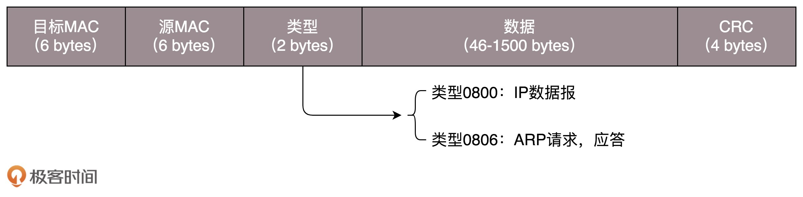
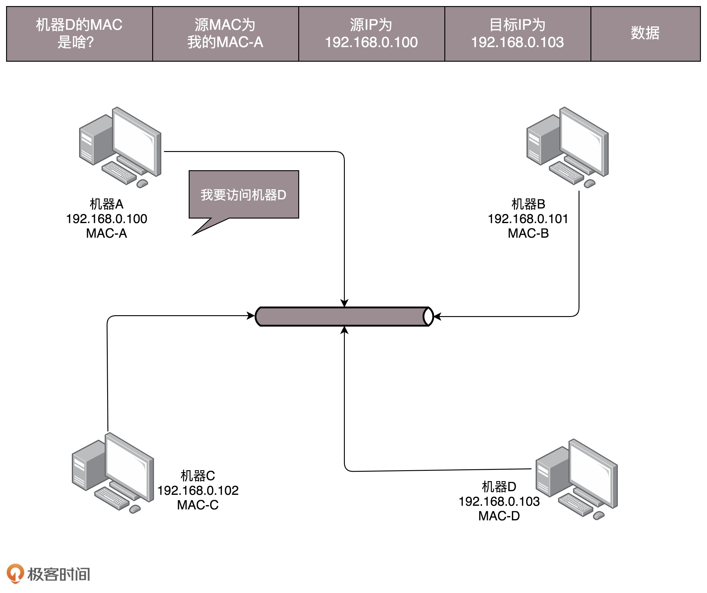
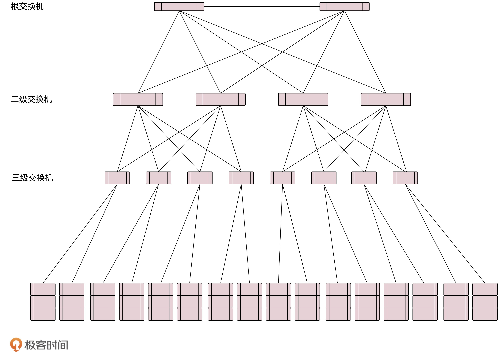

# 0 课程介绍

> 极客时间 《[趣谈网络协议](https://time.geekbang.org/column/intro/100007101)》


## 你将获得

- 掌握网络协议的知识框架；
- 应对大厂面试的协议难题；
- 驾驭网络协议的实用场景。

## 课程介绍

网络协议是每个程序员入门的必修课，但是彻底掌握并应用网络协议知识却并非易事，比如常见的 TCP/IP、HTTP。网络协议的内容很基础，但基础知识不等于简单知识，更不等于不重要的知识。在网络协议的学习过程中，如果你也有过这样的感受：

- 协议知识琐碎又枯燥，一看书就头大；
- 协议内容很基础，但面试一问就“崩盘”；
- 工作遇到才去查书，现学却没法现卖；
- 协议知识太底层，不知道如何在热门领域应用。

那么，“趣谈网络协议”专栏就是为你量身定制的。

在本专栏中，刘超老师将结合自己从业 15 年的“泣血”经验，对网络协议的底层概念及其在热门领域的应用进行剖析。

他选取了从底层到上层，最基础、最常用、最重要的网络协议进行一一解析，并将深入分析网络协议在云计算、容器和微服务等领域的应用和实践。帮助入门级程序员深入、直观地理解网络协议基础概念和原理，构建一个完整、精准的协议知识框架；帮助有一定工作经验的程序员填补知识漏洞、打通知识体系。

专栏分为 3 大模块。

- **底层网络协议知识详解：** 将用最通俗的语言，自下而上讲解最重要、最常用以及最陌生的网络协议概念，帮你构建最精准的网络协议知识框架。
- **网络协议在热门领域的应用：** 将讲述网络协议在当下热门领域的应用，比如云计算、容器和微服务，并手把手带你使用新技术，进一步加深对网络协议概念的理解。
- **网络协议知识串联：** 将用“双十一”的故事串起网络协议的核心概念和基础知识；借助虚拟化和容器技术，搭建一个实验环境，持续更新你的知识库。

## 课程目录


## 开篇词 | 想成为技术牛人？先搞定网络协议！

为什么网络协议这么重要呢？为什么“计算机组成与系统结构”“数据结构与算法”“操作系统”“计算机网络”“编译原理”，会成为大学计算机的核心课程呢？至少看起来，这些内容没有“多少天搞定 MFC、Structs”这样的内容更容易帮你找到工作。我毕业的时候，也感到很困惑。

不过当时我抱着一个理想，也可能是大多数程序员的理想：我要做技术牛人，我要搞定大系统。


工作 15 年，我在 EMC 做过类似 GFS 的分布式存储开发，做过基于 Lucene 的搜索引擎，做过 Hadoop 的运维；在 HP 和华为做过 OpenStack 的开发、实施和解决方案；还创业倒腾过 Mesos 容器平台，后来在网易做 Kubernetes。

随着见过的世面越来越多，我渐渐发现，无论是对于大规模系统的架构，还是对于程序员的个人职业生涯，网络和网络协议都是绕不过去的坎儿。

集群规模一大，我们首先想到的就是网络互通的问题；应用吞吐量压不上去，我们首先想到的也是网络互通的问题。**不客气地讲，很多情况下，只要搞定了网络，一个大型系统也就搞定了一半**。所以，要成为技术牛人，搞定大系统，一定要过网络这一关，而网络协议在网络中占有举足轻重的地位。


相信大部分人都思考过“技术变化太快，容易过时”的问题。毕竟，技术浪潮一浪接一浪，新技术层出不穷。从搜索引擎、大数据、云计算，到人工智能、区块链，简直就是“你方唱罢我登场”。**这里面究竟有没有最本质的东西，使得你掌握了它，就能在新技术的滚滚浪潮中，保持快速学习的能力？**

通过对大量开源技术的代码进行分析，我发现很多技术看起来轰轰烈烈，扒下外衣，本质的东西其实就是基础知识和核心概念。**想要不被滚滚而来的新技术淘汰，就要掌握这些可以长久使用的知识，而网络协议就是值得你学习，而且是到 40 岁之后依然有价值的知识。**

但是，要想真正学习和掌握网络协议，也并非易事。下面这些场景，你是不是也感同身受呢？

- **网络协议知识点太多，学完记不住。**
- **看上去懂了，但是经不住问。**没关系，网上有很多的文章嘛。于是，你会搜索很多文章去看。看的时候，你感觉别人说的很有道理，好像理解了，但是经不住问，一问就发现，你只是了解了大概的流程，很多细节还是不知道。所以说，从能看懂到能给别人讲明白，中间还有很长一段距离。
- **知识学会了，实际应用依旧不会**。细节都摸索得差不多了，但是当你自己去应用和调试的时候，发现还是没有思路。比如，当创建出来的虚拟机不能上网的时候，该怎么办呢？学过的东西，怎么还是不会用？

我把这样的网络协议学习过程总结为：**一看觉得懂，一问就打鼓，一用就糊涂。**

那网络协议究竟该怎么学？基于这个问题，我决定从以下三个角度和你分享我所理解的网络协议。

**第一，我会从身边经常见到的事情出发，用故事来讲解各种网络协议，然后慢慢扩展到不熟悉的领域。**

例如，每个人都会查看 IP 地址，那我们就从这个命令开始，展开一些概念；很多人都在大学宿舍组过简单的网络来打游戏，我就从宿舍里最简单的网络概念开始讲；然后说到办公室，说到日常上网、购物、视频下载等过程涉及的协议；最后说到最陌生的数据中心。


**第二，我会用贴近场景的方式来讲解网络协议，将各个层次的关系串起来，而非孤立地讲解某个概念。**

常见的计算机网络课程往往会按照网络分层，一层一层地讲，却很少讲层与层之间的关系。例如，我们学习路由协议的时候，在真实场景中，这么多的算法和二层是什么关系呢？和四层又是什么关系呢？例如，在真实的网络通信中，我们访问一个网站，做一个支付，在 TCP 进行三次握手的时候，IP 层在干嘛？MAC 层又在干嘛？这些你是不是都清楚？


**第三，我会在讲解完各个层次的网络协议之后，着重剖析如何在当下热门领域使用这些协议，比如云计算、容器和微服务。**

一方面你可以知道网络协议真实应用的地方，另一方面你也可以通过上手使用云计算、容器、微服务来进一步加深对于协议的理解。


# 第一模块 通信协议综述

## 第1讲 | 为什么要学习网络协议？

当"Hello World!"从显示器打印出来的时候，还记得你激动的心情吗？

```java
public class HelloWorld {
  public static void main(String[] args){
    System.out.println("Hello World!");
  }
}
```

如果你是程序员，一定看得懂上面这一段文字。这是每一个程序员向计算机世界说“你好，世界”的方式。

但是，你不一定知道，这段文字也是一种协议，是人类和计算机沟通的协议，**只有通过这种协议，计算机才知道我们想让它做什么。**

### 协议三要素

当然，这种协议还是更接近人类语言，机器不能直接读懂，需要进行翻译，翻译的工作教给编译器，也就是程序员常说的 compile。这个过程比较复杂，其中的编译原理非常复杂，我在这里不进行详述。


但是可以看得出，计算机语言作为程序员控制一台计算机工作的协议，具备了协议的三要素。


- **语法**，就是这一段内容要符合一定的规则和格式。例如，括号要成对，结束要使用分号等。
- **语义**，就是这一段内容要代表某种意义。例如数字减去数字是有意义的，数字减去文本一般来说就没有意义。
- **顺序**，就是先干啥，后干啥。例如，可以先加上某个数值，然后再减去某个数值。


会了计算机语言，你就能够教给一台计算机完成你的工作了。恭喜你，入门了！


## 第2讲 | 网络分层的真实含义是什么？

当你听到什么二层设备、三层设备、四层 LB 和七层 LB 中层的时候，是否有点一头雾水，不知道这些所谓的层，对应的各种协议具体要做什么“工作”？

### 这四个问题你真的懂了吗？

因为教科书或者老师往往会打一个十分不恰当的比喻：为什么网络要分层呀？因为不同的层次之间有不同的沟通方式，这个叫作协议。例如，一家公司也是分“层次”的，分总经理、经理、组长、员工。总经理之间有他们的沟通方式，经理和经理之间也有沟通方式，同理组长和员工。有没有听过类似的比喻？

1、其他层的协议在做啥

那么**第一个问题**来了。请问经理在握手的时候，员工在干什么？很多人听过 TCP 建立连接的**三次握手协议**，也会把它当知识点背诵。同理问你，TCP 在进行三次握手的时候，IP 层和 MAC 层对应都有什么操作呢？

除了上面这个不恰当的比喻，教科书还会列出每个层次所包含的协议，然后开始逐层地去讲这些协议。但是这些协议之间的关系呢？却很少有教科书会讲。

学习第三层的时候会提到，IP 协议里面包含**目标地址**和**源地址。\**第三层里往往还会学习\**路由协议**。路由就像中转站，我们从原始地址 A 到目标地址 D，中间经过两个中转站 A->B->C->D，是通过路由转发的。


2、协议的生命周期

那么**第二个问题**来了。A 知道自己的下一个中转站是 B，那从 A 发出来的包，应该把 B 的 IP 地址放在哪里呢？B 知道自己的下一个中转站是 C，从 B 发出来的包，应该把 C 的 IP 地址放在哪里呢？如果放在 IP 协议中的目标地址，那包到了中转站，怎么知道最终的目的地址是 D 呢？

教科书不会通过场景化的例子，将网络包的生命周期讲出来，所以你就会很困惑，不知道这些协议实际的应用场景是什么。


3、协议非独立的

我**再问你一个问题**。你一定经常听说二层设备、三层设备。二层设备处理的通常是 MAC 层的东西。那我发送一个 HTTP 的包，是在第七层工作的，那是不是不需要经过二层设备？或者即便经过了，二层设备也不处理呢？或者换一种问法，二层设备处理的包里，有没有 HTTP 层的内容呢？


4、显示场景中的协议链路

最终，我想问你**一个综合的问题**。从你的电脑，通过 SSH 登录到公有云主机里面，都需要经历哪些过程？或者说你打开一个电商网站，都需要经历哪些过程？说得越详细越好。


实际情况可能是，很多人回答不上来。尽管对每一层都很熟悉，但是知识点却串不起来。

上面的这些问题，有的在这一节就会有一个解释，有的则会贯穿我们整个课程。好在后面一节中我会举一个贯穿的例子，将很多层的细节讲过后，你很容易就能把这些知识点串起来。


## 第3讲 | ifconfig：最熟悉又陌生的命令行

上一节结尾给你留的一个思考题是，你知道怎么查看 IP 地址吗？

当面试听到这个问题的时候，面试者常常会觉得走错了房间。我面试的是技术岗位啊，怎么问这么简单的问题？

的确，即便没有专业学过计算机的人，只要倒腾过电脑，重装过系统，大多也会知道这个问题的答案：在 Windows 上是 ipconfig，在 Linux 上是 ifconfig。


那你知道在 Linux 上还有什么其他命令可以查看 IP 地址吗？答案是 **ip addr**。如果回答不上来这个问题，那你可能没怎么用过 Linux。


那你知道 ifconfig 和 ip addr 的区别吗？这是一个有关 **net-tools 和 iproute2** 的“历史”故事，你刚来到第三节，暂时不用了解这么细，但这也是一个常考的知识点。


想象一下，你登录进入一个被裁剪过的非常小的 Linux 系统中，发现既没有 ifconfig 命令，也没有 ip addr 命令，你是不是感觉这个系统压根儿没法用？这个时候，你可以自行安装 net-tools 和 iproute2 这两个工具。当然，大多数时候这两个命令是系统自带的。


安装好后，我们来运行一下 ip addr。不出意外，应该会输出下面的内容。

```bash
root@test:~# ip addr
1: lo: <LOOPBACK,UP,LOWER_UP> mtu 65536 qdisc noqueue state UNKNOWN group default 
    link/loopback 00:00:00:00:00:00 brd 00:00:00:00:00:00
    inet 127.0.0.1/8 scope host lo
       valid_lft forever preferred_lft forever
    inet6 ::1/128 scope host 
       valid_lft forever preferred_lft forever
2: eth0: <BROADCAST,MULTICAST,UP,LOWER_UP> mtu 1500 qdisc pfifo_fast state UP group default qlen 1000
    link/ether fa:16:3e:c7:79:75 brd ff:ff:ff:ff:ff:ff
    inet 10.100.122.2/24 brd 10.100.122.255 scope global eth0
       valid_lft forever preferred_lft forever
    inet6 fe80::f816:3eff:fec7:7975/64 scope link 
       valid_lft forever preferred_lft forever

```

这个命令显示了这台机器上所有的网卡。大部分的网卡都会有一个 IP 地址，当然，这不是必须的。在后面的分享中，我们会遇到没有 IP 地址的情况。


## 第4讲 | DHCP与PXE：IP是怎么来的，又是怎么没的？

上一节，我们讲了 IP 的一些基本概念。如果需要和其他机器通讯，我们就需要一个通讯地址，我们需要给网卡配置这么一个地址。

> DHCP代表动态主机配置协议（Dynamic Host Configuration Protocol），在一个DHCP网络中，有一个称为DHCP服务器的中央设备，它负责管理和分配IP地址。当设备加入网络时，它可以通过DHCP协议向DHCP服务器发送请求，请求一个可用的IP地址。

### 如何配置 IP 地址？

那如何配置呢？如果有相关的知识和积累，你可以用命令行自己配置一个地址。

可以使用 ifconfig，也可以使用 ip addr。

设置好了以后，用这两个命令，将网卡 up 一下，就可以开始工作了。

**使用 net-tools：**

```shell
$ sudo ifconfig eth1 10.0.0.1/24
$ sudo ifconfig eth1 up
```

**使用 iproute2：**

```shell
$ sudo ip addr add 10.0.0.1/24 dev eth1
$ sudo ip link set up eth1
```

你可能会问了，自己配置这个自由度太大了吧，我是不是配置什么都可以？如果配置一个和谁都不搭边的地址呢？例如，旁边的机器都是 192.168.1.x，我非得配置一个 16.158.23.6，会出现什么现象呢？

不会出现任何现象，就是包发不出去呗。为什么发不出去呢？举例说明:

192.168.1.6 就在你这台机器的旁边，甚至是在同一个交换机上，而你把机器的地址设为了 16.158.23.6。在这台机器上，你企图去 ping192.168.1.6，你觉得只要将包发出去，同一个交换机的另一台机器马上就能收到，对不对？

可是 Linux 系统不是这样的，它没你想的那么智能。你用肉眼看到那台机器就在旁边，它则需要根据自己的逻辑进行处理。

还记得我们在第二节说过的原则吗？**只要是在网络上跑的包，都是完整的，可以有下层没上层，绝对不可能有上层没下层。**

所以，你看着它有自己的源 IP 地址 16.158.23.6，也有目标 IP 地址 192.168.1.6，但是包发不出去，这是**因为 MAC 层还没填**。

自己的 MAC 地址自己知道，这个容易。但是目标 MAC 填什么呢？是不是填 192.168.1.6 这台机器的 MAC 地址呢？

当然不是。Linux 首先会判断，要去的这个地址和我是一个网段的吗，或者和我的一个网卡是同一网段的吗？**只有是一个网段的，它才会发送 ARP 请求，获取 MAC 地址**。如果发现不是呢？


**Linux 默认的逻辑是，如果这是一个跨网段的调用，它便不会直接将包发送到网络上，而是企图将包发送到网关。**


如果你配置了网关的话，Linux 会获取网关的 MAC 地址，然后将包发出去。对于 192.168.1.6 这台机器来讲，虽然路过它家门的这个包，目标 IP 是它，但是无奈 MAC 地址不是它的，所以它的网卡是不会把包收进去的。

如果没有配置网关呢？那包压根就发不出去。

如果将网关配置为 192.168.1.6 呢？不可能，Linux 不会让你配置成功的，因为**网关要和当前的网络至少一个网卡是同一个网段的**，怎么可能 16.158.23.6 的网关是 192.168.1.6 呢？


所以，当你需要手动配置一台机器的网络 IP 时，一定要好好问问你的网络管理员。如果在机房里面，要去网络管理员那里申请，让他给你分配一段正确的 IP 地址。当然，真正配置的时候，一定不是直接用命令配置的，而是放在一个配置文件里面。**不同系统的配置文件格式不同，但是无非就是 CIDR、子网掩码、广播地址和网关地址**。


### 动态主机配置协议（DHCP）

原来配置 IP 有这么多门道儿啊。你可能会问了，配置了 IP 之后一般不能变的，配置一个服务端的机器还可以，但是如果是客户端的机器呢？我抱着一台笔记本电脑在公司里走来走去，或者白天来晚上走，每次使用都要配置 IP 地址，那可怎么办？还有人事、行政等非技术人员，如果公司所有的电脑都需要 IT 人员配置，肯定忙不过来啊。

因此，我们需要有一个自动配置的协议，也就是**动态主机配置协议（Dynamic Host Configuration Protocol）**，简称 **DHCP**。


有了这个协议，网络管理员就轻松多了。他只需要配置一段共享的 IP 地址。每一台新接入的机器都通过 DHCP 协议，来这个共享的 IP 地址里申请，然后自动配置好就可以了。等人走了，或者用完了，还回去，这样其他的机器也能用。

所以说，**如果是数据中心里面的服务器，IP 一旦配置好，基本不会变，这就相当于买房自己装修。DHCP 的方式就相当于租房。你不用装修，都是帮你配置好的。你暂时用一下，用完退租就可以了。**


#### 解析 DHCP 的工作方式

当一台机器新加入一个网络的时候，肯定一脸懵，啥情况都不知道，只知道自己的 MAC 地址。怎么办？先吼一句，我来啦，有人吗？这时候的沟通基本靠“吼”。这一步，我们称为 **DHCP Discover。**


新来的机器**使用 IP 地址 0.0.0.0 发送了一个广播包**，目的 IP 地址为 255.255.255.255。广播包封装了 UDP，UDP 封装了 BOOTP。其实 DHCP 是 BOOTP 的增强版，但是如果你去**抓包**的话，很可能看到的名称还是 BOOTP 协议。

在这个广播包里面，新人大声喊：我是新来的（Boot request），我的 MAC 地址是这个，我还没有 IP，谁能给租给我个 IP 地址！


格式就像这样：


如果一个网络管理员在网络里面配置了 **DHCP Server** 的话，他就相当于这些 IP 的管理员。他立刻能知道来了一个“新人”。这个时候，我们可以体会 MAC 地址唯一的重要性了。当一台机器带着自己的 MAC 地址加入一个网络的时候，MAC 是它唯一的身份，如果连这个都重复了，就没办法配置了。


只有 MAC 唯一，IP 管理员才能知道这是一个新人，需要租给它一个 IP 地址，这个过程我们称为 **DHCP Offer**。同时，DHCP Server 为此客户保留为它提供的 IP 地址，从而不会为其他 DHCP 客户分配此 IP 地址。


DHCP Offer 的格式就像这样，里面有给新人分配的地址。


DHCP Server 仍然使用广播地址作为目的地址，因为，此时请求分配 IP 的新人还没有自己的 IP。DHCP Server 回复说，我分配了一个可用的 IP 给你，你看如何？除此之外，服务器还发送了子网掩码、网关和 IP 地址租用期等信息。

新来的机器很开心，它的“吼”得到了回复，并且有人愿意租给它一个 IP 地址了，这意味着它可以在网络上立足了。当然更令人开心的是，如果有多个 DHCP Server，这台新机器会收到多个 IP 地址，简直受宠若惊。

它会选择其中一个 DHCP Offer，一般是最先到达的那个，并且会向网络发送一个 DHCP Request 广播数据包，包中包含客户端的 MAC 地址、接受的租约中的 IP 地址、提供此租约的 DHCP 服务器地址等，并告诉所有 DHCP Server 它将接受哪一台服务器提供的 IP 地址，告诉其他 DHCP 服务器，谢谢你们的接纳，并请求撤销它们提供的 IP 地址，以便提供给下一个 IP 租用请求者。


此时，由于还没有得到 DHCP Server 的最后确认，客户端仍然使用 0.0.0.0 为源 IP 地址、255.255.255.255 为目标地址进行广播。在 BOOTP 里面，接受某个 DHCP Server 的分配的 IP。

当 DHCP Server 接收到客户机的 DHCP request 之后，会广播返回给客户机一个 DHCP ACK 消息包，表明已经接受客户机的选择，并将这一 IP 地址的合法租用信息和其他的配置信息都放入该广播包，发给客户机，欢迎它加入网络大家庭。


最终租约达成的时候，还是需要广播一下，让大家都知道。


#### IP 地址的收回和续租

既然是租房子，就是有租期的。租期到了，管理员就要将 IP 收回。

如果不用的话，收回就收回了。就像你租房子一样，如果还要续租的话，不能到了时间再续租，而是要提前一段时间给房东说。DHCP 也是这样。

客户机会在租期过去 50% 的时候，直接向为其提供 IP 地址的 DHCP Server 发送 DHCP request 消息包。客户机接收到该服务器回应的 DHCP ACK 消息包，会根据包中所提供的新的租期以及其他已经更新的 TCP/IP 参数，更新自己的配置。这样，IP 租用更新就完成了。

好了，一切看起来完美。DHCP 协议大部分人都知道，但是其实里面隐藏着一个细节，很多人可能不会去注意。接下来，我就讲一个有意思的事情：网络管理员不仅能自动分配 IP 地址，还能帮你自动安装操作系统！


### 预启动执行环境（PXE）

普通的笔记本电脑，一般不会有这种需求。因为你拿到电脑时，就已经有操作系统了，即便你自己重装操作系统，也不是很麻烦的事情。但是，在数据中心里就不一样了。数据中心里面的管理员可能一下子就拿到几百台空的机器，一个个安装操作系统，会累死的。

所以管理员希望的不仅仅是自动分配 IP 地址，还要自动安装系统。装好系统之后自动分配 IP 地址，直接启动就能用了，这样当然最好了！

这事儿其实仔细一想，还是挺有难度的。安装操作系统，应该有个光盘吧。数据中心里不能用光盘吧，想了一个办法就是，可以将光盘里面要安装的操作系统放在一个服务器上，让客户端去下载。但是客户端放在哪里呢？它怎么知道去哪个服务器上下载呢？客户端总得安装在一个操作系统上呀，可是这个客户端本来就是用来安装操作系统的呀？

其实，这个过程和操作系统启动的过程有点儿像。首先，启动 BIOS。这是一个特别小的小系统，只能干特别小的一件事情。其实就是读取硬盘的 MBR 启动扇区，将 GRUB 启动起来；然后将权力交给 GRUB，GRUB 加载内核、加载作为根文件系统的 initramfs 文件；然后将权力交给内核；最后内核启动，初始化整个操作系统。


那我们安装操作系统的过程，只能插在 BIOS 启动之后了。因为没安装系统之前，连启动扇区都没有。因而这个过程叫做**预启动执行环境（Pre-boot Execution Environment）**，简称 **PXE。**


PXE 协议分为客户端和服务器端，由于还没有操作系统，只能先把客户端放在 BIOS 里面。当计算机启动时，BIOS 把 PXE 客户端调入内存里面，就可以连接到服务端做一些操作了。

首先，PXE 客户端自己也需要有个 IP 地址。因为 PXE 的客户端启动起来，就可以发送一个 DHCP 的请求，让 DHCP Server 给它分配一个地址。PXE 客户端有了自己的地址，那它怎么知道 PXE 服务器在哪里呢？对于其他的协议，都好办，要有人告诉他。例如，告诉浏览器要访问的 IP 地址，或者在配置中告诉它；例如，微服务之间的相互调用。

但是 PXE 客户端启动的时候，啥都没有。好在 DHCP Server 除了分配 IP 地址以外，还可以做一些其他的事情。这里有一个 DHCP Server 的一个样例配置：

```
ddns-update-style interim;
ignore client-updates;
allow booting;
allow bootp;
subnet 192.168.1.0 netmask 255.255.255.0
{
option routers 192.168.1.1;
option subnet-mask 255.255.255.0;
option time-offset -18000;
default-lease-time 21600;
max-lease-time 43200;
range dynamic-bootp 192.168.1.240 192.168.1.250;
filename "pxelinux.0";
next-server 192.168.1.180;
}
```

按照上面的原理，默认的 DHCP Server 是需要配置的，无非是我们配置 IP 的时候所需要的 IP 地址段、子网掩码、网关地址、租期等。如果想使用 PXE，则需要配置 next-server，指向 PXE 服务器的地址，另外要配置初始启动文件 filename。

这样 PXE 客户端启动之后，发送 DHCP 请求之后，除了能得到一个 IP 地址，还可以知道 PXE 服务器在哪里，也可以知道如何从 PXE 服务器上下载某个文件，去初始化操作系统。


#### 解析 PXE 的工作过程

接下来我们来详细看一下 PXE 的工作过程。


首先，启动 PXE 客户端。第一步是通过 DHCP 协议告诉 DHCP Server，我刚来，一穷二白，啥都没有。DHCP Server 便租给它一个 IP 地址，同时也给它 PXE 服务器的地址、启动文件 pxelinux.0。

其次，PXE 客户端知道要去 PXE 服务器下载这个文件后，就可以初始化机器。于是便开始下载，下载的时候使用的是 TFTP 协议。所以 PXE 服务器上，往往还需要有一个 TFTP 服务器。PXE 客户端向 TFTP 服务器请求下载这个文件，TFTP 服务器说好啊，于是就将这个文件传给它。

然后，PXE 客户端收到这个文件后，就开始执行这个文件。这个文件会指示 PXE 客户端，向 TFTP 服务器请求计算机的配置信息 pxelinux.cfg。TFTP 服务器会给 PXE 客户端一个配置文件，里面会说内核在哪里、initramfs 在哪里。PXE 客户端会请求这些文件。

最后，启动 Linux 内核。一旦启动了操作系统，以后就啥都好办了。


### 小結

总结一下今天的内容：

- DHCP 协议主要是用来给客户租用 IP 地址，和房产中介很像，要商谈、签约、续租，广播还不能“抢单”；
- DHCP 协议能给客户推荐“装修队”PXE，能够安装操作系统，这个在云计算领域大有用处。

最后，学完了这一节，给你留两个思考题吧。

1. PXE 协议可以用来安装操作系统，但是如果每次重启都安装操作系统，就会很麻烦。你知道如何使得第一次安装操作系统，后面就正常启动吗？
2. 现在上网很简单了，买个家用路由器，连上 WIFI，给 DHCP 分配一个 IP 地址，就可以上网了。那你是否用过更原始的方法自己组过简单的网呢？说来听听。


# 第二模块 底层网络知识详解：从二层到三层


## 第5讲 | 从物理层到MAC层：如何在宿舍里自己组网玩联机游戏？

一旦机器有了 IP，就可以在网络的环境里和其他的机器展开沟通了。

故事就从我的大学宿舍开始讲起吧。作为一个八零后，我要暴露年龄了。

我们宿舍四个人，大一的时候学校不让上网，不给开通网络。但是，宿舍有一个人比较有钱，率先买了一台电脑。那买了电脑干什么呢？

首先，有单机游戏可以打，比如说《拳皇》。两个人用一个键盘，照样打得火热。后来有第二个人买了电脑，那两台电脑能不能连接起来呢？你会说，当然能啊，买个路由器不就行了。

现在一台家用路由器非常便宜，一百多块的事情。那时候路由器绝对是奢侈品。一直到大四，我们宿舍都没有买路由器。可能是因为那时候技术没有现在这么发达，导致我对网络技术的认知是逐渐深入的，而且每一层都是实实在在接触到的。


### 第一层（物理层）

使用路由器，是在第三层上。我们先从第一层物理层开始说。


物理层能折腾啥？现在的同学可能想不到，我们当时去学校配电脑的地方买网线，卖网线的师傅都会问，你的网线是要电脑连电脑啊，还是电脑连网口啊？

我们要的是电脑连电脑。这种方式就是一根网线，有两个头。一头插在一台电脑的网卡上，另一头插在另一台电脑的网卡上。但是在当时，普通的网线这样是通不了的，所以水晶头要做交叉线，用的就是所谓的 **1－3**、**2－6 交叉接法**。


水晶头的第 1、2 和第 3、6 脚，它们分别起着收、发信号的作用。将一端的 1 号和 3 号线、2 号和 6 号线互换一下位置，就能够在物理层实现一端发送的信号，另一端能收到。


当然电脑连电脑，除了网线要交叉，还需要配置这两台电脑的 IP 地址、子网掩码和默认网关。这三个概念上一节详细描述过了。要想两台电脑能够通信，这三项必须配置成为一个网络，可以一个是 192.168.0.1/24，另一个是 192.168.0.2/24，否则是不通的。


这里我想问你一个问题，两台电脑之间的网络包，包含 MAC 层吗？当然包含，要完整。IP 层要封装了 MAC 层才能将包放入物理层。

到此为止，两台电脑已经构成了一个最小的**局域网**，也即 **LAN。**可以玩联机局域网游戏啦！


等到第三个哥们也买了一台电脑，怎么把三台电脑连在一起呢？

先别说交换机，当时交换机也贵。有一个叫做 **Hub** 的东西，也就是**集线器**。这种设备有多个口，可以将宿舍里的多台电脑连接起来。但是，和交换机不同，集线器没有大脑，它完全在物理层工作。它会将自己收到的每一个字节，都复制到其他端口上去。**这是第一层物理层联通的方案**。


### 第二层（数据链路层）

你可能已经发现问题了。Hub 采取的是广播的模式，如果每一台电脑发出的包，宿舍的每个电脑都能收到，那就麻烦了。这就需要解决几个问题：

1. 这个包是发给谁的？谁应该接收？
2. 大家都在发，会不会产生混乱？有没有谁先发、谁后发的规则？
3. 如果发送的时候出现了错误，怎么办？

这几个问题，都是第二层，数据链路层，也即 MAC 层要解决的问题。**MAC** 的全称是 **Medium Access Control**，即**媒体访问控制。\**控制什么呢？其实就是控制在往媒体上发数据的时候，谁先发、谁后发的问题。防止发生混乱。这解决的是第二个问题。这个问题中的规则，学名叫\**多路访问**。有很多算法可以解决这个问题。就像车管所管束马路上跑的车，能想的办法都想过了。


比如接下来这三种方式：

- 方式一：分多个车道。每个车一个车道，你走你的，我走我的。这在计算机网络里叫作**信道划分；**
- 方式二：今天单号出行，明天双号出行，轮着来。这在计算机网络里叫作**轮流协议；**
- 方式三：不管三七二十一，有事儿先出门，发现特堵，就回去。错过高峰再出。我们叫作**随机接入协议。**著名的以太网，用的就是这个方式。


解决了第二个问题，就是解决了媒体接入控制的问题，MAC 的问题也就解决好了。这和 MAC 地址没什么关系。

接下来要解决第一个问题：发给谁，谁接收？这里用到一个物理地址，叫作**链路层地址。\**但是因为第二层主要解决媒体接入控制的问题，所以它常被称为\** MAC 地址**。

解决第一个问题就牵扯到第二层的网络包**格式**。对于以太网，第二层的最开始，就是目标的 MAC 地址和源的 MAC 地址。




接下来是**类型**，大部分的类型是 IP 数据包，然后 IP 里面包含 TCP、UDP，以及 HTTP 等，这都是里层封装的事情。

有了这个目标 MAC 地址，数据包在链路上广播，MAC 的网卡才能发现，这个包是给它的。MAC 的网卡把包收进来，然后打开 IP 包，发现 IP 地址也是自己的，再打开 TCP 包，发现端口是自己，也就是 80，而 nginx 就是监听 80。

于是将请求提交给 nginx，nginx 返回一个网页。然后将网页需要发回请求的机器。然后层层封装，最后到 MAC 层。因为来的时候有源 MAC 地址，返回的时候，源 MAC 就变成了目标 MAC，再返给请求的机器。

对于以太网，第二层的最后面是 **CRC**，也就是**循环冗余检测**。通过 XOR 异或的算法，来计算整个包是否在发送的过程中出现了错误，主要解决第三个问题。


这里还有一个没有解决的问题，当源机器知道目标机器的时候，可以将目标地址放入包里面，如果不知道呢？一个广播的网络里面接入了 N 台机器，我怎么知道每个 MAC 地址是谁呢？这就是 **ARP 协议**，也就是已知 IP 地址，求 MAC 地址的协议。



在一个局域网里面，当知道了 IP 地址，不知道 MAC 怎么办呢？靠“吼”（广播）。


广而告之，发送一个广播包，谁是这个 IP 谁来回答。具体询问和回答的报文就像下面这样：


为了避免每次都用 ARP 请求，机器本地也会进行 ARP 缓存。当然机器会不断地上线下线，IP 也可能会变，所以 ARP 的 MAC 地址缓存过一段时间就会过期。


### 局域网

好了，至此我们宿舍四个电脑就组成了一个局域网。用 Hub 连接起来，就可以玩局域网版的《魔兽争霸》了。


打开游戏，进入“局域网选项”，选择一张地图，点击“创建游戏”，就可以进入这张地图的房间中。等同一个局域网里的其他小伙伴加入后，游戏就可以开始了。


这种组网的方法，对一个宿舍来说没有问题，但是一旦机器数目增多，问题就出现了。因为 Hub 是广播的，不管某个接口是否需要，所有的 Bit 都会被发送出去，然后让主机来判断是不是需要。这种方式路上的车少就没问题，车一多，产生冲突的概率就提高了。而且把不需要的包转发过去，纯属浪费。看来 Hub 这种不管三七二十一都转发的设备是不行了，需要点儿智能的。因为每个口都只连接一台电脑，这台电脑又不怎么换 IP 和 MAC 地址，只要记住这台电脑的 MAC 地址，如果目标 MAC 地址不是这台电脑的，这个口就不用转发了。

谁能知道目标 MAC 地址是否就是连接某个口的电脑的 MAC 地址呢？这就需要一个能把 MAC 头拿下来，检查一下目标 MAC 地址，然后根据策略转发的设备，按第二节课中讲过的，这个设备显然是个二层设备，我们称为**交换机**。


交换机怎么知道每个口的电脑的 MAC 地址呢？这需要**交换机会学习**。

一台 MAC1 电脑将一个包发送给另一台 MAC2 电脑，当这个包到达交换机的时候，一开始交换机也不知道 MAC2 的电脑在哪个口，所以没办法，它只能将包转发给除了来的那个口之外的其他所有的口。但是，这个时候，交换机会干一件非常聪明的事情，就是交换机会记住，MAC1 是来自一个明确的口。以后有包的目的地址是 MAC1 的，直接发送到这个口就可以了。

当交换机作为一个关卡一样，过了一段时间之后，就有了整个网络的一个结构了，这个时候，基本上不用广播了，全部可以准确转发。当然，每个机器的 IP 地址会变，所在的口也会变，因而交换机上的学习的结果，我们称为**转发表**，是有一个**过期时间**的。


有了交换机，一般来说，你接个几十台、上百台机器打游戏，应该没啥问题。你可以组个战队了。能上网了，就可以玩网游了。


### 小结

好了，今天的内容差不多了，我们来总结一下，有三个重点需要你记住：


第一，MAC 层是用来解决多路访问的堵车问题的；

第二，ARP 是通过吼的方式来寻找目标 MAC 地址的，吼完之后记住一段时间，这个叫作缓存；

第三，交换机是有 MAC 地址学习能力的，学完了它就知道谁在哪儿了，不用广播了。


最后，给你留两个思考题吧。

1. 在二层中我们讲了 ARP 协议，即已知 IP 地址求 MAC；还有一种 RARP 协议，即已知 MAC 求 IP 的，你知道它可以用来干什么吗？
2. 如果一个局域网里面有多个交换机，ARP 广播的模式会出现什么问题呢？

> chatGPT

1、RARP（Reverse Address Resolution Protocol）是一种网络协议，用于根据已知的MAC地址获取对应的IP地址。与ARP协议相反，ARP用于已知IP地址求MAC地址。

RARP协议主要用于早期的计算机网络中，特别是在无盘工作站（diskless workstation）中。无盘工作站是指没有本地存储设备（如硬盘）的计算机，它们依赖网络来获取操作系统和其他必要的软件。

RARP的主要用途是在无盘工作站启动时，通过向网络中的RARP服务器发送请求，获取自己的IP地址。无盘工作站通常只有MAC地址，没有预先配置的IP地址。通过使用RARP协议，无盘工作站可以向RARP服务器发送自己的MAC地址，并请求分配一个IP地址。RARP服务器会根据MAC地址映射表，将对应的IP地址分配给无盘工作站，使其能够在网络中正常通信。

需要注意的是，随着技术的发展，RARP协议已经逐渐被其他更先进的协议所取代，如BOOTP（Bootstrap Protocol）和DHCP（Dynamic Host Configuration Protocol）。这些协议提供了更多的功能和灵活性，不仅可以为无盘工作站分配IP地址，还可以提供其他网络配置参数，如子网掩码、默认网关等。

总之，RARP协议主要用于无盘工作站在启动时获取IP地址，以便能够通过网络进行通信。然而，随着技术的进步，RARP的使用已经相对较少，被更先进的协议所取代。


2、当一个局域网中存在多个交换机时，ARP广播的模式可能会引发以下问题：

1. **广播风暴**：当一个主机发送ARP广播请求时，广播会在整个局域网中传播，包括所有连接的交换机。如果局域网中的交换机数量较多，广播请求会被复制和转发多次，导致网络中的广播风暴。广播风暴会占用大量的网络带宽和交换机处理能力，导致网络性能下降。
2. **ARP表冲突**：每个交换机都会维护一个ARP表，用于记录MAC地址和对应的端口。当一个主机发送ARP广播请求时，所有连接的交换机都会更新自己的ARP表。如果多个主机同时发送ARP广播请求，交换机的ARP表可能会出现冲突，导致通信错误或延迟。
3. **ARP欺骗攻击**：ARP广播的模式容易受到ARP欺骗攻击的影响。恶意用户可以发送伪造的ARP响应，欺骗其他主机将其MAC地址与错误的IP地址进行关联。这可能导致通信中断、数据泄露或中间人攻击等安全问题。

为了解决这些问题，现代的网络设计通常采用VLAN（Virtual Local Area Network）和交换机间的VLAN划分，以减少广播范围。此外，网络管理员还可以使用ARP缓存和静态ARP条目来减少ARP广播的频率，并采取安全措施来防止ARP欺骗攻击。


## 第6讲 | 交换机与VLAN：办公室太复杂，我要回学校

上一次，我们在宿舍里组建了一个本地的局域网 LAN，可以愉快地玩游戏了。这是一个非常简单的场景，因为只有一台交换机，电脑数目很少。今天，让我们切换到一个稍微复杂一点的场景，办公室。

### 拓扑结构是怎么形成的？

我们常见到的办公室大多是一排排的桌子，每个桌子都有网口，一排十几个座位就有十几个网口，一个楼层就会有几十个甚至上百个网口。如果算上所有楼层，这个场景自然比你宿舍里的复杂多了。具体哪里复杂呢？我来给你具体讲解。


首先，这个时候，一个交换机肯定不够用，需要多台交换机，交换机之间连接起来，就形成一个稍微复杂的**拓扑结构**。

我们先来看**两台交换机**的情形。两台交换机连接着三个局域网，每个局域网上都有多台机器。如果机器 1 只知道机器 4 的 IP 地址，当它想要访问机器 4，把包发出去的时候，它必须要知道机器 4 的 MAC 地址。


于是机器 1 发起广播，机器 2 收到这个广播，但是这不是找它的，所以没它什么事。交换机 A 一开始是不知道任何拓扑信息的，在它收到这个广播后，采取的策略是，除了广播包来的方向外，它还要转发给其他所有的网口。于是机器 3 也收到广播信息了，但是这和它也没什么关系。

当然，交换机 B 也是能够收到广播信息的，但是这时候它也是不知道任何拓扑信息的，因而也是进行广播的策略，将包转发到局域网三。这个时候，机器 4 和机器 5 都收到了广播信息。机器 4 主动响应说，这是找我的，这是我的 MAC 地址。于是一个 ARP 请求就成功完成了。


在上面的过程中，交换机 A 和交换机 B 都是能够学习到这样的信息：机器 1 是在左边这个网口的。当了解到这些拓扑信息之后，情况就好转起来。当机器 2 要访问机器 1 的时候，机器 2 并不知道机器 1 的 MAC 地址，所以机器 2 会发起一个 ARP 请求。这个广播消息会到达机器 1，也同时会到达交换机 A。这个时候交换机 A 已经知道机器 1 是不可能在右边的网口的，所以这个广播信息就不会广播到局域网二和局域网三。

当机器 3 要访问机器 1 的时候，也需要发起一个广播的 ARP 请求。这个时候交换机 A 和交换机 B 都能够收到这个广播请求。交换机 A 当然知道主机 A 是在左边这个网口的，所以会把广播消息转发到局域网一。同时，交换机 B 收到这个广播消息之后，由于它知道机器 1 是不在右边这个网口的，所以不会将消息广播到局域网三。


### 如何解决常见的环路问题？

这样看起来，两台交换机工作得非常好。随着办公室越来越大，交换机数目肯定越来越多。当整个拓扑结构复杂了，这么多网线，绕过来绕过去，不可避免地会出现一些意料不到的情况。其中常见的问题就是**环路问题**。

例如这个图，当两个交换机将两个局域网同时连接起来的时候。你可能会觉得，这样反而有了高可用性。但是却不幸地出现了环路。出现了环路会有什么结果呢？


但是问题来了，这两个交换机还是都能够收到广播包的。交换机 A 一开始是不知道机器 2 在哪个局域网的，所以它会把广播消息放到局域网二，在局域网二广播的时候，交换机 B 右边这个网口也是能够收到广播消息的。交换机 B 会将这个广播信息发送到局域网一。局域网一的这个广播消息，又会到达交换机 A 左边的这个接口。交换机 A 这个时候还是不知道机器 2 在哪个局域网，于是将广播包又转发到局域网二。左转左转左转，好像是个圈哦。

可能有人会说，当两台交换机都能够逐渐学习到拓扑结构之后，是不是就可以了？


别想了，压根儿学不会的。机器 1 的广播包到达交换机 A 和交换机 B 的时候，本来两个交换机都学会了机器 1 是在局域网一的，但是当交换机 A 将包广播到局域网二之后，交换机 B 右边的网口收到了来自交换机 A 的广播包。根据学习机制，这彻底损坏了交换机 B 的三观，刚才机器 1 还在左边的网口呢，怎么又出现在右边的网口呢？哦，那肯定是机器 1 换位置了，于是就误会了，交换机 B 就学会了，机器 1 是从右边这个网口来的，把刚才学习的那一条清理掉。同理，交换机 A 右边的网口，也能收到交换机 B 转发过来的广播包，同样也误会了，于是也学会了，机器 1 从右边的网口来，不是从左边的网口来。

然而当广播包从左边的局域网一广播的时候，两个交换机再次刷新三观，原来机器 1 是在左边的，过一会儿，又发现不对，是在右边的，过一会，又发现不对，是在左边的。

这还是一个包转来转去，每台机器都会发广播包，交换机转发也会复制广播包，当广播包越来越多的时候，按照上一节讲过一个共享道路的算法，也就是路会越来越堵，最后谁也别想走。所以，必须有一个方法解决环路的问题，怎么破除环路呢？


#### STP 协议中那些难以理解的概念

在数据结构中，有一个方法叫做**最小生成树**。有环的我们常称为**图**。将图中的环破了，就生成了**树**。在计算机网络中，生成树的算法叫作 **STP**，全称 **Spanning Tree Protocol**（生成树协议）。

STP 协议比较复杂，一开始很难看懂，但是其实这是一场血雨腥风的武林比武或者华山论剑，最终决出五岳盟主的方式。



在 STP 协议里面有很多概念，译名就非常拗口，但是我一作比喻，你很容易就明白了。

- **Root Bridge**，也就是**根交换机**。这个比较容易理解，可以比喻为“掌门”交换机，是某棵树的老大，是掌门，最大的大哥。
- **Designated Bridges**，有的翻译为**指定交换机**。这个比较难理解，可以想像成一个“小弟”，对于树来说，就是一棵树的树枝。所谓“指定”的意思是，我拜谁做大哥，其他交换机通过这个交换机到达根交换机，也就相当于拜他做了大哥。这里注意是树枝，不是叶子，因为叶子往往是主机。
- **Bridge Protocol Data Units （BPDU）** ，**网桥协议数据单元**。可以比喻为“相互比较实力”的协议。行走江湖，比的就是武功，拼的就是实力。当两个交换机碰见的时候，也就是相连的时候，就需要互相比一比内力了。BPDU 只有掌门能发，已经隶属于某个掌门的交换机只能传达掌门的指示。
- **Priority Vector**，**优先级向量**。可以比喻为实力 （值越小越牛）。实力是啥？就是一组 ID 数目，[Root Bridge ID, Root Path Cost, Bridge ID, and Port ID]。为什么这样设计呢？这是因为要看怎么来比实力。先看 Root Bridge ID。拿出老大的 ID 看看，发现掌门一样，那就是师兄弟；再比 Root Path Cost，也即我距离我的老大的距离，也就是拿和掌门关系比，看同一个门派内谁和老大关系铁；最后比 Bridge ID，比我自己的 ID，拿自己的本事比。


#### STP 的工作过程是怎样的？

接下来，我们来看 STP 的工作过程。

一开始，江湖纷争，异常混乱。大家都觉得自己是掌门，谁也不服谁。于是，所有的交换机都认为自己是掌门，每个网桥都被分配了一个 ID。这个 ID 里有管理员分配的优先级，当然网络管理员知道哪些交换机贵，哪些交换机好，就会给它们分配高的优先级。这种交换机生下来武功就很高，起步就是乔峰。


既然都是掌门，互相都连着网线，就互相发送 BPDU 来比功夫呗。这一比就发现，有人是岳不群，有人是封不平，赢的接着当掌门，输的就只好做小弟了。当掌门的还会继续发 BPDU，而输的人就没有机会了。它们只有在收到掌门发的 BPDU 的时候，转发一下，表示服从命令。


数字表示优先级。就像这个图，5 和 6 碰见了，6 的优先级低，所以乖乖做小弟。于是一个小门派形成，5 是掌门，6 是小弟。其他诸如 1-7、2-8、3-4 这样的小门派，也诞生了。于是江湖出现了很多小的门派，小的门派，接着合并。


合并的过程会出现以下四种情形，我分别来介绍。

##### 情形一：掌门遇到掌门

当 5 碰到了 1，掌门碰见掌门，1 觉得自己是掌门，5 也刚刚跟别人 PK 完成为掌门。这俩掌门比较功夫，最终 1 胜出。于是输掉的掌门 5 就会率领所有的小弟归顺。结果就是 1 成为大掌门。


##### 情形二：同门相遇

同门相遇可以是掌门与自己的小弟相遇，这说明存在“环”了。这个小弟已经通过其他门路拜在你门下，结果你还不认识，就 PK 了一把。结果掌门发现这个小弟功夫不错，不应该级别这么低，就把它招到门下亲自带，那这个小弟就相当于升职了。

我们再来看，假如 1 和 6 相遇。6 原来就拜在 1 的门下，只不过 6 的上司是 5，5 的上司是 1。1 发现，6 距离我才只有 2，比从 5 这里过来的 5（=4+1）近多了，那 6 就直接汇报给我吧。于是，5 和 6 分别汇报给 1。


同门相遇还可以是小弟相遇。这个时候就要比较谁和掌门的关系近，当然近的当大哥。刚才 5 和 6 同时汇报给 1 了，后来 5 和 6 在比较功夫的时候发现，5 你直接汇报给 1 距离是 4，如果 5 汇报给 6 再汇报给 1，距离只有 2+1=3，所以 5 干脆拜 6 为上司。


##### 情形三：掌门与其他帮派小弟相遇

小弟拿本帮掌门和这个掌门比较，赢了，这个掌门拜入门来。输了，会拜入新掌门，并且逐渐拉拢和自己连接的兄弟，一起弃暗投明。


例如，2 和 7 相遇，虽然 7 是小弟，2 是掌门。就个人武功而言，2 比 7 强，但是 7 的掌门是 1，比 2 牛，所以没办法，2 要拜入 7 的门派，并且连同自己的小弟都一起拜入。


##### 情形四：不同门小弟相遇

各自拿掌门比较，输了的拜入赢的门派，并且逐渐将与自己连接的兄弟弃暗投明。


例如，5 和 4 相遇。虽然 4 的武功好于 5，但是 5 的掌门是 1，比 4 牛，于是 4 拜入 5 的门派。后来当 3 和 4 相遇的时候，3 发现 4 已经叛变了，4 说我现在老大是 1，比你牛，要不你也来吧，于是 3 也拜入 1。


最终，生成一棵树，武林一统，天下太平。但是天下大势，分久必合，合久必分，天下统一久了，也会有相应的问题。


### 如何解决广播问题和安全问题？

毕竟机器多了，交换机也多了，就算交换机比 Hub 智能一些，但是还是难免有广播的问题，一大波机器，相关的部门、不相关的部门，广播一大堆，性能就下来了。就像一家公司，创业的时候，一二十个人，坐在一个会议室，有事情大家讨论一下，非常方便。但是如果变成了 50 个人，全在一个会议室里面吵吵，就会乱得不得了。


你们公司有不同的部门，有的部门需要保密的，比如人事部门，肯定要讨论升职加薪的事儿。由于在同一个广播域里面，很多包都会在一个局域网里面飘啊飘，碰到了一个会抓包的程序员，就能抓到这些包，如果没有加密，就能看到这些敏感信息了。还是上面的例子，50 个人在一个会议室里面七嘴八舌地讨论，其中有两个 HR，那他们讨论的问题，肯定被其他人偷偷听走了。

那咋办，分部门，分会议室呗。那我们就来看看怎么分。


有两种分的方法，一个是**物理隔离**。每个部门设一个单独的会议室，对应到网络方面，就是每个部门有单独的交换机，配置单独的子网，这样部门之间的沟通就需要路由器了。路由器咱们还没讲到，以后再说。这样的问题在于，有的部门人多，有的部门人少。人少的部门慢慢人会变多，人多的部门也可能人越变越少。如果每个部门有单独的交换机，口多了浪费，少了又不够用。


另外一种方式是**虚拟隔离**，就是用我们常说的 **VLAN**，或者叫**虚拟局域网**。使用 VLAN，一个交换机上会连属于多个局域网的机器，那交换机怎么区分哪个机器属于哪个局域网呢？


我们只需要在原来的二层的头上加一个 TAG，里面有一个 VLAN ID，一共 12 位。为什么是 12 位呢？因为 12 位可以划分 4096 个 VLAN。这样是不是还不够啊。现在的情况证明，目前云计算厂商里面绝对不止 4096 个用户。当然每个用户需要一个 VLAN 了啊，怎么办呢，这个我们在后面的章节再说。

如果我们买的交换机是支持 VLAN 的，当这个交换机把二层的头取下来的时候，就能够识别这个 VLAN ID。这样只有相同 VLAN 的包，才会互相转发，不同 VLAN 的包，是看不到的。这样广播问题和安全问题就都能够解决了。


我们可以设置交换机每个口所属的 VLAN。如果某个口坐的是程序员，他们属于 VLAN 10；如果某个口坐的是人事，他们属于 VLAN 20；如果某个口坐的是财务，他们属于 VLAN 30。这样，财务发的包，交换机只会转发到 VLAN 30 的口上。程序员啊，你就监听 VLAN 10 吧，里面除了代码，啥都没有。

而且对于交换机来讲，每个 VLAN 的口都是可以重新设置的。一个财务走了，把他所在座位的口从 VLAN 30 移除掉，来了一个程序员，坐在财务的位置上，就把这个口设置为 VLAN 10，十分灵活。

有人会问交换机之间怎么连接呢？将两个交换机连接起来的口应该设置成什么 VLAN 呢？对于支持 VLAN 的交换机，有一种口叫作 **Trunk 口**。它可以转发属于任何 VLAN 的口。交换机之间可以通过这种口相互连接。


好了，解决这么多交换机连接在一起的问题，办公室的问题似乎搞定了。然而这只是一般复杂的场景，因为你能接触到的网络，到目前为止，不管是你的台式机，还是笔记本所连接的网络，对于带宽、高可用等都要求不高。就算出了问题，一会儿上不了网，也不会有什么大事。

我们在宿舍、学校或者办公室，经常会访问一些网站，这些网站似乎永远不会“挂掉”。那是因为这些网站都生活在一个叫做数据中心的地方，那里的网络世界更加复杂。在后面的章节，我会为你详细讲解。


### 小结

这里来总结一下：

- 当交换机的数目越来越多的时候，会遭遇环路问题，让网络包迷路，这就需要使用 STP 协议，通过华山论剑比武的方式，将有环路的图变成没有环路的树，从而解决环路问题。
- 交换机数目多会面临隔离问题，可以通过 VLAN 形成虚拟局域网，从而解决广播问题和安全问题。

最后，给你留两个思考题。

1. STP 协议能够很好地解决环路问题，但是也有它的缺点，你能举几个例子吗？
2. 在一个比较大的网络中，如果两台机器不通，你知道应该用什么方式调试吗？

> chatGPT

1、STP（Spanning Tree Protocol）是一种用于解决网络中的环路问题的协议。尽管STP在环路消除方面非常有效，但它也存在一些缺点，以下是几个例子：

1. 收敛时间：STP的一个主要缺点是它的收敛时间较长。当网络中发生链路故障或拓扑变化时，STP需要一定的时间来重新计算并建立新的拓扑。在这个过程中，网络中的某些路径可能会被阻塞，导致数据包丢失或延迟。尤其在大型网络中，STP的收敛时间可能会更长，影响网络的可用性和性能。
2. 带宽利用率低：STP的目标是消除环路，确保网络中没有冗余路径。然而，这也意味着某些链路将被阻塞，无法用于数据传输。这导致了带宽利用率的降低，特别是在具有多个冗余路径的网络中。虽然STP的目的是确保网络的稳定性，但它可能会牺牲一些带宽。
3. 单点故障：STP的运行依赖于一个根交换机（Root Switch），它是网络中的主要决策者。如果根交换机发生故障，整个网络可能会受到影响。此外，STP还依赖于BPDU（Bridge Protocol Data Unit）消息的传输，如果BPDU消息无法正常传输或被篡改，可能会导致STP的错误行为或安全问题。
4. 配置复杂性：STP的配置相对复杂，特别是在大型网络中。网络管理员需要正确配置各个交换机的优先级、端口成本等参数，以确保STP的正常运行。此外，当需要进行网络扩展或拓扑变更时，STP的重新配置可能会带来一定的挑战。

尽管STP存在一些缺点，但它仍然是解决环路问题的重要协议。随着技术的发展，出现了一些改进的STP版本，如RSTP（Rapid Spanning Tree Protocol）和MSTP（Multiple Spanning Tree Protocol），它们在一定程度上解决了STP的一些缺点，并提供更快的收敛时间和更好的带宽利用率。


# 第二模块 底层网络知识详解：最常用的应用层

## 第17讲 | P2P协议

如果你想下载一个电影，一般会通过什么方式呢？

当然，最简单的方式就是通过 **HTTP** 进行下载。但是相信你有过这样的体验，通过浏览器下载的时候，只要文件稍微大点，下载的速度就奇慢无比。

还有种下载文件的方式，就是通过 **FTP**，也即**文件传输协议**。FTP 采用两个 TCP 连接来传输一个文件。

- **控制连接**：服务器以被动的方式，打开众所周知用于 FTP 的端口 21，客户端则主动发起连接。该连接将命令从客户端传给服务器，并传回服务器的应答。常用的命令有：list——获取文件目录；reter——取一个文件；store——存一个文件。
- **数据连接**：每当一个文件在客户端与服务器之间传输时，就创建一个数据连接。


### FTP 的两种工作模式

每传输一个文件，都要建立一个全新的数据连接。FTP 有两种工作模式，分别是**主动模式**（**PORT**）和**被动模式**（**PASV**），这些都是站在 FTP 服务器的角度来说的。

- **主动模式**下，客户端随机打开一个大于 1024 的端口 N，向服务器的命令端口 21 发起连接，同时开放 N+1 端口监听，并向服务器发出 “port N+1” 命令，由服务器从自己的数据端口 20，主动连接到客户端指定的数据端口 N+1。
- **被动模式**下，当开启一个 FTP 连接时，客户端打开两个任意的本地端口 N（大于 1024）和 N+1。第一个端口连接服务器的 21 端口，提交 PASV 命令。然后，服务器会开启一个任意的端口 P（大于 1024），返回“227 entering passive mode”消息，里面有 FTP 服务器开放的用来进行数据传输的端口。客户端收到消息取得端口号之后，会通过 N+1 号端口连接服务器的端口 P，然后在两个端口之间进行数据传输。


### P2P 是什么？

但是无论是 HTTP 的方式，还是 FTP 的方式，都有一个比较大的缺点，就是**难以解决单一服务器的带宽压力**， 因为它们使用的都是传统的客户端服务器的方式。

后来，一种创新的、称为 P2P 的方式流行起来。**P2P** 就是 **peer-to-peer**。资源开始并不集中地存储在某些设备上，而是分散地存储在多台设备上。这些设备我们姑且称为 peer。


想要下载一个文件的时候，你只要得到那些已经存在了文件的 peer，并和这些 peer 之间，建立点对点的连接，而不需要到中心服务器上，就可以就近下载文件。一旦下载了文件，你也就成为 peer 中的一员，你旁边的那些机器，也可能会选择从你这里下载文件，所以当你使用 P2P 软件的时候，例如 BitTorrent，往往能够看到，既有下载流量，也有上传的流量，也即你自己也加入了这个 P2P 的网络，自己从别人那里下载，同时也提供给其他人下载。可以想象，这种方式，参与的人越多，下载速度越快，一切完美。


#### 种子（.torrent）文件

但是有一个问题，当你想下载一个文件的时候，怎么知道哪些 peer 有这个文件呢？

这就用到**种子**啦，也即咱们比较熟悉的**.torrent 文件**。.torrent 文件由两部分组成，分别是：**announce**（**tracker URL**）和**文件信息**。


文件信息里面有这些内容。

- **info 区**：这里指定的是该种子有几个文件、文件有多长、目录结构，以及目录和文件的名字。
- **Name 字段**：指定顶层目录名字。
- **每个段的大小**：BitTorrent（简称 BT）协议把一个文件分成很多个小段，然后分段下载。
- **段哈希值**：将整个种子中，每个段的 SHA-1 哈希值拼在一起。


下载时，BT 客户端首先解析.torrent 文件，得到 tracker 地址，然后连接 **tracker 服务器**。tracker 服务器回应下载者的请求，将其他下载者（包括发布者）的 IP 提供给下载者。下载者再连接其他下载者，根据.torrent 文件，两者分别对方告知自己已经有的块，然后交换对方没有的数据。此时不需要其他服务器参与，并分散了单个线路上的数据流量，因此减轻了服务器的负担。

下载者每得到一个块，需要算出下载块的 Hash 验证码，并与.torrent 文件中的对比。如果一样，则说明块正确，不一样则需要重新下载这个块。这种规定是为了解决下载内容的准确性问题。

从这个过程也可以看出，这种方式特别依赖 tracker。tracker 需要收集下载者信息的服务器，并将此信息提供给其他下载者，使下载者们相互连接起来，传输数据。虽然下载的过程是非中心化的，但是加入这个 P2P 网络的时候，都需要借助 tracker 中心服务器，这个服务器是用来登记有哪些用户在请求哪些资源。

所以，这种工作方式有一个弊端，一旦 tracker 服务器出现故障或者线路遭到屏蔽，BT 工具就无法正常工作了。


### 去中心化网络（DHT）

那能不能彻底非中心化呢？

于是，后来就有了一种叫作 **DHT**（**Distributed Hash Table**）的去中心化网络。每个加入这个 DHT 网络的人，都要负责存储这个网络里的资源信息和其他成员的联系信息，相当于所有人一起构成了一个庞大的分布式存储数据库。

有一种著名的 DHT 协议，叫 **Kademlia 协议**。这个和区块链的概念一样，很抽象，我来详细讲一下这个协议。

任何一个 BitTorrent 启动之后，它都有两个角色。一个是 **peer**，监听一个 TCP 端口，用来上传和下载文件，这个角色表明，我这里有某个文件。另一个角色 **DHT node**，监听一个 UDP 的端口，通过这个角色，这个节点加入了一个 DHT 的网络。


在 DHT 网络里面，每一个 DHT node 都有一个 ID。这个 ID 是一个很长的串。每个 DHT node 都有责任掌握一些知识，也就是**文件索引**，也即它应该知道某些文件是保存在哪些节点上。它只需要有这些知识就可以了，而它自己本身不一定就是保存这个文件的节点。

#### 哈希值